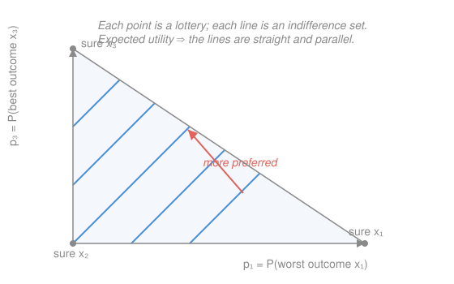

# Mathematical Microeconomics · Lesson 2.1: Expected utility

> ⏱ ~15 min · Module 2: Choice under uncertainty · Builds on: [1.1 Preferences, utility, and rational choice](01-01-preferences-utility.md), [`prob-stat-refresher` 2.1](../../prob-stat-refresher/lessons/02-01-expectation-variance-moments.md) · Unlocks: 2.2 (risk aversion)

## Why this matters

Almost every economic decision that matters — an investment, an insurance contract, a career, a lawsuit settlement — is a choice among *gambles*, not among certainties. Consumer theory (Module 1) ranked known bundles; now the objects of choice carry probabilities. The astonishing result of this lesson is that a short list of consistency axioms forces your preferences over gambles to take one specific form: rank each gamble by the **expected value of a utility number attached to its outcomes**. That single reduction — from "preferences over distributions" to "one number per outcome, then average" — is the workhorse of finance, insurance, and every model of risk that follows.

## The idea

A **lottery** is just a probability distribution over outcomes: "70% chance of 100 dollars, 30% chance of nothing." You have preferences over lotteries the same way you had preferences over grocery bundles — some gambles you like more than others.

The naive move is to rank a lottery by its expected *dollar* payoff. That fails instantly: nobody is indifferent between 1,000,000 dollars for sure and a coin flip between 2,000,000 and 0, even though the expected dollars are equal. The fix is not to average dollars but to average **utility** — attach a number $u(x)$ to each outcome $x$ first, *then* take the probability-weighted average of those numbers. A curved $u$ lets the sure million beat the coin flip, because the utility gained from the second million is smaller than the utility lost by risking the first.

The deep question is: *when* are your preferences over lotteries consistent enough to be captured by "average some $u$"? The von Neumann–Morgenstern theorem answers it exactly — four axioms, one of them (independence) doing the real work.

## The formal version

**Lotteries.** Fix a finite set of outcomes $\{x_1,\dots,x_n\}$. A **simple lottery** is $L=(p_1,\dots,p_n)$ with $p_s\ge 0$ and $\sum_s p_s = 1$, where $p_s$ is the probability of outcome $x_s$. Write $\mathcal{L}$ for the set of all lotteries. Lotteries can be **mixed**: for $\alpha\in[0,1]$, the compound lottery $\alpha L + (1-\alpha)L'$ is the gamble that runs $L$ with probability $\alpha$ and $L'$ with probability $1-\alpha$ (then pays out). *In words: a lottery is a bag of probabilities on outcomes, and you can toss two bags into a bigger bag.*

**Preferences.** The decision-maker has a preference relation $\succeq$ on $\mathcal{L}$ ($L\succeq L'$ = "$L$ at least as good as $L'$"). The **von Neumann–Morgenstern axioms**:

1. **Completeness & transitivity.** $\succeq$ is a rational preference relation: any two lotteries are comparable, and $L\succeq L'\succeq L''$ implies $L\succeq L''$. *In words: the same rationality demanded in [1.1](01-01-preferences-utility.md), now over gambles.*
2. **Continuity.** For any $L\succeq L'\succeq L''$, there is $\alpha\in[0,1]$ with $L'\sim \alpha L+(1-\alpha)L''$. *In words: no lottery is infinitely better than another — a probability mix can always tune you to indifference (this rules out lexicographic "safety at any cost").*
3. **Independence.** For all $L,L',L''$ and all $\alpha\in(0,1]$,
$$L\succeq L' \quad\Longleftrightarrow\quad \alpha L+(1-\alpha)L''\ \succeq\ \alpha L'+(1-\alpha)L''.$$
*In words: mixing both sides with the same third lottery $L''$ on the same odds cannot flip your ranking — the common branch $L''$ is irrelevant because it is identical on both sides. This is the load-bearing axiom, and the one people actually violate.*

**The expected utility theorem (von Neumann–Morgenstern).** If $\succeq$ satisfies axioms 1–3, then there exists a function $u:\{x_1,\dots,x_n\}\to\mathbb{R}$, the **vNM utility index**, such that for all lotteries $L=(p_s)$ and $L'=(q_s)$,
$$L\succeq L' \quad\Longleftrightarrow\quad \mathbb{E}_L[u]=\sum_{s} p_s\,u(x_s)\ \ \ge\ \ \sum_s q_s\,u(x_s)=\mathbb{E}_{L'}[u].$$
*In words: preferences that obey the axioms are represented by a utility number per outcome, averaged against the lottery's probabilities — the expected-value operator $\mathbb{E}[\cdot]$ from [`prob-stat-refresher` 2.1](../../prob-stat-refresher/lessons/02-01-expectation-variance-moments.md), applied to $u(x)$.* The representation $U(L)=\sum_s p_s u(x_s)$ is **linear in the probabilities** $p_s$ — this is exactly what independence buys, and it is the property an ordinal utility need not have.

**Cardinality.** The vNM index is **unique up to a positive affine transformation**: $\tilde u = a\,u + b$ with $a>0$ represents the *same* preferences, and no other transformations do.
$$\sum_s p_s\big(a\,u(x_s)+b\big) = a\sum_s p_s u(x_s) + b,$$
so scaling by $a>0$ and shifting by $b$ preserves every ranking. *In words: the zero and the unit of $u$ are free — like Celsius vs. Fahrenheit — but* differences *and their* ratios *carry meaning.* This is a genuine break from [1.1](01-01-preferences-utility.md), where $u$ was merely **ordinal**: there, *any* strictly increasing relabeling $\phi(u)$ represented the same preferences. Under uncertainty a nonlinear $\phi$ destroys the representation (Problem 2). vNM utility is **cardinal**.

## Picture

The Marschak–Machina triangle plots every lottery over three fixed outcomes $x_1<x_2<x_3$: horizontal axis $p_1=P(x_1)$, vertical axis $p_3=P(x_3)$, with $p_2=1-p_1-p_3$ implied. Because $U(L)=p_1u(x_1)+(1-p_1-p_3)u(x_2)+p_3u(x_3)$ is **linear** in $(p_1,p_3)$, its indifference sets are straight lines, and since the coefficients don't depend on where you are, they are **parallel**. That parallel-straight-line signature *is* the independence axiom drawn in probability space — bend or fan those lines and you have left expected utility (Allais, Problem 3).

## Worked examples

**Example 1 (mechanical — averaging utility, not dollars).** Let $u(x)=\sqrt{x}$ (so utility is concave). Compare the lottery $L=$ "50 dollars for sure" against $G=$ "100 dollars or 0, each with probability $\tfrac12$." They have equal expected *money*, $\mathbb{E}[x]=50$. But rank them by expected *utility*:
$$\mathbb{E}_G[u]=\tfrac12\sqrt{100}+\tfrac12\sqrt{0}=\tfrac12(10)+0=5,\qquad u(50)=\sqrt{50}\approx 7.07.$$
Since $7.07>5$, the sure 50 is strictly preferred. The concavity of $u$ made the coin flip worth *less* than its expected value — that gap is risk aversion, the whole subject of 2.2.

**Example 2 (why you'd care — the two things people confuse).** The comparison in Example 1 is the difference between
$$u\big(\mathbb{E}[x]\big)=u(50)\approx 7.07 \qquad\text{and}\qquad \mathbb{E}\big[u(x)\big]=5.$$
The left is "utility of the average outcome"; the right is "average of the utilities" — the actual vNM value of the gamble. For concave $u$, Jensen's inequality gives $u(\mathbb{E}[x])\ge \mathbb{E}[u(x)]$ always, with equality only for a degenerate (riskless) lottery. The **wedge** between them, here $7.07-5=2.07$ utils, is precisely what a risk-averse agent would pay to avoid the gamble — converted back to dollars, it becomes the *risk premium* of 2.2. Keeping these two expressions distinct is the single most common place students go wrong.

## Watch out

- You might think ranking lotteries by expected *dollars* $\mathbb{E}[x]$ is the theory. It is the theory only for the special linear $u(x)=x$ (risk neutrality); in general you average $u(x)$, and the curvature of $u$ is the entire content.
- You might think, as in [1.1](01-01-preferences-utility.md), that any increasing relabeling of $u$ is harmless. Under uncertainty it is **not**: only positive *affine* $au+b$ ($a>0$) preserves preferences. Squaring or square-rooting $u$ can reverse lottery rankings (Problem 2) — vNM utility is cardinal, not ordinal.
- You might read $u(x_s)$ as "the felt pleasure of $x_s$." It is only a bookkeeping index whose *expectation* ranks gambles; its cardinal content is about attitudes toward *risk*, not intensity of sensation. Don't smuggle in interpersonal or hedonic meaning.

## One-liner

> The vNM axioms — completeness, transitivity, continuity, and above all independence — force preferences over lotteries to rank by $\mathbb{E}_L[u]=\sum_s p_s u(x_s)$, a cardinal index unique up to $au+b$, $a>0$.

## Problems

**P1 (🟢)** An agent has vNM index $u(x)=\sqrt{x}$ over money. She faces gamble $G$: 16 dollars with probability $\tfrac34$, 0 with probability $\tfrac14$. (a) Compute $\mathbb{E}_G[u]$. (b) A sure amount $c$ of money has $\mathbb{E}[x]$ equal to $G$'s. Find $c$, compute $u(c)$, and state which she prefers and why.

**P2 (🟡)** Two lotteries over outcomes with utilities: $A$ pays an outcome worth $u=0$ or one worth $u=10$, each with probability $\tfrac12$; $B$ pays an outcome worth $u=4$ for sure. (a) Rank $A$ vs. $B$ under the vNM rule. (b) Apply the affine transform $\tilde u=2u+3$ and re-rank. (c) Apply the strictly increasing *nonlinear* transform $\phi(u)=\sqrt{u}$ and re-rank. Explain what (b) and (c) show about which relabelings a vNM index tolerates, contrasting with the ordinal utility of [1.1](01-01-preferences-utility.md).

**P3 (🔴)** *The Allais paradox.* Over prizes $\{0,\ 1\text{M},\ 5\text{M}\}$ (millions of dollars), consider:
- $L_1$: 1M for sure. $\quad L_1'$: (5M w.p. $0.10$; 1M w.p. $0.89$; 0 w.p. $0.01$).
- $L_2$: (1M w.p. $0.11$; 0 w.p. $0.89$). $\quad L_2'$: (5M w.p. $0.10$; 0 w.p. $0.90$).

The modal choices are $L_1\succ L_1'$ and $L_2'\succ L_2$. (a) Writing $u(0)=0$, $u(1\text{M})=u_1$, $u(5\text{M})=u_5$, show these two choices cannot both come from any vNM index. (b) Re-express each pair as a mixture of a common branch and expose the violation as a failure of the **independence** axiom directly.

Solutions

**P1** (a) $\mathbb{E}_G[u]=\tfrac34\sqrt{16}+\tfrac14\sqrt{0}=\tfrac34(4)+0=3.$

(b) $G$'s expected money is $\mathbb{E}[x]=\tfrac34(16)+\tfrac14(0)=12$, so $c=12$ and $u(c)=\sqrt{12}=2\sqrt3\approx 3.464.$ Since $u(c)\approx 3.464 > 3=\mathbb{E}_G[u]$, she strictly prefers the **sure 12 dollars**. The reason is concavity of $u$ (Jensen): $u(\mathbb{E}[x])>\mathbb{E}[u(x)]$ for a non-degenerate gamble, so trading the risk for its money-mean raises expected utility.

*Check:* both numbers are positive and $\sqrt{12}>\sqrt{9}=3$, so the inequality holds without appeal to decimals; the sure thing wins, consistent with concave $u$. ✓

**P2** (a) $\mathbb{E}_A[u]=\tfrac12(0)+\tfrac12(10)=5$; $\mathbb{E}_B[u]=4$. Since $5>4$, $A\succ B$.

(b) With $\tilde u=2u+3$: $\mathbb{E}_A[\tilde u]=\tfrac12(3)+\tfrac12(23)=13$; $\mathbb{E}_B[\tilde u]=2(4)+3=11$. Since $13>11$, still $A\succ B$ — the ranking is **unchanged**, because $\mathbb{E}[2u+3]=2\,\mathbb{E}[u]+3$ and $a=2>0$ preserves order.

(c) With $\phi(u)=\sqrt u$: $\mathbb{E}_A[\phi]=\tfrac12\sqrt0+\tfrac12\sqrt{10}=\tfrac{\sqrt{10}}{2}\approx 1.581$; $\mathbb{E}_B[\phi]=\sqrt4=2$. Now $2>1.581$, so $B\succ A$ — the ranking **reverses**.

*What it shows:* a vNM index is pinned down only up to a *positive affine* transform (part b): scaling and shifting leave $\mathbb{E}[\cdot]$-rankings intact. A *nonlinear* monotone transform (part c) is order-preserving on the utility *numbers* $0,4,10$ individually — exactly the freedom the **ordinal** utility of [1.1](01-01-preferences-utility.md) enjoys — yet it corrupts the *expectation* because $\mathbb{E}[\phi(u(X))]\ne\phi(\mathbb{E}[u(X)])$ once $\phi$ is curved. Ordinal utility survives any increasing relabeling; cardinal vNM utility survives only affine ones.

*Check:* the reversal in (c) is genuine — $A$ strictly beat $B$ under $u$ ($5$ vs $4$) and strictly loses under $\sqrt u$ ($1.581$ vs $2$) — so a nonlinear relabeling is not a mere rescaling of the same preferences. ✓

**P3** (a) $L_1\succ L_1'$ requires
$$u_1 \;>\; 0.10\,u_5 + 0.89\,u_1 + 0.01(0)\;\Longrightarrow\; 0.11\,u_1 \;>\; 0.10\,u_5.$$
$L_2'\succ L_2$ requires
$$0.10\,u_5 + 0.90(0) \;>\; 0.11\,u_1 + 0.89(0)\;\Longrightarrow\; 0.10\,u_5 \;>\; 0.11\,u_1.$$
Together: $0.11u_1>0.10u_5$ **and** $0.10u_5>0.11u_1$, i.e. $0.11u_1>0.11u_1$ — a contradiction. No vNM index $(u_1,u_5)$ rationalizes both choices.

(b) Let $Y=(5\text{M w.p. }\tfrac{10}{11};\ 0\text{ w.p. }\tfrac{1}{11})$ and let $\delta_{1\text{M}}$ denote "1M for sure." Then, mixing with weight $\alpha=0.11$:
$$L_1 = 0.11\,\delta_{1\text{M}} + 0.89\,\delta_{1\text{M}}, \qquad L_1' = 0.11\,Y + 0.89\,\delta_{1\text{M}},$$
$$L_2 = 0.11\,\delta_{1\text{M}} + 0.89\,\delta_{0}, \qquad\ \ L_2' = 0.11\,Y + 0.89\,\delta_{0}.$$
(Verify $L_1'$: $0.11\,Y$ puts $0.11\cdot\tfrac{10}{11}=0.10$ on 5M and $0.11\cdot\tfrac1{11}=0.01$ on 0, plus $0.89$ on 1M — matches. Likewise $L_2'$ puts $0.10$ on 5M and $0.01+0.89=0.90$ on 0 — matches.)

Each pair is the *same* mixture — weight $0.11$ on either $\delta_{1\text{M}}$ (the "a" side) or $Y$ (the "$\ ' $" side) — differing only in the common branch $L''$: it is $\delta_{1\text{M}}$ in pair 1 and $\delta_0$ in pair 2. **Independence** says the ranking of $\delta_{1\text{M}}$ vs. $Y$ must not depend on that common branch. But $L_1\succ L_1'$ means $\delta_{1\text{M}}\succ Y$, while $L_2'\succ L_2$ means $Y\succ \delta_{1\text{M}}$. The common branch flipped the ranking — a direct violation of independence.

*Check:* the algebraic contradiction in (a) and the reversed $\delta_{1\text{M}}$-vs-$Y$ ranking in (b) are two views of one fact — non-parallel indifference "fanning" in the triangle of the Picture. The Allais choices are empirically robust, which is why independence is the axiom under the most scrutiny. ✓

## Flashback

**From Lesson 1.1 (Preferences, utility, and rational choice):** A consumer has Cobb–Douglas utility $u(x_1,x_2)=x_1^{1/3}x_2^{2/3}$. Compute the marginal rate of substitution $\mathrm{MRS}_{12}=\dfrac{\partial u/\partial x_1}{\partial u/\partial x_2}$ at the bundle $(x_1,x_2)=(2,4)$, and say in one line what the number means.

Solution

$$\frac{\partial u}{\partial x_1}=\tfrac13 x_1^{-2/3}x_2^{2/3},\qquad \frac{\partial u}{\partial x_2}=\tfrac23 x_1^{1/3}x_2^{-1/3}.$$
$$\mathrm{MRS}_{12}=\frac{\tfrac13 x_1^{-2/3}x_2^{2/3}}{\tfrac23 x_1^{1/3}x_2^{-1/3}}=\frac{1}{2}\cdot\frac{x_2}{x_1}.$$
At $(2,4)$: $\mathrm{MRS}_{12}=\tfrac12\cdot\tfrac{4}{2}=1.$

*Meaning:* at this bundle the consumer will give up exactly **1 unit of good 2 to gain 1 unit of good 1** and stay on the same indifference curve — the slope of that curve is $-1$ there.

*Check:* the exponents sum to $1$, so this is a standard Cobb–Douglas, and the clean $\mathrm{MRS}=\tfrac12(x_2/x_1)$ form (ratio of exponents times the good ratio) is the textbook result; plugging $(2,4)$ gives $1>0$ as an $\mathrm{MRS}$ must. ✓

## Connections

- **Backward:** the axioms extend the rational-preference machinery of [1.1](01-01-preferences-utility.md) from bundles to lotteries; independence and continuity are the *new* content, and they promote $u$ from ordinal to cardinal. The averaging is the expectation operator from [`prob-stat-refresher` 2.1](../../prob-stat-refresher/lessons/02-01-expectation-variance-moments.md) — here $\mathbb{E}[u(x)]$ instead of $\mathbb{E}[x]$.
- **Forward:** [2.2](02-02-risk-aversion.md) reads the *shape* of $u$: the wedge $u(\mathbb{E}[x])-\mathbb{E}[u(x)]$ from Example 2 becomes the risk premium, concavity becomes risk aversion, and its curvature $-u''/u'$ becomes the Arrow–Pratt coefficient. Boss problem 2 (a CRRA investor's portfolio) is built entirely on this representation.
- **Sideways (finance / decision theory):** expected utility is the foundation of asset pricing, insurance, and every "maximize expected payoff of a curved objective" model; the Allais paradox is the doorway to prospect theory and behavioral economics, which the course deliberately leaves aside but which starts exactly where independence breaks.
