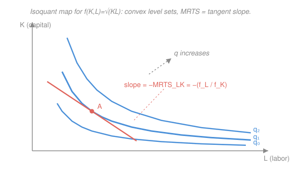

# Mathematical Microeconomics · Lesson 3.1: Technology and production

> ⏱ ~15 min · Module 3: Producer theory · Builds on: [1.1 Preferences, utility, and rational choice](01-01-preferences-utility.md) · Unlocks: 3.2 (cost minimization)

## Why this matters

Everything the firm does downstream — its cost function, its supply curve, its response to a wage hike — is already encoded in one object: its **technology**. Before you can minimize cost (3.2) or maximize profit (3.3), you need a clean description of what outputs the inputs can make and how the trade-off between inputs bends. The payoff of this lesson is that producer theory is *the same convex-analysis machine as consumer theory*, relabeled: the production function plays the role of utility, isoquants are indifference curves, and the marginal rate of technical substitution is the firm's MRS. Learn it once, use it twice.

## The idea

A firm turns inputs — say capital $K$ (machines, land) and labor $L$ (worker-hours) — into output $q$. The **production function** $q=f(K,L)$ records the *most* output obtainable from each input bundle. Hold output fixed at some level and ask "which input mixes produce exactly this much?": the answer is a curve in the $(L,K)$ plane called an **isoquant** (Latin: "equal quantity"), the producer's version of an indifference curve.

Two questions organize the whole subject. First, **substitution**: standing on an isoquant, if I shed one worker, how much extra capital keeps output unchanged? That trade-off rate is the slope of the isoquant. Second, **scale**: if I double *both* inputs, does output exactly double, more than double, or less? That's returns to scale — a statement about the *whole ray* out from the origin, not the local trade-off.

These are independent axes. A technology can double output when you double inputs (constant returns to scale) while still making capital and labor easy — or nearly impossible — to swap for each other. The first is about moving *along* an isoquant; the second is about moving *between* isoquants.

## The formal version

Let $f(K,L)$ be the production function, assumed increasing and (where we need it) twice differentiable and **quasi-concave** — the exact regularity we imposed on utility in [1.1](01-01-preferences-utility.md).

**Marginal and average products.** The **marginal product** of a factor is the extra output from one more unit of it, the others held fixed:
$$\mathrm{MP}_L=\frac{\partial f}{\partial L}=f_L,\qquad \mathrm{MP}_K=\frac{\partial f}{\partial K}=f_K.$$
The **average product** is output per unit of the factor, $\mathrm{AP}_L=f/L$. *In words:* $\mathrm{MP}_L$ is the slope of the output–labor curve; $\mathrm{AP}_L$ is the slope of the ray to it. **Diminishing marginal product** means $f_{LL}<0$: each added worker adds less than the last, with capital fixed. (This is a statement about *one* input — logically separate from returns to scale, which varies *all* inputs.)

**Isoquants and the MRTS.** The isoquant at level $q_0$ is the level set $\{(K,L):f(K,L)=q_0\}$. Total-differentiate $f=q_0$ along it: $f_K\,dK+f_L\,dL=0$, so its slope is $dK/dL=-f_L/f_K$. The **marginal rate of technical substitution** is the magnitude of that slope,
$$\mathrm{MRTS}_{LK}=\frac{f_L}{f_K}=-\frac{dK}{dL}\Big|_{f=q_0},$$
the amount of capital that exactly replaces one unit of labor. *In words:* it is the ratio of marginal products, and it is the producer's MRS — literally the same tangency object as [1.1](01-01-preferences-utility.md)'s $\mathrm{MRS}=u_1/u_2$. Quasi-concavity of $f$ makes isoquants **convex to the origin**, so $\mathrm{MRTS}_{LK}$ *falls* as you slide toward more labor: the more labor you already use, the less capital a further worker frees up.

**Returns to scale.** Scale all inputs by $t>1$. Compare $f(tK,tL)$ to $t\,f(K,L)$:
$$f(tK,tL)\;\gtrless\;t\,f(K,L)\iff \text{increasing / constant / decreasing returns to scale.}$$
When $f$ is **homogeneous of degree $r$** — meaning $f(tK,tL)=t^{r}f(K,L)$ — the verdict is just the number $r$: returns are increasing, constant, or decreasing as $r\gtrless 1$. *In words:* $r$ is the elasticity of output with respect to a uniform expansion of all inputs.

**Elasticity of substitution.** Convexity says $\mathrm{MRTS}$ falls as the factor ratio $K/L$ falls, but not *how fast* — the curvature of the isoquant. The **elasticity of substitution** $\sigma$ measures exactly that: the percentage change in the factor ratio per percentage change in the MRTS, moving along an isoquant,
$$\sigma=\frac{d\ln(K/L)}{d\ln \mathrm{MRTS}_{LK}}\;\ge 0.$$
*In words:* how easily capital stands in for labor. Two poles: $\sigma=\infty$ means **perfect substitutes** (straight-line isoquants — one input is just so many units of the other), and $\sigma=0$ means **fixed proportions / Leontief**, $f=\min\{K/a,\,L/b\}$, with L-shaped isoquants where the ratio $K/L=a/b$ is locked regardless of prices.

**The CES family.** These live on a dial. The **constant-elasticity-of-substitution** production function
$$f(K,L)=A\big[\alpha K^{\rho}+(1-\alpha)L^{\rho}\big]^{1/\rho},\qquad \sigma=\frac{1}{1-\rho},\ \ \rho\le 1,$$
where $A>0$ scales output and $\alpha\in(0,1)$ weights the factors, has one constant $\sigma$ everywhere. Its limits sweep the whole range: $\rho=1$ gives $\sigma=\infty$ (perfect substitutes), $\rho\to-\infty$ gives $\sigma=0$ (Leontief), and $\rho\to 0$ gives $\sigma=1$ — **Cobb–Douglas** $f=A\,K^{\alpha}L^{1-\alpha}$, the knife-edge case where factor cost shares stay constant no matter the prices.

## Picture

Three isoquants of $f(K,L)=\sqrt{KL}$; output rises to the northeast. At $A$ the tangent's steepness *is* $\mathrm{MRTS}_{LK}=f_L/f_K$. Compare [1.1](01-01-preferences-utility.md)'s indifference map — same convex level sets, same tangent-slope story, different labels.

## Worked examples

**Example 1 (mechanical — read the technology off $f$).** Take $f(K,L)=K^{1/2}L^{1/2}$ (the figure). The marginal products are
$$f_L=\tfrac12 K^{1/2}L^{-1/2}=\tfrac12\sqrt{K/L},\qquad f_K=\tfrac12 K^{-1/2}L^{1/2}=\tfrac12\sqrt{L/K}.$$
$f_L$ falls as $L$ grows — diminishing marginal product of labor. The average product $\mathrm{AP}_L=f/L=\sqrt{K/L}=2f_L$, so here $\mathrm{AP}_L$ is exactly twice $\mathrm{MP}_L$. The MRTS is
$$\mathrm{MRTS}_{LK}=\frac{f_L}{f_K}=\frac{\tfrac12\sqrt{K/L}}{\tfrac12\sqrt{L/K}}=\frac{K}{L},$$
which shrinks as you substitute toward labor — the isoquant flattens, exactly as drawn. Scale test: $f(tK,tL)=(tK)^{1/2}(tL)^{1/2}=t\,f(K,L)$, so $r=1$, constant returns.

**Example 2 (why you'd care — substitution governs the response to a wage hike).** Two firms, same output, react to labor getting expensive. A Cobb–Douglas firm ($\sigma=1$) slides smoothly up its isoquant, swapping in capital and economizing on labor; the factor ratio $K/L$ adjusts by exactly the percentage change in the MRTS. A Leontief firm ($\sigma=0$) is stuck at the corner $K/L=a/b$: it cannot substitute at all, so a wage hike passes straight through to cost with no change in the input mix. That single number $\sigma$ — the isoquant's curvature here — is what 3.2 will turn into the *shape* of conditional factor demand and how sensitive it is to input prices. Returns to scale $r$, meanwhile, becomes the shape of long-run average cost: $r>1$ gives falling average cost (natural-monopoly territory), $r=1$ gives flat, $r<1$ rising.

## Watch out

- You might think diminishing marginal product and decreasing returns to scale are the same thing. They are independent: $f=K^{1/2}L^{1/2}$ has *both* marginal products diminishing ($f_{LL},f_{KK}<0$) yet **constant** returns to scale ($r=1$). One varies a single input; the other scales all inputs together.
- You might think a low MRTS means inputs are hard to substitute. No — the MRTS is the *slope* (a level), while substitutability is the *curvature* $\sigma$. Perfect substitutes and Leontief can share the same MRTS at a point yet sit at opposite extremes of $\sigma$.
- You might read "$\alpha$" in Cobb–Douglas $K^{\alpha}L^{1-\alpha}$ as a productivity level. It isn't $A$; it's the capital cost *share*. Under Cobb–Douglas that share is constant regardless of prices — the fingerprint of $\sigma=1$.

## One-liner

> Technology is utility wearing a hard hat: isoquants are indifference curves, the MRTS is the MRS, and two numbers summarize a firm — $\sigma$ for how easily inputs swap, $r$ for what happens when you scale them all.

## Problems

**P1 (🟢)** For the Cobb–Douglas technology $f(K,L)=K^{a}L^{b}$ with $a,b>0$: (i) compute $\mathrm{MRTS}_{LK}$, and (ii) determine the returns to scale from $a$ and $b$.

**P2 (🟡)** Show that Cobb–Douglas has elasticity of substitution $\sigma=1$ by computing it from the definition, and contrast with Leontief $f=\min\{K/a,L/b\}$, where $\sigma=0$. What is it about the Leontief isoquant that forces $\sigma=0$?

**P3 (🔴)** Let $f(K,L)$ be homogeneous of degree $r$. Prove **Euler's theorem**, $K f_K+L f_L=r f$, by differentiating the homogeneity identity. Then interpret it: with each factor paid its marginal product, what does the theorem say about whether total factor payments exhaust output under constant returns?

Solutions

**P1** (i) $f_L=b\,K^{a}L^{b-1}$ and $f_K=a\,K^{a-1}L^{b}$, so
$$\mathrm{MRTS}_{LK}=\frac{f_L}{f_K}=\frac{b\,K^{a}L^{b-1}}{a\,K^{a-1}L^{b}}=\frac{b}{a}\cdot\frac{K}{L}=\frac{bK}{aL}.$$
(ii) $f(tK,tL)=(tK)^{a}(tL)^{b}=t^{a+b}K^{a}L^{b}=t^{a+b}f(K,L)$, so $f$ is homogeneous of degree $r=a+b$. Returns are **increasing if $a+b>1$, constant if $a+b=1$, decreasing if $a+b<1$**.
*Check:* the Example-1 case $a=b=\tfrac12$ gives $\mathrm{MRTS}=K/L$ and $r=1$. ✓

**P2** Use $\sigma=\dfrac{d\ln(K/L)}{d\ln \mathrm{MRTS}_{LK}}$. From P1, $\mathrm{MRTS}_{LK}=\dfrac{b}{a}\cdot\dfrac{K}{L}$, so
$$\ln \mathrm{MRTS}_{LK}=\ln\tfrac{b}{a}+\ln\frac{K}{L}\ \Longrightarrow\ \ln\frac{K}{L}=\ln \mathrm{MRTS}_{LK}-\ln\tfrac{b}{a}.$$
Differentiating, $\dfrac{d\ln(K/L)}{d\ln \mathrm{MRTS}_{LK}}=1$, so $\sigma=1$ for every $(K,L)$ — independent of the exponents. (Corroboration: Cobb–Douglas is the $\rho\to0$ member of CES, where $\sigma=1/(1-\rho)\to1$.)

Leontief: on an isoquant, output $=\min\{K/a,L/b\}$ is pinned by the *smaller* term, so the efficient point sits at the corner $K/a=L/b$, i.e. the ratio $K/L=a/b$ is **fixed**. Along the isoquant $\ln(K/L)$ never changes, while the MRTS jumps from $\infty$ (vertical arm) to $0$ (horizontal arm) across the kink. Hence $d\ln(K/L)=0$ for any change in the MRTS, giving $\sigma=0$: no substitution is possible.
*Check:* the two poles bracket the CES dial — $\sigma=1$ at $\rho=0$, $\sigma=0$ at $\rho\to-\infty$. ✓

**P3** Homogeneity of degree $r$ is the identity $f(tK,tL)=t^{r}f(K,L)$ for all $t>0$. Differentiate both sides with respect to $t$. Left side, by the chain rule,
$$\frac{d}{dt}f(tK,tL)=f_K(tK,tL)\cdot K+f_L(tK,tL)\cdot L,$$
and the right side gives $r\,t^{r-1}f(K,L)$. Evaluate at $t=1$:
$$K\,f_K(K,L)+L\,f_L(K,L)=r\,f(K,L).\qquad\blacksquare$$
*Interpretation.* Pay each factor its marginal product — real rental $f_K$ to capital, real wage $f_L$ to labor. Total factor payments are $K f_K+L f_L=r f$. Under **constant returns** ($r=1$) this equals $f$ exactly: marginal-product payments **exhaust output**, leaving zero residual — the product-exhaustion (adding-up) theorem. Under increasing returns ($r>1$) the payments $rf>f$ overshoot output (unsustainable — the firm cannot pay everyone their marginal product), and under decreasing returns ($r<1$) they fall short, leaving a positive residual.
*Check:* for $f=K^{a}L^{b}$, $\;Kf_K+Lf_L=K\!\cdot\!aK^{a-1}L^{b}+L\!\cdot\!bK^{a}L^{b-1}=(a+b)K^{a}L^{b}=r f$ with $r=a+b$. ✓

## Flashback

**From Lesson 1.1 (Preferences, utility, and rational choice):** For the utility function $u(x_1,x_2)=\sqrt{x_1}+\sqrt{x_2}$, (a) compute the $\mathrm{MRS}_{12}$ and confirm it diminishes along an indifference curve, and (b) argue that $u$ is quasi-concave (preferences convex).

Solution

(a) $u_1=\tfrac12 x_1^{-1/2}$, $u_2=\tfrac12 x_2^{-1/2}$, so
$$\mathrm{MRS}_{12}=\frac{u_1}{u_2}=\frac{x_2^{1/2}}{x_1^{1/2}}=\sqrt{\frac{x_2}{x_1}}.$$
Moving along an indifference curve toward more $x_1$ (so $x_2$ falls), the ratio $x_2/x_1$ drops, hence $\mathrm{MRS}_{12}$ **diminishes** — convex-to-origin indifference curves.

(b) Each term $\sqrt{x_i}$ is concave (second derivative $-\tfrac14 x_i^{-3/2}<0$), and a sum of concave functions is concave; so $u$ is concave. Concavity implies quasi-concavity, so upper contour sets $\{x:u(x)\ge \bar u\}$ are convex — preferences are convex.
*Check:* diminishing MRS and convex upper contour sets are two faces of the same quasi-concavity — exactly the producer-side convexity that makes this lesson's isoquants bow toward the origin. ✓

## Connections

- **Backward:** this is [1.1](01-01-preferences-utility.md)'s convex-analysis toolkit relabeled — production function $\leftrightarrow$ utility, isoquant $\leftrightarrow$ indifference curve, $\mathrm{MRTS}\leftrightarrow\mathrm{MRS}$, quasi-concavity giving convex level sets in both.
- **Forward:** [3.2](03-02-cost-minimization.md) minimizes cost by setting $\mathrm{MRTS}_{LK}=w/v$ (input-price ratio) — the exact tangency mirror of 1.2's $\mathrm{MRS}=$ price ratio; $\sigma$ becomes the price-elasticity of conditional factor demand and $r$ becomes the shape of average cost.
- **Sideways (the math):** Euler's theorem (P3) recurs whenever homogeneity meets marginal analysis — it is the same identity behind constant expenditure shares in Cobb–Douglas demand and the zero-degree homogeneity of Marshallian demand in [1.2](01-02-utility-maximization-marshallian-demand.md).
