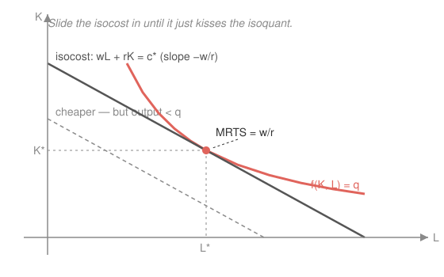

# Mathematical Microeconomics · Lesson 3.2: Cost minimization and the cost function

> ⏱ ~15 min · Module 3: Producer theory · Builds on: [3.1 Technology and production](03-01-technology-production.md), [1.3 Duality — expenditure minimization and Hicksian demand](01-03-duality-expenditure-hicksian.md) · Unlocks: 3.3 (profit maximization)

## Why this matters

A firm can't choose its supply until it knows what output *costs* — and cost isn't a datum, it's the answer to an optimization: given the target output $q$ and input prices, what is the cheapest input mix that gets you there? The value function of that problem, the **cost function** $c(w,r,q)$, is the single object [3.3](03-03-profit-maximization-supply.md) differentiates to get marginal cost, supply, and profit. And it is not a new animal: it is the firm's twin of the consumer's expenditure function from [1.3](01-03-duality-expenditure-hicksian.md) — same dual structure, same Shephard's lemma, same envelope logic, with output $q$ playing the role utility $u$ played there.

## The idea

Fix the output you must produce and draw its **isoquant** — every input bundle $(K,L)$ that makes exactly $q$ (the producer's "indifference curve," from [3.1](03-01-technology-production.md)). Now draw an **isocost** line — every bundle costing the same total $wL+rK$; its slope is $-w/r$, the market's exchange rate between the two inputs. Cheaper isocosts sit closer to the origin. So minimizing cost is: slide the isocost inward until it *just touches* the isoquant. It touches at a tangency, and there the two slopes agree —

$$\underbrace{\text{how the firm can trade } K \text{ for } L \text{ (technology)}}_{\text{MRTS}} \;=\; \underbrace{\text{how the market trades them (prices)}}_{w/r}.$$

If they disagreed you could slide along the isoquant — same output — toward the cheaper corner and save money. This is *exactly* the consumer sliding a budget line onto an indifference curve (the expenditure-minimization picture of [1.3](01-03-duality-expenditure-hicksian.md)): output replaces utility, input prices replace goods prices. Cost minimization **is** expenditure minimization, wearing a factory uniform.

## The formal version

Let $L$ be labor, $K$ capital, with prices $w$ (the wage) and $r$ (the rental rate of capital). The technology is a production function $f(K,L)$, and $q$ is the required output. The **cost-minimization problem (CMP)** is

$$c(w,r,q) \;=\; \min_{K,\,L\,\ge\,0} \; wL + rK \quad\text{subject to}\quad f(K,L) \ge q.$$

*In words:* over all input bundles that can produce at least $q$, pick the one with the smallest bill; the minimum bill, as a function of prices and output, **is** $c(w,r,q)$.

**The tangency FOC.** With $f$ increasing (so the constraint binds, $f(K,L)=q$) and quasi-concave, form the Lagrangian $\mathcal{L}=wL+rK-\lambda\bigl(f(K,L)-q\bigr)$. The interior first-order conditions are

$$w=\lambda f_L,\qquad r=\lambda f_K \;\;\Longrightarrow\;\; \frac{f_L}{f_K}=\frac{w}{r},\qquad\text{i.e.}\quad \mathrm{MRTS}_{LK}=\frac{w}{r}.$$

*In words:* the marginal rate of technical substitution — the slope of the isoquant, $f_L/f_K$ — equals the input-price ratio. The multiplier $\lambda=w/f_L=r/f_K$ is marginal cost: the extra spend to relax $q$ by one unit. Equivalently, the last dollar buys the same marginal product wherever spent: $f_L/w=f_K/r$.

**The solutions.** The minimizing bundle, as a function of what's given, is the pair of **conditional factor demands** $L(w,r,q)$ and $K(w,r,q)$ — "conditional" because they are conditioned on producing exactly $q$ (unlike the *unconditional* factor demands of [3.3](03-03-profit-maximization-supply.md), where $q$ is itself chosen). Their cost is the **cost function** $c(w,r,q)=wL(w,r,q)+rK(w,r,q)$.

**Properties of $c$** (identical to the expenditure function's, [1.3](01-03-duality-expenditure-hicksian.md), with $q\leftrightarrow u$):

1. **Nondecreasing** in $w$, in $r$, and in $q$ (a pricier input or more output never lowers the cheapest bill).
2. **Homogeneous of degree 1 in $(w,r)$**: $c(\alpha w,\alpha r,q)=\alpha\,c(w,r,q)$. Scaling both input prices scales the bill but not the optimal *mix* — so the conditional demands are homogeneous of degree **0** in $(w,r)$.
3. **Concave in $(w,r)$.** If one input's price rises, the firm substitutes away, so cost grows *less* than linearly than if the mix were frozen — the hallmark of a minimized value function.
4. **Continuous** in $(w,r,q)$.

**Shephard's lemma (for the firm).** Wherever $c$ is differentiable,

$$\boxed{\;\frac{\partial c}{\partial w}=L(w,r,q),\qquad \frac{\partial c}{\partial r}=K(w,r,q).\;}$$

*In words:* the price-derivative of minimized cost is the conditional demand for that input. This is the **envelope theorem**: at the optimum the indirect effect of a price change (through re-optimizing $K,L$) is zero to first order, so only the direct effect $\partial(wL+rK)/\partial w=L$ survives. It is *literally* Shephard's lemma from [1.3](01-03-duality-expenditure-hicksian.md), $\partial e/\partial p_i=h_i$, with $c\leftrightarrow e$ and conditional demand $\leftrightarrow$ Hicksian demand. (Concavity of $c$ then says the conditional demand for an input slopes down in its own price: $\partial L/\partial w=\partial^2 c/\partial w^2\le 0$.)

> **The duality, in one line.** CMP is the EMP of the firm. Isoquant $\leftrightarrow$ indifference curve, isocost $\leftrightarrow$ budget line, $q\leftrightarrow u$, $\mathrm{MRTS}=w/r \leftrightarrow \mathrm{MRS}=p_1/p_2$, $c(w,r,q)\leftrightarrow e(p,u)$, conditional demand $\leftrightarrow$ Hicksian demand. Learn one, you own both.

**Short run vs. long run.** If capital is fixed at $\bar K$ in the short run, only $L$ adjusts to meet $q$: solve $f(\bar K,L)=q$ for $L$, giving short-run cost $c_{SR}(w,r,q\mid\bar K)=wL+r\bar K$. Because the long run optimizes over $K$ too, $c(w,r,q)\le c_{SR}(w,r,q\mid\bar K)$ for every $\bar K$, with equality only at the $\bar K$ the long run would have chosen. So the long-run cost curve is the **lower envelope** of all the short-run curves.

**Returns to scale shape average cost.** From [3.1](03-01-technology-production.md), if $f$ is homogeneous of degree $t$ — $f(\alpha K,\alpha L)=\alpha^{t}f(K,L)$ — then (Problem 3) $c(w,r,q)=q^{1/t}\,c(w,r,1)$, so average cost $AC=c/q\propto q^{(1-t)/t}$:

$$t>1\ (\text{IRS})\Rightarrow AC\text{ falls};\qquad t=1\ (\text{CRS})\Rightarrow AC\text{ flat},\ c\text{ linear in }q;\qquad t<1\ (\text{DRS})\Rightarrow AC\text{ rises}.$$

## Picture

## Worked examples

**Example 1 (mechanical — tangency solved).** Take $f(K,L)=\sqrt{KL}$ (Cobb–Douglas with equal exponents $\tfrac12$, so CRS). Here $f_L=\tfrac12\sqrt{K/L}$, $f_K=\tfrac12\sqrt{L/K}$, so $\mathrm{MRTS}_{LK}=f_L/f_K=K/L$. Tangency $K/L=w/r$ gives $K=\dfrac{w}{r}L$. Impose the constraint $\sqrt{KL}=q$, i.e. $KL=q^2$:

$$\frac{w}{r}L^2=q^2 \;\Rightarrow\; L(w,r,q)=q\sqrt{\tfrac{r}{w}},\qquad K(w,r,q)=\frac{w}{r}L=q\sqrt{\tfrac{w}{r}}.$$

Then $c=wL+rK=q\sqrt{wr}+q\sqrt{wr}=2q\sqrt{wr}$. Check the properties: $c$ is homogeneous degree 1 in $(w,r)$ ✓, and linear in $q$ ✓ (CRS, $t=1$). Shephard: $\partial c/\partial w=2q\cdot\tfrac{\sqrt r}{2\sqrt w}=q\sqrt{r/w}=L$ ✓.

**Example 2 (why the FOC isn't the whole story — a corner).** Take fixed-proportions (Leontief) technology $f(K,L)=\min\{K,L\}$: one machine needs exactly one worker, extras are wasted. There is *no* interior tangency — the isoquants are L-shaped, $\mathrm{MRTS}$ is undefined at the kink. But the cheapest way to make $q$ is obvious: never buy a wasted unit, so $K=L=q$, and $c(w,r,q)=(w+r)\,q$. The lesson: the tangency FOC is the tool for *smooth, strictly convex* isoquants; corners and boundaries are solved by inspection of the CMP directly. (Cost is still homogeneous degree 1 in $(w,r)$ and — being CRS — linear in $q$; Shephard still holds: $\partial c/\partial w=q=L$.)

## Watch out

- **$\mathrm{MRTS}=w/r$ is an interior, smooth-isoquant condition, not a law.** Leontief (Example 2) and any solution that hits an axis ($L=0$ or $K=0$) violate it; check the CMP directly there.
- **The cost function knows prices and $q$ — never the *output* price.** $c(w,r,q)$ answers "cheapest way to make $q$," full stop. What $q$ is *worth* selling enters only in [3.3](03-03-profit-maximization-supply.md)'s profit problem. That's why these demands are called *conditional*.
- **Homogeneity degree 1 is in the input prices $(w,r)$, not in $q$.** Doubling $w$ and $r$ doubles cost; doubling $q$ multiplies cost by $2^{1/t}$ — only equal to $2$ under CRS.
- **Short-run cost is never below long-run cost.** Fewer margins to optimize can't help; if you ever "beat" the long-run curve, you mislabeled a fixed input as free.

## One-liner

> The cost function is the firm's expenditure function — slide the isocost onto the isoquant until $\mathrm{MRTS}=w/r$, and Shephard hands you the conditional factor demand as $\partial c/\partial w$.

## Problems

**P1 (🟢)** For the Cobb–Douglas technology $f(K,L)=K^{a}L^{b}$ with $a,b>0$, derive the conditional factor demands $L(w,r,q)$, $K(w,r,q)$ and the cost function $c(w,r,q)$.

**P2 (🟡)** Using your $c(w,r,q)$ from P1, verify Shephard's lemma $\partial c/\partial w=L(w,r,q)$, and confirm directly that $c$ is homogeneous of degree 1 in $(w,r)$.

**P3 (🔴)** Let $f$ be homogeneous of degree $t>0$: $f(\alpha K,\alpha L)=\alpha^{t}f(K,L)$ for all $\alpha>0$. Show $c(w,r,q)=q^{1/t}\,c(w,r,1)$, hence $c\propto q^{1/t}$, and deduce that average cost falls (IRS, $t>1$), is flat (CRS, $t=1$), or rises (DRS, $t<1$) with $q$.

Solutions

**P1.** With $f=K^{a}L^{b}$: $f_L=bK^{a}L^{b-1}$, $f_K=aK^{a-1}L^{b}$, so

$$\mathrm{MRTS}_{LK}=\frac{f_L}{f_K}=\frac{b}{a}\cdot\frac{K}{L}=\frac{w}{r}\;\Longrightarrow\;K=\frac{a}{b}\,\frac{w}{r}\,L.$$

Substitute into the binding constraint $K^{a}L^{b}=q$. Writing $s\equiv a+b$:

$$\left(\frac{a\,w}{b\,r}\right)^{a}L^{a}\cdot L^{b}=q\;\Longrightarrow\;L^{s}=q\left(\frac{b\,r}{a\,w}\right)^{a}\;\Longrightarrow\;\boxed{L(w,r,q)=q^{1/s}\left(\frac{b\,r}{a\,w}\right)^{a/s}}.$$

From $K=\tfrac{a}{b}\tfrac{w}{r}L$,

$$\boxed{K(w,r,q)=q^{1/s}\left(\frac{a\,w}{b\,r}\right)^{b/s}}.$$

Cost $c=wL+rK$. Compute each piece (using $1-\tfrac{a}{s}=\tfrac{b}{s}$):

$$wL=q^{1/s}\,w^{b/s}r^{a/s}\left(\tfrac{b}{a}\right)^{a/s},\qquad rK=q^{1/s}\,w^{b/s}r^{a/s}\left(\tfrac{a}{b}\right)^{b/s}.$$

(Note $wL/rK=b/a$: input cost shares are the output elasticities, as for any CD.) Adding and simplifying the bracket $\bigl(\tfrac{b}{a}\bigr)^{a/s}+\bigl(\tfrac{a}{b}\bigr)^{b/s}=a^{-a/s}b^{-b/s}\bigl(a^{(a+b)/s}+b^{(a+b)/s}\bigr)=\dfrac{a+b}{a^{a/s}b^{b/s}}$ gives the clean form

$$\boxed{\,c(w,r,q)=(a+b)\,q^{\,1/(a+b)}\left(\frac{w}{b}\right)^{b/(a+b)}\left(\frac{r}{a}\right)^{a/(a+b)}.}$$

*Check:* set $a=b=\tfrac12$ ($s=1$): $c=1\cdot q\cdot(w/\tfrac12)^{1/2}(r/\tfrac12)^{1/2}=q\sqrt{2w}\sqrt{2r}=2q\sqrt{wr}$ — matches Example 1. ✓

**P2.** Write $c=(a+b)\,q^{1/s}\,b^{-b/s}\,a^{-a/s}\,r^{a/s}\,w^{b/s}$ with $s=a+b$. Differentiate in $w$ (only $w^{b/s}$ depends on it):

$$\frac{\partial c}{\partial w}=(a+b)\cdot\frac{b}{s}\cdot q^{1/s}b^{-b/s}a^{-a/s}r^{a/s}\,w^{b/s-1}.$$

Since $(a+b)\tfrac{b}{s}=b$ and $\tfrac{b}{s}-1=-\tfrac{a}{s}$,

$$\frac{\partial c}{\partial w}=b\,q^{1/s}\,b^{-b/s}a^{-a/s}\,r^{a/s}w^{-a/s}=q^{1/s}\,b^{a/s}a^{-a/s}\,(r/w)^{a/s}=q^{1/s}\left(\frac{b\,r}{a\,w}\right)^{a/s}=L(w,r,q).\ \checkmark$$

(Used $b^{\,1-b/s}=b^{a/s}$.) Homogeneity: replace $(w,r)\to(\alpha w,\alpha r)$. The price factor is $w^{b/s}r^{a/s}$, of total degree $\tfrac{b}{s}+\tfrac{a}{s}=1$, so $c(\alpha w,\alpha r,q)=\alpha^{1}c(w,r,q)$ — degree 1. ✓ (And $L,K$ depend on $r/w$ only, so degree 0. ✓)

**P3.** Let $(K_1,L_1)$ solve the CMP for output $1$ at prices $(w,r)$, so $f(K_1,L_1)=1$ and $c(w,r,1)=wL_1+rK_1$. Set $\alpha=q^{1/t}$ and scale: $f(\alpha K_1,\alpha L_1)=\alpha^{t}f(K_1,L_1)=q\cdot 1=q$, so $(\alpha K_1,\alpha L_1)$ is feasible for $q$ at cost $\alpha(wL_1+rK_1)=q^{1/t}c(w,r,1)$. Hence

$$c(w,r,q)\le q^{1/t}\,c(w,r,1).$$

Conversely, let $(K_q,L_q)$ solve the CMP for $q$, so $f(K_q,L_q)=q$ and $c(w,r,q)=wL_q+rK_q$. Scale by $q^{-1/t}$: $f(q^{-1/t}K_q,q^{-1/t}L_q)=q^{-1}f(K_q,L_q)=1$, feasible for output $1$ at cost $q^{-1/t}c(w,r,q)$, so $c(w,r,1)\le q^{-1/t}c(w,r,q)$, i.e. $q^{1/t}c(w,r,1)\le c(w,r,q)$. Both inequalities give

$$\boxed{\,c(w,r,q)=q^{1/t}\,c(w,r,1)\propto q^{1/t}.}$$

Therefore $AC(q)=c/q=q^{1/t-1}c(w,r,1)=q^{(1-t)/t}c(w,r,1)$. The exponent $(1-t)/t$ is negative for $t>1$ (IRS $\Rightarrow AC$ falls), zero for $t=1$ (CRS $\Rightarrow AC$ constant, $c$ linear in $q$), positive for $t<1$ (DRS $\Rightarrow AC$ rises). Marginal cost $MC=\tfrac{1}{t}q^{(1-t)/t}c(w,r,1)$ scales the same way, with $MC/AC=1/t$. *Check:* the P1 cost has $t=a+b$ and indeed $c\propto q^{1/(a+b)}$, matching $q^{1/t}$. ✓

## Flashback

**From Lesson 3.1 (Technology and production):** For $f(K,L)=K^{2/3}L^{2/3}$, compute $\mathrm{MRTS}_{LK}$ and classify the returns to scale. Then, without re-solving the CMP, say how average cost behaves as $q$ grows.

Solution

$f_L=\tfrac{2}{3}K^{2/3}L^{-1/3}$, $f_K=\tfrac{2}{3}K^{-1/3}L^{2/3}$, so

$$\mathrm{MRTS}_{LK}=\frac{f_L}{f_K}=\frac{K^{2/3}L^{-1/3}}{K^{-1/3}L^{2/3}}=K^{1}L^{-1}=\frac{K}{L}.$$

Returns to scale: $f(\alpha K,\alpha L)=(\alpha K)^{2/3}(\alpha L)^{2/3}=\alpha^{4/3}K^{2/3}L^{2/3}=\alpha^{4/3}f(K,L)$, degree $t=\tfrac43>1$ — **increasing returns to scale**. By this lesson's returns-to-cost result (P3), $c\propto q^{1/t}=q^{3/4}$, so $AC\propto q^{3/4-1}=q^{-1/4}$: average cost **falls** as output grows. *Check:* degree $t=\tfrac43$ matches summing the exponents $\tfrac23+\tfrac23=\tfrac43$, and IRS $\Rightarrow$ falling $AC$ as claimed. ✓

## Connections

- **Backward:** this is the producer twin of [1.3](01-03-duality-expenditure-hicksian.md)'s expenditure minimization — $c\leftrightarrow e$, $q\leftrightarrow u$, conditional demand $\leftrightarrow$ Hicksian demand, and the same Shephard's lemma and concavity. The tangency $\mathrm{MRTS}=w/r$ is the twin of the consumer's $\mathrm{MRS}=p_1/p_2$ ([1.2](01-02-utility-maximization-marshallian-demand.md)), and it consumes the isoquants, $\mathrm{MRTS}$, and returns to scale built in [3.1](03-01-technology-production.md).
- **Forward:** [3.3](03-03-profit-maximization-supply.md) feeds $c(w,r,q)$ into the profit problem $\max_q\,pq-c(w,r,q)$, whose FOC $p=\partial c/\partial q$ (price = marginal cost) is the supply curve; the $AC$ shapes here decide whether that supply is viable. Module 4 ([4.1](04-01-competition-welfare.md)–[4.3](04-03-oligopoly.md)) then builds every market structure on these cost curves.
- **Sideways:** the Lagrangian-plus-envelope machinery is identical to constrained utility maximization ([1.2](01-02-utility-maximization-marshallian-demand.md)) and, in physics, to constrained least-action problems — one method, many uniforms. The CMP/EMP duality is a concrete instance of the primal–dual pairing you meet again in linear programming and general equilibrium ([5.1](05-01-general-equilibrium-welfare-theorems.md)).
