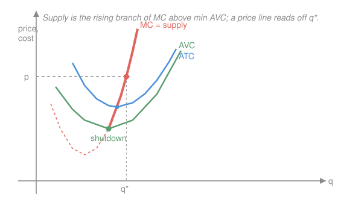

# Mathematical Microeconomics · Lesson 3.3: Profit maximization and supply

> ⏱ ~15 min · Module 3: Producer theory · Builds on: [3.2 Cost minimization and the cost function](03-02-cost-minimization.md) · Unlocks: Module 4 (markets and market power)

## Why this matters

Cost minimization ([3.2](03-02-cost-minimization.md)) answered *how cheaply* to make a given output — but not *how much* to make, or *whether to make anything at all*. That decision is what turns a cost curve into a **supply curve**, the object every market in Module 4 is built from. And the firm's value at the optimum, the **profit function** $\pi(p,w)$, has the same beautiful duality the consumer's value functions did: differentiate it and the firm's behavior — supply, factor demands — falls out for free. Hotelling's lemma is Shephard's lemma wearing a producer's hat.

## The idea

A price-taking firm can't move the price $p$; it can only choose how much to produce. So its whole problem collapses to a one-variable question: pick the quantity $q$ where the *last unit* just barely pays for itself. Make one more unit only if the revenue it brings, $p$, covers what it costs to make, $MC(q)$. Keep going while $p > MC$; stop when $p = MC$. That's the entire logic — **price equals marginal cost**.

Two wrinkles. First, $p = MC$ is only an optimum if $MC$ is *rising* there (if it were falling, one more unit would be even more profitable — you'd never stop). Second, "the best positive quantity" might still lose money; sometimes zero is better. The firm compares its best operating profit against shutting down, and produces only if operating is at least as good. Those two checks — rising $MC$, and beating shutdown — carve the supply curve out of the $MC$ curve.

## The formal version

**The profit-maximization problem (PMP).** Taking output price $p>0$ and input prices $w=(w_1,\dots,w_n)$ as given, and having already solved for the cheapest way to make each $q$ (so cost is $c(w,q)$ from 3.2),

$$\pi(p,w)=\max_{q\ge 0}\; pq-c(w,q).$$

*In words:* revenue minus (minimized) cost, maximized over how much to make.

**First-order condition.** At an interior optimum $q^*>0$,

$$p=\frac{\partial c(w,q^*)}{\partial q}=MC(q^*).$$

*In words:* set output where price equals marginal cost. **Second-order condition:** $-c_{qq}(w,q^*)\le 0$, i.e. $MC'(q^*)\ge 0$ — **marginal cost must be rising.**

**The supply curve.** Solving $p=MC(q)$ for $q$ gives output supply $q(p,w)$: the **rising branch of $MC$**, cut off at the **shutdown point**. Writing $AVC=VC(q)/q$ (average *variable* cost) and $ATC=c/q$ (average *total* cost),

$$q(p,w)=\begin{cases}\{q: p=MC(q),\ MC'\ge 0\} & p\ge \text{(cutoff)}\\[2pt] 0 & p<\text{(cutoff)}\end{cases}\qquad \text{cutoff}=\begin{cases}\min AVC &\text{short run}\\ \min ATC &\text{long run.}\end{cases}$$

*In words:* short run, produce as long as price covers **variable** cost (fixed cost is sunk, so ignore it); long run, produce only if price covers **all** cost, else exit. Since $MC$ pierces each average curve at its minimum, the cutoff is exactly where $MC$ crosses that average.

**Properties of the profit function.** $\pi(p,w)$ is (i) **homogeneous of degree 1**: $\pi(tp,tw)=t\,\pi(p,w)$ — scale every price and profit scales, the optimal plan unchanged; (ii) **convex in $(p,w)$** — proved below; (iii) increasing in $p$, decreasing in each $w_i$.

**Hotelling's lemma (the envelope payoff).** Where $\pi$ is differentiable,

$$\boxed{\;\frac{\partial \pi(p,w)}{\partial p}=q(p,w),\qquad -\frac{\partial \pi(p,w)}{\partial w_i}=x_i(p,w).\;}$$

*In words:* the price-slope of the profit function **is** output supply; the (negative) wage-slope **is** factor demand. The proof is the envelope theorem: with $q^*$ optimal, $\frac{\partial\pi}{\partial p}=q^*+\underbrace{(p-c_q)}_{=0\text{ by FOC}}\frac{\partial q^*}{\partial p}=q^*$. The indirect effect vanishes because the firm was already optimizing — exactly the mechanism behind Shephard's lemma in [3.2](03-02-cost-minimization.md).

**Two routes, one answer.** You can attack the PMP *directly* over inputs, $\max_x pf(x)-w\cdot x$, or in *two steps* (cost-minimize to get $c(w,q)$, then choose $q$). They give the identical supply and factor demands — because the first step of the two-step route is precisely the inner cost-minimization the direct route also has to perform. Example 2 checks this explicitly.

## Picture

## Worked examples

**Example 1 (mechanical — supply and a Hotelling check).** Let $c(q)=q^2+1$, so $MC=2q$, and $MC'=2>0$ (rising everywhere — SOC always holds). FOC: $p=2q\Rightarrow q(p)=\tfrac{p}{2}$. Profit at the optimum:

$$\pi(p)=pq(p)-c(q(p))=p\cdot\tfrac{p}{2}-\Big(\tfrac{p^2}{4}+1\Big)=\frac{p^2}{4}-1.$$

Hotelling: $\dfrac{d\pi}{dp}=\dfrac{p}{2}=q(p)$ ✓ — the slope of the profit function returns supply. (Shutdown: here $AVC=q$, minimized at $0$, so short-run supply runs for *every* $p>0$; but $\min ATC=2$, so long-run the firm exits below $p=2$. Problem 1 works this out.)

**Example 2 (why you'd care — direct PMP equals the two-step).** One input, technology $q=f(x)=\sqrt{x}$, wage $w$, price $p$.

*Direct route.* $\max_x\; p\sqrt{x}-wx$. FOC: $\tfrac{p}{2\sqrt{x}}=w\Rightarrow \sqrt{x}=\tfrac{p}{2w}$, so factor demand $x(p,w)=\tfrac{p^2}{4w^2}$ and supply $q=\sqrt{x}=\tfrac{p}{2w}$.

*Two-step route.* To make $q$ needs $x=q^2$, so $c(w,q)=wq^2$ and $MC=2wq$. FOC $p=2wq\Rightarrow q(p,w)=\tfrac{p}{2w}$ — **identical**, and $x=q^2=\tfrac{p^2}{4w^2}$ matches.

Now the profit function: $\pi(p,w)=p\cdot\tfrac{p}{2w}-w\cdot\tfrac{p^2}{4w^2}=\dfrac{p^2}{4w}$. Both Hotelling identities:

$$\frac{\partial\pi}{\partial p}=\frac{p}{2w}=q(p,w)\ \checkmark,\qquad -\frac{\partial\pi}{\partial w}=-\Big(-\frac{p^2}{4w^2}\Big)=\frac{p^2}{4w^2}=x(p,w)\ \checkmark.$$

One value function, differentiated two ways, hands back the firm's entire behavior. And $\pi(tp,tw)=\tfrac{(tp)^2}{4(tw)}=t\,\tfrac{p^2}{4w}=t\pi$ — homogeneous of degree 1, as promised.

## Watch out

- You might think supply *is* the $MC$ curve. It's only the **rising branch above the shutdown cutoff** — the falling piece of $MC$ and everything below min $AVC$ are not supply (at those prices the firm makes $0$).
- You might think "shutdown = zero profit." No: short run the firm keeps producing *at a loss* as long as $p\ge\min AVC$, because the fixed cost is sunk and it's recovering something toward it. It shuts down only when price can't even cover *variable* cost. Zero-*profit* is the *long-run* margin (min $ATC$), where exit becomes credible.
- You might think Hotelling needs a sign convention you'll misremember. Anchor it: profit *rises* with the price of what you *sell* ($+q$) and *falls* with the price of what you *buy* ($-x_i$). The signs are just "revenue up, cost up."
- You might expect $\pi$ to be concave like a utility value. It's **convex** — because the firm re-optimizes as prices move, it always does at least as well as any fixed plan, and an upper envelope of straight lines bends upward.

## One-liner

> Supply is the rising branch of marginal cost above min AVC; the profit function is convex, and its price-slope hands that supply right back — Hotelling's lemma.

## Problems

**P1 (🟢)** For $c(q)=q^2+1$ (fixed cost $1$, so $VC(q)=q^2$, $MC=2q$): find the competitive supply $q(p)$, the **short-run** shutdown price (min $AVC$), and the **long-run** exit price (min $ATC$). Confirm your exit price sits where $MC$ crosses $ATC$.

**P2 (🟡)** Take the same cost. Derive the profit function $\pi(p)$ from scratch, then verify Hotelling's lemma, $\dfrac{d\pi}{dp}=q(p)$. At what price does the firm break even ($\pi=0$), and how does that compare to your P1 answer?

**P3 (🔴)** Show that $\pi(p,w)$ is **convex in $p$**. Do it two ways: (a) directly for the Example-1 profit function $\pi(p)=\tfrac{p^2}{4}-1$; (b) in general, using that $\pi(p)=\max_q\,[pq-c(q)]$ is a pointwise maximum of functions that are *affine* (straight lines) in $p$. Then explain the economics: why does re-optimizing as $p$ rises make $\pi$ curve upward?

Solutions

**P1** $MC=2q$ rises everywhere, so the FOC $p=MC$ is a genuine max. Solve: $p=2q\Rightarrow \boxed{q(p)=\tfrac{p}{2}}$.

*Short-run cutoff.* $AVC=VC/q=q^2/q=q$, minimized as $q\to 0$ at $\min AVC=0$. So short run the firm produces for **any** $p>0$: shutdown price $=0$.

*Long-run cutoff.* $ATC=c/q=q+\tfrac{1}{q}$. Minimize: $\tfrac{d}{dq}(q+q^{-1})=1-q^{-2}=0\Rightarrow q=1$, giving $\min ATC=1+1=2$. So the firm exits below $p=2$: **exit price $=2$**.

*Cross-check.* $MC$ meets $ATC$ where $2q=q+\tfrac1q\Rightarrow q=\tfrac1q\Rightarrow q=1$, and there $MC(1)=2=ATC(1)$ ✓ — $MC$ pierces $ATC$ exactly at its minimum, as the theory says.

**P2** By definition $\pi(p)=\max_q\,[pq-(q^2+1)]$. FOC $p-2q=0\Rightarrow q=\tfrac p2$; substitute:

$$\pi(p)=p\cdot\tfrac p2-\Big(\tfrac{p^2}{4}+1\Big)=\frac{p^2}{2}-\frac{p^2}{4}-1=\frac{p^2}{4}-1.$$

Hotelling: $\dfrac{d\pi}{dp}=\dfrac{p}{2}=q(p)$ ✓. Break-even: $\pi=0\Rightarrow \tfrac{p^2}{4}=1\Rightarrow p=2$. This is *exactly* the long-run exit price from P1 — the two computations must agree, since "profit $\ge 0$" and "price $\ge\min ATC$" are the same condition. (Below $p=2$ the firm still *operates* short run — operating profit $pq-VC=\tfrac{p^2}{2}-\tfrac{p^2}{4}=\tfrac{p^2}{4}\ge0$ — but total profit is negative because it can't cover the fixed $1$.)

**P3** (a) $\pi(p)=\tfrac{p^2}{4}-1$ has $\pi''(p)=\tfrac12>0$, so $\pi$ is convex in $p$ ✓.

(b) *General argument.* For each fixed $q$, the map $p\mapsto pq-c(q)$ is **affine** in $p$ (a line of slope $q$, intercept $-c(q)$). The profit function is their pointwise supremum, $\pi(p)=\sup_q\,[pq-c(q)]$. A pointwise sup of affine functions is convex: for $p=\lambda p_1+(1-\lambda)p_2$ and the maximizer $q$ at $p$,

$$\pi(p)=p\,q-c(q)=\lambda\big(p_1q-c(q)\big)+(1-\lambda)\big(p_2q-c(q)\big)\le\lambda\pi(p_1)+(1-\lambda)\pi(p_2),$$

since each bracket is $\le$ the max at that price. That is exactly the convexity inequality.

*Economics.* Differentiate twice via Hotelling: $\pi''(p)=\tfrac{d}{dp}\big(\tfrac{d\pi}{dp}\big)=\tfrac{d\,q(p)}{dp}=q'(p)\ge0$, because supply slopes **up** (rising $MC$). When $p$ rises, the firm doesn't sit still — it produces *more*, so profit climbs faster than a fixed plan would allow. A firm locked into a single $q$ would see profit rise linearly (slope $q$); the freedom to re-optimize adds curvature on top, and that extra is precisely the convexity. This is the envelope/LeChatelier principle: adaptable systems always weakly beat rigid ones, and the value function bends toward them.

## Flashback

**From Lesson 3.2 (Cost minimization and the cost function):** A firm has cost function $c(w_1,w_2,q)=2q\sqrt{w_1w_2}$. Recover its conditional factor demands $x_1,x_2$ using **Shephard's lemma**, and verify they reproduce the cost.

Solution

Shephard's lemma: conditional factor demand is the wage-derivative of the cost function, $x_i=\partial c/\partial w_i$. With $c=2q\,w_1^{1/2}w_2^{1/2}$,

$$x_1=\frac{\partial c}{\partial w_1}=2q\cdot\tfrac12\,w_1^{-1/2}w_2^{1/2}=q\sqrt{\tfrac{w_2}{w_1}},\qquad x_2=\frac{\partial c}{\partial w_2}=q\sqrt{\tfrac{w_1}{w_2}}.$$

Check by rebuilding cost: $w_1x_1+w_2x_2=w_1\,q\sqrt{w_2/w_1}+w_2\,q\sqrt{w_1/w_2}=q\sqrt{w_1w_2}+q\sqrt{w_1w_2}=2q\sqrt{w_1w_2}=c$ ✓. (And $c$ is homogeneous of degree $1$ in $w$, so by Euler's theorem $w_1x_1+w_2x_2=c$ had to hold — a second confirmation.)

## Connections

- **Backward:** this is [3.2](03-02-cost-minimization.md) finished — cost minimization gave $c(w,q)$ and Shephard's lemma; here output choice gives $q(p,w)$ and Hotelling's lemma, the same envelope theorem applied one level out. Profit's convexity mirrors the cost function's concavity in $w$.
- **Forward:** [4.1 Perfect competition and welfare](04-01-competition-welfare.md) sums these individual supplies into market supply and measures producer surplus (the area left of the supply curve — an integral of $q(p)$, i.e. of $\pi'(p)$). [4.2](04-02-monopoly-price-discrimination.md) breaks the price-taking assumption: a monopolist sets $MR=MC$ instead of $p=MC$.
- **Sideways (consumer theory):** $\pi(p,w)$ is to the firm what the expenditure function $e(p,u)$ is to the consumer — a convex value function whose derivatives are quantities (Hotelling ↔ Shephard, [1.3](01-03-duality-expenditure-hicksian.md)). Convex-here, concave-there is the max-vs-min signature of the two problems.
- **Sideways (physics):** the envelope/re-optimization convexity is the economists' LeChatelier principle — a system free to adjust always responds to a perturbation more favorably than a constrained one, the same logic thermodynamics uses for stable equilibria.
