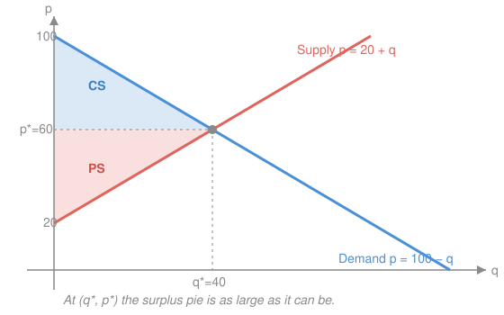

# Mathematical Microeconomics · Lesson 4.1: Perfect competition and welfare

> ⏱ ~15 min · Module 4: Markets and market power · Builds on: [3.3 Profit maximization and supply](03-03-profit-maximization-supply.md) · Unlocks: 4.2 (monopoly and price discrimination)

## Why this matters

Modules 1–3 built the two halves of a market in isolation: a consumer who maximizes utility and a firm that maximizes profit, each treating the price as a fixed fact of nature. Now we let them meet. The price stops being exogenous — it becomes the number that *clears* the market, and the central claim of the subject falls out: when everyone takes prices as given, the resulting allocation squeezes the largest possible total gains from trade out of the economy. This is the **First Welfare Theorem** in its simplest, one-market dress. It is also the benchmark the *next* two lessons demolish: monopoly (4.2) and oligopoly (4.3) are stories about *how much* of this surplus gets destroyed when someone can move the price.

## The idea

Two questions collapse into one. Buyers, ranked by how much they'd pay, form a downward-sloping wall of willingness — the **demand curve**. Sellers, ranked by how cheaply they can produce one more unit, form an upward-sloping wall of cost — the **supply curve**, which for a price-taking firm is just its marginal-cost curve ([3.3](03-03-profit-maximization-supply.md)). A trade between a buyer and a seller creates value exactly when the buyer's willingness exceeds the seller's cost. Keep making those trades — cheapest units first, most eager buyers first — and you stop precisely where willingness meets cost: the two curves cross. That crossing is the competitive equilibrium, and the total value created is the whole area caught between the curves up to that point.

The magic is that no one is *aiming* at this. Each buyer only compares the price to her own taste; each seller only compares the price to his own cost. The price is the single scalar that carries just enough information for a million self-interested decisions to add up to the efficient one. That is the invisible hand, made arithmetic.

## The formal version

**Perfect competition** is the market where this works cleanly. Its assumptions: a homogeneous good; many buyers and sellers each *small* relative to the market, so every agent is a **price-taker** (takes the price $p$ as given, unable to move it); and, in the long run, **free entry and exit**. Under these, the market's behavior is summarized by two aggregate curves, each a horizontal sum over agents.

- **Market demand** $Q^d(p)$: sum of individual Marshallian demands ([1.2](01-02-utility-maximization-marshallian-demand.md)). Its inverse $P(q)$ — solve $Q^d(p)=q$ for $p$ — reads off the **marginal willingness to pay** for the $q$-th unit; call it the marginal benefit.
- **Market supply** $Q^s(p)$: sum of firm supply curves, each of which is $p = MC(q)$ above minimum average variable cost ([3.3](03-03-profit-maximization-supply.md)). Its inverse $S(q)$ is the **marginal cost** of the $q$-th unit.

**Partial-equilibrium.** A competitive equilibrium is a price–quantity pair $(p^*, q^*)$ with
$$Q^d(p^*) = Q^s(p^*) = q^*, \qquad \text{equivalently } P(q^*) = S(q^*).$$
In words: the price at which the quantity demanded equals the quantity supplied; at that quantity, the marginal buyer's benefit equals the marginal seller's cost. "Partial" because we hold all *other* markets' prices and incomes fixed — one market under a microscope.

**Consumer surplus.** With $p$ the price paid and $P(s)$ the benefit of the $s$-th unit,
$$\mathrm{CS}(q) = \int_0^{q} \big[P(s) - p\big]\,ds$$
— the area under the demand curve and above the price line. In words: sum, over every unit bought, of "what it was worth to me minus what I paid." This is an *accumulated* gap, exactly the integral-as-accumulation of [`calc-refresher` 2.1](../../calc-refresher/lessons/02-01-integral-as-accumulation.md). **Caveat (important):** $\mathrm{CS}$ is an *exact* money-metric measure of welfare only when preferences are **quasilinear** in the numéraire (no income effects on this good). In general the honest welfare measures are the compensating and equivalent variations built from the expenditure function of [1.3](01-03-duality-expenditure-hicksian.md); $\mathrm{CS}$ sits between them and coincides with both when income effects vanish. We proceed in the quasilinear world where $\mathrm{CS}$ is exact.

**Producer surplus.** With $S(s)$ the marginal cost of the $s$-th unit,
$$\mathrm{PS}(q) = \int_0^{q} \big[p - S(s)\big]\,ds = pq - \int_0^q S(s)\,ds = pq - VC(q)$$
— the area above supply, below price; equal to revenue minus **variable** cost, i.e. **variable profit**. In words: it is profit *before* subtracting fixed cost, so $\mathrm{PS} = \pi + F$ where $F$ is fixed cost. No quasilinear caveat — $\mathrm{PS}$ is exact by definition.

**Total surplus and efficiency.** Total surplus is the whole pie,
$$\mathrm{TS}(q) = \mathrm{CS}(q) + \mathrm{PS}(q) = \int_0^{q}\big[P(s) - S(s)\big]\,ds,$$
the price cancelling because every dollar a buyer pays is a dollar a seller receives — a pure transfer, welfare-neutral. Maximize over the traded quantity: $\mathrm{TS}'(q) = P(q) - S(q)$, which is positive while marginal benefit exceeds marginal cost, zero exactly at $P(q)=S(q)$, and negative after — so the unique maximizer is $q^*$, the competitive quantity, and $\mathrm{TS}''(q^*) = P'(q^*) - S'(q^*) < 0$ confirms the peak. This is **allocative efficiency**:
$$\underbrace{p^*}_{\text{price}} = \underbrace{P(q^*)}_{\text{marginal benefit}} = \underbrace{S(q^*)}_{\text{marginal cost}}.$$
Any other quantity $q \ne q^*$ — a quota, a tax, a monopolist's restriction — leaves a **deadweight loss** $\mathrm{DWL} = \big|\int_{q}^{q^*}[P(s)-S(s)]\,ds\big|$, the surplus of the trades that should have happened but didn't (or the negative surplus of trades forced past the crossing).

**Short run vs. long run.** In the **short run** the number of firms is fixed; supply is the sum of their $MC$ curves and firms can earn positive (or negative) profit. In the **long run**, free entry responds to profit: positive profit lures entrants, the supply curve slides right, and price falls — until profit is competed to zero. With identical firms and constant input prices, the zero-profit condition pins price at the minimum of average total cost:
$$p^{LR} = \min_q ATC(q), \qquad ATC(q) = \frac{c(q)}{q},$$
each firm produces the efficient scale $q_f = \arg\min ATC$ (where $MC = ATC$), and the long-run supply curve is *horizontal* at $p^{LR}$. In words: in the long run competition drives price to the lowest average cost at which the good can be made, and economic profit vanishes.

## Picture

## Worked examples

**Example 1 (mechanical — equilibrium and the two surpluses).** Inverse demand $P(q) = 90 - 2q$, inverse supply $S(q) = 30 + q$. Set equal: $90 - 2q = 30 + q \Rightarrow 3q = 60 \Rightarrow q^* = 20$, and $p^* = 30 + 20 = 50$. Then
$$\mathrm{CS} = \int_0^{20}\big[(90 - 2s) - 50\big]\,ds = \int_0^{20}(40 - 2s)\,ds = \big[40s - s^2\big]_0^{20} = 800 - 400 = 400,$$
$$\mathrm{PS} = \int_0^{20}\big[50 - (30 + s)\big]\,ds = \int_0^{20}(20 - s)\,ds = \big[20s - \tfrac{s^2}{2}\big]_0^{20} = 400 - 200 = 200.$$
As triangles: $\mathrm{CS} = \tfrac12 \cdot 20 \cdot (90-50) = 400$ ✓ and $\mathrm{PS} = \tfrac12 \cdot 20 \cdot (50-30) = 200$ ✓. Total surplus $600$.

**Example 2 (why you'd care — a tax carves out deadweight loss).** Put a per-unit tax $t = 15$ on Example 1's market: buyers pay $p_d$, sellers keep $p_s = p_d - 15$. Demand needs $q = \tfrac{90 - p_d}{2}$; supply needs $q = p_s - 30 = p_d - 45$. Equate: $\tfrac{90 - p_d}{2} = p_d - 45 \Rightarrow 90 - p_d = 2p_d - 90 \Rightarrow p_d = 60,\ p_s = 45,\ q = 15$. Trade shrinks from $20$ to $15$. The lost units ($15$ to $20$) each had benefit above cost; their forgone surplus is
$$\mathrm{DWL} = \int_{15}^{20}\big[(90 - 2s) - (30 + s)\big]\,ds = \int_{15}^{20}(60 - 3s)\,ds = \big[60s - \tfrac{3}{2}s^2\big]_{15}^{20} = 300 - 262.5 = 37.5.$$
As a triangle: base $= \Delta q = 5$, height $=$ tax wedge $= 15$, area $= \tfrac12 \cdot 5 \cdot 15 = 37.5$ ✓. That triangle is the same object a monopolist creates in [4.2](04-02-monopoly-price-discrimination.md) — here a tax opens the price wedge, there market power does.

## Watch out

- You might think producer surplus *is* profit. It's variable profit — revenue minus *variable* cost. Fixed cost is not subtracted, so $\mathrm{PS} = \pi + F$. The two coincide only when fixed cost is zero (or in the long run, where profit is zero and $\mathrm{PS} = F$).
- You might think consumer surplus is always the exact welfare change. Only under quasilinearity (no income effects). With income effects, the area under the *Marshallian* demand differs from the true compensating/equivalent variation under the *Hicksian* demand — that gap is precisely the Slutsky income term of [1.4](01-04-slutsky-comparative-statics.md), and the exact measures come from the expenditure function of [1.3](01-03-duality-expenditure-hicksian.md).
- You might think a deadweight loss is money that vanished into thin air. It isn't cash lost — it's *trades not made*: mutually beneficial exchanges (benefit above cost) that the distortion prevented. The tax revenue itself is a transfer, not a loss; the DWL is only the surplus of the units that stopped trading.
- You might think entry drives price to zero. It drives economic *profit* to zero by driving price to minimum *average total cost* — the lowest sustainable price, not nothing.

## One-liner

> Competitive equilibrium is where marginal benefit meets marginal cost, and that crossing is no accident — it is the single quantity that makes the surplus pie as large as it can be; every wedge you drive into the price slices a deadweight triangle out of it.

## Problems

**P1 (🟢)** A market has demand $Q = 100 - p$ and supply $Q = p - 20$. Find the competitive price $p^*$ and quantity $q^*$, then compute consumer surplus and producer surplus.

**P2 (🟡)** Using P1's market, show the competitive quantity maximizes total surplus. Write $\mathrm{TS}(q)$ for an arbitrary traded quantity $q$, verify $q^* = 40$ is the maximizer, then evaluate $\mathrm{TS}$ at $q^* = 40$ and at a distorted $q = 30$ (say, a binding quota) and exhibit the deadweight loss two ways — as the difference in total surplus and as a triangle.

**P3 (🔴, optional)** Long-run competition with free entry. Many identical firms each have cost $c(q) = q^2 + k$ with fixed cost $k = 25$ (avoidable — incurred only if the firm operates), and market demand is $Q^d = 100 - p$. Find (a) the long-run price $p^{LR} = \min ATC$, (b) each firm's output, (c) the equilibrium number of firms. Confirm every firm earns exactly zero economic profit.

Solutions

**P1.** Invert to marginal curves: inverse demand $P(q) = 100 - q$, inverse supply $S(q) = q + 20$. Equilibrium $100 - q = q + 20 \Rightarrow 2q = 80 \Rightarrow q^* = 40$, $p^* = 40 + 20 = 60$. Then
$$\mathrm{CS} = \int_0^{40}\big[(100 - s) - 60\big]\,ds = \int_0^{40}(40 - s)\,ds = \big[40s - \tfrac{s^2}{2}\big]_0^{40} = 1600 - 800 = 800,$$
$$\mathrm{PS} = \int_0^{40}\big[60 - (s + 20)\big]\,ds = \int_0^{40}(40 - s)\,ds = 800.$$
Check (triangles): $\mathrm{CS} = \tfrac12 \cdot 40 \cdot (100 - 60) = 800$ ✓, $\mathrm{PS} = \tfrac12 \cdot 40 \cdot (60 - 20) = 800$ ✓. Total surplus $1600$. (The symmetry is an artifact of demand and supply having equal-magnitude slopes here — it is not general; Example 1 above shows an asymmetric split.)

**P2.** For a traded quantity $q$, total surplus is benefit minus cost accumulated over the units, price cancelling:
$$\mathrm{TS}(q) = \int_0^{q}\big[P(s) - S(s)\big]\,ds = \int_0^{q}\big[(100 - s) - (s + 20)\big]\,ds = \int_0^{q}(80 - 2s)\,ds = 80q - q^2.$$
Maximize: $\mathrm{TS}'(q) = 80 - 2q = 0 \Rightarrow q = 40 = q^*$, and $\mathrm{TS}''(q) = -2 < 0$, so it is the maximum. (Note $\mathrm{TS}'(q) = P(q) - S(q)$ vanishes exactly where demand meets supply — the efficiency condition.) Evaluate:
$$\mathrm{TS}(40) = 80(40) - 40^2 = 3200 - 1600 = 1600, \qquad \mathrm{TS}(30) = 80(30) - 30^2 = 2400 - 900 = 1500.$$
Deadweight loss $= \mathrm{TS}(40) - \mathrm{TS}(30) = 100$. As a triangle: the quota stops the units from $30$ to $40$; at $q = 30$ the gap between benefit and cost is $P(30) - S(30) = 70 - 50 = 20$, closing linearly to $0$ at $q = 40$, so $\mathrm{DWL} = \tfrac12 \cdot (40 - 30) \cdot 20 = 100$ ✓. Both routes agree, and $1600 = \mathrm{TS}(40)$ is indeed the largest attainable — any $q \ne 40$ scores lower.

**P3.** (a) Average total cost $ATC(q) = \dfrac{q^2 + k}{q} = q + \dfrac{k}{q}$. Minimize: $ATC'(q) = 1 - \dfrac{k}{q^2} = 0 \Rightarrow q_f = \sqrt{k} = \sqrt{25} = 5$. Minimum $ATC = 5 + \dfrac{25}{5} = 10$, so $p^{LR} = 10$. (Consistency check: $MC(q) = c'(q) = 2q$; at $q_f = 5$, $MC = 10 = ATC$ — marginal cost cuts average cost at its minimum, as it must.)
(b) Each firm produces $q_f = 5$ (the efficient scale, and it satisfies $p = MC$: $10 = 2(5)$ ✓).
(c) At $p^{LR} = 10$, market quantity is $Q = 100 - 10 = 90$. Number of firms $n = \dfrac{Q}{q_f} = \dfrac{90}{5} = 18$.
Check (zero profit): each firm's profit $\pi = p^{LR} q_f - c(q_f) = 10 \cdot 5 - (5^2 + 25) = 50 - 50 = 0$ ✓. Price equals min ATC, so economic profit is exactly zero and no firm has any incentive to enter or exit — a genuine long-run equilibrium.

## Flashback

**From Lesson 3.3 (Profit maximization and supply):** A price-taking firm has cost $c(q) = \tfrac12 q^2 + 2q + 10$ and faces price $p = 12$. Find its profit-maximizing output and its profit, and confirm it should operate rather than shut down in the short run.

Solution

Profit maximization for a price-taker sets $p = MC$. Here $MC(q) = c'(q) = q + 2$, so $12 = q + 2 \Rightarrow q^* = 10$. Second-order condition: $MC$ is increasing ($MC' = 1 > 0$), so this is a maximum, not a minimum. Profit:
$$\pi = p q^* - c(q^*) = 12(10) - \big(\tfrac12(100) + 2(10) + 10\big) = 120 - (50 + 20 + 10) = 40 > 0.$$
Shut-down check: operate in the short run iff $p \ge \min AVC$. Variable cost is $VC(q) = \tfrac12 q^2 + 2q$, so $AVC(q) = \tfrac12 q + 2$, minimized as $q \to 0$ at $AVC = 2$. Since $p = 12 > 2$, the firm covers its variable cost and produces. Check: at $q^* = 10$, $MC = 10 + 2 = 12 = p$ ✓, and $MC$ lies above $AVC$ there, so $q^* = 10$ is on the firm's supply curve. ✓

## Connections

- **Backward:** market supply is the horizontal sum of the individual $p = MC$ supply curves from [3.3](03-03-profit-maximization-supply.md); market demand is the sum of the Marshallian demands from [1.2](01-02-utility-maximization-marshallian-demand.md). Consumer surplus is the accumulation integral of [`calc-refresher` 2.1](../../calc-refresher/lessons/02-01-integral-as-accumulation.md).
- **Forward:** [4.2](04-02-monopoly-price-discrimination.md) replaces the price-taker with a price-*setter*: the monopolist restricts quantity below $q^*$, converting part of consumer surplus into profit and carving out a deadweight triangle — this lesson is the efficient benchmark it is measured against. [4.3](04-03-oligopoly.md) does the same for strategic firms, and [5.1](05-01-general-equilibrium-welfare-theorems.md) upgrades the "competitive equilibrium is efficient" claim from one market to the whole economy — the general First Welfare Theorem.
- **Sideways (welfare measurement):** the quasilinear caveat on consumer surplus is the seam where money-metric welfare meets duality — the exact compensating and equivalent variations come from the expenditure function of [1.3](01-03-duality-expenditure-hicksian.md), and their gap from Marshallian $\mathrm{CS}$ is the income effect isolated by the Slutsky equation of [1.4](01-04-slutsky-comparative-statics.md).
