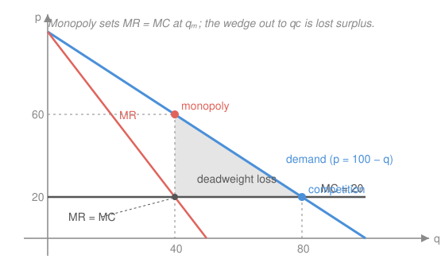

# Mathematical Microeconomics · Lesson 4.2: Monopoly and price discrimination

> ⏱ ~15 min · Module 4: Markets and market power · Builds on: [4.1 Perfect competition and welfare](04-01-competition-welfare.md) · Unlocks: 4.3 (oligopoly)

## Why this matters

In [4.1](04-01-competition-welfare.md) the firm was a price-*taker*: it saw a flat line at the market price and its only decision was how much to make. Strip away that flatness — let one firm *be* the market — and everything changes. The monopolist knows that selling one more unit forces the price down on *every* unit, so its marginal revenue sits **below** the price it charges. That single wedge is the whole story of market power: it produces the markup you see on a patented drug, it produces the **deadweight loss** that makes monopoly the textbook villain, and — once the firm can charge different buyers different prices — it produces the entire theory of **price discrimination**, from airline fare classes to student software licenses. This lesson is the price-*setter*'s optimization, and the welfare accounting for what it destroys.

## The idea

A competitive firm's revenue from one more unit is just the going price $p$ — sell a unit, collect $p$, done. A monopolist can't. It faces the *whole* downward-sloping demand curve, so to sell the extra unit it must cut the price, and that cut applies to all the units it was already selling. Marginal revenue is therefore "the price on the new unit" **minus** "the markdown suffered on the old ones." That subtraction is why $MR<p$, always, for a downward-sloping demand.

So the profit-maximizing rule — produce until marginal revenue meets marginal cost, $MR=MC$ — lands the monopolist at a **smaller** quantity than competition would, where $MC$ meets *demand*. It then walks that quantity **up** to the demand curve and charges what buyers will bear. Price ends up above marginal cost. The gap between them, per unit, is the **markup**; the triangle of trades that would have been mutually beneficial but never happen is the **deadweight loss**.

The last move is subtler: what if the firm needn't post one price for everyone? If it can tell buyers apart, it charges the desperate (inelastic) ones more and the price-sensitive (elastic) ones less. Pushed to the limit — a personalized price for every unit — it captures *all* the surplus and, paradoxically, restores the efficient quantity. Discrimination redistributes surplus from buyers to the firm, and can *undo* the deadweight loss it created.

## The formal version

A monopolist faces **inverse demand** $p(q)$ (the price at which quantity $q$ clears) with $p'(q)<0$, and cost $C(q)$ with marginal cost $MC(q)=C'(q)$. Revenue is $R(q)=p(q)\,q$.

**Marginal revenue.** Differentiate the product:

$$MR(q)=\frac{dR}{dq}=p(q)+q\,p'(q)=p\left(1+\frac{q}{p}\frac{dp}{dq}\right)=p\left(1+\frac{1}{\varepsilon}\right),$$

where $\varepsilon=\dfrac{dq}{dp}\dfrac{p}{q}<0$ is the **price elasticity of demand** (percent change in quantity per percent change in price). In words: marginal revenue is the price scaled down by a factor that depends on how elastic demand is. Since $\varepsilon<0$, the term $1+1/\varepsilon<1$, so $MR<p$ — the wedge from "The idea," now exact. When demand is very elastic ($\varepsilon\to-\infty$) the markdown vanishes and $MR\to p$: that is the competitive limit of [4.1](04-01-competition-welfare.md).

**Profit maximization.** Maximize $\pi(q)=R(q)-C(q)$; the first-order condition $\pi'(q)=0$ is

$$\boxed{MR(q)=MC(q).}$$

In words: expand output until the last unit's added revenue equals its added cost. (Second-order condition: $MR$ cuts $MC$ from above, $MR'<MC'$.) Read the monopoly price $p_m=p(q_m)$ **off the demand curve** at the optimal $q_m$.

**The Lerner index (the markup).** Combine $MR=MC$ with the elasticity form. From $p(1+1/\varepsilon)=MC$,

$$\frac{p-MC}{p}=-\frac{1}{\varepsilon}=\frac{1}{|\varepsilon|}.$$

In words: the fractional markup of price over marginal cost equals the reciprocal of the elasticity. The left side, the **Lerner index** $L\in[0,1]$, is the cleanest scalar measure of market power. Two consequences fall straight out:

- **More inelastic → bigger markup.** A drug with no substitutes ($|\varepsilon|$ near 1) is priced far above cost; a near-commodity ($|\varepsilon|$ large) barely at all. Competition is the case $L=0$, $p=MC$.
- **Monopoly always operates where demand is elastic, $|\varepsilon|>1$.** Since $L\in(0,1)$ and $L=1/|\varepsilon|$, we need $|\varepsilon|>1$. Intuitively, on the *inelastic* part of demand ($|\varepsilon|<1$) a price hike *raises* revenue while cutting output and cost — the firm would never stop there.

**Deadweight loss.** The competitive benchmark of [4.1](04-01-competition-welfare.md) sets price at marginal cost, quantity $q_c$ solving $p(q_c)=MC(q_c)$; that maximizes total surplus. Monopoly stops short at $q_m<q_c$. Every unit between $q_m$ and $q_c$ is one buyers value (at $p(q)$) above what it costs to make ($MC$), yet it goes unmade. The forgone surplus is

$$DWL=\int_{q_m}^{q_c}\bigl[p(q)-MC(q)\bigr]\,dq,$$

the area between demand and marginal cost from $q_m$ to $q_c$ — the shaded wedge in the Picture. With linear demand and constant $MC$ it is a triangle.

**Price discrimination.** Charging different prices for the same good, by degree of information:

- **First-degree (perfect).** The firm charges each unit its full demand price $p(q)$. Then $MR$ *is* the demand curve — no markdown on inframarginal units because they were each sold at their own price — so $MR=MC$ becomes $p(q)=MC(q)$: it produces the **efficient** quantity $q_c$, zero deadweight loss. But it extracts *every* dollar of surplus: **consumer surplus is zero**, all of it converted to profit. Efficient and maximally unequal.

- **Third-degree (segmentation).** The firm sells to $n$ observable groups (student vs. business, geographic markets) with separate demands $p_i(q_i)$ and one common cost. Maximize $\sum_i p_i(q_i)q_i-C(\sum_i q_i)$; each first-order condition is $MR_i=MC$, so at the optimum

$$MR_1=MR_2=\cdots=MC.$$

  In words: equalize marginal revenue across segments (else shift a unit toward the higher-$MR$ market). Writing each as $p_i(1-1/|\varepsilon_i|)=MC$, the **more inelastic segment pays the higher price** — the Lerner logic, market by market.

- **Second-degree (menus / nonlinear pricing).** When the firm *can't* observe types, it can't post a group price — so it offers a **menu** (quantity discounts, two-part tariffs, versioned quality) and lets buyers **self-select**. The design must respect incentive compatibility: each type must prefer its own option to mimicking another's. This is the gateway to mechanism design and [5.3 asymmetric information](05-03-asymmetric-information.md); we only name it here.

## Picture

The monopolist finds $q_m$ where the red $MR$ line meets $MC$, then rises to the blue demand curve for $p_m$ — strictly above $MC$. Competition would land at the blue dot where demand itself meets $MC$, at the larger $q_c$. The grey wedge between demand and $MC$ across $[q_m,q_c]$ is surplus that simply never gets created: the deadweight loss of market power. (Numbers are Problem 1's: $p=100-q$, $MC=20$.)

## Worked examples

**Example 1 (mechanical — the whole monopoly solve).** Inverse demand $p=120-2q$, constant $MC=40$. Revenue $R=(120-2q)q=120q-2q^2$, so $MR=120-4q$. Set $MR=MC$: $120-4q=40\Rightarrow q_m=20$, and $p_m=120-2(20)=80$. Profit (no fixed cost) $\pi=(p_m-MC)q_m=(80-40)(20)=800$. Competition would set $p=MC=40$: $40=120-2q\Rightarrow q_c=40$. Deadweight-loss triangle: base $q_c-q_m=20$, height $p_m-MC=40$, so $DWL=\tfrac12(20)(40)=400$. Lerner index $L=\tfrac{80-40}{80}=\tfrac12$, and indeed $|\varepsilon|$ at the optimum is $\tfrac{dq}{dp}\tfrac{p}{q}=(-\tfrac12)\tfrac{80}{20}=-2$, giving $1/|\varepsilon|=\tfrac12=L$. ✓

**Example 2 (why you'd care — third-degree discrimination beats a uniform price).** A software firm ($MC=0$) sells to businesses, $p_B=100-q_B$, and students, $p_S=60-2q_S$. Separate markets: $MR_B=100-2q_B=0\Rightarrow q_B=50,\ p_B=50$; $MR_S=60-4q_S=0\Rightarrow q_S=15,\ p_S=30$. Businesses (less elastic here) pay $50$, students $30$ — the segment with the steeper willingness-to-pay is charged more, exactly $MR_B=MR_S=MC=0$. Total profit $50\cdot50+30\cdot15=2950$, strictly more than any single price could raise, because the firm no longer has to quote the elastic students the same price as the loyal businesses.

## Watch out

- You might think a monopolist "charges the highest price possible." No — at the very top of demand it sells almost nothing. It maximizes *profit*, landing at $MR=MC$ on the **elastic** part of demand ($|\varepsilon|>1$); a higher price would cross into the inelastic region where cutting output raises revenue *and* lowers cost, which no optimizer allows.
- You might set $MC=$ price and solve, out of [4.1](04-01-competition-welfare.md) habit. That gives the *competitive* quantity, not the monopoly one. The monopolist equates $MC$ to **marginal revenue**, then reads price off demand — two different curves, two different steps.
- You might think price discrimination is always bad for welfare. First-degree discrimination is *efficient* (it reaches $q_c$); it only redistributes surplus to the firm. Third-degree is ambiguous — it can raise total output (and welfare) by serving markets a uniform price would abandon. "Discrimination" is a statement about surplus *division*, not automatically about surplus *destruction*.

## One-liner

> A monopolist sells where marginal revenue — the price minus the markdown it forces on every earlier unit — meets marginal cost, marking price above $MC$ by $1/|\varepsilon|$ and burning the surplus triangle out to the competitive quantity; price discrimination hands that surplus to the firm and can even reclaim the triangle.

## Problems

**P1 (🟢)** Demand $p=100-q$, constant $MC=20$, no fixed cost. Find the monopoly quantity and price (via $MR=MC$), the profit, and the deadweight loss relative to perfect competition.

**P2 (🟡)** For the same firm, verify the markup formula $\dfrac{p-MC}{p}=-\dfrac{1}{\varepsilon}$ at the monopoly optimum, and confirm demand is elastic there ($|\varepsilon|>1$).

**P3 (🔴)** A monopolist with constant $MC=20$ serves two separable markets, $p_A=120-q_A$ and $p_B=80-2q_B$, and can price them independently. Solve for $(q_A,p_A)$ and $(q_B,p_B)$ by equating each market's $MR$ to $MC$. Compute both elasticities at the optimum and show the more inelastic market pays the higher price.

Solutions

**P1** Revenue $R=(100-q)q=100q-q^2$, so $MR=100-2q$. Profit max:

$$MR=MC:\quad 100-2q=20\ \Longrightarrow\ q_m=40,\qquad p_m=100-40=60.$$

Profit (cost $=20q$, no fixed cost): $\pi=(p_m-MC)\,q_m=(60-20)(40)=1600.$

Competitive benchmark: $p=MC\Rightarrow 100-q=20\Rightarrow q_c=80$. Deadweight loss is the triangle between demand and $MC$ from $q_m=40$ to $q_c=80$:

$$DWL=\tfrac12(q_c-q_m)(p_m-MC)=\tfrac12(80-40)(60-20)=\tfrac12(40)(40)=800.$$

*Check:* $MR(40)=100-80=20=MC$ ✓; $p_m=60>MC=20$ ✓; and directly $\int_{40}^{80}\!\big[(100-q)-20\big]dq=\int_{40}^{80}(80-q)\,dq=\big[80q-\tfrac{q^2}{2}\big]_{40}^{80}=(6400-3200)-(3200-800)=3200-2400=800$ ✓.

**P2** At the optimum $p_m=60$, $q_m=40$, $MC=20$. Lerner index:

$$\frac{p-MC}{p}=\frac{60-20}{60}=\frac{40}{60}=\frac23.$$

Elasticity: from $q=100-p$, $\dfrac{dq}{dp}=-1$, so

$$\varepsilon=\frac{dq}{dp}\frac{p}{q}=(-1)\frac{60}{40}=-\frac32,\qquad -\frac{1}{\varepsilon}=\frac{2}{3}.$$

The two match: $\dfrac{p-MC}{p}=-\dfrac1\varepsilon=\dfrac23$. ✓ And $|\varepsilon|=\tfrac32>1$, so demand is elastic at the optimum, as required.

*Check:* the elasticity form of marginal revenue also holds: $MR=p\!\left(1+\tfrac1\varepsilon\right)=60\!\left(1-\tfrac23\right)=60\cdot\tfrac13=20=MC$ ✓.

**P3** With one common cost, maximize $\pi=p_A(q_A)q_A+p_B(q_B)q_B-20(q_A+q_B)$; each first-order condition is $MR_i=MC=20$.

Market A: $R_A=(120-q_A)q_A$, $MR_A=120-2q_A=20\Rightarrow q_A=50,\ p_A=120-50=70.$

Market B: $R_B=(80-2q_B)q_B$, $MR_B=80-4q_B=20\Rightarrow q_B=15,\ p_B=80-30=50.$

Elasticities at the optimum. Market A: $q_A=120-p_A$, $\tfrac{dq_A}{dp_A}=-1$, so $\varepsilon_A=(-1)\tfrac{70}{50}=-1.4$. Market B: $q_B=\tfrac{80-p_B}{2}$, $\tfrac{dq_B}{dp_B}=-\tfrac12$, so $\varepsilon_B=(-\tfrac12)\tfrac{50}{15}=-\tfrac{5}{3}\approx-1.67$.

Market A is the more inelastic ($|\varepsilon_A|=1.4<|\varepsilon_B|=1.67$) and is charged the higher price ($p_A=70>p_B=50$) — precisely the Lerner ranking, since a smaller $|\varepsilon|$ forces a larger markup $1/|\varepsilon|$.

*Check:* Lerner in each market equals $1/|\varepsilon|$: $\tfrac{70-20}{70}=\tfrac{50}{70}=\tfrac57=0.714=\tfrac{1}{1.4}$ ✓ and $\tfrac{50-20}{50}=\tfrac{30}{50}=\tfrac35=0.6=\tfrac{1}{5/3}$ ✓. Marginal revenues are equalized: $MR_A=MR_B=20=MC$ ✓.

## Flashback

**From Lesson 4.1 (Perfect competition and welfare):** A competitive market has demand $p=120-q$ and (upward-sloping) supply $p=30+2q$. Find the equilibrium price and quantity, then the consumer and producer surplus.

Solution

Equilibrium equates demand and supply prices:

$$120-q=30+2q\ \Longrightarrow\ 90=3q\ \Longrightarrow\ q^*=30,\qquad p^*=120-30=90.$$

**Consumer surplus** — the triangle under demand and above the price, from $0$ to $q^*$. Demand's vertical intercept is $120$:

$$CS=\tfrac12\,(120-90)\,(30)=\tfrac12(30)(30)=450.$$

**Producer surplus** — the triangle above supply and below the price. Supply's intercept is $30$:

$$PS=\tfrac12\,(90-30)\,(30)=\tfrac12(60)(30)=900.$$

Total surplus $=450+900=1350$, and at the competitive quantity every unit with willingness-to-pay above marginal cost is traded — no deadweight loss, the efficiency benchmark this lesson's monopoly falls short of.

*Check:* at $q^*=30$ demand price $120-30=90$ equals supply price $30+60=90$ ✓; surpluses are areas of right triangles with the common base $q^*=30$ and heights $120-90=30$ and $90-30=60$ ✓.

## Connections

- **Backward:** the competitive firm of [4.1](04-01-competition-welfare.md) is the $|\varepsilon|\to\infty$ limit here, where $MR\to p$ and the markup and deadweight loss both vanish; the surplus accounting (consumer/producer surplus, DWL) is 4.1's, reused to price market power. The $MR=MC$ rule is [3.3 profit maximization](03-03-profit-maximization-supply.md)'s condition — a monopolist obeys it too, but with a downward-sloping $MR$ instead of a flat price.
- **Forward:** [4.3 oligopoly](04-03-oligopoly.md) sits between these poles — a few firms, each with some power but constrained by rivals; Cournot competition is literally each firm setting $MR=MC$ against residual demand. Second-degree discrimination and self-selection open into [5.3 asymmetric information](05-03-asymmetric-information.md).
- **Sideways:** the Lerner index $L=1/|\varepsilon|$ is the same elasticity that governs [consumer demand](01-02-utility-maximization-marshallian-demand.md) — market power is just the mirror image of how insensitive buyers are. And "equalize $MR$ across segments" is the identical marginal-equalization logic as "equalize marginal utility per dollar across goods" in [1.2](01-02-utility-maximization-marshallian-demand.md): optimize anything divisible and its marginal contributions must line up.
