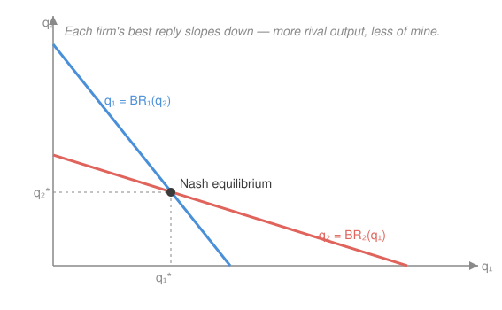

# Mathematical Microeconomics · Lesson 4.3: Oligopoly

> ⏱ ~15 min · Module 4: Markets and market power · Builds on: [4.2 Monopoly and price discrimination](04-02-monopoly-price-discrimination.md) · Unlocks: Module 5 (equilibrium and market failure)

## Why this matters

Most real markets are neither the atomistic competition of [4.1](04-01-competition-welfare.md) nor the lone monopolist of [4.2](04-02-monopoly-price-discrimination.md): they hold a *handful* of firms, each big enough that its choices move the price its rivals face. That feedback — my optimum depends on your choice, which depends on mine — is **strategic interaction**, and it forces a new solution concept. The punchline you'll carry out: *conduct*, not just *concentration*, sets the outcome. Two firms can behave like a cartel or like perfect competitors depending only on whether they compete in quantities or in prices.

## The idea

Drop the price-taking assumption. A Cournot firm picks how much to *produce* knowing the market price will fall as total output rises — so before it can choose, it must guess the rival's output. Firm 1's profit-maximizing $q_1$ is therefore a *function* of $q_2$: its **best-response** (or reaction) function. Firm 2 has one too. Neither is a fixed number; each is a rule, "given what you do, here's my optimum."

Where do they land? At the one pair $(q_1^*, q_2^*)$ where each firm is simultaneously best-responding to the other — no one, seeing the other's choice, wishes they had done differently. That mutual-consistency point is a **Nash equilibrium**: the intersection of the two reaction curves. (We introduce Nash heuristically here — "each strategy is optimal given the others"; the general existence-and-refinement theory is `game-theory-refresher`.)

The result sits *between* the two benchmarks you already know. A monopolist internalizes the full price drop from every extra unit; a competitive firm ignores it entirely. Two Cournot firms each internalize *half* — so they overproduce relative to a cartel but underproduce relative to competition. Add more firms and each internalizes less; as $n\to\infty$ the Cournot price marches down to marginal cost and you recover perfect competition. Concentration and conduct, dialed continuously.

## The formal version

Set inverse demand $p = a - bQ$ with total output $Q = q_1 + q_2$, constants $a > c \ge 0$, $b > 0$, and constant marginal cost $c$ for both firms. Firm $i$'s profit is $\pi_i = (p - c)q_i = \big(a - b(q_1+q_2) - c\big)q_i$.

**Cournot (simultaneous quantities).** Firm 1 maximizes over $q_1$, taking $q_2$ as given. The first-order condition (FOC) is

$$\frac{\partial \pi_1}{\partial q_1} = a - 2bq_1 - bq_2 - c = 0 \;\Longrightarrow\; q_1 = BR_1(q_2) = \frac{a-c}{2b} - \frac{q_2}{2}.$$

In words: firm 1's best output is the monopoly output $\tfrac{a-c}{2b}$ shaded down by half of whatever the rival makes. (Second-order condition: $\partial^2\pi_1/\partial q_1^2 = -2b < 0$, a genuine max.) By symmetry $q_2 = BR_2(q_1) = \tfrac{a-c}{2b} - \tfrac{q_1}{2}$. The **Nash equilibrium** solves both at once; imposing $q_1^* = q_2^* = q^*$,

$$q^* = \frac{a-c}{2b} - \frac{q^*}{2} \;\Longrightarrow\; \frac{3}{2}q^* = \frac{a-c}{2b} \;\Longrightarrow\; \boxed{q_i^* = \frac{a-c}{3b}}.$$

Then $Q^* = \tfrac{2(a-c)}{3b}$ and $p^* = a - bQ^* = \tfrac{a+2c}{3}$ — strictly above $c$, strictly below the monopoly price $\tfrac{a+c}{2}$.

**Bertrand (simultaneous prices, homogeneous good).** Now firms post *prices* and buyers all go to the cheapest. With equal marginal cost $c$, the unique Nash equilibrium is $p_1 = p_2 = c$: any firm charging above $c$ is undercut by a rival shaving an arbitrarily small $\varepsilon$ to seize the *entire* market. In words: **two** firms suffice to force the competitive price. This is the **Bertrand paradox** — concentration looked identical to Cournot, but the mode of competition delivers a completely different world.

**Stackelberg (sequential quantities).** Firm 1 (the leader) commits to $q_1$ *first*; firm 2 observes it and best-responds along $BR_2$. Solve by **backward induction**: substitute the follower's reaction into the leader's profit and maximize. Commitment is worth something — the leader produces more and earns more than at Cournot (Problem 3).

## Picture

Each axis is one firm's output. $BR_1$ (blue) gives firm 1's optimal $q_1$ for every $q_2$; $BR_2$ (red) does the reverse. Both slope down with slope $-\tfrac12$ in their own variable — a rival unit crowds out half a unit of mine. They cross once, at the symmetric pair $q_1^*=q_2^*=\tfrac{a-c}{3b}$: the only outcome where both firms are best-responding at the same time.

## Worked examples

**Example 1 (mechanical — the reaction functions in action).** Take $a = 12$, $b = 1$, $c = 0$, so demand is $p = 12 - Q$. Then $BR_1(q_2) = 6 - \tfrac{q_2}{2}$ and $BR_2(q_1) = 6 - \tfrac{q_1}{2}$. Plug the formula: $q_i^* = \tfrac{a-c}{3b} = \tfrac{12}{3} = 4$. Check consistency: $BR_1(4) = 6 - 2 = 4$ ✓. Total $Q^* = 8$, price $p^* = 12 - 8 = 4$, each firm's profit $(4-0)(4) = 16$.

**Example 2 (why you'd care — Cournot vs. the benchmarks, same market).** Same numbers. Monopoly: $Q^m = \tfrac{a-c}{2b} = 6$, $p^m = 6$, profit $36$. Perfect competition: $p^c = c = 0$, $Q^c = \tfrac{a-c}{b} = 12$. So output ranks $6 < 8 < 12$ (monopoly < Cournot < competition) and price ranks $6 > 4 > 0$ — the duopoly lands *between*, exactly as the "internalize half the price drop" story predicts. Two colluding firms would split the monopoly $36$ (i.e. $18$ each) — *more* than the $16$ each earns at Cournot, which is why cartels are tempting and why each partner is tempted to cheat by expanding toward its best response.

## Watch out

- **You might think** the Nash equilibrium is where the two firms' profits are equal or maximized jointly. It isn't — it's where each is *best-responding to the other*. Joint profit is maximized at the cartel/monopoly point, which is *off* both reaction curves; that's precisely why the cartel is unstable.
- **You might think** "only two firms, so barely any competition." Bertrand kills that intuition: with homogeneous goods and equal costs, two price-setters already give the fully competitive $p = c$. The number of firms is not the whole story — the *strategic variable* (price vs. quantity) is.
- **You might think** the Stackelberg leader wins by producing the monopoly amount to keep price high. Backward induction shows the opposite instinct pays: the leader expands *past* Cournot, deliberately flooding to shrink the follower's residual demand. Commitment, not restraint, is the edge.

## One-liner

> A few firms' outputs settle where their downward-sloping best responses cross — the Nash equilibrium — landing between monopoly and competition, and *how* they compete (quantity vs. price, simultaneous vs. sequential) matters as much as how many they are.

## Problems

**P1 (🟢)** Inverse demand $p = a - bQ$ with $Q = q_1 + q_2$, constant marginal cost $c$ ($a > c$), Cournot competition. Derive each firm's best-response function from its FOC, solve for the symmetric equilibrium quantity $q_i^*$, and give the equilibrium price.

**P2 (🟡)** For the *same* demand and cost, compute total output, price, and (where defined) per-firm profit under (i) perfect competition, (ii) monopoly, (iii) Cournot duopoly, and rank the three by total output and by price. Then generalize Cournot to $n$ symmetric firms: find $q_i^*$, $Q^*$, and $p^*$, and take $n\to\infty$.

**P3 (🔴, optional)** *Stackelberg.* Firm 1 chooses $q_1$ first; firm 2 observes and best-responds. Using backward induction, find $q_1^S$, $q_2^S$, the price, and each firm's profit (use $p = a - bQ$, MC $c$). Show the leader produces more and earns more than it would at Cournot.

Solutions

**P1** Firm 1 maximizes $\pi_1 = \big(a - b(q_1+q_2) - c\big)q_1$. FOC:

$$\frac{\partial \pi_1}{\partial q_1} = a - 2bq_1 - bq_2 - c = 0 \;\Longrightarrow\; BR_1(q_2) = \frac{a - c - bq_2}{2b} = \frac{a-c}{2b} - \frac{q_2}{2},$$

and symmetrically $BR_2(q_1) = \tfrac{a-c}{2b} - \tfrac{q_1}{2}$ (SOC $= -2b < 0$, a max). Impose $q_1^* = q_2^* = q^*$:

$$q^* = \frac{a-c}{2b} - \frac{q^*}{2} \;\Longrightarrow\; \frac{3}{2}q^* = \frac{a-c}{2b} \;\Longrightarrow\; q_i^* = \frac{a-c}{3b}.$$

Total $Q^* = \tfrac{2(a-c)}{3b}$, so $p^* = a - bQ^* = a - \tfrac{2(a-c)}{3} = \tfrac{a + 2c}{3}$.

*Check:* substitute back into $BR_1$: $\tfrac{a-c}{2b} - \tfrac12\cdot\tfrac{a-c}{3b} = \tfrac{a-c}{2b} - \tfrac{a-c}{6b} = \tfrac{3(a-c)-(a-c)}{6b} = \tfrac{2(a-c)}{6b} = \tfrac{a-c}{3b} = q_i^*$ ✓, and $p^* - c = \tfrac{a+2c}{3} - c = \tfrac{a-c}{3} > 0$ ✓ (price exceeds MC, as it must with market power).

**P2** *Perfect competition:* price equals marginal cost, $p^c = c$, so $a - bQ^c = c \Rightarrow Q^c = \tfrac{a-c}{b}$; economic profit $0$.

*Monopoly:* maximize $(a - bQ - c)Q$; FOC $a - 2bQ - c = 0 \Rightarrow Q^m = \tfrac{a-c}{2b}$, $p^m = \tfrac{a+c}{2}$, profit $(p^m - c)Q^m = \tfrac{a-c}{2}\cdot\tfrac{a-c}{2b} = \tfrac{(a-c)^2}{4b}$.

*Cournot (from P1):* $Q^{Cou} = \tfrac{2(a-c)}{3b}$, $p^{Cou} = \tfrac{a+2c}{3}$, per-firm profit $(p^{Cou}-c)q_i^* = \tfrac{a-c}{3}\cdot\tfrac{a-c}{3b} = \tfrac{(a-c)^2}{9b}$.

*Rankings.* Output: $\tfrac{a-c}{2b} < \tfrac{2(a-c)}{3b} < \tfrac{a-c}{b}$, i.e. $\tfrac12 < \tfrac23 < 1$ (times $\tfrac{a-c}{b}$) — **monopoly < Cournot < competition**. Price: $\tfrac{a+c}{2} > \tfrac{a+2c}{3} > c$ (since $\tfrac{a+c}{2} - \tfrac{a+2c}{3} = \tfrac{3(a+c)-2(a+2c)}{6} = \tfrac{a-c}{6} > 0$, and $\tfrac{a+2c}{3} - c = \tfrac{a-c}{3} > 0$) — the reverse order, as expected.

*$n$ symmetric firms.* Firm $i$ maximizes $\big(a - bQ - c\big)q_i$ with $Q = \sum_j q_j$. FOC: $a - bQ - bq_i - c = 0$. By symmetry $q_i = q$, $Q = nq$:

$$a - bnq - bq - c = 0 \;\Longrightarrow\; q_i^* = \frac{a-c}{b(n+1)}, \quad Q^* = \frac{n(a-c)}{b(n+1)}, \quad p^* = a - bQ^* = \frac{a + nc}{n+1}.$$

*Check:* $n=1$ gives the monopoly $\tfrac{a-c}{2b}$, $\tfrac{a+c}{2}$ ✓; $n=2$ gives $\tfrac{a-c}{3b}$, $\tfrac{a+2c}{3}$ ✓. As $n \to \infty$: $p^* = \tfrac{a+nc}{n+1} \to c$ and $Q^* \to \tfrac{a-c}{b} = Q^c$ — Cournot converges to perfect competition ✓.

**P3** *Backward induction.* The follower, having seen $q_1$, best-responds $q_2 = BR_2(q_1) = \tfrac{a-c}{2b} - \tfrac{q_1}{2}$. The leader anticipates this and substitutes it into $\pi_1$. First, total output as the leader sees it:

$$q_1 + q_2 = q_1 + \frac{a-c}{2b} - \frac{q_1}{2} = \frac{q_1}{2} + \frac{a-c}{2b}, \qquad p - c = (a-c) - b\!\left(\frac{q_1}{2} + \frac{a-c}{2b}\right) = \frac{a-c}{2} - \frac{bq_1}{2}.$$

So $\pi_1 = \left(\dfrac{a-c}{2} - \dfrac{bq_1}{2}\right)q_1$. FOC: $\tfrac{a-c}{2} - bq_1 = 0 \Rightarrow q_1^S = \dfrac{a-c}{2b}$ (SOC $=-b<0$ ✓) — the leader produces the *monopoly* quantity. Then

$$q_2^S = \frac{a-c}{2b} - \frac12\cdot\frac{a-c}{2b} = \frac{a-c}{4b}, \quad Q^S = \frac{3(a-c)}{4b}, \quad p^S = a - bQ^S = \frac{a+3c}{4}.$$

Profits: leader $(p^S - c)q_1^S = \tfrac{a-c}{4}\cdot\tfrac{a-c}{2b} = \tfrac{(a-c)^2}{8b}$; follower $(p^S-c)q_2^S = \tfrac{a-c}{4}\cdot\tfrac{a-c}{4b} = \tfrac{(a-c)^2}{16b}$.

*Comparison to Cournot* ($q_i^* = \tfrac{a-c}{3b}$, profit $\tfrac{(a-c)^2}{9b}$ each): the leader's output $\tfrac{a-c}{2b} > \tfrac{a-c}{3b}$ ✓ and profit $\tfrac{(a-c)^2}{8b} > \tfrac{(a-c)^2}{9b}$ ✓ — **more output, more profit**. The follower is squeezed the other way ($\tfrac{a-c}{4b} < \tfrac{a-c}{3b}$, profit $\tfrac{1}{16} < \tfrac19$). *Check:* total output $\tfrac{3(a-c)}{4b} > \tfrac{2(a-c)}{3b}$ (since $\tfrac34 > \tfrac23$), so the Stackelberg price $\tfrac{a+3c}{4}$ is *below* the Cournot price $\tfrac{a+2c}{3}$ — first-mover flooding pushes the market toward competition ✓. Commitment is the whole prize: the leader could physically choose the Cournot quantity but does strictly better by pre-committing to more.

## Flashback

**From Lesson 4.2 (Monopoly and price discrimination):** A monopolist faces inverse demand $p = 20 - 2Q$ with constant marginal cost $c = 4$. Find the profit-maximizing quantity, price, and the deadweight loss relative to the competitive ($p = MC$) outcome.

Solution

Revenue $R = pQ = (20 - 2Q)Q = 20Q - 2Q^2$, so marginal revenue $MR = 20 - 4Q$. Set $MR = MC$: $20 - 4Q = 4 \Rightarrow Q^m = 4$, price $p^m = 20 - 2(4) = 12$. (Note $MR$ has twice the slope of demand — the monopolist's signature.)

Competitive benchmark: $p^c = MC = 4 \Rightarrow 20 - 2Q = 4 \Rightarrow Q^c = 8$. Deadweight loss is the welfare triangle between demand and $MC$ over the *suppressed* output $Q^c - Q^m = 8 - 4 = 4$, with height equal to the price–cost wedge at $Q^m$, namely $p^m - c = 12 - 4 = 8$:

$$DWL = \tfrac12 (Q^c - Q^m)(p^m - c) = \tfrac12 (4)(8) = 16.$$

*Check:* at $Q^m = 4$, marginal willingness to pay is $p = 12$ while marginal cost is $4$ — a $8$ gap on units society values but the monopolist won't supply; the triangle to $Q^c=8$ collects those forgone gains, $16$ ✓.

## Connections

- **Backward:** each firm's problem is the profit maximization of [3.3](03-03-profit-maximization-supply.md) with one twist — price is now endogenous to the *rival's* output too. Set the rival's output to zero and Cournot collapses to the monopoly of [4.2](04-02-monopoly-price-discrimination.md); take the firm count to infinity and it collapses to the competitive market of [4.1](04-01-competition-welfare.md). Oligopoly is the dial connecting the two.
- **Forward:** the welfare ranking here (monopoly < Cournot < competition in output) feeds Boss Problem 4 and the efficiency accounting that Module 5 formalizes with the welfare theorems ([5.1](05-01-general-equilibrium-welfare-theorems.md)).
- **Sideways (game theory):** "best response" and "Nash equilibrium" are the objects of `game-theory-refresher`. Cournot's reaction-curve intersection is a Nash equilibrium in a continuous-action game; Stackelberg's backward induction is subgame-perfect equilibrium; the cartel's instability is a Prisoner's-Dilemma structure. This lesson is that course's first concrete economic instance.
