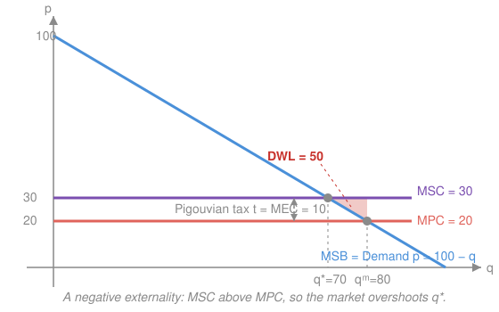

# Mathematical Microeconomics · Lesson 5.2: Externalities and public goods

> ⏱ ~15 min · Module 5: Equilibrium and market failure · Builds on: [4.1 Perfect competition and welfare](04-01-competition-welfare.md), [5.1 General equilibrium and the welfare theorems](05-01-general-equilibrium-welfare-theorems.md) · Unlocks: 5.3 (asymmetric information)

## Why this matters

The First Welfare Theorem of [5.1](05-01-general-equilibrium-welfare-theorems.md) is a promise with fine print: a competitive equilibrium is Pareto efficient *provided* every cost and benefit is priced in and every good can be bought and sold. This lesson lives in the fine print. When a factory's smoke lands on a neighbor who never agreed to it, or when a lighthouse shines on ships that never paid, prices stop carrying the whole story and the invisible hand misfires — predictably, and in a direction you can compute. The payoff is not just the diagnosis but three repair kits: the Pigouvian tax, the Coase theorem, and the Samuelson condition. These are the tools behind carbon pricing, pollution-permit markets, and every public-goods budget argument.

## The idea

An **externality** is a cost or benefit that one agent's action imposes on a third party who is not part of the transaction — pollution downwind, vaccination protecting the unvaccinated, a beautiful garden the neighbors enjoy for free. The market prices the private slice and ignores the rest, so it gets the quantity wrong.

Take a factory whose production pollutes. The firm weighs its *private* marginal cost — labor, materials — and produces up to where price covers it. But society also bears the pollution damage, a cost the firm never pays. So the *social* marginal cost is higher, and the market, blind to that extra cost, **overproduces**. The gap between what the market does and what is efficient is a real loss, a triangle of value destroyed.

The fixes attack the gap from two directions. A **Pigouvian tax** makes the firm pay exactly the external cost, folding it into the private calculation so the firm chooses the efficient quantity on its own. The **Coase theorem** says something more radical: if the parties can bargain cheaply and someone clearly owns the right to pollute (or to clean air), they will *negotiate* their way to efficiency without a tax at all — who owns the right changes who pays, not what gets done.

A **public good** is the extreme externality: it is **non-rival** (my enjoying it doesn't diminish yours — national defense, a streetlight) and **non-excludable** (you can't keep non-payers out). Because everyone consumes the *same* quantity, the efficient level sums *willingness to pay across people*, not quantities — you stack the demand curves **vertically**. Left to a market, each person waits for others to pay, and the good is **under-provided**: the free-rider problem.

## The formal version

Consider a good produced in quantity $q$. Write the **marginal social benefit** $MSB(q)$ (the inverse demand curve — what the marginal unit is worth to consumers), the **marginal private cost** $MPC(q)$ (the producer's own marginal cost, which is the supply curve under competition), and the **marginal external cost** $MEC(q)$ (the damage the marginal unit imposes on third parties). The **marginal social cost** is their sum:

$$MSC(q) = MPC(q) + MEC(q).$$

*In words: the true cost of one more unit is what the producer pays plus what everyone else pays.* (For a positive externality, the external term lands on the benefit side instead: $MSB = MPB + MEB$, and the sign of every conclusion below flips.)

**The market outcome.** A competitive market equates price to private cost, so it settles at $q^m$ solving

$$MSB(q^m) = MPC(q^m).$$

**The efficient outcome.** A planner maximizing total surplus (benefits minus *all* costs) equates marginal social benefit to marginal social cost:

$$MSB(q^*) = MSC(q^*).$$

*In words: keep producing while the next unit is worth more to society than it costs society; stop when they meet.* For a negative externality $MEC>0$, we have $MSC>MPC$, so $q^m > q^*$ — **overproduction**. The welfare cost is the **deadweight loss**, the area between $MSC$ and $MSB$ over the units that should not have been made:

$$DWL = \int_{q^*}^{q^m} \big[MSC(q) - MSB(q)\big]\,dq.$$

*In words: every unit past $q^*$ costs society more than it delivers; sum those net losses.*

**The Pigouvian tax.** Levy a per-unit tax $t = MEC(q^*)$ — the external cost *evaluated at the efficient quantity*. The firm's perceived marginal cost becomes $MPC + t = MPC + MEC(q^*) = MSC(q^*)$, so its private optimum now solves $MSB = MSC$ and lands exactly at $q^*$. *In words: charge the polluter the damage, and its selfish choice becomes the social one — the externality is "internalized."*

**The Coase theorem.** If property rights over the externality are clearly assigned and bargaining is costless (no transaction costs, no wealth effects), the parties negotiate to the *efficient* allocation regardless of *who* holds the right; the assignment determines only the **distribution** of surplus, not the outcome. *In words: with a clear owner and a cheap phone call, the market failure is bargained away — the law decides who pays, not what happens.*

**Public goods and the Samuelson condition.** A public good is consumed in common: each consumer $i$ enjoys the *same* total quantity $G$. Efficient provision maximizes total surplus, which sums each consumer's marginal benefit (equivalently, marginal rate of substitution between the public good and money, $MRS_i$) against the marginal cost of production (the marginal rate of transformation, $MRT$):

$$\boxed{\;\sum_i MRS_i(G) \;=\; MRT(G)\;}$$

*In words: because one unit of the public good is enjoyed by everyone at once, its social marginal benefit is the* sum *of individual marginal benefits — add willingness-to-pay* vertically*, then set it equal to marginal cost.* Contrast a **private** good, where consumers face a common price and you add *quantities* horizontally. Voluntary private provision instead has each consumer contribute only until *their own* $MRS_i = MRT$, ignoring everyone else's benefit — so provision falls far short of the Samuelson level. That shortfall is **free-riding**.

## Picture

The demand curve is $MSB$. Private supply is $MPC$; social supply $MSC$ sits above it by the external cost $MEC$. The market clears where demand meets $MPC$ (at $q^m$), but efficiency is where demand meets $MSC$ (at $q^*<q^m$). Every unit in between costs society more than it is worth — that is the shaded deadweight-loss triangle. The dashed vertical wedge is the Pigouvian tax $t=MEC$: add it to $MPC$, the private supply curve rises to $MSC$, and the market clears at $q^*$ on its own.

## Worked examples

**Example 1 (mechanical — locate the wedge and price it out).** Demand is $MSB = 100 - q$, private cost is constant $MPC = 20$, and each unit does external damage $MEC = 10$, so $MSC = 30$.

- *Market:* $MSB = MPC \Rightarrow 100 - q = 20 \Rightarrow q^m = 80$.
- *Efficient:* $MSB = MSC \Rightarrow 100 - q = 30 \Rightarrow q^* = 70$.
- *DWL:* the gap $MSC - MSB = 30 - (100 - q) = q - 70$, integrated from $70$ to $80$:
$$DWL = \int_{70}^{80}(q-70)\,dq = \tfrac12(10)^2 = 50.$$
- *Fix:* set $t = MEC = 10$. Perceived cost becomes $20 + 10 = 30$, the market solves $100 - q = 30$, and $q = 70 = q^*$. The tax collects $t\cdot q^* = 700$ in revenue while erasing the 50 of deadweight loss.

**Example 2 (why you'd care — a public good, summed the right way).** Two residents value streetlights $G$. Resident 1's marginal benefit is $MB_1 = 60 - G$; resident 2's is $MB_2 = 40 - G$. Each light costs $MC = 50$ to provide.

*Efficient (Samuelson, vertical sum):*
$$MB_1 + MB_2 = MC \;\Rightarrow\; (60 - G) + (40 - G) = 50 \;\Rightarrow\; 100 - 2G = 50 \;\Rightarrow\; G^* = 25.$$

*Private provision (each acts alone):* resident 1 funds lights only while $MB_1 \ge MC$: $60 - G = 50 \Rightarrow G = 10$. Resident 2 would want $40 - G = 50 \Rightarrow G = -10$, i.e. zero — even the first light isn't worth 50 to her alone, so she contributes nothing and **free-rides** on resident 1. Private provision delivers $G = 10$ against the efficient $25$: massive under-provision, because no individual internalizes that *both* residents bask in every light.

## Watch out

- You might think a negative externality means the good is "bad" and shouldn't exist. It means the good is *over*-produced, not that $q^*=0$. The efficient quantity is usually positive — pollution and all — because the first units are worth more than their full social cost. Efficiency trims the tail, it doesn't ban the activity.
- You might set the Pigouvian tax equal to the *marginal damage at the market quantity* $MEC(q^m)$. When $MEC$ varies with $q$, the correct tax is $MEC(q^*)$, evaluated at the *efficient* quantity — the point you want the market to reach, not the one you're leaving. (With constant $MEC$, as here, the distinction vanishes.)
- You might think Coase makes taxes unnecessary in general. It requires *costless* bargaining and *clear* rights — with many affected parties (every breather of city air), transaction costs and holdouts explode, and the theorem's hypotheses fail. Coase is a benchmark and a lens on property law, not a universal substitute for Pigou.
- For public goods, you might add demand curves horizontally as you would for a private good. Don't: everyone consumes the *same* $G$, so you sum marginal *willingness to pay* vertically. Horizontal summation answers a different (private-good) question entirely.

## One-liner

> An externality drives a wedge $MSC = MPC + MEC$ between private and social cost so the market misses $q^*$ where $MSB=MSC$ — close it with a Pigouvian tax $t=MEC$, with Coasean bargaining, or (for a public good) by summing $\sum_i MRS_i = MRT$ vertically against free-riding.

## Problems

**P1 (🟢)** A competitive market has demand $p = 100 - q$ and constant private marginal cost $MPC = 20$. Production emits a pollutant with constant marginal external cost $MEC = 10$. (a) Find the market quantity $q^m$ and the efficient quantity $q^*$. (b) Compute the deadweight loss at $q^m$. (c) State the Pigouvian tax that restores efficiency and verify it lands the market at $q^*$.

**P2 (🟡)** A factory upstream pollutes a downstream fishery. If the factory pollutes, it earns profit $100$ and the fishery earns $30$. If instead the factory installs a filter (netting profit $60$ after the filter's cost), the water stays clean and the fishery earns $80$. Bargaining is costless. (a) Which outcome is efficient? (b) Suppose the fishery holds the right to clean water. Show the efficient outcome results, and give the payoffs. (c) Suppose instead the factory holds the right to pollute. Show the *same* efficient outcome results, and give a payoff split. (d) In one line, what did the assignment of the right change?

**P3 (🔴)** A public good $G$ is valued by two consumers with marginal willingness to pay $MB_1 = 50 - G$ and $MB_2 = 30 - \tfrac12 G$. The good is produced at constant marginal cost $MC = 40$. (a) Apply the Samuelson condition to find the efficient quantity $G^*$. (b) Find what each consumer would provide acting alone, and the resulting non-cooperative provision. (c) Quantify the under-provision.

Solutions

**P1** (a) $MSC = MPC + MEC = 30$.
- Market: $100 - q = 20 \Rightarrow q^m = 80$ (traded at price $20$).
- Efficient: $100 - q = 30 \Rightarrow q^* = 70$.

(b) The deadweight loss is the triangle between $MSC$ and $MSB$ from $q^*$ to $q^m$. Its height at $q^m$ is $MSC - MSB(q^m) = 30 - (100-80) = 30 - 20 = 10$; its base is $q^m - q^* = 10$:
$$DWL = \tfrac12 (10)(10) = 50.$$
Equivalently $\int_{70}^{80}\big[30 - (100-q)\big]\,dq = \int_{70}^{80}(q-70)\,dq = \tfrac12(10)^2 = 50$.

(c) Set $t = MEC = 10$. The firm's perceived cost is $MPC + t = 30$, so the market solves $100 - q = 30 \Rightarrow q = 70 = q^*$. ✓

*Check:* with the tax the market quantity equals the planner's quantity, and the $50$ of deadweight loss is eliminated; the wedge $MSC-MPC=10$ is exactly the tax that closes it. ✓

**P2** (a) Compare total surplus. Pollute: $100 + 30 = 130$. Filter (clean): $60 + 80 = 140$. Since $140 > 130$, **installing the filter is efficient** — the damage avoided ($80 - 30 = 50$) exceeds the filter's cost ($100 - 60 = 40$).

(b) *Fishery owns clean water.* Default: no pollution, factory installs filter → payoffs $(\text{factory } 60,\ \text{fishery } 80)$. Could the factory buy the right to pollute? It would gain $100 - 60 = 40$, but the fishery loses $80 - 30 = 50$ and so demands at least $50$. Since $40 < 50$, no deal — the outcome stays **clean (efficient)**, payoffs $(60, 80)$.

(c) *Factory owns the right to pollute.* Default: pollution, payoffs $(100, 30)$. The fishery gains $80 - 30 = 50$ from clean water and will pay the factory to install the filter; the factory needs at least $100 - 60 = 40$ to agree. Any price $P \in [40, 50]$ closes a deal — say $P = 45$. Outcome: **clean (efficient)**; payoffs factory $60 + 45 = 105$, fishery $80 - 45 = 35$.

(d) Only the **distribution**: the filter gets installed either way (efficiency is the same, per Coase), but holding the right is worth roughly the value of the externality — the fishery nets $80$ when it owns clean water versus $35$ when it must buy it.

*Check:* both assignments reach total surplus $140$ (b: $60+80$; c: $105+35$), matching the efficient total from (a) — the outcome is invariant to the assignment, only the split moves. ✓

**P3** (a) Samuelson condition — sum marginal benefits **vertically** and set equal to $MC$:
$$MB_1 + MB_2 = MC \;\Rightarrow\; (50 - G) + \big(30 - \tfrac12 G\big) = 40 \;\Rightarrow\; 80 - \tfrac32 G = 40 \;\Rightarrow\; \tfrac32 G = 40 \;\Rightarrow\; G^* = \tfrac{80}{3} \approx 26.7.$$
Check both benefits are still positive there: $MB_1 = 50 - 26.7 = 23.3 > 0$, $MB_2 = 30 - 13.3 = 16.7 > 0$, and $23.3 + 16.7 = 40 = MC$. ✓

(b) Acting alone, each provides until *their own* marginal benefit meets $MC$:
- Consumer 1: $50 - G = 40 \Rightarrow G = 10$.
- Consumer 2: $30 - \tfrac12 G = 40 \Rightarrow G = -20$, i.e. **zero** (even the first unit isn't worth $40$ to her alone).

In the non-cooperative (voluntary-contribution) equilibrium, consumer 1 funds up to his private optimum $G = 10$ and consumer 2 free-rides at $0$, so provision is $G_{\text{priv}} = 10$.

(c) Under-provision: $G^* - G_{\text{priv}} = \tfrac{80}{3} - 10 = \tfrac{50}{3} \approx 16.7$ units short — the market delivers about $37\%$ of the efficient quantity. The wedge is the entire vertical stack of *other people's* unpriced benefit, which no individual contributor internalizes.

*Check:* at the private level $G=10$, the sum of marginal benefits is $MB_1 + MB_2 = (50-10) + (30-5) = 40 + 25 = 65 > 40 = MC$ — society still values the next unit far above its cost, confirming provision is inefficiently low. ✓

## Flashback

**From Lesson 4.1 (Perfect competition and welfare):** A competitive market with *no* externality has demand $p = 120 - 2q$ and supply $p = 30 + q$. Find the equilibrium $(q^*, p^*)$, and compute consumer surplus, producer surplus, and total surplus. (This is the benchmark the externality destroys — here the First Welfare Theorem holds and the surplus is maximal.)

Solution

Equilibrium: $120 - 2q = 30 + q \Rightarrow 90 = 3q \Rightarrow q^* = 30$, and $p^* = 30 + 30 = 60$ (check demand: $120 - 2(30) = 60$ ✓).

- **Consumer surplus** — area under demand, above $p^*$, up to $q^*$. Demand's intercept is $120$: $CS = \tfrac12(120 - 60)(30) = \tfrac12(60)(30) = 900$.
- **Producer surplus** — area above supply, below $p^*$, up to $q^*$. Supply's intercept is $30$: $PS = \tfrac12(60 - 30)(30) = \tfrac12(30)(30) = 450$.
- **Total surplus** $= 900 + 450 = 1350$.

*Check:* total surplus equals the single triangle between the curves from the demand intercept to the supply intercept: $\tfrac12(120 - 30)(30) = \tfrac12(90)(30) = 1350$. ✓ With $MSC=MPC$ everywhere, this competitive quantity *is* the efficient one — exactly the case 5.2 breaks by adding $MEC>0$.

## Connections

- **Backward:** this is the promise of [5.1](05-01-general-equilibrium-welfare-theorems.md) read against its hypotheses — the First Welfare Theorem assumes all costs are priced, and an externality is precisely that assumption failing. The surplus geometry (CS, PS, deadweight-loss triangles) is the machinery of [4.1](04-01-competition-welfare.md), now with a second cost curve $MSC$ stacked above $MPC$.
- **Forward:** [5.3](05-03-asymmetric-information.md) is the *other* way the welfare theorems fail — not an uncounted cost, but hidden information. Adverse selection is a market unraveling because quality is unobserved, the informational cousin of the externality's unpriced cost; both end in inefficiency a well-designed mechanism can partly repair.
- **Sideways (public finance / environmental economics):** the Pigouvian tax is the theory behind carbon pricing, and the equivalence of a tax to a tradable-permit market (price versus quantity instruments) is the Coasean insight applied at scale. The Samuelson condition is the workhorse of every cost–benefit argument for public infrastructure — sum the willingness-to-pay, compare to cost.
