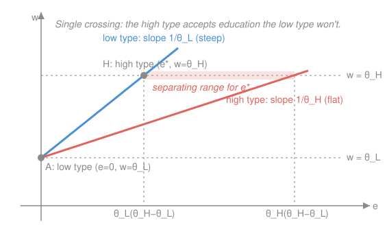

# Mathematical Microeconomics · Lesson 5.3: Asymmetric information

> ⏱ ~15 min · Module 5: Equilibrium and market failure · Builds on: [5.1 General equilibrium and the welfare theorems](05-01-general-equilibrium-welfare-theorems.md), [2.1 Expected utility](02-01-expected-utility.md) · Unlocks: game-theory, grad micro (course complete)

## Why this matters

The First Welfare Theorem of [5.1](05-01-general-equilibrium-welfare-theorems.md) promised that any competitive equilibrium is Pareto efficient — but it quietly assumed everyone knows what they're trading. Drop that assumption and the invisible hand can strangle the market it's supposed to clear: good used cars vanish, the healthy can't buy insurance, skilled workers burn years on degrees that teach them nothing. This capstone lesson shows *how* private information breaks efficient trade, and the two ways a market claws some of it back. It is where microeconomics stops describing a benevolent mechanism and starts describing a strategic one — the doorway to `game-theory-refresher` and graduate micro.

## The idea

Two failures, told apart by *when* the information gap bites.

**Adverse selection** is *hidden type, before you contract.* The seller of a used car knows it's a lemon; you don't. You can only offer the price a car of *average* quality is worth — but at that price the owners of good cars, who value theirs above average, walk away. The average quality of what's left drops, so you lower your offer, so more of the better cars exit, and the market ratchets *down* until only the worst trade — or none does. Selection is *adverse* because the very act of pricing selects the junk.

**Moral hazard** is *hidden action, after you contract.* Once your car is fully insured, you stop locking it. The insurer can't see your care, only the outcome, so your incentive to take care collapses the moment the contract is signed. This is the **principal–agent** problem: the principal (insurer, employer, shareholder) wants the agent (insured, worker, manager) to take an unobservable action, but the contract can only reward observable results.

Two remedies restore some trade:

- **Signaling** — the *informed* party burns something to prove its type. A worker gets a degree not for what it teaches but because it is *cheaper for a good worker to earn than a bad one*; that cost gap is the only thing that makes the diploma credible. This is Spence's model, and its engine is the **single-crossing** condition.
- **Screening** — the *uninformed* party designs a menu so that each type, choosing what's best for itself, reveals which type it is: insurance with a deductible (only the low-risk take it), coach vs. first class, damaged-goods versioning.

## The formal version

**Akerlof's lemons market.** Car quality $q$ is drawn from a distribution known to buyers only in aggregate; each *seller* knows their own $q$. A seller values their car at $q$ (reservation price) and a buyer values it at $\beta q$ with $\beta>1$, so *every* trade is efficient: $\beta q > q$ for all $q>0$. At a market price $p$, a seller sells iff $q\le p$ — so the cars offered are exactly the bottom slice $\{q\le p\}$. A rational buyer therefore pays not $\beta\,\mathbb{E}[q]$ but the conditional mean of what's *actually for sale*:
$$p \;=\; \beta\,\mathbb{E}[\,q \mid q\le p\,].$$
*In words: price equals the buyer's value of the average car that survives at that price — and that average is dragged down by the fact that only the worse cars show up.* Because $\mathbb{E}[q\mid q\le p]$ is generally well below $p$, the equation can fail at every positive $p$ and the market **unravels** to $p=0$: efficient trades that everyone would want under full information simply do not happen. The efficiency loss is the *entire* gains-from-trade $(\beta-1)\,\mathbb{E}[q]$.

**Moral hazard (principal–agent, briefly).** An agent picks unobservable effort $a$ at private cost $c(a)$, $c'>0$; output $y$ is random with a distribution improved by $a$. A contract pays $w(y)$. Full insurance ($w$ constant) sets the agent's marginal return to effort to zero, so they choose $a=0$: the principal must instead expose the agent to output risk to restore incentives, trading off **insurance against incentives**. The efficiency loss is the risk the risk-averse agent is forced to bear (valued by the wedge from [2.1](02-01-expected-utility.md), Example 2) *plus* the effort still lost.

**Signaling (Spence).** Two worker types with productivities $\theta_H>\theta_L$; a competitive labor market pays a worker its *believed* productivity. A worker of type $\theta$ acquiring education $e$ pays cost $c(e,\theta)=e/\theta$ — decreasing in type, the crux. Utility is $U=w-e/\theta$. A **separating equilibrium** has the low type pick $(e=0,\,w=\theta_L)$ and the high type pick $(e^{\ast},\,w=\theta_H)$, sustained by two incentive-compatibility (IC) constraints:
$$\underbrace{\theta_L \;\ge\; \theta_H-\tfrac{e^{\ast}}{\theta_L}}_{\text{low won't mimic high}}\quad\Longleftrightarrow\quad e^{\ast}\ge \theta_L(\theta_H-\theta_L),$$
$$\underbrace{\theta_H-\tfrac{e^{\ast}}{\theta_H}\;\ge\;\theta_L}_{\text{high prefers to signal}}\quad\Longleftrightarrow\quad e^{\ast}\le \theta_H(\theta_H-\theta_L).$$
*In words: the signal must be dear enough that the low type won't fake it, yet cheap enough that the high type still bothers.* The gap between the bounds exists precisely because $1/\theta_L>1/\theta_H$ — the **single-crossing** property: in $(e,w)$ space the low type's indifference curves are *steeper*, so any two cross exactly once. Education here has **zero** productive value; the entire signaling cost $e^{\ast}/\theta_H$ is deadweight — information is bought, nothing is produced.

**Screening (self-selection).** Reverse the move: the uninformed principal posts a *menu* of contracts $\{(e,w)\}$ and lets each type sort itself by choosing its favorite, subject to the same IC constraints. Signaling and screening are the two sides of the single-crossing coin — informed-moves-first vs. uninformed-moves-first.

## Picture

Both indifference lines leave the low outcome $A=(0,\theta_L)$; the steep blue one is the low type (marginal education cost $1/\theta_L$), the flat red one the high type ($1/\theta_H$). They cross once — single crossing. Where each hits the high wage $w=\theta_H$ fixes a bound: the low type reaches it at $e=\theta_L(\theta_H-\theta_L)$ (any less and the low type mimics), the high type at $e=\theta_H(\theta_H-\theta_L)$ (any more and even the high type quits). The shaded band between them is every education level $e^{\ast}$ that separates the types — all of it wasteful.

## Worked examples

**Example 1 (unravelling, computed).** Quality is uniform on $[0,100]$ and $\beta=\tfrac32$. Conditional on $q\le p$, quality is uniform on $[0,p]$, so $\mathbb{E}[q\mid q\le p]=p/2$. The equilibrium condition becomes
$$p=\tfrac32\cdot\tfrac{p}{2}=\tfrac34 p.$$
The only solution is $p=0$: at *any* positive price the most a buyer will pay, $\tfrac34 p$, is below $p$, so good cars keep exiting. The market collapses to the single worthless car — even though every one of the trades was worth making. (This is Problem 1 / Boss 5, done in miniature.)

**Example 2 (a signal's cost).** Take $\theta_L=1$, $\theta_H=2$. The IC bounds give $e^{\ast}\in[\,1\cdot1,\ 2\cdot1\,]=[1,2]$. The least-cost separating equilibrium picks $e^{\ast}=1$; the high type earns wage $2$ at personal cost $1/\theta_H=\tfrac12$, netting $U_H=2-\tfrac12=\tfrac32>1=\theta_L$ — so signaling beats masquerading as low. Yet under full information the firm would pay the high type $2$ for *no* education: that $\tfrac12$ of cost is pure deadweight, the price the market pays to reveal what a symmetric-information world would already know.

## Watch out

- You might think adverse selection needs *bad* products. It needs *hidden variation*: it is the correlation between the hidden type and the decision to trade that poisons the pool. Raise quality uniformly and the same unravelling recurs one tier up.
- You might conflate the two failures. Adverse selection is hidden **type** (a fixed characteristic) screened *before* contracting; moral hazard is hidden **action** (a choice) taken *after*. Signaling/screening fight the first; incentive pay and deductibles fight the second.
- You might think education in Spence must be productive to matter. It need not raise $\theta$ at all — its *sorting* power comes entirely from the cost gap $c(e,\theta_L)>c(e,\theta_H)$. Strip single-crossing and no separating signal exists.
- You might expect the signal to be efficient because it conveys true information. Information transmitted $\ne$ value created: the separating equilibrium is informationally better yet resource-wasteful, a genuine second-best.

## One-liner

> Hidden information breaks the First Welfare Theorem two ways — adverse selection (hidden type) unravels the market from the bottom, moral hazard (hidden action) guts incentives after the deal — and single-crossing is what lets a costly signal or a self-selecting menu buy some efficiency back.

## Problems

**P1 (🟢) — Boss 5, the lemons market.** Car quality $q$ is uniform on $[0,100]$; a seller values a car at $q$, a buyer at $1.5q$. Sellers know their own $q$; buyers know only the distribution. (a) At price $p$, which cars are offered for sale, and what is the expected quality of the cars on offer? (b) Write the condition for a buyer to break even and solve for every equilibrium price. (c) State the efficiency loss relative to the full-information outcome.

**P2 (🟡) — two-type variant.** Now just two kinds of car. A *bad* car: seller values it at 4,000 dollars, a buyer at 6,000. A *good* car: seller values it at 10,000, a buyer at 14,000. A fraction $\lambda$ of cars are good, and buyers pay the expected value of a randomly offered car. (a) For which $\lambda$ does a pooling market in which *both* types sell survive? (b) For $\lambda$ below that threshold, what trades, at what price, and what surplus is destroyed?

**P3 (🔴) — Spence signaling.** Types $\theta_H>\theta_L>0$, wage = believed productivity, education cost $c(e,\theta)=e/\theta$, utility $U=w-e/\theta$. Education raises productivity by nothing. (a) Derive the two IC constraints for a separating equilibrium in which the low type takes $e=0$ and the high type takes $e^{\ast}$, and give the full range of $e^{\ast}$. (b) Show the range is nonempty and explain which feature of $c$ guarantees it. (c) Compute the deadweight loss of the least-cost separating equilibrium and say who bears it.

Solutions

**P1** (a) A seller sells iff the price covers their reservation value, $q\le p$, so the cars on offer are exactly $\{q\le p\}$. Conditional on $q\le p$, quality is uniform on $[0,p]$, so the expected quality offered is $\mathbb{E}[q\mid q\le p]=p/2$.

(b) A buyer's value for the average car on offer is $1.5\cdot\mathbb{E}[q\mid q\le p]=1.5\cdot\tfrac{p}{2}=0.75\,p$. Break-even (willingness to pay $\ge$ price) requires $0.75\,p\ge p$, i.e. $-0.25\,p\ge0$, i.e. $p\le0$. Combined with $p\ge0$, the **only equilibrium is $p=0$**: at any $p>0$ a buyer would pay at most $0.75p<p$, so trade cannot clear and the market fully unravels — only the $q=0$ car (worth nothing to anyone) is "traded."

(c) Under full information every car trades — each generates surplus $1.5q-q=0.5q$ — for a total of $\int_0^{100}0.5q\cdot\tfrac{1}{100}\,dq=0.5\cdot\tfrac{1}{100}\cdot\tfrac{100^2}{2}=25$ dollars per car on average, equivalently $0.5\,\mathbb{E}[q]=0.5(50)=25$. Asymmetric information destroys *all* of it: the efficiency loss is the entire $(\beta-1)\mathbb{E}[q]=25$ per car.

*Check:* the fixed point $p=0.75p\Rightarrow p=0$ is unique, and $(\beta-1)\mathbb{E}[q]=0.5\cdot50=25$ matches the integral. Every positive-surplus trade is foregone. ✓

**P2** (a) If both types sell, a buyer pays the pooled expected value $P(\lambda)=\lambda(14{,}000)+(1-\lambda)(6{,}000)=6{,}000+8{,}000\lambda$. A *good* seller (reservation 10,000) participates only if $P(\lambda)\ge10{,}000$:
$$6{,}000+8{,}000\lambda\ge10{,}000\;\Longrightarrow\;\lambda\ge\tfrac{1}{2}.$$
So the pooling market with both types sells survives iff $\lambda\ge\tfrac12$ (bad sellers, reservation 4,000, always participate since $P\ge6{,}000>4{,}000$).

(b) For $\lambda<\tfrac12$: at any price high enough to keep good sellers ($\ge10{,}000$) buyers would lose money ($P(\lambda)<10{,}000$), so good cars **withdraw**. Only bad cars trade, at a price in $[4{,}000,\,6{,}000]$ (competitive buyers bid it to the bad-car value 6,000). The good-car market has collapsed. Surplus destroyed = the foregone good-car gains from trade, $14{,}000-10{,}000=4{,}000$ dollars per good car, i.e. $4{,}000\lambda$ per car in the population — a pure adverse-selection loss.

*Check:* at the threshold $\lambda=\tfrac12$, $P=10{,}000$ exactly equals the good seller's reservation — the knife-edge where good cars are just indifferent, as it should be. ✓

**P3** (a) Truthful low type gets $U_L=\theta_L-0=\theta_L$. If the low type *mimics* the high type it earns $\theta_H$ but pays $e^{\ast}/\theta_L$, so no-mimic requires
$$\theta_L\ge\theta_H-\frac{e^{\ast}}{\theta_L}\;\Longrightarrow\;e^{\ast}\ge\theta_L(\theta_H-\theta_L).$$
The high type, choosing to signal, gets $\theta_H-e^{\ast}/\theta_H$; deviating to $e=0$ (and being taken for low) yields $\theta_L$. Prefer-to-signal requires
$$\theta_H-\frac{e^{\ast}}{\theta_H}\ge\theta_L\;\Longrightarrow\;e^{\ast}\le\theta_H(\theta_H-\theta_L).$$
Range: $\boxed{\,\theta_L(\theta_H-\theta_L)\le e^{\ast}\le\theta_H(\theta_H-\theta_L)\,}$.

(b) Nonempty because $\theta_H>\theta_L>0\Rightarrow\theta_L(\theta_H-\theta_L)<\theta_H(\theta_H-\theta_L)$. The gap is $(\theta_H-\theta_L)^2>0$, and it exists exactly because the marginal cost of education differs across types, $1/\theta_L>1/\theta_H$ — the **single-crossing** property. Equal costs ($\theta_L=\theta_H$) collapse the interval to a point of width zero: no separation.

(c) The least-cost separating equilibrium sets $e^{\ast}=\theta_L(\theta_H-\theta_L)$. Education adds nothing to output, so under full information the same wages $(\theta_L,\theta_H)$ are paid with $e=0$. The deadweight loss is the education cost borne by the **high type**:
$$\frac{e^{\ast}}{\theta_H}=\frac{\theta_L(\theta_H-\theta_L)}{\theta_H}=\theta_L\!\left(1-\frac{\theta_L}{\theta_H}\right)>0.$$
It is a pure resource waste: the high worker pays it not to become more productive but to be *believed*.

*Check:* with $\theta_L=1,\theta_H=2$ the range is $[1,2]$ (matching Example 2) and the least-cost loss is $1\cdot(1-\tfrac12)=\tfrac12$, exactly Example 2's figure. ✓

## Flashback

**From Lesson 2.1 (Expected utility):** An agent with vNM index $u(x)=\ln x$ faces a gamble paying 100 dollars or 25 dollars, each with probability $\tfrac12$. (a) Compute the expected utility. (b) Find the certainty equivalent $\mathrm{CE}$ (the sure amount worth the same). (c) Report the risk premium against the gamble's expected money.

Solution

(a) $\mathbb{E}[u]=\tfrac12\ln100+\tfrac12\ln25=\tfrac12\ln(100\cdot25)=\tfrac12\ln2500=\ln\sqrt{2500}=\ln50\approx3.912.$

(b) $\mathrm{CE}$ solves $\ln(\mathrm{CE})=\mathbb{E}[u]=\ln50$, so $\mathrm{CE}=50$ — the *geometric* mean $\sqrt{100\cdot25}$, exactly what log utility rewards.

(c) Expected money is $\tfrac12(100)+\tfrac12(25)=62.5$, so the risk premium is $62.5-50=12.5$ dollars — the amount the agent would sacrifice to swap the gamble for its mean.

*Check:* log utility always yields $\mathrm{CE}=$ geometric mean $\le$ arithmetic mean (AM–GM), so a positive risk premium is guaranteed for any non-degenerate gamble — consistent with concavity $\Rightarrow$ risk aversion from [2.1](02-01-expected-utility.md). ✓

## Connections

- **Backward:** this is the failure clause of [5.1](05-01-general-equilibrium-welfare-theorems.md)'s First Welfare Theorem — the theorem's hidden hypothesis is symmetric information, and every unravelling here is a competitive "equilibrium" that lands off the contract curve. The lemons buyer prices the *conditional* mean $\mathbb{E}[q\mid q\le p]$, the expectation operator from [2.1](02-01-expected-utility.md) now taken over a hidden type, and the moral-hazard loss is exactly [2.1](02-01-expected-utility.md)'s risk wedge forced onto a risk-averse agent.
- **Sideways:** adverse selection sits beside the other market failures of [5.2](05-02-externalities-public-goods.md) (externalities, public goods) — all cases where price signals carry too little information to guide efficient trade — but here the missing information is about *identity*, not about *effects on others*.
- **Forward:** signaling and screening are equilibrium concepts in a game of incomplete information; making "believed productivity" precise needs Bayesian updating and the refinements (perfect Bayesian, the intuitive criterion) that pin down *which* separating equilibrium survives — the content of `game-theory-refresher`. From there the principal–agent model becomes the backbone of contract theory, mechanism design, and the graduate micro sequence (MWG Part IV). **Course complete** — you now have the full arc from a single indifference curve to a market that lies to itself.
