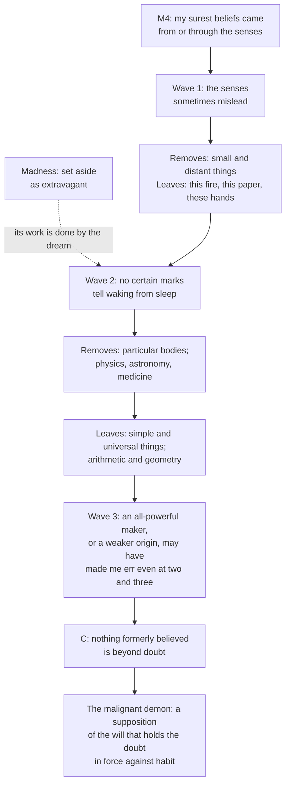

# Modern Philosophy · Lesson 1.1: The method of doubt

> ⏱ ~15 min · Module 1: Descartes · Builds on: [philosophical-method 1.3 Reconstruction and charity](../../philosophical-method/lessons/01-03-reconstruction-and-charity.md), [philosophical-method 3.3 Thought experiments](../../philosophical-method/lessons/03-03-thought-experiments.md) · Unlocks: [1.2 The cogito and the wax](01-02-the-cogito-and-the-wax.md)

## Why this matters

Descartes was schooled by the Jesuits at La Flèche in an Aristotelian philosophy that began with the senses: the intellect understands by abstracting natures from sense images and cannot think without turning to them ([ancient-medieval-philosophy 3.5](../../ancient-medieval-philosophy/lessons/03-05-soul-and-intellect.md), [thomistic-synthesis 4.1](../../thomistic-synthesis/lessons/04-01-how-a-human-intellect-knows.md)). The *Meditations on First Philosophy* (1641) opens by withdrawing trust from exactly that starting point. Read Meditation I as the first move of a construction, not as a skeptic's creed.

## The idea

Descartes's image is architectural. In the *Discourse on Method* (1637), Part II, he notes that no private person should pull down a city, but a man may pull down his own house when its foundations are unsure. Meditation I opens with the same resolve. Having taken many false opinions for true since youth, he must once in his life overthrow them all, "commencing anew the work of building from the foundation" if he wants a lasting structure in the sciences (Veitch translation, 1901, used throughout).

Two economies make the demolition possible. First, he need not show his beliefs false: "it will be sufficient to justify the rejection of the whole if I shall find in each some ground for doubt." Second, he need not test them one at a time. Undermine the foundation and the building falls, so he attacks the principle his surest beliefs rested on: the senses.

The structure he is after is what epistemologists now call foundationalism (live in [epistemology 2.2](../../epistemology/lessons/02-02-foundationalism.md)). The doubt serves it: a [method of doubt](../reference.md#method-of-doubt), a procedure for finding a foundation, run once. Descartes's own image, from his reply to the Jesuit Pierre Bourdin in the Seventh Objections (1642), is a basket of apples, some perhaps rotten. You tip them all out, inspect each, and put back only the sound ones. Tipping out is not judging every apple rotten.

## Source

Meditation I, its closing paragraphs. The meditator has just admitted that his old opinions, though doubtful, are still "highly probable", and that habit keeps pulling him back to them.

> It is for this reason I am persuaded that I shall not be doing wrong, if, taking an opposite judgment of deliberate design, I become my own deceiver, by supposing, for a time, that all those opinions are entirely false and imaginary [...]. [...] I cannot for the present yield too much to distrust, since the end I now seek is not action but knowledge. I will suppose, then, not that Deity, who is sovereignly good and the fountain of truth, but that some malignant demon, who is at once exceedingly potent and deceitful, has employed all his artifice to deceive me; I will suppose that the sky, the air, the earth, colors, figures, sounds, and all external things, are nothing better than the illusions of dreams [...]; I will consider myself as without hands, eyes, flesh, blood, or any of the senses [...].

Three things to notice.

- **"Of deliberate design ... my own deceiver."** Supposing everything false is an act of will, a counterweight to habit. It adds no new ground for doubt.
- **"Not action but knowledge."** The doubt is confined to the search for truth. Meanwhile Descartes lives by the [provisional morality](../reference.md#provisional-morality) of *Discourse* Part III, "three or four maxims", the first of which is to obey the laws and customs of his country.
- **The demon's list.** Sky, air, earth, colours, figures, sounds, external things, his own body. Arithmetic is not on it. The doubt about two and three came earlier, from the deceiving God, and Meditation III says that doubt arose "for no other reason than" the thought that a God might have given him a nature that errs. Readers divide on whether the [evil demon](../reference.md#evil-demon) silently inherits that reach (Meditation II's deceiver is unrestricted) or is a narrower device that keeps the doubt about bodies vivid without making God the deceiver. Meditation I does not settle it.

## The argument

Meditation I, in Descartes's terms. A "ground for doubt" makes a belief less than certain; it is not a reason to think it false.

**The method.**

- **M1.** The sciences need a foundation that is certain and indubitable.
- **M2.** I should withhold assent from what is not entirely certain and indubitable as carefully as from what is manifestly false. *In words:* for this inquiry, uncertain and false are handled alike.
- **M3.** To withhold assent from a class of beliefs, it is enough to find a ground for doubt in the principle they rest on. *In words:* a reason to doubt, not a proof of falsity; by class, not one by one.
- **M4.** My surest beliefs came from or through the senses.

**Wave 1: the senses.**

1. The senses sometimes mislead about small and distant things, and it is prudent not to trust wholly what has deceived even once.
2. But doubting that I sit by this fire holding this paper would rank me with madmen who think their heads are made of clay. That is set aside as extravagant.

*Removes:* judgments about the small and the distant. *Leaves:* the near and ordinary.

**Wave 2: the [dreaming argument](../reference.md#dreaming-argument).**

3. I sleep, and in dreams I have represented these same things, sometimes things less probable than madmen's.
4. There are no certain marks by which waking can be distinguished from sleep.
5. So every particular sensory judgment, that I have hands or am by the fire, has a ground for doubt.
6. But dream images, like a painter's sirens, are composed of elements that must be real: the [simple and universal things](../reference.md#simple-and-universal-things), namely extension, figure, quantity, number, place and time.
7. So physics, astronomy and medicine, which study composite things, are doubtful, while arithmetic and geometry hold whether I am awake or dreaming.

*Removes:* particular bodies and the sciences of composites. *Leaves:* the simple natures and mathematics.

**Wave 3: the [deceiving God argument](../reference.md#deceiving-god-argument).**

8. I have long believed that an all-powerful God made me. He could have arranged that there be no earth, sky or extended thing while I perceive them all. And "how do I know that I am not also deceived each time I add together two and three, or number the sides of a square"?
9. *Reply:* God is supremely good. *Rejoinder:* his goodness evidently permits occasional deception, so it does not obviously forbid constant deception.
10. If instead I came about by fate, chance or a chain of causes, then the less powerful my origin, the likelier my nature is defective. *In words:* either my origin is powerful enough to deceive me, or too weak to guarantee me. Both horns leave my faculty in doubt.

**∴ C.** Nothing I formerly believed is beyond doubt, so by M2 and M3 I withhold assent from all of it until something indubitable turns up.

The demon is not a premise. It comes after C, as the Source's device for keeping C in force.

**Where the argument is weakest.** The pressure falls on M2 and M3 combined with wave 3. Pierre Gassendi (Fifth Objections, 1641) asked why Descartes did not simply call his old beliefs uncertain instead of feigning them false and conjuring a deceiver: that swaps an old prejudice for a new one, and no reader will believe he has really persuaded himself. Bourdin charged that the method takes the doubtful as false and then uses doubtful means to reach the certain. Descartes replied that judging is an act of the will, so assent can be withheld by resolve, with the supposition needed only because habit restores what was suspended (letter to Clerselier, 1646); against Bourdin, the basket. The deepest objection came a century later. Hume (*Enquiry* §12, 1748) argued that a doubt reaching our very faculties could be removed only by reasoning with those same faculties: "The Cartesian doubt, therefore, were it ever possible to be attained by any human creature (as it plainly is not) would be entirely incurable." That pressure becomes the Cartesian circle of [1.3](01-03-god-clear-and-distinct-ideas-and-the-circle.md). The defender's reply is that the wave-3 doubt is, in Meditation III's words, "very slight, and, so to speak, metaphysical", and that it can be met if something proves indubitable even while the deceiver is supposed. That is the bet of [1.2](01-02-the-cogito-and-the-wax.md).

## The argument map

Each wave attacks a deeper source: the senses at a distance, the senses even close at hand (waking itself), then the faculty of judgment.

## Worked examples

**Example 1 (clean: four beliefs through the waves).**

| Belief | Survives | Falls to | Why |
|---|---|---|---|
| The distant tower is round (Meditation VI's example) | none | wave 1 | the senses have misled about distant things |
| I am holding a pen | wave 1 | wave 2 | I have dreamt such scenes and have no certain mark of waking |
| Something extended, with shape and size, is real | waves 1–2, if the painters' "reality" means existence (P2) | wave 3 | a simple and universal thing, but God could have made no extended thing at all |
| A square has four sides | waves 1–2 | wave 3 | true asleep or awake, but my nature may err even here |

What does the work is never the belief's content but its source, which is why one ground disposes of a whole class (M3). And nothing in the table has been shown false; the pen belief is merely not certain.

**Example 2 (hard: why is madness set aside and dreaming not?).** The text dismisses the madman case and turns at once to dreams. Two readings. Michel Foucault (*History of Madness*, 1961) read the dismissal as reason excluding madness: the meditator may suppose he dreams but not that he is mad, since a mad meditator could not conduct the inquiry. Jacques Derrida replied ("Cogito and the History of Madness", a 1963 lecture) that madness is set aside as not radical *enough*: every sane person dreams, dreams can be stranger than madmen's fancies, and the deceiving God later reaches further than madness could. "Were I to regulate my procedure according to examples so extravagant" ties the dismissal to the method. "Though this be true, I must nevertheless here consider" concedes and passes beyond it. The text settles that the dream does the madman's work for every sane reader. It does not settle whether madness is excluded in principle or just not needed. Whether one can coherently doubt one's own reasoning is live in [epistemology 5.5](../../epistemology/lessons/05-05-bayesian-disagreement-and-higher-order-evidence.md).

## Watch out

- **You might think Descartes believes the world probably does not exist, or believes in the demon.** He concludes only that nothing is certain. His old opinions stay more reasonable to believe than to deny, the demon is a supposition of the will, and Meditation VI restores bodies.
- **You might think this revives ancient skepticism.** The ancient skeptics suspended judgment on dogma about the non-evident, lived by appearances, and used dreams to match one impression with another, not to doubt that there is a world ([ancient-medieval-philosophy 4.3](../../ancient-medieval-philosophy/lessons/04-03-the-skeptics.md)). Descartes's doubt is global, temporary, and a means to certainty.
- **Anachronism: "the demon is a brain in a vat."** The vat is a modern gloss (Putnam, 1981). It fits the demon's list but not the deceiving God, since a vat-brain's sums still come out right ([epistemology 3.1](../../epistemology/lessons/03-01-the-closure-argument.md)). The Latin *genius malignus*, often "evil genius", is "malignant demon" in Veitch: say which translation you quote ([anachronism](../reference.md#anachronism)).

## One-liner

> Meditation I does not argue that the world is unreal; it finds a ground for doubting each layer of belief (the senses, waking, the faculty itself) so that whatever survives can bear weight.

## Problems

**P1 (🟢) *(Exegetical (a) · Evaluative (b).)*** Diagnose. An invented study guide says:

> Meditation I is where Descartes proves that we might be dreaming. Since no one can tell dreams from waking life, he concludes that the external world probably does not exist, and to make the point vivid he invents an evil demon who deceives him even about 2 + 3 = 5. Descartes thus revives the skepticism of Sextus Empiricus.

(a) Name three errors and give the textual ground for each, one sentence per error. (b) Gassendi asked why Descartes did not simply call his old beliefs uncertain instead of supposing them false. On Descartes's own premises, is the supposition doing any work that M2 does not already do? Any verdict; 120 words or fewer.

**P2 (🟡) *(Exegetical.)*** Close reading. Meditation I (Veitch), the painters passage:

> [T]he objects which appear to us in sleep are, as it were, painted representations which could not have been formed unless in the likeness of realities [...]. [P]ainters themselves, even when they study to represent sirens and satyrs [...], cannot bestow upon them natures absolutely new [...]. [W]e are nevertheless absolutely necessitated to admit the reality at least of some other objects still more simple and universal than these [...]. To this class of objects seem to belong corporeal nature in general and its extension; the figure of extended things, their quantity or magnitude, and their number [...]. [...] Arithmetic, Geometry, [...] which regard merely the simplest and most general objects, and scarcely inquire whether or not these are really existent, contain somewhat that is certain and indubitable: for whether I am awake or dreaming, it remains true that two and three make five

(a) What principle does the painters' analogy rest on, and what does Descartes use it to keep? (b) The passage gives two different grounds for keeping arithmetic. Name both, with the words that state each. (c) The next paragraph supposes God may have arranged that there be "neither earth, nor sky, nor any extended thing, nor figure, nor magnitude, nor place". What does that target suggest the dream wave had left standing, and do the words of this passage settle whether it left the *existence* of corporeal nature or only truths that hold whether or not it exists? Two sentences per part.

**P3 (🔴, optional) *(Exegetical.)*** Find the crux. At the end of the dream wave the meditator holds that two and three make five whether he is awake or dreaming; one paragraph later he no longer does. Name the single premise he held at the first point and gives up at the second, say what in the text removes it, and say what Descartes would need in order to restore it. 120 words or fewer.

Solutions

**P1** *(Exegetical (a) · Evaluative (b).)*

**Accept:** any three of the four errors below for (a), each tied to the text.

**Must hit, strict (a):**

- "Proves that we might be dreaming": he proves nothing about dreaming. He finds a ground for doubt, "no certain marks" of waking, and by M3 a ground is all the method needs.
- "The external world probably does not exist": he says his old opinions remain "highly probable, and such as it is much more reasonable to believe than deny". The conclusion is that nothing is certain.
- The demon and 2 + 3 = 5: the arithmetic doubt comes from the deceiving God and the origin dilemma. The demon's list is external things and the body, and Meditation III traces the arithmetic doubt to a God who might have given him an erring nature.
- Sextus: the Pyrrhonist suspends judgment on the non-evident as a way of life. Descartes's doubt is a temporary method aimed at certainty, and no ancient skeptic doubted the external world wholesale.

**Must hit, any verdict (b):**

- State what M2 already does: it tells him to withhold assent from the uncertain as from the false, so logically "uncertain" suffices.
- State Descartes's reason for the supposition: habit restores the old opinions "almost against my will", and assent is an act of will that needs a counterweight.
- Decide whether that is a logical or a psychological job, and whether Gassendi's charge (a new prejudice, insincerely held) touches it.

**Wrong turns:** treating (b) as a question about whether skepticism is true. Saying the supposition is a further premise of the argument; it comes after C.

**Model answer (b), one of several:** Logically, no. M2 already treats the uncertain like the false, so "uncertain" is enough to withhold assent. The supposition does a psychological job. Old opinions recur "almost against my will", and Descartes holds that assent is an act of will, so he needs a standing reason to keep refusing it. Gassendi's charges, a new prejudice and an insincere one, both miss that a supposition is not a belief: Descartes never claims to believe his opinions false. What Gassendi does expose is that the supposition adds nothing to the argument; the whole case rests on the grounds already given.

---

**P2** *(Exegetical, strict.)*

**Must hit, strict (a):** whatever is imagined, dreamt or painted is composed of elements it does not invent: images "could not have been formed unless in the likeness of realities", and painters cannot make "natures absolutely new". He uses it to keep the simple and universal things: corporeal nature and extension, figure, quantity, number (and, in the full text, place and time).

**Must hit, strict (b):**

- Ground 1: arithmetic and geometry treat "merely the simplest and most general objects", the very things the painters' principle says must be real.
- Ground 2: they "scarcely inquire whether or not these are really existent", so their truths hold "whether I am awake or dreaming". This ground does not depend on anything existing.

**Must hit, strict (c):** the deceiving God's target is the same list (extended thing, figure, magnitude, place), which suggests the dream wave had left their reality standing for the next wave to remove. But the words do not settle whether that reality is existence: "seem to belong" hedges, "reality" in the painters' sense may mean only that the elements are genuine, like real colours, and ground 2 makes arithmetic's survival independent of existence.

**Wrong turns:** treating the two grounds as one. Saying the passage proves bodies exist. Saying it settles the existence question either way.

**Model answer:** (a) Imagining only recombines; it cannot create a nature from nothing. So the simplest elements of dream images (extension, figure, quantity, number) must be real. (b) Mathematics deals only with those simplest objects, and it hardly asks whether they exist, so it holds asleep or awake. (c) Since the next wave aims at exactly these items, the dream wave seems to have left them standing in some sense. The text hedges and gives arithmetic a ground that needs no existing thing, so it does not decide whether existence survived.

---

**P3** *(Exegetical, strict.)*

**Must hit, strict:**

- The premise: *my faculty of judgment, attending to the simplest things, does not err*. Put differently: error comes from what the senses deliver, not from my nature. The dream wave attacks only where my representations come from, which arithmetic does not depend on.
- What removes it: the deceiving God (an all-powerful maker could make me err "each time I add together two and three") together with the origin horn (a weaker cause makes a defective nature likelier). Between them it holds whatever my origin.
- What would restore it: proof that the author of my nature is no deceiver, which is Meditations III–IV ([1.3](01-03-god-clear-and-distinct-ideas-and-the-circle.md)).

**Wrong turns:** crediting the demon with the arithmetic doubt. Naming "whether I am dreaming" as the crux; both points grant that arithmetic holds asleep or awake. Naming "the objects of mathematics exist"; the dream wave already said mathematics does not depend on that.

**Model answer:** Through the dream wave the meditator still assumes that his own judgment, when it attends to the simplest things, does not go wrong; the dream only questioned where his images come from. The deceiving God removes that assumption. A maker able to do anything could have made him err each time he adds two and three, and if his origin is weaker, error is likelier still. To restore it Descartes must show that his nature comes from a God who is no deceiver, the task of Meditation III.

## Connections

- **Backward:** the scholastic starting point in the senses is [ancient-medieval-philosophy 3.5](../../ancient-medieval-philosophy/lessons/03-05-soul-and-intellect.md) and [thomistic-synthesis 4.1](../../thomistic-synthesis/lessons/04-01-how-a-human-intellect-knows.md). The ancient skeptics' use of dreams is [ancient-medieval-philosophy 4.3](../../ancient-medieval-philosophy/lessons/04-03-the-skeptics.md), and Augustine's "if I am deceived, I am" is [5.1](../../ancient-medieval-philosophy/lessons/05-01-augustine-certainty-and-illumination.md). Reconstructing in the author's own terms is [philosophical-method 1.3](../../philosophical-method/lessons/01-03-reconstruction-and-charity.md); the dream and the demon as thought experiments, [3.3](../../philosophical-method/lessons/03-03-thought-experiments.md).
- **Forward:** [1.2](01-02-the-cogito-and-the-wax.md) finds what survives the demon. [1.3](01-03-god-clear-and-distinct-ideas-and-the-circle.md) removes the deceiving God and meets the circle Hume's objection points to. [1.4](01-04-the-real-distinction-and-the-interaction-problem.md) brings bodies back. Hume's own mitigated scepticism, his alternative to the Cartesian kind, is [4.4](04-04-the-self-belief-and-the-passions.md). Husserl's epoché is set against Cartesian doubt in [`phenomenology-and-personalism` 1.3](../../phenomenology-and-personalism/lessons/01-03-the-epoche-and-the-reductions.md).
- **Sideways:** the dream and the demon as live skeptical hypotheses, and the closure argument built from them, are [epistemology 3.1](../../epistemology/lessons/03-01-the-closure-argument.md); foundationalism as a live theory is [epistemology 2.2](../../epistemology/lessons/02-02-foundationalism.md). The opposite image is Otto Neurath's, best known from his "Protocol Sentences" of the early 1930s: sailors who must rebuild their ship at sea, plank by plank, never able to put it in dry dock and start from the keel.
