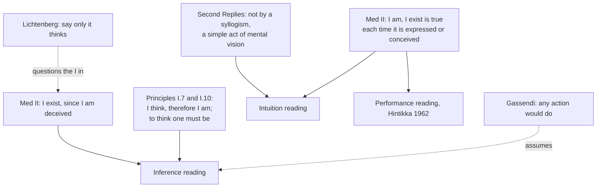

# Modern Philosophy · Lesson 1.2: The cogito and the wax

> ⏱ ~15 min · Module 1: Descartes · Builds on: [1.1 The method of doubt](01-01-the-method-of-doubt.md) · Unlocks: [1.3 God, clear and distinct ideas, and the circle](01-03-god-clear-and-distinct-ideas-and-the-circle.md), [6.2 The Dialectic: the soul and the antinomies](06-02-the-soul-and-the-antinomies.md)

## Why this matters

[1.1](01-01-the-method-of-doubt.md) left the meditator with nothing: no body, no world, not even arithmetic, all under the [evil demon](../reference.md#evil-demon). Meditation II (1641) finds the one thing the demon cannot touch, and then asks what that thing is. Two answers come out of it that the rest of the course argues about: that the self is first and best known as a *thinking thing*, and that bodies are known by the intellect, not the senses. Every later figure, from Locke to Kant's attack on the "I think" in [6.2](06-02-the-soul-and-the-antinomies.md), starts from here. The famous question is whether the first certainty is an *inference*. The texts answer differently in different places.

## The idea

Try to doubt that you exist. The attempt is itself a doubting, and a doubting needs a doubter. The more successfully the demon deceives you, the more surely there is a *you* being deceived. That is the [cogito](../reference.md#cogito): Archimedes asked for one fixed point to move the earth, and Descartes asks for one certainty to rebuild knowledge on.

Then a second question: *what* is this I? Not a body: bodies are still under doubt. Not something that walks or is nourished, since those need a body. What survives is thinking, in Descartes's broad sense: doubting, understanding, willing, imagining, even *seeming* to see. So the I, so far as it is known, is a [thinking thing](../reference.md#thinking-thing).

The wax comes last, to answer a natural protest: surely bodies, which I can touch, are better known than this unimaginable self? Melt a piece of wax and every sensible quality changes, yet it is the same wax. So what I knew of it was never its colour or smell. What I grasp is something extended, flexible and changeable, and that grasp belongs to the mind. Even bodies are known by the intellect, and every act of knowing a body shows the mind to itself more clearly still.

## Source

Meditation II, Veitch's translation. The demon of Meditation I is still in force.

> But I had the persuasion that there was absolutely nothing in the world [...]; was I not, therefore, at the same time, persuaded that I did not exist? Far from it; I assuredly existed, since I was persuaded. But there is I know not what being, who is possessed at once of the highest power and the deepest cunning, who is constantly employing all his ingenuity in deceiving me. Doubtless, then, I exist, since I am deceived; and, let him deceive me as he may, he can never bring it about that I am nothing, so long as I shall be conscious that I am something. So that it must, in fine, be maintained, all things being maturely and carefully considered, that this proposition (*pronunciatum*) I am, I exist, is necessarily true each time it is expressed by me, or conceived in my mind.

Notice three things. There is no "I think, therefore I am" here: the conclusion is *I am, I exist* (*ego sum, ego existo*). The certainty is tied to an occasion, true "each time it is expressed by me, or conceived". And yet the passage twice uses the language of reasons: "since I was persuaded", "since I am deceived". The words pull two ways, and that is the dispute.

## The argument

**A. The first certainty** (Meditation II; *Discourse* IV, 1637; *Principles* I.7, 1644).

1. **Whatever admits the slightest doubt is set aside as if false** (the [method of doubt](../reference.md#method-of-doubt), 1.1).
2. **Any attempt to doubt, or to be deceived about, my existence is itself a thought of mine.** *In words:* the doubt is something I am doing.
3. **It is impossible to conceive that what thinks does not exist while it thinks.**
4. **∴ "I am, I exist" cannot be doubted whenever I think it.** *In words:* the proposition survives P1, and it is the only one so far that does.

The *Discourse* gives the slogan in French, rendered by Veitch as "I think, hence I am". *Principles* I.7 states P3 directly: "there is a repugnance in conceiving that what thinks does not exist at the very time when it thinks" (Veitch). Whether P3 is a premise one *reasons from* is the question.

**B. Three readings** ([three readings of the cogito](../reference.md#three-readings-of-the-cogito)).

- **Inference.** "I think" is a premise and "I exist" a conclusion, with P3 as a suppressed general premise. Support: the "since" clauses, the *ergo* of the *Principles*, and *Principles* I.10, where Descartes says that in calling the cogito the first knowledge he did not deny that one must already know "that, in order to think it is necessary to be". Gassendi read it this way and said any action would do as the premise (Fifth Objections).
- **Intuition.** Existence is seen *in* the thinking, in a single act, not derived from it. Support: the Second Replies (Haldane–Ross), where the person who says "I think, hence I am" "does not deduce existence from thought by a syllogism, but, by a simple act of mental vision, recognises it as if it were a thing that is known per se." If it were a syllogism, Descartes adds, the major premise would have to be known first, whereas we learn it from our own case, because the mind forms general propositions from particulars.
- **Performance.** Jaakko Hintikka ("Cogito, Ergo Sum: Inference or Performance?", 1962) argued that "I do not exist" defeats itself whenever I think or say it, as no proposition about a third person does. The certainty lies in the act of thinking it, which fits "each time it is expressed by me, or conceived".

**What the words settle.** The Second Replies rule out a *syllogism* with a prior major premise. They do not rule out every inference: an immediate grasp of a particular connection can still have an inferential shape, and Anthony Kenny (*Descartes*, 1968) suggested that what is intuited from one point of view is deduced from another. *Principles* I.10 shows that Descartes thought the general truth was *known*, but not that it was a premise *prior* to the case. No single text decides between the readings. Each reading has to explain away the texts the others lean on.

**C. What am I?** A thinking thing is "a thing that doubts, understands, [conceives], affirms, denies, wills, refuses; that imagines also, and perceives" (Veitch; the bracket marks his addition from the French). *Perceiving* counts only as seeming to perceive, which survives the dream. The meditator explicitly does *not* yet claim that he is nothing besides a thinking thing: whether the bodies he doubts might after all be no different from himself is, he says, a point he cannot yet determine. That waits for Meditation VI ([1.4](01-04-the-real-distinction-and-the-interaction-problem.md)).

**D. The wax** ([wax argument](../reference.md#wax-argument)).

1. **After melting, every quality known by the five senses has changed.**
2. **The same wax remains;** no one doubts it.
3. **So what I knew of the wax was not any sensible quality.**
4. **What remains is something extended, flexible and movable, capable of more shapes and sizes than imagination can run through.**
5. **∴ The wax is grasped by an inspection of the mind alone** (*solius mentis inspectio*), not by sight, touch or imagination. *In words:* bodies, in Descartes's summary, "are not properly perceived by the senses nor by the faculty of imagination, but by the intellect alone."
6. **Every judgment that the wax exists implies, still more evidently, that I who judge exist.** ∴ the mind is better known than the body.

**Where the argument is weakest.** P2 of Part A says *I* am doing the doubting. Georg Christoph Lichtenberg (1742–1799) objected in his posthumously published notebooks that the evidence licenses only an impersonal *it thinks*, on the model of *it is lightning*: a thought is occurring, and the *I* that owns it is added by grammar. Nietzsche presses the same point in *Beyond Good and Evil* §§16–17 ([6.5](06-05-nietzsche-perspectivism-and-genealogy.md)), and Hume's search for the self in [4.4](04-04-the-self-belief-and-the-passions.md) is a cousin. Descartes's defender has an answer from inside the system: by the natural light, nothing has no properties, so wherever there is thinking there is a thing that thinks (*Principles* I.11). The objector replies that this is a metaphysical principle about substance, not something the doubt has left standing.

## The map of readings

Solid arrows run from a text to the reading it best supports. Dashed arrows mark the two objectors: Gassendi takes the inference reading for granted, and Lichtenberg attacks the step every reading shares.

## Worked examples

**Example 1 (clean: the wax procedure on a new body).** A sugar cube dropped into hot tea. Before: white, hard, cubic, rattling in the bowl. After: invisible, shapeless, silent, its sweetness spread through the tea. Is the sugar still there? We judge so. Run Part D. The senses report a wholly new set of qualities, so whatever "the same sugar" picks out is not one of them (P1–P3). What stays is a body that can take indefinitely many shapes and distributions, more than any image can survey (P4). So the judgment of identity is made by the mind (P5). Notice what the procedure does *not* show: that the sugar exists. Under the demon, Descartes still does not know that any body exists. The wax is about *how* a body would be known, and Meditation VI settles *whether* ([1.4](01-04-the-real-distinction-and-the-interaction-problem.md)).

**Example 2 (hard: the cogito across time).** The meditator reasons: "I have been doubting for an hour, so I have existed for an hour." Does Part A deliver this? No. The certainty holds each time the proposition is conceived, and Meditation II itself asks how often it holds and answers: as often as I think. To know that the I of an hour ago was this one, the meditator must trust memory, which the opening of Meditation II has put under doubt. So the cogito yields a present-tense existence and no persisting self. Descartes needs more to get one, and he gets it through God's guarantee in [1.3](01-03-god-clear-and-distinct-ideas-and-the-circle.md). This is exactly where Lichtenberg's worry bites hardest. If each certainty is momentary, what makes the many thinkings belong to *one* thing? Kant's paralogisms ([6.2](06-02-the-soul-and-the-antinomies.md)) accuse rational psychology of turning the bare "I think" into a persisting substance.

## Watch out

- **You might think "cogito ergo sum" is in the *Meditations*, but it is not.** Meditation II has *ego sum, ego existo*. The French "je pense, donc je suis" is the *Discourse* (1637). The Latin *ego cogito, ergo sum* appears in *Principles* I.7 (1644) and in the Second Replies, where Descartes quotes the formula in order to deny it is a syllogism.
- **You might think Descartes's "thinking" means reasoning, but it is far wider.** It covers willing, imagining and seeming to sense (*Principles* I.9). Calling it "consciousness" in the modern sense, or the cogito an observation about "qualia", imports later terms ([anachronism](../reference.md#anachronism)). Name them as glosses if you use them.
- **You might think Meditation II proves that the mind is distinct from the body, but it explicitly does not.** It shows the I is *known* without knowing any body. The step from that to the real distinction is Meditation VI's, and it needs God ([1.4](01-04-the-real-distinction-and-the-interaction-problem.md)). Whether dualism is true is argued in [`philosophy-of-mind`](../../philosophy-of-mind/syllabus.md).

## One-liner

> I cannot think "I am not" without being; what I then am is a thing that thinks; and even a lump of wax is known by that thing's understanding, not its senses.

## Problems

**P1 (🟢) *(Exegetical.)*** Close reading. Meditation II (Veitch), just after the wax has melted. The meditator is looking down from a window.

> We say [...] that we see the same wax when it is before us, and not that we judge it to be the same from its retaining the same color and figure: whence I should forthwith be disposed to conclude that the wax is known by the act of sight [...], were it not for the analogous instance of human beings passing on in the street below. In this case I do not fail to say that I see the men themselves, just as I say that I see the wax; and yet what do I see from the window beyond hats and cloaks that might cover artificial machines, whose motions might be determined by springs? But I judge that there are human beings from these appearances, and thus I comprehend, by the faculty of judgment alone which is in the mind, what I believed I saw with my eyes.

(a) According to the passage, what tempts us to think the wax is known by sight? (b) A student says the passage raises a new sceptical doubt: perhaps the people in the street are machines. Does the text support that reading? Name the words that decide it. (c) What does the window case add that the melting wax did not? Two sentences per part.

**P2 (🟡) *(Exegetical (a) · Evaluative (b).)*** Find the crux. In the Fifth Objections (Haldane–Ross), Gassendi says Descartes did not need "all this mechanism" of doubt to prove he exists: "You might have inferred that from any other activity, since our natural light informs us that whatever acts also exists." Descartes replies (Fifth Replies) that he is certain of none of his activities except thinking. One may infer "I walk, hence I exist" only so far as the awareness of walking is a thought, since in dreams I seem to walk when my body does not move. (a) Descartes does not deny that whatever acts exists. Name the single premise on which the two actually split. (b) Does Descartes's reply also answer Gassendi's complaint that the machinery of doubt was unnecessary? Any verdict; 120 words or fewer for (b).

**P3 (🔴, optional) *(Exegetical.)*** Diagnose. An invented study guide says:

> "The cogito is a syllogism. Major premise: whatever thinks exists. Minor premise: I think. Conclusion: I exist. Since the major premise is a general truth known before any experience, Descartes's first certainty shows that for him general truths come first in the order of knowledge."

(a) Name the two claims in the guide that Descartes's Second Replies contradict, and say what he puts in their place. (b) Which later text gives the guide a partial foothold, and how much does it actually concede? 150 words or fewer in all.

Solutions

**P1** *(Exegetical, strict.)*

**Must hit, strict (a):** ordinary language. We *say* "we see the same wax", not "we judge it to be the same", and the way we speak inclines us to credit sight with what judgment does.

**Must hit, strict (b):** no. The automata are a possibility raised only to show how little is strictly seen ("what do I see ... beyond hats and cloaks"). The passage then affirms "I judge that there are human beings", and its conclusion is about which faculty is at work: "by the faculty of judgment alone which is in the mind". The point concerns the source of perceptual knowledge, not a new ground of doubt.

**Must hit, strict (c):** the wax case needed a change of every quality to show that sameness isn't given by the senses. The window case shows the same thing in a static, everyday perception with no change at all, so "seeing" an object always includes a judgment beyond what the eyes deliver.

**Wrong turns:** reading (b) as an early "problem of other minds", a later framing the passage does not raise. Saying the passage shows we do *not* see the men: it says what we call seeing them is partly judging.

**Model answer:** (a) Our way of speaking: we say we see the wax, not that we judge it. (b) No; the machines show that what the eye strictly receives underdetermines what we take ourselves to see, and the text goes on to affirm "I judge that there are human beings". (c) The window case needs no melting: even an unchanged scene is "seen" only by a judgment of the mind, so the wax's lesson extends to all perception of bodies.

---

**P2** *(Exegetical (a) · Evaluative (b).)*

**Must hit, strict (a):**

- The crux: *I am certain (beyond the reach of the dream and demon doubts) that I am performing this activity.* Gassendi assumes it holds for any activity; Descartes holds it only for thinking, including the thought that I walk.
- Both accept the link from acting to existing, so the dispute is about which *premise* is certain, not about the inference.

**Must hit, any verdict (b):**

- State what the doubt does on Descartes's account: it sorts activities into those whose occurrence survives the dream and demon and those that don't. Without it, "I walk" looks as good as "I think".
- Then judge. Either the reply answers the complaint, since Gassendi's "any activity" is wrong and only the doubt shows why. Or it answers it only in part: once "I seem to walk" is allowed, the cogito needs only *some* first-person mental premise, and one can ask whether the full machinery was needed to find that.

**Wrong turns:** making the crux "whatever acts exists", which Descartes concedes. Treating Descartes as denying that walking implies existing: if I really walk, I exist; what fails is the certainty that I walk.

**Model answer (b), one of several:** Yes, largely. Gassendi's complaint assumes that many activities give an equally certain premise. Descartes's reply denies exactly that, and the denial depends on the doubt: it is the dream argument that shows "I walk" can seem true while my body lies still. So the machinery is not idle. It is the test that picks out thought as the one activity whose occurrence I cannot be wrong about. What Gassendi can still say is that the test's result is modest. Any seeming will do, so the foundation is "some mental state occurs", and the claim that a *thinking thing* is found there needs more than the doubt.

---

**P3** *(Exegetical, strict.)*

**Must hit, strict (a):**

- That the cogito is a syllogism. The Second Replies say the speaker "does not deduce existence from thought by a syllogism", but recognises it "by a simple act of mental vision".
- That the major premise is known first. Descartes says the general proposition is learned from the individual's own case (that unless he exists he cannot think), because the mind forms general propositions from particulars. The particular comes first.

**Must hit, strict (b):** *Principles* I.10 (1644) says that in calling the cogito the first knowledge, Descartes did not deny that one must know "that, in order to think it is necessary to be". This concedes that the general truth is *known*, as a simple notion. It does not say it is known *before* the particular case or serves as a syllogistic premise.

**Wrong turns:** citing Meditation II's "since I am deceived" as the guide's best support; it contains no general premise. Saying the guide is wholly baseless: I.10 is real evidence for the inference reading.

**Model answer:** (a) The Second Replies deny that the cogito is a syllogism; it is grasped by "a simple act of mental vision". They also deny that the general premise comes first; it is learned from one's own case, since general propositions are formed from particulars. (b) *Principles* I.10 admits one must know that to think one must be. That concedes the general truth is known, not that it is prior to the particular or works as a premise.

## Connections

- **Backward:** the doubt and the demon that the cogito survives are [1.1](01-01-the-method-of-doubt.md). Augustine's "if I am deceived, I am" ([`ancient-medieval-philosophy` 5.1](../../ancient-medieval-philosophy/lessons/05-01-augustine-certainty-and-illumination.md)) is an earlier answer to a different opponent, the Academics, and that lesson hands the Descartes side here. Naming the crux in P2 is [`philosophical-method` 4.3](../../philosophical-method/lessons/04-03-finding-the-crux.md).
- **Forward:** [1.3](01-03-god-clear-and-distinct-ideas-and-the-circle.md) turns the clarity of the cogito into a rule for truth and needs God to keep it; [1.4](01-04-the-real-distinction-and-the-interaction-problem.md) argues from the thinking thing to the real distinction. Hume looks for the self and finds only perceptions ([4.4](04-04-the-self-belief-and-the-passions.md)); Kant's "I think" ([5.4](05-04-the-transcendental-deduction.md)) and his paralogisms ([6.2](06-02-the-soul-and-the-antinomies.md)) keep the cogito and deny it reveals a substance.
- **Sideways:** [`epistemology` 2.2](../../epistemology/lessons/02-02-foundationalism.md) uses Meditation II as the paradigm of a foundation, as a live theory. Husserl's *Cartesian Meditations* restages this meditation in [`phenomenology-and-personalism`](../../phenomenology-and-personalism/syllabus.md).
