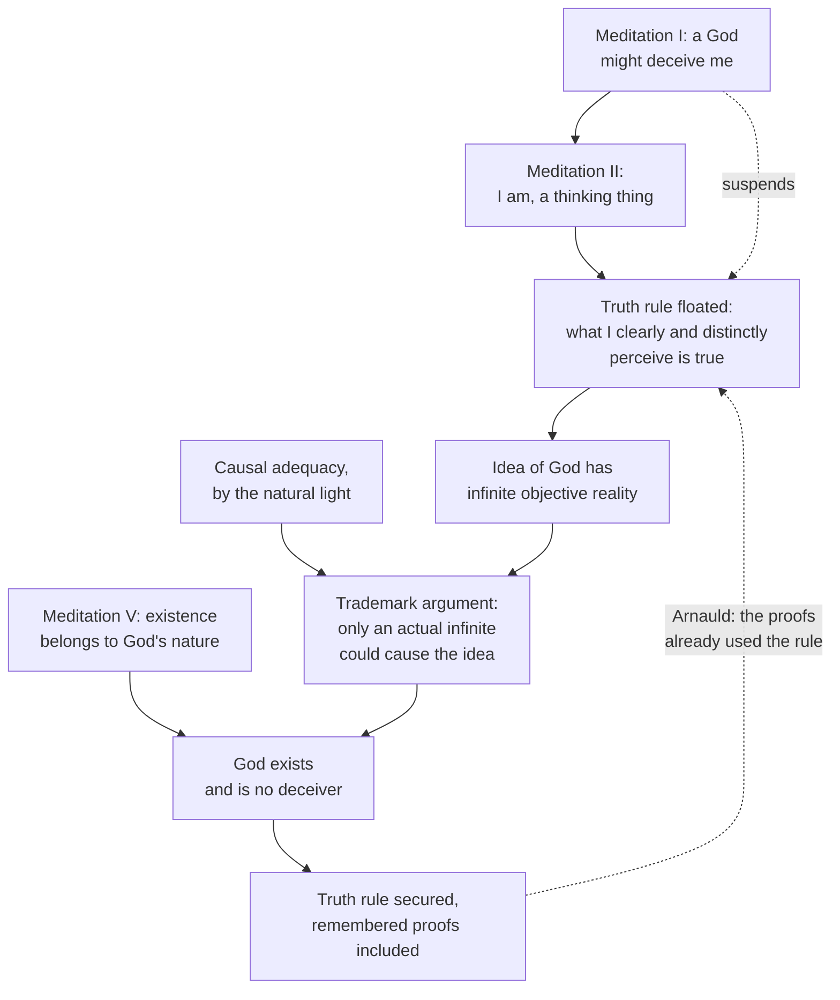

# Modern Philosophy · Lesson 1.3: God, clear and distinct ideas, and the circle

> ⏱ ~15 min · Module 1: Descartes · Builds on: [1.1 The method of doubt](01-01-the-method-of-doubt.md), [1.2 The cogito and the wax](01-02-the-cogito-and-the-wax.md) · Unlocks: [1.4 The real distinction and the interaction problem](01-04-the-real-distinction-and-the-interaction-problem.md), [6.3 The critique of the proofs of God](06-03-the-critique-of-the-proofs-of-god.md)

## Why this matters

After Meditation II the meditator knows that he exists and is a thinking thing, and nothing else: not geometry, let alone the world. Meditations III–V are the bridge back, and God is load-bearing on it: God's existence and veracity turn his best perceptions into knowledge. Read inside the system, the proofs of God are its hinge, and the most famous objection to the *Meditations* (1641) is aimed there. Whether the proofs succeed as natural theology is argued in [`philosophy-of-religion` 2.1](../../philosophy-of-religion/lessons/02-01-anselms-ontological-argument.md) and [2.2](../../philosophy-of-religion/lessons/02-02-the-modal-ontological-argument.md). Here the question is what job they do and whether the system can use them without circularity.

## The idea

Meditation III opens with an inventory. What made "I am" certain? Only that I perceived it clearly and distinctly. So Descartes floats a [truth rule](../reference.md#truth-rule): "I may now take as a general rule, that all that is very clearly and distinctly apprehended (conceived) is true" (Veitch). [Clear and distinct perception](../reference.md#clear-and-distinct-perception) is defined later in *Principles* I.45: *clear* is what is present and manifest to an attentive mind; *distinct* is clear and so sharply separated from everything else that it contains nothing unclear.

But the rule is only floated. The deceiving God of Meditation I ([1.1](01-01-the-method-of-doubt.md)) could have made me so that I err even in what seems most evident, such as two and three making five. Descartes calls this doubt slight and "metaphysical", yet says that until he knows God exists and is no deceiver, he cannot be certain of anything. So he needs God, and he must reach God from the inside, since the senses are still suspended.

His starting material is his own ideas. Every idea has two kinds of being ([formal and objective reality](../reference.md#formal-and-objective-reality)). Its *formal* reality is the being it has as a thing: a mode of a mind, and in that respect every idea is equal. Its *objective* reality is the being it has by representing: an idea of a substance represents more being than an idea of a colour, and an idea of an infinite substance represents the most. "Objective" is the scholastic sense, the being an object has *in the intellect*, not the modern sense of "mind-independent".

Now add a principle the natural light shows ([causal adequacy](../reference.md#causal-adequacy-principle)): "there must at least be as much reality in the efficient and total cause as in its effect". Applied to ideas, the cause of an idea must contain, *formally* (literally) or *eminently* (in a higher form), at least as much reality as the idea contains objectively. A painting of a palace needs a cause rich enough to account for the palace in it.

## Source

Descartes, *Objections and Replies* (Haldane and Ross, vol. II, 1912, public domain). First Antoine Arnauld (Fourth Objections), then Descartes's reply, pointing back to his Second Replies.

> [H]ow a circular reasoning is to be avoided in saying: the only secure reason we have for believing that what we clearly and distinctly perceive is true, is the fact that God exists. But we can be sure that God exists, only because we clearly and evidently perceive that; therefore prior to being certain that God exists, we should be certain that whatever we clearly and evidently perceive is true.

> There I distinguished those matters that in actual truth we clearly perceive from those we remember to have formerly perceived. [...] [W]e are sure that God exists because we have attended to the proofs that established this fact; but afterwards it is enough for us to remember that we have perceived something clearly, in order to be sure that it is true; but this would not suffice, unless we knew that God existed and that he did not deceive us.

Notice what the reply does *not* say. It does not deny that the proofs of God rest on clear perception. It denies that God is needed for every clear perception: the divine guarantee covers what is remembered, not what is attended to now. Notice too that Descartes points back to the Second Objections, compiled by Mersenne from various theologians and philosophers, which had already pressed a version of the worry.

## The argument

**A. The trademark argument** ([trademark argument](../reference.md#trademark-argument); Meditation III).

1. **I have an idea of God**: a substance infinite, independent, all-knowing, all-powerful, by which I and everything else were created.
2. **That idea has more objective reality than any other.** *In words:* it represents infinite being.
3. **The cause of an idea must contain formally or eminently at least as much reality as the idea contains objectively.** *In words:* representational content cannot come from nothing.
4. **I am a finite substance, so I do not contain infinite reality, formally or eminently.**
5. **The idea is not built by negating the finite, and is not supplied by perfections I have only potentially.** Descartes argues that I know my limits only by comparison with the infinite, so the idea is positive and prior; and growing knowledge never becomes actually infinite, while a merely potential being cannot produce the objective being of an idea.
6. **∴ An actually infinite being, God, exists as the cause of my idea.**

The famous phrase comes after the argument: God implanted the idea as "the mark of the workman impressed on his work". Descartes then runs a second argument: since conservation in each moment needs the same power as creation, something must keep me in existence, and only God fits. God is perfect, deception is a defect, so God is no deceiver. Meditation IV turns that into the truth rule, with error traced to a will that judges beyond what the intellect clearly perceives.

**B. The ontological argument** ([Cartesian ontological argument](../reference.md#cartesian-ontological-argument); Meditation V). Whatever I clearly and distinctly perceive to belong to a thing's true nature belongs to it. I perceive that existence belongs to the nature of a supremely perfect being as clearly as the angle sum belongs to the triangle. So God exists. Descartes's own objection is that a mountain without a valley is inconceivable, yet no mountain need exist. His reply is that there the necessity binds only two ideas together, while here the necessity lies in the thing itself. Note the first premise: Meditation V runs *on* the truth rule, and closes by saying that even remembered geometry is open to doubt until one knows God.

**C. The circle** ([Cartesian circle](../reference.md#cartesian-circle)). Arnauld's charge, reconstructed:

1. I am certain that whatever I clearly and distinctly perceive is true only if I am certain that God exists.
2. I am certain that God exists only because I clearly and distinctly perceive the premises of A or B.
3. ∴ I must already be certain that what I clearly and distinctly perceive is true before I can be certain of it. That is circular.

Readers divide over the way out, and the texts support more than one.

- **The memory reading** (Willis Doney, 1955). P1 is false as stated. A perception attended to *now* compels assent and needs no guarantee. God secures remembered conclusions, when the proof is no longer before the mind. *Evidence:* the Source; the Second Replies' third point; the close of Meditation V.
- **The unshakeable-conviction reading** (Harry Frankfurt, *Demons, Dreamers, and Madmen*, 1970). Descartes is not certifying clear perception from outside, which nothing could do. He shows that following the rule leads to a God who removes every reason to doubt it. What remains is "a conviction so strong that nothing can remove it", which the Second Replies call perfect certainty, adding that a falsity "absolutely speaking", visible only to God or an angel, need not concern us. *Evidence:* Second Replies on the basis of human certitude.

A third reading (James Van Cleve, 1979) has the meditator know particular clear perceptions without yet knowing the *general* rule, so the proof needs no rule it has not yet earned.

**Where the argument is weakest.** The load-bearing premise is that present clear perception is beyond doubt. The memory reading needs it, and Meditation III appears to deny it: the meditator says a God could make him err even where he thinks his evidence is greatest, and that without God he cannot be certain of anything. The defender replies that the same paragraph says the doubt arises only when he turns from the proposition to God's power, and that while attending he cannot help assenting. A second pressure point: the trademark proof is itself a long chain, so memory may enter the very proof meant to secure memory. The conviction reading avoids both, but at a price. Meditation VI uses the rule to reach truths about bodies, and conviction that is proof against every reason for doubt may not be truth.

## The argument map

Solid arrows run in the order of the *Meditations*. The dashed arrow from the vindicated rule back to the floated one is Arnauld's circle.

## Worked examples

**Example 1 (clean: auditing my other ideas).** Run causal adequacy on everything else in the meditator's mind, as Meditation III does. Ideas of other people, animals and angels: I can compose them from my ideas of myself, of bodies and of God. Sensory ideas of heat, cold and colour: so obscure that I cannot tell whether they represent anything real, so I may be their author. Clear ideas of bodies: substance, duration and number I can take from my idea of myself; extension, figure and motion are modes of substance, and since I am a substance they may be in me eminently. Every finite idea passes with *me* as a possible cause. Without an idea that outstrips me, Descartes says, he would have no ground for believing anything exists besides himself. The idea of God is the only exit.

**Example 2 (hard: the atheist geometer).** The Second Objections: an atheist knows clearly and distinctly that a triangle's angles equal two right angles, yet denies God. Descartes grants the atheist's clear perception and denies him *science*. Because he does not know God, the atheist cannot be sure he is not deceived in what seems most evident; the doubt may never occur to him, but it can be raised, and he cannot answer it. Now test the two readings. On the memory reading, the atheist is fine while working through the proof and loses certainty when he moves on. On the conviction reading, his conviction is not yet unshakeable, since a reason to doubt is available to him. Descartes's words fit both. What they rule out is any reading on which the atheist cannot perceive the theorem clearly at all.

## Watch out

- **Anachronism: "objective reality" means mind-independent reality.** You might think so, but in Meditation III it is the reverse: the being a thing has *as represented* in an idea. The modern "objective" is closer to Descartes's *formal*.
- **"God stamped the idea in me, so God exists" is not the argument.** That would assume its conclusion. The argument is causal (A3–A6), and the workman's mark is Descartes's gloss once it is done. "Trademark argument" is a later label, as is "Cartesian circle".
- **You might think Descartes missed the circle.** He was pressed on it twice before publication, printed both objections with the *Meditations* in 1641, and answered both. The dispute is over what his answer means.

## One-liner

> Descartes reaches God from the reality an idea represents, uses God to turn clear and distinct perception into lasting knowledge, and answers Arnauld's circle by saying God guarantees remembered perceptions, not the one in front of you.

## Problems

**P1 (🟢) *(Exegetical.)*** Close reading. Meditation III (Veitch). Words in square brackets are Veitch's additions from the French version; [...] marks an omission.

> But further, even the idea of the heat, or of the stone, cannot exist in me unless it be put there by a cause that contains, at least, as much reality as I conceive existent in the heat or in the stone: [...] [as every idea is a work of the mind], its nature is such as of itself to demand no other formal reality than that which it borrows from our consciousness, of which it is but a mode [...]. But in order that an idea may contain this objective reality rather than that, it must doubtless derive it from some cause in which is found at least as much formal reality as the idea contains of objective; for, if we suppose that there is found in an idea anything which was not in its cause, it must of course derive this from nothing.

(a) What is the idea's formal reality, and why does it need no special cause? (b) What, exactly, must the cause of the idea of the stone contain, and how much of it? (c) A study guide glosses "objective reality" here as "the degree to which the idea matches the mind-independent world". Say what the passage shows is wrong with this. Two sentences per part.

**P2 (🟡) *(Exegetical (a) · Evaluative (b).)*** Find the crux. Arnauld and Descartes disagree in the Source. (a) Name the single premise about clear and distinct perception that Arnauld's objection needs and Descartes's reply denies. One sentence. (b) Meditation III (Veitch):

> But as often as this preconceived opinion of the sovereign power of a God presents itself to my mind, I am constrained to admit that it is easy for him, if he wishes it, to cause me to err, even in matters where I think I possess the highest evidence; and, on the other hand, as often as I direct my attention to things which I think I apprehend with great clearness, I am so persuaded of their truth that I naturally break out into expressions such as these: Deceive me who may, no one will yet ever be able to bring it about that I am not, so long as I shall be conscious that I am [...] or make two and three more or less than five.

Does this passage help or hurt Descartes's reply to Arnauld? Any verdict; 120 words or fewer.

**P3 (🔴, optional) *(Exegetical (a) · Evaluative (b).)*** Apply to a hard case. In the First Replies, Descartes says that the idea of an ingenious machine needs a cause containing its "objective artifice" formally or eminently: a real machine once seen, or great mechanical knowledge, or great ingenuity. An inventor, Ines, has an idea of a machine with infinitely many gears, each half the size of the last. (a) On Descartes's account, what could cause her idea, and does it need a real machine? Two sentences. (b) Does causal adequacy require a cause of *infinite* reality for her idea? Use *Principles* I.26–27, which call things whose limits we cannot find "indefinite" and reserve "infinite" for God. Then say whether your answer reopens Gassendi's objection (Fifth Objections) that we form the idea of God by amplifying perfections we find in ourselves. 150 words or fewer for (b).

Solutions

**P1** *(Exegetical, strict.)*

**Must hit, strict (a):**

- Its formal reality is the being it has as a mode of the mind, the reality it "borrows from our consciousness". Every idea has the same kind, and the mind, as cause of its own modes, accounts for it.

**Must hit, strict (b):**

- The cause must contain, as formal reality (actually, not merely as represented), at least as much reality as the idea of the stone contains objectively: the properties of the stone, or superior ones. The passage says "formal"; the surrounding text allows "formally or eminently".

**Must hit, strict (c):**

- Objective reality is the reality an idea has *by representing* its object, the "this objective reality rather than that" that differs from idea to idea. It is not a measure of accuracy: the passage asks what an idea represents and what could cause that, never whether it matches anything.

**Wrong turns:** saying the cause must contain the stone's *objective* reality, which is exactly what the passage forbids ("Nor must it be imagined…" follows in the text). Reading (c) as a quibble: the study guide's gloss would make the trademark argument beg the question, since it would build God's existence into the idea's content.

**Model answer:** (a) As an idea, it is just a mode of my mind, which I can cause myself. All ideas are equal in this respect. (b) Something with at least as much actual (formal) reality as the stone represented in the idea contains: the stone's properties, or higher ones. Representation can't be richer than its source. (c) Objective reality is the being an object has as represented, which varies with *what* is represented, not with whether it matches anything. The gloss swaps Descartes's scholastic sense for the modern one.

---

**P2** *(Exegetical (a) · Evaluative (b).)*

**Must hit, strict (a):**

- The crux premise: *every* clear and distinct perception, including one attended to now, is certain only given prior certainty that God exists. Arnauld needs it for his first premise; Descartes denies it for present perceptions and restricts the divine guarantee to remembered ones.

**Must hit, any verdict (b):**

- Cite the side that hurts: the doubt reaches "matters where I think I possess the highest evidence", which looks like present clear perception.
- Cite the side that helps: the doubt comes only "as often as" the mind turns to God's power; while attending, the meditator cannot help assenting. That is the attention/memory structure the reply needs.
- Reach a verdict that weighs both, or say exactly what the passage leaves open.

**Wrong turns:** treating (a) as "whether God exists", which neither disputes here. Quoting only one half of the passage in (b).

**Model answer (b), one of several:** Mixed, leaning toward helping. The first clause seems fatal: God could make me err even where my evidence is highest, which includes present perceptions. But the sentence is built on "as often as". The doubt arises only when the mind leaves the proposition and thinks about God's power. When it attends to the proposition, assent is irresistible. So a present perception is never doubted while it is present, which is what the reply to Arnauld claims. The cost is that "highest evidence" must mean evidence *remembered* as highest, which the words do not say.

---

**P3** *(Exegetical (a) · Evaluative (b).)*

**Accept:** any verdict in (b) that gives Descartes's indefinite/infinite answer and then tests whether it can be turned against the idea of God.

**Must hit, strict (a):**

- The cause must contain the idea's objective artifice formally or eminently. Here that is Ines's own mechanical knowledge and ingenuity, which contain the device eminently, so no real machine is needed.

**Must hit, any verdict (b):**

- Descartes's answer: no. "Infinitely many gears" is *indefinite* in his sense: we merely fail to find a limit to the halving, which the mind's own power of iteration supplies. It is not a positive idea of an actual infinite.
- The Gassendi turn: if iteration explains the machine, why not God, as human knowledge, power and goodness amplified without limit?
- Descartes's reply from Meditation III: growing knowledge never becomes actually infinite; God is conceived as actually infinite, with nothing to add; and the idea of the infinite is positive and prior to the finite. Say whether that reply rests on anything beyond the claim that we have such a positive idea.

**Wrong turns:** saying Ines needs an infinite machine as cause, which ignores eminent containment. Treating "infinite" in the *Principles* sense as covering the gear train.

**Model answer (b), one of several:** No. By *Principles* I.26–27 the gear train is only indefinite: Ines cannot find a last gear, but she does not positively conceive an actual infinity. Her power to keep halving is enough, and her ingenuity contains it eminently. This does reopen Gassendi's challenge, since amplification is also iteration. Descartes can answer that his idea of God is of an *actual* infinite, which no finite process reaches, and that he knows his own limits only by contrast with it. But that reply is only as strong as the claim that we have a positive idea of the actual infinite. That is precisely what Gassendi doubted, so the hard case moves the dispute rather than settling it.

## Flashback

**From Lesson [1.1](01-01-the-method-of-doubt.md) (The method of doubt):** *(Exegetical.)* Close reading. *Discourse on Method* (1637), Part IV (Veitch), Descartes's earlier and shorter version of the doubt. He has just resolved, for the search after truth, to reject as false every opinion that admits the least ground for doubt.

> [S]eeing that our senses sometimes deceive us, I was willing to suppose that there existed nothing really such as they presented to us; and because some men err in reasoning [...], even on the simplest matters of Geometry, I, convinced that I was as open to error as any other, rejected as false all the reasonings I had hitherto taken for demonstrations; and finally, when I considered that the very same thoughts [...] which we experience when awake may also be experienced when we are asleep [...], I supposed that all the objects [...] had in them no more truth than the illusions of my dreams.

(a) Match each of the three grounds to a wave of Meditation I, and name one step of Meditation I's sequence that has no counterpart here. (b) Does the ground given here for rejecting demonstrations reach as far as Meditation I's third wave? Say what each ground rests on and what each reaches. Two sentences per part.

Solution

**Must hit, strict (a):**

- The senses' occasional deception is wave 1, though here it already removes everything "such as they presented to us", where Meditation I's first wave removed only small and distant things.
- Other men's errors in reasoning do the work Meditation I gives to wave 3, the doubt about mathematics. The dream is wave 2.
- Any one missing step: the madman set aside; the painters' simple and universal things that survive the dream; the deceiving God with its origin dilemma; the malignant demon.

**Must hit, strict (b):**

- No. The *Discourse* ground rests on slips other people actually make, plus "as open to error as any other": a faculty that sometimes fails, which is wave 1's shape carried over to reasoning. It reaches "reasonings [...] taken for demonstrations".
- Wave 3 needs no observed error. It rests on the possibility that my nature was made, or came about, so that I err "each time I add together two and three", so it reaches single, simplest judgments and the faculty itself.

**Wrong turns:** taking "even on the simplest matters of Geometry" to settle (b). The phrase extends the ground to simple demonstrations, but the ground is still other people's slips, not the origin of my nature. Crediting the demon with the doubt about mathematics. Reading "rejected as false" as a belief that the demonstrations are false; the rule treats the doubtful as false for the purposes of the inquiry.

**Model answer:** (a) The senses' occasional deception is wave 1, though the *Discourse* lets it remove everything the senses present; others' errors in reasoning take the place of the deceiving God; the dream is wave 2. Meditation I's madman, its painters' simple and universal things, and its deceiving God with the origin dilemma have no counterpart. (b) No: the *Discourse* argues from the slips people actually make in chains of reasoning, so it reaches what "I had hitherto taken for demonstrations". Meditation I's third wave argues from the bare possibility that my nature was made to err, so it reaches even adding two and three, and only a God who is no deceiver can lift it.

## Connections

- **Backward:** the deceiving God of [1.1](01-01-the-method-of-doubt.md) is the doubt this lesson's God removes, and the cogito of [1.2](01-02-the-cogito-and-the-wax.md) is the first clear and distinct perception. The Second Replies' claim that the cogito is known by a simple act of mental vision, not by syllogism, is read in 1.2. Locating the crux between Arnauld and Descartes is [`philosophical-method` 4.3](../../philosophical-method/lessons/04-03-finding-the-crux.md).
- **Forward:** God's veracity carries Meditation VI's proofs of the real distinction and of bodies in [1.4](01-04-the-real-distinction-and-the-interaction-problem.md). Spinoza radicalizes the Cartesian notion of substance, infinite substance included, in [2.1](02-01-spinoza-one-substance.md). Descartes's claim that conservation is continuous creation is one root of Malebranche's occasionalism in [2.4](02-04-interaction-and-causation.md). Kant's claim that being is not a real predicate, aimed at the Meditation V argument, is [6.3](06-03-the-critique-of-the-proofs-of-god.md).
- **Sideways:** Descartes as the paradigm foundationalist, as a live position, is [`epistemology` 2.2](../../epistemology/lessons/02-02-foundationalism.md). Whether ontological arguments succeed is [`philosophy-of-religion` 2.1–2.2](../../philosophy-of-religion/lessons/02-01-anselms-ontological-argument.md); conceivability as a guide to possibility, which Meditation V and VI both lean on, is [`metaphysics` 3.1](../../metaphysics/lessons/03-01-kinds-of-necessity.md).
