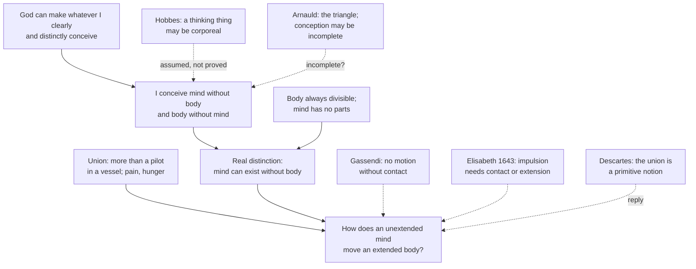

# Modern Philosophy · Lesson 1.4: The real distinction and the interaction problem

> ⏱ ~15 min · Module 1: Descartes · Builds on: [1.2 The cogito and the wax](01-02-the-cogito-and-the-wax.md), [1.3 God, clear and distinct ideas, and the circle](01-03-god-clear-and-distinct-ideas-and-the-circle.md) · Unlocks: [2.4 The problem they left: interaction and causation](02-04-interaction-and-causation.md)

## Why this matters

Meditation II left the meditator certain that he exists as a thinking thing while still doubting that he has a body. Meditation VI turns that into a metaphysical conclusion: the mind is a substance that could exist without any body. It then insists that mind and body make up one human being who feels pain and moves its limbs. Holding both set the question Module 2 answers: how can two substances with nothing in common act on each other? Whether dualism is true belongs to `philosophy-of-mind` ([syllabus](../../philosophy-of-mind/syllabus.md), 1.2). Here the question is whether the arguments work on Descartes's own premises.

## The idea

In Descartes's vocabulary two things are **really distinct** when each could exist without the other. A shape cannot exist without something extended, so shape and body are not really distinct; a mind and a body, he claims, can each exist alone. The claim is *separability*, not present separation.

How could you know that two things are separable? By conceiving each clearly and distinctly without the other. God can make whatever I so conceive, exactly as I conceive it, so a clear conception of mind without body shows that God could make a mind without a body. Meditation II supplied the conception; the non-deceiving God of [1.3](01-03-god-clear-and-distinct-ideas-and-the-circle.md) supplies the guarantee. A second argument runs from parts: every body can be divided, and the mind has none.

Then the turn. I am not in my body as a pilot is in a ship. If I were, I would notice a wound the way a pilot notices a hole in his hull. Instead I *feel* pain and hunger. So the doctrine has two halves, [real distinction](../reference.md#real-distinction) and [union](../reference.md#substantial-union), and the [interaction problem](../reference.md#interaction-problem) asks how both can be true. Both labels are later; the seventeenth century asked how the soul moves the body.

## Source

Descartes, Meditation VI (Veitch, 1901, public domain).

> because I know that all which I clearly and distinctly conceive can be produced by God exactly as I conceive it, it is sufficient that I am able clearly and distinctly to conceive one thing apart from another, in order to be certain that the one is different from the other, seeing they may at least be made to exist separately, by the omnipotence of God; and it matters not by what power this separation is made [...]; because, on the one hand, I have a clear and distinct idea of myself, in as far as I am only a thinking and unextended thing, and as, on the other hand, I possess a distinct idea of body, in as far as it is only an extended and unthinking thing, it is certain that I [...] is entirely and truly distinct from my body, and may exist without it.

Three things to notice. **First,** the God premise comes first: "because I know" what God can produce. So the argument inherits the troubles of Meditations III–V, including the [Cartesian circle](../reference.md#cartesian-circle). **Second,** readers split on how much work God does. On one reading God's power is ineliminable: without it there is no route from conceiving to possibility. On another, the theology states a modal principle (what is clearly and distinctly conceivable is possible) that does not depend on any particular separating power. "It matters not by what power this separation is made" fits the second reading. But "because I know" names God as the source of the certainty. So the words settle what the stated warrant is, not whether Descartes thought another was available. **Third,** the word *complete* is absent. Descartes adds it only when Arnauld forces him to (Example 2).

## The argument

**A. The [conceivability argument](../reference.md#conceivability-argument)** (Meditation VI; restated in *Principles* I.60).

1. **Whatever I clearly and distinctly conceive can be produced by God exactly as I conceive it.** *(God premise, from 1.3.)* *In words:* clear and distinct conception never outruns what is possible.
2. **So if I clearly and distinctly conceive A apart from B, A can exist without B.**
3. **Things that can exist apart are really distinct.** *In words:* this is the definition of the term.
4. **I have a clear and distinct idea of myself as only a thinking, unextended thing, and a distinct idea of body as only an extended, unthinking thing.** *In words:* each idea contains nothing of the other.
5. **∴ My mind is really distinct from my body and can exist without it.**

**B. The [divisibility argument](../reference.md#divisibility-argument).** Body is by its nature always divisible. The mind, considered as thinking, has no parts: cut off a foot and nothing is taken from the mind, and willing and perceiving are not parts but one mind acting. Descartes says it would suffice alone had he not already shown the point, so it serves as confirmation.

**C. The union.** Nature teaches through pain, hunger and thirst that I am joined so closely to my body that the two "compose a certain unity". These sensations are confused modes of thinking that arise from the union.

**The objectors** (*Objections and Replies*, published with the *Meditations* in 1641; Haldane–Ross, 1912).

- **Hobbes** (Third Objections) pressed premise 4: "it is possible for a thing that thinks to be the subject of the mind, reason, or understanding, and hence to be something corporeal; and the opposite of this has been assumed, not proved." Descartes replied that he had left the question open until Meditation VI.
- **Arnauld** (Fourth Objections) granted premise 1 for the sake of argument and denied that premise 4 delivers what premise 2 needs. His case is Example 2.
- **Gassendi** (Fifth Objections) attacked the union, not the distinction: "How can there be effort directed towards anything, and motion on its part, without mutual contact of what moves and what is moved?" He cited Lucretius: only body touches or is touched. Descartes replied that Gassendi submits to the imagination what does not fall under it; the mind need not be a body to move one.
- **Princess Elisabeth of Bohemia** (May 1643; her letters are paraphrased here from Shapiro's 2007 edition) asked how a soul that is only a thinking substance can determine the bodily spirits to voluntary action. Every determination of motion seems to come from impulsion, from the manner of the pushing, or from the quality and shape of the mover's surface. The first two need contact, the third needs extension, and Descartes denied both to the soul. Replying on 21 May and 28 June, Descartes distinguished [primitive notions](../reference.md#primitive-notions): extension for body, thought for soul, and the union for the two together, each to be understood on its own terms. We go wrong when we explain the union by the notion of body, or carry the union's notion over to bodies, as in the scholastic picture of heaviness as a quality that moves a body toward the earth without contact. The union is known obscurely by the intellect but very clearly by the senses, through ordinary life rather than metaphysical meditation. Elisabeth answered that it would be easier to concede matter and extension to the soul than to grant an immaterial being the power to move a body and be moved by it. Descartes invited her to do so, since that is only to conceive the soul as united to the body; it remains separable.

**Where the argument is weakest.** Premise 4, as Arnauld saw. "I can think of myself without thinking of body" is not enough, or every unnoticed truth about me would be inessential. The conception of mind must be *complete*, and the question is whether that completeness is perceived or presupposed. A second pressure point is not a premise at all. Descartes told Gassendi: "At no place do you bring an objection to my arguments; you only set forth the doubts which you think follow from my conclusions." True, and that is the danger. If interaction is certain yet unintelligible on his premises, the argument can be run backwards against premise 4, as Elisabeth's "easier to concede" proposes. Descartes's defence is that the union is primitive, so failing to explain it through the other two notions shows nothing against the distinction. Whether that answers her or relocates the problem is Boss 1's question.

## The exchange

Solid arrows run from premises to conclusions; dashed edges mark where each critic pressed. Hobbes and Arnauld attack the route to the distinction. Gassendi and Elisabeth ask what it costs.

## Worked examples

**Example 1 (clean: sorting substances from modes).** The test is reciprocal, and Descartes uses it at once to sort what he finds in himself (Meditation VI; *Principles* I.53).

- *Imagining and me.* I can conceive myself whole without imagining, but not imagining without a thinking thing. The dependence runs one way: imagining is a mode of mind.
- *Shape and body.* Shape cannot be conceived except in something extended; extension can be conceived without this shape. Shape is a mode of body.
- *Mind and body.* Each is conceived without the other, through a different principal attribute, thought or extension. The dependence runs neither way: two substances.

So the test is mutual independence under different principal attributes, not a bare "I can imagine it". Descartes falls back on it against Arnauld.

**Example 2 (hard: Arnauld's triangle).** A geometer is certain that the angle in a semicircle is a right angle, so the inscribed triangle is right-angled. Misled by a fallacy, he denies that it has the Pythagorean property. By Descartes's reasoning, Arnauld says, he could conclude that God could make a right-angled triangle without that property, which is false. Then: "But whence do I obtain any perception of the nature of my mind clearer than that which he has of the nature of the triangle?"

Descartes replied (Fourth Replies) with three disanalogies. The Pythagorean ratio is a property, not a complete thing, which he defines as a substance recognisable by its attributes. The dependence is one-way: no one clearly conceives a triangle with that ratio without conceiving it right-angled, whereas mind and body are each conceived without the other. And the ratio cannot be denied of the triangle without losing a clear grasp of the triangle, while nothing in the concept of body belongs to mind. Where it strains: all three points assume the idea of mind is already that of a complete thing, which Arnauld asked to see proved. Of the three, reciprocity is the one Example 1 showed doing the work.

## Watch out

- **You might think Descartes put the mind in the body "like a pilot in a ship".** That is the picture he calls *insufficient*: I am "not only lodged" there. Aristotle had left the sailor-and-ship image open in *De Anima* II.1 ([`ancient-medieval-philosophy` 3.5](../../ancient-medieval-philosophy/lessons/03-05-soul-and-intellect.md)). Giving it to Descartes as his view is a standard misreading.
- **You might think "really distinct" means "actually apart".** It means *able* to exist apart. *Principles* I.60: however closely God united soul and body, they would remain really distinct, since God keeps the power to separate them.
- **Anachronism.** Elisabeth's worry is not the conservation-of-energy objection ("energy" is a nineteenth-century concept), nor "the hard problem of consciousness", which concerns experience, not causation. It is a demand, inside the contact mechanics she and Descartes shared, to say how motion is determined. The pineal gland of the *Passions of the Soul* (1649) says *where* the soul acts, not *how*.

## One-liner

> Descartes argued that mind and body are separable because God can make whatever we clearly conceive apart, and that they are united because we feel pain. Arnauld asked whether the conception was complete, and Elisabeth asked how something unextended could push.

## Problems

**P1 (🟢) *(Exegetical (a) · Evaluative (b).)*** Reconstruct. Meditation VI (Veitch; square brackets mark additions from the 1647 French version):

> there is a vast difference between mind and body, in respect that body, from its nature, is always divisible, and that mind is entirely indivisible. For in truth, when I consider the mind, that is, when I consider myself in so far only as I am a thinking thing, I can distinguish in myself no parts, but I very clearly discern that I am somewhat absolutely one and entire; and although the whole mind seems to be united to the whole body, yet, when a foot, an arm, or any other part is cut off, I am conscious that nothing has been taken from my mind [...]. But quite the opposite holds in corporeal or extended things; for I cannot imagine any one of them [how small soever it may be], which I cannot easily sunder in thought, and which, therefore, I do not know to be divisible.

(a) Put the argument into at most six numbered premises and a conclusion, in Descartes's terms. (b) Name the premise most open to attack, state the objection, and say whether anything in Descartes's own system answers it. 100 words or fewer for (b).

**P2 (🟡) *(Exegetical.)*** Close reading. Meditation VI and *Discourse* Part V (both Veitch).

> Nature likewise teaches me by these sensations of pain, hunger, thirst, etc., that I am not only lodged in my body as a pilot in a vessel, but that I am besides so intimately conjoined, and as it were intermixed with it, that my mind and body compose a certain unity. For if this were not the case, I should not feel pain when my body is hurt, seeing I am merely a thinking thing, but should perceive the wound by the understanding alone, just as a pilot perceives by sight when any part of his vessel is damaged [...]. *(Meditation VI)*

> it is not sufficient that it be lodged in the human body exactly like a pilot in a ship, unless perhaps to move its members, but that it is necessary for it to be joined and united more closely to the body, in order to have sensations and appetites similar to ours, and thus constitute a real man. *(Discourse V)*

Two readers disagree. Reader R1: "Descartes rejects the pilot model outright." Reader R2: "He says the pilot model is not enough, not that it is wrong in every respect." (a) What evidence does the Meditation VI passage give against the pilot model? (b) Which reader do the words of the two passages support, and which words decide it? (c) What does "as it were" do in "as it were intermixed"? Two sentences per part.

**P3 (🔴, optional) *(Evaluative.)*** Counterexample. (a) Invent a case in Arnauld's style: someone clearly perceives A without B, yet A cannot exist without B. Do not reuse the triangle. (b) Run Descartes's three-part reply from Example 2 on your case: which disanalogy, if any, catches it? Say whether the case survives on Descartes's premises. 150 words or fewer in all.

Solutions

**P1** *(Exegetical (a) · Evaluative (b).)*

**Accept:** any ordering that keeps the introspective premise about the mind and the conceived-division premise about body separate.

**Must hit, strict (a):**

- P1: When I consider myself only as a thinking thing, I can distinguish no parts in myself; I am one and entire.
- P2: Losing a bodily part takes nothing from the mind, and willing, perceiving and conceiving are not parts but one mind acting.
- P3: So the mind is indivisible.
- P4: Any extended thing, however small, can be divided in thought, and what I can divide in thought I know to be divisible.
- P5: So body is by its nature always divisible.
- P6: Things with incompatible natures (indivisible, always divisible) are different.
- ∴ C: Mind and body are entirely different.

**Must hit, any verdict (b):**

- Pick a premise and state an objection to it precisely. The standard target is the step from P1 to P3, from "I can distinguish no parts" to "there are no parts". That is Arnauld's worry about incomplete conception, aimed at a new premise.
- Say whether the system answers it. Either Descartes can appeal to clear and distinct perception of the mind's nature, which returns the question to 1.3 and to completeness, or he cannot. Credit also for noting that P4 runs from dividing *in thought* to divisibility, which is the conceivability principle again (*Principles* II.20 uses God's power to divide in the same way). So the divisibility argument is less independent of God than it looks.

**Wrong turns:** attacking P5 with indivisible atoms. Descartes denies there are any (*Principles* II.20), so that objection assumes what he rejects. Using a modern neuroscience case (split brains) as though it were a premise Descartes could be held to. A later critic is fine if named as later: Kant's Second Paralogism ([6.2](06-02-the-soul-and-the-antinomies.md)) attacks the move from the unity of the "I" to a simple substance.

**Model answer (b), one of several:** The weak step is P1 to P3. That I *find* no parts when I attend to myself as thinking shows how the mind appears to introspection, not that it lacks parts. A unity of awareness could belong to a composite. Descartes's answer is that he perceives the mind's nature clearly and distinctly, and clear perception is guaranteed true. That is a real answer inside the system, but it makes the divisibility argument depend on the same guarantee as the conceivability argument, so it cannot serve as independent confirmation.

---

**P2** *(Exegetical, strict.)*

**Must hit, strict (a):** the counterfactual contrast. A mere pilot would learn of damage "by the understanding alone", as by sight; I instead *feel* pain and am made aware of need by hunger and thirst. The evidence is the felt, non-intellectual character of these sensations.

**Must hit, strict (b):** **R2.** "Not only lodged" in Meditation VI and "not sufficient" in *Discourse* V both say the pilot model is too weak, not wholly false. The *Discourse* adds "unless perhaps to move its members": the model may cover moving the limbs, and fails for "sensations and appetites". Credit for noting that "unless perhaps" is hedged, so even the *Discourse* grants this tentatively.

**Must hit, strict (c):** "as it were" marks "intermixed" as a figure, not literal mixture. Mind is unextended and cannot be mixed with body as two bodies mix. Descartes says as much to Gassendi.

**Wrong turns:** choosing R1 because Descartes is "against the pilot". The words "only" and "not sufficient" are what decide it. Reading "compose a certain unity" as withdrawing the real distinction. *Principles* I.60 holds both at once.

**Model answer:** (a) If I were only a pilot, I would perceive a wound intellectually, as a pilot sees a damaged hull. In fact I feel pain and hunger, which are confused sensations and not perceptions of the understanding. (b) R2: "not only lodged" and "not sufficient" deny the pilot model's sufficiency. "Unless perhaps to move its members" even allows it a role in moving the limbs while denying it sensation and appetite. (c) It hedges "intermixed" as a figure of speech. An unextended mind cannot literally mix with an extended body.

---

**P3** *(Evaluative.)*

**Accept:** any case where (i) the conception is plausibly clear by Descartes's standards, (ii) the inseparability is genuine, and (iii) the answer tests the case against all three disanalogies: complete thing, reciprocity, and exclusion. Either verdict passes.

**Must hit, any verdict:**

- A case with both features, stated in a sentence.
- An honest run of each disanalogy. Cases built from a thing and its property fail the first. One-way dependences fail the second. Cases where B is merely unnoticed fail the third.
- A verdict on whether the case survives, with the reason.

**Wrong turns:** building a case from confused sense-ideas and calling them clear and distinct. Descartes would deny the premise. Treating the counterexample as refuting dualism. It tests whether premise 4 delivers what premise 2 needs, nothing more.

**Model answer, one of several:** An ancient observer conceives the morning star as a complete body (a bright thing in the east at dawn) and the evening star as another, each without the other. Yet they are one body, Venus, and cannot exist apart. Descartes's first two disanalogies do not catch it: each is a complete thing, and each is conceived without the other. The third catches it. The observer's ideas of the two are sensory and confused (where and when each appears). Their clear and distinct content is extension, the same nature in both, so nothing in one excludes the other. On Descartes's premises the case fails. This shows that his reply needs mutually exclusive principal attributes, and thought and extension are the only pair he recognises. So the dispute returns to Arnauld's question of whether the idea of mind is complete.

## Flashback

**From Lesson [1.2](01-02-the-cogito-and-the-wax.md) (The cogito and the wax):** *(Exegetical.)* Close reading. Meditation II (Veitch), shortly before "But what, then, am I? A thinking thing". The demon supposition is still in force, and "all these" are the bodies the meditator has supposed away.

> Now it is plain I am not the assemblage of members called the human body [...]; for I supposed that all these were not, and [...] I find that I still feel assured of my existence. But it is true, perhaps, that those very things which I suppose to be non-existent [...] are not in truth different from myself whom I know. This is a point I cannot determine [...]. It is, however, perfectly certain that the knowledge of my existence, thus precisely taken, is not dependent on things, the existence of which is as yet unknown to me.

(a) What reason does the first sentence give for "I am not the assemblage of members called the human body", and what is the most that reason can establish? (b) Which words show that Meditation II is not yet asserting that the I is something other than a body, and what does "thus precisely taken" confine the certain claim to? Two sentences per part.

Solution

**Must hit, strict (a):**

- The reason is the supposition test: with every body supposed not to exist, "I still feel assured of my existence".
- That shows only that the meditator's certainty of his existence neither includes nor depends on any body, so he is not *known to himself* as a body. It cannot show that the thing he is lacks a body, which is the question the next sentences leave open.

**Must hit, strict (b):**

- "it is true, perhaps, that those very things ... are not in truth different from myself whom I know" and "This is a point I cannot determine": the possibility that the I is one of the bodies supposed away is explicitly kept open.
- "Thus precisely taken" restricts the certainty to the *knowledge* of my existence as I now have it: that knowledge, not the I's nature, is what is independent of unknown things. So "it is plain I am not ..." has to be read as a report of what that knowledge contains, or the paragraph contradicts itself.
- Credit for connecting this to Descartes's answer to Hobbes in this lesson: he had left the question open until Meditation VI.

**Wrong turns:** reading the first sentence as the real distinction already proved. That is Meditation VI's conclusion, reached in this lesson through the God premise. Reading "perhaps" as a doubt about whether I exist: the existence is "perfectly certain", and what stays open is what the existing thing is.

**Model answer:** (a) The meditator has supposed every body away and is still sure he exists. That shows his knowledge that he exists does not include being a body, not that he is not one. (b) "it is true, perhaps, that those very things ... are not in truth different from myself" and "This is a point I cannot determine" leave open that the I is one of those bodies. "Thus precisely taken" confines the certainty to the knowledge of my existence as I now have it, which is independent of unknown things even if what I am turns out not to be.

## Connections

- **Backward:** premise 4 is Meditation II's thinking thing from [1.2](01-02-the-cogito-and-the-wax.md), and premise 1 is the truth rule and the God of [1.3](01-03-god-clear-and-distinct-ideas-and-the-circle.md), so the [clear and distinct perception](../reference.md#clear-and-distinct-perception) that carries the argument also carries the circle worry. Reconstructing in the author's terms is [`philosophical-method` 1.3](../../philosophical-method/lessons/01-03-reconstruction-and-charity.md).
- **Forward:** [2.1](02-01-spinoza-one-substance.md) radicalizes the definition of substance behind "complete thing", and [2.2](02-02-spinoza-mind-body-and-necessity.md) dissolves the interaction question with parallelism. [2.4](02-04-interaction-and-causation.md) sets Descartes's interactionism beside occasionalism, parallelism and pre-established harmony on one case. Kant's Second Paralogism ([6.2](06-02-the-soul-and-the-antinomies.md)) attacks the divisibility argument's step from the unity of the "I".
- **Sideways:** conceivability as defeasible evidence of possibility, including the gap Arnauld exploits between conceiving a description and conceiving a complete scenario, is [`metaphysics` 3.1](../../metaphysics/lessons/03-01-kinds-of-necessity.md). Its modern heir, the zombie argument, and the live interaction objection belong to `philosophy-of-mind` ([syllabus](../../philosophy-of-mind/syllabus.md), 1.2 and 1.4).
