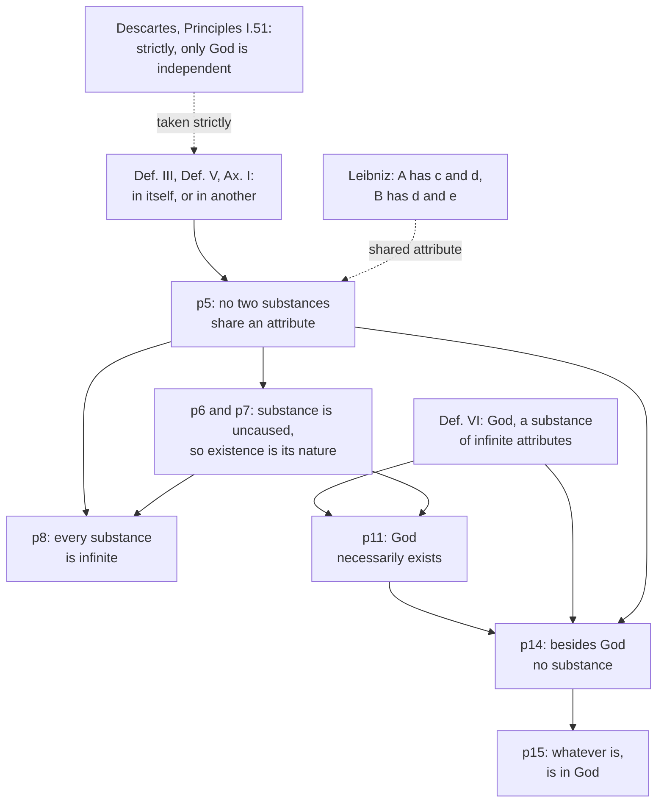

# Modern Philosophy · Lesson 2.1: Spinoza I: one substance

> ⏱ ~15 min · Module 2: The rationalist systems · Builds on: [1.3 God, clear and distinct ideas, and the circle](01-03-god-clear-and-distinct-ideas-and-the-circle.md), [1.4 The real distinction and the interaction problem](01-04-the-real-distinction-and-the-interaction-problem.md) · Unlocks: [2.2 Spinoza II: mind, body and necessity](02-02-spinoza-mind-body-and-necessity.md)

## Why this matters

Descartes left the world with three kinds of substance: God, minds and bodies. Baruch Spinoza (1632–1677) accepted Descartes's own definition of substance and asked what follows if you take it at its word. His answer, in Part I of the *Ethics* (published after his death, in 1677), is that there is exactly one substance, God, and that you, this desk and every thought about it are ways that one substance is. Mind–body interaction, freedom and contingency all look different after this ([2.2](02-02-spinoza-mind-body-and-necessity.md)). This lesson builds the deduction and finds the step on which it turns.

## The idea

Descartes defined a substance as a thing that needs nothing else in order to exist. Then he noticed the problem himself: by that standard only God qualifies, since minds and bodies need God to keep them in being. He kept them as substances in a second, weaker sense: things that need *only* God.

Spinoza refuses the second sense. If "substance" means what needs nothing else, then whatever needs something else is not a substance. It is a dependent thing, which he calls a **mode**. Think of a wave. It is real, it has a shape and a history, it can smash a boat. But it is not a second thing beside the sea. It is a way the sea is, at a place and a time. Spinoza's claim is that you stand to God as the wave stands to the sea.

He argues for this in the **[geometrical method](../reference.md#geometrical-method)**: definitions, then axioms, then numbered propositions, each proved from earlier ones, as in Euclid. (He had already put part of Descartes's *Principles* into this form, in 1663.) The form makes the dependencies visible, which is its point. When the conclusion shocks you, you can trace exactly which definition or step produced it.

Two pieces of vocabulary carry everything. A **[substance](../reference.md#substance)** is in itself and conceived through itself. An **attribute** is what the intellect perceives as the essence of a substance. Thought and extension are Descartes's two. A **mode** is anything that is in, and conceived through, something else: this body, this idea ([attribute and mode](../reference.md#attribute-and-mode)).

## Source

Spinoza, *Ethics* Part I, Definitions III–VI and Axiom I (Elwes, public domain).

> III. By substance, I mean that which is in itself, and is conceived through itself: in other words, that of which a conception can be formed independently of any other conception.
>
> IV. By attribute, I mean that which the intellect perceives as constituting the essence of substance.
>
> V. By mode, I mean the modifications of substance, or that which exists in, and is conceived through, something other than itself.
>
> VI. By God, I mean a being absolutely infinite—that is, a substance consisting in infinite attributes, of which each expresses eternal and infinite essentiality.
>
> Axiom I. Everything which exists, exists either in itself or in something else.

Three things to notice. Definition III has two clauses, and the second is about *conceiving*. That is stronger than Descartes's test, which was about existing. A substance is independent in what it is and in how it must be understood. Axiom I leaves no third category: everything is a substance or a mode. And Definition VI does not say God has *some* attributes. It says God consists in infinite attributes, and the Explanation adds that God's essence contains "whatever expresses reality". God has every attribute there is. That clause is the trap the whole argument springs.

## The argument

The spine of Part I, propositions 1–15, in Spinoza's terms. The proposition numbers are his.

1. **Everything that is, is either in itself (substance) or in another (mode)** (Ax. I, Def. III, Def. V). *In words:* there is nothing else to be.
2. **Substance is prior in nature to its modes** (p1). *In words:* the sea comes first, the waves are ways it is.
3. **Distinct things differ either in their attributes or in their modes** (p4). *In words:* those are the only resources for telling things apart.
4. **So two substances cannot share an attribute** (p5). If they differ only in attributes, they do not share one. If they differ only in modes, set the modes aside, since substance is prior to them (premise 2). Then nothing distinguishes them, so there are not two. *In words:* two things with the same essence and nothing else to tell them apart are one thing.
5. **One substance cannot produce another** (p6). Substances with different attributes have nothing in common, and what has nothing in common cannot be cause and effect (p2–p3). Substances with the same attribute are ruled out by premise 4.
6. **So existence belongs to the nature of substance** (p7). *In words:* nothing outside a substance caused it, so it is its own cause, and its essence involves existing.
7. **Every substance is infinite** (p8). A finite substance would be bounded by another of the same attribute, which premise 4 forbids.
8. **God, the substance with every attribute, necessarily exists** (Def. VI, p11). *In words:* if God is a substance at all, premise 6 applies to God. This is a cousin of Descartes's [Meditation V argument](../reference.md#cartesian-ontological-argument) from [1.3](01-03-god-clear-and-distinct-ideas-and-the-circle.md). Spinoza adds a second proof from the demand that a reason be given for anything's existing or not existing.
9. **Any substance besides God would have some attribute, and God has them all, so it would share an attribute with God** (p14 proof). That contradicts premise 4.

∴ **C.** "Besides God no substance can be granted or conceived" (p14). And since everything is a substance or a mode, **whatever is, is in God, and nothing can be or be conceived without God** (p15).

Notice how little the conclusion needs once premises 4 and 8 are in place. God is guaranteed to exist and to have every attribute. No two substances share an attribute. So there is no room for a second substance.

**Where the argument is weakest.** Premise 4 (p5). The proof's first branch reads: "If only by the difference of their attributes, it will be granted that there cannot be more than one with an identical attribute." That is true only if each substance has one attribute. But Spinoza's own God has infinitely many. Leibniz pressed this in notes on the *Ethics*, in what is now called the **[shared-attribute objection](../reference.md#shared-attribute-objection)**. Substance A has attributes c and d, substance B has d and e. They differ in attributes, yet they share d. Defenders reply in two ways. One reply leans on Definition IV. An attribute *constitutes the essence* of its substance, so if d is the essence of A and of B, they have one essence. The other is Michael Della Rocca's (*Spinoza*, 2008), and it leans on the claim that each attribute is conceived through itself (p10). A and B, conceived under d alone, could not be told apart, and Spinoza's rationalism forbids a difference that nothing explains. Critics answer that both replies use more than p5's proof states. Premise 8 has a second weak point: it inherits every question about Meditation V, and their assessment belongs to [`philosophy-of-religion`](../../philosophy-of-religion/lessons/02-01-anselms-ontological-argument.md).

## The argument map

Solid arrows follow Spinoza's citations (p6's proof restates p5's content rather than citing it). Notice that p5 feeds three later steps, so the dashed objection at the bottom threatens most of the chain.

## Worked examples

**Example 1 (clean: is extension a second substance?).** Spinoza's opponents in the scholium to p15 say that extended substance is real, divisible into parts, and created by God, so it cannot belong to God. Run the deduction. A created substance is a contradiction, since a substance cannot be produced by anything outside it (p6 corollary). Suppose extended substance existed beside God. God has every attribute, extension included, so the two would share an attribute, which p5 forbids. So extension is one of God's attributes. Part II states it outright: God is an extended thing. What about divisibility? Substance as substance is indivisible (p13 corollary). What we cut and measure are bodies, and a body is a mode. So God is extended but has no body, and Spinoza says so himself in the same scholium. The surprising conclusion ("God is extended") and the orthodox one ("God has no body") both come from the same distinction between attribute and mode.

**Example 2 (hard: what does "in God" mean?).** p15 says everything is *in* God. Readers divide on what "in" means here.

- **Inherence.** Modes are in God as properties are in a subject, the old sense of "present in" ([`metaphysics` 2.1](../../metaphysics/lessons/02-01-substance-and-accident.md)). Pierre Bayle's *Dictionary* article on Spinoza (1697) took it this way and drew the consequence. God is then the subject of every predicate, so when one army kills another, God, modified one way, kills God, modified another. Evidence: Spinoza calls modes "modifications" (*affectiones*) of substance, which is inherence vocabulary.
- **Causal dependence.** Edwin Curley (*Spinoza's Metaphysics*, 1969) reads "in" as dependence of effect on cause. Modes are in God as effects depend on their cause, and God is not their subject. Evidence: Axiom IV ties knowing an effect to knowing its cause, Definition V pairs "in" with "conceived through", and p18 calls God the "indwelling" cause of all things.

The words do not settle it. Definition V's "in" fits both, and p18 calls God a *cause* and also says that cause stays inside its effects. The question of pantheism follows the choice. On Bayle's reading, God is the world's subject. On Curley's, God is the attributes, which the p29 scholium calls **[nature viewed as active](../reference.md#natura-naturans-and-naturata)** (*natura naturans*), and the modes are nature viewed as passive (*natura naturata*), which depends on God without being identical to God. Whether this God answers to the God of the theistic arguments is a question for [`philosophy-of-religion`](../../philosophy-of-religion/syllabus.md).

## Watch out

- **"God or Nature" is not in Part I.** You might expect the famous tag at the climax of p14–p15. In Elwes it first appears in the Part IV preface: "the eternal and infinite Being, which we call God or Nature" ([*Deus sive Natura*](../reference.md#deus-sive-natura)). Even there it names an eternal and infinite being, not the sum of bodies.
- **Anachronism: "Spinoza the pantheist" and "substance monism".** Both are later labels, not Spinoza's words. Use them as modern glosses, and remember that whether he is a pantheist depends on the reading of "in" (Example 2).
- **The geometry does not make it certain.** You might think a deductive form guarantees the result. It guarantees only that the result follows from the definitions. Definition III's "conceived through itself" and Definition VI's "infinite attributes" do most of the work, and a Cartesian can refuse both.

## One-liner

> Take "substance" to mean what depends on nothing, give God every attribute, forbid two substances one attribute, and only God is left: everything else is a way God is.

## Problems

**P1 (🟢) *(Exegetical.)*** Close reading. *Ethics* I p14, the proof (Elwes).

> As God is a being absolutely infinite, of whom no attribute that expresses the essence of substance can be denied (by Def. vi.), and he necessarily exists (by Prop. xi.); if any substance besides God were granted, it would have to be explained by some attribute of God, and thus two substances with the same attribute would exist, which (by Prop. v.) is absurd; therefore, besides God no substance can be granted, or, consequently, be conceived. If it could be conceived, it would necessarily have to be conceived as existent; but this (by the first part of this proof) is absurd.

(a) Why "would have to be explained by some attribute of God"? Which definition forces it? (b) Why does the proof need p11, and not just Definition VI? (c) The second half moves from "cannot be granted" to "cannot be conceived". Which earlier proposition licenses "if it could be conceived, it would … be conceived as existent"? Two sentences per part.

**P2 (🟡) *(Exegetical (a) · Evaluative (b).)*** Find the crux. Descartes (*Principles* I.51–52, Veitch) writes: "By substance we can conceive nothing else than a thing which exists in such a way as to stand in need of nothing beyond itself in order to its existence." He grants that only God strictly qualifies, but holds that minds and bodies fall under a common concept of substance as things that need "nothing but the concourse of God." Spinoza holds that only God is substance. (a) Name the single premise about the word "substance" on which they split, and say which premise of this lesson's reconstruction Descartes would need to block to keep many substances. (b) Spinoza could say Descartes's own I.51 has already conceded the point. Is Descartes's second sense of "substance" a principled distinction on his own premises, or does it only relabel dependence? Any verdict; 120 words or fewer for (b).

**P3 (🔴, optional) *(Exegetical (a) · Evaluative (b).)*** Counterexample. Take Leibniz's case: substance A has attributes c and d; substance B has d and e. (a) Using the argument map, name two later propositions whose proofs fail if the case is coherent, and say why each fails. (b) A defender replies from Definition IV: since an attribute *constitutes the essence* of its substance, A and B, sharing d, share an essence and so are one. Does this reply rescue p5 on Spinoza's own premises, or does it beg the question against Leibniz? Any verdict; 120 words or fewer for (b).

Solutions

**P1** *(Exegetical, strict.)*

(a) Definition VI says God has every attribute that expresses the essence of substance. So any other substance, whatever its attribute, would have one of God's attributes, and that is what "explained by some attribute of God" means.

(b) Definition VI only says what God would be. To get a clash under p5, God must actually exist alongside the supposed second substance, and p11 supplies that.

(c) p7 (existence belongs to the nature of substance), with its note 2. Whatever is conceived as a substance is conceived as existing, so a conceivable second substance would be an existing one, which the first half ruled out.

**Must hit, strict (a):**

- Definition VI: God has every attribute, so any substance's attribute is also God's.

**Must hit, strict (b):**

- p11 gives God's actual, necessary existence; without it there would be no second existing thing to share an attribute with.

**Must hit, strict (c):**

- p7: a substance's essence involves existence, so conceiving one is conceiving it as existent.

**Wrong turns:** citing p5 for (c). p5 supplies the absurdity in the first half, not the step from conceivable to existent. Reading "explained by some attribute of God" as causal production, which p6 forbids between substances.

---

**P2** *(Exegetical (a) · Evaluative (b).)*

**Accept:** in (b), either verdict, if the moves are made.

**Must hit, strict (a):**

- The crux: whether "substance" can be said in a derivative sense, of things that depend on God alone. Descartes affirms it; Spinoza denies it, since by Definition III whatever depends on another is a mode.
- To keep many substances, Descartes must block premise 1 as Spinoza reads it (anything not wholly in itself is in another, so a mode), or deny the conceptual clause of Definition III. Accept also premise 4 (p5): Descartes holds that many minds share the one attribute thought (*Principles* I.53).

**Must hit, any verdict (b):**

- State what makes the Cartesian sense principled if it is: created substances depend on God only, not on one another or on any subject; modes depend on a created substance as well. That is a real difference in kind.
- Say whether that difference is enough. On Spinoza's side, Descartes himself says no meaning of the word is common to God and creatures (I.51), so the second sense must be a new concept, and the question is whether it marks a real kind or only a degree of dependence.

**Wrong turns:** treating I.51 as already Spinoza's view; Descartes keeps two senses deliberately. Making the crux about God's existence, which both accept.

**Model answer (b), one of several:** Descartes's line is not arbitrary. A body depends on God but on no other creature, while its shape depends on the body as well. That is two tiers of dependence, and "substance" names the upper tier. But Descartes also says no meaning of "substance" is common to God and creatures. So the creaturely sense is not independence at all. It is a lesser degree of dependence. Spinoza's point is that dependence is dependence, and nothing in Descartes's principles shows that depending on God alone is a different kind from depending on anything else. On Descartes's premises the distinction is coherent but rests on an unargued premise: that dependence on the creator differs in kind from dependence on a creature.

---

**P3** *(Exegetical (a) · Evaluative (b).)*

**Accept:** in (a), any two of p6, p8, p14 with the reason; in (b), either verdict, if the moves are made.

**Must hit, strict (a):**

- p14 fails: a substance with attribute d alone, beside God, would differ from God (God has more), so sharing an attribute with God would no longer be absurd.
- p8 fails: a finite substance could be bounded by another sharing its attribute, which the proof rules out only by p5.
- p6 fails: its proof restates p5's content, and two substances sharing d would have something in common, so p2–p3 would no longer stop one from causing the other. (Accept also p12 or p13, whose proofs cite p5.)

**Must hit, any verdict (b):**

- Say exactly what the reply needs: that each attribute constitutes the *whole* essence of its substance, so that sharing one attribute is sharing an essence.
- Test it against the case: A's essence is also constituted by c, and B's by e. If an attribute is the whole essence, does a substance with two attributes have two essences? Say whether Spinoza's identity of the attributes in one substance (p10 note) supports the reply or presupposes that there is only one substance.

**Wrong turns:** answering that A and B differ "only in modes", which concedes the case. Rejecting the case because Spinoza later proves only one substance exists. That uses p14, which depends on p5.

**Model answer (b), one of several:** The reply is strong if Definition IV means each attribute is the whole essence, conceived one way. Then d is the whole of A's essence and the whole of B's, so A and B cannot differ. But then c is also the whole of A's essence, and so B, lacking c, has a different essence from A. The reply proves too much: it makes A's essence both shared and not shared with B. To avoid that, the defender must say that a substance with several attributes still has one essence, which each attribute expresses. That is the p10 note's view of God. It works for the one substance Spinoza already believes in. Against Leibniz, who asks whether two can share, it assumes what was to be proved.

## Flashback

**From Lesson [1.3](01-03-god-clear-and-distinct-ideas-and-the-circle.md) (God, clear and distinct ideas, and the circle):** *(Exegetical.)* Diagnose. An invented forum post:

> "Arnauld's circle misses. The trademark proof runs on the causal principle, and Descartes never says he perceives that clearly and distinctly. He says it is 'manifest by the natural light', which is a separate source and needs no guarantee. So the proof of God never uses the truth rule, and there is no circle."

Earlier in Meditation III (Veitch), Descartes contrasts the natural light with "nature" in the sense of a spontaneous impulse to believe, and says:

> what the natural light shows to be true can be in no degree doubtful, as, for example, that I am because I doubt, and other truths of the like kind

(a) Using this sentence, say why the post's contrast between the natural light and clear and distinct perception fails. (b) Suppose the post were right that natural-light truths need no divine guarantee. What would follow for the cogito and its kin, and which statement of Meditation III would that contradict? Two sentences per part.

Solution

**Must hit, strict (a):**

- The sentence counts "that I am because I doubt", the cogito, among the natural light's deliverances. The cogito is the perception from which Meditation III draws the truth rule: what made "I am" certain was only that it was clearly and distinctly perceived.
- So the natural light is not a second source beside clear and distinct perception. The causal principle, as one of its truths, is clearly perceived, and the proof of God rests on clear perception, which is all Arnauld's second premise says.

**Must hit, strict (b):**

- The cogito and every truth "of the like kind" would be certain without God, so the deceiving-God doubt would never reach clear perception at all.
- That contradicts Meditation III's statement, before the proofs, that without knowing that God exists and is no deceiver, "I do not see that I can ever be certain of anything" (Veitch).
- Credit for saying how the two statements *can* be held together: not by a separate faculty, but by the line between attending and remembering (or, on Frankfurt's reading, by what certainty means). That is Descartes's actual reply to Arnauld, and it concedes that the proofs rest on clear perception.

**Wrong turns:** equating the natural light with "nature" as spontaneous impulse. The passage separates them, and only the impulse is open to doubt. Concluding from (b) that Descartes is simply inconsistent: the two statements can be reconciled, but not by the post's route.

**Model answer:** (a) The sentence puts the cogito among the natural light's truths, and the cogito is Meditation III's model of clear and distinct perception. So the causal principle is clearly perceived like any other natural-light truth, and the proof of God rests on clear perception, as Arnauld says. (b) The cogito and every truth like it would then be certain without God, so the demon doubt would touch no clear perception. That contradicts "I do not see that I can ever be certain of anything" without knowing God, unless one adds the attention/memory distinction, which is Descartes's own reply and grants Arnauld's point about the proofs.

## Connections

- **Backward:** the definition Spinoza radicalizes is Descartes's (*Principles* I.51–52), and the attributes thought and extension are the two Descartes used for the real distinction in [1.4](01-04-the-real-distinction-and-the-interaction-problem.md). p11 is a relative of Meditation V in [1.3](01-03-god-clear-and-distinct-ideas-and-the-circle.md). Naming the premise two thinkers split on is [`philosophical-method` 4.3](../../philosophical-method/lessons/04-03-finding-the-crux.md).
- **Forward:** [2.2](02-02-spinoza-mind-body-and-necessity.md) draws the consequences: mind and body as one mode under two attributes, and no contingency. [2.3](02-03-leibniz-sufficient-reason-and-monads.md) is Leibniz's road back to infinitely many substances, and [2.4](02-04-interaction-and-causation.md) puts Spinoza's answer to interaction beside the others.
- **Sideways:** Definition V's "in another" is Aristotle's "present in a subject", read as dependence, from [`metaphysics` 2.1](../../metaphysics/lessons/02-01-substance-and-accident.md). Spinoza appears there as a holder of the strong principle of sufficient reason ([`metaphysics` 3.3](../../metaphysics/lessons/03-03-brute-facts-and-necessary-existence.md)), and [`philosophy-of-religion` 2.4](../../philosophy-of-religion/lessons/02-04-cosmological-arguments-sufficient-reason.md) notes that he accepted the collapse of every truth into a necessary one.
