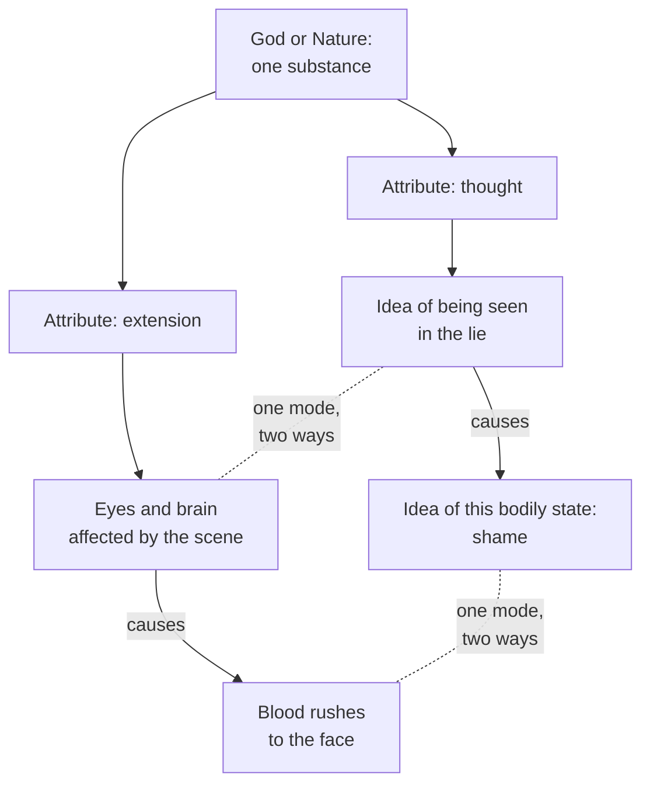

# Modern Philosophy · Lesson 2.2: Spinoza II: mind, body and necessity

> ⏱ ~15 min · Module 2: The rationalist systems · Builds on: [2.1 Spinoza I: one substance](02-01-spinoza-one-substance.md), [1.4 The real distinction and the interaction problem](01-04-the-real-distinction-and-the-interaction-problem.md) · Unlocks: [2.4 The problem they left: interaction and causation](02-04-interaction-and-causation.md)

## Why this matters

Descartes left two substances, a thinking mind and an extended body, and a union between them that Princess Elisabeth asked him to explain, the [interaction problem](../reference.md#interaction-problem) ([1.4](01-04-the-real-distinction-and-the-interaction-problem.md)). Part I of Spinoza's *Ethics* (published in 1677, the year he died) left one substance, God or Nature, with thought and extension as two of its infinitely many attributes ([2.1](02-01-spinoza-one-substance.md)). Parts II–V draw the consequences: the mind–body problem is refused, not solved, every event becomes necessary, and only God is fully free. This lesson asks whether those three results follow from Part I, and what they cost.

## The idea

Spinoza's own example is a circle. A circle existing in nature and the idea of that circle in God are, he says, one and the same thing displayed through different [attributes](../reference.md#attribute-and-mode). Not two matching things, like a building and its blueprint, but one thing conceived twice.

Apply that to a person. Your body is a mode of extension. Your mind is the idea of that body ([the mind as the idea of the body](../reference.md#mind-as-idea-of-the-body)). Whatever happens in the body happens, under the other attribute, in the mind. Each side has its own complete chain of causes, bodies by bodies and ideas by ideas, and no causal arrow crosses between them. The chains never fall out of step. God does not coordinate them, as he will for Leibniz ([2.4](02-04-interaction-and-causation.md)). They are one chain, which is why the doctrine's usual name, [parallelism](../reference.md#parallelism), is slightly misleading.

The same premises yield [necessitarianism](../reference.md#necessitarianism). Every mode follows from God's nature the way the properties of a triangle follow from its definition, so nothing could have been otherwise. Calling something "contingent" reports a gap in what we know.

Freedom is then not choosing between open alternatives but being determined by your own nature alone. Only God is free in that sense without qualification. A human being is freer the more of what happens in her follows from her own nature, which for a mind means from ideas it understands. That is [Spinoza's freedom](../reference.md#spinozan-freedom).

## Source

Spinoza, *Ethics* Part V, Preface (Elwes, public domain). Spinoza has just summarized Descartes's account of how the soul, joined to the pineal gland, moves the animal spirits.

> Indeed, I am lost in wonder, that a philosopher, who had stoutly asserted, that he would draw no conclusions which do not follow from self-evident premisses, [...] could maintain a hypothesis, beside which occult qualities are commonplace. What does he understand, I ask, by the union of the mind and the body? What clear and distinct conception has he got of thought in most intimate union with a certain particle of extended matter? [...] But he had so distinct a conception of mind being distinct from body, that he could not assign any particular cause of the union between the two [...] but was obliged to have recourse to the cause of the whole universe, that is to God. [...] In truth, as there is no common standard of volition and motion, so is there no comparison possible between the powers of the mind and the power or strength of the body.

Three things to notice. The critique is internal: it holds Descartes to his own rule of clear and distinct perception ([1.3](01-03-god-clear-and-distinct-ideas-and-the-circle.md)) and his own scorn for scholastic "occult qualities". The demand is for a *cause* that makes the union intelligible, so for Spinoza a cause is something an effect can be understood through. And "no common standard of volition and motion" is the premise Spinoza shares with Elisabeth's worry. He keeps it. What he drops is the two substances.

## The argument

**A. Mind and body** (*Ethics* I, II p6–7, II p13, III p2).

1. **There is one substance, God, and thought and extension are among its attributes** (I p14; II p1–2). *In words:* the conclusion of [2.1](02-01-spinoza-one-substance.md).
2. **Each attribute is conceived through itself** (I p10).
3. **Knowledge of an effect depends on and involves knowledge of its cause** (I ax. 4), and things with nothing in common cannot be cause of one another (I p3). *In words:* causing is a kind of explaining, so a cause must be something its effect can be understood through.
4. **∴ Modes of each attribute are caused by God only as he is considered through that attribute** (II p6). *In words:* bodies are caused by bodies, ideas by ideas.
5. **Whatever follows from God's nature under extension follows in the same order from the idea of God under thought** (II p7 cor.).
6. **∴ "The order and connection of ideas is the same as the order and connection of things"** (II p7). Since there is only one substance, "a mode of extension and the idea of that mode are one and the same thing, though expressed in two ways" (II p7 schol.).
7. **The object of the idea constituting a human mind is that person's body, actually existing, and nothing else** (II p13).
8. **∴ A mind and its body are one thing conceived under two attributes. Body cannot determine mind to think, nor mind determine body to motion or rest** (III p2).

**B. Necessity** (I p11–33).

1. **God exists necessarily, and whatever is, is in God** (I p11, p15).
2. **From the necessity of the divine nature infinitely many things follow in infinitely many ways** (I p16). *In words:* the world follows from God's nature as theorems from a definition, not from a choice.
3. **Every finite thing is determined to exist and act by another finite cause, and that one by another, without end** (I p28).
4. **∴ Nothing is contingent; all things are determined by the divine nature to exist and act in a definite way** (I p29).
5. **If things could have been otherwise, God's nature could have been otherwise, and that other nature would also exist necessarily: two Gods, which I p14 rules out** (I p33 dem.).
6. **∴ Things could not have been produced in any other manner or order** (I p33). A thing is called contingent only "in relation to the imperfection of our knowledge" (I p33 schol. 1).

**C. What survives.** Each thing, insofar as it is in itself, strives to persevere in its being, and that striving, its [conatus](../reference.md#conatus), is its actual essence (III p6–7). Freedom is fixed by definition: "That thing is called free, which exists solely by the necessity of its own nature, and of which the action is determined by itself alone" (I def. 7). So God is the only free cause (I p17 cor. 2). There is no free will, only a chain of causes (II p48). People think themselves free because they are conscious of their desires and ignorant of their causes (I Appendix). In Letter 58 (to Schuller, 1674, paraphrased), Spinoza says a stone set in motion, if it could think, would believe it moved freely. Still, we *act* when something follows from our nature alone, as its adequate cause, and are passive when we are only a partial cause (III def. 2). A passion stops being a passion once we form a clear and distinct idea of it (V p3). Human freedom is real but partial.

**Readings.** Scholars divide on how strict B is. Don Garrett ("Spinoza's Necessitarianism", 1991) reads I p33 at face value: no truth could have been otherwise. Edwin Curley (*Behind the Geometrical Method*, 1988) argues that finite modes follow from God's nature only together with an infinite series of other finite modes (I p28). On his reading the existence of particular things is not necessary in the strongest sense, and II ax. 1 (a man may or may not exist) points the same way. "In any manner or in any order" (I p33) favours the strict reading; I p28 and II ax. 1 ground the moderate one. The text does not settle how they fit.

**Where the argument is weakest.** Premise B5. Leibniz, who had visited Spinoza in 1676, attacks it in the *Theodicy* (1710, §§173–174, paraphrased). The possible is whatever implies no contradiction. A novel that never happened is possible, and so, quoting Bayle, is Spinoza dying at Leiden rather than The Hague. The world is necessary only *morally*, because God's wisdom chooses the best, not *metaphysically*, as if its contrary were contradictory. So "things could have been otherwise" does not imply "God's nature could have been otherwise". Spinoza's defender replies from I p35: whatever is in God's power necessarily exists. On that premise a never-actual possible is exactly what Spinoza denies, and Leibniz's notion of the possible assumes the point at issue. The crux is whether God acts from choice among possibles (I p17 schol. rejects it).

## The picture

Solid arrows are causes, and each runs inside one attribute. Dotted lines are identities, not causes. No causal arrow crosses between the columns (III p2).

## Worked examples

**Example 1 (clean: a blush of shame).** You are caught in a small lie and blush. The ordinary story says the shame caused the blush. Spinoza defines an emotion as a modification of the body that increases or decreases its power of acting, together with the idea of that modification (III def. 3). So the shame is one mode. Under extension it is a bodily change: the scene affects your eyes and brain, and blood reaches your face. Its causes are prior bodily states (II p6). Under thought it is a confused idea of that change, caused by the idea of being seen. Ask "did the shame make you blush?" and Spinoza answers that the question misdescribes the case. The blush *is* the shame, conceived through extension. To explain the blush through the shame would be to understand an extended thing through thought, which A2–A3 forbid. No thought ever pushes animal spirits.

**Example 2 (hard: a letter rewritten).** A merchant drafts an angry letter, reads a friend's argument that the anger is misplaced, and rewrites the letter calmly. Under thought, an idea (the argument) causes an idea (the revised judgment). Under extension the story must be complete too: the friend's marks on paper, through the eyes and brain, must alone determine the hand's new strokes. Two strains appear. First, this is a promissory note: to the objection that no body could build a temple without a mind, Spinoza replies that no one yet knows what the body can do (III p2 schol., read in P1). Second, if the judgment and the brain state are one mode, why is it false to say the judgment moved the hand? Michael Della Rocca (*Representation and the Mind-Body Problem in Spinoza*, 1996) answers that for Spinoza causal claims are explanatory, and explanation holds only under an attribute. The same mode causes the stroke *as* extended, not *as* a thought. Whether identity survives that barrier is still disputed.

## Watch out

- **"Parallelism" is a later label.** Spinoza never uses the word. It suggests two series kept in step, the picture of Leibniz's harmony, while the II p7 scholium speaks of one thing expressed two ways. How to weigh the two descriptions is a reading question (Boss 2).
- **Modern gloss: not mind–brain identity theory.** Calling Spinoza a "dual-aspect monist" or an identity theorist imports twentieth-century terms. His mind is the idea of the *whole* body, ideas are not neural states, and every body has an idea in God. II p13 schol. says all individuals are "animated" in different degrees, which some read as panpsychism, a later term. Dualism as a live question belongs to [`philosophy-of-mind`](../../philosophy-of-mind/syllabus.md).
- **You might think necessity makes striving pointless, but** conatus is the essence of each thing, and our ideas and efforts are among the causes through which what is necessary comes about. Necessitarianism is not fatalism, which says the outcome comes whatever we do.

## One-liner

> Mind and body are one mode of one God conceived twice, so neither moves the other; nothing could have been otherwise; and freedom is acting from what you understand, not escaping causes.

## Problems

**P1 (🟢) *(Exegetical.)*** Close reading. *Ethics* III p2 scholium (Elwes). Spinoza has just said that people are convinced the body moves "merely at the bidding of the mind".

> However, no one has hitherto laid down the limits to the powers of the body, that is, no one has as yet been taught by experience what the body can accomplish solely by the laws of nature, in so far as she is regarded as extension. No one hitherto has gained such an accurate knowledge of the bodily mechanism, that he can explain all its functions; nor need I call attention to the fact that many actions are observed in the lower animals, which far transcend human sagacity, and that somnambulists do many things in their sleep, which they would not venture to do when awake: these instances are enough to show, that the body can by the sole laws of its nature do many things which the mind wonders at.

(a) What inference of his opponents is this passage aimed at, and does it prove that the body does everything by its own laws, or something weaker? Point to the words that decide it. (b) A reader concludes that for Spinoza the body does the real work and the mind merely watches. Using III p2 as stated in the lesson and the phrase "in so far as she is regarded as extension", say why that misreads him. Two sentences per part.

**P2 (🟡) *(Exegetical (a) · Evaluative (b).)*** Diagnose. An invented study guide says:

> *Spinoza in one paragraph.* Spinoza is modern philosophy's great fatalist. Since everything happens by the necessity of God's nature, what will happen will happen whatever we do, so deliberating and striving are pointless. Freedom is an illusion through and through: nobody, not even God, acts freely. The wise man therefore stops trying and watches his life unfold, as the mind watches the body it is attached to.

(a) Name three distinct errors, and for each give the text that corrects it (by proposition or definition). One sentence each. (b) The guide's author replies: "Fine, but if my coming to understand is itself necessitated, Part V can't be advice. You can't advise someone to do what they will necessarily do or fail to do." Is this a good objection on Spinoza's own premises? Any verdict; 120 words or fewer.

**P3 (🔴, optional) *(Exegetical.)*** Find the crux. Descartes, *Principles* I.41 (Veitch): "we have such consciousness of the liberty and indifference which exists in ourselves, that there is nothing we more clearly or perfectly comprehend". Spinoza, *Ethics* I Appendix (Elwes): "men think themselves free inasmuch as they are conscious of their volitions and desires, and never even dream, in their ignorance, of the causes which have disposed them so to wish and desire." (a) Name the single premise about what consciousness of choosing shows that one asserts and the other denies, and say why Spinoza denies it. (b) In Meditation IV Descartes says indifference is "the lowest grade of liberty" and that the more clearly he sees the true and good, the more freely he chooses. Does that concession remove the crux? 120 words or fewer in all.

Solutions

**P1** *(Exegetical, strict.)*

**Must hit, strict (a):**

- The target is the inference from "we cannot see how the body could do this unaided" to "the mind must be moving it".
- The passage *undercuts* that inference by exposing its premise as ignorance: "no one has as yet been taught by experience", "no one hitherto has gained such an accurate knowledge".
- It is weaker than a proof. The animals and sleepwalkers show only that the body does "many things" the mind wonders at, not all things. The positive claim that bodies are caused only by bodies comes from the demonstration (II p6), not from this appeal to experience.

**Must hit, strict (b):**

- III p2 is symmetric: body cannot determine mind to think either. So the mind is not a passive spectator of bodily causes, and its ideas are caused by ideas.
- "In so far as she is regarded as extension" marks an explanation under one attribute. The same events, conceived under thought, are explained completely by ideas, and by II p7 schol. they are the same mode, so there is no second thing to sit idle.

**Wrong turns:** reading the sleepwalkers as Spinoza's proof of III p2. Reading the passage as materialism, the body as the real thing and the mind as a by-product. That ignores the qualifier and the symmetry.

**Model answer:** (a) It targets the inference from our inability to see how a body could do something to the claim that the mind did it, and it only undercuts that inference: "no one has as yet been taught by experience" what bodies can do, and the examples show "many things", not everything. The full claim rests on II p6, not on these cases. (b) III p2 also denies that body determines mind, so ideas have their own complete causes and the mind is not a spectator. The qualifier "in so far as she is regarded as extension" marks one way of conceiving a single order, the same one that thought conceives as ideas.

---

**P2** *(Exegetical (a) · Evaluative (b).)*

**Accept (a):** any three of the five errors below, each tied to the right text.

**Must hit, strict (a):**

- **Fatalism.** "Whatever we do" cuts our acts out of the causal order. For Spinoza outcomes follow *through* their causes, including our ideas and strivings (I p28–29; III p6–7).
- **"Not even God acts freely."** By I def. 7 God is the one fully free being, the sole free cause (I p17 cor. 2).
- **"Freedom is an illusion through and through."** What is illusory is free *will* (II p48; I Appendix). Freedom as acting from one's own nature, as adequate cause, is real and comes in degrees (III def. 2; V p3).
- **"Stops trying."** Striving to persevere is each thing's essence (III p7), so it cannot be given up.
- **"Watches the body."** The mind is the idea of the body, one mode with it (II p13; II p7 schol.), not a spectator attached to it.

**Must hit, any verdict (b):**

- State the objection's premise: advice requires that the person advised could do otherwise in a sense stronger than "for all we know".
- State Spinoza's resource: ideas are causes in the order of thought, so reading and understanding the demonstrations is one of the causes by which a mind becomes freer. Advice works as a cause, not as an appeal to an undetermined will.
- Decide whether that answers the objection, and name the cost. The only "could" left is relative to ignorance (I p33 schol. 1).

**Wrong turns:** answering (b) by restoring free will to Spinoza. Treating "necessitated" as "pointless", which repeats error 1.

**Model answer (b), one of several:** The objection assumes that advice needs an addressee who could genuinely go either way. Spinoza denies that any finite thing could, but he need not deny that advice works. Ideas cause ideas (II p6), so meeting a clear demonstration is one of the causes by which a passion becomes an action (V p3). Part V is advice in the way a proof is persuasion: it changes minds by causing them to understand. What Spinoza gives up is the deliberator's sense that both options are open. He calls that sense ignorance of causes. If advice requires more than causal efficacy, the objection stands. On Spinoza's premises it requires nothing more, so the objection begs the question.

---

**P3** *(Exegetical, strict.)*

**Must hit, strict (a):**

- The crux premise: *being conscious of choosing, without being conscious of anything that determines the choice, shows that the choice is not determined.*
- Descartes asserts it. Our consciousness of liberty is as clear as anything we know, and I.41 calls it absurd to doubt what we experience in ourselves.
- Spinoza denies it. Not being aware of causes is not being aware that there are none. Ignorance of causes would produce exactly the same consciousness, as in the drunk, the angry child and the stone (I Appendix; III p2 schol.; Letter 58).

**Must hit, strict (b):**

- The concession narrows the gap: for both, clear understanding increases freedom, and determination by the clearly seen true is no loss of liberty.
- It does not remove the crux. Descartes still holds a will distinct from and wider than the understanding, able to withhold assent (Principles I.39), with indifference as a real if lowest grade of liberty. Spinoza denies any such will: will and understanding are one (II p49 cor.), and there is no free will (II p48).

**Wrong turns:** naming "whether God exists" or "whether everything has a cause" as the crux. Descartes grants divine pre-ordination in I.40, so the split is over what our inner consciousness proves. Reading Meditation IV as full agreement with Spinoza.

**Model answer:** (a) Descartes holds that consciousness of choosing, with no felt determination, is evident proof of freedom. Spinoza denies it, because lacking awareness of causes is not being aware that there are none, and ignorance would feel exactly the same. (b) The concession narrows the gap, since both tie freedom to clear understanding. But Descartes keeps a will wider than the intellect, free to withhold assent. Spinoza denies there is a will apart from ideas (II p48–49).

## Flashback

**From Lesson [1.4](01-04-the-real-distinction-and-the-interaction-problem.md) (The real distinction and the interaction problem):** *(Exegetical.)* Find the crux. In the Third Objections (Objection II, Haldane–Ross), Hobbes grants "I am a thing that thinks; quite correct", and that what thinks is not nothing. But he adds that "all Philosophers distinguish a subject from its faculties and activities", so the thing that thinks might be corporeal. Descartes replies (Third Replies):

> since we do not apprehend the substance itself immediately through itself, but by means only of the fact that it is the subject of certain activities, it is highly rational [...] to give diverse names to those substances that we recognize to be the subjects of clearly diverse activities or accidents, and afterwards to inquire whether those diverse names refer to one and the same or to diverse things.

He goes on to say that thinking activities "have no affinity" with corporeal ones, and that once two distinct concepts are formed, Meditation VI settles whether they name one substance or two. (a) Name two premises Hobbes and Descartes share. (b) Name the single premise on which they split, and say where Descartes's reply locates the argument for his side. Two sentences per part.

Solution

**Must hit, strict (a):**

- Every activity needs a subject. Hobbes says what thinks is not nothing and distinguishes the subject from its activities; just before the passage Descartes says no activity or accident can be without a substance in which to exist.
- A substance is known only as the subject of its activities, never immediately. Hobbes's subject/activity distinction implies it; Descartes concedes it in the passage's first clause.
- Accept also: both grant the cogito's step to a thing that thinks ("quite correct").

**Must hit, strict (b):**

- The crux: *activities as diverse as thought and extension must belong to different subjects*. Hobbes denies it, or at least says its truth "has been assumed, not proved"; Descartes asserts it.
- The reply makes the naming provisional ("afterwards to inquire") and sends the decision to Meditation VI: to the clear and distinct ideas of mind and body, each without the other, backed by the God premise. That is the premise Hobbes pressed.
- Credit for the bridge: Spinoza denies the same premise from the other side. *Ethics* I p10 note says two attributes conceived as distinct do not therefore constitute two substances ([2.1](02-01-spinoza-one-substance.md)).

**Wrong turns:** making the crux whether thought needs a thinker, or whether the cogito is valid. Hobbes grants both. Saying Descartes claims an immediate grasp of his own substance: the passage denies it. Reading "give diverse names" as settling the question, when the passage says the inquiry comes afterwards.

**Model answer:** (a) Both hold that every activity needs a subject, and that a substance is known only as the subject of its activities, never directly. (b) They split on whether activities with "no affinity", thought and extension, could belong to one subject: Hobbes says nothing rules it out, and Descartes denies it. The reply treats the two names as provisional and rests the decision on Meditation VI's claim that mind and body are each clearly and distinctly conceived without the other, which is the very premise Hobbes said was assumed.

## Connections

- **Backward:** the one substance and its attributes come from [2.1](02-01-spinoza-one-substance.md). The union Spinoza mocks in the Part V preface, and Elisabeth's objection, are [1.4](01-04-the-real-distinction-and-the-interaction-problem.md). The standard of clear and distinct perception he turns against Descartes is [1.3](01-03-god-clear-and-distinct-ideas-and-the-circle.md). Naming a crux is [`philosophical-method` 4.3](../../philosophical-method/lessons/04-03-finding-the-crux.md).
- **Forward:** [2.3](02-03-leibniz-sufficient-reason-and-monads.md) gives Leibniz's rival route from sufficient reason to a world that is the best but not necessary. [2.4](02-04-interaction-and-causation.md) puts parallelism beside interaction, occasionalism and pre-established harmony on one case. Kant's third antinomy ([6.2](06-02-the-soul-and-the-antinomies.md)) returns to freedom inside a fully determined nature.
- **Sideways:** necessitarianism is the "modal collapse" that [`philosophy-of-religion` 2.4](../../philosophy-of-religion/lessons/02-04-cosmological-arguments-sufficient-reason.md) says Spinoza accepted. The kinds of necessity at stake are sorted in [`metaphysics` 3.1](../../metaphysics/lessons/03-01-kinds-of-necessity.md). Whether freedom as self-determination survives determinism is argued live in [`metaphysics` 6.2](../../metaphysics/lessons/06-02-compatibilism.md).
