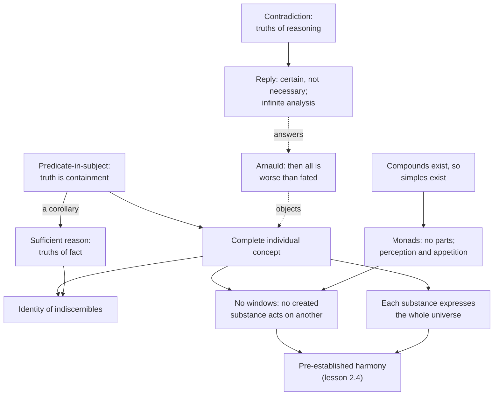

# Modern Philosophy · Lesson 2.3: Leibniz: sufficient reason and monads

> ⏱ ~15 min · Module 2: The rationalist systems · Builds on: [2.1 Spinoza I: one substance](02-01-spinoza-one-substance.md), [2.2 Spinoza II: mind, body and necessity](02-02-spinoza-mind-body-and-necessity.md) · Unlocks: [2.4 The problem they left](02-04-interaction-and-causation.md), [3.1 Locke: against innate ideas](03-01-locke-against-innate-ideas.md)

## Why this matters

Gottfried Wilhelm Leibniz (1646–1716) co-invented the calculus, served the court at Hanover as librarian and historian, and argued with almost everyone: Cartesians about force, Spinoza (whom he visited in November 1676) about necessity, Locke about innate ideas, Newton's ally Samuel Clarke about space. His metaphysics looks bizarre on first contact: the world is made of soul-like simples that never act on one another. Yet he claimed to reach it from principles hardly anyone denies. This lesson follows the route, from a theory of what makes a sentence true to a world of "windowless" monads, and to the objection Antoine Arnauld raised at once: if everything about me is written into my concept, how is anything I do contingent?

## The idea

Take a true sentence: *Caesar crossed the Rubicon.* What makes it true? Leibniz's answer: something about Caesar. In geometry you can show this, since analysing "triangle" exposes "three angles" inside it. Leibniz generalizes: in *every* true affirmative sentence, the predicate is somehow contained in the subject.

Push that through. If every truth about Caesar is contained in the concept of Caesar, the concept is *complete*: it holds everything true of him, past and future, including his relations to everything else. Three consequences follow fast.

- **No duplicates.** Two substances with all the same predicates would have the same complete concept, so they would be one substance counted twice.
- **No windows.** Whatever happens to a substance already belongs to its concept, so nothing needs to come in from outside. No created substance acts on another.
- **Yet no isolation.** Each concept includes the substance's relations to everything, so each substance *expresses* the whole universe from its own point of view, as one town looks different from each side (*Discourse* §9). The substances agree because God chose them together.

The *Monadology* (1714) reaches the same simples by a second road. Bodies are compounds; compounds are collections of simples; a simple has no parts, so no shape, size or divisibility. These simples are **monads**. Their only states are **perceptions** (a many represented in a one) and **appetition** (the inner tendency from one perception to the next). Perception need not be conscious: Leibniz faults the Cartesians for counting unnoticed perceptions as nothing (§14).

## Source

Leibniz, *Discourse on Metaphysics* (1686) §13 (Montgomery, 1902). Leibniz has granted that Caesar's becoming dictator is contained in his concept, and is answering the charge that this makes it necessary.

> I say that that which happens conformably to these decrees is assured, but that it is not therefore necessary, and if anyone did the contrary, he would do nothing impossible in itself, although it is impossible *ex hypothesi* that that other happen. For if anyone were capable of carrying out a complete demonstration by virtue of which he could prove this connection of the subject, which is Caesar, with the predicate, which is his successful enterprise, he would bring us to see in fact that the future dictatorship of Caesar had its basis in his concept or nature, so that one would see there a reason why he resolved to cross the Rubicon rather than to stop, [...] and that it was reasonable and by consequence assured that this would occur, but one would not prove that it was necessary in itself, nor that the contrary implied a contradiction.

Three things to notice. "These decrees" are God's free decrees, so the necessity is conditional on a choice. "Assured" (certain) and "necessary" are pulled apart, and that distinction carries the whole reply. And the analysis yields a *reason* ("rather than to stop"): the principle of sufficient reason is being run inside the theory of truth.

## The argument

**A. From truth to the complete concept** (*Discourse* §§8–9, 13–14; letters to Arnauld, 1686; *Monadology* §§31–33).

1. **[Principle of contradiction](../reference.md#principle-of-contradiction):** what involves a contradiction is false (§31). Truths of reasoning rest on it: their opposite is impossible, and analysis reduces them to identities (§§33–35).
2. **[Principle of sufficient reason](../reference.md#principle-of-sufficient-reason):** "there can be no fact real or existing, no statement true, unless there be a sufficient reason, why it should be so and not otherwise, although these reasons usually cannot be known by us" (§32, Latta). Truths of fact rest on it; their opposite is possible (§33).
3. **[Predicate-in-subject](../reference.md#predicate-in-subject-principle):** "Always in every true affirmative proposition, whether necessary or contingent, universal or singular, the notion of the predicate is in some way comprehended in that of the subject, *praedicatum inest subjecto*; otherwise I know not what truth is" (to Arnauld, 1686, Latta). In the same letter Leibniz calls this his great principle and the axiom of sufficient reason one of its corollaries. *In words:* a truth's reason is the containment a full analysis would expose.
4. **An individual substance is a subject of predicates that is not itself predicated of anything** (*Discourse* §8: the traditional definition, which Leibniz calls merely nominal until 3 is added).
5. **∴ The concept of an individual substance contains every predicate true of it** ([complete individual concept](../reference.md#complete-individual-concept)). God, seeing Alexander's concept, sees that he will conquer Darius and Porus (§8). *In words:* to be this individual is to have exactly this whole story.
6. **∴ No two substances are exactly alike, differing only in number** (§9; the [identity of indiscernibles](../reference.md#identity-of-indiscernibles)).
7. **∴ Whatever happens to a substance arises from its own nature; created substances do not act on one another directly** (§14's heading).
8. **Each concept includes the substance's relations to all others, so each expresses the whole universe** (§9).
9. **∴ The states of all substances agree without interaction**: the [pre-established harmony](../reference.md#pre-established-harmony), fixed when God chose which complete concepts to make actual ([2.4](02-04-interaction-and-causation.md)).

**B. From compounds to simples** (*Monadology* §§1–15). There are compounds, so there are simples (§2); simples have no parts, so no extension or figure (§3); no created thing can alter them from outside (§7, P1 below); they must differ in quality (§§8–9); their changes come from an internal principle (§11), as perception and appetition (§§14–15). These simples are [monads](../reference.md#monad).

**How A and B hang together** divides readers. Bertrand Russell (*A Critical Exposition of the Philosophy of Leibniz*, 1900) and Louis Couturat (*La Logique de Leibniz*, 1901) read the metaphysics as following from the logic, with premise 3 doing the work. Others note that the *Discourse* opens with God's perfection and reaches premise 3 only at §8, and that route B never uses premise 3. The Arnauld letter supports a logic-first order of *justification* for the PSR. It does not show that the logic came first in Leibniz's thinking, or that route B rests on it.

**Arnauld's worry and the reply.** Arnauld (1612–1694), author of the Fourth Objections to Descartes ([1.3](01-03-god-clear-and-distinct-ideas-and-the-circle.md)), saw the *Discourse*'s section headings in 1686. If Adam's concept contains his descendants, and theirs all their deeds, then once God chose to create Adam everything follows with a necessity worse than fate (P2 below). Leibniz replies on two levels.

- **[Hypothetical and absolute necessity](../reference.md#hypothetical-and-absolute-necessity).** Caesar's crossing follows *given* God's free decree; its contrary contains no contradiction in itself (Source). God's choice of the best has a reason that "inclines without necessitating" (to Arnauld, 1686, Latta).
- **Infinite analysis.** In short papers of the late 1680s (*On Contingency*, *On Freedom*), a necessary truth's analysis ends in an identity after finitely many steps; a contingent truth's never ends, though God sees the containment at once. Leibniz compares commensurable ratios with incommensurable ones, such as a square's side and diagonal.

**Where the argument is weakest.** Premise 3 applied to contingent truths. If the predicate is in Caesar's concept, why isn't denying it a contradiction? Critics after Arnauld press two follow-ups. Infinite analysis may show only that *we* cannot finish the proof, not that things could have gone otherwise. And hypothetical necessity is only as contingent as its hypothesis: if God's goodness guarantees the choice of the best, the whole series looks necessary after all, which is Spinoza's conclusion ([2.2](02-02-spinoza-mind-body-and-necessity.md)). Leibniz's reply: God chooses by moral, not metaphysical, necessity, and a less perfect world is rejected for its imperfection, not its impossibility (*Discourse* §13). Robert Merrihew Adams (*Leibniz: Determinist, Theist, Idealist*, 1994) sets out both accounts of contingency and how far each succeeds.

## The argument map

Solid arrows run from premise to consequence. Route A runs down from predicate-in-subject; route B enters from the compounds. The dashed edges are the Arnauld exchange.

## Worked examples

**Example 1 (clean: two indiscernible monads).** Suppose God considered making monads A and B, alike in every intrinsic quality. *Complete-concept route:* their concepts contain the same predicates, so they are one concept, and a concept fixes its substance; "two" collapses to one. *PSR route,* as Leibniz argued to Clarke (fifth paper, §21): God could have no reason to place A here and B there rather than the reverse, so making them would be acting without a reason, which a perfectly wise God never does. In Leibniz's words, "To suppose two things indiscernible, is to suppose the same thing under two names" (fourth paper, §6, Clarke's translation, 1717). Position does not rescue the pair, since for Leibniz space is an order among things, not a container that could individuate them. Run the same reasoning on space itself and you get his relationalism: shift the whole universe so that east becomes west while every relation is kept, and nothing differs, so there is nothing for God to choose between (third paper). Clarke replied that God's mere will is reason enough. The space debate continues in [`philosophy-of-physics`](../../philosophy-of-physics/syllabus.md).

**Example 2 (hard: "I might have married").** In May 1686 Arnauld pressed a common-sense case: he would still be himself whether he married or stayed celibate, so neither state can be in his individual concept. On Leibniz's machinery a married Arnauld has a different complete concept, so he is a different possible individual. Leibniz accepts this for Adam: had other things happened to him, he would have been another Adam. He softens it with the **vague Adam**, a partial description (first man, placed in a garden) that infinitely many possible complete individuals satisfy. So "Arnauld might have married" is true in that someone fitting Arnauld's incomplete description marries in a world God did not choose. Here the theory strains: the counterfactual no longer seems to be about Arnauld. Defenders say the contingency Leibniz needs belongs to the proposition (its contrary is possible in itself), not to one individual's having two histories. Critics say freedom seems to need the latter.

## Watch out

- **Windowless does not mean isolated.** You might think monads know nothing of one another. Actually every monad expresses the whole universe; what it lacks is *influence*, not representation.
- **Anachronism: *the arch-rationalist who ignored experience*.** Leibniz worked on dynamics and on mining engineering in the Harz, and cited microscope observations. "Rationalist" is a later textbook label. Likewise "possible worlds semantics", "world-bound individuals" and "counterparts" (David Lewis's term) are modern glosses on Example 2, not Leibniz's vocabulary; his possible universes are ideas in God's understanding (*Monadology* §53).
- **The identity of indiscernibles is not Leibniz's law.** That identicals share all properties is nearly uncontested; its converse, Leibniz's principle, is the substantive one ([`metaphysics` 5.3](../../metaphysics/lessons/05-03-coincidence-and-the-ship-of-theseus.md)).

## One-liner

> If every truth is a predicate contained in its subject, each substance carries its whole history and its view of the universe inside it, so nothing need come in through a window; the price is explaining why any of it is contingent.

## Problems

**P1 (🟢) *(Exegetical.)*** Close reading. Leibniz, *Monadology* §7 (Latta, 1898).

> Further, there is no way of explaining how a Monad can be altered in quality or internally changed by any other created thing; since it is impossible to change the place of anything in it or to conceive in it any internal motion which could be produced, directed, increased or diminished therein, although all this is possible in the case of Compounds, in which there are changes among the parts. The Monads have no windows, through which anything could come in or go out. Accidents cannot separate themselves from substances nor go about outside of them, as the 'sensible species' of the Scholastics used to do.

(a) What premise about how one thing changes another does the argument rely on, and which route of the lesson (A or B) is this? (b) Which words leave room for an exception, and for whom? (c) Does the passage deny that a monad represents other things? Two sentences per part.

**P2 (🟡) *(Exegetical (a) · Evaluative (b).)*** Find the crux. Arnauld to the Landgrave Ernst von Hessen-Rheinfels, 13 March 1686 (Montgomery, 1902). Arnauld has just quoted Article 13: the individual concept of every person involves once for all everything that will ever happen to him.

> If this is so, God was free to create or not to create Adam, but supposing he decided to create him, all that has since happened to the human race or which will ever happen to it has occurred and will occur by a necessity more than fatal. For the individual concept of Adam involved that he would have so many children and the individual concepts of these children involved all that they would do and all the children that they would have; and so on. God has therefore no more liberty in regard to all that, provided he wished to create Adam, than he was free to create a nature incapable of thought, supposing that he wished to create me.

(a) Name the single premise Arnauld needs that Leibniz denies, and say what Arnauld's closing comparison assumes about the containment. (b) Does Leibniz's reply (Source; "The argument") succeed on his own premises? Any verdict; 150 words or fewer.

**P3 (🔴, optional) *(Exegetical.)*** Diagnose. An invented study guide says:

> (i) Monads are the smallest bits of matter, the real atoms of nature, too small to be divided in practice. (ii) Since monads have no windows, nothing outside a monad registers in it: each lives sealed off, knowing nothing of the world. (iii) The identity of indiscernibles is an empirical generalization: a courtier searched a palace garden for two identical leaves and failed, and microscopes show that two drops of milk differ. (iv) Truths of fact, unlike truths of reasoning, have opposites that are possible, and their reasons are usually unknown to us.

Which claims misread Leibniz? For each, name the error and the text that corrects it. One sentence per claim.

Solutions

**P1** *(Exegetical, strict.)*

**Must hit, strict (a):**

- The premise: a thing is changed from outside only by moving, rearranging or setting in motion its parts ("change the place of anything in it", "internal motion"), which works for compounds "in which there are changes among the parts".
- A monad has no parts (§3), so no outside cause has anything to work on. This is route **B**, from simplicity. Neither predicate-in-subject nor the complete concept is used.

**Must hit, strict (b):**

- "By any other *created* thing" exempts God, who can create, annihilate or act on a monad (§6: monads begin only by creation and end only by annihilation).

**Must hit, strict (c):**

- No. The passage denies *influence*: being "altered", things that "come in or go out", accidents travelling between substances. It says nothing against representation, and §56 calls each monad a mirror of the universe.

**Wrong turns:** reading the windows sentence as the argument rather than its summary image; the "since" clause about parts and motion carries the argument. Taking "sensible species" to be Leibniz's own view; he names the scholastic theory of perception, in which something passes from object to perceiver, in order to reject it.

**Model answer:** (a) Outside causes change a thing by moving its parts, and a monad has none, so nothing created can alter it; this is route B, from simplicity alone. (b) "Other *created* thing" leaves God out: monads begin by creation and end by annihilation. (c) No: it denies that anything comes in or goes out, not that a monad represents the rest. Leibniz says elsewhere (§56) that each mirrors the universe.

---

**P2** *(Exegetical (a) · Evaluative (b).)*

**Accept (b):** any verdict that names the gap between certain and necessary and meets the hypothesis-of-the-best problem.

**Must hit, strict (a):**

- The premise: *whatever follows infallibly from an individual's complete concept, once God decrees to create that individual, follows with absolute necessity.* Leibniz denies it. Given the decree, the consequence is certain, but it is necessary only *ex hypothesi*; its contrary is no contradiction in itself.
- The comparison treats Adam's posterity as contained in Adam the way thinking is contained in Arnauld's nature, by essence, so denying it would be a contradiction. Leibniz holds the containment rests on God's free decrees, not on the essence alone.

**Must hit, any verdict (b):**

- State what the reply gives: no contradiction in the contrary, a reason that inclines without necessitating, and infinite analysis.
- Press the hypothesis: is God's choice of the best itself contingent? If it is necessary, hypothetical necessity becomes absolute.
- Say whether moral necessity, or the possibility of the contrary in itself, closes that gap on Leibniz's premises.

**Wrong turns:** treating "certain" and "necessary" as synonyms in (a); then Leibniz's denial disappears. Arguing in (b) about whether God exists or whether humans are free, which is not asked.

**Model answer (b), one of several:** The reply works against Arnauld's charge as stated. Arnauld treats a predicate contained by decree like one contained by essence. Leibniz shows the contrary of Caesar's crossing is no contradiction, so it is necessary only given the decree. The weak point is the decree. If God's goodness makes the choice of the best inevitable, then the decree is necessary too, and so is everything that follows from it. Leibniz's answer is that the choice follows from moral necessity, and that the rejected worlds remain possible in themselves. On his own premises that is consistent, since possibility is defined by freedom from contradiction. But it makes contingency a matter of what is possible in itself, not of what God could actually have done. Arnauld could accept the first and still feel his worry stands.

---

**P3** *(Exegetical, strict.)*

**Must hit, strict:**

- (i) Wrong: monads have no parts, extension or figure (§3), so they are not bits of matter. "Atoms of nature" means ultimate elements, and bodies are aggregates of them.
- (ii) Wrong: windowlessness denies influence, not representation. Each monad expresses the whole universe (*Discourse* §9; *Monadology* §56).
- (iii) Wrong: the principle is derived from the complete concept (*Discourse* §9) and from sufficient reason (the Clarke letters); leaves and drops of milk illustrate it, they do not ground it.
- (iv) Right: *Monadology* §§32–33.

**Wrong turns:** marking (iv) wrong because Leibniz also says contingent truths are contained in their subjects; that is consistent with §33. Marking (ii) right because "no windows" sounds like isolation.

**Model answer:** (i) misreads §3, since monads have no extension and are not matter. (ii) confuses influence with representation, since each monad mirrors the universe. (iii) mistakes an illustration for the ground, since the principle follows from the complete concept and sufficient reason. (iv) is correct (§§32–33).

## Flashback

**From Lesson [2.1](02-01-spinoza-one-substance.md) (Spinoza I: one substance):** *(Exegetical.)* Counterexample. An invented reader offers a counter-model to *Ethics* I: exactly two substances, T, whose only attribute is thought, and E, whose only attribute is extension. Each is its own cause and infinite in its own kind, and there is no being of the kind Definition VI describes. (a) Does the model violate p5, p7 or p8? (b) Which propositions exclude it, and which definition supplies the attribute that causes the clash? (c) Name the one premise the reader must deny to keep the model, and say what the p10 note offers against a reader who denies it by holding that a substance can have only one attribute. Two sentences per part.

Solution

**Must hit, strict (a):**

- None. T and E share no attribute (p5); each is its own cause, so existence belongs to its nature (p7); and nothing of the same nature limits either, so each is infinite (p8, with Definition II: a thought is limited only by a thought, a body only by a body).
- They are infinite "after their kind", not "absolutely infinite", which Definition VI's Explanation reserves for what contains "whatever expresses reality". Up to p8 the deduction rules out only substances that share an attribute.

**Must hit, strict (b):**

- p11: a substance of infinite attributes necessarily exists, against "no God". p14 then rules out T and E, because by Definition VI God has every attribute, thought and extension included, so each would share one with God, which p5 forbids.

**Must hit, strict (c):**

- p11, or what it rests on: that Definition VI describes a possible substance, so that p7 applies to it. p11's first proof is that if God did not exist, his essence would not involve existence, "which (Prop. vii.) is absurd". Accept "p11" or "Definition VI is coherent".
- The p10 note: it is "far from an absurdity to ascribe several attributes to one substance". Attributes conceived apart need not be distinct substances, and a being's reality is in proportion to the number of its attributes.

**Wrong turns:** saying p5 refutes the model. Leibniz's case in 2.1 had two substances *sharing* an attribute; this model is the reverse, and p5 alone allows it. Saying p8 refutes it because T is "only" infinite in its kind; p8 requires only that no other substance of the same nature limit it.

**Model answer:** (a) No: T and E share no attribute, each is self-caused, and each is unlimited within its own kind, which is all p5, p7 and p8 ask; they are infinite after their kind, not absolutely. (b) p11 says a substance of infinite attributes necessarily exists, and p14 then rules out T and E, because Definition VI gives that God every attribute, so each would share one with God against p5. (c) The reader must deny p11, which, granting p7, means denying that a substance with every attribute is possible. Against the one-attribute version of that denial, the p10 note says attributes conceived apart do not make two substances, and that a being has more reality the more attributes it has.

## Connections

- **Backward:** Spinoza's one substance ([2.1](02-01-spinoza-one-substance.md)) and his necessitarianism ([2.2](02-02-spinoza-mind-body-and-necessity.md)) are what Leibniz's plural substances and his contingency apparatus are built to avoid. The *Discourse* §9 nod to Aquinas, that each angel is its own species, is the view [`ancient-medieval-philosophy` 8.3](../../ancient-medieval-philosophy/lessons/08-03-scotus-common-nature-and-haecceity.md) sets against Scotus's haecceity; Leibniz extends it to every substance. Naming the Leibniz–Arnauld crux is [`philosophical-method` 4.3](../../philosophical-method/lessons/04-03-finding-the-crux.md).
- **Forward:** pre-established harmony against occasionalism, and the "perpetual miracle" charge, are [2.4](02-04-interaction-and-causation.md). Leibniz's *New Essays* answer Locke in [3.1](03-01-locke-against-innate-ideas.md). Kant keeps "predicate contained in the subject" as the mark of an *analytic* judgment and denies that all truths are analytic ([5.1](05-01-the-critical-question.md)).
- **Sideways:** the PSR as a live principle is [`metaphysics` 3.3](../../metaphysics/lessons/03-03-brute-facts-and-necessary-existence.md); Black's two spheres against the identity of indiscernibles are [`metaphysics` 2.1](../../metaphysics/lessons/02-01-substance-and-accident.md). Leibniz's cosmological argument (*Monadology* §§36–38) is [`philosophy-of-religion` 2.4](../../philosophy-of-religion/lessons/02-04-cosmological-arguments-sufficient-reason.md), and the best possible world (§§53–55) as theodicy is [`philosophy-of-religion` 4.3](../../philosophy-of-religion/lessons/04-03-theodicies.md). Leibniz–Clarke on absolute versus relational space belongs to [`philosophy-of-physics`](../../philosophy-of-physics/syllabus.md), with the physics in [`relativity`](../../relativity/syllabus.md). The mill (*Monadology* §17) is read in [`philosophy-of-mind`](../../philosophy-of-mind/syllabus.md).
