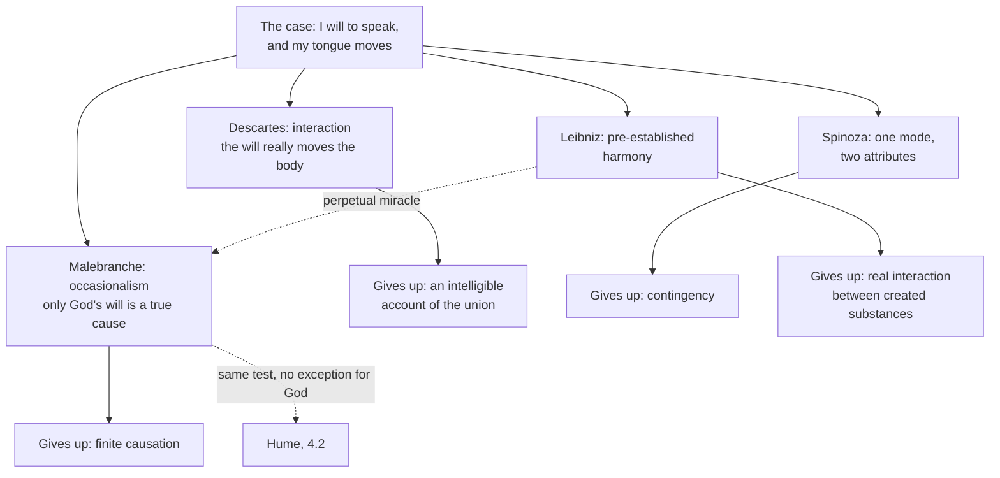

# Modern Philosophy · Lesson 2.4: The problem they left: interaction and causation

> ⏱ ~15 min · Module 2: The rationalist systems · Builds on: [1.4 The real distinction and the interaction problem](01-04-the-real-distinction-and-the-interaction-problem.md), [2.2 Spinoza II](02-02-spinoza-mind-body-and-necessity.md), [2.3 Leibniz](02-03-leibniz-sufficient-reason-and-monads.md) · Unlocks: [4.2 Causation and necessary connection](04-02-causation-and-necessary-connection.md)

## Why this matters

[1.4](01-04-the-real-distinction-and-the-interaction-problem.md) left Descartes with Elisabeth's question: how can an unextended mind move an extended body? By 1700 there were four answers on the table, and each one escaped the problem by giving something up. Put them side by side on a single case and you can see the prices. One of the four, Nicolas Malebranche's, did more than answer Elisabeth. It turned her question about *mind and body* into a question about *causation as such*, with a test that no created thing passes. Hume read it closely. In the *Treatise* (I.iii.14) he cites it by book, part and chapter, and then turns it against Malebranche.

## The idea

Take a case Arnold Geulincx, a Flemish Cartesian, had already used: you will to say a word, and your tongue moves. What makes it move?

- **Descartes: interaction.** Your volition really causes the motion. The soul acts chiefly through the pineal gland, which steers the animal spirits (*Passions of the Soul*, 1649, I.31–32). How an unextended thing can do that is known through the union itself, a primitive notion grasped in ordinary life, not by metaphysics (1.4). The price is an intelligible account of the union. This is the [interaction problem](../reference.md#interaction-problem).
- **Malebranche: [occasionalism](../reference.md#occasionalism).** Your volition is the *occasion* on which God, following laws he has fixed, moves your tongue. God's will is the only true cause, and this holds for bodies acting on bodies too. The price is finite causation.
- **Spinoza: one mode under two attributes.** The volition and the motion are one event conceived under thought and under extension ([2.2](02-02-spinoza-mind-body-and-necessity.md)), so neither causes the other. *Ethics* III p2 (Elwes): "Body cannot determine mind to think, neither can mind determine body to motion or rest or any state different from these, if such there be." The price is contingency: everything in either order follows necessarily.
- **Leibniz: [pre-established harmony](../reference.md#pre-established-harmony).** Each substance unfolds from its own nature. God made soul and body at the start so that they agree. *Monadology* §81 (Latta): "bodies act as if (to suppose the impossible) there were no souls, and souls act as if there were no bodies, and both act as if each influenced the other." The price is real interaction between created substances.

Elisabeth's worry was about *unlike* things: thought and extension seem to have nothing in common. Malebranche's worry runs deeper. His test fails a body acting on a body as badly as a mind acting on a body. Once the mind–body problem becomes the problem of what any cause is, the road to Hume is open.

## Source

Malebranche, *The Search after Truth*, Book VI, Part II, chapter 3 (T. Taylor's translation, second edition, 1700; spelling kept, long s modernized). He has just argued that bodies cannot move themselves.

> [...] it being evident there is no necessary Connexion betwixt the Will, we may have of moving our Arm, and the Motion of the same Arm. It moves indeed whenever we will it, and we may be call'd, in that sense, the natural cause of the Motion of our Arm; yet natural Causes are not true, but only occasional [...]. But Men are so far from being the true Causes of the Motions produc'd in their Body, that it seems to imply a Contradiction they should be so. For a true Cause is that betwixt which and its Effect, the Mind perceives a necessary connexion; for so I understand it. But there is none besides the infinitely perfect Being, betwixt whose Will and the Effects the Mind can perceive a necessary Connexion, and therefore none but God is the true Cause, or has a real Power of moving Bodies.

Three things to notice. Malebranche keeps the ordinary word "cause" but demotes it: you are the *natural* cause of your arm's motion, just not the *true* one. The definition of a [true cause](../reference.md#true-cause) is offered as stipulation ("for so I understand it"), and everything depends on it. And the necessity is the mind's: what counts is a connection the mind *perceives*, so that it cannot conceive the cause without the effect.

## The argument

Malebranche's no-necessary-connection argument (*Search* VI.ii.3):

1. **A true cause is one between which and its effect the mind perceives a necessary connection.** *In words:* to be a real cause, the effect must be unthinkable without it, given the cause.
2. **Our idea of body contains no force.** Body is extension, and nothing in extension moves itself.
3. **Between a finite will and any motion the mind perceives no necessary connection.** We can conceive the willing without the motion. Malebranche adds an argument from ignorance: most people do not even know they have nerves and animal spirits, yet move their arms more deftly than anatomists. We will the motion; only God knows how to bring it about.
4. **Between the will of an infinitely perfect being and its effect the mind does perceive a necessary connection.** It is inconceivable that an omnipotent God should will a body to move and it not move.
5. **∴ Only God is a true cause.**
6. **∴ Finite things are natural or occasional causes.** By God's general will, which constitutes the order of nature, their states are the occasions on which he acts.

A further step blocks the obvious escape. Could God *give* finite things real power? To give it would be to will that a body move whenever the creature wills. Then God's will still carries the necessity, and the creature's will is only the occasion. The *Dialogues on Metaphysics* (1688) add a second route: conservation is continuous creation, so God, who re-creates each body at each moment, puts it wherever it is.

**Where the argument is weakest.** Critics cut it at opposite ends. Leibniz attacks **premise 1**, the standard for a true cause. A genuine cause is a thing whose effects follow from the nature God gave it, not a connection we can perceive. Occasionalism makes every event a miracle, in his reply to Bayle's article "Rorarius" (Langley's appendix to the *New Essays*), taking the word "not popularly, as a thing rare and wonderful, but philosophically, as that which exceeds the forces of created beings." This is the [perpetual miracle objection](../reference.md#perpetual-miracle-objection). The occasionalist reply, which Bayle pressed against Leibniz, is that God acts only by general laws, and a miracle is a *particular* volition. Leibniz answers that a general decree still needs a natural means of carrying it out. Hume attacks **premise 4** instead. He keeps the standard and premise 3, and denies the exception: we have no impression of power in God's will either. In *Enquiry* §7 Part I he says the occasionalists, by bringing in God's will, have left the reach of our faculties behind. That argument is [4.2](04-02-causation-and-necessary-connection.md)'s.

## Map of positions

Solid arrows run from the case to each answer and its price. The dashed edges are the two attacks on Malebranche: Leibniz's on his standard for a cause, Hume's on his exception for God.

## Worked examples

**Example 1 (clean: occasionalism is not special pleading about minds).** A hammer strikes a nail and the nail goes in. Run Malebranche's test. Our idea of the hammer is extension in motion, and nothing in it is a force (premise 2). Can we conceive the hammer meeting the nail and the nail staying put? Yes, with no contradiction, so there is no necessary connection (premise 1). The hammer is the occasion, and God moves the nail by the laws of collision he has willed. Now the others. Leibniz also denies that the hammer passes anything into the nail's substance, but for the opposite reason: each body has its own force, and its change flows from within. Spinoza lets the hammer really cause the nail's motion, because both are modes of extension. He bars causation only *across* attributes. Descartes has God conserve the quantity of motion (*Principles* II.36), and readers divide on whether bodies keep any force of their own in his physics. So the body–body case scatters the four views differently than the mind–body case does. Malebranche and Leibniz agree on the verdict, that nothing flows from hammer into nail, and disagree about why.

**Example 2 (hard: the sinner's choice).** If no finite thing is a true cause, what about a choice to do wrong? Malebranche sees the danger. Just before the Source passage he says God moves every mind toward good in general. The mind can determine that impulse toward false goods, but "I doubt whether it can be call'd a Power." He needs a sliver of activity to keep sin from being God's doing. Hume, in the *Treatise* (I.iv.5, with a footnote naming Malebranche), calls the exception a mere pretext: if nothing is active but what has an apparent power, then God is the real cause of all our actions, good and bad. Here the views strain differently. Leibniz has no such trouble inside one soul, since each substance's states really flow from its own appetition. Spinoza accepts the necessity and redefines freedom ([2.2](02-02-spinoza-mind-body-and-necessity.md)). Descartes keeps an undetermined will that really acts. For Malebranche, the case shows that the argument which gets God into every collision also gets him into every choice.

## Watch out

- **You might think "parallelism" is Spinoza's word, but it is a later textbook label.** Spinoza never uses it. Leibniz used it of his *own* view: in a 1702 essay quoted in Latta's notes to *Monadology* §79, he says he has made out a perfect parallelism between soul and matter. If you apply the label to Spinoza, mark it as a modern gloss: [parallelism](../reference.md#parallelism).
- **You might think occasionalism makes nature irregular, but Malebranche's God acts by general laws.** Occasionalists expect the same regularities everyone else does. They dispute where the efficacy lies, not whether nature is orderly. "Perpetual miracle" is Leibniz's charge, not their admission.
- **You might think the [two clocks](../reference.md#two-clocks) are Leibniz's invention, but the simile was older.** Geulincx had used it, and Latta (in his introduction) holds that Leibniz had it from Simon Foucher, who probably hit on it independently. Leibniz's contribution was to sort the three ways clocks can agree: influence, assistance, pre-established agreement.

## One-liner

> Four answers to how mind moves body, each with a price (the union made opaque, finite causes abolished, contingency abolished, interaction abolished), and Malebranche's test for a true cause, which Hume would turn on God himself.

## Problems

**P1 (🟢) *(Exegetical.)*** Apply to a case. A pin pricks your finger and you feel a sharp pain. (a) For Descartes, Malebranche, Spinoza and Leibniz, say in one sentence each what produces the pain. (b) Which of them, if any, call the pin a cause of the pain in some sense, and in what sense? Two sentences.

**P2 (🟡) *(Exegetical.)*** Close reading. Leibniz, *Third Explanation of the New System* (1696; Latta, 1898). He has described three ways two clocks can keep time: by influencing each other, by a workman's constant adjustment, or by being made accurately at the start. Now he puts soul and body in their place.

> The way of influence is that of the common philosophy; but as we cannot conceive material particles or immaterial species or qualities which can pass from one of these substances into the other, we are obliged to give up this opinion. The way of assistance is that of the system of occasional causes; but I hold that this is to introduce Deus ex machina in a natural and ordinary matter, in which it is reasonable that God should intervene only in the way in which He supports all the other things of nature. [...] the way of the harmony pre-established [...], which has from the beginning formed each of these substances in so perfect, so regular and accurate a manner that by merely following its own laws [...] each substance is yet in harmony with the other, just as if there were a mutual influence between them [...].

(a) Leibniz rejects influence and assistance for different kinds of reason. Name each kind. (b) Does the passage deny that God acts in the agreement of soul and body? Which words decide it? (c) What does "just as if there were a mutual influence" preserve, and what does it deny? Two sentences per part.

**P3 (🔴, optional) *(Exegetical (a) · Evaluative (b).)*** Diagnose. An invented study guide says:

> Spinoza and Malebranche gave the same answer to Elisabeth: mind and body never really interact, so God keeps them in step. For Malebranche he does this moment by moment; for Spinoza he set the two series running at creation, like Leibniz's two clocks, which is why Spinoza's view is called parallelism. Both deny that bodies are real causes.

(a) Name three errors and correct each in one sentence. (b) A classmate defends the guide: "Both deny that the mind causes the body, so the difference between them is merely verbal." Is it? Any verdict; 100 words or fewer.

Solutions

**P1** *(Exegetical, strict.)*

**Must hit, strict (a):**

- **Descartes:** the pin moves the nerves and animal spirits, which move the pineal gland, and through the union this really causes the sensation in the soul.
- **Malebranche:** God, by his general will, produces the pain in the soul on the occasion of the motion in the brain; neither pin nor brain is a true cause.
- **Spinoza:** the pain is the idea of the body's being affected, the same mode under the attribute of thought, and it follows from other ideas, not from the pin; body cannot determine mind (III p2).
- **Leibniz:** the pain unfolds from the soul's own prior states by its own law, and God arranged at the start that it would coincide with the prick.

**Must hit, strict (b):** Descartes makes the pin a real, though remote, cause through the union. Malebranche calls it a *natural* or *occasional* cause, not a true one (the Source's distinction). Leibniz allows only "as if" causation. Spinoza lets the pin cause the bodily affection but not the pain.

**Wrong turns:** having Leibniz's God produce the pain at the moment of the prick, which is Malebranche's view. Having Spinoza's God coordinate two series.

**Model answer:** (a) Descartes: the pin's motion reaches the pineal gland and, through the union, really causes the pain. Malebranche: God causes the pain on the occasion of the brain motion. Spinoza: the pain is the bodily affection under the attribute of thought and follows only from other ideas. Leibniz: the pain flows from the soul's own nature, pre-arranged to match the prick. (b) Descartes makes the pin a real, if remote, cause, and Malebranche a merely natural or occasional one. Leibniz grants only "as if" influence, and Spinoza says the pin causes the body's affection, never the pain.

---

**P2** *(Exegetical, strict.)*

**Must hit, strict (a):** influence is rejected on grounds of **conceivability**: "we cannot conceive" anything that passes from one substance into the other. Assistance is rejected on grounds of **fittingness or order**: it brings in a Deus ex machina "in a natural and ordinary matter." The objection is not that occasionalism is inconceivable or impossible.

**Must hit, strict (b):** no. God "supports all the other things of nature," and he formed the substances "from the beginning." What Leibniz denies is *special* intervention case by case, beyond God's ordinary support.

**Must hit, strict (c):** it preserves all the appearances and regularities of interaction. It denies any real influence passing between the substances, since each follows "its own laws."

**Wrong turns:** reading "Deus ex machina" as a charge of incoherence. Importing "perpetual miracle," which is not in this passage. Concluding that Leibniz removes God from the agreement.

**Model answer:** (a) Influence fails a test of conceivability: nothing can be conceived to pass between substances. Assistance fails a test of fittingness: God should not step into a natural, ordinary matter beyond his general support. (b) No. God supports all things and formed each substance "from the beginning"; what is denied is a special intervention in each case. (c) It keeps every observable correlation, so everything happens as interaction would make it happen. It denies that anything actually passes from soul to body or back.

---

**P3** *(Exegetical (a) · Evaluative (b).)*

**Accept:** any three of the four errors in (a).

**Must hit, strict (a):**

- Spinoza's God does not "keep" anything in step by choice. Nothing in nature is contingent (2.2), and on the standard reading mind and body are one mode under two attributes, not two coordinated series.
- "Set running at creation, like the two clocks" is Leibniz's pre-established harmony, not Spinoza's view.
- Spinoza does not deny that bodies are real causes. Bodies cause bodies within extension; he denies only causation *across* attributes. Malebranche does deny it.
- "Parallelism" is a later label. Spinoza never uses the word, and Leibniz used it of his own view.

**Must hit, any verdict (b):** state what each view says *is* the cause (Malebranche: God's will, acting now on occasion of the volition; Spinoza: no cross-attribute cause, one event under two descriptions). Then test whether the difference makes a difference somewhere, for example to whether miracles are possible, whether bodies act on bodies, or whether things could have been otherwise.

**Wrong turns:** treating "both deny mind–body causation" as settling it. Arguing about which view is true.

**Model answer (b), one of several:** Not merely verbal. They agree on one negative thesis and on nothing positive. For Malebranche, a free God acts on each occasion by laws he could suspend, so miracles are possible and bodies never move bodies. For Spinoza nothing could be otherwise, there is no will in God to suspend anything, and bodies really do cause bodies. These differences show up wherever we ask what could have happened instead, so they are not just two vocabularies for one view.

## Flashback

**From Lesson [2.2](02-02-spinoza-mind-body-and-necessity.md) (Spinoza II: mind, body and necessity):** *(Exegetical.)* Apply to a new case. Two invented gamblers stop betting. Ada stops because she fears her brother will cut her off if he finds out. Ben stops after working out, step by step, how each loss feeds the craving behind the next bet, until the craving no longer moves him. *Ethics* III def. 2 (Elwes): we act when something follows from our nature as its adequate cause, when it "can through our nature alone be clearly and distinctly understood"; we are passive when we are "only the partial cause". (a) Which of them acts and which is passive in stopping, and why does the shared outcome not settle it? (b) A reader objects: "Both stoppings were necessitated (I p29), so for Spinoza Ada and Ben are equally unfree." Correct this from I def. 7 and V p3. Two sentences per part.

Solution

**Accept:** in (a), "Ben acts, or acts more than Ada". Human freedom is partial, and Ben's stopping still has outside causes among its conditions.

**Must hit, strict (a):**

- Ada is passive. Her stopping follows from fear of something outside her, a passion, so it cannot be understood through her nature alone, and she is only its partial cause. (IV p63 says it outright: "He who is led by fear, and does good in order to escape evil, is not led by reason.")
- Ben acts, or acts more. His stopping follows from a clear and distinct idea he has formed of the craving's causes, so it is understood through his own nature.
- Action and passion are fixed by what an outcome follows from, not by what the outcome is. The same stopping can be either.

**Must hit, strict (b):**

- I def. 7 sets the free against the "constrained", what is determined by something external, not against the necessary: the free thing "exists solely by the necessity of its own nature". So being necessitated does not make Ada and Ben equally unfree.
- V p3: a passion "ceases to be a passion" once we form a clear and distinct idea of it, which is what Ben did. Freedom comes in degrees, and he has more of it.

**Wrong turns:** saying Ben could have done otherwise or has free will. Spinoza denies free will (II p48), and Ben's stopping is as necessary as Ada's. Saying Ada's stopping is not caused by her at all; she is a partial cause. Grading by outcome: both did the sensible thing, so both acted.

**Model answer:** (a) Ada is passive: she stops from fear of something outside her, so her stopping cannot be understood through her nature alone, and she is only its partial cause. Ben acts, or at least acts more, because his stopping follows from an idea he understands; the same outward behaviour is action or passion depending on what it follows from. (b) For Spinoza the opposite of free is "constrained", determined from outside, not necessary; God is wholly necessary and wholly free (I def. 7; I p17 cor. 2). Both stoppings were necessary, but Ben's was determined by his own understanding, which by V p3 turned a passion into an action, so he is freer than Ada.

## Connections

- **Backward:** Elisabeth's objection and the primitive notion of union are [1.4](01-04-the-real-distinction-and-the-interaction-problem.md). One substance under two attributes, and the necessity it brings, are [2.1](02-01-spinoza-one-substance.md)–[2.2](02-02-spinoza-mind-body-and-necessity.md). Windowless monads are [2.3](02-03-leibniz-sufficient-reason-and-monads.md), and pre-established harmony is where that lesson pointed. Naming the premise on which two thinkers split is [`philosophical-method` 4.3](../../philosophical-method/lessons/04-03-finding-the-crux.md).
- **Forward:** Hume keeps Malebranche's test and drops its exception for God. The search for the impression of necessary connection is [4.2](04-02-causation-and-necessary-connection.md), and Kant's reply is [5.5](05-05-the-second-analogy.md). Dualism and interaction as live questions belong to [`philosophy-of-mind`](../../philosophy-of-mind/syllabus.md).
- **Sideways:** in Leibniz's passage, God "supports" all things, and Aquinas's account of God working in every created cause (ST I q.105 a.5) is the concurrentist view that occasionalism rejects, read in [`thomistic-synthesis` 5.2](../../thomistic-synthesis/lessons/05-02-providence-and-secondary-causes.md). Whether causal powers are real at all is [`metaphysics` 4.3](../../metaphysics/lessons/04-03-powers-dispositions-and-laws.md). Conservation as continuous creation differs from the standing act of conserving in [`metaphysics` 4.4](../../metaphysics/lessons/04-04-ordered-causal-series.md).
