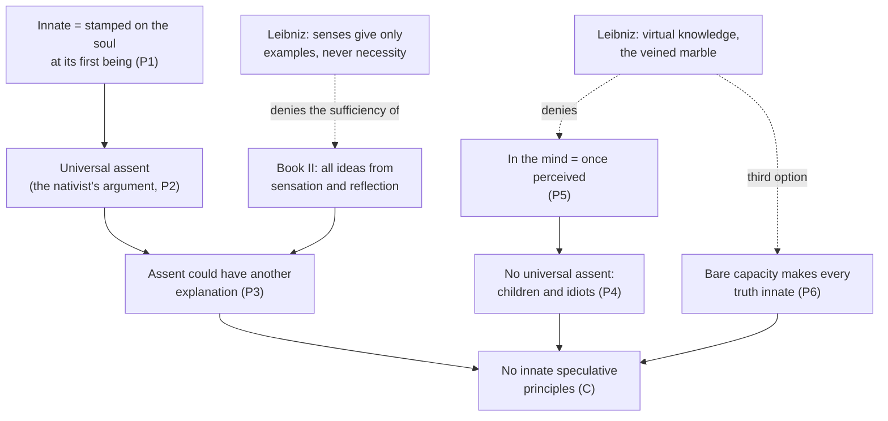

# Modern Philosophy · Lesson 3.1: Locke: against innate ideas

> ⏱ ~15 min · Module 3: Locke and Berkeley · Builds on: [2.3 Leibniz: sufficient reason and monads](02-03-leibniz-sufficient-reason-and-monads.md), [1.3 God, clear and distinct ideas, and the circle](01-03-god-clear-and-distinct-ideas-and-the-circle.md) · Unlocks: [3.2 Locke: qualities, substance and essence](03-02-locke-qualities-substance-and-essence.md), [4.1 Impressions, ideas and the fork](04-01-impressions-ideas-and-the-fork.md)

## Why this matters

Descartes's system ran on ideas the mind did not get from the senses: the idea of God that carries the trademark argument of [1.3](01-03-god-clear-and-distinct-ideas-and-the-circle.md), and the principles reason starts from. John Locke's *Essay Concerning Human Understanding* (1689, title page 1690) opens with a whole book arguing that there are no such principles. Book II then claims to show where every idea does come from. A decade later Leibniz answered him line by line in the *New Essays on Human Understanding*. He finished them around 1704, shelved them when Locke died that year, and they appeared only in 1765. The exchange turns on one premise about what it is for something to be "in the mind".

## The idea

The doctrine Locke attacks says some truths are "stamped upon the mind" at birth. His examples are logic's two most "magnified" maxims, "Whatsoever is, is" and "It is impossible for the same thing to be and not to be", and a set of moral rules. The usual evidence offered was that everyone agrees to them.

Locke's reply has a simple shape. First, agreement would not prove innateness if there were another way to explain it, and Book II supplies one. Second, there is no such agreement. Children and "idiots" (Locke's word, for people with severe intellectual disability) have no thought of these maxims at all. Third, the defender's fallback is to say the maxims are in the mind *without being known*. Locke thinks that is either incoherent or empty. A truth in the mind that the mind never perceived is a contradiction in terms. If "innate" just means the mind *can* come to know it, every knowable truth is innate, and the doctrine says nothing anyone denies.

Then Book II states the alternative: suppose the mind to be "white paper, void of all characters" (II.i.2). Everything on it comes from **sensation** (the senses reporting external things) or **reflection** (the mind noticing its own operations: perceiving, doubting, willing). Locke's "idea" is broad here. It covers "whatsoever is the object of the understanding when a man thinks" (I.i.8), sensations included. Ideas that arrive this way are **simple**: one uniform appearance, like the coldness of ice, which the mind cannot invent or destroy (II.ii). The mind then builds **complex** ideas, such as a man, an army or gratitude, by combining simple ones (II.xii).

Leibniz's reply is in one image. The mind is not a blank tablet or a uniform block of marble but marble with veins that already outline a figure. Work is needed to bring the figure out, but the block was never indifferent to it.

Citations follow the Gutenberg numbering, where the Introduction is I.i.

## Source

Locke, *Essay* I.ii.5 (Gutenberg). This comes just after the children-and-idiots argument.

> To say a notion is imprinted on the mind, and yet at the same time to say, that the mind is ignorant of it, and never yet took notice of it, is to make this impression nothing. No proposition can be said to be in the mind which it never yet knew, which it was never yet conscious of. For if any one may, then, by the same reason, all propositions that are true, and the mind is capable ever of assenting to, may be said to be in the mind, and to be imprinted [...]. So that if the capacity of knowing be the natural impression contended for, all the truths a man ever comes to know will, by this account, be every one of them innate; and this great point will amount to no more, but only to a very improper way of speaking.

Two things to notice. "Never *yet* knew" and "never *yet* conscious of" set a criterion with a past tense: what is in the mind must have been perceived at some time, not necessarily now. That leaves room for memory. And the second half is a dilemma. Either innate truths are actually perceived, which children refute, or they are capacities, and then all truths are innate. Leibniz will look for a third option.

## The argument

Locke, *Essay* Book I ([innate ideas](../reference.md#innate-ideas)), against speculative principles:

1. **An innate principle is one the soul "receives in its very first being, and brings into the world with it"** (I.ii.1). *In words:* innate means there from the start, before any experience.
2. **The argument for innate principles is universal assent** (I.ii.2).
3. **Universal assent would prove nothing if men could reach the same agreement another way** (I.ii.3), and Book II shows how they could. *In words:* even granting the datum, the inference fails.
4. **There is no universal assent: children and idiots have "not the least apprehension or thought" of the maxims** (I.ii.5).
5. **Nothing is in the mind that the mind was never conscious of** (I.ii.5). *In words:* to be in the understanding is to be, or to have been, understood.
6. **If being in the mind means only that the mind can come to know it, every truth anyone ever learns is innate, and the claim is trivial** (I.ii.5, I.ii.22). *In words:* the capacity is innate and the knowledge acquired, which nobody denies.
7. **"Known when men come to the use of reason" fails too.** If reason discovers the maxims, the mathematician's theorems are innate as well (I.ii.8). If it only names the time, the timing is false, since children reason long before they meet the maxims (I.ii.12).
8. **∴ There are no innate speculative principles.**

Book I.iv adds a second line. A proposition cannot be innate unless its ideas are, and ideas such as *impossibility* and *identity* are "so far from being innate" that many grown men lack them (I.iv.1–3).

**Where the argument is weakest.** Premises 5 and 6, and Leibniz attacks both. Against 5 he notes that Locke himself says ideas we are not contemplating are "in our understandings" whenever we *can* revive them (II.x.2), so Locke's own "in the mind" is already partly dispositional. Against 6 he denies that a disposition must be a bare capacity. The marble's veins favour Hercules "rather than other figures", and that is what separates innate truths from the rest. Locke has a reply to the first point. Memory revives what was *once* perceived, and that is the work "never yet" does in the Source. To the second, a Lockean can ask what the veins are, other than a name for the truths the mind finds necessary. Locke accounts for those through intuition, the mind seeing that two ideas agree or disagree (IV.ii.1), and that needs no innate content.

## The exchange

Solid arrows are Locke's argument; dashed edges are Leibniz's replies.

**The crux** ([finding the crux](../../philosophical-method/lessons/04-03-finding-the-crux.md)) is whether being in the mind requires present or past consciousness (Locke) or can be dispositional, "virtual" in Leibniz's word ([veined marble](../reference.md#veined-marble)). In the *New Essays* Preface (Langley's translation) truths are innate:

> as inclinations, dispositions, habits, or natural potentialities, and not as actions; although these potentialities are always accompanied by some actions, often insensible, which correspond to them.

The second clause ties this to Leibniz's metaphysics. A soul always perceives, mostly below awareness, the monad's perception of [2.3](02-03-leibniz-sufficient-reason-and-monads.md). Locke denies that the soul always thinks (II.i.10). Underneath the crux is a second disagreement, about what innateness is *for*. Leibniz argues that "the senses never give us anything but examples", and no number of examples yields a *necessary* truth. So the proof of a necessary truth must come from "internal principles", and experience is its occasion, not its ground. He also turns the empiricist slogan around (II.i): nothing is in the intellect that was not first in the senses, *nisi ipse intellectus*, except the intellect itself, whose ideas of being, substance, unity and cause it finds by attending to itself. He reads Locke's own "reflection" as conceding this.

## Worked examples

**Example 1 (clean: a child who knows sweet is not bitter).** Run both accounts on Locke's own case (I.ii.15). A child who cannot yet speak refuses the wormwood and takes the sugar. Locke: the child perceives that two particular ideas, *sweet* and *bitter*, are not the same. That is knowledge, but it is "about ideas, not innate, but acquired", and no general maxim figures in it. The maxim needs the abstract ideas of *thing*, *being* and *impossibility*, which come much later. Leibniz: the child does use the principle of contradiction, but not consciously. We build on general maxims the way an enthymeme builds on its unstated major premise. We do not think of them distinctly any more than we think of what we are doing "in walking and leaping" (*New Essays* I.i §19). Both accounts fit the behaviour, because they differ only on whether unconscious *use* counts as being in the mind: premise 5 again.

**Example 2 (hard: Descartes already gave the capacity answer).** Nearly fifty years before the *Essay*, Hobbes pressed a version of Locke's point against the *Meditations*. Do minds in "dreamless sleep" think? If not, they have no ideas then, so none is innate, "for what is innate is always present". Descartes's reply (Third Replies, Objection X, Haldane–Ross) concedes the step Locke makes the crux:

> I do not mean that it is always present to us. This would make no idea innate. I mean merely that we possess the faculty of summoning up this idea.

Now run premise 6 on it. If the faculty is just the general power to think, Locke's dilemma bites, and the idea of God is no more innate than the idea of an elephant. But Descartes speaks of summoning up *this* idea, a faculty tied to one content, which is closer to Leibniz's veins than to a bare capacity. Readers split on whether Locke had Descartes in his sights at all. The only nativist Book I names is Lord Herbert of Cherbury, whose *De Veritate* Locke says he consulted after writing his chapter (I.iii.15). John Yolton (*John Locke and the Way of Ideas*, 1956) argued that cruder nativist views, defended as props for religion and morality, were common in seventeenth-century England. The text shows that Locke engaged the dispositional reply at length (I.ii.5, I.ii.22). It does not show whom he meant by it.

## Watch out

- **"Tabula rasa" is not Locke's phrase.** It does not occur in the *Essay*. Locke says "white paper" (II.i.2) and an "empty cabinet" (I.ii.15). It is Leibniz who calls Locke's view the [tabula rasa](../reference.md#tabula-rasa) "of Aristotle", whose image of the intellect as an unwritten tablet is in *De Anima* III.4 (see [`ancient-medieval-philosophy` 3.5](../../ancient-medieval-philosophy/lessons/03-05-soul-and-intellect.md)).
- **You might think Locke denies that anything about the mind is inborn.** He grants innate faculties ("the capacity, they say, is innate") and calls this something "nobody, I think, ever denied". His target is innate *propositions* and the *ideas* that compose them. "Empiricist" is a later label ([rationalism and empiricism](../reference.md#rationalism-and-empiricism)), and it blurs that Locke grounds all certainty in intuition (IV.ii.1), while Leibniz agrees that experience is needed to *occasion* every thought.
- **You might think innateness for Leibniz is Plato's recollection.** He calls Plato's doctrine of reminiscence "wholly fabulous", though partly compatible with pure reason. His innate truths need no earlier life. They are dispositions of this soul, unlike the knowledge from a past existence in [`ancient-medieval-philosophy` 2.2](../../ancient-medieval-philosophy/lessons/02-02-recollection-the-line-and-the-cave.md).

## One-liner

> Locke: what was never perceived is not in the mind, and a mere capacity makes everything innate; Leibniz: the mind is veined marble, holding necessary truths as dispositions that experience occasions but cannot prove.

## Problems

**P1 (🟢) *(Exegetical.)*** Close reading. Locke, *Essay* I.iv.3 (Gutenberg):

> "It is impossible for the same thing to be, and not to be," is certainly (if there be any such) an innate PRINCIPLE. But can any one think, or will any one say, that "impossibility" and "identity" are two innate IDEAS? [...] Hath a child an idea of impossibility and identity, before it has of white or black, sweet or bitter? And is it from the knowledge of this principle that it concludes, that wormwood rubbed on the nipple hath not the same taste that it used to receive from thence? Is it the actual knowledge of IMPOSSIBILE EST IDEM ESSE, ET NON ESSE, that makes a child distinguish between its mother and a stranger; or that makes it fond of the one and flee the other?

(a) This passage does not rely on the universal-assent argument of I.ii. What different route to "not innate" does it take? Name the premise it depends on. (b) Which word in the last question could Leibniz accept while still holding that the child uses the principle? Say how *New Essays* I.i §19 exploits it. Two sentences per part.

**P2 (🟡) *(Exegetical.)*** Find the crux. Locke treats it as a *reductio* that the doctrine would make "all mathematical demonstrations, as well as first principles" innate (I.ii.22), and few mathematicians would believe "that all the diagrams they have drawn were but copies of those innate characters". Challenged to name a proposition whose ideas are innate, Leibniz's Theophilus answers (*New Essays* I.i, Langley): "I would name the propositions of arithmetic and geometry, which are all of this nature." Name the single premise about what marks a truth as innate that the two disagree on, and say why Locke's absurd consequence is not absurd for Leibniz. 120 words or fewer.

**P3 (🔴, optional) *(Exegetical (a) · Evaluative (b).)*** Apply to a hard case (invented). Suppose a laboratory finds that four-month-olds, who have no words and no general ideas, look much longer at a puppet show where one solid toy seems to pass through another than at a show where it is blocked. (a) Say what Locke's criterion (P5) and Leibniz's virtual criterion each make of the result. One or two sentences each. (b) Does the result help either side *on its own premises*, or does it leave the crux where it was? Any verdict; 150 words or fewer. Whether modern developmental science vindicates nativism is a live question for `philosophy-of-mind` ([syllabus](../../philosophy-of-mind/syllabus.md)), not this problem.

Solutions

**P1** *(Exegetical, strict.)*

**Must hit, strict (a):**

- The route is through the *ideas* that compose the principle: a proposition cannot be innate unless its constituent ideas are (I.iv.1), and children lack the ideas of impossibility and identity.
- The evidence is developmental order: the child has *white*, *sweet* and *bitter* before *impossibility* and *identity*.

**Must hit, strict (b):**

- The word is "actual" (in "the actual knowledge"). Leibniz grants that the child has no *actual*, explicit knowledge of the maxim.
- In I.i §19 Leibniz says we build on general maxims as on the suppressed major premise of an enthymeme, without thinking of them distinctly, as we walk without thinking about walking. So the child's discrimination can *use* the principle virtually.

**Wrong turns:** answering (a) with "children don't assent". That is I.ii's route, and the passage asks whether the child has the *ideas*. Picking "knowledge" in (b): Leibniz does call the innate truths "virtual knowledge", so it is "actual" that he can grant.

**Model answer:** (a) Locke argues from the parts: a principle is innate only if its ideas are, and a child has *sweet* and *bitter* long before *impossibility* and *identity*, so the principle cannot be born with it. (b) "Actual": Leibniz concedes the child lacks actual knowledge of the maxim but says it relies on it implicitly, as an enthymeme relies on an unstated major premise or a walker on movements he never thinks about.

---

**P2** *(Exegetical, strict on naming one premise.)*

**Must hit, strict:**

- The premise: *innateness is marked by how and when we come to assent* (Locke: the maxims are not assented to earlier, more readily or more universally than theorems, so they share an origin) versus *innateness is marked by the ground of a truth's proof*, which for necessary truths cannot be examples (Leibniz).
- For Leibniz the consequence is not absurd. All of arithmetic and geometry is necessary, proved from internal principles, so all of it is innate *virtually*, even though it takes labour to bring out, like the veins in the marble.

**Wrong turns:** naming the present-versus-past-consciousness crux without connecting it to this dispute. It underlies both positions, but the question asks what *marks* a truth as innate. Saying Leibniz holds mathematicians are born knowing theorems *actually*.

**Model answer:** They split over what makes a truth innate. Locke tests innateness by our history of assent: theorems and maxims are both learned and assented to once their ideas are clear, so if one is innate both are, which he takes as absurd. Leibniz tests innateness by the source of a truth's proof: a necessary truth cannot rest on examples, so its ground is internal. Then all of mathematics is innate as a disposition. Drawing the diagrams brings out what the veins already outlined, so Locke's *reductio* is simply Leibniz's view.

---

**P3** *(Exegetical (a) · Evaluative (b).)*

**Accept:** any verdict in (b) that says what the case adds or fails to add *relative to the crux*.

**Must hit, strict (a):**

- Locke: the infants are not conscious of any proposition about solidity or impossibility, so nothing like the maxim is in their minds. Their surprise has to be explained by expectations formed from simple ideas of sensation, such as solidity (II.iv), already received.
- Leibniz: the reaction shows a determinate disposition at work below awareness, a "vein" toward the principle that one body cannot occupy another's place. That is how innate truths exist, "as inclinations … not as actions".

**Must hit, any verdict (b):**

- Notice that both criteria fit the data. Locke can grant the behaviour and deny it is knowledge of a *proposition*. Leibniz needs no consciousness. So the case does not touch P5 directly.
- Say what *would* move one side on its own terms. Examples: showing that four-month-olds could not have acquired the expectation from experience (pressing Locke's P3); or that the reaction is just as specific for contingent regularities (pressing Leibniz's tie to necessity).

**Wrong turns:** treating the result as settling the historical dispute. Calling it "innate knowledge" in Locke's sense, which requires a perceived proposition. Citing real studies as if they decided the matter.

**Model answer (b), one of several:** On their own premises the result decides nothing, because each criterion already absorbs it. Locke holds that a proposition is in the mind only if it has been perceived. The infants perceive no proposition, so he files the reaction under expectations built from ideas of solidity, which touch supplies early. Leibniz never required perception and expects insensible dispositions to show up in behaviour. The case would bite only if it could be shown that four months of experience could not supply the expectation. That would hit Locke's premise 3, the claim that experience explains everything. Even then, Leibniz's real criterion is the ground of *necessity*, and an infant's surprise is not a proof of anything. The crux stays where it was.

## Flashback

**From Lesson [2.3](02-03-leibniz-sufficient-reason-and-monads.md) (Leibniz: sufficient reason and monads):** *(Exegetical.)* Reconstruct. *Monadology* §8 (Latta, 1898):

> Yet the Monads must have some qualities, otherwise they would not even be existing things. And if simple substances did not differ in quality, there would be absolutely no means of perceiving any change in things. For what is in the Compound can come only from the simple elements it contains, and the Monads, if they had no qualities, would be indistinguishable from one another, since they do not differ in quantity. Consequently, space being a plenum, each part of space would always receive, in any motion, exactly the equivalent of what it already had, and no one state of things would be discernible from another.

(a) Reconstruct the argument from "And if simple substances" to the end in four to six numbered premises and a conclusion, in Leibniz's terms. Supply and mark the premise he leaves unstated. (b) Which premise would a believer in empty space reject, and why does the argument need it? (c) Does §8 establish §9's claim that "each Monad must be different from every other"? Two sentences each for (b) and (c).

Solution

**Must hit, strict (a):**

- P1. What is in a compound comes only from the simple elements it contains.
- P2. Monads do not differ in quantity: having no parts, they have no size or figure.
- P3. So if monads had no qualities, they would be indistinguishable from one another, and every compound would be made of interchangeable elements.
- P4. Space is a plenum, so every motion only puts one portion of matter in the place of another.
- P5. So in any motion each part of space would receive exactly the equivalent of what it had, and no state of things would be discernible from another.
- P6 (unstated, supplied). But states of things are discernible: there is change.
- ∴ C. Monads have qualities, and differ in them.

Credit for noting that the first sentence is a separate, shorter argument: without qualities, monads would not be "existing things" at all.

**Must hit, strict (b):**

- P4, the plenum. With empty space, matter made of interchangeable elements could still change discernibly, by moving into places that were empty, so qualityless monads would not make every state like every other. The plenum was a Cartesian thesis (*Principles* II.16 calls a vacuum "repugnant to reason").

**Must hit, strict (c):**

- No. §8 needs only enough qualitative difference among monads for change to be discernible, which is compatible with two monads being exactly alike.
- §9's claim is the identity of indiscernibles. §9 asserts it ("in nature there are never two beings which are perfectly alike"), and its ground in 2.3 is route A, the complete concept and sufficient reason, not §8.

**Wrong turns:** reading "perceiving any change" as monadic perception in the §14 sense. The last clause glosses it: no state "would be discernible from another". Calling this route A; it uses simplicity and the absence of quantity, which is route B.

**Model answer:** (a) As above, P1–P6 and C. (b) Someone who believes in the void rejects P4: in empty space, uniform matter could still change discernibly by moving into empty places. The argument needs the plenum to make every motion a swap of equivalents. (c) No: §8 shows only that monads cannot all be qualitatively alike, which leaves room for twins. That no two monads are alike needs the identity of indiscernibles, which §9 asserts and which rests on the complete concept and sufficient reason.

## Connections

- **Backward:** the innate idea of God behind the trademark argument is [1.3](01-03-god-clear-and-distinct-ideas-and-the-circle.md), and Descartes's "faculty of summoning up this idea" is his reply to Hobbes, one of the objectors named in [1.4](01-04-the-real-distinction-and-the-interaction-problem.md). Leibniz's insensible perceptions are the monads' perception from [2.3](02-03-leibniz-sufficient-reason-and-monads.md). Plato's latent knowledge is [`ancient-medieval-philosophy` 2.2](../../ancient-medieval-philosophy/lessons/02-02-recollection-the-line-and-the-cave.md).
- **Forward:** [3.2](03-02-locke-qualities-substance-and-essence.md) builds on the simple ideas of sensation ([sensation and reflection](../reference.md#ideas-of-sensation-and-reflection); [simple and complex ideas](../reference.md#simple-and-complex-ideas)). Hume's copy principle in [4.1](04-01-impressions-ideas-and-the-fork.md) is the white-paper thesis made into a test. Kant's a priori in [5.1](05-01-the-critical-question.md) is not "innate" either: it concerns validity, not when knowledge arrives.
- **Sideways:** a priori justification as a live question is [`epistemology` 4.1](../../epistemology/lessons/04-01-a-priori-knowledge.md). A modern gloss, not Leibniz's concept: the veined marble is a cousin of **inductive bias**, the part of a learner's answer that comes from the learner rather than the data, in [`statistical-learning` 1.4](../../statistical-learning/lessons/01-04-no-free-lunch-and-inductive-bias.md). A perfectly blank learner learns nothing there either.
