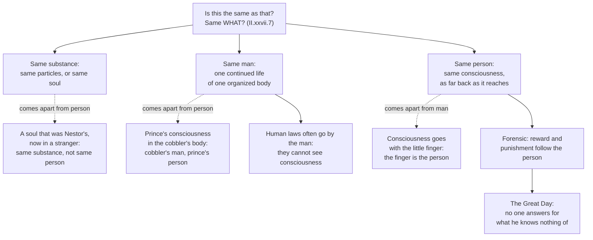

# Modern Philosophy · Lesson 3.3: Locke: personal identity

> ⏱ ~15 min · Module 3: Locke and Berkeley · Builds on: [3.1 Locke: against innate ideas](03-01-locke-against-innate-ideas.md), [3.2 Locke: qualities, substance and essence](03-02-locke-qualities-substance-and-essence.md), [1.2 The cogito and the wax](01-02-the-cogito-and-the-wax.md) · Unlocks: [4.4 The self, belief and the passions](04-04-the-self-belief-and-the-passions.md)

## Why this matters

Descartes answered "what am I?" with "a thinking thing", a substance ([1.2](01-02-the-cogito-and-the-wax.md)). That made "am I the same as the one who did it yesterday?" a question about whether the same soul persisted. Locke had just argued in [3.2](03-02-locke-qualities-substance-and-essence.md) that we have no idea what substance is beyond an unknown support. So he could not rest the self on it. In a chapter added to the second edition of the *Essay* (1694), at William Molyneux's urging, he moved the question somewhere else: from what we are made of to what we are conscious of. Every later theory of personal identity starts from that chapter, II.xxvii, "Of Identity and Diversity".

A note on numbering. Section numbers below are the standard ones (Nidditch). The Gutenberg text quoted here numbers the person sections two higher (the definition of person is its §11; "forensic term" is its §28).

## The idea

Ask "is it the same?" and Locke's first reply is: *the same what?* A heap of sand loses one grain and is no longer the same mass. An oak loses half its branches and is still the same oak. Nothing is puzzling here. "Mass" and "oak" are different ideas, so they have different conditions of sameness. A mass is the same while it has the same particles. An oak is the same while one continued life runs through particles that come and go.

Now apply this to us. "Substance", "man" and "person" are, Locke says, three different ideas. In his words, it is "one thing to be the same *substance*, another the same *man*, and a third the same *person*" (§7). See the [three ideas](../reference.md#man-person-substance). A man is a kind of animal. He is the same man while one organized body keeps one continued life, however its matter changes. A person is "a thinking intelligent being, that has reason and reflection, and can consider itself as itself, the same thinking thing, in different times and places" (§9). In words: a person is anything that can think of itself as itself across time. It does that only by consciousness. So the same person reaches exactly as far back as that consciousness reaches. Which substance does the thinking, one soul or a relay of them, is beside the point. That is the [consciousness criterion](../reference.md#consciousness-criterion).

Why insist on this? Because "person", Locke says, "is a forensic term, appropriating actions and their merit" (§26). See [forensic person](../reference.md#forensic-person). It is the courtroom concept, the one we use to pin deeds on someone for reward and punishment. What justice needs is the one who can own the deed, not the stuff he happens to be made of.

## Source

Locke, *Essay* II.xxvii.10 (Gutenberg text, its §12). Locke has just granted that consciousness is interrupted by forgetting and by sleep, which raises doubts about whether we are the same *substance*.

> The question being what makes the same person; and not whether it be the same identical substance, which always thinks in the same person, which, in this case, matters not at all: different substances, by the same consciousness (where they do partake in it) being united into one person, as well as different bodies by the same life are united into one animal [...]. For, it being the same consciousness that makes a man be himself to himself, personal identity depends on that only, whether it be annexed solely to one individual substance, or can be continued in a succession of several substances. For as far as any intelligent being can repeat the idea of any past action with the same consciousness it had of it at first, and with the same consciousness it has of any present action; so far it is the same personal self.

Three things to notice. **The analogy does the work.** Consciousness is to a person what life is to an animal: the thing that persists while the substances change. **"Matters not at all" is agnosticism, not denial.** Locke does not say there is no soul, only that the person's identity does not wait on the answer. **The last sentence faces two ways.** "Repeat the idea of any past action" sounds like memory. "The same consciousness it has of any present action" sounds like the reflexive awareness that comes with all thinking. Book II defines that awareness: "Consciousness is the perception of what passes in a man's own mind" (II.i.19). It is reflection turned on one's own operations, the second source of ideas in [3.1](03-01-locke-against-innate-ideas.md).

That double face splits Locke's readers. The **memory reading**, Reid's and still the textbook one, takes "same consciousness" of a past act to mean remembering it from the inside. On that reading the criterion is a memory criterion. The **appropriation reading** (Kenneth Winkler, 1991; Udo Thiel, *The Early Modern Subject*, 2011) takes consciousness to be present self-awareness that *owns* acts as one's own. Memory is then one way of appropriating an act, not the whole of it. Each reading has text behind it. Locke imagines wholly losing the memory of parts of one's life (§20). But he also says consciousness can extend to actions "past or to come" (§10), and memory reaches no future. The words settle that consciousness, for Locke, is reflexive and appropriative. They do not settle whether anything but memory can carry it backwards. See the [two readings](../reference.md#consciousness-and-memory-readings).

## The argument

1. **Identity is relative to the idea a name stands for:** as the idea, so the identity (§7). *In words:* "same?" has no answer until you say same *what*. See [identity relative to the idea](../reference.md#identity-relative-to-the-idea).
2. **A mass of matter is the same while its particles are the same; a living thing, oak, animal or man, is the same while one organized life continues through changing particles** (§§3–6).
3. **"Person" stands for a thinking intelligent being that can consider itself as itself at different times and places** (§9).
4. **A being considers itself as itself only by consciousness, which accompanies all thinking** (§9; II.i.19). *In words:* to think is to be aware that it is I who think.
5. **So the same person extends as far as the same consciousness extends, backwards to past actions** (§§9–10).
6. **We do not know whether consciousness is annexed to one substance or passed through several.** We know substance only as an unknown [substratum](../reference.md#substratum) ([3.2](03-02-locke-qualities-substance-and-essence.md)). And our concern follows consciousness, not stuff: a cut-off little finger is no longer part of me, but if consciousness went with the finger, the finger would be the person (§17).
7. **"Person" is forensic: reward and punishment are owed to the one who can own the act** (§§18, 26).

∴ **C.** Personal identity consists in sameness of consciousness, not of substance and not of the man. Persons, not substances, are the objects of reward and punishment (§18).

The theology is not decoration. Locke uses the account to make the resurrection intelligible. The same person can rise in a body not made of the same parts (§15), because the person goes where the consciousness goes. And at the Last Judgment, when the secrets of all hearts are opened (he cites the apostle, §26), no one will answer for what he knows nothing of (§22).

**Where the argument is weakest.** Step 5's "same consciousness". Locke himself saw that present consciousness of a past act might misrepresent it (§13; P2 reads that passage). Two critics made this the target. Joseph Butler (1736) argued that consciousness of a past act *presupposes* personal identity and so cannot constitute it. Thomas Reid (*Essays on the Intellectual Powers*, 1785, III.6) argued with his brave officer that memory is not transitive while identity is. Both are named here and argued in [`metaphysics` 6.6](../../metaphysics/lessons/06-06-personal-identity-over-time.md). The defender's reply runs through the appropriation reading. Locke is saying what makes a past act *mine to answer for*, the forensic question. He is not giving a test for which substance once acted, so Butler's circle may be a feature of a forensic concept rather than a fault.

## The picture

Each idea brings its own identity condition. The dashed edges are Locke's own cases (§§14, 15, 17) where two conditions come apart.

## Worked examples

**Example 1 (clean: Socrates and the mayor, §19).** Locke: if Socrates and "the present mayor of Queenborough" share one consciousness, they are the same person. If Socrates waking and Socrates sleeping do not, they are two persons. Run the three ideas. *Substance:* unknown, and it does not matter. *Man:* Socrates waking and sleeping is one man, with one body and one life. The mayor is a different man. *Person:* this follows consciousness, so it gives the opposite pairing to "man". Locke draws the forensic moral at once: punishing waking Socrates for what sleeping Socrates thought, which he was never conscious of, would be like punishing one twin for his brother's deed. The criterion cuts cleanly because all three ideas are kept apart.

**Example 2 (hard: one man, two persons, and the law).** Locke's own extreme case (§23) is two "incommunicable" consciousnesses taking turns in one body, one by day and one by night. That is one man and two persons, "as distinct" as Socrates and Plato. He adds that it would make no difference if each consciousness were tied to its own soul, or if one soul alternated between remembering and forgetting. Here the theory strains against practice. Locke reports that human laws do not punish the madman for the sober man's actions (§20), which seems to treat them as two persons. Yet laws punish a drunk man for what he did drunk, and a sleepwalker for his mischief, even if he is never afterwards conscious of it (§22). Locke's explanation is that human justice is "suitable to their way of knowledge". A court cannot tell real loss of consciousness from counterfeit, so it goes by the man. At the Great Day, when hearts are open, the person alone answers. So Locke has two standards. Human law tracks the *man* for lack of evidence. Divine justice tracks the *person*. Whether that is consistent with calling "person" forensic is a question this module's boss problem asks you to assess. Note only that Locke's answer is about evidence, not about what a person is.

## Watch out

- **You might think Locke defines the person by memory.** The word in the definition, and in almost every key sentence, is *consciousness*. "Memory criterion" is Reid's reading of Locke, and an influential one. Present it as a reading, and know the text that resists it (consciousness of acts "to come", §10).
- **You might think Locke denies the soul.** He says the "more probable opinion" is that consciousness is annexed to one immaterial substance (§25). His claim is narrower: personal identity does not *consist* in that, and would survive if it were false.
- **Anachronism: "the psychological continuity theory".** That is a twentieth-century position, built partly to escape Reid's objection by replacing direct consciousness with overlapping chains of psychological connections. Locke's criterion is direct consciousness of the act. Calling Locke a "psychological continuity theorist" imports the repair into the text it repairs.

## One-liner

> Same *what*? Same substance, same man and same person are three questions; the person is the forensic one, and it reaches exactly as far as consciousness reaches.

## Problems

**P1 (🟢) *(Exegetical.)*** Apply to a hard case. An invented case, built on a possibility Locke allows (§13). At midnight God removes the immaterial soul thinking in Brother Aldric, a monastery's cellarer. He puts in its place a newly created soul that receives the whole of Aldric's consciousness of his past thoughts and actions. Aldric's body sleeps through it and wakes as usual. The old soul, stripped of all consciousness of Aldric's life, is placed in an infant born that night in another town. (a) For the man who wakes in the monastery, and for the infant, say whether each is the same *substance*, the same *man* and the same *person* as yesterday's Aldric, on Locke's account. (b) Yesterday Aldric falsified the cellar accounts. On Locke's account, who answers for it, and which of Locke's terms decides that? Two sentences for (b).

**P2 (🟡) *(Exegetical (a)–(b) · Evaluative (c).)*** Close reading. *Essay* II.xxvii.13 (Gutenberg text, its §15). Locke is asking whether, if the thinking substance changes, the person can stay the same.

> But that which we call the same consciousness, not being the same individual act, why one intellectual substance may not have represented to it, as done by itself, what it never did, and was perhaps done by some other agent—why, I say, such a representation may not possibly be without reality of matter of fact, as well as several representations in dreams are, which yet whilst dreaming we take for true—will be difficult to conclude from the nature of things. And that it never is so, will by us, till we have clearer views of the nature of thinking substances, be best resolved into the goodness of God; who, as far as the happiness or misery of any of his sensible creatures is concerned in it, will not, by a fatal error of theirs, transfer from one to another that consciousness which draws reward or punishment with it.

(a) What possibility does Locke admit here, and what work does "not being the same individual act" do in admitting it? (b) What rules the possibility out, and is that a claim about what personal identity *is*, or about what will in fact happen? (c) Does the appeal to God's goodness answer the worry on Locke's own premises, or concede that "same consciousness" alone cannot fix whose deed it was? Any verdict; two sentences per part, 80 words or fewer for (c).

**P3 (🔴, optional) *(Exegetical.)*** Find the crux. Descartes, replying to Gassendi (Fifth Replies, Haldane–Ross):

> But why should it not always think, when it is a thinking substance? Why is it strange that we do not remember the thoughts it has had when in the womb or in a stupor, when we do not even remember the most of those we know we have had when grown up, in good health, and awake?

For a Cartesian, forgotten thoughts are still *mine*. For Locke, what consciousness cannot reach is no part of the person (§§20, 24). Name the single premise about what "I" picks out on which they split, say which side denies it, and say what would move each side. 150 words or fewer.

Solutions

**P1** *(Exegetical, strict.)*

(a) Monastery man: different substance (the thinking soul is new), same man, same person. Infant: same substance as yesterday's Aldric's soul, a different man, a different person.

(b) The man who wakes in the monastery answers, and the infant answers no more than any stranger would. "Person" is a forensic term that attaches deeds to whoever can own them by consciousness, not to the substance that once thought them.

**Must hit, strict (a):**

- Monastery man: same **man**, since one organized body keeps one continued life (§§6, 8). Same **person**, since the same consciousness reaches Aldric's past acts (§§9–10). Not the same thinking **substance**.
- Infant: the same immaterial **substance**, but a different man (another body and life) and a different person, since no consciousness reaches back. This is Locke's own soul-of-Nestor verdict (§14).

**Must hit, strict (b):**

- The monastery man is accountable, because **person** is forensic and accountability follows consciousness (§§18, 26). The infant's soul being the substance that falsified the accounts makes no difference.

**Wrong turns:** calling the infant "the real Aldric" because it has his soul. That is the Cartesian answer, and Locke rejects it in so many words for the soul of Nestor. Saying the monastery man is a different man because the soul changed. On Locke's idea of man (an animal of a certain form, §8) the soul is not what makes the same man. Only someone who "makes the soul the man" says otherwise (§15).

---

**P2** *(Exegetical (a)–(b) · Evaluative (c).)*

**Must hit, strict (a):**

- Locke admits that a substance might have represented to it, as done by itself, an act it never did and perhaps another agent did. Its consciousness of a past act could be false, like a dream.
- "Not being the same individual act" is the opening. If present consciousness of a past act *were* the past act itself, it could not be transferred. Because it is a new act that **represents** the past one, it can misrepresent.

**Must hit, strict (b):**

- Nothing in "the nature of things" rules it out. Locke rests it on **the goodness of God**, who will not transfer consciousness that brings reward or punishment from one to another.
- That is a claim about what **will in fact happen** (a guarantee), not about what identity consists in. The constitutive claim is unchanged: whoever has the consciousness is the person.

**Must hit, any verdict (c):**

- Notice that the passage separates **real** from merely apparent consciousness of a past act. Then say whether Locke's criterion needs the real kind.
- Say what follows either way. If it needs the real kind, "real" seems to mean "of an act that was one's own", which is Butler's charge (named, not argued). If it does not, then a falsely implanted consciousness would make someone the person who did the deed, and God's goodness only stops this happening.

**Wrong turns:** reading the passage as Locke doubting that consciousness makes identity. He doubts only whether consciousness tracks substance. Reading "the goodness of God" as part of the definition of a person.

**Model answer (c), one of several:** It concedes more than it answers. By separating a true representation from one "without reality of matter of fact", Locke needs consciousness of acts actually one's own, and "one's own" is the very thing in question. God's goodness keeps the error from happening; it does not tell us what would make the consciousness true.

---

**P3** *(Exegetical, strict on naming one premise.)*

**Accept:** any formulation equivalent to "what 'I' picks out is a substance, so my identity is that substance's identity", correctly assigned.

**Must hit, strict:**

- The crux premise: **the self or person is the thinking substance, so the same person is the same substance.** Descartes affirms it: I am a thinking substance whose essence is thought (Meditation II; *Principles* I.53). So forgotten thoughts in the womb were still thought by me.
- Locke **denies** it. Identity is relative to the idea (§7), and "person" is a different idea from "substance". What consciousness cannot reach belongs to no person, though it may belong to the substance or the man (§20).
- What would move them: Locke would need to be shown that consciousness cannot come apart from one substance. He already thinks this "more probable" (§25), but it would make the two criteria coincide, not prove his wrong. The Cartesian would need to accept that "person" is forensic, and that punishing a soul for what no consciousness reaches is, as Locke puts it, no different from being created miserable (§26).

**Wrong turns:** naming "whether the soul always thinks" as the crux. Locke denies it (II.i.10), but that is a second disagreement. Even a soul that always thinks would not, for Locke, make forgotten acts mine. Saying Locke denies there is a soul.

**Model answer:** They split on whether "I" names a substance. For Descartes I am a thinking substance, so whatever that substance thought, I thought, remembered or not. Locke denies that "person" stands for the substance at all: it stands for whatever consciousness unites, so the forgotten womb-thoughts belong to the substance, not to the person. Locke would move only if consciousness proved inseparable from one substance, and then the criteria would coincide. The Cartesian would move on the forensic point: punishment for what no consciousness reaches is like being created miserable.

## Flashback

**From Lesson [3.1](03-01-locke-against-innate-ideas.md) (Locke: against innate ideas):** *(Exegetical (a) · Evaluative (b).)* Reconstruct. Locke, *Essay* I.ii.9 (Gutenberg). The nativists say men assent to the maxims "when they come to the use of reason", and Locke is taking this to mean that reason discovers them. "Them" in the first line is the nativists.

> [R]eason (if we may believe them) is nothing else but the faculty of deducing unknown truths from principles or propositions that are already known[.] That certainly can never be thought innate which we have need of reason to discover [...]. [I]f men have those innate impressed truths originally, and before the use of reason, and yet are always ignorant of them till they come to the use of reason, it is in effect to say, that men know and know them not at the same time.

(a) Put the argument into at most four numbered premises and a conclusion, in Locke's terms, and say whose definition of reason it uses. (b) Which premise would Leibniz deny, and does his denial dissolve the "know and know them not" contradiction or only relabel it? Any verdict; 80 words or fewer for (b).

Solution

**Must hit, strict (a):**

- P1: Reason is the faculty of deducing unknown truths from truths already known.
- P2: So whatever reason is needed to discover was not known before reason discovered it.
- P3: An innate truth is imprinted on the mind before the use of reason, and what is in the mind is known. This premise is implicit, and it is premise 5 of 3.1: nothing is in the mind that the mind was never conscious of.
- P4: So a truth both innate and discovered by reason would be known (P3) and not known (P2) before the use of reason.
- ∴ C: If reason discovers the maxims, they are not innate, so this reading of "the use of reason" defence fails.
- The definition of reason is the nativists' own ("if we may believe them"). The argument presses them with consequences of their own principles, which Locke later names *argumentum ad hominem* (IV.xvii.21).

**Must hit, any verdict (b):**

- Leibniz denies P3's equation of being in the mind with being known: innate truths are there "as inclinations, dispositions, habits, or natural potentialities, and not as actions" (*New Essays* Preface, Langley), and reason brings out what was virtual.
- Then "know and know them not" equivocates between virtual and actual knowledge, so the formal contradiction goes.
- Test whether more than a label has changed. Locke's dilemma returns if a virtual truth is only a capacity, which would make every theorem innate (premise 6 of 3.1). Leibniz replies that the veins are determinate and tied to necessary truths. Reach a verdict.

**Wrong turns:** treating the definition of reason as Locke's own view; the parenthesis marks it as borrowed. Dropping P3, which leaves no contradiction to derive. In (b), having Leibniz deny P1: his quarrel is with what "in the mind" means, not with what reason does.

**Model answer:** (a) P1 Reason, on the nativists' own account, deduces unknown truths from known ones. P2 So what reason must discover was unknown before. P3 What is innately imprinted is in the mind, and what is in the mind is known. P4 So an innate truth found by reason would be known and unknown before reason's use. ∴ C If reason discovers the maxims, they are not innate. The definition is borrowed from the opponents. (b), one of several: Leibniz denies P3. Innate truths are in the mind virtually, as dispositions, and reason makes them actual, so "known" and "not known" no longer clash. Whether this is more than relabelling turns on whether a virtual truth differs from Locke's bare capacity. Leibniz says the veins favour one figure; Locke can ask what the veins are, beyond the truths later found necessary.

## Connections

- **Backward:** the "thinking thing" is Descartes's in [1.2](01-02-the-cogito-and-the-wax.md), and the real distinction that makes the self a substance is [1.4](01-04-the-real-distinction-and-the-interaction-problem.md). Locke's consciousness is reflection, the second source of ideas from [3.1](03-01-locke-against-innate-ideas.md). His refusal to rest identity on substance applies the agnosticism of [3.2](03-02-locke-qualities-substance-and-essence.md). The prince and the cobbler, and the little finger, are thought experiments in the sense of [`philosophical-method` 3.3](../../philosophical-method/lessons/03-03-thought-experiments.md).
- **Forward:** [3.4](03-04-berkeley-immaterialism.md) keeps the self as an active spiritual substance even as matter goes. [4.4](04-04-the-self-belief-and-the-passions.md) takes Locke's empiricism one step further: look within and you find no impression of a self at all, only perceptions. [4.5](04-05-reid-common-sense-against-the-way-of-ideas.md) names Reid's brave officer. Kant's paralogisms in [6.2](06-02-the-soul-and-the-antinomies.md), one of which concerns the soul's personality, attack the Cartesian premise of P3 from a third side.
- **Sideways:** whether Locke is *right* is [`metaphysics` 6.5](../../metaphysics/lessons/06-05-what-a-person-is.md) (what a person is: Locke's definition as one view among several) and [6.6](../../metaphysics/lessons/06-06-personal-identity-over-time.md) (Butler, Reid, quasi-memory, the ancestral fix). Whether consciousness could migrate between substances at all belongs to [`philosophy-of-mind`](../../philosophy-of-mind/syllabus.md).
