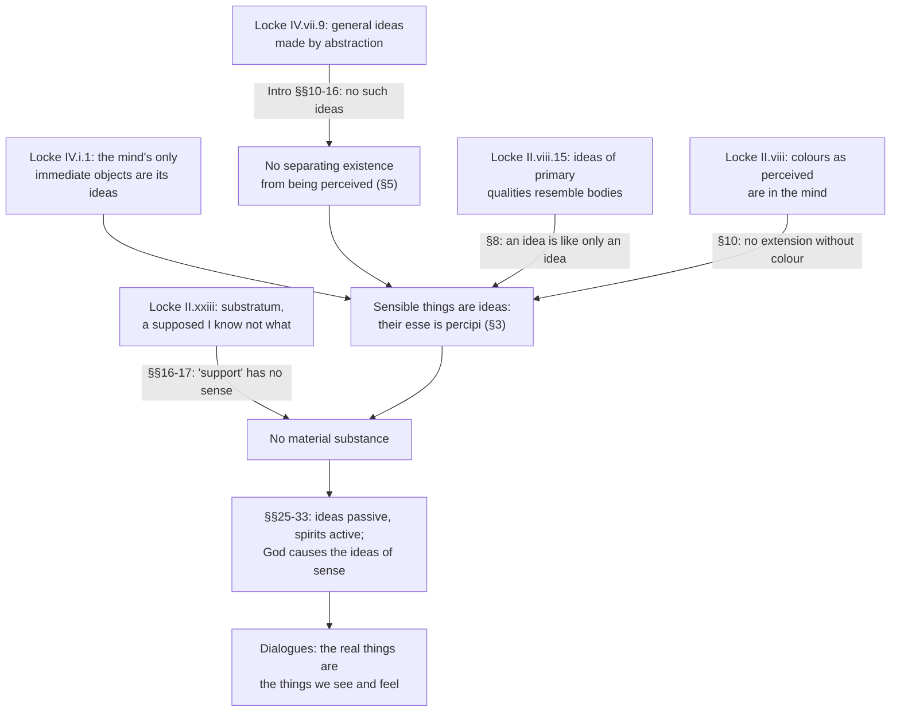

# Modern Philosophy · Lesson 3.4: Berkeley: immaterialism

> ⏱ ~15 min · Module 3: Locke and Berkeley · Builds on: [3.2 Locke: qualities, substance and essence](03-02-locke-qualities-substance-and-essence.md), [3.1 Locke: against innate ideas](03-01-locke-against-innate-ideas.md) · Unlocks: [4.1 Impressions, ideas and the fork](04-01-impressions-ideas-and-the-fork.md), [4.5 Reid: common sense against the way of ideas](04-05-reid-common-sense-against-the-way-of-ideas.md)

## Why this matters

[3.2](03-02-locke-qualities-substance-and-essence.md) left Locke with a three-layer picture. Ideas are in the mind. Bodies outside it cause those ideas, and the ideas of primary qualities resemble them. Underneath sits a substratum, a supposed "I know not what" that supports them (*Essay* II.xxiii). George Berkeley (1685–1753) published *A Treatise concerning the Principles of Human Knowledge* in 1710 and the *Three Dialogues between Hylas and Philonous* in 1713. He argued that the last two layers are incoherent, and that they feed scepticism: a world hidden behind our ideas can never be checked. Remove matter and the gap closes. Sensible things are ideas, the only substances are spirits, and God causes the ideas of sense. Berkeley presented this as a defence of the plain man's world, not a denial of it. Hume praised his account of general ideas as one of the great discoveries of the age (*Treatise* I.i.7).

## The idea

Three moves, each turning a Lockean premise against Locke.

**1. No abstract ideas.** Locke held that the mind makes general ideas by abstraction, stripping particulars down to what they share. His own example, which Berkeley quotes in the *Principles* Introduction §13, is the general idea of a triangle, which "must be neither oblique nor rectangle, neither equilateral, equicrural, nor scalenon, but all and none of these at once" (*Essay* IV.vii.9). Berkeley's report from his own mind (Intro §10): he can imagine a hand apart from a body, since a hand could exist apart, but he cannot conceive separately qualities that could not exist separately, such as a motion that is neither swift nor slow. A word or an idea becomes general not by having general content but by standing for any particular of a sort, as a geometer's one-inch line stands for all lines (Intro §12). That is the attack on [abstract ideas](../reference.md#abstract-ideas), the weapon for what follows.

**2. The things we perceive are ideas, and ideas need minds.** Houses and mountains are things we perceive by sense. What do we perceive besides our own ideas? Locke has already granted the answer: the mind has no immediate object but its own ideas (*Essay* IV.i.1). And an idea not perceived is a contradiction. So sensible things cannot exist unperceived: their *esse* is *percipi* (*Principles* §3), their being is to be perceived. The belief that they exist unperceived rests, Berkeley says, on a subtle piece of abstraction (§5): separating a thing's existence from its being perceived, which, by move 1, cannot be done.

**3. Spirits and God.** Ideas are inert; nothing in them is active (§25). So whatever causes our ideas is an active substance, a spirit. I can raise ideas of imagination at will (§28), but the ideas of sense come whether I will them or not (§29). So *another* spirit causes them, and their order, which we call the laws of nature, shows that spirit's wisdom (§30). The result is [immaterialism](../reference.md#immaterialism): only spirits and their ideas.

## Source

Berkeley, *Principles* Part I, §§3–4 (Gutenberg, the 1734 text; the editor's capitals and headings omitted).

> The table I write on I say exists, that is, I see and feel it; and if I were out of my study I should say it existed—meaning thereby that if I was in my study I might perceive it, or that some other spirit actually does perceive it. [...] For as to what is said of the absolute existence of unthinking things without any relation to their being perceived, that seems perfectly unintelligible. Their esse is percipi, nor is it possible they should have any existence out of the minds or thinking things which perceive them.
>
> 4. [...] For, what are the fore-mentioned objects but the things we perceive by sense? and what do we perceive besides our own ideas or sensations? and is it not plainly repugnant that any one of these, or any combination of them, should exist unperceived?

Three things to notice. First, the table *exists*: Berkeley analyses "exists", he does not deny it. Second, the unperceived table gets **two** analyses joined by "or". One is counterfactual (I *would* perceive it if I were in my study). The other is actual (some other spirit *does* perceive it). Readers split over which is Berkeley's considered view. The counterfactual line anticipates what was later called phenomenalism; the *Dialogues* lean on God's perceiving. The text does not choose. Third, the thesis is restricted to "unthinking things". Spirits are not ideas: their existence consists in perceiving, not in being perceived (§139).

## The argument

**A. The core argument (§§3–4)** ([esse est percipi](../reference.md#esse-est-percipi)).

1. **Sensible things (houses, mountains, tables) are things we perceive by sense.** *In words:* this is just what "sensible" means.
2. **What we immediately perceive by sense are only our own ideas or sensations.** *In words:* Locke's premise ([way of ideas](../reference.md#way-of-ideas)): the mind is directly acquainted only with its ideas.
3. **An idea's existence consists in being perceived** (§2). *In words:* an unperceived idea or sensation is a contradiction, like an unfelt pain.
4. **∴ Sensible things cannot exist unperceived.**

The obvious retreat is Locke's: our ideas are copies of things *like* them, existing outside the mind. Berkeley blocks it twice. The [likeness principle](../reference.md#likeness-principle) (§8) says "an idea can be like nothing but an idea; a colour or figure can be like nothing but another colour or figure." Either the originals are perceivable, and then they are ideas, or they are not, and then a colour cannot resemble something invisible. And the primary qualities cannot be prised off the secondary (§10): try to conceive extension and motion with no colour or other sensible quality at all. Locke grants that colours, as we perceive them, are in the mind. So extension, which cannot be conceived without them, is in the mind too.

Berkeley then stakes the whole case on one challenge, the [master argument](../reference.md#master-argument) (§§22–23; the name is a later one, not his). Conceive one sensible thing existing unconceived and he will concede. You picture trees in an empty park. But you are picturing them, so the trees are conceived all along. Whether that reply works is P3.

**B. From ideas to God (§§25–33).**

1. **Ideas are passive: no idea can cause anything** (§25).
2. **Our ideas of sense have a cause** (§26).
3. **So that cause is a substance, and not a material one** (§26, by A). *In words:* matter has been ruled out, so the cause is a spirit.
4. **It is not my will: ideas of sense come whether I will them or not** (§29).
5. **∴ Another spirit causes them. Their regular order, the laws of nature, shows its wisdom and goodness** (§§30–32).

Two corollaries follow. **Real things and chimeras** ([real things and chimeras](../reference.md#real-things-and-chimeras), §§30–33): both are ideas, but ideas of sense are stronger, more orderly, more coherent, and not dependent on my will. That difference is enough to keep the world from being a dream. **Spirits** are known by a *notion*, not an idea (§§27, 140), since no inert idea can resemble something active ([ideas and spirits](../reference.md#ideas-and-spirits)).

**Where the argument is weakest.** Premise A2, and the word "idea" inside it. Russell (*The Problems of Philosophy*, 1912, ch. IV) charged Berkeley with "confusing the thing apprehended with the act of apprehension". The *act* of seeing is mental. The colour seen need not be. Berkeley gets "what I perceive is in the mind" by sliding from the first sense of "idea" to the second. The defender has two replies. First, the identification is deliberate, not a slide. The 1710 edition of §5 says outright that "the object and the sensation are the same thing", and *Dialogue* I argues it case by case: intense heat is one simple sensation with the pain it gives, and pain is in the mind. Second, Locke asserts the premise, so against him it needs no defence: the argument is strongest *ad hominem*, against holders of the way of ideas. The **crux** is whether the immediate object of perception is an idea. Berkeley and Locke both say yes. Reid, in [4.5](04-05-reid-common-sense-against-the-way-of-ideas.md), says no.

## The argument map

Each labelled arrow is the Berkeleian move that turns a Lockean premise against matter.

## Worked examples

**Example 1 (clean: the dreamt cherry and the seen one).** Last night you dreamt you ate a cherry. This morning you eat one. Both are ideas, so what makes only the second a *real* cherry? Run §§30–33. The cherry you eat is vivid, it fits the order of everything else (the tree, the stone, the stain on your fingers), and you could not have willed it away. The dreamt cherry fails on order and coherence: it was in a room that turned into a train. Nothing in this verdict requires matter. Berkeley's claim is that this is exactly the test the plain man applies. Philonous calls himself a plain man who believes his senses (*Dialogue* III). Calling bread an idea does not make it imaginary: "imaginary" and "real" mark differences *among* ideas.

**Example 2 (hard: the tree nobody sees).** At 3 a.m. the college quadrangle is empty. Does the tree in it exist? On the Source's **counterfactual** reading, "the tree exists" means that if someone walked in, they would have tree-ideas. But what makes that conditional true, if nothing is there? Berkeley's answer has to be God's settled will, the laws of nature (§30), which pushes the second reading back in. On the **God-perceives** reading (§48: "some other spirit"; *Dialogue* III: some other Mind holds things "during the intervals" of our perceiving), the tree exists because God has it in mind. That strains in another place. In *Dialogue* III Philonous denies that God perceives anything by sense, as we do, or feels pain. So God's tree is not a set of sensations like mine. Then what makes his idea and my idea *the same* tree? When Hylas presses this (*Dialogue* III), Philonous answers that whether different perceivers see "the same" thing is a merely verbal dispute. Readers divide on whether that is adequate. The texts give a theory of continued existence; they do not give a clean theory of sameness across minds.

## Watch out

- **You might think Berkeley denied that tables, trees and bread exist, but actually** he denied only matter as the philosophers define it (§35). We eat, drink and wear the very things we immediately perceive; he only calls them ideas (§38). The *Dialogues* are titled "in opposition to sceptics and atheists", and Philonous's charge is that *Hylas*, the materialist, is the sceptic.
- **Famous misquotations.** "*Esse est percipi*" is a compression of §3's "their esse is percipi", and it covers sensible things only. Spirits' being is to perceive (§139). The limerick about God and the tree in the Quad is by Ronald Knox, in the twentieth century, not Berkeley. It also gets the theology wrong: Berkeley's God is not an occasional watcher. He perceives everything always, and not by sense.
- **Anachronism: "the empiricist Berkeley".** The label fits the claim that all ideas come from sense and reflection. It fits his method badly. Berkeley says he has proved his case "a priori", needing no a posteriori arguments (§21). His route to God runs from the passivity of ideas (§§25–29). He also disowns the nearest-looking view, Malebranche's ([2.4](02-04-interaction-and-causation.md)), as built on abstract ideas and an absolute external world (*Dialogue* II).

## One-liner

> Grant Locke that we perceive only ideas and that an idea can be like only an idea, and there is no room left for matter: to be, for a sensible thing, is to be perceived, and God is the cause of the ideas we call the real world.

## Problems

**P1 (🟢) *(Exegetical.)*** Close reading. *Principles*, Introduction §16 (Gutenberg). Berkeley is answering the objection that we can know a theorem holds of *all* triangles only if it was proved of the abstract idea of a triangle.

> To which I answer, that, though the idea I have in view whilst I make the demonstration be, for instance, that of an isosceles rectangular triangle whose sides are of a determinate length, I may nevertheless be certain it extends to all other rectilinear triangles, of what sort or bigness soever. And that because neither the right angle, nor the equality, nor determinate length of the sides are at all concerned in the demonstration. [...] And here it must be acknowledged that a man may consider a figure merely as triangular, without attending to the particular qualities of the angles, or relations of the sides. So far he may abstract; but this will never prove that he can frame an abstract, general, inconsistent idea of a triangle.

(a) According to the passage, what makes the proof general: a feature of the idea in view, or something else? Which words decide it? (b) "So far he may abstract." Does this concession contradict Berkeley's denial of abstract ideas? Say exactly what he grants and what he denies. (c) Whose word is "inconsistent", and what does Berkeley do with it? Two sentences per part.

**P2 (🟡) *(Exegetical.)*** Diagnose. An invented study guide:

> "Berkeley (1685–1753) was the most radical sceptic of the empiricist school. Building on Locke's doubts about substance, he concluded that tables, trees and bread do not really exist: there are only ideas in our heads. When nobody is looking, the tree in the quad ceases to be, unless God happens to be watching, as Berkeley's own famous limerick puts it. His God is Malebranche's: we see all things in Him, and He is the only real cause."

Name **four** errors. For each, say what Berkeley actually holds and cite the text (section of the *Principles* or which *Dialogue*) that shows it. One sentence each.

**P3 (🔴, optional) *(Exegetical (a) · Evaluative (b).)*** Reconstruct and find the crux. *Principles* §23 (Gutenberg), Berkeley's reply to the obvious answer to his §22 challenge.

> But, say you, surely there is nothing easier than for me to imagine trees, for instance, in a park, or books existing in a closet, and nobody by to perceive them. I answer, you may so, there is no difficulty in it; but what is all this, I beseech you, more than framing in your mind certain ideas which you call books and trees, and the same time omitting to frame the idea of any one that may perceive them? But do not you yourself perceive or think of them all the while? This therefore is nothing to the purpose [...]. To make out this, it is necessary that you conceive them existing unconceived or unthought of, which is a manifest repugnancy.

(a) Put the argument into numbered premises in Berkeley's terms, ending in the conclusion that no one can conceive a sensible thing existing unperceived. (b) A critic replies: "To conceive *that* a tree exists unconceived, I need not conceive *an unconceived tree*. My conceiving is of course conceived. What I conceive of need not be." Say which of your premises the critic denies. Then say how Berkeley could answer from his own account of what conceiving is (Introduction §10), and whether that answer works or only moves the dispute. Any verdict; 150 words or fewer for (b).

Solutions

**P1** *(Exegetical, strict.)*

(a) Generality comes from what the proof *uses*, not from the content of the idea. The deciding words: "neither the right angle, nor the equality, nor determinate length of the sides are at all concerned in the demonstration". The idea in view is fully particular, "an isosceles rectangular triangle whose sides are of a determinate length".

**Must hit, strict (a):**

- The idea is particular; the proof is general because none of its particular features is used in the proof.
- This matches Intro §12: a particular idea becomes general by standing for all of a sort.

(b) No contradiction. He grants *selective attention*: considering a figure "merely as triangular" without attending to its angles or sides. He denies that this produces a separate idea whose content is triangular and nothing determinate.

**Must hit, strict (b):**

- What is granted: attending to some features of a particular idea and not others.
- What is denied: framing an idea with general, indeterminate content ("abstract, general, inconsistent").

(c) "Inconsistent" is Locke's own word: *Essay* IV.vii.9, as quoted in Intro §13, calls the general triangle an idea "wherein some parts of several different and inconsistent ideas are put together", "all and none of these at once". Berkeley takes Locke at his word and asks the reader to look for such an idea (§13). An idea of something that cannot exist cannot be framed, since (Intro §10) one cannot conceive apart what cannot exist apart.

**Must hit, strict (c):**

- The word comes from the Locke passage Berkeley quotes in Intro §13.
- Berkeley turns it into a reductio of the idea's possibility.

**Wrong turns:** reading "So far he may abstract" as Berkeley giving up his case; the concession is about attention, not about a new idea. Answering (c) as if Locke clearly meant the idea *contains* incompatible features. "All and none" is open to a milder reading (the idea specifies none of them), and Berkeley's reading takes the words at their strongest.

**Model answer:** (a) The idea in view is a particular right isosceles triangle with fixed sides; the proof is general because "neither the right angle, nor the equality, nor determinate length of the sides are at all concerned in the demonstration". Generality lies in what the proof uses, not in the idea. (b) No contradiction. He grants that one can attend to a figure only as triangular, but denies that this yields a separate idea that is triangular and nothing more determinate. (c) "Inconsistent" is Locke's word from IV.vii.9, which Berkeley quoted in §13. He takes it literally: an idea of something that cannot exist cannot be framed.

---

**P2** *(Exegetical, strict.)*

**Accept:** any four of the six below, each with a correct text.

**Must hit, strict (four of):**

- **"Radical sceptic":** the *Dialogues* are "in opposition to sceptics and atheists", and Philonous argues that the *materialist* is the sceptic (*Dialogue* I, opening; *Dialogue* III).
- **"Tables... do not really exist":** Berkeley denies only "that which philosophers call matter" (§35); the table exists, analysed as perceived or perceivable (§3); "we are fed and clothed" with the things we perceive (§38).
- **"Ideas in our heads":** ideas exist in *minds* or spirits (§2). A brain or head is itself a sensible thing, so it exists only in the mind (*Dialogue* II), and the thesis concerns all minds, not ours alone (§48).
- **"Ceases to be... unless God happens to be watching":** the tree exists in the intervals in "some other spirit" (§48; *Dialogue* III), and Berkeley's God perceives all things always, not by sense (*Dialogue* III).
- **"His own famous limerick":** the limerick is Ronald Knox's, twentieth century.
- **"Malebranche's God":** Berkeley disowns Malebranche (*Dialogue* II): Malebranche builds on abstract ideas and keeps an absolute external world. Finite spirits cause their own ideas of imagination (§28), so God is not the only cause.

**Wrong turns:** counting "building on Locke's doubts about substance" as an error. It is roughly right (§§16–17 turn Locke's supposed "I know not what" against him). Calling "empiricist" simply false; it is a later label that fits his account of ideas and fits his a priori method badly (§21), so it is a gloss to flag, not one of the four clean errors.

**Model answer:** (1) Not a sceptic: the *Dialogues* are written against sceptics, and Philonous charges Hylas with scepticism. (2) Tables exist; only "matter" as philosophers define it is denied (§35, §38). (3) The tree does not cease to be: it exists in another spirit during the intervals (§48, *Dialogue* III), and God perceives always. (4) The limerick is Knox's, and Berkeley explicitly rejects Malebranche's view (*Dialogue* II), keeping finite spirits as causes of their own ideas (§28).

---

**P3** *(Exegetical (a) · Evaluative (b).)*

**Must hit, strict (a):**

- P1: To conceive a sensible thing is to frame an idea of it in one's mind.
- P2: Whatever one frames an idea of is, while one does so, perceived or thought of by oneself.
- P3: So in any attempt to conceive a tree existing unperceived, the tree is thought of throughout.
- P4: To show it possible that a thing exists unperceived, one must conceive it *existing unconceived*.
- ∴ C: That is a "manifest repugnancy", so no one can conceive a sensible thing existing unperceived.

Omitting the idea of a perceiver (the trees "and nobody by") must appear as what the objector actually does, which Berkeley says is not enough.

**Must hit, any verdict (b):**

- Locate the denial: the critic denies P4 (or the inference from P2–P3 to C). Conceiving that a tree is unconceived does not require conceiving a tree that is, in the act, unconceived. The critic distinguishes the act of conceiving, which is conceived, from its content, which need not include being conceived.
- Give Berkeley's resource: for him conceiving is framing an idea, and ideas are imagistic (Intro §10: "a faculty of imagining, or representing to myself"). An idea of a tree with the further content "unconceived" would need an idea of existence apart from perception, which is exactly the abstraction §5 rules out.
- Assess: either this reply holds (on his theory of ideas there is no non-imagistic "conceiving that") or it moves the dispute to whether conceiving is imaging, which the critic rejects.

**Wrong turns:** naming P1 alone as the target without saying how the critic's content/act distinction bears on it. Arguing that trees obviously exist unperceived, which is the live question and not asked.

**Model answer (b), one of several:** The critic grants P1–P3 and denies P4 as Berkeley needs it. To show a tree could exist unperceived, I need only conceive *that* it is unperceived, and my thought's being mine does not get into its content. So "conceived" holds of the act and "unconceived" of the tree, and there is no repugnancy. Berkeley can answer from Introduction §10: to conceive is to frame a particular idea, an image, and no image represents "existing unperceived". That would be existence abstracted from perception, which §5 says cannot be framed. But this answer works only if conceiving is imaging. The critic's "conceiving that" is propositional, so the reply relocates the dispute rather than winning it. The crux is Berkeley's imagist theory of thought, not the trees.

## Flashback

**From Lesson [3.2](03-02-locke-qualities-substance-and-essence.md) (Locke: qualities, substance and essence):** *(Apply to a new case.)* An invented case. A lodestone sits on a merchant's table. Beside it, a steel needle laid on a cork floats in a bowl of water. Sort four things about the lodestone by Locke's three sorts of qualities in bodies (*Essay* II.viii.23):

- (i) its roughly cubical shape, and its lying at rest on the table;
- (ii) the dull black you see on its surface;
- (iii) the cold you feel when you close your hand round it;
- (iv) its power to make the floating needle swing round and point towards it.

(a) Classify each, one line each. (b) For which of (i)–(iv) does your idea resemble something in the lodestone itself? For (iv), your idea of the needle swinging does resemble something real: what, and why does that not make (iv) a resemblance of anything in the lodestone? Two sentences for (b).

Solution

**Must hit, strict (a):**

- (i) **Primary.** Figure, and motion or rest, are among the qualities that are in bodies "whether we perceive them or not" (§23).
- (ii) and (iii) **Secondary (sensible) qualities.** Each is a power, grounded in the insensible primary qualities of the stone's parts, to produce an idea in us: of black by way of the eyes, of cold by way of touch.
- (iv) **The third sort.** It is a power to change the motion of *another* body, the needle, so that the needle affects our senses differently. Locke himself counts the loadstone's "power of drawing iron" among such powers (II.xxiii.9).

**Must hit, strict (b):**

- Only (i). Ideas of primary qualities are resemblances, and their patterns really exist in the bodies (§15).
- In (iv), the idea of the swing resembles the needle's motion, which is a primary quality *of the needle*. In the lodestone there is only a power, grounded in its own primary qualities, and nothing in it is like the swing. Locke says the same of the sun, whose power to whiten wax puts nothing white in the sun (§24).

**Wrong turns:** calling (iv) a resemblance because motion is a primary quality, which puts the effect's quality into the cause. Calling (iv) a secondary quality because we learn of it by sight. What makes it the third sort is that it acts on another body, and we perceive only the change in the needle (II.xxiii.9: we would have no notion of the power "did not its sensible motion discover it"). Leaving "at rest" out of (i), when §23 lists "motion or rest".

**Model answer:** (a) (i) Primary: figure and rest are in the stone whether perceived or not. (ii) Secondary: a power of its texture to give us the idea of black. (iii) Secondary: a power to give us the idea of cold. (iv) Third sort: a power to alter the motion of another body, the needle, so that it looks different to us. (b) Only (i) resembles anything in the stone. The idea of the swing resembles the needle's own motion, and the lodestone has only a power to produce that motion, just as the sun's power to whiten wax is nothing white in the sun.

## Connections

- **Backward:** every premise Berkeley turns comes from Locke: ideas as the mind's immediate objects, resemblance for primary qualities, the substratum and real essence of [3.2](03-02-locke-qualities-substance-and-essence.md), and sensation and reflection as the only sources from [3.1](03-01-locke-against-innate-ideas.md). God as the cause of the ideas of sense sits close to Malebranche's occasionalism in [2.4](02-04-interaction-and-causation.md), with the difference Berkeley insists on. Reconstruction in a thinker's own terms is [`philosophical-method` 1.3](../../philosophical-method/lessons/01-03-reconstruction-and-charity.md); the master argument is a conceivability test of the kind examined in [3.3](../../philosophical-method/lessons/03-03-thought-experiments.md).
- **Forward:** Hume keeps the attack on abstract ideas and the point that no power is found in ideas (§25), but finds no more power in the will than in bodies and no self beyond its perceptions, so Berkeley's spirits go too ([4.1](04-01-impressions-ideas-and-the-fork.md), [4.2](04-02-causation-and-necessary-connection.md)). Reid denies premise A2 itself, the way of ideas ([4.5](04-05-reid-common-sense-against-the-way-of-ideas.md)). Kant's Refutation of Idealism (B edition) names Berkeley's view "dogmatical idealism" and reads it as making objects products of the imagination, the very reading Berkeley rejected; transcendental idealism is [6.1](06-01-transcendental-idealism-and-the-thing-in-itself.md).
- **Sideways:** Berkeley's general ideas, particulars standing for others of a sort, continue the nominalist line that [`ancient-medieval-philosophy` 8.4](../../ancient-medieval-philosophy/lessons/08-04-ockham-nominalism-and-the-razor.md) handed here, and sit beside resemblance nominalism in [`metaphysics` 1.4](../../metaphysics/lessons/01-04-nominalism-and-tropes.md). Locke's substratum as a live problem is [`metaphysics` 2.1](../../metaphysics/lessons/02-01-substance-and-accident.md). Idealism as a live theory of mind, and arguments from perceptual relativity like *Dialogue* I's, are [`philosophy-of-mind`](../../philosophy-of-mind/syllabus.md)'s (1.1, 4.4). Whether the external world can be known is [`epistemology`](../../epistemology/syllabus.md)'s Module 3.
