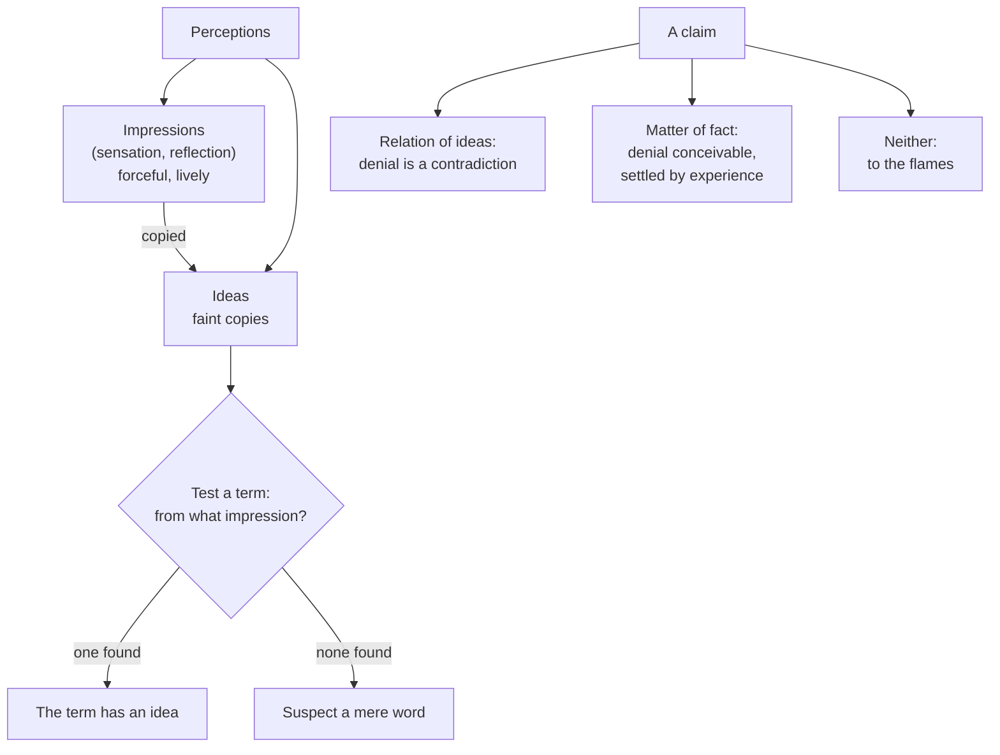

# Modern Philosophy · Lesson 4.1: Impressions, ideas and the fork

> ⏱ ~15 min · Module 4: Hume, and Reid's reply · Builds on: [3.1 Locke: against innate ideas](03-01-locke-against-innate-ideas.md), [3.4 Berkeley: immaterialism](03-04-berkeley-immaterialism.md) · Unlocks: [4.2 Causation and necessary connection](04-02-causation-and-necessary-connection.md), [4.3 Induction and the sceptical solution](04-03-induction-and-the-sceptical-solution.md)

## Why this matters

Locke said all our materials come from experience; Berkeley turned that against matter. David Hume (1711–1776) turned it into two **tests**. The first asks of any term: what experience is its idea copied from? The second asks of any claim: is it known by thought alone, or by experience? Every argument in this module (about causation, induction and the self) is these two tests applied to a cherished idea. This lesson builds the tools. The *Treatise of Human Nature* (Book I, 1739) states them first; the *Enquiry Concerning Human Understanding* (1748) states them more sharply. We read both.

## The idea

Touch a hot stove, then, an hour later, remember touching it. Both are **perceptions**, Hume's word for anything present to the mind. They differ in how hard they hit. The touching is an **impression**: forceful, lively. The memory is an **idea**: a fainter copy. The same contrast runs through feeling and thinking about anger, love or desire ([impressions and ideas](../reference.md#impressions-and-ideas)). Impressions come from sensation and from reflection, that is, from the passions and other inner feelings.

Now notice two things. First, every **simple** idea (the red of this apple, the bitterness of coffee) seems to have arrived after a matching impression, never before. Second, complex ideas, such as a golden mountain, are built by the imagination from simple ones it already has. Put together: every idea is copied from impressions or assembled from copies. That is the **[copy principle](../reference.md#copy-principle)**, and Hume turns it into a weapon. When a philosopher uses a grand term (*substance*, *power*, *the self*), ask from which impression the idea came. If none can be found, suspect there is no idea there at all, only a word.

The second tool sorts claims rather than terms ([Hume's fork](../reference.md#humes-fork)). Some claims, like those of arithmetic, are **relations of ideas**: you can know them by thought alone, and denying them is a contradiction. Everything else is a **matter of fact**: its denial is perfectly conceivable, so only experience can settle it. A claim supported by neither kind of reasoning has no support at all.

Between the tools sits a piece of psychology. Ideas do not drift at random. They follow three principles of **[association](../reference.md#association-of-ideas)**: resemblance (a picture leads you to the original), contiguity (one room of a house to the next) and cause and effect (a wound to the pain). In the *Treatise* (I.i.4) Hume likens association to a kind of attraction in the mental world, a nod to Newton. It is a claim about how the mind moves, not about what justifies belief.

## Source

Hume, *Enquiry* §II, paragraph 17 (Selby-Bigge numbering; Project Gutenberg text). Hume has just argued for the copy principle and conceded one exception (the [missing shade of blue](../reference.md#missing-shade-of-blue), P2).

> All ideas, especially abstract ones, are naturally faint and obscure: the mind has but a slender hold of them: they are apt to be confounded with other resembling ideas; and when we have often employed any term, though without a distinct meaning, we are apt to imagine it has a determinate idea annexed to it. On the contrary, all impressions, that is, all sensations, either outward or inward, are strong and vivid: the limits between them are more exactly determined: nor is it easy to fall into any error or mistake with regard to them. When we entertain, therefore, any suspicion that a philosophical term is employed without any meaning or idea (as is but too frequent), we need but enquire, *from what impression is that supposed idea derived?* And if it be impossible to assign any, this will serve to confirm our suspicion.

Three things to notice. The test runs on the *difference in vivacity*: ideas are vague, impressions sharp, so trace the vague back to the sharp. The target is "a philosophical term", the vocabulary of metaphysics, not ordinary speech. And the verdict is modest: failure to find an impression "will serve to confirm our suspicion". The test does not prove meaninglessness. It shifts a burden onto whoever uses the term.

## The argument

**A. The copy principle and the test** (*Treatise* I.i.1; *Enquiry* §II).

1. **All perceptions are impressions or ideas, which differ in force and vivacity.** *In words:* feeling versus thinking, the original versus the copy.
2. **Every simple idea, in its first appearance, is derived from a simple impression which it resembles.** Hume's evidence is experimental: analyse any idea and you reach simple ideas copied from impressions; and a man born blind has no idea of colour.
3. **The imagination can only compound, transpose, enlarge or diminish what the senses and experience supply.** *In words:* invention is rearrangement.
4. **∴ Every idea is copied from impressions or built from such copies.** In the *Enquiry*'s words, "all our ideas or more feeble perceptions are copies of our impressions or more lively ones" (§13).
5. **A term means something only if an idea is annexed to it.**
6. **∴ For any suspect term, ask from what impression its idea comes; if none can be assigned, the term probably has no meaning.**

**B. The fork** (*Enquiry* §IV, Part I, paragraphs 20–21; §XII, Part III).

7. **All objects of human reason are relations of ideas or matters of fact.**
8. **Relations of ideas (geometry, algebra, arithmetic) are discoverable by thought alone, without dependence on anything existing in the universe** (§20), and their denial implies a contradiction.
9. **The contrary of every matter of fact is conceivable and implies no contradiction, so no matter of fact can be demonstrated.** Beyond present sense and memory, matters of fact are reached only through cause and effect, which is known by experience (§22).
10. **∴ A claim that rests on neither abstract reasoning about quantity and number nor experimental reasoning about fact has no rational support.** The last paragraph of the *Enquiry* draws the moral for libraries: of a volume of "divinity or school metaphysics" containing neither, "Commit it then to the flames: for it can contain nothing but sophistry and illusion" (§XII).

Part B is not new in kind. Leibniz had divided truths of reason from truths of fact (*Monadology* §33, [2.3](02-03-leibniz-sufficient-reason-and-monads.md)). What is Hume's is the use: with the copy principle beside it, the fork has teeth.

**Where the argument is weakest.** Two places. First, **premise 7, exhaustiveness.** Kant accepted the line between what is known by thought alone and what is known by experience, but denied that it coincides with the line between claims whose denial is contradictory and claims whose denial is not. "Every event has a cause" is, he argued, both necessary and not a mere relation of ideas: synthetic a priori ([5.1](05-01-the-critical-question.md)). If such claims exist, the fork has a third tine Hume did not see. Second, **premise 1, vivacity as the only difference.** Hume himself grants that in sleep, fever or madness ideas can approach impressions (*Treatise* I.i.1). Thomas Reid ([4.5](04-05-reid-common-sense-against-the-way-of-ideas.md)) went further: perceiving a tree and imagining one differ in kind, since one involves belief in a present object and the other does not, so a theory that grades them by liveliness has misdescribed the mind from the start. A defender of Hume replies that Reid's "belief" is just the extra force and vivacity under another name, which is Hume's own account of belief ([4.3](04-03-induction-and-the-sceptical-solution.md)).

## The picture

*Alt text: two sorting diagrams. Perceptions divide into impressions and ideas, ideas are copied from impressions, and the copy test asks of a term which impression its idea comes from, ending either in a genuine idea or a suspected mere word. Separately, a claim is a relation of ideas, a matter of fact, or neither, and the last goes to the flames.*

## Worked examples

**Example 1 (clean: the idea of God, run through the test).** Hume picks this case himself (*Enquiry* §14). The idea of an infinitely intelligent, wise and good Being passes: we find intelligence, wisdom and goodness by reflecting on our own minds, then augment them without limit. Every ingredient is copied from an impression of reflection; only the enlarging is the mind's work (premise 3). Set beside Descartes in Meditation III ([1.3](01-03-god-clear-and-distinct-ideas-and-the-circle.md)), this exposes a clean **crux**. Descartes argued that the idea of the infinite cannot be built by enlarging the finite, because I recognize myself as finite and imperfect only by comparison with an idea of the infinite I already have; so that idea is prior, and only an infinite cause could put it in me ([trademark argument](../reference.md#trademark-argument)). Hume's premise 3 says enlarging the finite is enough. The two cannot both be right about where the idea of infinity comes from. Notice also that the word "idea" is not shared: for Descartes an idea is any thought that is, as it were, an image of a thing, including thoughts never derived from sense; for Hume it is by definition a faint copy.

**Example 2 (hard: run the tests on themselves).** Where does premise 4 sit on the fork? Its denial is not a contradiction: a mind that framed a simple idea with no prior impression is perfectly conceivable, and Hume concedes such a case occurs (the missing shade). And he argues for it experimentally, by survey and by the blind man. So it is a **matter of fact**, an empirical generalization about human minds. That has a cost and a payoff. The cost: the test cannot settle any dispute *a priori*. Someone who insists their idea of substance is an exception has made a factual claim, and Hume can only answer "produce the impression", which is exactly the burden-shifting form of the Source passage. The payoff: Hume never claimed otherwise. The *Treatise* is subtitled an attempt to introduce the experimental method of reasoning into moral subjects, and the copy principle is offered as its first finding, not as an axiom. What about premise 7, the fork itself? It is harder to place, neither text says where it sits, and critics since Kant have pressed exactly there.

## Watch out

- **You might think Hume's "idea" is Locke's or Descartes's, but** it is narrower than both. Locke used "idea" for anything the understanding is occupied with when it thinks (*Essay* I.i.8), sensations included. Hume says he restores "the word, idea, to its original sense, from which Mr Locke had perverted it" (*Treatise* I.i.1, note). Locke's idea of sensation is Hume's impression. Reconstructing a Humean argument with Locke's "idea" in it is a misreading.
- **You might think "Hume's fork" is Hume's phrase, but** it is a later label; the word "fork" appears nowhere in him. The *Treatise* draws the line differently, by sorting seven "philosophical relations" into those that depend entirely on the ideas compared and those that do not (I.iii.1). The tidy two-tine version is the *Enquiry*'s.
- **You might think the flames paragraph is 1930s verificationism, but** that is an [anachronism](../reference.md#anachronism) to be argued, not assumed. A. J. Ayer's *Language, Truth and Logic* (1936) claimed Hume as its ancestor, and the family resemblance is real: two sources of knowledge, and metaphysics shown the door. But Hume's paragraph sorts *kinds of reasoning* in a book, and its verdict is "sophistry and illusion", not "meaningless sentences". His meaning test is a separate claim about where ideas come from. Problem 3 asks you to draw the line.

## One-liner

> Every idea is a fainter copy of an impression, and every claim is either a relation of ideas or a matter of fact: ask of any term "from what impression?" and of any claim "by which kind of reasoning?", and a good deal of metaphysics has no answer to give.

## Problems

**P1 (🟢) *(Exegetical.)*** Apply the tests. For each invented claim, say whether it is a relation of ideas or a matter of fact, or whether it fails the copy test, with Hume's reason, one sentence each.

> (i) "Seven times eight is fifty-six."
> (ii) "The ice on this pond will bear my weight."
> (iii) "There is a colour called *ulterine*, unlike any shade of any colour anyone has seen."
> (iv) "Every body has a substantial form, distinct from all its sensible qualities, which makes it the kind of thing it is."

(a) Classify (i)–(iv). (b) Could the missing shade of blue rescue (iii)? Two sentences.

**P2 (🟡) *(Exegetical (a) · Evaluative (b).)*** Close reading. Hume, *Enquiry* §II, paragraph 16 (Selby-Bigge; abridged):

> There is, however, one contradictory phenomenon [...]. Suppose, therefore, a person to have enjoyed his sight for thirty years, and to have become perfectly acquainted with colours of all kinds except one particular shade of blue [...]. Let all the different shades of that colour, except that single one, be placed before him [...]; it is plain that he will perceive a blank, where that shade is wanting [...]. Now I ask, whether it be possible for him, from his own imagination, to supply this deficiency [...]? I believe there are few but will be of opinion that he can: and this may serve as a proof that the simple ideas are not always, in every instance, derived from the correspondent impressions; though this instance is so singular, that it is scarcely worth our observing, and does not merit that for it alone we should alter our general maxim.

(a) Does Hume treat the case as a genuine counterexample to the copy principle, or as only an apparent one? Quote the words that decide it, and say what he then does with the principle. Two sentences. (b) In paragraph 17 (the Source) the same principle becomes a test for empty philosophical terms. Does the conceded exception weaken that test? Any verdict; 100 words or fewer.

**P3 (🔴, optional) *(Exegetical.)*** Diagnose. An invented study-guide note:

> "Hume's fork is the verification principle in eighteenth-century dress. Every meaningful sentence is either analytic, true by the definitions of its words, or empirically verifiable, and every other sentence is literally meaningless. That is why Hume sends books of divinity to the flames: theology, ethics and aesthetics are nonsense."

Read it against *Enquiry* §XII, Part III (Selby-Bigge §132, abridged):

> Divinity or Theology [...] is composed partly of reasonings concerning particular, partly concerning general facts. It has a foundation in *reason*, so far as it is supported by experience. But its best and most solid foundation is *faith* and divine revelation.
>
> Morals and criticism are not so properly objects of the understanding as of taste and sentiment. Beauty, whether moral or natural, is felt, more properly than perceived. [...]
>
> When we run over libraries, persuaded of these principles, what havoc must we make? If we take in our hand any volume; of divinity or school metaphysics, for instance; let us ask, *Does it contain any abstract reasoning concerning quantity or number?* No. *Does it contain any experimental reasoning concerning matter of fact and existence?* No. Commit it then to the flames: for it can contain nothing but sophistry and illusion.

(a) Name one thing the note gets right. (b) Name three places where it imports something the text does not say, citing the words that show it. 150 words or fewer in all.

Solutions

**P1** *(Exegetical, strict.)*

**Must hit, strict (a):**

- (i) **Relation of ideas:** arithmetic, knowable by thought alone, and its denial is a contradiction.
- (ii) **Matter of fact:** its denial (the ice breaks) is perfectly conceivable, so only experience of ice, through cause and effect, can support it.
- (iii) **Fails the copy test:** "ulterine" is stipulated to be unlike anything seen, so no impression can be assigned and no idea is annexed to the word.
- (iv) **Fails the copy test**, and on the fork it is neither: something "distinct from all its sensible qualities" can have been given in no impression of sensation, and the claim rests neither on reasoning about quantity nor on experiment. It is the "school metaphysics" the flames paragraph names.

**Must hit, strict (b):** no. The missing shade is supplied from impressions of its neighbours in a graded series. Ulterine is stipulated to resemble no shade anyone has seen, so there is nothing to interpolate from.

**Wrong turns:** calling (ii) a failure of the tests. The fork sorts claims; it does not condemn matters of fact, which are most of what we know. Saying Hume holds there can be no such colour as ulterine. He allows that other beings may have senses "of which we can have no conception" (§15). What fails is the claim to have an *idea* of it.

**Model answer:** (a) (i) Relation of ideas, since its denial is a contradiction. (ii) Matter of fact, since its denial is conceivable, so only experience can settle it. (iii) Fails the copy test: no impression can be assigned to "ulterine". (iv) Fails the copy test and is neither tine: no impression shows a form distinct from all sensible qualities, and the claim rests on neither demonstration nor experiment. (b) No. The missing shade is filled in from the impressions on either side of it; ulterine has no neighbours.

---

**P2** *(Exegetical (a) · Evaluative (b).)*

**Must hit, strict (a):**

- **Genuine.** "One contradictory phenomenon" and "this may serve as a proof that the simple ideas are not always, in every instance, derived from the correspondent impressions" concede a real exception to the claim about *simple* ideas.
- **What he does:** he keeps the principle as a "general maxim" because the case is "so singular". He treats it as an empirical generalization that tolerates a rare exception, not as a law that one case refutes.

**Must hit, any verdict (b):**

- State how the test works: it challenges a term's user to "assign" an impression, and it only confirms a suspicion.
- State what the exception shows: the imagination can produce a simple idea that no impression of its own preceded.
- Decide, with a reason. Either the exception is bounded (it needs neighbouring impressions in a graded series, so a term with no such neighbours still fails), or it is not (once one simple idea can arise without its impression, the test's user cannot rule out that a metaphysician's idea of power or of the infinite is another, and the test becomes a demand rather than a proof).

**Wrong turns:** (a) saying Hume explains the case away as a complex idea or a blend. That is a later defence of Hume, not what the text says; the text says simple ideas. Saying he gives the principle up.

**Model answer (b), one of several:** Only slightly. The test never claimed proof: it asks the user of a term to assign an impression and, failing that, "confirms our suspicion". The exception shows that the imagination can fill a gap between impressions it already has. So the right reading of the test is "from what impressions, or from what neighbours of impressions?" A Cartesian idea of infinite substance has no neighbours of that kind in a graded series. The exception therefore leaves the test working against the targets Hume cares about, though it confirms that the test is empirical, not a priori.

---

**P3** *(Exegetical, strict.)*

**Must hit, strict (a):** one of: the two-way sort (abstract reasoning about quantity or number, experimental reasoning about matter of fact) matches the verificationist's two classes of legitimate claim; or the paragraph is used, as theirs was, to dismiss metaphysics wholesale.

**Must hit, strict (b), three of:**

- **Sentences and meaning vs reasoning in a book.** Hume asks whether a volume "contain[s] any ... reasoning", and the verdict is "sophistry and illusion". That says its arguments fail, not that its sentences are meaningless. Hume's meaning test is the separate copy principle, a claim about the origin of ideas, not about conditions of verification.
- **"True by the definitions of its words."** Hume's relations of ideas are truths about quantity and number, discovered by thought alone through comparing ideas (§20). The thesis that such truths hold by the meanings of words is a twentieth-century one.
- **Theology is not nonsense.** Divinity "has a foundation in reason, so far as it is supported by experience", and its best foundation is "faith and divine revelation". Only the volume with neither kind of reasoning burns.
- **Ethics and aesthetics are not flamed.** "Morals and criticism" are "objects ... of taste and sentiment", moved to another faculty, not dismissed.

**Wrong turns:** saying the note is right that the flames paragraph is a meaning criterion. Hume's word is "sophistry", which is a charge about arguments. Counting "Hume's fork" as Hume's phrase.

**Model answer:** (a) Right: Hume does sort reasoning into abstract reasoning about quantity and number and experimental reasoning about fact, and uses the sort against metaphysics. (b) First, the test is whether a volume "contain[s] any ... reasoning", and the verdict is "sophistry and illusion", a charge against its arguments, not a claim that its sentences lack meaning; Hume's meaning test is the copy principle. Second, "true by definition" is not Hume: relations of ideas are discovered by thought comparing ideas. Third, theology and ethics survive. Divinity rests on experience and, best, on "faith and divine revelation", and morals and criticism belong to "taste and sentiment".

## Flashback

**From Lesson [3.3](03-03-locke-personal-identity.md) (Locke: personal identity):** *(Diagnose.)* An invented forum post:

> "Locke's theory in one line: you are your memories. A person is a chain of remembered experiences, which makes Locke the first psychological-continuity theorist. He is right that one person could be carried by a succession of different thinking substances. But by the same token the *man* must change whenever his matter does, so after enough years of eating and growing, a Lockean man is literally a new man. And since memory does all the work, Locke has no use for a soul: the chapter is a quiet case for materialism."

(a) Name three errors. For each, say what Locke holds and cite the section of *Essay* II.xxvii (standard numbering) that shows it. One sentence each. (b) One sentence of the post is accurate. Which?

Solution

**Accept:** any three of the four errors below, each with what Locke holds and a section.

**Must hit, strict (a):**

- **"You are your memories."** Locke's word in the definition and the key sentences is *consciousness* (§§9–10): the reflexive awareness that comes with all thinking (II.i.19), which can extend to actions "past or to come" (§10). The memory criterion is Reid's reading of Locke.
- **"Psychological-continuity theorist", "chain".** This is an anachronism. That theory is a twentieth-century repair built on overlapping chains of connections, and Locke's criterion is direct consciousness of the act.
- **"The man must change whenever his matter does."** The same man is one continued life of one organized body, through "constantly fleeting particles" (§6). It is the *mass* whose identity follows its particles (§3).
- **"No use for a soul", "materialism".** Locke calls it "the more probable opinion" that consciousness is annexed to one immaterial substance (§25). His claim is only that personal identity does not *consist* in that (§10: which substance "matters not at all").

**Must hit, strict (b):**

- The succession sentence. Personal identity holds "whether it be annexed solely to one individual substance, or can be continued in a succession of several substances" (§10).

**Wrong turns:** flagging the succession sentence as an error. Locke allows the possibility (§10), though he thinks a single immaterial substance more probable (§25). Correcting "you are your memories" with "you are your soul". That is the Cartesian answer Locke rejects, since identity is relative to the idea and "person" is not "substance" (§7).

**Model answer:** (a) First, Locke defines the person by consciousness, not memory (§§9–10), and that consciousness reaches actions "past or to come"; the memory criterion is Reid's reading. Second, the same man is one continued life in an organized body whose particles keep changing (§6), so eating and growing do not make a new man. Third, Locke thinks it "the more probable opinion" that consciousness belongs to one immaterial substance (§25); he denies only that personal identity consists in it. (b) The sentence that one person could be carried by a succession of substances (§10).

## Connections

- **Backward:** Locke's "ideas of sensation and reflection" ([3.1](03-01-locke-against-innate-ideas.md)) become Hume's impressions of sensation and reflection, and the *Enquiry*'s note to §17 recasts the innate-ideas dispute as the question whether ideas copy impressions. Berkeley's turning of Lockean premises against Locke ([3.4](03-04-berkeley-immaterialism.md)) is the model for Hume's use of the copy principle against his predecessors' terms. The crux with Descartes's trademark argument is from [1.3](01-03-god-clear-and-distinct-ideas-and-the-circle.md). Reconstructing in the author's own terms is [`philosophical-method` 1.3](../../philosophical-method/lessons/01-03-reconstruction-and-charity.md).
- **Forward:** [4.2](04-02-causation-and-necessary-connection.md) runs the copy test on the idea of necessary connection. [4.3](04-03-induction-and-the-sceptical-solution.md) runs the fork on inference from experience (*Enquiry* §IV, Part II). [4.4](04-04-the-self-belief-and-the-passions.md) runs the copy test on the self. Reid's attack on the whole "way of ideas" is [4.5](04-05-reid-common-sense-against-the-way-of-ideas.md), and Kant's third tine is [5.1](05-01-the-critical-question.md).
- **Sideways:** the fork as a live epistemological distinction, and its relation to the a priori, is [`epistemology` 4.1](../../epistemology/lessons/04-01-a-priori-knowledge.md) and [4.2](../../epistemology/lessons/04-02-humes-problem-of-induction.md). The copy principle as a weapon against causal powers, assessed as metaphysics, is [`metaphysics` 4.1](../../metaphysics/lessons/04-01-humes-challenge-and-the-regularity-theory.md). Whether the verification principle refutes itself is a stock example of self-defeat in [`philosophical-method` 4.1](../../philosophical-method/lessons/04-01-objections-and-replies.md); whether there are meaningless sentences at all belongs to [`philosophy-of-language-and-logic`](../../philosophy-of-language-and-logic/syllabus.md).
