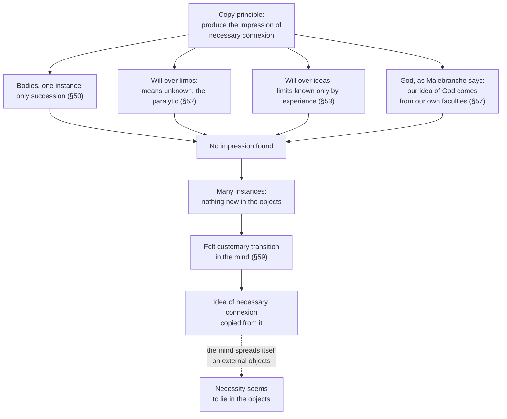

# Modern Philosophy · Lesson 4.2: Causation and necessary connection

> ⏱ ~15 min · Module 4: Hume, and Reid's reply · Builds on: [4.1 Impressions, ideas and the fork](04-01-impressions-ideas-and-the-fork.md), [2.4 The problem they left](02-04-interaction-and-causation.md) · Unlocks: [4.3 Induction and the sceptical solution](04-03-induction-and-the-sceptical-solution.md), [5.5 The Second Analogy](05-05-the-second-analogy.md)

## Why this matters

Descartes proved God with a causal principle, Malebranche gave all real causation to God, and Berkeley gave it to spirits. David Hume (1711–1776) asks the prior question: what do we even *mean* by the necessity that is supposed to bind a cause to its effect? His answer, in *A Treatise of Human Nature* Book I (1739) and the *Enquiry concerning Human Understanding* (1748) §7, moves that necessity out of the world and into the mind. Kant credited Hume with waking him from dogmatic metaphysics ([5.1](05-01-the-critical-question.md)), and his Second Analogy ([5.5](05-05-the-second-analogy.md)) replies to this argument. Whether causation *is* regularity or power is argued live in [`metaphysics` 4.1](../../metaphysics/lessons/04-01-humes-challenge-and-the-regularity-theory.md). Here: what Hume argued inside his system, and what he meant.

## The idea

Lesson [4.1](04-01-impressions-ideas-and-the-fork.md) gave Hume a test for obscure ideas: find the impression the idea was copied from (the [copy principle](../reference.md#copy-principle)). He now runs it on cause. The cause is contiguous with its effect, or linked by a chain of contiguous things, and it comes first. Is that all? *Treatise* I.iii.2:

> "An object may be contiguous and prior to another, without being considered as its cause. There is a NECESSARY CONNEXION to be taken into consideration."

So where is the impression of [necessary connexion](../reference.md#necessary-connection)? Hume searches every place it could come from. He tries the outward senses watching bodies, inward consciousness of the will moving a limb, the will calling up an idea, and the Cartesians' last resort, God. Each search comes back empty. In the *Enquiry*'s words, "One event follows another; but we never can observe any tie between them. They seem *conjoined*, but never *connected*" (§58).

Something does change after many repetitions, but not in the objects. After the thousandth collision of billiard balls, the mind slides from the sight of the first ball's motion to the expectation of the second, and it *feels* that slide. That feeling is the impression. The idea of necessity is copied from it, and then, by the mind's "great propensity to spread itself on external objects" (*Treatise* I.iii.14), it is read back into the balls. Hume's own comparison is the way we locate sounds and smells *in* the visible objects they accompany.

## Source

Hume, *Enquiry* §7 Part II, §59 (Selby-Bigge numbering, Project Gutenberg text). Part I has just failed to find the impression in any single instance.

> It appears, then, that this idea of a necessary connexion among events arises from a number of similar instances which occur of the constant conjunction of these events; nor can that idea ever be suggested by any one of these instances, surveyed in all possible lights and positions. But there is nothing in a number of instances, different from every single instance, which is supposed to be exactly similar; except only, that after a repetition of similar instances, the mind is carried by habit, upon the appearance of one event, to expect its usual attendant, and to believe that it will exist. This connexion, therefore, which we *feel* in the mind, this customary transition of the imagination from one object to its usual attendant, is the sentiment or impression from which we form the idea of power or necessary connexion. Nothing farther is in the case.

Three things to notice. It is a difference test: many instances yield the idea and one does not, yet the instances are exactly alike, so the source is whatever else differs. "Sentiment or impression" makes the source an *impression of reflection*, something felt inwardly, not seen. And the passage is about where the *idea* comes from. Whether anything in objects answers to it is a further question, and readers divide over it.

## The argument

Hume's search, in his terms (*Enquiry* §§49–61; *Treatise* I.iii.2 and I.iii.14).

1. **Every idea is copied from a preceding impression of sensation or reflection** (§49). *In words:* to fix what a word means, produce the impression behind it.
2. **We have an idea of necessary connexion, which "power", "force" and "energy" also name.** In the *Treatise* he treats these words as near-synonyms, so none can define the others.
3. **No single instance of body acting on body gives the impression** (§50). We see only one motion following another. If we perceived the power, we could predict the effect at first sight, without experience, and we cannot.
4. **The will's command over the limbs gives none** (§52). The union of soul and body is wholly mysterious. We move the tongue but not the heart, and only experience tells us which. A man newly paralysed feels the same will to move his arm as a healthy man, yet nothing moves. And anatomy shows the will's immediate effect is in muscles, nerves and animal spirits we know nothing of.
5. **The will's command over ideas gives none** (§53). We know neither the nature of the soul nor how an idea is produced. This command has limits we learn only by experience, and it varies with health and with the time of day.
6. **Appeal to God gives none** (§57; *Treatise* I.iii.14). Our idea of God is built from reflection on our own faculties, so it inherits the same ignorance.
7. **Many instances differ from one only in the habit they produce** (§59). *In words:* repetition changes nothing in the objects, only the observer.
8. **∴ The impression is the felt, customary transition of the mind, and the idea of necessary connexion is copied from it** (§59, §61).
9. **∴ Necessity, as far as we have any idea of it, belongs to the mind's determination, and we project it onto objects** (*Treatise* I.iii.14).

From this Hume draws [two definitions of cause](../reference.md#two-definitions-of-cause) (§60; *Treatise* I.iii.14). (D1) A cause is an object followed by another, where all objects similar to the first are followed by objects similar to the second: this is [constant conjunction](../reference.md#constant-conjunction). (D2) A cause is an object followed by another, whose appearance always conveys the thought to that other: this is [custom](../reference.md#custom-or-habit). In the *Treatise* he says the two present the same object in two views, as a *philosophical* relation (a comparison of ideas) and as a *natural* relation (an association). Whether they are really equivalent, and which comes first, is still disputed. Their close reading belongs to [`metaphysics`](../../metaphysics/lessons/04-01-humes-challenge-and-the-regularity-theory.md) Boss 4.

**The source and the crux.** A footnote in *Treatise* I.iii.14 sends the reader to Malebranche (*Search* Book VI, Part II, ch. 3), where the argument behind step 3 is made ([2.4](02-04-interaction-and-causation.md)). Both assume that to find a [true cause](../reference.md#true-cause) would be to perceive a necessary connexion between it and its effect, and both find none in bodies. The crux is step 6. Malebranche holds that we do perceive necessary connexion between God's will and its effects. Hume denies we perceive it anywhere, even there.

**Where the argument is weakest.** The weak point is step 8: how can a *feeling* be the impression of *necessity*? The felt transition is just one more thing that happens after another. Hume admits that the link among our own perceptions is as unintelligible as the link among bodies (*Treatise* I.iii.14). So it is hard to see how copying that feeling gives an idea whose content is "must". The gap is discussed in Barry Stroud's *Hume* (1977). Reid ([4.5](04-05-reid-common-sense-against-the-way-of-ideas.md)) attacks step 4. He holds that we have a notion of active power from our own exertions, even though no image copies it. Kant ([5.5](05-05-the-second-analogy.md)) attacks the outcome: habit can give only a subjective necessity, and that cannot explain experience of an objective order. The defender's reply is that Hume is not claiming the feeling *represents* a tie. His claim is that the only content "necessity" can have is that determination of the mind.

## The search

The dashed edge is the projection that makes necessity *look* like a feature of the world.

## Worked examples

**Example 1 (clean: the lamp switch).** You flick a switch and the lamp lights. Run the search. The switch and the lamp are not contiguous, but Hume allows a chain of contiguous causes (*Treatise* I.iii.2): wire, current, filament. The flick comes first. Any one flick shows a click, then light, and no tie. Look inward at your will moving your finger. Step 4 applies: you cannot say how a volition moves a finger, and someone with a numbed hand wills just as hard. Now flick it ten thousand times. Each flick is like the first; what has changed is you: at the click, your mind passes to the light before it comes. D1 holds (flicks like this are followed by light like this). D2 holds (the click carries your thought to the light). If the bulb fails, your surprise is a sign of that transition, not of anything you ever saw in the switch.

**Example 2 (hard: what did Hume believe was out there?).** Steps 8–9 settle where the *idea* comes from, not plainly whether Hume thought objects *contain* anything beyond regular succession (the [New Hume](../reference.md#new-hume) dispute).

- **The traditional (projectivist) reading.** For Hume, causal necessity simply *is* the mind's determination, projected. Talk of a further necessity in objects is not false but empty. Kenneth Winkler's "The New Hume" (1991) defends this reading, and Simon Blackburn's projectivism builds on it. The evidence: necessity "exists in the mind, not in objects" (I.iii.14); wishing to know a tie in the external object leads us to "contradict ourselves, or talk without a meaning" (I.iv.7); and §60: "We have no idea of this connexion, nor even any distinct notion what it is we desire to know, when we endeavour at a conception of it."
- **The New Hume (sceptical realist reading).** Hume believed in real powers in objects. What he denied is that we can form any positive idea of them. This is John Wright's reading in *The Sceptical Realism of David Hume* (1983) and Galen Strawson's in *The Secret Connexion* (1989). The evidence: the *Enquiry*'s steady talk of "secret powers" and of powers "wholly unknown to us" (§§29, 32, 44), the "ultimate connexion of causes and effects" that reason fails to discover (I.iii.6), and the "relative idea" by which we can *suppose* what we cannot conceive (I.ii.6). Above all there is *Treatise* I.iii.14, where Hume says "there may be several qualities both in material and immaterial objects, with which we are utterly unacquainted; and if we please to call these POWER or EFFICACY, it will be of little consequence to the world."

What the words settle: the traditional reader must explain why Hume keeps referring to unknown powers; the New Humean, why he calls the wish to know such a power self-contradictory or meaningless. Both sets of passages are there, and the text alone does not say which governs the other.

## Watch out

- **You might think Hume denies that anything causes anything, but actually** he reasons causally on every page. He also grants that contiguity, succession and regular conjunction hold independently of the understanding and before it operates (I.iii.14). What he denies is that we have any idea of necessity as a quality of bodies.
- **Anachronism: "Hume's regularity theory" and "Humean supervenience."** These are twentieth-century labels. Modern regularity theories descend from D1 alone, and "Humean supervenience" is David Lewis's term. Hume's own account always includes D2, the mind's determination. "Projectivism" is also a modern gloss on his phrase about the mind spreading itself on objects. Use it, but name it as a gloss.

## One-liner

> Hume looked for the impression of necessary connexion in bodies, in the will and in God and found it nowhere, except in the mind's felt habit of passing from cause to effect. Whether he thought anything in objects answered to that feeling is the New Hume dispute.

## Problems

**P1 (🟢) *(Exegetical.)*** Close reading. Hume, *Treatise* I.iii.14 (Selby-Bigge text, Project Gutenberg).

> The idea of necessity arises from some impression. There is no impression conveyed by our senses, which can give rise to that idea. It must, therefore, be derived from some internal impression, or impression of reflection. There is no internal impression, which has any relation to the present business, but that propensity, which custom produces, to pass from an object to the idea of its usual attendant. This therefore is the essence of necessity. Upon the whole, necessity is something, that exists in the mind, not in objects; nor is it possible for us ever to form the most distant idea of it, considered as a quality in bodies. Either we have no idea of necessity, or necessity is nothing but that determination of the thought to pass from causes to effects, and from effects to causes, according to their experienced union.

(a) Which reading in Example 2 do these words most directly support, and which words show it? (b) What in the passage leaves room for the other reading? Two sentences per part.

**P2 (🟡) *(Exegetical.)*** Find the crux. The traditional reader and the New Humean both accept the copy principle and steps 1–8 of the argument. Name the single premise about Hume's theory of ideas that one side affirms and the other denies, give one passage each side cites for it, and say what would move each side. 150 words or fewer.

**P3 (🔴, optional) *(Exegetical (a) · Evaluative (b).)*** Apply to a hard case (invented). An engineer at a polar station cools a sample of a newly made alloy in liquid nitrogen. She runs the test once, with care, after removing every other variable. The sample shatters. She says at once: "It *had* to shatter. The cold made it." (a) According to *Enquiry* §59 she has seen only one instance. Does Hume's account explain her "had to"? Use what the *Treatise* (I.iii.8) says about a single experiment made "with judgment". (b) Does that answer fit the claim in §61 that the idea of connexion arises only from "a number of similar instances"? Any verdict. 150 words or fewer for (b).

Solutions

**P1** *(Exegetical, strict.)*

**Must hit, strict (a):**

- On its face the passage supports the **traditional (projectivist)** reading.
- The deciding words: necessity "exists in the mind, not in objects", and the custom-produced propensity "is the essence of necessity". That is a claim about where necessity is located, not only about where its idea comes from.

**Must hit, strict (b):**

- Every claim is tied to our *ideas*: "nor is it possible for us ever to form the most distant idea of it, considered as a quality in bodies", and "Either we have no idea of necessity, or...".
- So a New Humean can read the passage as fixing what our *concept* of necessity can contain. On that reading it leaves open unknown qualities in objects, which Hume allows later in the same section.

**Wrong turns:** saying the passage plainly settles the dispute either way. Reading "Either we have no idea of necessity" as Hume saying we in fact have none: it is the first horn of a dilemma, and he takes the second.

**Model answer:** (a) The traditional reading. Hume does not just say the idea comes from custom; he says the custom-produced propensity "is the essence of necessity" and that necessity "exists in the mind, not in objects". (b) The reasons he gives are all about what we can form an idea of ("the most distant idea", "Either we have no idea..., or"). So a New Humean can take the passage as limiting our concept, not as denying unknown powers in bodies.

---

**P2** *(Exegetical, strict on the premise.)*

**Must hit, strict:**

- The premise: **for Hume, can we intelligibly suppose or refer to something in objects of which we have no impression-derived positive idea?** The New Humean says yes: a "relative idea" lets us suppose what we cannot conceive. The traditional reader says no: words with no idea behind them are empty.
- New Hume evidence: the relative idea of external objects (*Treatise* I.ii.6), "secret powers" (*Enquiry* §§29, 32), and "several qualities ... with which we are utterly unacquainted" (I.iii.14).
- Traditional evidence: "contradict ourselves, or talk without a meaning" (I.iv.7), or "nor even any distinct notion what it is we desire to know" (§60).
- What would move each side. The traditional reader would be moved by a passage where Hume uses a relative idea for *necessity* itself, not just for unknown qualities. The New Humean would be moved by a showing that "secret powers" means only unobserved sensible or structural qualities, with no necessity in them.

**Wrong turns:** naming the copy principle as the crux, since both sides accept it. Treating "does Hume believe in causes?" as the crux, since both readings say he does.

**Model answer:** Both sides accept that every positive idea is copied from an impression. They split on whether Hume lets us *suppose* what we cannot *conceive*. The New Humean points to the relative idea of external objects (I.ii.6) and to Hume's talk of "secret powers" and of unknown qualities we may call power (I.iii.14). The traditional reader points to I.iv.7: wanting to know an external tie means we "contradict ourselves, or talk without a meaning". The traditional side would give ground if Hume ever applied a relative idea to necessity itself. The New Hume side would give ground if "secret powers" turned out to mean only unknown structure, which would give no necessity.

---

**P3** *(Exegetical (a) · Evaluative (b).)*

**Must hit, strict (a):**

- One instance alone gives only conjunction (§59). So her "had to" cannot come from a habit formed on *this* pair.
- *Treatise* I.iii.8: after one experiment made with judgment, the inference rests on a general principle established by "many millions" of experiences: that like objects in like circumstances produce like effects. That principle is itself habitual. The connexion "is not habitual after one experiment", but it falls under a principle that is.
- So her mind is carried from cold to shattering by that general custom, and her "had to" is the felt transition, projected onto the sample.

**Must hit, any verdict (b):**

- Separate *acquiring* the idea of necessity from *applying* it. The idea came from earlier repetitions, and the single case only borrows the transition.
- Say whether that fits §61 as written. That text says the idea arises from a number of instances. It does not say every application needs its own repetition. Or argue that the oblique route strains the difference test, because the impression is now present after one instance.

**Wrong turns:** answering (a) with "she has no idea of necessity here" and stopping, which ignores I.iii.8. Turning (b) into the problem of induction, which belongs to [4.3](04-03-induction-and-the-sceptical-solution.md).

**Model answer (b), one of several:** It fits, if we keep two questions apart. §61 explains how anyone first gets the idea of necessary connexion: only repetition could produce the felt transition it is copied from. The engineer already has that idea from a lifetime of conjunctions. In the polar test she only applies it. The general habit that like causes give like effects carries her mind from the cold to the shattering, as I.iii.8 says. The cost is that the difference test of §59 ("one instance" yields no idea) now holds only for a mind with no prior experience at all. That is a weaker claim than the billiard-ball examples suggest, but it is consistent with the text.

## Flashback

**From Lesson [3.4](03-04-berkeley-immaterialism.md) (Berkeley: immaterialism):** *(Close reading.)* Berkeley, *Principles* Part I, §31 and §32 (Gutenberg, the 1734 text; the editor's capitals omitted). Berkeley has just said that the ideas of sense come in a regular order, and that the rules of that order are called the laws of nature (§30).

> That food nourishes, sleep refreshes, and fire warms us; that to sow in the seed-time is the way to reap in the harvest [...]—all this we know, not by discovering any necessary connexion between our ideas, but only by the observation of the settled laws of nature [...].
>
> [...] For, when we perceive certain ideas of Sense constantly followed by other ideas and we know this is not of our own doing, we forthwith attribute power and agency to the ideas themselves, and make one the cause of another, than which nothing can be more absurd and unintelligible.

(a) Why, on Berkeley's premises, is it "absurd" to make one idea the cause of another? Name the section whose doctrine he relies on. (b) What, for Berkeley, does cause the heat you feel near a fire, and what work does "we know this is not of our own doing" do? (c) Does the passage deny that fire warms us? Two sentences per part.

Solution

**Must hit, strict (a):**

- Ideas are passive and inert (§25). An idea has nothing in it but what is perceived, and no power or activity is perceived in any idea, so no idea can produce or alter another.

**Must hit, strict (b):**

- Another spirit, God, whose will excites the ideas of sense in us. The laws of nature are the set rules by which he does so, learned by experience (§§29–30).
- "Not of our own doing" rules out my own will, which does cause my ideas of imagination (§28). That is §29's step to *another* will. The error §32 diagnoses is stopping at the ideas instead of going on to that spirit: it "sends them a wandering after second causes".

**Must hit, strict (c):**

- No. "All this we know": the regularity is real, known by observation, and it gives the foresight we live by (§31).
- What goes is power in the idea of fire. "Fire warms us" survives as a report of a settled law of nature.

**Wrong turns:** reading "not by discovering any necessary connexion" as the view that no necessary connexion or power exists anywhere. Berkeley puts real agency in spirits, which we know by a notion (§27). The further step, finding no more power in the will than in bodies, is Hume's in this lesson. Saying Berkeley denies causes altogether: spirits are causes, finite ones included (§28).

**Model answer:** (a) By §25 ideas are inert: there is nothing in an idea but what is perceived, and no power is perceived in any, so one idea cannot cause another. (b) God's will causes the heat, and the laws of nature are the settled rules by which he excites ideas of sense (§30). "Not of our own doing" excludes my will, so the regularity should point to another spirit, though we wrongly credit the ideas instead. (c) No: we really do know that fire warms us, by observing the settled laws, and that knowledge guides life (§31). What Berkeley removes is power in the fire-idea, not the regularity.

## Connections

- **Backward:** the test is the copy principle of [4.1](04-01-impressions-ideas-and-the-fork.md). The no-perceived-connexion argument is Malebranche's from [2.4](02-04-interaction-and-causation.md), with God taken out. Berkeley ([3.4](03-04-berkeley-immaterialism.md)) had argued that ideas are inert (*Principles* §25). He held that spirit is known by its effects (§27) and that he could raise ideas at will (§28). Hume's step 5 is aimed at that last claim. Reconstruction in a thinker's own terms is [`philosophical-method` 1.3](../../philosophical-method/lessons/01-03-reconstruction-and-charity.md). Naming a crux is [4.3](../../philosophical-method/lessons/04-03-finding-the-crux.md) there.
- **Forward:** [4.3](04-03-induction-and-the-sceptical-solution.md) shows that the same custom does the inferring, and asks whether that inference rests on reasoning. [4.4](04-04-the-self-belief-and-the-passions.md) runs the same kind of search on the self. Reid's notion of active power is in [4.5](04-05-reid-common-sense-against-the-way-of-ideas.md). Kant's reply, that causality is a condition of experiencing objective succession, is [5.5](05-05-the-second-analogy.md).
- **Sideways:** [`metaphysics` 4.1](../../metaphysics/lessons/04-01-humes-challenge-and-the-regularity-theory.md) turns D1 into the regularity theory and asks whether it is true. Its Boss 4 close-reads the two definitions. [`epistemology` 4.2](../../epistemology/lessons/04-02-humes-problem-of-induction.md) owns the §4 argument as a live problem. Causal explanation in science is [`philosophy-of-science`](../../philosophy-of-science/syllabus.md)'s. For physics readers: in a footnote to §57, Hume reads Newton's *vis inertiae* and gravity as names for observed effects, not insight into an active power, and notes that Newton offered an ethereal fluid only as a hypothesis.
