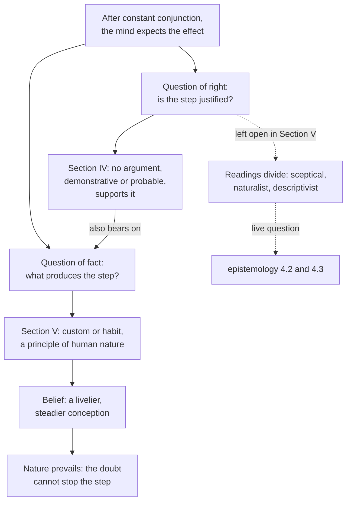

# Modern Philosophy · Lesson 4.3: Induction and the sceptical solution

> ⏱ ~15 min · Module 4: Hume, and Reid's reply · Builds on: [4.1 Impressions, ideas and the fork](04-01-impressions-ideas-and-the-fork.md), [4.2 Causation and necessary connection](04-02-causation-and-necessary-connection.md) · Unlocks: [5.1 The critical question](05-01-the-critical-question.md)

## Why this matters

Section IV of Hume's *Enquiry Concerning Human Understanding* (1748) ends in a doubt: when we expect heat from flame, no reasoning takes us there. Section V is titled "Sceptical Solution of these Doubts", and most misreadings of Hume come from forgetting it or misdescribing what it solves. Read with §V, §IV is the negative half of a positive theory of how minds work. Whether that theory leaves inference from experience justified, unjustified, or beyond the question is the dispute this lesson maps without settling. Whether induction *can* be justified belongs to [`epistemology`](../../epistemology/lessons/04-02-humes-problem-of-induction.md).

## The idea

Two questions hide in "why do you expect the bread to nourish you?"

- **The question of right:** what entitles you to expect it?
- **The question of fact:** what in you produces the expectation?

Section IV answers the first negatively, and in a form that also bears on the second: whatever produces the expectation, it is not an argument. Section V answers the second: the step is made by **[custom](../reference.md#custom-or-habit)**: repetition of a pairing (flame, then heat) builds a propensity to pass from one to the other, as practice carries a pianist's fingers on to the next bar. And the expectation it produces, **belief**, is not an extra idea added to the thought of heat. It is a livelier, steadier way of having that thought.

So the "solution" concedes the doubt, explains the practice it seemed to threaten, and reassures: the practice never rested on argument, so losing the argument cannot stop it.

**The doubt in one paragraph.** (Assessed as a live argument in [epistemology 4.2](../../epistemology/lessons/04-02-humes-problem-of-induction.md).) Every inference to unobserved matters of fact runs through cause and effect and supposes the [uniformity principle](../reference.md#uniformity-principle): that the future will resemble the past. By the [fork](../reference.md#humes-fork) of [4.1](04-01-impressions-ideas-and-the-fork.md), that principle could be supported only by demonstration or by probable reasoning. Not by demonstration, since its contrary is conceivable and so implies no contradiction (Hume's example: the sun's not rising tomorrow). Not by probable reasoning, since all such reasoning supposes the very principle in question. So "in all reasonings from experience, there is a step taken by the mind which is not supported by any argument or process of the understanding" (¶34, recapping §IV).

## Source

Hume, *Enquiry* §V Part I, ¶36 (Selby-Bigge numbering, Project Gutenberg). In ¶35 a man of the strongest reason, brought suddenly into the world, finds after long experience that he infers one object from another without reasoning; some other principle must determine him.

> This principle is Custom or Habit. For wherever the repetition of any particular act or operation produces a propensity to renew the same act or operation, without being impelled by any reasoning or process of the understanding, we always say, that this propensity is the effect of *Custom*. By employing that word, we pretend not to have given the ultimate reason of such a propensity. We only point out a principle of human nature, which is universally acknowledged, and which is well known by its effects. Perhaps we can push our enquiries no farther, or pretend to give the cause of this cause; but must rest contented with it as the ultimate principle, which we can assign, of all our conclusions from experience. [...] And it is certain we here advance a very intelligible proposition at least, if not a true one, when we assert that, after the constant conjunction of two objects—heat and flame, for instance, weight and solidity—we are determined by custom alone to expect the one from the appearance of the other.

Four things to notice. Custom is *defined* by the absence of reasoning, so it cannot be a covert argument. "Ultimate reason" means ultimate *cause*, as "cause of this cause" shows; no reason in the justifying sense is offered. "A principle of human nature" places the claim in the *Treatise*'s science of man. And "intelligible ... at least, if not a true one" marks an empirical hypothesis, modestly offered.

## The argument

The positive argument of §V (¶¶33–40), in Hume's terms ([impressions and ideas](../reference.md#impressions-and-ideas)); "reasoning" is a process of the understanding linking ideas.

1. **No argument or process of the understanding takes the mind from a present impression to the idea of its usual attendant.** (The conclusion of §IV.)
2. **Yet the mind makes that step uniformly: in philosophers, in peasants, in infants, in beasts** (¶33). The child burned by a candle keeps his hand from candles.
3. **If the mind is not engaged by argument to make the step, some other principle, of equal weight and authority, must induce it** (¶34). *In words:* a regular effect needs a cause, and reason has been ruled out.
4. **Where repetition produces a propensity to renew an act without reasoning, we call the propensity custom** (¶36).
5. **The step appears only after repetition.** From a thousand instances we infer what we cannot infer from one instance no different from them, and reason admits no such variation (¶36). *In words:* what one circle demonstrates holds of all circles; inference from experience grows with the count, as habits do.
6. **∴ All inferences from experience are effects of custom, not of reasoning** (¶36). Hence the slogan: "Custom, then, is the great guide of human life" (¶36).
7. **Belief differs from fiction not in its content but in its manner.** Hume calls it "nothing but a more vivid, lively, forcible, firm, steady conception of an object, than what the imagination alone is ever able to attain" (¶40). The *Treatise* (I.iii.7) had defined it as a lively idea related to a present impression. This is [belief as vivacity](../reference.md#belief-as-vivacity).
8. **∴ Belief in any unobserved matter of fact is the joint effect of a present impression and a customary conjunction**, as unavoidable as love on receiving a benefit, and something no reasoning can either produce or prevent (¶38). *In words:* the vivacity of the impression flows along the habitual path to the associated idea, and that borrowed vivacity *is* the believing.

What the solution **is**: an explanation (premises 2–8 answer the question of fact) plus a reason not to fear the doubt (argument cannot remove what argument did not install). What it **is not**: a premise that, added to "flame has always brought heat", makes "heat will follow" well supported. Custom does the uniformity principle's work *instead of* supplying it, which is why the solution is [sceptical](../reference.md#sceptical-solution).

**The readings.** How sceptical this is, readers dispute.

- **Sceptical (the traditional reading).** Reid and Beattie read Hume as showing that beliefs about the unobserved have no rational ground. Evidence: the title; ¶34's recap; the uniformity principle left unsupported.
- **Naturalist.** Norman Kemp Smith ("The Naturalism of Hume", 1905; *The Philosophy of David Hume*, 1941) and Barry Stroud (*Hume*, 1977): the negative argument clears ground for a science of human nature in which belief is fixed by instinct, not reason. Evidence: §V's positive programme; belief classed among natural instincts (¶38). Stroud stresses that the explanation is itself an empirical theory that vindicates nothing.
- **Descriptivist.** Don Garrett (*Cognition and Commitment in Hume's Philosophy*, 1997) and David Owen (*Hume's Reason*, 1999): "reason" in §IV names a faculty of inference through intermediate ideas, so the conclusion is about how the belief is produced, not a verdict that it is unjustified. Evidence: in §VI Hume still calls these inferences arguments from experience and ranks some as *proofs*.
- **Sceptical realist** (John Wright, *The Sceptical Realism of David Hume*, 1983; the "New Hume" of [4.2](04-02-causation-and-necessary-connection.md)): real but unknown powers govern nature, and custom stands in for insight into them. Evidence: ¶44, where nature's powers are wholly unknown, yet our ideas keep pace with them.

What the words settle: §V explains rather than justifies, and nowhere supplies the missing premise. What they leave open: whether §IV's "*not* founded on reasoning" (¶28) is itself a verdict on justification.

**Where the argument is weakest.** Two premises draw fire. Premise 7: Thomas Reid (*Inquiry into the Human Mind*, 1764, ch. II §5) asked about a man who firmly believes there is *no* future state. Is his idea of a future state lively or faint? If faint, firm belief goes with a faint idea; if lively, believing and disbelieving are one state. Belief, Reid concluded, is assent, not vivacity. Hume half-concedes: in ¶40 the feeling can be described, not perfectly explained. Premises 4–6: that custom produces the step is a matter-of-fact hypothesis, supported because it alone explains why a thousand instances yield what one does not. So the theory of custom is believed by custom. A defender replies that this is consistency, not regress: Hume never claimed his science of man rests on anything firmer than the beliefs it explains.

## The picture

*Alt text: the expectation produced by constant conjunction raises a question of right and a question of fact. Section IV answers the first negatively, which bears on the second. Section V answers the second with custom, which produces belief, so nature prevails over the doubt. Dashed arrows show the question of right left open, the readings that divide over it, and the epistemology lessons that treat it live.*

## Worked examples

**Example 1 (clean case: the hot tap).** A new cook learns that the left tap at his station runs scalding. After a week, he pulls his hand back before he touches it. Run §V. A present impression (the sight of the tap) plus a customary conjunction (left tap, then scalding) carries his imagination to the idea of heat, which arrives with the vivacity of belief. Custom explains why he expects heat; why he did not on day one (one instance is no habit); why the expectation is involuntary; and why it moves him to act. It does not say, and Hume does not claim it says, whether he is *entitled* to expect heat tomorrow. Asked for his argument, he has none, and needs none to go on flinching.

**Example 2 (hard case: one careful experiment).** A chemist mixes two new reagents once, carefully, sees a precipitate, and firmly expects it again. Premise 5 said one instance yields no inference. Hume met this case in the *Treatise* (I.iii.8; [4.2](04-02-causation-and-necessary-connection.md) used it for necessity): one experiment builds no habit, but millions of instances stand behind a general principle, that like objects in like circumstances produce like effects, and *that* principle is habitual; reflection brings the experiment under it, producing custom "in an oblique and artificial manner". This rescues premise 5, at a price. The general habit is the uniformity principle again, as a learned disposition instead of a premise, and the chemist's step from it to this case looks very like reasoning. For the descriptivist that is no embarrassment: the general principle is custom-born, so no link rests on reason alone. For the sceptical reader it confirms the diagnosis: dressed as an argument, the step's key premise is the one §IV left unsupported.

## Watch out

- **You might think the "sceptical solution" answers the doubt, but actually** it explains how we come to infer and why the doubt cannot stop us, and concedes the doubt itself.
- **Anachronism: you might think Hume posed "the problem of induction", but** the label is later. "Induction" never occurs in the *Enquiry*, and in the *Treatise* only in passing; Hume speaks of reasonings or conclusions from experience, and of probable or moral reasoning. Calling custom an "inductive bias" or a "prior" is likewise a modern gloss: name it as one.
- **You might think "custom" means social convention or mere laziness, but actually** it is a mechanism of the imagination, a propensity built by repetition, which ¶41 ties to the [association of ideas](../reference.md#association-of-ideas) of §III. It operates in infants and animals (¶33; *Treatise* I.iii.16).

## One-liner

> No argument carries us from past to future; custom does, and belief is a livelier way of conceiving: the doubt conceded, the practice explained, not justified.

## Problems

**P1 (🟢) *(Exegetical.)*** Close reading. Hume, *Enquiry* §V Part I, ¶38:

> All belief of matter of fact or real existence is derived merely from some object, present to the memory or senses, and a customary conjunction between that and some other object. [...] This belief is the necessary result of placing the mind in such circumstances. It is an operation of the soul, when we are so situated, as unavoidable as to feel the passion of love, when we receive benefits; or hatred, when we meet with injuries. All these operations are a species of natural instincts, which no reasoning or process of the thought and understanding is able either to produce or to prevent.

(a) Does the passage call the belief reasonable, unreasonable, or neither? Quote the words that show what kind of account Hume is giving. (b) What kind of necessity is "the necessary result"? (c) What does "or to prevent" add to the sceptical solution? Two sentences per part.

**P2 (🟡) *(Exegetical (a) · Evaluative (b).)*** Diagnose. An invented study guide:

> "Hume's *Enquiry* shows that no argument proves the future will resemble the past, so we have no reason to believe the sun will rise tomorrow. A consistent Humean should suspend belief about it, as the ancient Academics suspended belief about everything. Hume's 'sceptical solution' in Section V is exactly this recommendation: hold predictions only as guesses."

Two texts for comparison. The footnote opening *Enquiry* §VI: "Mr. Locke divides all arguments into demonstrative and probable. In this view, we must say, that it is only probable all men must die, or that the sun will rise to-morrow. But to conform our language more to common use, we ought to divide arguments into *demonstrations*, *proofs*, and *probabilities*. By proofs meaning such arguments from experience as leave no room for doubt or opposition." And §V ¶34: "Nature will always maintain her rights, and prevail in the end over any abstract reasoning whatsoever."

(a) Identify two distinct misreadings in the guide, each with the words of Hume's text that show it, two sentences each. (b) The guide gets one thing right: in ¶34 Hume does praise "the Academic or Sceptical philosophy". Given ¶38 (P1), can Hume consistently recommend a sceptical philosophy while holding that such beliefs cannot be prevented? 100 words or fewer, any verdict.

**P3 (🔴, optional) *(Evaluative.)*** Steelman and reply. An invented seminar handout:

> "The sceptical solution isn't sceptical. In ¶44 Hume says custom keeps the succession of our ideas in step with the course of nature, and in ¶45 he calls it an instinct that 'may be infallible in its operations'. A belief produced by a mechanism that tracks the world is in good standing whether or not the believer can argue for it. So Section V answers Section IV."

(a) Steelman the handout in 60 words or fewer, naming the modern view it reads into Hume. (b) Reply on Hume's own premises, in 100 words or fewer. Any verdict.

Solutions

**P1** *(Exegetical, strict.)*

**Must hit, strict (a):**

- Neither. The account is causal, not evaluative: belief is "derived merely from" an object and a customary conjunction, is "the necessary result of placing the mind in such circumstances", "an operation of the soul", one of "a species of natural instincts".
- The comparison with love and hatred places belief among things that are produced in us, not concluded by us. Hume issues no verdict on its rational standing here.

**Must hit, strict (b):**

- Causal (psychological) necessity: the mind, so placed, is determined to believe, as with the felt determination of [4.2](04-02-causation-and-necessary-connection.md). Not logical necessity: the contrary of any matter of fact is conceivable (§IV Part I), so the belief does not follow as a demonstration's conclusion does.

**Must hit, strict (c):**

- Reasoning cannot dislodge the belief, so the doubt of §IV cannot stop the practice. This is the reassurance of ¶34 (no danger that "these reasonings ... will ever be affected by such a discovery"). It says nothing about whether the belief is correct.

**Wrong turns:** reading "necessary result" as "follows validly", which turns §V into the justification §IV denied. Reading "natural instincts" as a charge of irrationality; Hume says the belief is not *produced by* reasoning, not that it defies reason.

**Model answer:** (a) Neither: words like "derived merely from", "necessary result of placing the mind in such circumstances" and "natural instincts" give a causal account of how belief arises, and the analogy with love and hatred puts it among things that happen to us. (b) The mind, so placed, is caused to believe; the necessity is the determination of the mind, not logical entailment, since the contrary stays conceivable. (c) Since argument did not produce the belief, argument cannot remove it, so §IV's doubt cannot halt practice. That is a reason not to fear the doubt, not a reason to think the belief true.

---

**P2** *(Exegetical (a) · Evaluative (b).)*

**Accept:** in (a), any two of the three misreadings below, each tied to text.

**Must hit, strict (a):**

- "No reason to believe ... hold predictions only as guesses" is false to Hume's grading: the §VI footnote classes the sun's rising among *proofs*, "arguments from experience as leave no room for doubt or opposition". He still calls them arguments from experience.
- The sceptical solution is not a recommendation to suspend belief. It is a causal account: custom determines the belief (¶36), which is unavoidable and cannot be prevented by reasoning (¶38).
- A "consistent Humean" cannot suspend such belief in the guide's sense: "Nature will always maintain her rights" (¶34). ¶34 itself says this philosophy will never "undermine the reasonings of common life".

**Must hit, any verdict (b):**

- State what the ¶34 sceptical philosophy recommends: caution, doubt about hasty determinations, confining enquiry to "common life and practice". It targets speculation, not everyday expectation.
- Test consistency against ¶38: the unavoidable beliefs are those placed by present impression plus custom; a recommendation can still act on what reflection reaches, such as the scope of enquiry (reflection can even shape custom, as in Example 2).
- A verdict, with the condition it depends on.

**Wrong turns:** in (a), saying the guide errs because Hume *did* find an argument for uniformity (he did not). In (b), assuming "sceptical" in ¶34 means total suspension, which makes the inconsistency look automatic.

**Model answer (b), one of several:** Yes, if the recommendation targets what is not fixed by custom. ¶38 makes everyday expectations unavoidable, but ¶34's sceptical philosophy asks for something else: confining enquiry to common life and distrusting conclusions that outrun experience. Reflection can do that work, as Hume allows when it produces custom in an "oblique" manner (Example 2). The tension is real only if the recommendation were to stop expecting the sun, which neither text asks. The fuller version is the mitigated scepticism of [4.4](04-04-the-self-belief-and-the-passions.md).

---

**P3** *(Evaluative.)*

**Must hit, any verdict (a):**

- Name the gloss: a reliabilist or externalist conception of justification, which is modern and not Hume's vocabulary.
- State it at strength: justification is a matter of the belief-forming process's actual reliability, which need not be argued for by the believer. Cite the textual hooks: "pre-established harmony", "correspondence", "infallible". On that view §V gives the question of right an answer §IV never ruled out, since §IV only showed the believer has no argument.

**Must hit, any verdict (b):**

- Apply §IV to the harmony claim itself: that custom tracks nature is a matter of fact, known only from experience, so on Hume's premises it is believed by custom. Using it as a justification of custom is circular by §IV's standard, unless one denies that justification requires non-circular grounds (the externalist's move, and the crux).
- Weigh Hume's hedges: "a kind of" harmony, "may be" infallible; and ¶45 supports the instinct claim with "it is not probable", that is, by probable reasoning.
- A verdict.

**Wrong turns:** reading "pre-established harmony" as Leibniz's doctrine ([2.3](02-03-leibniz-sufficient-reason-and-monads.md)). Hume borrows the phrase loosely ("a kind of") and posits no God-ordained harmony of substances. Presenting the reliabilist reading as simply what Hume says, without flagging the anachronism.

**Model answer (a), one of several:** Read with a modern reliabilist's eyes, §IV shows only that we lack an argument for induction. ¶¶44–45 then assert that custom keeps our thoughts in step with nature, perhaps infallibly. If justification is the reliability of the process, not the believer's argument, §V answers the question of right.

**Model answer (b), one of several:** On Hume's premises, the harmony is a matter of fact he can know only by custom; ¶45 even argues for the instinct with "it is not probable". Offered as a justification, it is circular in exactly the way §IV condemns. It escapes only if justification needs no non-circular grounds, a premise Hume never states. The hedges ("a kind of", "may be") read as a naturalist's wonder at final causes, not a vindication. So §V remains sceptical about the question of right, though a reliabilist can build an answer from Hume's materials.

## Flashback

**From Lesson [4.1](04-01-impressions-ideas-and-the-fork.md) (Impressions, ideas and the fork):** *(Reconstruct.)* Hume, *Treatise* I.i.6 (Project Gutenberg text). He has just asked the philosophers who build on the distinction of substance and accident whether their idea of substance comes from impressions of sensation or of reflection.

> If it be perceived by the eyes, it must be a colour; if by the ears, a sound; if by the palate, a taste [...]. But I believe none will assert, that substance is either a colour, or sound, or a taste. The idea of substance must therefore be derived from an impression of reflection, if it really exist. But the impressions of reflection resolve themselves into our passions and emotions: none of which can possibly represent a substance. We have therefore no idea of substance, distinct from that of a collection of particular qualities [...].

(a) Reconstruct the argument in five or six numbered premises, in Hume's own terms, ending at the passage's conclusion. Say which premise is the copy principle. (b) Does the conclusion say that there are no substances, or that "substance" is an empty word? Say what it does say, quoting the words that decide it. Two sentences for (b).

Solution

**Accept:** any wording that keeps Hume's terms (impressions and ideas, sensation and reflection) and runs sensation, then reflection, then the conclusion.

**Must hit, strict (a):**

- P1 (the copy principle, presupposed by the opening question): every idea is derived from impressions, and impressions are of sensation or of reflection.
- P2: an idea from a sense would be of that sense's object: a colour from the eyes, a sound from the ears, a taste from the palate.
- P3: substance is none of these. ∴ if there is an idea of substance, it comes from reflection.
- P4: impressions of reflection are passions and emotions, and none of them represents a substance.
- ∴ C: we have no idea of substance distinct from that of a collection of particular qualities.

**Must hit, strict (b):**

- Neither. The words are "no idea of substance, *distinct from* that of a collection of particular qualities", so the word keeps a content: the collection, a complex idea built from copied simple ideas.
- The claim is about our idea ("if it really exist" refers to the idea), and the passage says nothing about what exists beyond our ideas.

**Wrong turns:** concluding "Hume proves there are no substances". The test is run on an idea. Concluding that "substance" is meaningless, when the passage gives it a meaning, the collection. Reconstructing with Locke's "idea" so that sense perceptions are ideas. Hume's premises are about impressions.

**Model answer:** (a) P1: every idea is copied from an impression of sensation or of reflection (the copy principle). P2: from a sense, the idea would be a colour, a sound or a taste. P3: substance is none of these, so its idea, if there is one, comes from reflection. P4: impressions of reflection are passions and emotions. P5: none of them represents a substance. C: we have no idea of substance distinct from that of a collection of particular qualities. (b) Neither: we have "no idea of substance, distinct from that of a collection of particular qualities", so the word means the collection. That is a claim about our ideas, not a verdict on what exists.

## Connections

- **Backward:** the doubt runs through the fork and the copy principle of [4.1](04-01-impressions-ideas-and-the-fork.md), and custom is the same felt transition that, in [4.2](04-02-causation-and-necessary-connection.md), supplies the impression from which the idea of necessary connection is copied: one mechanism yields both the inference and the idea of cause. Hume's "pre-established harmony" borrows Leibniz's phrase from [2.3](02-03-leibniz-sufficient-reason-and-monads.md) for a natural, not a divinely arranged, fit. Reconstruction and steelmanning are [`philosophical-method` 1.3](../../philosophical-method/lessons/01-03-reconstruction-and-charity.md) and [4.2](../../philosophical-method/lessons/04-02-steelmanning-and-the-burden-of-proof.md).
- **Forward:** Reid's attack on belief as vivacity and on the whole theory of ideas is [4.5](04-05-reid-common-sense-against-the-way-of-ideas.md); Hume's own mitigated scepticism, nature over reason, is [4.4](04-04-the-self-belief-and-the-passions.md). Kant credits Hume with waking him and asks how necessity can be known at all ([5.1](05-01-the-critical-question.md)); whether the Second Analogy touches induction is [5.5](05-05-the-second-analogy.md). The answers to Hume (inductive, analytic, pragmatic, externalist) are [epistemology 4.3](../../epistemology/lessons/04-03-answering-hume.md).
- **Sideways:** the no-free-lunch theorem of [statistical-learning 1.4](../../statistical-learning/lessons/01-04-no-free-lunch-and-inductive-bias.md) says that, averaged over all possible labellings, every learner is a coin flip off its training set, so success requires a built-in bias toward some structure. In that (modern) vocabulary custom is the human inductive bias, and Hume's harmony of ¶44 is the claim, which no training data can certify, that the bias fits the world.
