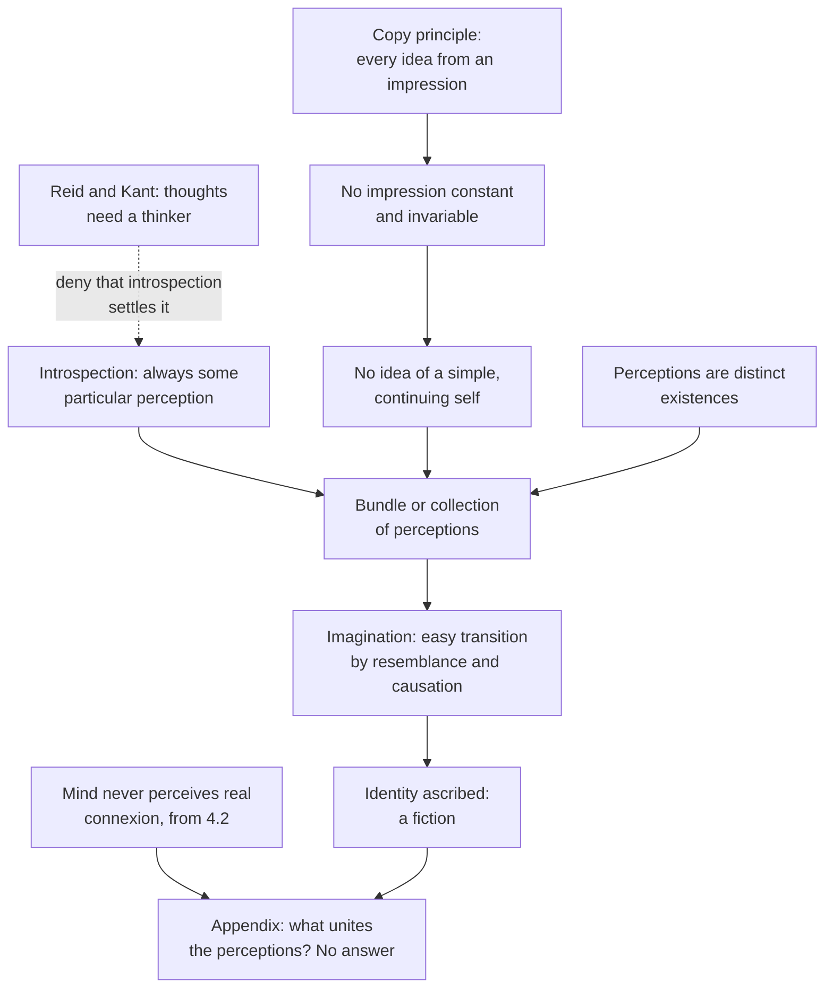

# Modern Philosophy · Lesson 4.4: The self, belief and the passions

> ⏱ ~15 min · Module 4: Hume, and Reid's reply · Builds on: [4.1 Impressions, ideas and the fork](04-01-impressions-ideas-and-the-fork.md), [4.2 Causation and necessary connection](04-02-causation-and-necessary-connection.md), [4.3 Induction and the sceptical solution](04-03-induction-and-the-sceptical-solution.md), [3.3 Locke: personal identity](03-03-locke-personal-identity.md) · Unlocks: [4.5 Reid: common sense against the way of ideas](04-05-reid-common-sense-against-the-way-of-ideas.md), [6.5 Nietzsche: perspectivism and genealogy](06-05-nietzsche-perspectivism-and-genealogy.md)

## Why this matters

Descartes put two things at the top of the mind: a thinking self known more surely than anything else ([1.2](01-02-the-cogito-and-the-wax.md)), and reason, which judges and ought to govern. Book I of Hume's *Treatise of Human Nature* (1739) turns his copy principle on the first and finds a bundle where the self was supposed to be. It then turns reason on itself, ends in despair, and is rescued by dinner. Books II and III (1739–40) demote the second: reason does not rule the passions, it serves them. All three results come from the theory of ideas of [4.1](04-01-impressions-ideas-and-the-fork.md).

## The idea

**The self.** The [copy principle](../reference.md#copy-principle) says every genuine idea is copied from an impression. Ask it of the self that some philosophers claim to feel at every moment, simple and the same through a whole life: *from what impression?* No impression stays the same for a lifetime, so there is no idea of a self in that sense (premises 1–5 below). Then Hume looks anyway (the Source) and finds only particular perceptions. His conclusion is the [bundle theory](../reference.md#bundle-theory): we are

> "nothing but a bundle or collection of different perceptions, which succeed each other with an inconceivable rapidity, and are in a perpetual flux and movement" (*Treatise* I.iv.6).

He compares the mind to a theatre, then at once warns that there is no stage: the perceptions alone make up the mind.

Why, then, does everyone believe in one enduring self? For the reason we call a growing oak the same tree. When objects are linked by resemblance and causation, the imagination passes along them so easily that it feels like viewing one unchanging object. Memory supplies resemblance, since a memory image resembles what it copies. Causation ties perceptions together like the members of a republic, which keeps its identity while its citizens and even its laws change. So the identity we ascribe to the mind is a fiction of the imagination, and past a point the hard cases are verbal: grammatical, not philosophical, difficulties. Notice what reads as a jab at [Locke](03-03-locke-personal-identity.md): memory *discovers* personal identity more than it produces it, since we extend our identity to days we have wholly forgotten.

**The Appendix.** In 1740, in the Appendix printed with Book III, Hume confessed that the section had left him in a labyrinth. He still held the negative half: no impression of a simple self, perceptions as distinct existences. What failed was the positive half, his account of what binds the perceptions together (P1; see [the Appendix problem](../reference.md#appendix-problem)).

**Belief and the despair of I.iv.7.** Belief, as [4.3](04-03-induction-and-the-sceptical-solution.md) showed, is a lively idea produced by [custom](../reference.md#custom-or-habit), not the conclusion of an argument. At the end of Book I, reason examining itself leaves Hume unable to think any opinion more likely than another. Reason cannot dispel the clouds; nature does. He dines, plays backgammon, talks with friends, and returns to find his speculations cold and ridiculous. What survives is a rule commentators call the [Title Principle](../reference.md#title-principle) (Don Garrett's label):

> "Where reason is lively, and mixes itself with some propensity, it ought to be assented to. Where it does not, it never can have any title to operate upon us" (I.iv.7).

The *Enquiry* (1748) gives the result a name, [mitigated scepticism](../reference.md#mitigated-scepticism) (§12 Part 3). Excessive scepticism cannot be lived, since "Nature is always too strong for principle" (§12 Part 2). Corrected by common sense, it leaves modesty in every judgment and enquiry confined to common life.

**Reason and the passions.** Book II, Part iii, section 3 argues that [reason alone](../reference.md#reason-and-the-passions) cannot move us to act, and so cannot oppose a passion:

> "Reason is, and ought only to be the slave of the passions, and can never pretend to any other office than to serve and obey them" (II.iii.3).

A passion represents nothing; it is an original existence, like being thirsty, so it cannot be true or false. It is called unreasonable only in two derivative senses: when it rests on a false belief that some object exists, or when it chooses means that will not reach its end (P2). Book III, Part i, section 1 draws the moral consequence: morals move us to act, reason alone cannot, so moral distinctions are not conclusions of reason. The famous [is–ought paragraph](../reference.md#is-ought-passage) closes that section.

## Source

Hume, *A Treatise of Human Nature* I.iv.6, "Of personal identity" (1739; Project Gutenberg text). The paragraph before argues that no impression is constant and invariable, so we have no idea of such a self.

> For my part, when I enter most intimately into what I call myself, I always stumble on some particular perception or other, of heat or cold, light or shade, love or hatred, pain or pleasure. I never can catch myself at any time without a perception, and never can observe any thing but the perception. When my perceptions are removed for any time, as by sound sleep; so long am I insensible of myself, and may truly be said not to exist. [...] If any one, upon serious and unprejudiced reflection thinks he has a different notion of himself, I must confess I can reason no longer with him. [...] He may, perhaps, perceive something simple and continued, which he calls himself; though I am certain there is no such principle in me.

Three things to notice. The passage reports a first-person experiment ("when I enter", "I always stumble"). Its second sentence makes two claims of different strength: I never catch myself *without* a perception, and I never observe anything *but* the perception. Only the second excludes observing a self. And the close is oddly concessive. Hume allows that someone else may perceive a simple self, and claims certainty only about himself. Whether the bundle view rests on this experiment, on the copy-principle argument before it, or on both is left for the module's boss problem.

## The argument

**A. The self** (I.iv.6).

1. **Every real idea is derived from some one impression** (the copy principle).
2. **The self, as the philosophers describe it, is simple and the same through the whole course of life.**
3. **So an impression giving rise to that idea would have to be constant and invariable.**
4. **No impression is constant and invariable.** Pains, pleasures, passions and sensations succeed each other.
5. **∴ We have no idea of self in that sense.**
6. **Reflection finds only particular perceptions, never a self without them** (the Source).
7. **Every perception is distinct, distinguishable and separable, and may exist separately, needing nothing to support it.** *In words:* perceptions do not need a substance to inhere in.
8. **∴ The mind is a bundle of perceptions, and the identity we ascribe to it is the imagination's work,** produced by the easy transition along resemblance and causation.

**B. Reason and the passions** (II.iii.3; III.i.1).

9. **Reason discovers truth or falsehood, about relations of ideas or matters of fact** (the fork of 4.1, as a theory of the faculty).
10. **Demonstrative reasoning alone never causes action. Probable reasoning only directs an impulse that comes from the prospect of pain or pleasure.** *In words:* learning that bread nourishes moves me only if I want nourishing.
11. **∴ Reason alone is never a motive to the will.**
12. **Only a contrary impulse can oppose a passion.**
13. **∴ Reason alone can never oppose a passion.**
14. **Moral distinctions excite passions and produce or prevent actions.**
15. **∴ Moral distinctions are not conclusions of reason.** *In words:* reason is inert, morality is not, so morality does not come from reason.

**Where the argument is weakest.** In A, the weak point is premise 6, read as the whole story. Reid, in *Essays on the Intellectual Powers* VI.5, takes it as a first principle that the thoughts I am conscious of are the thoughts of a being I call myself. He mocks a succession of perceptions that remembers, judges and even eats and drinks ([4.5](04-05-reid-common-sense-against-the-way-of-ideas.md)). Kant's version is that the "I think" is not an object one could stumble on but a condition of having perceptions as one's own at all ([5.4](05-04-the-transcendental-deduction.md)). Hume's defender replies that he denies only an *impression* of a simple, continuing self, and that the "I" of the Source is the bundle reflecting on itself. But the Appendix concedes that he cannot explain what unites the perceptions in that reflection. In B, the target is premises 9 and 10. The rationalist moralists Hume answers in III.i.1 (Samuel Clarke's eternal fitnesses of things, William Wollaston) held that reason perceives moral relations, and that perceiving them can by itself move the will. Hume's reply is premise 12: show me the impulse that comes from a truth alone.

## The argument map

The dashed edge is the objection of 4.5 and 5.4.

## Worked examples

**Example 1 (clean: the forgotten diary).** Nadia, 50, finds a diary she kept at 14 and remembers none of it. Is the diarist the same person? For Locke (3.3), consciousness reaching back makes the same person, so the answer is in doubt. Hume answers differently. Memory gives us the idea of a causal chain among our perceptions, and we then extend the chain beyond what we remember. The girl's perceptions caused later ones, which caused Nadia's, so the imagination passes easily along the chain and calls it one person. Press for the exact point at which a self would stop being the same, and Hume says no fact decides it: the relations weaken by degrees, so the dispute is verbal.

**Example 2 (hard: the procrastinator).** Ravi knows that finishing his grant report tonight serves his career far better than watching a match, and he watches the match. We say he acted against reason. Hume can't say that in the strict sense. Ravi holds no false belief and chose effective means to what he wanted, so by II.iii.3 nothing he did is contrary to reason; Hume says outright that preferring an acknowledged lesser good is not. What Hume offers instead is a distinction among passions. Calm ones, such as the general appetite to good, are barely felt, and philosophers mistake them for reason. Violent ones, like the thrill of the match, are felt strongly. "Acting against reason" is ordinary speech for a violent passion beating a calm one, and what we call strength of mind is the calm passions prevailing. Here the account strains. It keeps our verdict that Ravi did badly but turns it into a report of which passion won. A critic in the line of Clarke or Kant ([`ethics` 2.1](../../ethics/lessons/02-01-the-good-will-and-acting-from-duty.md)) says that loses what the verdict meant.

## Watch out

- **You might think Hume says there is no self, but** what he denies is an idea of a *simple, invariable* self, and a self distinct from perceptions. He goes on to explain the self we ascribe, and sets aside identity as it concerns the passions, our concern for ourselves, for Book II.
- **Anachronism.** The "Humean theory of motivation", "instrumental rationality" and the "fact–value distinction" are twentieth-century labels. Hume's thesis is about a *faculty*, the one that discovers truth and falsehood, and it leaves reason a real job: finding causes and means. Treat the labels as modern glosses.
- **You might think mitigated scepticism is a half-measure between doubt and belief, but** Hume's claim is that the excessive doubts cannot be lived at all. Mitigated scepticism is what is left of them once common sense and reflection correct them.

## One-liner

> Look inward and you find perceptions, not a perceiver; turn reason on itself and nature, not argument, keeps you believing; ask reason to move you and it can only show the way to what the passions already want.

## Problems

**P1 (🟢) *(Exegetical.)*** Close reading. *Treatise*, Appendix (1740), on the section "Of personal identity" (Project Gutenberg text).

> [W]hen I proceed to explain the principle of connexion, which binds them together, and makes us attribute to them a real simplicity and identity; I am sensible, that my account is very defective [...]. If perceptions are distinct existences, they form a whole only by being connected together. But no connexions among distinct existences are ever discoverable by human understanding. We only feel a connexion or determination of the thought, to pass from one object to another. [...] In short there are two principles, which I cannot render consistent; nor is it in my power to renounce either of them, viz. that all our distinct perceptions are distinct existences, and that the mind never perceives any real connexion among distinct existences. Did our perceptions either inhere in something simple and individual, or did the mind perceive some real connexion among them, there would be no difficulty in the case.

(a) Does Hume here withdraw his denial of a simple self, or something else? Name the words that decide it. (b) The last sentence names two ways out. Say why Hume's own earlier results close each one, naming the lesson or section where each result was reached. Two sentences per part.

**P2 (🟡) *(Exegetical (a) · Evaluative (b).)*** Apply to a hard case. *Treatise* II.iii.3, on the only two senses in which a passion can be called unreasonable:

> First, When a passion, such as hope or fear, grief or joy, despair or security, is founded on the supposition or the existence of objects, which really do not exist. Secondly, When in exerting any passion in action, we chuse means insufficient for the designed end, and deceive ourselves in our judgment of causes and effects. Where a passion is neither founded on false suppositions, nor chuses means insufficient for the end, the understanding can neither justify nor condemn it. It is not contrary to reason to prefer the destruction of the whole world to the scratching of my finger. [...] In short, a passion must be accompanyed with some false judgment in order to its being unreasonable; and even then it is not the passion, properly speaking, which is unreasonable, but the judgment.

Three invented agents. (i) Mara dreads crossing a bridge she believes is about to collapse; it was inspected last week and is sound. (ii) Theo wants to reach the airport fast and takes the road he wrongly thinks is shorter. (iii) Ines, fully informed, wants a rival's shop to fail more than she wants her own to prosper, and knowingly spends her savings undercutting him.
(a) For each, is anything contrary to reason by this passage, and if so, *what* exactly? (b) A critic says: "Any account on which (iii) is not irrational has lost the concept of practical rationality." Say which premise of the lesson's part B the critic denies, and whether Hume has any resources to criticize Ines. Any verdict; 120 words or fewer for (b).

**P3 (🔴) *(Exegetical.)*** Diagnose. An invented forum post:

> "Hume proved once and for all that you can never derive values from facts. That's why he thought morality is just subjective opinion and science has nothing to say about it."

Name three things the post gets wrong about Hume, at least one of them an anachronism, and say what the is–ought paragraph follows from in Hume's own argument. 150 words or fewer. The paragraph's text and its live assessment are in [`ethics` 4.5](../../ethics/lessons/04-05-the-new-natural-law-theory.md) and [6.1](../../ethics/lessons/06-01-moral-realism.md).

Solutions

**P1** *(Exegetical, strict.)*

**Must hit, strict (a):**

- He withdraws neither the denial of a simple self nor the claim that perceptions are distinct existences. He cannot "renounce either" of his two principles, and "Did our perceptions [...] inhere in something simple" is a counterfactual: he still denies that they do.
- What fails is the *positive* account: "the principle of connexion, which binds them together", what makes us attribute simplicity and identity to them. "My account is very defective" is about that explanation.

**Must hit, strict (b):**

- **Inherence in something simple and individual** is closed by the I.iv.6 argument and the copy principle (4.1). We have no impression, and so no idea, of a simple substance for perceptions to inhere in.
- **A perceived real connexion** is closed by the result of 4.2 (*Treatise* I.iii; *Enquiry* §7). The understanding never observes a real connexion among distinct existences; we only feel a customary transition. The I.iv.6 account had used that very result.

**Wrong turns:** reading the Appendix as a full recantation of the bundle view. Hume says the negative arguments have "sufficient evidence" just before this passage. Saying the problem is that he has no impression of the self, which is his premise, not his problem. Claiming the passage says exactly *why* the account of connexion fails. It doesn't, which is why readers divide (Garrett 1981 reads it as a problem about what makes perceptions belong to one mind rather than another; there is no consensus).

**Model answer:** (a) No. He says he cannot renounce either principle; what is "very defective" is his explanation of the "principle of connexion" that binds perceptions together and makes us ascribe identity to them. (b) Inherence in a simple substance is ruled out because no impression gives us an idea of one (I.iv.6, the copy principle of 4.1). A perceived real connexion is ruled out by the causation result of 4.2, that we only ever feel a determination of thought, never observe a connexion.

---

**P2** *(Exegetical (a) · Evaluative (b).)*

**Must hit, strict (a):**

- (i) Unreasonable in the first sense: the fear is founded on a supposition of something (an imminent collapse) that does not exist. Strictly, what is contrary to reason is her *judgment*, not the dread.
- (ii) Unreasonable in the second sense: insufficient means, from a false judgment of cause and effect. Again strictly the judgment, not his wanting to be fast.
- (iii) Nothing is contrary to reason. No false belief, effective means; the preference is one the understanding "can neither justify nor condemn".

**Must hit, any verdict (b):**

- Locate the denial: premise 9 (reason only discovers truth or falsehood) or premise 10 (reason alone never gives an impulse). The critic holds that reason can rank ends, or that grasping one's own greater good is itself a motive.
- Say what Hume *can* say about Ines: her choice may show a violent passion beating a calm one, a lack of strength of mind, and it may draw disapproval from others' sentiments. But none of this makes it contrary to reason in his sense.
- Then a verdict on whether that is enough, either way.

**Wrong turns:** calling (iii) unreasonable because she "should know better". She does know, so no false judgment is in play. Saying Hume thinks all preferences are equally good. He says reason cannot rank them, not that sentiment cannot.

**Model answer (b), one of several:** The critic denies premise 9: for him reason does more than discover truth, since it can judge ends, so preferring a rival's ruin to one's own good is a failure of reason itself. Hume is not silent about Ines. He can call her resentment a violent passion beating the calm appetite to good, and spectators will disapprove of her malice. What he cannot call her is irrational. Whether that is a loss depends on whether "irrational" said anything more than "governed by the wrong passion". The critic thinks it did: it said she failed by a standard she herself is bound by. Hume's account has no such standard, so on this point the critic is right that the concept changes.

---

**P3** *(Exegetical, strict.)*

**Accept:** any three of the first four points, with the anachronism among them, plus the fifth.

**Must hit, strict:**

- **"Proved once and for all"** overstates the passage. Hume says a reason "should be given" for what "seems altogether inconceivable", and recommends the precaution. It is a challenge, whose strength is argued in ethics 4.5.
- **Anachronism:** "values versus facts" is later vocabulary. Hume's contrast is between *is*/*is not* and *ought*/*ought not*, inside his own fork of relations of ideas and matters of fact.
- **"Just subjective opinion"** misreads him. Moral distinctions are derived from a moral sense, a sentiment common to human nature (III.i.2). That is a stable fact about us, not arbitrary preference.
- **"Science has nothing to say"** inverts him. The *Treatise* is an attempt at a science of human nature, and Book III studies morals by observing how sentiments arise.
- **What it follows from:** reason is inert (II.iii.3); morals move us to act; so morals are not conclusions of reason (III.i.1). The is–ought paragraph closes that section as a confirmation.

**Wrong turns:** treating the is–ought paragraph as Hume's main argument for sentimentalism, when it is an afterthought to the inertness argument. Adding Moore's naturalistic fallacy as Hume's view.

**Model answer:** The post makes Hume prove what he only challenges: he asks that a reason be given for a deduction that "seems" inconceivable. "Values" and "facts" is a later vocabulary laid over his *is* and *ought*. And he did not think morality was mere opinion: moral distinctions arise from a sentiment common to human nature, which his science of man studies. The paragraph follows his main argument. Reason is inert, morals move us, so morals are not derived from reason.

## Flashback

**From Lesson [4.2](04-02-causation-and-necessary-connection.md) (Causation and necessary connection):** *(Exegetical.)* Reconstruct. Hume, *Treatise* I.iii.14 (Selby-Bigge text, Project Gutenberg), explaining why most readers will resist his account of necessity:

> [T]he mind has a great propensity to spread itself on external objects, and to conjoin with them any internal impressions, which they occasion, and which always make their appearance at the same time that these objects discover themselves to the senses. Thus as certain sounds and smells are always found to attend certain visible objects, we naturally imagine a conjunction, even in place, [...] though the qualities [...] really exist no where. [...] the same propensity is the reason, why we suppose necessity and power to lie in the objects we consider, not in our mind that considers them.

(a) Put the explanation into three numbered premises and a conclusion, in Hume's terms. One premise is not in the passage: supply it from Lesson 4.2's account of where the impression of necessity comes from. (b) Hume's footnote to "exist no where" points to I.iv.5, which maintains "that an object may exist, and yet be no where". An invented study note says: "By Hume's own analogy necessity is like a smell: it really exists nowhere, so for Hume nothing is ever necessary." What does "exist no where" mean, and where, on Hume's account, does the necessity we feel exist? Two sentences.

Solution

**Accept:** in (a), any ordering that makes explicit the premise about impressions occasioned by objects, the propensity premise, and the supplied premise about the customary transition.

**Must hit, strict (a):**

- P1: Some internal impressions are occasioned by external objects and appear at the very moment those objects appear to the senses.
- P2: The mind is disposed to conjoin such impressions with the objects, even in place. So sounds and smells are imagined to sit in the visible objects they accompany, though they can have no place.
- P3 (supplied from 4.2): The impression from which the idea of necessity is copied is internal. It is the felt customary transition of the mind from an object to its usual attendant, which the object occasions once repetition has formed the habit (*Enquiry* §59).
- ∴ C: By the same propensity we suppose necessity and power to lie in the objects, not in the mind that considers them.

**Must hit, strict (b):**

- "Exist no where" means existing without any place, not failing to exist. I.iv.5 holds that most perceptions, a smell or a passion, have no figure or location and still exist.
- So the analogy relocates necessity; it does not abolish it. What we feel is the mind's determination to pass from one idea to another, which exists as a perception does: necessity and power are "qualities of perceptions, not of objects" (I.iii.14).

**Wrong turns:** treating the propensity as an inference. It is a disposition of the imagination, the same one that places a fig's sweetness in the visible fig, and it argues nothing. Supplying P3 as "we faintly perceive necessity in the objects": 4.2's whole search found no impression of necessity from sensation. In (b), turning the answer into the New Hume dispute. The question is where the *felt* necessity is, and both readings answer it the same way.

**Model answer:** (a) P1: some internal impressions are occasioned by objects and felt just when the objects appear. P2: the mind tends to conjoin such impressions with their objects, even placing them there, as with sounds and smells. P3: the impression of necessity is one of these, the customary transition of the mind that an object occasions after repetition. C: so we suppose necessity lies in the objects, not in the mind. (b) To "exist no where" is to exist without a place, as a smell or a passion does (I.iv.5), not to be unreal. The necessity we feel exists as a determination of the mind, a quality of perceptions, not of objects.

## Connections

- **Backward:** the copy principle and the fork are [4.1](04-01-impressions-ideas-and-the-fork.md); the claim that the mind never observes a real connexion, which wrecks the Appendix, is [4.2](04-02-causation-and-necessary-connection.md); belief as a lively idea produced by custom is [4.3](04-03-induction-and-the-sceptical-solution.md). The self Hume cannot find is Descartes's thinking thing from [1.2](01-02-the-cogito-and-the-wax.md), and his memory-discovers point answers Locke's consciousness account in [3.3](03-03-locke-personal-identity.md). Locke and Berkeley had doubted material substance; Hume extends the doubt to the mind ([3.2](03-02-locke-qualities-substance-and-essence.md), [3.4](03-04-berkeley-immaterialism.md)).
- **Forward:** Reid's first principle that thoughts have a thinker, and his charge that the way of ideas leads here, are [4.5](04-05-reid-common-sense-against-the-way-of-ideas.md). Kant's "I think" is [5.4](05-04-the-transcendental-deduction.md), and his attack on the Cartesian soul from the other side is the paralogisms in [6.2](06-02-the-soul-and-the-antinomies.md). Nietzsche's critique of the subject is [6.5](06-05-nietzsche-perspectivism-and-genealogy.md).
- **Sideways:** personal identity as a live problem is [`metaphysics` 6.5](../../metaphysics/lessons/06-05-what-a-person-is.md) and [6.6](../../metaphysics/lessons/06-06-personal-identity-over-time.md); the is–ought paragraph is close-read in [`ethics` 4.5](../../ethics/lessons/04-05-the-new-natural-law-theory.md) and its metaethics argued in [6.1](../../ethics/lessons/06-01-moral-realism.md). Hume's account of promises as an artificial obligation, built on this view of reason, is [`philosophy-of-debt` 1.2](../../philosophy-of-debt/lessons/01-02-hume-promises-as-artificial-obligation.md). The bundle self as a live view is in [`philosophy-of-mind`](../../philosophy-of-mind/syllabus.md), and [`phenomenology-and-personalism`](../../phenomenology-and-personalism/syllabus.md) assumes it as the empiricist view it rejects.
