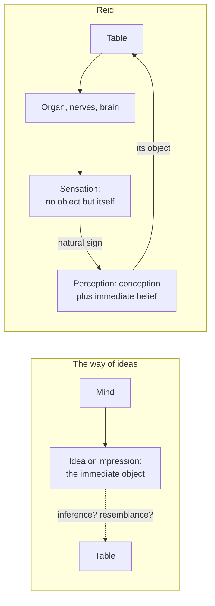

# Modern Philosophy · Lesson 4.5: Reid: common sense against the way of ideas

> ⏱ ~15 min · Module 4: Hume, and Reid's reply · Builds on: [4.3 Induction and the sceptical solution](04-03-induction-and-the-sceptical-solution.md), [4.4 The self, belief and the passions](04-04-the-self-belief-and-the-passions.md), [3.4 Berkeley: immaterialism](03-04-berkeley-immaterialism.md) · Unlocks: [5.1 The critical question](05-01-the-critical-question.md)

## Why this matters

Hume's readers seemed to have two options: find a flaw in his arguments, or accept that belief in causes, bodies and the self rests on custom. Thomas Reid (1710–1796) took a third route. He granted that the arguments were valid and rejected a premise Hume shared with every philosopher since Descartes: that what the mind immediately perceives is an idea. Reid's *Inquiry into the Human Mind* (1764) and *Essays on the Intellectual Powers of Man* (1785) argue that the scepticism is a symptom and the theory of ideas is the disease.

## The idea

Reid tells the history as one story (Source below). Descartes made the mind's immediate objects its own ideas, and so had to prove the world from the inside. Locke kept the ideas and traced every simple one to sensation or reflection. Berkeley showed that no inference runs from ideas to matter, gave up matter and kept spirits. Hume ran the same tests on spirits. In *Treatise* I.ii.6 he says it is generally agreed that "nothing is ever really present with the mind but its perceptions or impressions and ideas." Reid judged each step valid, so he put the fault in the starting point, which he calls the **[ideal system](../reference.md#way-of-ideas)**: the way of ideas.

His replacement starts from a distinction the ideal system blurred, between **[sensation and perception](../reference.md#sensation-and-perception)**. Press your hand on a table. There is a feeling in you, a sensation, and it has no object beyond itself: to feel a pain is just to be pained. There is also the table's hardness, which you *perceive*: the firm cohesion of its parts, which was there before you touched it. The two are wholly unlike. A pressure-feeling no more resembles cohesion than pain resembles the point of a sword (Reid's comparison).

So how does the feeling put you in touch with hardness? Not by resembling it, since Berkeley was right that a feeling can be like nothing but a feeling. And not by inference, since Berkeley and Hume were right that no argument runs from feelings to bodies. It works as a **[natural sign](../reference.md#natural-signs)**. By an original principle of our constitution, the sensation suggests a conception of hardness and a belief that it is there, the way a word suggests its meaning to a fluent speaker who no longer hears the sound. Perception, then, has three parts (*Intellectual Powers* II.5): a conception of the object, an irresistible belief in its present existence, and the fact that this belief is immediate, not reached by reasoning. No idea stands between mind and table as the thing perceived. Readers now call this **[direct realism](../reference.md#direct-realism)**, a modern label.

What justifies such beliefs, if not argument? Some judgments, Reid says, are **[first principles](../reference.md#first-principles-of-common-sense)**: believed as soon as understood, neither needing proof nor capable of it. *Common sense* is his name for the power that judges them, not for popular opinion. *Intellectual Powers* VI.5 lists twelve first principles of contingent truths, among them that what I am conscious of exists, that what I distinctly remember happened, and that what I distinctly perceive exists. The last is that in nature the future will probably be like the past in similar circumstances: Hume's uniformity principle from [4.3](04-03-induction-and-the-sceptical-solution.md), turned from a premise needing support into a starting point. First principles of necessary truths include logical and mathematical axioms and metaphysical ones, such as that whatever begins to exist has a cause.

## Source

Reid, *Inquiry* I.7, "The System of all these Authors is the same, and leads to Scepticism" (1818 edition, public domain).

> Des Cartes no sooner began to dig in this mine, than scepticism was ready to break in upon him. He did what he could to shut it out. Malebranche and Locke, who dug deeper, found the difficulty of keeping out this enemy still to increase; but they laboured honestly in the design. Then Berkeley, who carried on the work, despairing of securing all, bethought himself of an expedient: By giving up the material world, which he thought might be spared without loss, and even with advantage, he hoped, by an impregnable partition, to secure the world of spirits. But, alas! the Treatise of Human Nature wantonly sapped the foundation of this partition, and drowned all in one universal deluge. These facts, which are undeniable, do indeed give reason to apprehend, that Des Cartes's system of the human understanding, which I shall beg leave to call the ideal system, [...] hath some original defect; that this scepticism is inlaid in it, and reared along with it [...]

Three things to notice. This is an argument from a track record: the "facts" are a century of deepening scepticism, and Reid infers a defect in the one thing every stage shared. "Inlaid in it, and reared along with it" says the scepticism grows from the foundation rather than being added later. And Reid does not accuse Hume of bad reasoning. In *Inquiry* V.7 he grants that Berkeley proved, past any reply, that matter cannot be inferred from sensations.

## The argument

**A. Against the ideal system** (*Inquiry* V.2–V.7, VI.20; *Intellectual Powers* II.5).

1. **A sensation has no object distinct from the act of feeling it** (VI.20).
2. **No sensation resembles any quality of body.** *In words:* the pressure-feeling is not like cohesion, and the sound is not like the vibration.
3. **We have clear conceptions of extension, figure, motion and hardness.**
4. **So these conceptions are neither sensations nor copies of sensations.** *In words:* they are ideas neither of sensation nor of reflection, so Locke's two sources cannot account for our plainest notions.
5. **They are given by an original part of our constitution: a sensation suggests a conception, and a belief, that it does not resemble** (V.3).
6. **That belief arises without reasoning** (II.5).
7. **∴ In perception the mind's object is the quality in the body, not an idea. And since the belief never rested on an inference, the proofs that the inference fails do not touch it.**

Reid stakes everything on premise 4 and calls it an *experimentum crucis*, a decisive test (V.7). If anyone shows that extension, figure or motion resembles any sensation, he will give up his case.

**B. The [parity argument](../reference.md#parity-argument)** (*Inquiry* VI.20; *Intellectual Powers* VI.5). The sceptic asks why Reid believes in the object he perceives, and tells him that reason is the only judge of truth. Reid replies: "Why, Sir, should I believe the faculty of reason more than that of perception; they came both out of the same shop, and were made by the same artist" (VI.20).

1. **The sceptic trusts reason and requires perception's verdicts to be certified by reason.**
2. **Reason, perception, memory and consciousness are all natural faculties from the same source.**
3. **Any proof that a faculty is reliable must use some faculty, so it takes the faculty's own testimony for its truthfulness.** Reid charges Descartes's proof of a non-deceiving God with begging the question in just this way (VI.5; compare the circle in [1.3](01-03-god-clear-and-distinct-ideas-and-the-circle.md)).
4. **∴ Reason has no credentials that perception lacks. Either distrust every faculty, and stop arguing, or trust perception on the terms on which you trust reason.**

*Intellectual Powers* VI.5 makes this a first principle: "that the natural faculties, by which we distinguish truth from error, are not fallacious." In VI.20 Reid adds a blunter reason: it is not in his power to give the belief up.

**Where the argument is weakest.** In A, premise 4 rests on Reid's report of what he finds when he compares a feeling with extension. Hume reported the opposite: *Treatise* I.ii.3 says the idea of extension copies coloured points in an arrangement, and invites anyone to point out more. That is two introspective reports with no neutral judge. The history may also be wrong. John Yolton (*Perceptual Acquaintance from Descartes to Reid*, 1984) argued that for Arnauld, and arguably Descartes and Locke, "idea" often names the act of perceiving, not a third thing between mind and world; Reid's "ideal system" may fit Malebranche, Berkeley and Hume better than its founders. In B, premise 1 does not describe Hume, whose *Treatise* I.iv.1 is "Of scepticism with regard to reason." Reid foresees a sceptic who distrusts reason too, and answers only that such distrust cannot be lived, which Hume had said himself ([4.4](04-04-the-self-belief-and-the-passions.md)). Kant's *Prolegomena* preface charged that Reid and his allies assumed what Hume doubted and consulted common sense like an oracle.

## The picture

Left: the table is reached, if at all, by an inference or resemblance that Berkeley and Hume showed cannot be supplied. Right: the sensation is a causal link, not something perceived; the perception's object is the table itself.

## Worked examples

**Example 1 (clean: the pillar, *Inquiry* V.2).** Run your head hard into a stone pillar, and your attention goes to the pain: you feel nothing in the stone, only a pain in your head. Lean your head gently against it, and you will say you feel nothing in your head but hardness in the stone. You had a sensation both times. In the second case it is "a sensation which nature intended only as a sign of something in the stone," so attention passes straight through it to the thing signified. The way of ideas must treat the felt hardness as an idea and ask whether anything outside resembles it. Reid never asks that question. The sensation is a sign; the hardness, the cohesion of the parts, is perceived.

**Example 2 (hard: the oar in water).** A straight oar looks bent where it enters the water. Reid's chapter on the fallacy of the senses (*Intellectual Powers* II.22) sorts such cases into four classes: rash conclusions from what the senses report; errors of acquired perception, learned from experience; false judgments from ignorance of the laws of nature; and real disorders of the organs, such as pain felt in toes after the leg is cut off. Only the fourth, he says, deserves the name. The oar belongs to the third, where he puts refraction. The eye reports the *visible* figure truly, since refracted light really produces that appearance; the error is judging the tangible oar bent. The strain: Reid now needs a visible figure that is truly seen but differs from the oar's real shape, which looks like an appearance standing between mind and thing.

Readers divide. On the **direct** reading, visible figure is a real, relational property of the oar (its shape as projected toward this eye), so nothing mental is seen. On the **mediated** reading, a sign and a conception still come between; Sir William Hamilton, in the notes to his edition of Reid (1846), judged that Reid meant immediate perception but stated it ambiguously, and called the doctrine "vacillating." The words settle that no idea is an *object* of awareness for Reid. They do not settle whether a sign the mind passes through counts as mediation. That depends on what "direct" means, a later question.

## Watch out

- **You might think "common sense" means majority opinion, but actually** for Reid it is the power of judging self-evident first principles. Kant heard an appeal to the crowd; whether that is fair is part of the dispute.
- **You might think "not fallacious" means infallible, but actually** Reid grants that every faculty is limited and can be disordered (the amputee's toes); the oar shows him locating errors, not denying them.
- **Anachronism and misattribution.** "Direct realism" is a later label; Reid's word is "immediate." Nor is he a naive realist: like Locke, he holds that nothing in the rose resembles the smell. The "same shop" line is from the *Inquiry* (VI.20), not the *Intellectual Powers*, and it is not Plantinga's parity argument ([`philosophy-of-religion` 5.2](../../philosophy-of-religion/lessons/05-02-reformed-epistemology.md)).

## One-liner

> Reid grants that Hume's scepticism follows from the way of ideas and rejects the way of ideas: sensations are signs, not objects, perception reaches the thing without an argument, and reason has no better credentials than the senses it would put on trial.

## Problems

**P1 (🟢) *(Exegetical.)*** Close reading. Reid, *Inquiry* VI.20, "Of Perception in general" (1818 edition).

> Thus, I feel a pain; I see a tree: the first denoteth a sensation, the last a perception. The grammatical analysis of both expressions is the same: for both consist of an active verb and an object. But if we attend to the things signified by these expressions, we shall find, that in the first, the distinction between the act and the object is not real but grammatical; in the second, the distinction is not only grammatical but real. [...] Perception, as we here understand it, hath always an object distinct from the act by which it is perceived; an object which may exist whether it be perceived or not. I perceive a tree that grows before my window; there is here an object which is perceived; and an act of the mind by which it is perceived; and these two are not only distinguishable, but they are extremely unlike in their natures.

(a) What does Reid say the two sentences share, and where do they differ? (b) An invented study guide says: "Reid's point is about grammar: 'see' takes a direct object, so seeing has an object." Which words show this misreads him? (c) Why does the final clause, "extremely unlike in their natures," matter against Berkeley's likeness principle ([3.4](03-04-berkeley-immaterialism.md))? Two sentences per part.

**P2 (🟡) *(Exegetical (a) · Evaluative (b).)*** Reconstruct. Reid, *Inquiry* V.7 (1818 edition), on the debate over whether a material world exists:

> it hath been taken for granted on both sides, that this same material world, if any such there be, must be the express image of our sensations; that we can have no conception of any material thing which is not like some sensation in our minds; and particularly, that the sensations of touch are images of extension, hardness, figure, and motion. Every argument brought against the existence of a material world, either by the Bishop of Cloyne, or by the author of the Treatise of Human Nature, supposeth this. If this is true, their arguments are conclusive and unanswerable: but, on the other hand, if it is not true, there is no shadow of argument left.

(a) Using the passage and Berkeley's likeness principle, put the argument against a material world that Reid attributes to Berkeley and Hume into numbered premises in their terms. Mark the premise Reid denies, and say what he concedes. (b) Reid's test for that premise is the *experimentum crucis* (The argument, A). A Humean replies with *Treatise* I.ii.3: the idea of extension is a copy of coloured or tangible points in an arrangement, so Reid compared the wrong things. Does the reply defeat Reid's test? Any verdict; 150 words or fewer for (b).

**P3 (🔴, optional) *(Exegetical (a) · Evaluative (b).)*** Apply to a hard case (invented). Ruth, in a high fever, sees a black cat on her bed and reaches out to stroke it. There is no cat. (a) Using Reid's four classes of alleged fallacies of the senses (Worked example 2), say which class this falls in, what in Ruth's state is not in error, and what is. (b) A defender of the way of ideas argues: "Ruth's experience was just like seeing a cat. Since there was no cat, she was aware of an idea, and if an idea does the job here, it is what you are aware of when there is a cat too." Reid holds (*Intellectual Powers* IV.1) that we can conceive a centaur though none exists, and that the one object conceived is the animal, not an image of it. Can Reid resist the argument without readmitting ideas? Any verdict; 150 words or fewer. Whether perception is direct, as a live question, belongs to `philosophy-of-mind` ([syllabus](../../philosophy-of-mind/syllabus.md), 4.4–4.5).

Solutions

**P1** *(Exegetical, strict.)*

**Must hit, strict (a):**

- Shared: the grammar. Both sentences have "an active verb and an object."
- Different: in "I feel a pain" the act/object distinction is "not real but grammatical," so the pain is nothing beyond the feeling. In "I see a tree" it is "not only grammatical but real."

**Must hit, strict (b):**

- The study guide makes grammar the evidence, but Reid says the grammar is *the same* for both sentences, so grammar cannot be what separates them.
- What decides it is "if we attend to the things signified." The perceived object "may exist whether it be perceived or not," and that is a claim about the thing, not about the verb.

**Must hit, strict (c):**

- Berkeley's principle assumes that what the mind is aware of must be *like* what it represents, and since only an idea can be like an idea, matter drops out.
- Reid says the act of perceiving is *unlike* its object (it has no trunk or leaves) and is still a perception of the tree. So perception does not need resemblance, and the likeness principle loses its target.

**Wrong turns:** reading "act and object" in the pain sentence as two real things. Treating (c) as Reid denying that ideas cannot resemble bodies. He agrees that sensations resemble nothing in bodies; he denies that perception needs resemblance.

**Model answer:** (a) Both sentences have an active verb and an object. Only in seeing is the object a real thing distinct from the act; in feeling a pain the distinction is grammar only. (b) Reid says the grammar is identical, so it cannot mark the difference. He finds the difference "in the things signified": the tree may exist whether perceived or not. (c) Berkeley needs perception to work by likeness, so that an idea can only present what it resembles. Reid's act is extremely unlike the tree and still perceives it, so likeness is not required.

---

**P2** *(Exegetical (a) · Evaluative (b).)*

**Must hit, strict (a):**

- P1: We can conceive no material thing that is not like some sensation (the passage's hidden premise; the sensations of touch are images of extension and the rest).
- P2: An idea or sensation can be like nothing but an idea or sensation (Berkeley's likeness principle).
- P3: So whatever we conceive of as material is a sensation or something like one, which cannot exist unperceived.
- ∴ C: Either "matter" is unconceivable, or what we call matter is only sensations and ideas. Hume extends this to minds.
- Reid **denies P1**.
- Reid **concedes** that the argument is valid ("conclusive and unanswerable" if P1 is true), and elsewhere in V.7 he grants that matter cannot be *inferred* from sensations.

**Must hit, any verdict (b):**

- State the reply precisely: it moves the comparison from a single feeling to an *arrangement* of sensible points, so the idea of extension is a copy of an ordered manifold, not of any one sensation.
- Say what each side then has. Reid has his report that extension is "not of kin" to any sensation. Hume has his challenge in I.ii.3 to point out anything more than coloured points. Then say whether the reply defeats the test, or whether the dispute becomes an introspective stand-off with no neutral way to decide it.

**Wrong turns:** saying Reid denies that the argument is valid, or denies that matter cannot be inferred from sensations. He concedes both. Reconstructing the argument in Reid's vocabulary (signs, suggestion), which is not theirs.

**Model answer (b), one of several:** The reply weakens the test without defeating it. Reid's test asks whether extension is like any *sensation*, and his pillar and sword-point comparisons are all single feelings set against a quality. Hume's answer is that extension is the *manner of arrangement* of many such points, and an arrangement of points is plainly extended. If that is right, Reid has compared the wrong things. But Reid can press back: tangible "points" with an order among them already presuppose a conception of position and space, which no single feeling contains, and Hume's copy says nothing about where that ordering idea comes from. So the dispute narrows to one question: is the arrangement itself given in sensation? Each side answers by reporting what it finds, which is why the test does not decide the matter.

---

**P3** *(Exegetical (a) · Evaluative (b).)*

**Must hit, strict (a):**

- The fourth class: a disorder of the nerves or brain, the only class Reid thinks properly deserves to be called a deception of sense.
- Not in error: her sensations. Reid holds there can be no fallacy in sensation, since a sensation is just what it is felt to be.
- In error: the conception and belief of a present cat, produced by a disordered organ. Strictly, on VI.20, this is not a perception at all, since perception always has an object distinct from the act.

**Must hit, any verdict (b):**

- State the argument's key premise: an experience *just like* seeing must have the same kind of object as seeing.
- Use Reid's resource: conception can be directed at a cat that does not exist, as at a centaur, with no idea serving as its object. So Ruth conceives a cat and believes it present, and no idea is needed.
- Then decide whether this works, or whether it concedes that hallucination and perception are different kinds of state despite seeming alike. (That later view is now called disjunctivism. If you use the term, name it as a modern gloss.)

**Wrong turns:** putting the case in the third class, as if it were the oar. No law of light is misread here, and the organ is disordered. Saying Reid holds that Ruth perceives an idea of a cat.

**Model answer (b), one of several:** Reid can resist, at a price. He denies the premise that sameness of seeming means sameness of object. Ruth's state is a conception of a cat plus a belief, both produced by a disordered brain. A conception can be of a cat that does not exist, just as a centaur is conceived without any image being what is conceived. So nothing in Ruth's case needs an idea as object. The price is that Reid must call two states that feel alike different in kind: one has an object and the other has none. The way of ideas will say this is ad hoc. Reid's answer is that "feels alike" was never evidence about objects, since a sensation tells you only about itself. Whether the price is acceptable is the question the argument actually raises.

## Flashback

**From Lesson [4.3](04-03-induction-and-the-sceptical-solution.md) (Induction and the sceptical solution):** *(Exegetical (a) · Evaluative (b).)* Counterexample. Hume, *Enquiry* §V Part II, ¶40 (Selby-Bigge numbering, Project Gutenberg):

> I say, then, that belief is nothing but a more vivid, lively, forcible, firm, steady conception of an object, than what the imagination alone is ever able to attain. This variety of terms [...] is intended only to express that act of the mind, which renders realities, or what is taken for such, more present to us than fictions, causes them to weigh more in the thought, and gives them a superior influence on the passions and imagination. [...] It gives them more weight and influence [...] and renders them the governing principle of our actions.

An invented case. Sam spends an evening on a gripping novel about a shipwreck. He pictures the storm in rich detail and his heart pounds. Before bed he skims a two-line news item saying a ferry ran aground off the coast, and he pictures almost nothing. He believes the news item and not the novel, and next morning he phones a cousin who takes that ferry. (a) Why does Sam look like a counterexample to belief as vivacity, and what in the passage answers it? Two sentences. (b) Does that answer save belief as vivacity, or replace vivacity with something else? Any verdict; 100 words or fewer.

Solution

**Must hit, strict (a):**

- The apparent counterexample: the novel's ideas are richer and more stirring than the news item's, yet only the news item is believed. If belief were a higher degree of liveliness, Sam should believe the novel.
- The answer: "vivid, lively" does not name detail or agitation. It names a manner of conception that makes realities "more present", makes them "weigh more in the thought", and "renders them the governing principle of our actions". By that measure the news item is the livelier idea: it sends Sam to the phone, and the novel sends him nowhere.

**Must hit, any verdict (b):**

- Name the shift. The answer measures vivacity by its role (weight, influence on action), not by the felt intensity of the image, so "lively" no longer means what it means when impressions are called livelier than ideas.
- Say what Hume still needs. He insists belief is "something felt by the mind", a feeling, and in ¶40 he concedes he cannot define it or perfectly explain it. So either the feeling is identified independently of its effects, or the account names belief by what it does.
- Notice the strain in "a superior influence on the passions": the novel moved Sam's passions more. Hume needs passions from fiction to differ in kind or weight from passions from belief.
- A verdict, either way. "Saved": one feeling, described by its effects, with a cause that is not circular (a present impression plus custom). "Replaced": Reid's conclusion that belief is assent, not a degree of liveliness (the future-state objection in Lesson 4.3).

**Wrong turns:** answering that Sam believes the news because it is true. Truth plays no part in Hume's account, which covers "realities, or what is taken for such". Treating the answer as Reid's. Reid denies that belief is vivacity; Hume redescribes vivacity.

**Model answer (b), one of several:** It saves the word and changes the theory. If liveliness is measured by weight and influence on action, the novel loses, but "vivacity" has stopped meaning intensity of the image and now describes belief by its effects. Hume has a defence: belief is still one felt manner of conception with a definite cause, a present impression plus custom. Hume himself, in *Treatise* I.iii.10, says a poetical description can strike the fancy harder than a history and still feel different. But since he admits the feeling cannot be defined, Reid's verdict looks fair: what is doing the work is assent, not degree.

## Connections

- **Backward:** Reid's target is the theory of ideas from Descartes ([1.1](01-01-the-method-of-doubt.md)) through Locke's two sources ([3.1](03-01-locke-against-innate-ideas.md)) and Berkeley's likeness principle ([3.4](03-04-berkeley-immaterialism.md)) to Hume's copy principle ([4.1](04-01-impressions-ideas-and-the-fork.md)). His first principle about the future takes up the uniformity principle of [4.3](04-03-induction-and-the-sceptical-solution.md), and his "not in my power" echoes Hume's nature-over-reason in [4.4](04-04-the-self-belief-and-the-passions.md). Reid also denies that bodies have causal power: in *Inquiry* V.3 natural causes are better called natural signs, and he keeps real efficiency for agents with *active power* (*Essays on the Active Powers*, 1788). That sets him near Malebranche on bodies ([2.4](02-04-interaction-and-causation.md)). His brave-officer objection to Locke's memory criterion ([3.3](03-03-locke-personal-identity.md)) is argued in [`metaphysics` 6.6](../../metaphysics/lessons/06-06-personal-identity-over-time.md). Steelmanning a diagnosis is [`philosophical-method` 4.2](../../philosophical-method/lessons/04-02-steelmanning-and-the-burden-of-proof.md).
- **Forward:** Kant's *Prolegomena* names Reid among Hume's opponents who missed the point, and his own question, how necessary concepts can apply to experience, is [5.1](05-01-the-critical-question.md). Boss 4 asks whether Reid answers Hume or changes the question.
- **Sideways:** Reid on testimony, the principles of veracity and credulity, is [`epistemology` 4.4](../../epistemology/lessons/04-04-testimony.md). Moore's "here is one hand" ([`epistemology` 3.3](../../epistemology/lessons/03-03-moore-and-the-dogmatist.md)) and the externalist idea that a faculty can justify without first certifying itself ([`epistemology` 2.4](../../epistemology/lessons/02-04-reliabilism.md)) are often read as heirs of Reid, though neither lesson argues that lineage. The arguments from illusion and hallucination, as live problems, are in [`philosophy-of-mind`](../../philosophy-of-mind/syllabus.md) 4.4–4.5.
