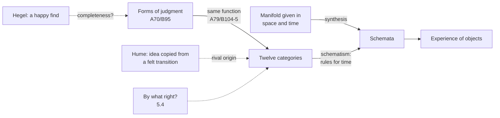

# Modern Philosophy · Lesson 5.3: Concepts and the categories

> ⏱ ~15 min · Module 5: Kant I: the conditions of experience · Builds on: [5.1 The critical question](05-01-the-critical-question.md), [5.2 Space and time](05-02-space-and-time-the-transcendental-aesthetic.md), [4.2 Causation and necessary connection](04-02-causation-and-necessary-connection.md) · Unlocks: [5.4 The transcendental deduction](05-04-the-transcendental-deduction.md)

## Why this matters

Hume looked for the impression behind the idea of necessary connection and found only a felt transition of the mind ([4.2](04-02-causation-and-necessary-connection.md)). In the *Prolegomena* preface Kant says he tried to put Hume's objection "into a general form". Cause, he found, was only one of several concepts by which the understanding connects things a priori. He then set out to count them from a single principle. This lesson is that count and that principle: twelve **categories**, read off the forms of judgment. Whether we have any *right* to apply them is the next lesson's question.

## The idea

[5.2](05-02-space-and-time-the-transcendental-aesthetic.md) gave one stem of knowledge: sensibility, which receives a manifold in space and time. A manifold is not yet an object. To see the shapes on the table as *one* cup, a *thing* with properties, *warming* because tea was poured in, you must take the given as something. That taking is the work of the other stem ([intuition and concept](../reference.md#intuition-and-concept)). Kant's slogan (A51/B75, Meiklejohn):

> Thoughts without content are void; intuitions without conceptions, blind.

Meiklejohn writes "void" and "conceptions" where modern translators have "empty" and "concepts". Neither stem can do the other's job.

What does the understanding do? It judges. A judgment brings many representations under one: in "all bodies are divisible", one concept collects many. Strip away the content and every judgment still has a *form* along four dimensions. How much is it about: all, some, or this one? Does it affirm or deny? How are its parts related: subject and predicate, if and then, either and or? And with what force: maybe, is, or must?

Now the bet. The act that joins "if p" to "then q" in a judgment is the same act that, applied to what is given in time, makes one happening the ground of another. So the concept of cause is not copied from any impression ([copy principle](../reference.md#copy-principle)). It is the hypothetical form of judging, turned on intuition. The joining itself Kant calls [synthesis](../reference.md#synthesis):

> the process of joining different representations to each other and of comprehending their diversity in one cognition.

Run all twelve forms through the same move and you get twelve pure concepts of an object in general ([table of judgments](../reference.md#table-of-judgments); [categories](../reference.md#categories)):

| Heading | Forms of judgment (A70/B95) | Categories (A80/B106) |
|---|---|---|
| Quantity | universal, particular, singular | unity, plurality, totality |
| Quality | affirmative, negative, infinite | reality, negation, limitation |
| Relation | categorical, hypothetical, disjunctive | inherence and subsistence (substance and accident); causality and dependence (cause and effect); community (reciprocity of agent and patient) |
| Modality | problematical, assertorical, apodeictical | possibility–impossibility; existence–non-existence; necessity–contingence |

The spellings are Meiklejohn's. In each triad, Kant adds, the third combines the first two (totality is plurality taken as unity), yet needs an act of its own. Under Quantity, readers dispute how the rows pair: the judgments run from universal to singular and the categories from unity to totality.

## Source

Kant, *Critique of Pure Reason*, Transcendental Analytic, "Of the Pure Conceptions of the Understanding, or Categories" (A79/B104–5; Meiklejohn, public domain).

> The same function which gives unity to the different representation in a judgement, gives also unity to the mere synthesis of different representations in an intuition; and this unity we call the pure conception of the understanding. Thus, the same understanding, and by the same operations, whereby in conceptions, by means of analytical unity, it produced the logical form of a judgement, introduces, by means of the synthetical unity of the manifold in intuition, a transcendental content into its representations, on which account they are called pure conceptions of the understanding, and they apply à priori to objects, a result not within the power of general logic. In this manner, there arise exactly so many pure conceptions of the understanding, applying à priori to objects of intuition in general, as there are logical functions in all possible judgements.

Three things to notice. "The same function" carries the whole derivation: one act, two jobs. "Transcendental content" is what general logic lacks: it is form *for objects*, not just form of sentences. And "exactly so many" is the completeness claim, which rests on the table of judgments being complete.

## The argument

Kant later names this the [metaphysical deduction](../reference.md#metaphysical-deduction) (B159): the a priori origin of the categories shown by their agreement with the logical functions of thought.

1. **The understanding can use concepts only to judge.** *In words:* thinking is judging; a concept is a predicate of possible judgments.
2. **Every judgment is a function of unity: it brings many representations under one.**
3. **Abstracting from content, the functions of unity in judgment fall under four heads of three moments each, and the list is complete** (A70/B95).
4. **Cognizing an object requires that the manifold of intuition be synthesized, and that the synthesis be brought to unity by concepts.** *In words:* given material, joined, and the joining unified under a rule.
5. **The same function that unifies representations in a judgment unifies the synthesis of a manifold in intuition** (the Source). *In words:* logical form and object-form are one act seen twice.
6. **∴ For each logical function there is a pure concept of an object in general that applies a priori to whatever is given in intuition: twelve categories.**
7. **∴ The list is complete and systematic, because it is drawn from one principle.** Aristotle, Kant says, picked his up as they occurred to him, mixing in forms of sensibility (when, where, position) and an empirical concept (motion) ([Aristotle's ten](../../ancient-medieval-philosophy/lessons/03-01-predication-categories-and-the-syllogism.md)).

**The schematism, named.** A category cannot be seen: causality is not "contained in the phenomenon". So something must mediate between pure concept and sensible intuition: a [schema](../reference.md#schematism), a rule-governed determination of time. The schema of substance is the permanence of the real in time. That of cause is succession subject to a rule. That of necessity is existence at all times. Without schemata, Kant concludes, the categories have no use except on appearances.

**Where the argument is weakest.** Premises 3 and 5. On 3, Kant asserts completeness ("there is no other function" in the understanding) and does not prove it. Hegel's *Phenomenology* (1807) protests, in a passage Baillie's note ties to Kant's table, that it is an outrage on scientific thinking

> to pick up the various categories again in any sort of way as a kind of happy find, hit upon, e.g. in the different judgments

Later critics (Stephan Körner in 1955; P. F. Strawson in *The Bounds of Sense*, 1966) doubted that the table exhausts the forms of judgment or can ground the categories, and Frege's quantifier logic does not sort judgments this way ([mathematical-logic 2.1](../../mathematical-logic/lessons/02-01-quantifiers-syntax.md)). Defenders reply that the table is meant as an inventory of the acts of one capacity to judge, not of sentence shapes: Klaus Reich (1932) tried to derive its completeness from the unity of self-consciousness, and Béatrice Longuenesse's *Kant and the Capacity to Judge* (English 1998) reconstructs each form as an act. On 5, why a logical function should yield a concept *of objects* is asserted here and earned, if anywhere, in [5.4](05-04-the-transcendental-deduction.md).

## The picture

Solid arrows run Kant's derivation from logic to experience. Dashed edges mark the three pressure points: the table's completeness, the rival empiricist origin, and the question of right.

## Worked examples

**Example 1 (clean: one row, end to end).** Kant's own case (*Prolegomena* §20, note). "When the sun shines on the stone, it grows warm" reports how my perceptions usually go together; Kant calls it a judgment of perception. "The sun warms the stone" adds the concept of cause. Trace it through the machinery. Form of judgment: hypothetical (Relation), ground and consequent. Category: causality and dependence. Schema: the warming follows the shining according to a rule. Result: a judgment of experience, claimed to hold for everyone, not just a report of my perceptions. Nothing in the second sentence names a new impression. What changed is the form under which the same intuitions were judged.

**Example 2 (hard: community from disjunction).** Kant admits this pairing is "not so easy" to see as the others. A disjunctive judgment (Kant's example: "The world exists either through blind chance, or through internal necessity, or through an external cause") divides a sphere into members that exclude each other and together exhaust it. They are co-ordinated rather than ranked in a chain. Community is a whole of substances that determine each other reciprocally, side by side. The bridge is the shared structure of mutual determination within a whole. A sceptical reader sees a pun: logical exclusion among alternatives is not causal interaction among coexisting things. A sympathetic reader says the parallel is exact at the level Kant intends, the form of a whole whose parts fix each other's place. The text supplies the analogy and no more.

## Watch out

- **You might think the categories are learned early, or innate.** Kant's a priori is about where a concept gets its content and validity, not when a child acquires it. All knowledge "begins with" experience without all arising out of it (B1; see [5.1](05-01-the-critical-question.md)). In his 1790 reply to Eberhard he describes the categories as originally acquired (paraphrased): produced by the mind's own activity on the occasion of experience, neither abstracted from it nor implanted ready-made. "Hard-wired" and "cognitive architecture" are modern glosses.
- **You might think these are Aristotle's categories reorganized.** Aristotle's are highest kinds of predicate, said of beings. Kant's are concepts of an object in general, valid only for objects of possible experience, and derived from judgment rather than gathered from language.
- **Meiklejohn's English hides two distinctions.** His infinite judgment reads "The soul is not mortal", which looks merely negative; Kant's German is "non-mortal". And in the schematism his "the schema of reality" under Modality means *actuality*, not the Quality category of reality.

## One-liner

> The understanding is the power to judge; the twelve ways of unifying a judgment, turned on what space and time give us, are the twelve concepts any object must fall under.

## Problems

**P1 (🟢) *(Exegetical.)*** Apply. For each invented judgment, name its form under the heading given and the category Kant pairs with that form. One line each.

- (i) "If the pressure drops, the seal fails." (Relation)
- (ii) "The reading is too high, too low, or within tolerance." (Relation)
- (iii) "The beam is not cracked." (Quality)
- (iv) "This alloy is non-magnetic." (Quality)
- (v) "The bridge may be unsafe." (Modality)

**P2 (🟡) *(Exegetical.)*** Close reading, then find the crux. Kant, *Critique of Pure Reason*, Transcendental Analytic, transition to the deduction of the categories, B127 (Meiklejohn; "derive" corrected from the Gutenberg text's "drive"):

> David Hume perceived that, to render this possible, it was necessary that the conceptions should have an à priori origin. But as he could not explain how it was possible that conceptions which are not connected with each other in the understanding must nevertheless be thought as necessarily connected in the object—and it never occurred to him that the understanding itself might, perhaps, by means of these conceptions, be the author of the experience in which its objects were presented to it—he was forced to derive these conceptions from experience, that is, from a subjective necessity arising from repeated association of experiences erroneously considered to be objective—in one word, from habit.

(a) According to the passage, what did Hume see, what possibility did he miss, and where did he end up deriving the concepts from? (b) Find the crux between Hume and Kant on the *origin of the concept* of cause: name the single principle of Hume's (4.1) that Kant must deny, say exactly how much of it he denies, and say what Kant puts in its place. Two sentences per part.

**P3 (🔴) *(Exegetical (a) · Evaluative (b).)*** Diagnose. An invented study guide:

> Kant's categories are the twelve basic concepts every human learns in early infancy, before memory begins, which is why adults experience them as a priori. Kant found them by surveying the concepts that physics and everyday life actually rely on, and keeping the twelve that turned up everywhere.

(a) Name the misreading in each sentence and the text from this lesson that corrects it. Two sentences per sentence. (b) A critic says the guide's second sentence, though wrong as a report of Kant's *method*, is close to the truth about his *result*. State the critic's point precisely, and say whether Kant's appeal to "one principle" answers it. Any verdict; 120 words or fewer for (b).

Solutions

**P1** *(Exegetical, strict.)*

**Must hit, strict:**

- (i) Hypothetical → causality and dependence (cause and effect).
- (ii) Disjunctive → community (reciprocity).
- (iii) Negative → negation.
- (iv) Infinite → limitation. It affirms a negative predicate ("is non-magnetic"), placing the alloy in the unbounded remainder outside the magnetic, rather than denying a predicate.
- (v) Problematical → possibility–impossibility.

**Wrong turns:** calling (iv) negative because "non" looks like "not". Kant's point is that its logical form affirms. Calling (ii) categorical because it has a single subject: what matters is the relation among the three alternatives, which exclude each other and exhaust the sphere.

**Model answer:** as listed.

---

**P2** *(Exegetical, strict.)*

**Must hit, strict (a):**

- Hume saw that these concepts would need an a priori origin if they were to carry us beyond experience.
- He missed that the understanding, through these very concepts, might be "the author of the experience" in which objects are given.
- So he derived them from experience: from habit, a subjective necessity produced by repeated association and mistaken for an objective one.

**Must hit, strict (b):**

- The crux is the [copy principle](../reference.md#copy-principle): every simple idea is copied from a preceding impression (outer, or inner as with the felt transition of 4.2).
- Kant denies only its universality. He grants that empirical concepts arise from experience, and that all knowledge begins with it, but holds that some concepts take their content from the understanding's own functions of judgment.
- In its place: the cause concept is the hypothetical form of judging applied to the manifold in time, a pure concept with no impression as its original.

**Wrong turns:** answering that the crux is "whether causes are necessary". That is a further dispute, about the source of the necessity, not about the origin of the concept. Saying Kant denies that any ideas come from impressions.

**Model answer:** (a) Hume saw that the concepts would need an a priori origin, but missed that the understanding might be the author of experience through them. So he derived them from experience, as habit taken for objective necessity. (b) The crux is the copy principle, which Hume holds of every simple idea and Kant denies only for the categories, granting it for empirical concepts. For Kant, the concept of cause is the hypothetical function of judgment turned on intuition, copied from nothing.

---

**P3** *(Exegetical (a) · Evaluative (b).)*

**Must hit, strict (a):**

- Sentence 1 turns the a priori into an early-in-time origin. Kant's a priori concerns source of content and validity: knowledge begins with experience but does not all arise from it (B1). The categories are originally acquired from the mind's own activity, not learned from experience at any age.
- Sentence 2 makes the list an induction from usage. Kant derives it from the forms of judgment by one principle (the Source, A79/B104–5), and criticizes Aristotle precisely for collecting categories as they turned up.

**Must hit, any verdict (b):**

- State the critic precisely: the categories are only as complete as the table of judgments, and that table was itself taken over from the logic of Kant's day, so the "principle" relocates the survey rather than replacing it (Hegel's "happy find").
- Say what Kant's principle can claim: one capacity, one act of unifying, four heads. Then judge whether that guarantees completeness, or whether completeness still needs an argument Kant does not give at A70/B95.

**Wrong turns:** treating (b) as a repeat of (a). The critic grants that Kant *claims* a principle. Arguing that the categories are false or useless, which is not asked.

**Model answer (b), one of several:** The critic's point is that "exactly so many" categories inherits the completeness of the table of judgments, and the table looks like the school logic of 1781, not a derivation. So the survey has moved from concepts to judgment forms but has not gone away. Kant's reply is that the forms are the acts of a single capacity to unify representations, so they can be counted from the inside. That would answer the critic only if the four heads were shown to exhaust what unifying can be. Kant asserts this ("no other function") but does not prove it here. So the principle explains the order of the table more clearly than it secures its completeness.

## Flashback

**From Lesson [5.1](05-01-the-critical-question.md) (The critical question):** *(Counterexample.)* An invented student offers two counterexamples to Kant's account of the a priori.

- (i) "Every coin in this purse is silver. I emptied the purse and assayed all twelve coins, so the judgment holds without a single exception, and I know it by experience. So strict universality is no mark of the a priori."
- (ii) "A widow is a woman whose husband has died. I learned what 'widow' means from experience, so this judgment is analytic *and* a posteriori, and Kant's empty cell has an occupant."

Say why each fails on Kant's own terms (*Critique*, Introduction §§I–II and IV). Two sentences each.

Solution

**Must hit, strict (i):**

- Strict universality is not the absence of actual exceptions but the impossibility of any: a judgment with it "admits of no possible exception" (Introduction §II, Meiklejohn).
- The purse judgment covers only the coins examined, and a brass coin could have been among them. Its universality is comparative, the most experience gives ("so far as we have hitherto observed"), complete here only because the count was small. It carries no necessity, and Kant calls the two marks inseparable.

**Must hit, strict (ii):**

- Experience was the *occasion* of acquiring the concept, but the judgment is justified by analysing the concept alone. All knowledge begins with experience, but not all of it arises out of experience (§I).
- The cell stays empty because an analytic judgment needs nothing beyond its concept, so grounding it on experience would be absurd (§IV). "A priori" concerns the judgment's ground, not the learner's history.

**Wrong turns:** answering (i) with "twelve coins are too few". No number of observations yields strict universality, and a complete count yields only actual universality. Conceding that (ii) is a posteriori "for the student". Calling (ii) synthetic because "widow" is an empirical concept. An empirical concept can still figure in an analytic judgment, as with Kant's gold in the *Prolegomena*.

**Model answer:** (i) Kant's strict universality means that no exception is possible, not that none was found. The purse judgment is true of twelve examined coins, could have been false, and so has only the comparative universality of experience, with no necessity. (ii) Experience taught the student the concept, but the judgment rests on analysing it, and knowledge that begins with experience need not arise from it (§I). An analytic judgment never needs anything beyond its concept, which is why Kant calls grounding one on experience absurd (§IV).

## Connections

- **Backward:** the copy principle ([4.1](04-01-impressions-ideas-and-the-fork.md)) and Hume's felt transition ([4.2](04-02-causation-and-necessary-connection.md)) are the rival account of where "cause" comes from. Kant's question is the synthetic a priori of [5.1](05-01-the-critical-question.md), and the intuition/concept split is [5.2](05-02-space-and-time-the-transcendental-aesthetic.md)'s. Naming the crux is [`philosophical-method` 4.3](../../philosophical-method/lessons/04-03-finding-the-crux.md).
- **Forward:** [5.4](05-04-the-transcendental-deduction.md) asks by what right the categories apply to objects at all. [5.5](05-05-the-second-analogy.md) puts the schema of cause to work against Hume. The Dialectic's antinomies ([6.2](06-02-the-soul-and-the-antinomies.md)) follow the four headings of this table. Husserl's categorial intuition ([`phenomenology-and-personalism` 1.2](../../phenomenology-and-personalism/lessons/01-02-the-anatomy-of-an-experience.md)) is a later account of how categorial form is given.
- **Sideways:** Aristotle's ten categories as highest kinds of predicate are [ancient-medieval-philosophy 3.1](../../ancient-medieval-philosophy/lessons/03-01-predication-categories-and-the-syllogism.md), the list Kant says was picked up without a guiding principle. Kant's table rests on term logic; the quantifier logic that replaced it is [mathematical-logic 2.1](../../mathematical-logic/lessons/02-01-quantifiers-syntax.md). Whether any knowledge is a priori, as a live question, is [epistemology 4.1](../../epistemology/lessons/04-01-a-priori-knowledge.md).
