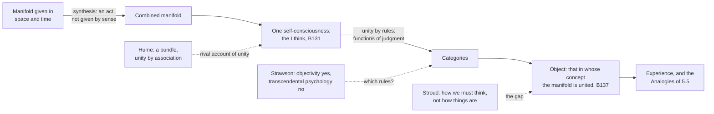

# Modern Philosophy · Lesson 5.4: The transcendental deduction and the "I think"

> ⏱ ~15 min · Module 5: Kant I: the conditions of experience · Builds on: [5.3 Concepts and the categories](05-03-concepts-and-the-categories.md), [5.2 Space and time](05-02-space-and-time-the-transcendental-aesthetic.md), [4.4 The self, belief and the passions](04-04-the-self-belief-and-the-passions.md) · Unlocks: [5.5 The Second Analogy](05-05-the-second-analogy.md), [6.2 The Dialectic: the soul and the antinomies](06-02-the-soul-and-the-antinomies.md)

## Why this matters

[5.3](05-03-concepts-and-the-categories.md) produced twelve pure concepts, cause among them, from the forms of judgment. Producing a concept is not the same as being entitled to use it. Hume would grant that we *think* "cause" and deny that the world owes it anything. The transcendental deduction is Kant's attempt to show the entitlement. He says in the A preface that it cost him more labour than anything else in the book, and he rewrote it almost completely for the second edition. Its key move, that the categories are conditions of my being able to call my representations *mine*, is also where Kant answers Hume's missing self ([4.4](04-04-the-self-belief-and-the-passions.md)) and where Husserl's transcendental ego later starts.

## The idea

Kant borrows a lawyer's distinction (A84–85/B116–117). In a dispute over land, the **question of fact** (*quid facti*) asks how you came to occupy it. The **question of right** (*quid juris*) asks whether you hold title. A "deduction" in the jurists' sense answers the second ([quid facti and quid juris](../reference.md#quid-facti-and-quid-juris)). Empirical concepts like "dog" need no deduction, since experience can always show them instances. Locke's history of how the mind comes by its ideas answers only the question of fact. For concepts that claim necessity, such as cause, no history of their acquisition can show title, because experience never shows necessity ([5.1](05-01-the-critical-question.md)). So their [transcendental deduction](../reference.md#transcendental-deduction) must show how they "can apply à priori to objects" at all.

Why is this harder than for space and time? Nothing can *appear* to us except in space and time ([5.2](05-02-space-and-time-the-transcendental-aesthetic.md)), so their hold on appearances is secure. The categories are not conditions of anything being given. So, Kant concedes (A90/B123), appearances might be such that

> all things might lie in such confusion that, for example, nothing could be met with in the sphere of phenomena to suggest a law of synthesis

and "cause" would be empty.

Kant's strategy is to find something that both the categories and any experience at all depend on. He finds it in the self. Take a melody of five notes. If one mind heard the first note, another the second, and so on, nobody would hear a melody. The notes must be held together *by one subject*, and holding together is something that subject does. Kant calls the doing [synthesis](../reference.md#synthesis) and the oneness of the subject the [unity of apperception](../reference.md#unity-of-apperception). The deduction then argues that the rules by which a mind holds a manifold together are the functions of judgment. Those rules, applied to intuition, are the [categories](../reference.md#categories). If that is right, whatever can be an experience *of mine* already falls under the categories.

Two senses of self-consciousness must be kept apart. **Empirical apperception** is inner sense: awareness of my passing states, which Kant calls "fragmentary and disunited". **Transcendental apperception** is the bare "I think" that must be *able* to accompany each of them (B131–132). It is one and the same in every act, and it is not perceived. Kant says of it (B157, Meiklejohn):

> I am conscious of myself, not as I appear to myself, nor as I am in myself, but only that "I am." This representation is a thought, not an intuition.

## Source

Kant, *Critique of Pure Reason*, B deduction, §17 (B137; Meiklejohn, who numbers these sections four lower than the German, so this is his §13):

> Understanding is, to speak generally, the faculty of cognitions. These consist in the determined relation of given representation to an object. But an object is that, in the conception of which the manifold in a given intuition is united. Now all union of representations requires unity of consciousness in the synthesis of them. Consequently, it is the unity of consciousness alone that constitutes the possibility of representations relating to an object, and therefore of their objective validity, and of their becoming cognitions, and consequently, the possibility of the existence of the understanding itself.

Three things to notice. **The definition of "object" is the hinge.** An object is not introduced as something behind the representations. It is *that in whose concept a manifold is united*: objectivity is rule-governed unity. **The direction of dependence:** relation to an object depends on unity of consciousness, not the other way round, which is the [Copernican](../reference.md#copernican-revolution) move applied to objecthood. **What the words do not settle:** whether "object" here means only an object of possible experience, or whether this unity reaches things as they are in themselves. Kant's answer, the first, is argued in [6.1](06-01-transcendental-idealism-and-the-thing-in-itself.md).

## The argument

The B deduction (1787) at outline level. Kant marks two steps (§21 in the German): §§15–20 for intuition in general, §26 for our space-and-time intuition.

1. **Whatever representation is anything to me must be able to belong to one self-consciousness: the "I think" must be able to accompany all my representations** (§16, B131–132). *In words:* a representation I could never take as mine is, for me, nothing.
2. **I can be conscious of myself as the same across many representations only if I combine them** (B133). *In words:* the identical "I" (analytic unity) presupposes my having joined the representations (synthetic unity).
3. **Combination is never given by the senses; it is an act of the understanding** (§15, B130).
4. **An object is that in whose concept a given manifold is united, so relation to an object consists in this unity of consciousness** (§17, the Source).
5. **The act that brings a manifold under one apperception is the logical function of judgment** (§19, B141–142). *In words:* to judge is to unite representations objectively, as *the body is heavy* does and *when I carry a body I feel weight* does not.
6. **The categories are these same functions, taken as determining a manifold of intuition** (§20; the metaphysical deduction of [5.3](05-03-concepts-and-the-categories.md)).
7. **∴ Every manifold given in one intuition, so far as it is mine, stands under the categories** (§20, B143). *End of step one.*
8. **All our intuition is in space and time, and the unity of space and time is itself a synthesis. So all synthesis of apprehension, even perception, is subject to the categories** (§26, B160–161).
9. **∴ The categories hold a priori of every object of possible experience, and give knowledge of nothing else** (§§26–27).

The 1781 version, named only: the A deduction works upward through a threefold synthesis, of apprehension in intuition, reproduction in imagination and recognition in a concept, and Kant there distinguished a "subjective" deduction (how the faculty works) from the "objective" one he said alone mattered (A preface). Dieter Henrich's "The Proof-Structure of Kant's Transcendental Deduction" (1969) made the two-step reading of the B version standard.

**Where the argument is weakest.** Premises 5–6, and then premise 8. Grant that unity needs combination. Why must combination follow *these* twelve rules rather than some others? Kant gives no further ground (B145–146): explaining it is

> as impossible as to explain why we are endowed with precisely so many functions of judgement and no more

P. F. Strawson (*The Bounds of Sense*, 1966) kept a slimmer argument and dropped the rest. Self-ascribing experiences requires distinguishing the order of my experiences from an order of things they are of: an objectivity condition. The synthesis, he held, is unverifiable transcendental psychology, and nothing in his argument yields Kant's specific list. Barry Stroud ("Transcendental Arguments", 1968) pressed a general gap: such arguments show at most what we must *think*, not how things *are*. The Kantian reply is the one Kant builds into premise 9. The conditions of the possibility of experience are also conditions of the objects of experience (A158/B197, paraphrased), so the gap closes, but only for objects as they appear. That price is transcendental idealism ([6.1](06-01-transcendental-idealism-and-the-thing-in-itself.md)).

## The picture

Solid arrows run Kant's argument from given material to objects. Dashed edges mark the three pressure points: the rival account of unity, the step to these particular rules, and the step from thought to things.

## Worked examples

**Example 1 (clean: two reports of the same weight).** Kant's own pair (§19). "When I hold in my hand or carry a body, I feel an impression of weight" joins two representations by association: it reports how things go together *in me*, and someone else may find otherwise. *The body is heavy* says the representations are joined *in the object*, whoever perceives it. Run the argument. The second report brings the manifold (pressure, a seen shape) under one concept of an object (premise 4). It does so in a categorical judgment, so the category of substance and accident is at work (premises 5–6): the weight is ascribed to a thing that bears it. Nothing new has been seen. What changed is the unity, which is now objective rather than merely subjective. Kant notes the judgment is still empirical and contingent. The categories license the *form* of a thing having a property, not the truth of any particular such claim.

**Example 2 (hard: the confusion Kant conceded).** Return to A90/B123. Suppose appearances were a chaos with no regularity to support "cause". Does the deduction rule this out? Premise 8 says yes, in a precise way. Any manifold that I apprehend *as* a succession in one time is already combined, and combined by rules. So a manifold that admitted no causal unity could not be apprehended as a succession of states in one time; it would not be part of *my* experience at all. Here the argument strains. It seems to show that whatever I experience conforms to the categories, not that nothing could be given that doesn't. On Kant's premises that is the intended result, not a leak: data that could not be combined would be nothing to me (premise 1). A reader who wanted a guarantee about the world independent of any mind gets none. Whether Hume's sceptic wanted that guarantee is the Hume–Kant question of [5.5](05-05-the-second-analogy.md).

## Watch out

- **You might think the "I think" is Descartes's thinking thing, but it is not.** Kant keeps the cogito's certainty that *I am* and denies that it is knowledge of what I am. It is "a thought, not an intuition" (B157). It is not a substance known, which is the target of the paralogisms in [6.2](06-02-the-soul-and-the-antinomies.md).
- **You might think "deduction" means a logical derivation, but it is a legal title.** The jurists' sense is the point of A84/B116. Calling it "the deduction of the categories from the self" mixes it up with the metaphysical deduction of [5.3](05-03-concepts-and-the-categories.md), which concerns origin.
- **You might think Kant has a "transcendental ego" solving "the binding problem", but both are later terms.** Kant speaks of transcendental apperception, the transcendental unity of self-consciousness and, in the Paralogisms, a transcendental subject of thoughts. "Transcendental ego" is the label Husserl's reworking made standard. "The binding problem" of cognitive science is a modern gloss on premise 2, and Kant's synthesis is not a claim about brain processes. Equally, do not read §16 as Kant's reply to *Treatise* I.iv.6. The contrast with Hume's [bundle](../reference.md#bundle-theory) is ours to draw, not a target Kant names.

## One-liner

> I can call many representations mine only by combining them, combining follows the rules of judgment, and those rules, the categories, therefore hold for every object I can experience: the right to use them is the price of having a self at all.

## Problems

**P1 (🟢) *(Exegetical.)*** Close reading. Kant, *Critique of Pure Reason*, B deduction, §16 (B131–134; Meiklejohn's §12):

> The "I think" must accompany all my representations, for otherwise something would be represented in me which could not be thought; in other words, the representation would either be impossible, or at least be, in relation to me, nothing. [...] I call it pure apperception, in order to distinguish it from empirical; or primitive apperception, because it is self-consciousness which, whilst it gives birth to the representation "I think," must necessarily be capable of accompanying all our representations. [...] as my representations (even although I am not conscious of them as such), they must conform to the condition under which alone they can exist together in a common self-consciousness [...]. [F]or the reason alone that I can comprehend the variety of my representations in one consciousness, do I call them my representations, for otherwise I must have as many-coloured and various a self as are the representations of which I am conscious.

(a) Does the passage say that I must actually think "I think" along with each representation? Name the words that decide it, and say what to make of the first sentence. (b) What view of the self does the last sentence rule out, and on what ground? Two sentences per part.

**P2 (🟡) *(Exegetical (a) · Evaluative (b).)*** Reconstruct. In §19 (B140–142) Kant argues roughly as follows. Logicians define a judgment as a relation between two concepts, which fits only categorical judgments and does not say what the relation is. Associations of the imagination also relate representations, but only subjectively: *when I carry a body, I feel weight*. A judgment relates the same representations objectively: *the body is heavy* says they are joined in the object, whatever the state of the subject. The copula *is* marks this. What makes a relation objective is that it brings the representations under the necessary unity of apperception. So a judgment is the way of bringing given cognitions to the objective unity of apperception. (a) Put the argument from its third sentence to its conclusion into numbered premises in Kant's terms. (b) A critic says: "*The body is heavy* can be false. So the 'necessary unity' cannot mean the representations necessarily go together." Say which premise the critic targets, and whether Kant's premises have an answer. Any verdict; 120 words or fewer for (b).

**P3 (🔴) *(Evaluative.)*** Steelman and reply. A critic says: "The unity of consciousness could be a brute fact. Perceptions might simply be co-conscious, a primitive relation that needs no act of combining and no rules. Then Kant's premise 2 fails, and the categories get no foothold in the self." Give the strongest version of the critic's case, using Hume ([4.4](04-04-the-self-belief-and-the-passions.md)) if it helps, then the best Kantian reply, and say whether the reply works on Kant's own premises. 150 words or fewer.

Solutions

**P1** *(Exegetical, strict.)*

**Must hit, strict (a):**

- No. The passage requires only the *possibility* of accompaniment. Pure apperception "must necessarily be capable of accompanying" all representations. They count as mine "even although I am not conscious of them as such".
- The first sentence's "must accompany" has to be read in that light, since the same paragraph states the modal version twice. (Kant's German, *muss ... begleiten können*, means "must be able to accompany"; Meiklejohn's first sentence drops the "able to".) The claim is about the condition of a representation's being something to me, not a report that an inner "I think" is always occurring.

**Must hit, strict (b):**

- It rules out a self that is just the many representations, as many and varied as they are, with no unity beyond them.
- The ground: I call representations mine only *because* I can comprehend them in one consciousness, so identity of the self presupposes a combining of the manifold (synthetic unity). It is not found among the representations.

**Wrong turns:** answering (a) from the first sentence alone. Saying in (b) that the last sentence asserts a soul-substance. Kant claims a unity of combination, and denies that it gives knowledge of a substance (B157; [6.2](06-02-the-soul-and-the-antinomies.md)). Saying the passage names Hume as its target.

**Model answer:** (a) No: the self-consciousness "must necessarily be capable of accompanying" all representations, and they are mine "even although I am not conscious of them as such", so what is required is the possibility of accompaniment. The bare "must accompany" of the first sentence is Meiklejohn's compression and is corrected by the paragraph itself. (b) It rules out a self that is just as many-coloured as its representations, a mere collection. The reason is that I call representations mine only because I can unite them in one consciousness, so the unity is an act of combining, not one more item found among them.

---

**P2** *(Exegetical (a) · Evaluative (b).)*

**Must hit, strict (a):**

- P1: Association of the imagination relates representations only subjectively, as they go together in me.
- P2: A judgment relates the same representations objectively, as joined in the object, whatever the subject's state; the copula *is* marks this.
- P3: A relation is objective only by bringing the representations under the necessary unity of apperception.
- ∴ C: A judgment is the way of bringing given cognitions to the objective unity of apperception.

The contrast between subjective (association) and objective (judgment) unity must appear explicitly.

**Must hit, any verdict (b):**

- Place the objection on P3, the claim that the objective unity is "necessary".
- Use Kant's distinction: the necessity belongs to the *form* of combination, the rules under which any objective judgment must stand, not to this empirical content. Kant says the judgment remains empirical and contingent.
- Decide whether that distinction holds up, or whether "necessary unity" with contingent content is unstable.

**Wrong turns:** treating the critic as denying that *the body is heavy* is objective. Claiming that Kant says empirical judgments are necessarily true.

**Model answer (b), one of several:** The critic targets P3. Kant's answer is in the text. He does not say the representations necessarily belong together in empirical intuition. He says that they belong together *according to the principles of objective determination*, which are necessary. *The body is heavy* can be false, but even if false it claims to hold for anyone, as a property of a thing. *I feel weight* makes no such claim. So the necessity is in the rule the judgment answers to, not in its truth. That works if form and content can be separated this way. A critic can still ask where an empirical judgment's claim to universal validity comes from, if not from the necessity Kant names.

---

**P3** *(Evaluative.)*

**Accept:** any verdict that states the critic at strength and gives a reply drawn from Kant's own premises.

**Must hit, any verdict:**

- Steelman: co-consciousness may be a primitive relation, given rather than made. Hume could add that the uniting is association, not an act governed by rules. If unity is merely given, premise 3 (combination is never given) is false and the step to the functions of judgment never starts.
- Kantian reply: a merely given relation would be one more representation and would itself need to be mine. Identity of the I across representations requires that I *combine* them and be conscious of doing so (B133). Association explains only subjective unity. The Appendix to the *Treatise* concedes that Hume cannot explain what unites the perceptions.
- Assess: does the reply prove that unity is an act, or does it assume it in premise 3? Even granting the act, does it follow that the act's rules are the twelve categories?

**Wrong turns:** answering with a verdict about consciousness as a live problem, which belongs to [`philosophy-of-mind`](../../philosophy-of-mind/syllabus.md). Treating the critic as Descartes, since the critic denies an act, not a substance.

**Model answer, one of several:** At its strongest, the critic says perceptions are simply co-present in one stream, as Hume's bundle says, so no act of combining is needed. Kant's reply is that a given co-presence would be one more feature of the representations, and would not make me conscious of my identity *across* them. That requires that I combine them and know I do (B133). Association yields only subjective unity, and Hume's Appendix admits he cannot say what unites the perceptions. This works against the bundle. But it rests on premise 3, that combination cannot be given, which the critic denies. So it is a standoff at that premise. And even granting an act, the step to these twelve rules remains open.

## Flashback

**From Lesson [5.2](05-02-space-and-time-the-transcendental-aesthetic.md) (Space and time: the Transcendental Aesthetic):** *(Close reading.)* Kant, *Critique of Pure Reason*, Transcendental Aesthetic, "Conclusions from the above Conceptions" on time, part (c) (Meiklejohn trans., his §7):

> Space, as the pure form of external intuition, is limited as a condition à priori to external phenomena alone. On the other hand, because all representations, whether they have or have not external things for their objects, still in themselves, as determinations of the mind, belong to our internal state; and because this internal state is subject to the formal condition of the internal intuition, that is, to time—time is a condition à priori of all phenomena whatsoever—the immediate condition of all internal, and thereby the mediate condition of all external phenomena.

(a) Why, according to the passage, does time condition every appearance when space conditions only some? (b) Take a pang of hunger and a cart seen crossing a bridge. For each, say whether time conditions it immediately or mediately, and whether space conditions it at all. (c) Does the passage license the claim "All things are in time"? Two sentences per part.

Solution

**Must hit, strict (a):**

- Space is the form of *outer* intuition, so it conditions only what is represented as outside us.
- Every representation, whatever its object, is "as determinations of the mind" part of our internal state, and that state stands under the form of inner sense, time. So every representation, and hence every appearance, is in time.

**Must hit, strict (b):**

- The pang of hunger is an internal state, so time conditions it immediately. It is not an outer appearance, so space is not its form.
- The cart is an outer appearance, so space conditions it. Time conditions it mediately: the cart is in time because the representations through which it is given are states of my mind, and those are in time.

**Must hit, strict (c):**

- No. Every claim in the passage is restricted to "phenomena" and to representations as they belong to "our internal state", that is, to things as given to our sensibility.
- Kant draws the consequence a few lines later: we cannot say "All things are in time", only "All things, as phenomena, that is, objects of sensuous intuition, are in time". Taken as they are in themselves, time "is nothing". This is the transcendental ideality of [5.2](05-02-space-and-time-the-transcendental-aesthetic.md).

**Wrong turns:** reading "mediate" as "weaker" or "contingent". Time is still "a condition à priori" of outer appearances, and Kant goes on to say all phenomena "stand necessarily in relations of time". Saying the cart is in time *because it moves*. That reverses the order: motion presupposes time, and the passage's ground is that the cart's representations are states of the mind, not anything about the cart.

**Model answer:** (a) Space is the form of outer intuition only, so it conditions only outer appearances. But every representation, whatever it is of, is a state of the mind and so falls under the form of inner sense, which is time. (b) The hunger is an inner state: immediately in time, and not in space at all. The cart is in space, and in time mediately, because my representations of it are states of my mind. (c) No: the passage speaks only of phenomena and of representations as states of our mind. Kant himself says we may assert only that all things *as phenomena* are in time, and that apart from our intuition time is nothing.

## Connections

- **Backward:** the categories and the "same function" claim come from [5.3](05-03-concepts-and-the-categories.md), and the forms of intuition whose unity premise 8 uses come from [5.2](05-02-space-and-time-the-transcendental-aesthetic.md). Hume's bundle and the Appendix's admission are [4.4](04-04-the-self-belief-and-the-passions.md); Hume's derivation of cause from habit, which Kant says a deduction must replace, is [4.2](04-02-causation-and-necessary-connection.md). Descartes's thinking thing is [1.2](01-02-the-cogito-and-the-wax.md). Steelmanning is [`philosophical-method` 4.2](../../philosophical-method/lessons/04-02-steelmanning-and-the-burden-of-proof.md).
- **Forward:** [5.5](05-05-the-second-analogy.md) puts the category of cause to work on the order of events. [6.1](06-01-transcendental-idealism-and-the-thing-in-itself.md) asks what "object" in the Source covers. [6.2](06-02-the-soul-and-the-antinomies.md) turns the "I think" against the rational psychologist's soul. Husserl's transcendental ego, set against Kant's "I think", is [`phenomenology-and-personalism` 1.3](../../phenomenology-and-personalism/lessons/01-03-the-epoche-and-the-reductions.md).
- **Sideways:** what a self or person is, as a live question, is [`metaphysics` 6.5](../../metaphysics/lessons/06-05-what-a-person-is.md). The unity of consciousness as a live problem belongs to [`philosophy-of-mind`](../../philosophy-of-mind/syllabus.md).
