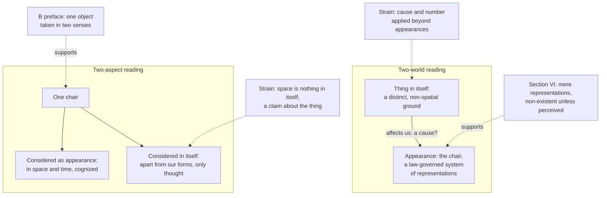

# Modern Philosophy · Lesson 6.1: Transcendental idealism and the thing in itself

> ⏱ ~15 min · Module 6: The limits of reason, and two ways past Kant · Builds on: [5.2 Space and time](05-02-space-and-time-the-transcendental-aesthetic.md), [5.4 The transcendental deduction](05-04-the-transcendental-deduction.md) · Unlocks: [6.2 The soul and the antinomies](06-02-the-soul-and-the-antinomies.md), [6.4 Hegel: dialectic and spirit](06-04-hegel-dialectic-and-spirit.md)

## Why this matters

Module 5 showed what the mind contributes: space and time as forms of intuition ([5.2](05-02-space-and-time-the-transcendental-aesthetic.md)), the categories as rules of synthesis ([5.3](05-03-concepts-and-the-categories.md), [5.4](05-04-the-transcendental-deduction.md)). The price was always the same clause: what we know this way, we know only as it appears to us. This lesson asks what that clause means. What is an "appearance"? What is the "thing in itself" it is contrasted with? Are they two things, or one thing seen two ways? Kant's first readers could not agree, and neither can his best modern ones. The answer shapes what follows: the Dialectic ([6.2](06-02-the-soul-and-the-antinomies.md)), and the whole post-Kantian revolt ([6.4](06-04-hegel-dialectic-and-spirit.md)).

## The idea

[Transcendental idealism](../reference.md#transcendental-idealism) is two claims held together. **Everything we can know is appearance**: objects as they are given in space and time and thought through the categories. **Appearances are empirically real**: tables, planets and the inhabitants of the moon, if experience could ever lead us to them, are as real as anything gets ([empirical reality and transcendental ideality](../reference.md#empirical-reality-and-transcendental-ideality)). The idealism is "transcendental" because it concerns the conditions of knowing, not the existence of bodies. In a footnote to the Antinomy, Kant says he has elsewhere called it *formal* idealism, to set it apart from the *material* idealism that doubts or denies external things.

The [thing in itself](../reference.md#thing-in-itself) is whatever appears, taken apart from the conditions under which it can appear to us. We cannot know it, since knowing needs intuition and our only intuition is sensible. But Kant insists we can *think* it.

The chapter on phenomena and noumena gives the limit an image. The understanding's territory is an island, the land of truth, ringed by a stormy ocean of illusion where fog-banks look like new countries (A235/B294). Then Kant splits the word "noumenon" in two ([noumenon, negative and positive](../reference.md#noumenon-negative-and-positive)):

> "If, by the term noumenon, we understand a thing so far as it is not an object of our sensuous intuition, thus making abstraction of our mode of intuiting it, this is a noumenon in the negative sense" (B307, Meiklejohn).

The **positive** sense would be an object of a non-sensuous, *intellectual* intuition, which we lack and whose very possibility we cannot conceive. So only the negative sense is licensed. It is "merely a limitative conception and therefore only of negative use". *In words:* "noumenon" marks where our knowledge stops; it names no second realm we could survey from the far side. (Whether you can draw a limit without standing beyond it is Hegel's challenge in [6.4](06-04-hegel-dialectic-and-spirit.md).)

## Source

Kant, *Critique of Pure Reason*, Antinomy of Pure Reason, Section VI, "Transcendental Idealism as the Key to the Solution of Pure Cosmological Dialectic" (A490–494/B518–522, Meiklejohn trans.):

> In the transcendental æsthetic we proved that everything intuited in space and time, all objects of a possible experience, are nothing but phenomena, that is, mere representations; and that these, as presented to us—as extended bodies, or as series of changes—have no self-subsistent existence apart from human thought. This doctrine I call Transcendental Idealism. [...] The non-sensuous cause of these representations is completely unknown to us and hence cannot be intuited as an object. For such an object could not be represented either in space or in time; and without these conditions intuition or representation is impossible. We may, at the same time, term the non-sensuous cause of phenomena the transcendental object—but merely as a mental correlate to sensibility, considered as a receptivity.

Three things to notice. **"Nothing but phenomena, that is, mere representations"** sounds as if appearances are states of the mind, and so distinct from whatever lies behind them. **"As presented to us"** qualifies the denial of self-subsistence: perhaps bodies lack it only *as presented*. The same sentence feeds both readings below. And **"non-sensuous cause"** applies the concept of cause beyond the sensible, where Module 5 said the categories have no cognitive use. Kant hedges at once ("merely as a mental correlate"). Whether the hedge is enough is the [affection problem](../reference.md#affection-problem).

## The argument

Transcendental idealism, assembled from the Aesthetic, the Analytic and the B preface.

1. **Space and time are the forms of our sensible intuition**, not properties of things in themselves ([5.2](05-02-space-and-time-the-transcendental-aesthetic.md)).
2. **Cognition of an object needs both an intuition and a concept** ([5.3](05-03-concepts-and-the-categories.md)).
3. **The categories have cognitive use only when applied to what is given in space and time** ([5.4](05-04-the-transcendental-deduction.md)). *In words:* "cause" and "substance" earn their keep on sensible material and nowhere else.
4. **∴ We cognize objects only as they are given under our forms**: as appearances.
5. **What is given under our forms is not, as such, how anything is apart from them.** *In words:* the form contributed by the receiver tells you about the receiver.
6. **∴ We have no cognition of things as they are in themselves.**
7. **Yet an appearance must be an appearance of something.** Otherwise there would be appearance with nothing that appears, which Kant calls absurd (Bxxvi).
8. **∴ Things in themselves must be thought, though not cognized.** *In words:* the concept is a limit, used negatively.
9. **∴ C: Everything knowable is appearance, empirically real and transcendentally ideal; things in themselves are thinkable and unknowable.**

**Two readings of the result** ([two-world and two-aspect readings](../reference.md#two-world-and-two-aspect-readings)).

- **Two-world.** Appearances and things in themselves are numerically distinct. Appearances are representations, or law-governed systems of them. Things in themselves are their unknown, non-spatial grounds. Its texts: the Source's "mere representations", and Section VI's claim that phenomena not given in perception do not exist at all. P. F. Strawson (*The Bounds of Sense*, 1966) read Kant roughly this way and rejected the doctrine so read. Its main problem: it must call things in themselves *causes* of appearances, and count them, which is just what premise 3 forbids.
- **Two-aspect.** There is one set of things, considered in two ways: as they appear, under the conditions of our sensibility, and as they are in themselves, in abstraction from those conditions. Its texts: the B preface's talk of one object taken in two senses (see P1), and the note at Bxviii–xix on regarding things from a "double point of view". Henry Allison (*Kant's Transcendental Idealism*, 1983) is its standard statement, after Graham Bird (1962) and Gerold Prauss (1974). Its main problem: Kant says space is *nothing* in itself, a claim about the things, not just about how we consider them. If "in itself" only means "considered apart from our forms", it is hard to see how Kant earns that claim, or why the doctrine is more than a truism.
- A third family, **one world, two kinds of property** (Rae Langton, *Kantian Humility*, 1998), takes things in themselves to be the same things, with intrinsic properties we cannot know, behind the relational ones we do.

**Where the argument is weakest.** Premise 7 and its conclusion 8. F. H. Jacobi, in an appendix to *David Hume on Faith* (1787), put the problem in a form that stuck. Paraphrased: without the thing in itself affecting our senses he could not enter Kant's system, and with it he could not remain inside. Kant needs something to give sensibility its matter, so he says things in themselves affect us, as the Prolegomena does: "I grant by all means that there are bodies without us, that is, things which, though quite unknown to us as to what they are in themselves, we yet know by the representations which their influence on our sensibility procures us" (§13, Remark II, Carus). But "influence" is causation, and premise 3 confines causation to appearances. The defender's reply draws on Kant's thinking/knowing distinction. The categories can still be used to *think*, without contradiction, though not to cognize, so "ground" or "cause" applied to the thing in itself is a thought, not a claim to knowledge. The critic answers that "there are bodies without us" is not a mere thought: it asserts existence.

## The picture

Solid arrows show what each reading posits; dashed arrows show its best text and its main strain.

## Worked examples

**Example 1 (clean: Kant's rainbow).** In the General Remarks to the Aesthetic (§8), Kant says we rightly call the rainbow a mere appearance and the rain the thing in itself, so long as "thing in itself" is meant in a *physical* sense: what holds under all conditions of perception. Now ask the *transcendental* question. The raindrops are appearances too. So are their round shape and the space they fall through. The transcendental object stays unknown. The lesson: there are two contrasts. The empirical one, between perspective-bound looks and the stable physical object, falls *inside* appearance and is what science sharpens. The transcendental one sets the whole of appearance, physics included, against things apart from our forms.

**Example 2 (hard: what affects us?).** Sensibility is receptive, so something must affect it. Run the candidates.

- *Empirical objects.* The table affects my eyes. True in physics, but the table is already an appearance, so it cannot be what first supplies appearance with its matter. Erich Adickes (1929) proposed "double affection": empirical objects affect the empirical self, and things in themselves affect the self in itself. Critics reply that this doubles the problem.
- *Things in themselves.* This is Kant's usual language, and Jacobi's target.
- *Nothing outside the mind.* Then appearances are the mind's own states with no ground. That is the material idealism Kant repudiates, and it is the charge of the 1782 Göttingen review (written by Christian Garve and cut by J. G. H. Feder), which likened the *Critique* to Berkeley's idealism. The *Prolegomena* Appendix answers it.

Each reading meets the problem differently. The two-world reader must defend a non-categorial "grounding" between two sets of entities. The two-aspect reader says only that the very things we perceive, considered apart from our forms, are not known as they are. That is cheaper, but still owes an account of "affect". G. E. Schulze's *Aenesidemus* (1792) pressed the objection hard. The first systematic responses dropped the thing in itself. Fichte's *Foundations of the Entire Wissenschaftslehre* (1794) derived what limits the self from the self's own activity, and Schelling's *System of Transcendental Idealism* (1800) tried to derive nature and self from one activity.

## Watch out

- **You might think transcendental idealism is Berkeley's.** Berkeley ([3.4](03-04-berkeley-immaterialism.md)) says bodies are collections of ideas and that their being is to be perceived. Kant says bodies exist outside us in space as appearances of something we cannot know, and that space is an a priori form of intuition, not an idea of sense. In §8 of the Aesthetic he even blames Berkeley's idealism on treating space as a property of things in themselves. Whether the two-world reading can keep that difference clear is a fair question. Kant's own answer is not in doubt.
- **You might think "noumenon" names a hidden world Kant claims to know about.** The positive sense is exactly the one he refuses. In the Phenomena and Noumena chapter he calls a division of the world into a sensible and an intelligible world quite inadmissible in a positive sense.
- **Anachronism: "appearances are sense data behind a veil."** "Sense data" is a twentieth-century term, and the "veil of ideas" is a worry read into Locke ([3.2](03-02-locke-qualities-substance-and-essence.md)). Appearances are not copies that might misrepresent hidden originals. Nothing is claimed to *resemble* the thing in itself, so there is no veil to see through, and no "inaccurate picture" either.

## One-liner

> We know things only as they appear under our forms, and we must think, but cannot know, what appears; whether that is a second thing or the same thing considered otherwise is the oldest quarrel in Kant scholarship.

## Problems

**P1 (🟢) *(Exegetical.)*** Close reading. *Critique of Pure Reason*, Preface to the Second Edition (Bxxvi–xxviii, Meiklejohn trans.). In the omitted lines Kant imagines that his critique had not been written, so that causality held of all things without distinction.

> At the same time, it must be carefully borne in mind that, while we surrender the power of *cognizing*, we still reserve the power of *thinking* objects, as things in themselves. For, otherwise, we should require to affirm the existence of an appearance, without something that appears—which would be absurd. [...] I should then be unable to assert, with regard to one and the same being, e.g., the human soul, that its will is *free*, and yet, at the same time, subject to natural necessity [...]. Suppose now, on the other hand, that we *have* undertaken this criticism, and have learnt that an object may be taken in *two senses*, first, as a phenomenon, secondly, as a thing in itself; and that, according to the deduction of the conceptions of the understanding, the principle of causality has reference only to things in the first sense.

(a) Does "an appearance, without something that appears" by itself decide between the two-world and two-aspect readings? Say what it commits Kant to and what it leaves open. (b) Which words favour the two-aspect reading, and why? (c) Does the passage claim that we *know* things in themselves exist? Two sentences per part.

**P2 (🟡) *(Exegetical (a) · Evaluative (b).)*** Apply to a hard case. A carpenter builds a chair on Monday and burns it on Friday. A student asks: "What happened to the chair as it is in itself?" (a) Answer as a two-world reader and as a two-aspect reader would, using this lesson's terms (two sentences each). (b) Which reading has more trouble with the case on Kant's own premises? Any verdict; 100 words or fewer.

**P3 (🔴, optional) *(Exegetical.)*** Find the crux. Two invented commentators agree that things in themselves exist, that we cannot cognize them, and that space and time are forms of our intuition. One holds the two-world reading, the other the two-aspect reading. Name the single claim on which they split, say which one apparent point of agreement is *not* the crux, and name one text that each side must explain away. 120 words or fewer.

Solutions

**P1** *(Exegetical, strict)*

**Must hit, strict (a):**

- It commits Kant to this: appearances are appearances *of* something, and denying that is absurd. So the concept of a thing in itself cannot be dropped.
- It does not decide between the readings. Both accept it. The two-world reader takes the "something" to be a distinct entity; the two-aspect reader takes it to be the very object that appears, considered apart from our forms.

**Must hit, strict (b):**

- "One and the same being" and "an object may be taken in *two senses*, first, as a phenomenon, secondly, as a thing in itself".
- These locate the distinction in how *one* object is taken, not in a pair of objects.

**Must hit, strict (c):**

- No. Cognizing is "surrender[ed]"; only "the power of *thinking*" them is reserved.
- But the absurdity argument pushes toward more than a thought: if there are appearances, something appears. That is the tension Jacobi presses.

**Wrong turns:** reading (a) as proof of the two-world view, because "something that appears" sounds like a second thing. Answering (c) "yes" because Kant says it would be absurd to deny something appears: the passage frames this as what we must *think*.

**Model answer:** (a) It commits Kant to appearances being appearances of something, so the thing in itself cannot be dropped. It leaves open whether that something is a second entity or the same object considered apart from our forms. (b) "One and the same being" and "an object may be taken in two senses". These put the difference in two ways of taking one object. (c) No: knowing is surrendered and only thinking is kept. The absurdity argument, though, leans toward asserting that something appears, and that is the gap Jacobi exploits.

---

**P2** *(Exegetical (a) · Evaluative (b))*

**Must hit, strict (a):**

- *Two-world:* the chair, Monday to Friday, is an appearance: a law-governed system of representations in time. Its ground is distinct and not in time, so it was neither made on Monday nor destroyed on Friday. We cannot even say one thing in itself corresponds to this one chair, since counting uses a category.
- *Two-aspect:* "the chair in itself" is this same chair, considered apart from our forms. Making and burning are temporal predicates, and time is our form of intuition. So the question asks what happened to the chair in a way of considering it that excludes happening. We can think the chair so; we cannot cognize anything about it.

**Must hit, any verdict (b):** name one specific cost for each reading in this case and weigh them.

- Two-world: the relation between the timeless ground and a chair that begins and ends, and how grounds are individuated without categories.
- Two-aspect: an identity claim. "The same chair" is made and burned, yet as it is in itself it is not in time. The defender's reply is that there are not two things whose persistence could come apart. There is one thing, and temporal predicates belong to it only as it appears.

**Wrong turns:** answering "the chair in itself is the atoms, which survive as ash". Atoms are in space and time, so they are appearances in the transcendental sense, as in the rainbow example. Making either reading say the chair in itself was destroyed.

**Model answer (b), one of several:** The two-world reading has more trouble. It must pair a chair that begins and ends with a ground that does neither. Yet Kant forbids applying cause, unity and plurality to grounds, so even "one ground per chair" is unsayable. The two-aspect reading only has to say that temporal predicates hold of the chair as it appears. Its cost is real: it must explain how Kant can then assert that the chair, in itself, is *not* in time. But this case does not press that cost. It presses individuation, and the two-world reading has no categorial way to answer it.

---

**P3** *(Exegetical, strict on naming one claim)*

**Must hit, strict:**

- The crux: whether "appearance" and "thing in itself" pick out **numerically distinct entities** or the **same entities**, considered in two ways. Put differently: is the distinction ontological or a distinction between two standpoints on one object?
- Not the crux: whether things in themselves exist, or whether we can know them. Both say they exist and cannot be known (the stem says so).
- Texts to explain away. *Two-aspect must explain:* Section VI's "mere representations", or phenomena "non-existent" unless given in perception (also the Source's "nothing but phenomena"). *Two-world must explain:* the B preface's "one and the same being" taken "in two senses", or the Bxviii note's "double point of view", or the Prolegomena's bodies as "the appearance of the thing which is unknown to us".

**Wrong turns:** naming "whether things in themselves exist" (both accept it). Naming "whether space is ideal" (both accept it too).

**Model answer:** They split on whether appearances and things in themselves are two sets of entities or one set considered two ways. They do not split on whether things in themselves exist or can be known; both affirm the first and deny the second. The two-aspect reader must explain Section VI, where appearances are "mere representations" that do not exist unless perceived. The two-world reader must explain the B preface, where "one and the same being" is "taken in two senses".

## Flashback

**From Lesson [5.4](05-04-the-transcendental-deduction.md) (The transcendental deduction and the "I think"):** *(Diagnose.)* An invented study note on the B deduction:

> "(1) Kant's 'deduction' does for the categories what Locke's history of ideas did for empirical concepts: it traces where they come from, only to the self rather than to the senses. (2) Its starting point is introspection: whenever I look inward I perceive one enduring 'I' alongside my perceptions, and that inner perception is what holds my experience together. (3) Kant admits he cannot say why our understanding has exactly these functions of judgment and no others. (4) Since the categories are the rules for uniting any representations at all, the deduction proves that cause and substance hold of everything that exists, things in themselves included."

(a) Three of the numbered sentences misread the deduction. For each, say what Kant holds instead and point to the passage that shows it. Two sentences each. (b) Which sentence is accurate, and which step of the deduction does it bear on? One sentence.

Solution

**Must hit, strict (a):**

- **(1)** confuses the question of right with the question of fact. A deduction in the jurists' sense shows title to use a concept, not its origin (A84–85/B116–117). Kant says Locke's "physiological derivation" "cannot properly be called deduction, because it relates merely to a quaestio facti" (Meiklejohn's §9). Tracing the categories to the forms of judgment is the metaphysical deduction of [5.3](05-03-concepts-and-the-categories.md).
- **(2)** confuses empirical with transcendental apperception. Empirical consciousness "is in itself fragmentary and disunited" (§16, B133). The unity is not perceived by looking inward but made by an act of combination (B130, B133). The "I think" is "a thought, not an intuition" (B157), consciousness only "that 'I am'".
- **(4)** overreaches. The deduction's second step ties the categories to our intuition in space and time (§26), and its conclusion is that they hold a priori of every object of *possible experience* and give knowledge of nothing else (§§26–27). Things in themselves can be thought through them, not known.

**Must hit, strict (b):**

- Sentence (3), which is B145–146: why we have "precisely so many functions of judgement and no more" cannot be explained. It bears on premises 5–6, the step from "combination needs rules" to *these twelve* rules, which is the part Strawson dropped.

**Wrong turns:** flagging (3) as an error on the ground that the table of judgments explains the number. The metaphysical deduction takes those functions as given, and B145–146 says their number cannot be explained further. Correcting (2) by saying Kant denies any consciousness of self. He grants that I am conscious "that 'I am'", and denies only that this is an intuition of what I am. Correcting (1) by saying "deduction" means a logical derivation. It means a legal title.

**Model answer:** (a) (1) A transcendental deduction answers the question of right, not of origin (A84–85/B116–117). Kant calls Locke's derivation no deduction at all, since it concerns only a *quaestio facti*. (2) Inner perception is "fragmentary and disunited" (B133). The unity of the "I" is made by an act of combining, and the "I think" is "a thought, not an intuition" (B157). (4) The categories are shown to hold only of objects of possible experience, given in space and time (§§26–27). Of things in themselves they yield thought without knowledge. (b) Sentence (3), Kant's admission at B145–146, which bears on the step from unity by rules to these twelve particular rules (premises 5–6).

## Connections

- **Backward:** the forms of intuition and empirical reality with transcendental ideality are [5.2](05-02-space-and-time-the-transcendental-aesthetic.md), whose "neglected alternative" (space might be both our form *and* real in itself) returns here as the two-aspect reading's main problem. The thinking/knowing line rests on the categories' restriction to experience in [5.3](05-03-concepts-and-the-categories.md) and [5.4](05-04-the-transcendental-deduction.md). The "experiment" of the [Copernican revolution](../reference.md#copernican-revolution) in [5.1](05-01-the-critical-question.md) is completed by the B preface's claim that it is confirmed by distinguishing two ways of taking objects. The idealism Kant disowns is Berkeley's ([3.4](03-04-berkeley-immaterialism.md)), and the "veil of ideas" is a worry read into Locke ([3.2](03-02-locke-qualities-substance-and-essence.md)).
- **Forward:** transcendental idealism is "the key" to the antinomies in [6.2](06-02-the-soul-and-the-antinomies.md), and the third antinomy uses the thing in itself to make room for freedom. Hegel's charge that a limit known is already passed is [6.4](06-04-hegel-dialectic-and-spirit.md). Husserl's "to the things themselves" is read against the thing in itself in [`phenomenology-and-personalism`](../../phenomenology-and-personalism/syllabus.md) 1.2.
- **Sideways:** Langton's reading, that we know things only by their relations and powers and never their intrinsic natures, is a cousin of epistemic structural realism in [`philosophy-of-science`](../../philosophy-of-science/syllabus.md) 5.3. Whether that is the right account of physics is argued there, not here. Kant's ethics, for which the B preface says this distinction makes room, is taught in [ethics Module 2](../../ethics/lessons/02-01-the-good-will-and-acting-from-duty.md).
