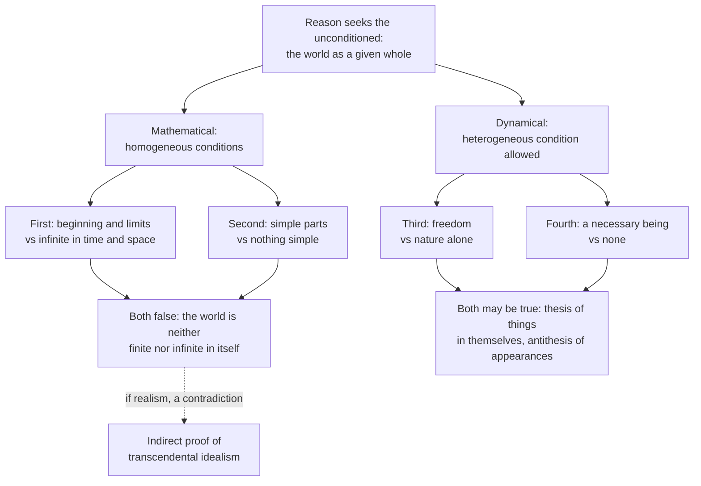

# Modern Philosophy · Lesson 6.2: The Dialectic: the soul and the antinomies

> ⏱ ~15 min · Module 6: The limits of reason, and two ways past Kant · Builds on: [1.2 The cogito and the wax](01-02-the-cogito-and-the-wax.md), [5.4 The transcendental deduction](05-04-the-transcendental-deduction.md), [6.1 Transcendental idealism and the thing in itself](06-01-transcendental-idealism-and-the-thing-in-itself.md) · Unlocks: [6.3 The critique of the proofs of God](06-03-the-critique-of-the-proofs-of-god.md)

## Why this matters

The Analytic showed that the categories hold for objects of possible experience. The Transcendental Dialectic asks what happens when reason uses them past that line, in three sciences of the schools: rational psychology (the soul), rational cosmology (the world as a whole) and rational theology (God, [6.3](06-03-the-critique-of-the-proofs-of-god.md)). The paralogisms answer the Cartesian soul of [1.2](01-02-the-cogito-and-the-wax.md); the antinomies show reason proving opposite conclusions with equal rigour. In a 1798 letter to Christian Garve, Kant said it was the antinomy, not God or immortality, that first woke him from his dogmatic slumber (paraphrased).

## The idea

The understanding judges: this event has that cause. Reason, the faculty of inference, keeps asking for the condition of the condition, until it reaches the **unconditioned**. As a rule for inquiry this is indispensable. The trouble starts when reason assumes that because something conditioned is given, the *whole* series of its conditions is given too, already complete in the object.

That assumption yields three ideas: the unconditioned subject of my thoughts (the **soul**), the unconditioned totality of appearances (the **world**) and the unconditioned condition of all things (**God**). None can be met in experience, so none can be known. Yet reason cannot stop thinking them, and the result is [transcendental illusion](../reference.md#transcendental-illusion). Unlike a fallacy, it does not vanish once exposed. Kant's analogy (Meiklejohn):

> even the astronomer cannot prevent himself from seeing the moon larger at its rising than some time afterwards, although he is not deceived by this illusion.

The cure is to keep the ideas but change their status ([regulative and constitutive](../reference.md#regulative-and-constitutive)). Used *constitutively*, an idea claims an object answers to it; used *regulatively*, it is a rule to seek further conditions and treat no stopping point as absolute.

## Source

Kant, *Critique of Pure Reason*, "Of the Paralogisms of Pure Reason", second edition (1787) text (Meiklejohn, public domain). Kant states rational psychology's argument for the soul's substantiality as a syllogism.

> That which cannot be cogitated otherwise than as subject, does not exist otherwise than as subject, and is therefore substance.
>
> A thinking being, considered merely as such, cannot be cogitated otherwise than as subject.
>
> Therefore it exists also as such, that is, as substance.
>
> In the major we speak of a being that can be cogitated generally and in every relation, consequently as it may be given in intuition. But in the minor we speak of the same being only in so far as it regards itself as subject, relatively to thought and the unity of consciousness, but not in relation to intuition, by which it is presented as an object to thought. Thus the conclusion is here arrived at by a Sophisma figurae dictionis.

Notice three things. The form is valid; a *transcendental* paralogism, Kant says, goes wrong in content, not form. The fault is a shifting middle term, "cannot be cogitated otherwise than as subject" (*sophisma figurae dictionis*, the fallacy of figure of speech, here an ambiguous middle). And the hinge word is **intuition**: the major is about things as they could be given to the senses, the minor about the "I" only as it occurs in thinking.

## The argument

**A. The paralogisms** ([paralogisms](../reference.md#paralogisms)). Rational psychology claims four things about the soul from the bare "I think", one per category heading ([5.3](05-03-concepts-and-the-categories.md)). Each time Kant grants an analytic truth about the I *in thought* and denies the synthetic claim about the *thing* that thinks.

| Rational psychology claims | Kant grants (analytic, about thought) | Kant denies (synthetic, about the object) |
|---|---|---|
| Substance | in judging, the I is always subject, never predicate | that I am a self-subsistent thing |
| Simple | the I of apperception is logically simple | that the thinking I is a simple substance |
| Identical over time | one and the same I in all my representations | identity of a persisting substance (personality) |
| Distinct from bodies | I distinguish myself from things outside me, my body included | that I could exist as a thinking being without a body |

The first paralogism, reconstructed with its diagnosis:

1. **What can only be thought as subject exists only as subject, and so is substance.** *In words:* the major is about any object, as it could be given in intuition.
2. **The thinking I can only be thought as subject.** *In words:* in "I think x", the I is never the predicate. This is true, but only of the I *as it figures in thought*.
3. **∴ The thinking I is substance.**
4. **But "substance" yields knowledge only when applied to something permanent given in intuition** (the schema of substance, [5.3](05-03-concepts-and-the-categories.md)).
5. **In inner sense nothing permanent is given;** the I of apperception is a form of thought, a transcendental subject = x known only through its thoughts ([unity of apperception](../reference.md#unity-of-apperception)).
6. **∴ "Subject" means something different in 1 and in 2, and 3 does not follow.** *In words:* from the logical role of the I in thinking, nothing follows about what kind of being thinks.

Kant does *not* conclude that the soul is material: since the I is never given as an object, "if materialism is inadequate to explain the mode in which I exist, spiritualism is likewise as insufficient". Rational psychology survives only as a discipline that blocks both.

**B. The antinomies** ([antinomies](../reference.md#antinomies)). Applied to the world, reason produces four pairs of proofs, again one per category heading. Each proof is indirect, refuting the opposite.

| | Thesis | Antithesis |
|---|---|---|
| 1 (quantity) | The world has a beginning in time and limits in space. | It has neither; it is infinite in both. |
| 2 (quality) | Every composite substance consists of simple parts. | Nothing in the world is simple. |
| 3 (relation) | Besides natural causality there is a causality of freedom. | Everything happens by laws of nature alone. |
| 4 (modality) | An absolutely necessary being exists, in or as cause of the world. | None exists, in the world or out of it. |

The diagnosis, common to all four:

1. **Both sides assume that the world, the complete series of conditions, is given as a whole in itself** (transcendental realism, which 6.1 rejects).
2. **On that assumption, thesis and antithesis are contradictories, and each proof is valid.**
3. **Drop the assumption (appearances exist only in the empirical regress), and the pairs relate differently** by kind of synthesis.
4. **Mathematical antinomies (1–2):** the conditions are homogeneous, each a member of the series. Both sides make a positive claim about the world's magnitude, which is not given in itself. **∴ Both are false.** Kant's model is "every body smells good" against "every body smells bad": both are false of a body with no smell. Such a pair is *dialectically*, not *analytically*, opposed.
5. **Dynamical antinomies (3–4):** causal and existential series admit a heterogeneous condition, one not itself a member of the series. **∴ Both may be true:** the thesis of things in themselves, the antithesis of appearances.

**The third antinomy, resolved.** Every event in nature has a preceding cause by a rule ([5.5](05-05-the-second-analogy.md)), so the antithesis holds without exception of appearances. But the same agent may also be thought under an *intelligible character*. As a thing in itself it is not in time, so it is not subject to the law that every beginning has a prior cause. The same act is then necessary as appearance and may be free in relation to its intelligible ground ([third antinomy](../reference.md#third-antinomy)). Hence Kant's claim that "if phenomena are things in themselves, freedom is impossible". He claims to show neither the reality nor even the possibility of freedom, only its consistency with nature. What freedom does in ethics is [`ethics`](../../ethics/lessons/02-01-the-good-will-and-acting-from-duty.md) Module 2's question.

**An indirect proof.** Kant draws a bonus from the mathematical antinomies. If the world were a whole in itself, it would be finite or infinite. Neither holds. So it is not a whole in itself: a second route to [transcendental idealism](../reference.md#transcendental-idealism), besides the Aesthetic's ([5.2](05-02-space-and-time-the-transcendental-aesthetic.md)).

**Where the argument is weakest.** The indirect proof needs premise 2 of Part B: every proof, thesis and antithesis, must be valid given realism. If any one fails, the dilemma never closes. Schopenhauer's appendix to *The World as Will and Representation* charged that the thesis proofs were sophisms and only the antitheses sound (paraphrased). Russell's *Problems of Philosophy* (1912, ch. XIV) went further: after Cantor, infinite collections are "not in fact self-contradictory", so the first thesis fails. A Kantian replies that the thesis never calls an infinite set inconsistent; it says an infinite series cannot have been *completed by successive synthesis*, which concerns how a world could be given, not sets.

## The map

Solid arrows sort the conflicts and give each its verdict; the dashed edge is Kant's bonus argument.

## Worked examples

**Example 1 (clean: the first antinomy, start to finish).** *Thesis proof:* without a beginning, an infinite series of states would have elapsed before now, but an infinite series can never be completed by successive synthesis. *Antithesis proof:* with a beginning, an empty time preceded it, and no moment of empty time favours being over not-being, so nothing could arise. The space halves run in parallel. Both work if the world is a whole given in itself, which Kant denies. Appearances exist only in the never-complete regress from a given state to its conditions, so "finite" and "infinite" both assign a magnitude to something without one. What survives is the regulative rule: seek a further condition, and treat no found limit as absolute. Kant's illustration is tracing the ancestors of people now living. You cannot say the line is infinite, only that you must keep looking (*in indefinitum*).

**Example 2 (hard: Mendelssohn's proof of immortality).** Moses Mendelssohn's *Phaedon* (1767) argued that a simple soul, which cannot come apart, cannot simply cease either: between the instant it is and the instant it is not there would be no time, which is impossible. The second edition answers him directly. Grant simplicity. A simple being has no extensive magnitude (parts outside parts), but it still has *intensive* magnitude, a degree, and consciousness itself has degrees. A degree can shrink through infinitely many smaller degrees to nothing (Kant's word is *elanguescence*), so permanence is undemonstrated and indemonstrable. Here the critique strains: Kant's reply uses a claim about the soul, that consciousness comes in degrees. Has he said more about the thinking thing than the paralogisms allow? The defender answers that a counter-possibility is enough to block a proof. Kant does not assert that the soul fades, only that "simple, therefore permanent" does not follow.

## Watch out

- **You might think "antinomy" means a contradiction in things, but for Kant it is a conflict of reason with itself,** produced by a natural illusion. In the mathematical pair neither side is true, and in the dynamical pair both may be. Neither case is a true contradiction about objects.
- **You might think Kant's footnote settles the cogito dispute of 1.2, but it does not.** Kant says "I exist" cannot be inferred from "I think" as, he says, Descartes held, since the two are identical. That is Kant reading Descartes as an inferentialist; the Second Replies deny the syllogism too. Calling the I = x a "self-model" imports a modern frame.

## One-liner

> Reason demands the unconditioned and mistakes its demand for knowledge: the "I" of thought is taken for a simple substance, and the world for a given whole, whose finitude and infinity are then both "proved".

## Problems

**P1 (🟢) *(Exegetical.)*** Close reading. *Critique of Pure Reason*, Paralogisms, second edition (Meiklejohn). This is the second of the four analytic propositions Kant grants.

> 2. That the I or Ego of apperception, and consequently in all thought, is singular or simple, and cannot be resolved into a plurality of subjects, and therefore indicates a logically simple subject—this is self-evident from the very conception of an Ego, and is consequently an analytical proposition. But this is not tantamount to declaring that the thinking Ego is a simple substance—for this would be a synthetical proposition. The conception of substance always relates to intuitions, which with me cannot be other than sensuous, and which consequently lie completely out of the sphere of the understanding and its thought: but to this sphere belongs the affirmation that the Ego is simple in thought. It would indeed be surprising, if the conception of "substance," [...] should be presented immediately to me, as if by revelation, in the poorest mental representation of all.

(a) Which proposition does Kant grant, which does he refuse, and why does one count as analytic and the other synthetic? (b) What is "the poorest mental representation of all", and why does its poverty matter to the argument? (c) Which Cartesian argument from [1.4](01-04-the-real-distinction-and-the-interaction-problem.md) does this passage bear on, and what part of that argument's premise does it leave standing? Two sentences per part.

**P2 (🟡) *(Exegetical (a)–(b) · Evaluative (c).)*** The second antinomy. (a) Give the thesis proof and the antithesis proof in outline, two or three numbered steps each. (b) Kant says both conclusions are false. Using his smell example, say why this does not break the law of excluded middle, and name the assumption both proofs share. (c) A Leibnizian replies: "My simples, the monads, are not in space at all, so your antithesis proof (every part of a composite occupies a space) never touches them." Does this reply rescue the thesis, or does it concede Kant's point? Any verdict; 100 words or fewer for (c).

**P3 (🔴, optional) *(Exegetical.)*** Diagnose. An invented lecture handout says:

> "In the paralogisms Kant proves that we have no soul. Descartes thought the 'I think' revealed a simple, immortal substance; Kant shows that the 'I' is only a logical placeholder, so there is nothing to us but a stream of representations: Hume's bundle theory in new vocabulary."

(a) Name two errors, citing what Kant actually says. (b) Name one thing the handout gets right. 150 words or fewer in all.

Solutions

**P1** *(Exegetical, strict.)*

**Must hit, strict (a):** granted: the I of apperception is logically simple, a single subject that cannot be split into many. This is analytic because it is contained in the very concept of an "I". Refused: that the thinking I is a simple *substance*. That claim is synthetic because "substance" adds something the concept of the I does not contain, and it needs intuition.

**Must hit, strict (b):** the bare "I" (the "I think"), which carries no content of its own. Its poverty is the point: substance, a concept that needs intuition to apply even to matter, cannot be handed to us for free by the emptiest representation we have.

**Must hit, strict (c):** the divisibility argument of Meditation VI: the mind, considered as thinking, has no parts, while body is always divisible, so they differ in nature ([divisibility argument](../reference.md#divisibility-argument)). Kant leaves standing that in thought I find no parts and am one subject. He denies that this licenses "the mind is a simple, indivisible substance", which the argument needs.

**Wrong turns:** reading the passage as asserting that the soul is composite. It says only that whether the subject is simple or composite is not known this way. Picking the conceivability argument for (c): it turns on separability, not on having no parts.

**Model answer:** (a) Kant grants that the I is a logically simple subject, which is analytic because it follows from the concept of an I. He refuses that it is a simple substance, which is synthetic because substance relates to intuition and goes beyond the concept. (b) The bare "I" of "I think", with no content. Since it is the emptiest representation, it cannot deliver substance, a concept that needs a permanent intuition to apply. (c) Descartes's divisibility argument. Kant grants that I find no parts in myself as thinking, but denies that this shows a simple substance distinct from divisible body.

---

**P2** *(Exegetical (a)–(b) · Evaluative (c).)*

**Must hit, strict (a):**

- Thesis: suppose composites do not consist of simples. Remove all composition in thought and nothing would remain. But composition is only a contingent relation among substances, which must subsist without it. ∴ composites consist of simples.
- Antithesis: composition of substances is possible only in space. Space has no simple parts, only spaces, so every part of a composite occupies a space. Whatever occupies a space has parts outside parts, so it is composite. ∴ a simple part would be composite, a contradiction, and nothing in the world is simple.

**Must hit, strict (b):**

- "Every body smells good" and "every body smells bad" are contrary, not contradictory: both are false of a body with no smell. The contradictory of "smells good" is "does not smell good", and that includes the odourless.
- The shared assumption: the composite in the world is given as a whole in itself, with its division already complete. Without that, it is neither made of finitely many simples nor infinitely divided *in itself*. Its parts exist only in the regress of division.

**Must hit, any verdict (c):**

- Say what the reply denies: the antithesis premise that composition of substances is possible only in space.
- Say what the move costs. Simples outside space are not parts of anything given in appearance. In a mathematical series the condition must be of the same kind as the conditioned. So the thesis is no longer about "every composite substance *in the world*" of appearance.
- Then decide: the reply rescues a different thesis (about things in themselves), or it concedes Kant's verdict on the original one.

**Wrong turns:** saying Kant thinks one of the two is true. Treating (b)'s answer as "the proofs are invalid", when Kant says they are valid on the shared assumption. In (c), applying the dynamical resolution (both true) to a mathematical antinomy.

**Model answer (c), one of several:** The reply denies the antithesis's first premise, that composition happens only in space. But that move takes the simples out of the series of appearances. The thesis said every composite substance *in the world* consists of simples, and the world here is the spatial one whose parts are given in division. Monads outside space are not parts of that composite, so the thesis as stated is not rescued. What survives is a claim about things in themselves, which Kant says can be thought but not known. So the reply concedes the mathematical verdict, though it keeps Leibniz's metaphysics as an unprovable thought.

---

**P3** *(Exegetical, strict.)*

**Accept:** any two of the errors below, each tied to Kant's text; any one of the correct points in (b).

**Must hit, strict (a):**

- Kant does not prove there is no soul. He shows that its nature cannot be known from the "I think". Materialism "is inadequate", and "spiritualism is likewise as insufficient": the discipline guards against both.
- "Nothing but a stream of representations" is itself a claim about what the self is. Kant declines it, as he declines simplicity. And the I of apperception is not one more perception in a bundle. It is the form of thought that must be able to accompany all of them ([5.4](05-04-the-transcendental-deduction.md)), which Hume's search did not find ([4.4](04-04-the-self-belief-and-the-passions.md)).
- (Also acceptable.) Kant does not refute immortality. He shows that Mendelssohn's proof fails, and he points knowledge of ourselves toward a practical use.

**Must hit, strict (b):** the I in rational psychology is a "transcendental subject of thought = x", known only through its thoughts, so "logical" is fair for the I *in thought*. Or: Kant does deny that Descartes's route from "I think" to a simple thinking substance yields knowledge.

**Wrong turns:** "correcting" the handout by saying Kant proved the soul is immortal. Treating the bundle view as Kant's because both deny an *observed* self.

**Model answer:** (a) First, Kant proves no negative: the "I think" cannot show what we are, so materialism fails as much as spiritualism, and rational psychology is a discipline against both. Second, the "stream of representations" view is another claim about the self's nature, and Kant refuses it too. The I of apperception is not a perception in a bundle but the form any of my representations must be able to take ("I think"). (b) The handout is right that the I, in thought, is a bare subject = x known only through its thoughts, and that Descartes's inference to a simple substance fails.

## Flashback

**From Lesson [5.5](05-05-the-second-analogy.md) (The Second Analogy: Kant's reply to Hume):** *(Exegetical.)* Counterexample. An invented forum post:

> "Kant's ship test is broken. From a train window I watch an avenue of trees go by: the oak, then the elm, then the beech. Given the train's direction, I could not have seen the elm before the oak, so my apprehension is irreversible, exactly as with the ship. Yet the trees stand side by side and nothing happens to them. Irreversible order, no event."

Answer on Kant's own terms. (a) What objective succession does the irreversible order track here? (b) What in the case shows that the trees themselves coexist? Two sentences per part.

Solution

**Must hit, strict (a):**

- The fixed order is bound by a real event: the train's (and so the viewer's) change of place along the avenue, which follows by a rule on something in the preceding state.
- As with the ship, the subjective sequence of apprehension is derived from an objective sequence of phenomena. Here that sequence is the train's successive positions, not any change in the trees. Irreversibility shows that *something* happens; it does not say that every item perceived is the thing that alters.

**Must hit, strict (b):**

- The mark of coexistence is an order of perceptions that could run either way, as with the house. Here the order is fixed only by the train's direction: a train going the other way, or a walker going back down the avenue, meets the beech first. So the trees' order is reversible in principle, while the order of the train's positions is not.
- Kant states this mark in the Third Analogy: things are coexistent when "the perception of the one can follow upon the perception of the other, and vice versa" (Meiklejohn).

**Wrong turns:** conceding that Kant must count the trees as an event. Denying the stipulated irreversibility ("just turn your head"): it dodges the case, and Kant's reply does not need it. Answering with Strawson's two necessities, which is a different charge, about inferring causal necessity, not about which succession has been perceived.

**Model answer:** (a) The irreversible order tracks an event, the train's movement along the avenue, so the oak-elm-beech sequence of my perceptions is derived from the train's successive positions, as the ship's perceived order is derived from the ship's movement. The test shows that something in the phenomena binds my apprehension; it does not say the trees are what changes. (b) The order of the trees is fixed only relative to the train's direction: going the other way, I would meet the beech first, so the perceptions could follow each other either way. That reciprocity is Kant's mark of coexistence, so the trees coexist and the event is the train's.

## Connections

- **Backward:** the soul under attack is Descartes's thinking thing ([1.2](01-02-the-cogito-and-the-wax.md)), with the divisibility argument for its distinctness from body ([1.4](01-04-the-real-distinction-and-the-interaction-problem.md)). Locke's person is the target of the third paralogism's distinction between identity in thought and identity of substance ([3.3](03-03-locke-personal-identity.md)). The second antinomy's thesis is what Kant calls the dialectical principle of Monadology ([2.3](02-03-leibniz-sufficient-reason-and-monads.md)), and the third reopens freedom in a fully determined nature after Spinoza ([2.2](02-02-spinoza-mind-body-and-necessity.md)). The antithesis of the third is the Second Analogy's rule ([5.5](05-05-the-second-analogy.md)), and the resolution needs transcendental idealism ([6.1](06-01-transcendental-idealism-and-the-thing-in-itself.md)).
- **Forward:** the third idea of reason, God, and the fourth antinomy's necessary being become the transcendental ideal of [6.3](06-03-the-critique-of-the-proofs-of-god.md). Hegel takes the antinomies as evidence that contradiction belongs to thought's own movement, not a sign to stop ([6.4](06-04-hegel-dialectic-and-spirit.md)). Nietzsche's attack on the "I think" is [6.5](06-05-nietzsche-perspectivism-and-genealogy.md).
- **Sideways:** the first thesis is the ancestor of the kalam's [traversal argument](../../philosophy-of-religion/lessons/02-05-cosmological-arguments-the-kalam.md). Free will and determinism as live problems are [`metaphysics` 6.1](../../metaphysics/lessons/06-01-determinism-and-the-consequence-argument.md), and the soul and dualism are [`philosophy-of-mind`](../../philosophy-of-mind/syllabus.md)'s.
