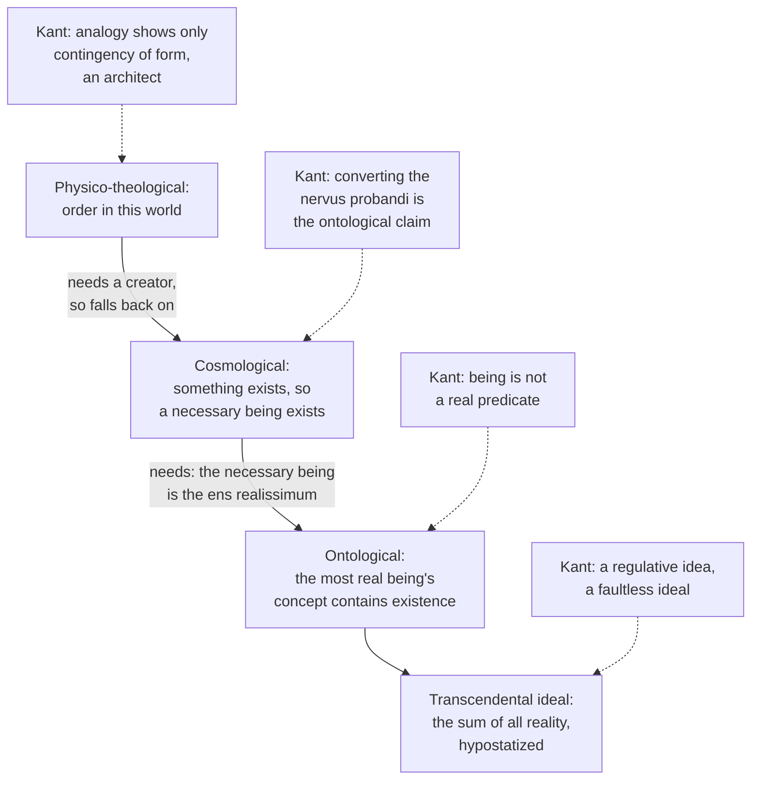

# Modern Philosophy · Lesson 6.3: The critique of the proofs of God

> ⏱ ~15 min · Module 6: The limits of reason, and two ways past Kant · Builds on: [6.2 The Dialectic: the soul and the antinomies](06-02-the-soul-and-the-antinomies.md), [6.1 Transcendental idealism and the thing in itself](06-01-transcendental-idealism-and-the-thing-in-itself.md), [1.3 God, clear and distinct ideas, and the circle](01-03-god-clear-and-distinct-ideas-and-the-circle.md) · Unlocks: [6.4 Hegel: dialectic and spirit](06-04-hegel-dialectic-and-spirit.md)

## Why this matters

Descartes's system hung on two proofs of God ([1.3](01-03-god-clear-and-distinct-ideas-and-the-circle.md)), and Leibniz's on a necessary being that gives the world its sufficient reason ([2.3](02-03-leibniz-sufficient-reason-and-monads.md)). The last chapter of the Dialectic, "The Ideal of Pure Reason", is Kant's audit of that whole tradition. He makes two claims. There are only three possible speculative proofs, and each of the two that start from experience secretly rests on the one that does not. Kant had already argued in 1763 that existence is not a predicate, while still offering an a priori proof of his own. By 1781 that proof, which reached God as the ground of all possibility, falls under the critique too. Whether any of these arguments succeeds today is [`philosophy-of-religion`](../../philosophy-of-religion/syllabus.md)'s question. This lesson asks how Kant's critique works inside his system.

## The idea

Start where [6.2](06-02-the-soul-and-the-antinomies.md) left reason: always asking for the unconditioned. Here the demand takes a new form. To think any thing as *completely determined*, I must in principle settle, for every possible predicate, whether it belongs to the thing. That presupposes the idea of a sum total of all possible reality, against which each thing is a limitation. A blind man has no notion of darkness without light, as Kant puts it, and so every negation is derived from some reality. So far this is only an idea reason needs. Then reason makes a slide. It treats that sum as a single individual, the *ens realissimum* or most real being. A footnote says the idea is first made objective, then hypostatized, then personified. The result is "God in its transcendental sense": the [transcendental ideal](../reference.md#transcendental-ideal). Kant calls the step from idea to existing individual unwarranted.

A second pressure meets the first. From "something exists" reason infers, naturally and almost irresistibly, that something exists *necessarily*. It then looks for a concept fit to bear necessity, and the most real being looks like the best candidate. Join the two and you have rational theology.

Kant counts the routes ([three speculative proofs](../reference.md#three-speculative-proofs)). Start from a *determinate* experience, the order of this world, and you have the physico-theological proof. Start from *indeterminate* experience, that anything exists at all, and you have the cosmological. Abstract from all experience, and you have the ontological. There can be no others, Kant says. He examines them in reverse order, because the idea of reason, not experience, steers all three.

## Source

Kant, *Critique of Pure Reason*, "Of the Impossibility of an Ontological Proof of the Existence of God" (Meiklejohn, public domain). Kant has just said that every example of absolute necessity offered so far is the necessity of a *judgment*, not of a thing.

> If, in an identical judgement, I annihilate the predicate in thought, and retain the subject, a contradiction is the result [...]. But if I suppress both subject and predicate in thought, no contradiction arises; for there is nothing at all, and therefore no means of forming a contradiction. To suppose the existence of a triangle and not that of its three angles, is self-contradictory; but to suppose the non-existence of both triangle and angles is perfectly admissible. And so is it with the conception of an absolutely necessary being. Annihilate its existence in thought, and you annihilate the thing itself with all its predicates; how then can there be any room for contradiction? [...] But when you say, God does not exist, neither omnipotence nor any other predicate is affirmed; they must all disappear with the subject, and in this judgement there cannot exist the least self-contradiction.

Three things to notice. The triangle is Descartes's own analogy from Meditation V, turned around: geometric necessity is *conditional*, binding a predicate to a subject only once the subject is posited. The argument does not yet mention "real predicates"; it works from the bare logic of denial. And it leaves one escape, which Kant takes up next: perhaps one concept, the most real being's, includes existence among its realities, so that denying it *is* contradictory.

## The argument

**A. The ontological proof** (Meditation V; Leibniz). The defender: the ens realissimum has all reality; existence is a reality; so denying its existence contradicts its concept. Kant's replies, in order:

1. **Rejecting subject and predicates together yields no contradiction** (the Source). *In words:* necessity inside a judgment never reaches the existence of its subject.
2. **"This thing exists" is either analytic or synthetic.** If analytic, existence was put into the concept at the start, and the conclusion is an empty tautology. If synthetic, it can be denied without contradiction.
3. **[Being is not a real predicate](../reference.md#being-is-not-a-real-predicate)** (A598/B626): "Being is evidently not a real predicate, that is, a conception of something which is added to the conception of some other thing." It is "merely the positing of a thing". A *real* predicate is a determination that enlarges a concept. "Exists" is a *logical* predicate only, and logic ignores content. Kant's illustration follows: in Meiklejohn's rendering, a hundred real "dollars" (Kant's *Taler*) contain no more than a hundred possible ones. If existing added content, what exists would not be what I conceived.
4. **∴ No concept, however rich, contains its object's existence.** Knowledge of existence comes only through connection with perception.

A footnote adds a fifth point aimed at Leibniz: a concept free of contradiction is *logically* possible, but that does not show its object is *really* possible. Whether ontological arguments can survive this is argued in [`philosophy-of-religion` 2.1](../../philosophy-of-religion/lessons/02-01-anselms-ontological-argument.md), which runs the thalers against Anselm.

**B. The cosmological proof** ([conversion objection](../reference.md#conversion-objection)), Leibniz's argument from the contingency of the world:

1. If something exists, an absolutely necessary being exists.
2. I, at least, exist.
3. ∴ An absolutely necessary being exists.
4. A necessary being must be completely determined by its concept alone.
5. Only the concept of the ens realissimum determines a thing completely a priori.
6. ∴ Every absolutely necessary being is an ens realissimum.

Kant calls 6 the *nervus probandi*, the sinew of the proof. It is an affirmative judgment, so it converts: *some* ens realissimum is necessary. Since no ens realissimum differs from another, *every* ens realissimum is necessary, and that is settled by concepts alone. "But this is exactly what was maintained in the ontological argument." Experience took the argument one step, to *some* necessary being. Identifying that being with God was done by pure concepts. Kant lists other faults too, chief among them that the principle "everything contingent has a cause" has meaning only within sensible experience.

**C. The physico-theological proof** ([architect not creator](../reference.md#architect-not-creator)). From order, purposiveness and the analogy of nature with "a house, a ship, or a watch", infer a wise and free cause. Kant treats it with respect, as the oldest and clearest of the three, but says it fails twice. The analogy shows that the *form* of the world is contingent, not its *matter*, so it reaches at most an architect working with given material, not a creator. And "very great" or "immeasurable" power and wisdom fix no determinate concept. Only the concept of all reality does. To get there, the physico-theologian abandons experience, infers the world's contingency and argues to a necessary being, so the cosmological proof takes over, and behind it the ontological.

**D. What is left.** The ideal keeps a [regulative](../reference.md#regulative-and-constitutive) use: philosophize upon nature "as if there existed a necessary primal basis of all existing things, solely for the purpose of introducing systematic unity into your knowledge". For speculative reason God is "a mere ideal, though a faultless one", and its objective reality "can neither be proved nor disproved". The same arguments that block the proof block atheistic denial. The moral argument of the *Critique of Practical Reason* (1788) is where Kant sends the question next; it belongs to [`philosophy-of-religion` 3.3](../../philosophy-of-religion/lessons/03-03-moral-arguments.md).

**Where the argument is weakest.** The weak point is B's "dependence" claim. A defender replies that the cosmological proof gets existence from experience (B2), not from a concept. At most it *shares a premise* with the ontological proof, namely that the concept of the most real being and the concept of a necessary being coincide. It does not borrow the inference from concept to existence. Kant can grant this and say the shared premise is enough. Section A showed that no concept contains existence, so a premise saying one concept contains *necessary* existence inherits that failure. A second line of defence denies Kant's meaning of "necessary": "reason recognizes that alone as absolutely necessary which is necessary from its conception". A Leibnizian can say the necessary being is one "which has the reason of its existence in itself" (*Monadology* §45), not a concept whose denial is contradictory. Kant's charge holds only if that alternative collapses back into his own sense.

## The argument map

Solid arrows run from each proof to what it needs. Dashed edges are Kant's objection at each step.

## Worked examples

**Example 1 (clean: Leibniz's shortcut).** *Monadology* §45 (Latta) says that God alone "has this prerogative that He must necessarily exist, if He is possible". Nothing can block the possibility of what involves no limits and no negation, so God's existence is known a priori. Run Kant on it. The second premise is the footnote's target: absence of contradiction gives *logical* possibility, and real possibility for a synthesis of realities needs principles of possible experience. Kant names Leibniz as having failed here. The first premise falls to A1–A3: granting the possibility, "must necessarily exist" is not a determination any concept can contain. Leibniz's route is open to two objections, and Kant presses both.

**Example 2 (hard: a cosmological argument that stops early).** An invented arguer concludes only that *something* exists necessarily, and declines to say it is the most real being. Perhaps it is matter, or the world as a whole. Does the conversion objection touch her? No. She never asserts the nervus probandi, so there is nothing to convert. Kant has other objections: the causal principle has no use beyond experience, and the regress may not complete. He even concedes, in Section III, that limited beings might be necessary for all we can tell. So the dependence on the ontological proof is aimed at arguments that end in *God*, not at every argument to a necessary being. That limit is why [`philosophy-of-religion` 2.4](../../philosophy-of-religion/lessons/02-04-cosmological-arguments-sufficient-reason.md) treats the identification step as a separate gap problem.

## Watch out

- **Misquotation: "existence is not a predicate."** Kant says being is not a *real* predicate. He allows that it is a logical predicate, since in logic anything, even the subject itself, can be predicated. And Meiklejohn's "dollars" are Kant's *Taler*; "a hundred thalers" is the usual English tag, not Meiklejohn's word.
- **You might think the critique argues for atheism.** Kant says the same considerations show speculative reason cannot *disprove* a supreme being. His target is the claim to theoretical knowledge, and he keeps the idea as regulative.
- **Anachronism: Paley's watch.** Kant's watch belongs to eighteenth-century physico-theology; Paley's *Natural Theology* came out in 1802. Reading Kant's necessity as "true in all possible worlds" is also a modern gloss. His test is contradiction among pure concepts.

## One-liner

> Experience can take reason to *some* necessary being and to an architect of order, but only the concept of a most real being makes either God, and no concept contains its object's existence: being is not a real predicate.

## Problems

**P1 (🟢) *(Exegetical.)*** Close reading. Kant, "Of the Impossibility of a Cosmological Proof" (Meiklejohn).

> If the proposition: "Every absolutely necessary being is likewise an ens realissimum," is correct (and it is this which constitutes the nervus probandi of the cosmological argument), it must, like all affirmative judgements, be capable of conversion [...]. It follows, then, that some entia realissima are absolutely necessary beings. But no ens realissimum is in any respect different from another, and what is valid of some is valid of all. In this present case, therefore, I may employ simple conversion, and say: "Every ens realissimum is a necessary being." But as this proposition is determined à priori by the conceptions contained in it, the mere conception of an ens realissimum must possess the additional attribute of absolute necessity. But this is exactly what was maintained in the ontological argument, and not recognized by the cosmological, although it formed the real ground of its disguised and illusory reasoning.

(a) Which words license the move from "some" to "every", and what do they claim? (b) Why does the converted proposition count as "determined à priori", by the passage's own logic? (c) A study guide says: "Kant shows the cosmological argument just *is* the ontological argument, deriving God's existence from a concept." Using the passage, say what the guide gets right and what it overstates. Two sentences per part.

**P2 (🟡) *(Exegetical (a) · Evaluative (b).)*** Reconstruct. Kant, "Of the Impossibility of a Physico-Theological Proof" (Meiklejohn):

> According to the physico-theological argument, the connection and harmony existing in the world evidence the contingency of the form merely, but not of the matter, that is, of the substance of the world. To establish the truth of the latter opinion, it would be necessary to prove that all things would be in themselves incapable of this harmony and order, unless they were, even as regards their substance, the product of a supreme wisdom. But this would require very different grounds of proof from those presented by the analogy with human art. This proof can at most, therefore, demonstrate the existence of an architect of the world, whose efforts are limited by the capabilities of the material with which he works, but not of a creator of the world, to whom all things are subject.

(a) Put Kant's objection into numbered premises and a conclusion, in his terms. (b) A defender says: "An architect wise and powerful enough to order *this* world is God enough for religion." Does Kant's critique still bite on his own premises? Any verdict; 120 words or fewer.

**P3 (🔴, optional) *(Exegetical.)*** Find the crux. Leibniz, *Monadology* §40 (Latta): "this supreme substance, which is unique, universal and necessary, nothing outside of it being independent of it, [...] must be illimitable and must contain as much reality as is possible." Kant, in the section on the speculative proofs, grants that a necessary being exists for the sake of argument and still says "we are free to consider all limited beings as likewise unconditionally necessary". Name the single premise on which they split, say what grounds Leibniz's side of it, and say what would move each. 150 words or fewer.

Solutions

**P1** *(Exegetical, strict.)*

**Must hit, strict (a):**

- "no ens realissimum is in any respect different from another, and what is valid of some is valid of all." The concept of the most real being is completely determined, so it picks out at most one possible thing. Whatever holds of some ens realissimum holds of every one.

**Must hit, strict (b):**

- The original proposition (step B6) was reached from concepts alone: necessity requires complete determination, and only the ens realissimum is completely determined a priori. So its converse is a relation between two concepts, and the concept of the ens realissimum contains absolute necessity.

**Must hit, strict (c):**

- Right: the cosmological argument's ground is the proposition the ontological argument maintained, that the mere concept of the most real being carries necessary existence ("the real ground of its disguised and illusory reasoning").
- Overstated: the passage locates the dependence in that *proposition*, not in a derivation of existence from the concept. The cosmological argument still takes "something necessary exists" from experience.

**Wrong turns:** reading "simple conversion" as a general logical licence. "Every A is B" does not in general convert to "every B is A", which is why Kant needs the uniqueness clause. Saying the passage refutes the cosmological argument on its own. Its force depends on Section IV having shown that no concept contains existence.

**Model answer:** (a) "No ens realissimum is in any respect different from another": the concept is completely determined, so it fits at most one thing, and "some" becomes "every". (b) The nervus probandi was got from concepts alone, so its converse is a conceptual truth too. That makes necessity part of the concept of the most real being. (c) Right that the cosmological argument rests on the ontological argument's key proposition, that this concept contains necessary existence. Overstated, because the passage is about that shared proposition, and the cosmological argument still takes the existence of some necessary being from experience.

---

**P2** *(Exegetical (a) · Evaluative (b).)*

**Accept:** any order of premises that keeps form/matter, the limit of the analogy, and architect/creator.

**Must hit, strict (a):**

- P1: The physico-theological argument reasons by analogy with human art from the order of the world to its cause.
- P2: The order of the world shows only that its *form* (connection and harmony) is contingent.
- P3: To show that its *matter* or substance is contingent, one would need to show that things in themselves could not be ordered unless their substance were produced by supreme wisdom.
- P4: The analogy with human art cannot show this, since human artisans order material they did not make.
- ∴ C: The argument reaches at most an architect limited by the material, not a creator, and so not an all-sufficient being.

**Must hit, any verdict (b):**

- State what the defender concedes: the conclusion is less than the ens realissimum.
- Test it against Kant's further premise that predicates such as "very great" give no *determinate* concept. Only all reality is determinate, and Kant says a theology that is to ground religion needs a determinate concept.
- Decide whether Kant's demand for determinacy is fair to the defender's aims, or whether the defender has changed what the proof was meant to prove.

**Wrong turns:** answering with Darwin or fine-tuning, which is [`philosophy-of-religion` 3.1](../../philosophy-of-religion/lessons/03-01-from-design-to-fine-tuning.md)'s question, not Kant's. Saying Kant rejects the argument's worth. He commends it as an aid to the study of nature and rejects only its claim to demonstrate.

**Model answer (b), one of several:** It still bites, but less. Kant would grant that the defender has a sound inference to a powerful designer, if the analogy holds. His complaint is that "powerful enough for this world" is relative to the observer and fixes no determinate concept. A being that is very wise might still be limited, plural, or dependent on matter it did not make. If religion needs a creator to whom all things are subject, the defender has proved too little. If it needs only an object of reverence, Kant's objection becomes a complaint about the label "God", and the defender can accept it.

---

**P3** *(Exegetical, strict on naming one premise.)*

**Must hit, strict:**

- The crux: *whether a necessary being, as such, must be unlimited in reality*, or whether limitation is compatible with unconditioned necessity.
- Leibniz's ground: the principle of sufficient reason ([2.3](02-03-leibniz-sufficient-reason-and-monads.md)). Nothing outside the necessary being is independent of it, so nothing could limit it. A limit with no reason would violate the PSR.
- What would move each: Kant would be moved if "necessary" could be shown to entail "unlimited" by concepts alone, but that is the conversion he says leads back to the ontological claim. Leibniz would be moved if the PSR were shown to apply only within possible experience, which is Kant's restriction on all such principles.

**Wrong turns:** naming "whether a necessary being exists", which Kant grants here for the sake of argument. Treating Kant as asserting that limited beings *are* necessary. He says only that nothing in their concept rules it out.

**Model answer:** They split on whether whatever exists necessarily must contain all reality. Leibniz says yes. A necessary being has nothing outside it independent of it, so nothing could set its bounds. A limit would need a reason, and by the principle of sufficient reason there can be none. Kant grants that a necessary being exists and denies the step. That a limited being's concept contains no ground of necessity does not show it is contingent, so limited beings could be necessary as far as concepts tell us. Leibniz would have to give up the PSR's reach beyond experience, Kant's general restriction. Kant would have to accept a purely conceptual route from necessity to all reality. He thinks no such route exists without the ontological claim.

## Flashback

**From Lesson [6.1](06-01-transcendental-idealism-and-the-thing-in-itself.md) (Transcendental idealism and the thing in itself):** *(Exegetical.)* Close reading. Kant, *Prolegomena*, Appendix (Carus trans.), answering the 1782 Göttingen review that likened the *Critique* to Berkeley's idealism. Kant first gives the formula of "all genuine idealists from the Eleatic school to Bishop Berkeley":

> "All cognition through the senses and experience is nothing but sheer illusion, and only, in the ideas of the pure understanding and reason there is truth." The principle that throughout dominates and determines my Idealism, is on the contrary: "All cognition of things merely from pure understanding or pure reason is nothing but sheer illusion, and only in experience is there truth." [...] Space and time, together with all that they contain, are not things nor qualities in themselves, but belong merely to the appearances of the latter: up to this point I am one in confession with the above idealists.

In the next lines Kant says Berkeley took space to be an empirical presentation, known only through perception, whereas he proves it is a pure form of our sensibility, known a priori. (a) Which cognition does Kant's own formula call "sheer illusion", and what does reversing the idealists' formula show about what his idealism concerns? (b) What does Kant share with Berkeley, and why, by Kant's lights, does their difference over space decide which of them leaves experience a mere illusion? Two sentences per part.

Solution

**Must hit, strict (a):**

- Illusion attaches to "cognition of things merely from pure understanding or pure reason": claims to know things through concepts alone, with no sensible intuition. That is the use of the categories beyond possible experience, which 6.1's argument rules out.
- The reversal puts truth in experience and illusion in pure reason, the opposite of the idealists. So Kant's idealism concerns the forms under which anything can be known (space and time), not the reality of what the senses give: it is formal, not material, idealism, and appearances are empirically real.

**Must hit, strict (b):**

- Shared: space, time and everything in them are not things or qualities in themselves but belong only to appearances (transcendental ideality).
- The difference decides it because a priori forms, together with the categories, give experience universal and necessary laws, and those laws are the criterion that separates truth from illusion *within* experience. If space is only an empirical presentation, as Kant reads Berkeley, nothing a priori underlies experience, so it has no criterion of truth and is left as illusion.

**Wrong turns:** reading "only in experience is there truth" as Kant giving up a priori knowledge. The a priori forms are what make truth in experience possible; the formula condemns only cognition of things from pure reason *alone*. Reading "up to this point I am one in confession" as an admission that Kant is a Berkeleyan: the agreement stops at the ideality of space and time. Answering (b) only with "Berkeley denies bodies, Kant affirms them". That is 6.1's contrast, but the question asks for the reason Kant gives here, which runs through the a priori status of space.

**Model answer:** (a) Kant's formula calls illusory any cognition of things from pure understanding or pure reason alone, without sensible intuition. Reversing the idealists' formula shows that his idealism concerns the forms under which things can be known, not whether sensed bodies are real: truth lies in experience, which is empirically real. (b) He shares the claim that space, time and all they contain are not things or qualities in themselves but belong only to appearances. Because for Kant space and time are a priori forms, they give experience (with the categories) universal and necessary laws that separate truth from illusion within it, whereas Berkeley's merely empirical space leaves experience no such criterion, so on Kant's account it is Berkeley who makes experience illusion.

## Connections

- **Backward:** the Source turns Descartes's triangle analogy from [1.3](01-03-god-clear-and-distinct-ideas-and-the-circle.md) against the [Cartesian ontological argument](../reference.md#cartesian-ontological-argument), which Kant calls "the celebrated ontological or Cartesian argument". The cosmological proof is Leibniz's, from the [principle of sufficient reason](../reference.md#principle-of-sufficient-reason) in [2.3](02-03-leibniz-sufficient-reason-and-monads.md). Spinoza's I p11 in [2.1](02-01-spinoza-one-substance.md) is a cousin. Reason's demand for the unconditioned and transcendental illusion come from [6.2](06-02-the-soul-and-the-antinomies.md). That knowledge of existence goes only as far as possible experience is the boundary of [6.1](06-01-transcendental-idealism-and-the-thing-in-itself.md), and existence is one of the modal categories of [5.3](05-03-concepts-and-the-categories.md).
- **Forward:** [6.4](06-04-hegel-dialectic-and-spirit.md) asks what Hegel rejects in Kant's limits. The moral argument Kant turns to is [`philosophy-of-religion` 3.3](../../philosophy-of-religion/lessons/03-03-moral-arguments.md).
- **Sideways:** whether the predicate objection defeats Anselm, and what chapter 3 and Plantinga's modal version make of it, is [`philosophy-of-religion` 2.1](../../philosophy-of-religion/lessons/02-01-anselms-ontological-argument.md)–[2.2](../../philosophy-of-religion/lessons/02-02-the-modal-ontological-argument.md). The identification step is [2.4](../../philosophy-of-religion/lessons/02-04-cosmological-arguments-sufficient-reason.md)'s gap problem, and design after Darwin is [3.1](../../philosophy-of-religion/lessons/03-01-from-design-to-fine-tuning.md). The Kant–Frege line on existence, and why it does not touch the Thomist real distinction, is [`metaphysics` 2.5](../../metaphysics/lessons/02-05-essence-and-existence.md). That "ontological argument" is Kant's label, not Anselm's, is [ancient-medieval-philosophy 6.1](../../ancient-medieval-philosophy/lessons/06-01-anselm-and-the-proslogion-as-history.md).
