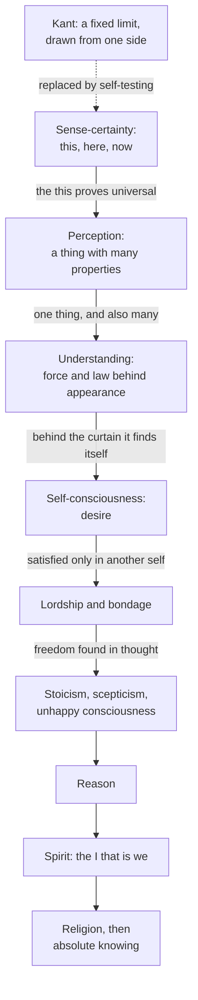

# Modern Philosophy · Lesson 6.4: Hegel: dialectic and spirit

> ⏱ ~15 min · Module 6: The limits of reason, and two ways past Kant · Builds on: [6.1 Transcendental idealism and the thing in itself](06-01-transcendental-idealism-and-the-thing-in-itself.md), [6.2 The Dialectic: the soul and the antinomies](06-02-the-soul-and-the-antinomies.md) · Unlocks: [6.5 Nietzsche: perspectivism and genealogy](06-05-nietzsche-perspectivism-and-genealogy.md)

## Why this matters

Kant ended the first *Critique* with a boundary: knowledge reaches as far as possible experience, and things in themselves can be thought but not known ([6.1](06-01-transcendental-idealism-and-the-thing-in-itself.md)). Within a generation his successors had stopped accepting it. Fichte and Schelling tried to rebuild philosophy from a single first principle. G. W. F. Hegel (1770–1831) went furthest. In the *Phenomenology of Spirit* (1807) he argued that a boundary drawn around knowledge from one side cannot be drawn at all, and that knowing is a process that tests and corrects itself until it meets nothing alien. The vocabulary he built for that process (determinate negation, *Aufhebung*, *Geist*) passed to Marx and the social theorists, and its title word to the phenomenologists.

## The idea

Hegel's Introduction starts from Kant's caution and turns it over. Before we try to know what truly is, shouldn't we examine our knowing? Picture knowledge as an **instrument** we apply to reality, or a **medium** its light passes through. Either way we get the thing as the tool has altered it. Subtract the tool's effect and you are back where you began, knowing nothing. On that picture, knowledge of the real is impossible by construction.

So Hegel asks what the picture presupposes. It assumes knowledge on one side and the real on the other, and that knowledge cut off from the real can still know its own limits *truly*. That is the Source's target.

His second move concerns limits as such. In the *Encyclopaedia* (§60, paraphrased from Wallace's translation) he says no one knows or even feels that something is a limit or defect unless he is already beyond it: to call knowledge finite, you must have the unlimited in view. The *Phenomenology* puts it as a fact about consciousness: in setting up something limited, it sets up what lies beyond along with it, and so is driven past every resting place. A fence known as a fence has already been seen over. Kant's answer is the negative sense of [noumenon](../reference.md#noumenon-negative-and-positive), set out under "Where the argument is weakest".

What replaces the inspection of the tool? Consciousness carries its own standard. It always distinguishes what it *knows* of an object from what the object *is in itself*, and both sides fall inside consciousness. So no outside criterion is needed. We watch consciousness compare its knowledge with its own standard. When they fail to match, it alters its knowledge, and the object changes too, since the old "in itself" was only the object as that knowledge took it. Hegel calls this movement *experience*. For natural consciousness it is a road of despair, since it loses its truth at every stage. Contrast Descartes's doubt ([1.1](01-01-the-method-of-doubt.md)), which suspends beliefs in order to recover them. Hegel's scepticism never returns to its starting point.

The crucial claim is that a failure is never a bare zero. The sceptic sees only nothing in a refutation. Hegel calls the true result [determinate negation](../reference.md#determinate-negation): the nothing *of what it came from*, which therefore has a content. Because *this* standard failed in *this* way, a definite new shape of consciousness takes its place. What happens to the old shape is *aufheben*, a verb whose everyday senses are "abolish" and "keep" (literally, "pick up"). Baillie renders it "supersede" ([Aufhebung](../reference.md#aufhebung)):

> to supersede (*aufheben*) is at once to negate and to preserve.

Two slogans from the Preface name where the road ends. "The truth is the whole": a result is true only together with the path that produced it, as the fruit replaces the blossom yet needs it. And everything depends on grasping the ultimate truth

> not as Substance but as Subject as well.

Spinoza ([2.1](02-01-spinoza-one-substance.md)) was right that reality is one, and wrong to make it inert. Reality is an activity that develops and comes to know itself. Once self-consciousness learns that it depends on other selves, Hegel's name for that activity is [Geist](../reference.md#geist), spirit (Baillie: "Mind"), an "Ego that is 'we,' a plurality of Egos, and 'we' that is a single Ego."

## Source

Hegel, *Phenomenology of Mind*, Introduction (tr. J. B. Baillie, 1910, public domain; OCR corrected). Hegel has just described the picture of knowledge as instrument or medium.

> Meanwhile, if the fear of falling into error introduces an element of distrust into science [...], it is not easy to understand why, conversely, a distrust should not be placed in this very distrust, and why we should not take care lest the fear of error is not just the initial error. As a matter of fact, this fear presupposes something, indeed a great deal, as truth [...]. It starts with ideas of knowledge as an instrument, and as a medium [...]. More especially it takes for granted that the Absolute stands on one side, and that knowledge on the other side, by itself and cut off from the Absolute, is still something real; in other words, that knowledge, which, by being outside the Absolute, is certainly also outside truth, is nevertheless true—a position which, while calling itself fear of error, makes itself known rather as fear of the truth.

Three things to notice. The argument is a tu quoque: critique claims to presuppose nothing, and Hegel lists what it presupposes. Kant is not named; the target is a picture of knowledge, and how closely it fits Kant is itself disputed. And the last clause names the incoherence: a knowledge "outside truth" that is "nevertheless true" of its own limits.

## The argument

**A. Against the one-sided limit** (Introduction; *Encyclopaedia* §60).

1. **Kant: our knowledge reaches only appearances; the [thing in itself](../reference.md#thing-in-itself) is thought, not known.**
2. **To assert this is to claim to know how our knowing stands to what lies beyond it.** *In words:* "we cannot know X" is itself a claim about X's relation to us.
3. **To know a limit as a limit, one must already have in view what lies past it.** *In words:* only someone who sees both sides can see a line as a line.
4. **∴ Either Kant's limit is known, and knowledge has already passed it, or it is not known, and the claim of limitation is ungrounded.**

**B. The alternative: consciousness tests itself.**

5. **Consciousness distinguishes its knowledge of an object (being-for-it) from the object's being in itself (truth), and both fall within consciousness.** *In words:* it brings its own yardstick.
6. **When knowledge and standard fail to match, consciousness alters its knowledge, and the object, as it took it, alters with it.**
7. **The failure is determinate: the failure of *this* standard, so it has a content.**
8. **∴ A definite new shape of consciousness arises from each failed one, and the series ends only where knowledge and object correspond: absolute knowing.**

**Where the argument is weakest.** Premise 3, and the step from 6 to 8. On 3, the Kantian reply runs through 6.1. The negative noumenon is only the thought of something *not* an object of our sensible intuition, a limiting concept. To know that our intuition is sensible needs only the thought that some other kind is possible, not knowledge of anything beyond. So Kant claims to know the *character* of our knowing, not what lies past it. Hegel's side answers that even this contrast credits knowledge with a truth about the unknowable, which is the Source's charge. On 6–8, critics from Adolf Trendelenburg (*Logical Investigations*, 1840) on have asked whether the transitions are necessary or are rhetorical bridges supplied by the author. Defenders reply that each step needs only the failed shape's own standard, and Hegel invites the reader to check every one.

## The picture

Each solid arrow is a determinate negation: a shape fails by its own standard, and the way it fails fixes the next shape. The dashed edge marks what Hegel puts in place of Kant's examination of the faculties.

## Worked examples

**Example 1 (clean: sense-certainty).** The first shape claims the richest knowledge there is: *this*, here, now, grasped immediately, with no concepts. Hegel tests it by its own standard. Asked what the Now is, it answers that it is night. Write that truth down; a truth loses nothing by being kept. At noon it has gone stale. Yet the Now has not vanished: it persists as what is neither night nor day, indifferent to both. Something that is through negation, this and that equally, is a *universal*. So sense-certainty's own test shows that what it knew was not the singular it *meant* but a universal it can only *say*. That is [sense-certainty](../reference.md#sense-certainty) refuted by determinate negation. The result is not "nothing is known", but "what is known is a universal". The next shape, perception, takes things as bearers of universal properties.

**Example 2 (hard: lordship and bondage).** Self-consciousness needs another self-consciousness to recognize it. Each tries to prove it is more than mere life by risking its life, and each seeks the other's death. If one dies, nothing is proved, and Hegel says so: death is *abstract* negation, not the kind that cancels while preserving. So one side yields, preferring life, and becomes the bondsman; the other becomes the master ([lordship and bondage](../reference.md#lordship-and-bondage)). Then the reversal. The master's recognition comes from a consciousness he has reduced to a thing, so it is worthless to him, and his enjoyment of things passes as it is consumed. The bondsman, in fear and service, works on things and finds himself in what he makes.

Here the method strains. Which side yields looks contingent, not fixed by a failed standard. Readers divide on what kind of claim the section makes. Alexandre Kojève's Paris lectures (1933–39, published 1947) read it as an anthropology: the desire for recognition drives human history. Others read it as one stage in the education of self-consciousness, with no historical thesis, which the next shapes (Stoicism and scepticism) leave behind. Baillie's 1910 headnote takes servitude in all its forms as the background. The text supports the structure of the reversal; it does not decide whether the struggle is history, logic or both.

## Watch out

- **You might think Hegel's formula is "thesis, antithesis, synthesis", but he never uses it of his own method.** ([Thesis, antithesis, synthesis](../reference.md#thesis-antithesis-synthesis).) Kant's antinomies pair thesis with antithesis ([6.2](06-02-the-soul-and-the-antinomies.md)), the triadic vocabulary is Fichte's, and the historian Heinrich Moritz Chalybäus popularized it as a description of Hegel (Gustav Mueller's 1958 article calls the attribution a legend). In the Preface Hegel praises Kant's "triplicity" ([5.3](05-03-concepts-and-the-categories.md)) as rediscovered by instinct, but attacks its use as a lifeless schema. A shape is not combined with an opposite brought in from outside. It breaks down on its own terms, and *Aufhebung* keeps what survives. That is not compromise.
- **You might think *Geist* is a ghostly world-mind floating above people, but the reading is disputed.** Charles Taylor's *Hegel* (1975) reads it as a cosmic subject coming to know itself, and the Preface's talk of the life of God supports him. Robert Pippin (*Hegel's Idealism*, 1989) and Terry Pinkard (*Hegel's Phenomenology: The Sociality of Reason*, 1994) read it as the self-correcting social practice of giving reasons, and the Ego that is a we supports them. The words do not settle it.
- **Anachronism: Hegel's "phenomenology" is not Husserl's.** For Hegel it is the science of knowledge as it *appears*, the path of consciousness to absolute knowing. Husserl's descriptive method ([`phenomenology-and-personalism`](../../phenomenology-and-personalism/syllabus.md)) borrows the word, not the system.

## One-liner

> Hegel replaces Kant's fence around knowledge with a road: each shape of consciousness fails by its own standard, the failure has a content, and what it negates it also keeps, until spirit knows itself as the whole.

## Problems

**P1 (🟢) *(Exegetical.)*** Close reading. Hegel, *Phenomenology of Mind*, "Lordship and Bondage" (Baillie, 1910; OCR corrected). The master enjoys things; the bondsman works on them.

> Desire has reserved to itself the pure negating of the object and thereby unalloyed feeling of self. This satisfaction, however, just for that reason is itself only a state of evanescence, for it lacks objectivity or subsistence. Labour, on the other hand, is desire restrained and checked, evanescence delayed and postponed; in other words, labour shapes and fashions the thing. The negative relation to the object passes into the form of the object, into something that is permanent and remains [...]. This negative mediating agency, this activity giving shape and form, is at the same time the individual existence, the pure self-existence of that consciousness, which now in the work it does is externalised and passes into the condition of permanence. The consciousness that toils and serves accordingly comes by this means to view that independent being as its self.

(a) Why does the master's satisfaction fail to give him a lasting self, and why does labour succeed? Name the words that decide it. (b) Does this passage say the bondsman is now free? Point to the words that say what he gains. Two sentences per part.

**P2 (🟡) *(Exegetical (a) · Evaluative (b).)*** Diagnose. An invented study guide:

> Hegel's method is simple. Every idea (thesis) provokes its opposite (antithesis), and the two are merged in a compromise (synthesis) that keeps the best of each. In the *Phenomenology*, sense-certainty is the thesis, perception the antithesis, and understanding the synthesis. Hegel took the formula from Kant's antinomies and applies it mechanically throughout.

(a) Name three misreadings and correct each from this lesson. One or two sentences each. (b) A reader defends the guide: "Whatever the vocabulary, Hegel's steps do come in threes and the third does combine the first two, so the formula is a harmless simplification." Is it harmless? Any verdict; 120 words or fewer.

**P3 (🔴) *(Exegetical (a) · Evaluative (b).)*** Apply to a hard case. A defender of sense-certainty replies to Hegel's experiment: "Write down 'Now is 21:14 GMT on 7 October 2026'. That truth never goes stale." (a) By Hegel's own test, does this save sense-certainty? Say what it saves and what it gives up. Two sentences. (b) A critic presses further: "Hegel's experiment is a trick about language. 'Now' changes its reference with each use, and nothing is lost." Say what the critic must show to defeat Hegel's point, and how Hegel would answer. Any verdict; 120 words or fewer.

Solutions

**P1** *(Exegetical, strict.)*

**Must hit, strict (a):**

- The master's enjoyment is pure negation of the thing: it consumes it, so the satisfaction is "only a state of evanescence" and "lacks objectivity or subsistence". Nothing stays in which he could find himself.
- Labour is "desire restrained and checked": it shapes the thing instead of consuming it. The worker's negating activity "passes into the form of the object", into "something that is permanent and remains".

**Must hit, strict (b):**

- No. What he gains is self-recognition in his product: his self-existence is "externalised" in the work, and he comes "to view that independent being as its self".
- That is consciousness of having a self, not release from the master. The next paragraph adds that fear and service are also needed, and that without fear a "mind of its own" is mere stubbornness.

**Wrong turns:** reading the passage as a prediction of revolt or emancipation; nothing in it says the bondsman overthrows the master. Saying the master fails because he is idle. The text's reason is that consumed satisfaction has no permanence and the recognition he gets is from a thing-like consciousness.

**Model answer:** (a) Enjoyment consumes its object, so it is "evanescence" without "subsistence". Labour delays desire and puts the worker's activity into "the form of the object", which is "permanent and remains". (b) No: it says only that the worker comes "to view that independent being as its self", that is, he sees himself in what he made. Freedom of any kind comes later, and the next paragraph makes fear and service conditions of even this much.

---

**P2** *(Exegetical (a) · Evaluative (b).)*

**Must hit, strict (a):** any three of:

- Hegel does not use "thesis, antithesis, synthesis" of his method. The triad is Fichte's vocabulary, later attached to Hegel by popularizers such as Chalybäus.
- The next shape is not an outside opposite. A shape fails by its *own* standard, and the specific failure (determinate negation) yields the next shape.
- *Aufhebung* is not compromise. It negates and preserves: perception keeps sense-certainty's content, but as a universal.
- "Mechanically" inverts the Preface, which attacks the triplicity used as a lifeless schema, while crediting Kant with rediscovering it by instinct.
- Kant's antinomies do supply thesis and antithesis, but for Kant they are reason's illusion, resolved by transcendental idealism, not a method of advance.

**Must hit, any verdict (b):**

- Say what the formula leaves out: the source of each transition (internal failure by the shape's own standard) and its necessity.
- Test the claim of threes against the text. Some groupings are triadic (consciousness: sense-certainty, perception, understanding), but the whole sequence is not.
- Then judge whether the omission changes the method or only shortens it.

**Wrong turns:** answering (b) by repeating (a). The defender grants the vocabulary is not Hegel's. Calling the formula "wrong" because triads appear nowhere in Hegel; Hegel himself praises triplicity.

**Model answer (b), one of several:** Not harmless. The formula keeps the count and drops the mechanism. On Hegel's account, perception does not oppose sense-certainty; it is what sense-certainty turns into when its own test shows that its "this" is universal. A formula that brings in an outside opposite and splits the difference makes every step an arbitrary pairing, which is exactly the formalism the Preface condemns. It also invites checking Hegel by counting rather than by asking whether each shape really fails by its own standard, which is the only test he accepts. As a memory aid for the three shapes of consciousness it does little damage. As an account of why the steps are necessary it gets the method wrong.

---

**P3** *(Exegetical (a) · Evaluative (b).)*

**Must hit, strict (a):**

- It saves a truth, but not sense-certainty. The timestamp holds only through universals and mediation (calendar, clock, time zone), which is Hegel's conclusion: the truth of sense-certainty is the universal.
- It gives up what sense-certainty claimed: immediate knowledge of the singular *this* moment it meant, with no concepts.

**Must hit, any verdict (b):**

- State the critic's point. Treating "now" as a word whose reference shifts with each use (a modern gloss: "indexical") explains why the sentence goes stale without anything being lost.
- Say what the critic must show: that the singular is *known* immediately, not just picked out by a context-dependent word; or that Hegel slides from what can be *said* to what can be *known*.
- Give Hegel's answer: sense-certainty claimed to know the singular itself. If knowing it needs a context, a rule for reference, or a point of view, the knowledge is mediated, which concedes the result.

**Wrong turns:** calling the timestamp a refutation of Hegel. It accepts his conclusion. Presenting "indexicals" as Hegel's own term, or as a concept he anticipated.

**Model answer (b), one of several:** The critic is right that "now" behaves like a modern indexical: its reference shifts with each use, and nothing goes missing. But that grants Hegel's point rather than refuting it. The word works through a general rule (refer to the time of utterance) applied to a context, so what is grasped is mediated. To beat Hegel the critic must show that the singular moment is *known* without any such rule: that pointing or bare acquaintance gives knowledge that a rule does not. Hegel considers pointing next and finds that it, too, yields a Now that is many Nows taken together. Whether bare acquaintance is knowledge at all is the real dispute, and it belongs to [`epistemology`](../../epistemology/syllabus.md).

## Flashback

**From Lesson [6.2](06-02-the-soul-and-the-antinomies.md) (The Dialectic: the soul and the antinomies):** *(Exegetical.)* Diagnose. An invented forum post on Kant's first antinomy:

> "The antinomies are optical illusions of reason, and the *Critique* is the debunking: once Kant shows how the trick works, it is gone, and no one need feel the pull of 'the world had a beginning' again. The trick is a bad proof. The thesis argument is the sophistical one, so Kant's own verdict is the antithesis: the world is infinite in time and space."

Name three misreadings and correct each from Kant's text as 6.2 presents it. One or two sentences each.

Solution

**Must hit, strict:**

- **Exposure does not end the illusion.** Logical illusion "totally disappears" once attention is drawn to the rule, but transcendental illusion "does not cease to exist, even after it has been exposed" (Meiklejohn). It is natural and unavoidable, like the moon that looks larger at its rising even to the astronomer, who is not deceived. Kant's own example of it in that passage is "The world must have a beginning in time."
- **The fault is not a bad proof.** Kant presents both proofs, thesis and antithesis, as valid on the assumption they share: that the world, the complete series of conditions, is given as a whole in itself (transcendental realism). The error lies in that assumption, not in either argument.
- **Kant's verdict is not the antithesis.** The first antinomy is mathematical, so both sides are false: the world is neither finite nor infinite in itself, because it is not given as a whole. Like "every body smells good" and "every body smells bad", the pair is contrary, not contradictory. What remains is the regulative rule to seek a further condition and treat no limit found as absolute.

**Wrong turns:** crediting the post's second and third sentences to Kant. They are close to Schopenhauer's charge (thesis proofs sophistical, antitheses sound), a critic's verdict on Kant. Applying "both may be true", the verdict Kant reserves for the dynamical antinomies, to the first. "Correcting" the post by giving Kant the thesis.

**Model answer:** First, transcendental illusion is not a trick that vanishes once explained. Unlike logical illusion, it persists after exposure, as the rising moon still looks larger to the astronomer, and "the world must have a beginning in time" is Kant's own example. Second, Kant does not fault either proof. Both are valid given the shared assumption that the world is a whole given in itself, and that assumption is the error. Third, he does not side with the antithesis. In a mathematical antinomy both claims are false, since the world is neither finite nor infinite in itself, and what survives is the rule to keep seeking conditions without end.

## Connections

- **Backward:** the target is Kant's limit and the thing in itself ([6.1](06-01-transcendental-idealism-and-the-thing-in-itself.md)). The antinomies of [6.2](06-02-the-soul-and-the-antinomies.md) set reason's contradictions out as thesis and antithesis; Hegel took such contradictions as the engine of thought rather than a sign that reason had overstepped. The "triplicity" he praises is the third-from-first-two pattern of Kant's categories ([5.3](05-03-concepts-and-the-categories.md)). "Substance as subject" is aimed at Spinoza's one substance ([2.1](02-01-spinoza-one-substance.md)). Hegel's scepticism that never returns is a contrast with Descartes's ([1.1](01-01-the-method-of-doubt.md)).
- **Forward:** [6.5](06-05-nietzsche-perspectivism-and-genealogy.md) gives the other way past Kant: Nietzsche denies there is a true world behind appearances at all, where Hegel denies that the line between them is fixed. Hegel's *Philosophy of Right* is [history-of-political-thought 6.1](../../history-of-political-thought/lessons/06-01-hegel-freedom-realized-in-the-state.md), and Marx's turn from Hegel is [6.5 there](../../history-of-political-thought/lessons/06-05-marx-from-hegel-to-historical-materialism.md). Husserl takes over the word "phenomenology" ([`phenomenology-and-personalism`](../../phenomenology-and-personalism/syllabus.md)).
- **Sideways:** whether a social practice of giving reasons can ground knowledge, the question behind the Pippin–Pinkard reading of *Geist*, belongs to [`epistemology`](../../epistemology/syllabus.md). Historical materialism as social science is [social-theory 2.1](../../social-theory/lessons/02-01-historical-materialism.md).
