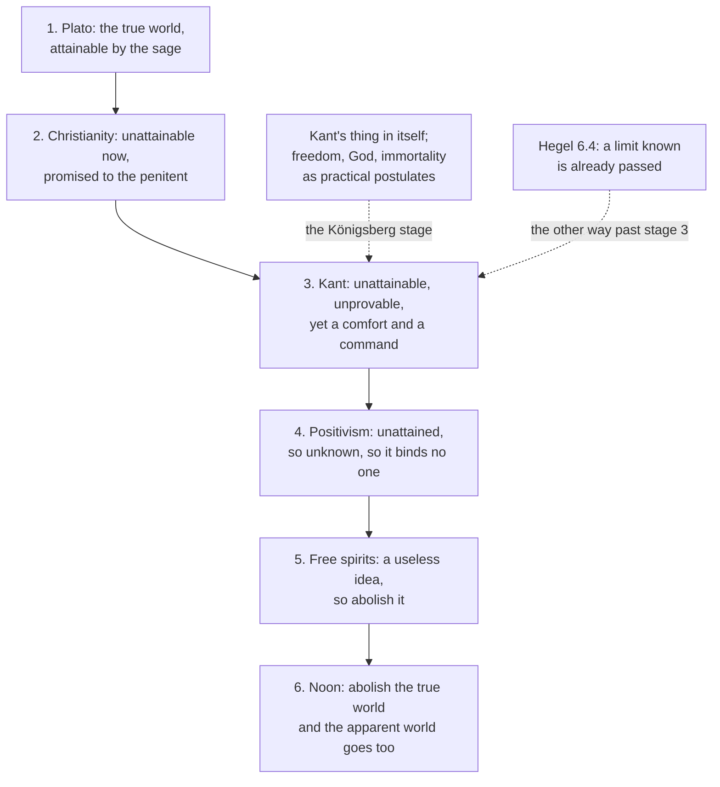

# Modern Philosophy · Lesson 6.5: Nietzsche: perspectivism and genealogy

> ⏱ ~15 min · Module 6: The limits of reason, and two ways past Kant · Builds on: [6.4 Hegel: dialectic and spirit](06-04-hegel-dialectic-and-spirit.md), [6.1 Transcendental idealism and the thing in itself](06-01-transcendental-idealism-and-the-thing-in-itself.md), [5.1 The critical question](05-01-the-critical-question.md), [1.2 The cogito and the wax](01-02-the-cogito-and-the-wax.md) · Unlocks: [`phenomenology-and-personalism` 4.1](../../phenomenology-and-personalism/lessons/04-01-scheler-values-given-in-feeling.md), [`philosophy-of-debt` 4.1](../../philosophy-of-debt/lessons/04-01-the-animal-with-the-right-to-make-promises.md)

## Why this matters

Kant drew a boundary around knowledge, with the thing in itself on the far side ([6.1](06-01-transcendental-idealism-and-the-thing-in-itself.md)). Hegel replied that reason which draws a limit has already passed it ([6.4](06-04-hegel-dialectic-and-spirit.md)). Friedrich Nietzsche (1844–1900) replied that there is nothing on the far side, and that the one drawing the line, the pure knowing subject with its a priori forms, has a history like anything else. He read the whole modern project, from Descartes's certain "I think" to Kant's synthetic a priori, as the late chapter of an older story. His method for telling such stories, genealogy, became a standard philosophical tool.

## The idea

Nietzsche makes three refusals, each aimed at a Kantian piece.

**No true world.** Kant's thing in itself is unknowable, yet it still does work: it grounds freedom, God and immortality as postulates of practical reason. Nietzsche sees in it Plato's "true world", grown pale ([true-world fable](../reference.md#true-world-fable)). Remove it, and "mere appearance" loses the contrast that made it *mere*.

**No pure subject.** *Beyond Good and Evil* (1886) §16 says "I think" is no immediate certainty. It packs in several bold claims: that it is *I* who think, that something must be doing the thinking, that thinking is an activity caused by an agent, and that I already know what thinking is. The grammar of subject and predicate supplies the agent ([critique of the subject](../reference.md#critique-of-the-subject)). *Twilight of the Idols* (written 1888), in Ludovici's translation:

> I fear we shall never be rid of God, so long as we still believe in grammar.

**No a priori warrant.** *BGE* §11 mocks Kant's answer to his own question ([synthetic a priori](../reference.md#synthetic-a-priori)) as an appeal to a faculty, no better than Molière's doctor explaining opium by its *virtus dormitiva*, its sleep-inducing power. Then he changes the question (Zimmern's translation):

> it is high time to replace the Kantian question, "How are synthetic judgments a PRIORI possible?" by another question, "Why is belief in such judgments necessary?"

His answer: such beliefs preserve creatures like us, and they might still be false.

What replaces the view from nowhere is [perspectivism](../reference.md#perspectivism). *Genealogy of Morals* (1887) III §12, in Samuel's translation:

> There is only a seeing from a perspective, only a "knowing" from a perspective, and the more emotions we express over a thing, the more eyes, different eyes, we train on the same thing, the more complete will be our "idea" of that thing, our "objectivity."

The same section rejects the idea of a knower with no will, no pain and no time: an eye that looks in no direction.

The [death of God](../reference.md#death-of-god) belongs here as diagnosis. In *The Gay Science* §125 (1882) a madman with a lantern tells a laughing crowd of unbelievers that "we" have killed God, and that they have not yet grasped what follows. §343 (added in 1887) glosses the event as the Christian God having become unbelievable, with much that rested on that belief about to collapse. Readers agree Nietzsche was an atheist. The dispute is whether §125 *argues* for atheism or reports a cultural event and asks what survives it. Its text offers no premises about God's existence.

## Source

*Twilight of the Idols*, "How the 'True World' ultimately became a Fable: the history of an error", stages 3, 4 and 6 (Ludovici, 1911, public domain). Stages 1–2 are Plato and Christianity.

> 3. The true world is unattainable, it cannot be proved, it cannot promise anything; but even as a thought, alone, it is a comfort, an obligation, a command.
>
> (At bottom this is still the old sun; but seen through mist and scepticism: the idea has become sublime, pale, northern, Königsbergian.)
>
> 4. The true world—is it unattainable? At all events it is unattained. And as unattained it is also *unknown.* Consequently it no longer comforts, nor saves, nor constrains: what could something unknown constrain us to? [...]
>
> 6. We have suppressed the true world: what world survives? the apparent world perhaps?... Certainly not! *In abolishing the true world we have also abolished the world of appearance!*
>
> (Noon; the moment of the shortest shadows; the end of the longest error; mankind's zenith; *Incipit Zarathustra.*)

Three things to notice. Stage 3 is Kant (Königsberg was his city): the true world "cannot be proved", which is the Dialectic ([6.2](06-02-the-soul-and-the-antinomies.md), [6.3](06-03-the-critique-of-the-proofs-of-god.md)), yet it is "an obligation, a command", which is the practical postulates. Stage 4 attacks Kant from the positivist side: an unknown cannot bind. And stage 6 is not "only appearances remain". The pair goes together, so "appearance" stops meaning *less than real*.

## The argument

**Nietzsche against the Kantian settlement** (from *BGE* §§11, 16–17, *Twilight* and *Genealogy* III §12; the numbering is ours).

1. **Kant answers "how is synthetic a priori knowledge possible?" by pointing to a faculty of the mind** (§11, on Nietzsche's reading).
2. **Naming a faculty restates the question.** *In words:* "a power to make such judgments" explains them as well as *virtus dormitiva* explains sleep.
3. **What can be explained is why creatures like us must believe such judgments: the belief preserves life** (§11).
4. **Being necessary for us does not make a belief true** (§11: they "might naturally be false").
5. **The "I think" is no immediate certainty but an interpretation that grammar adds to a process** (§§16–17).
6. **The true world, the standard by which our world is "mere appearance", is unknown, and an unknown standard does no work** (the fable, stage 4).
7. **∴ All knowing is from a perspective, and objectivity is the range of perspectives brought to bear, not a view from nowhere** (*Genealogy* III §12).

**The crux with Kant** is the step from 3 to 4. Kant holds that a condition necessary for any experience of ours is thereby valid of every object of experience, since those objects are appearances ([Copernican revolution](../reference.md#copernican-revolution)). Nietzsche, in §11, denies it.

**Where the argument is weakest.** Premise 4 sits badly with premise 6. To say the categories are necessary for us yet false, Nietzsche needs something they could be false *of*. That can only be things as they are in themselves, the standard premise 6 throws out. A Kantian presses exactly this: "false" here means "not true of the thing in itself", and Kant never claimed the categories were. Maudemarie Clark (*Nietzsche on Truth and Philosophy*, 1990) argues that Nietzsche saw the point himself, that stage 6 of the fable records it, and that the late works drop the claim that our knowledge falsifies. Premise 1 is also contested: Kant's answer is a transcendental argument that the categories make experience possible ([5.3](05-03-concepts-and-the-categories.md)), not a bare appeal to a faculty. A reader who defends Nietzsche replies that §11 is aimed at the faculty-hunting the *Critique* set off among Kant's successors, as the section goes on to say, more than at Kant's argument.

## The picture

The solid chain is the fable: each stage makes the true world less reachable, then less useful, then gone. The dashed edges mark where Kant sits and where Hegel leaves the story.

## Worked examples

**Example 1 (clean: genealogy as method).** The *Genealogy* Preface §6 states the task (Samuel):

> we need a *critique* of moral values, *the value of these values* is for the first time to be called into question

and says that this needs knowledge of the conditions under which those values grew. Run the [genealogy](../reference.md#genealogy) on "good". (i) A value is treated as unconditioned: good means unselfish, everywhere and always. (ii) Find its descent. The First Essay finds two. Noble "good" begins as self-affirmation, with "bad" as an afterthought. Slave "good" is born when resentment (Samuel's word for *ressentiment*) becomes creative and first says no to the strong as "evil" (I §10). (iii) Show what the value did for the type of life that held it. (iv) Ask what it is worth now. The history does not by itself refute the value. The Preface makes it a tool for the question of value, and treating origin as validity is the [genetic fallacy](../../philosophy-of-debt/lessons/04-03-graebers-thesis-examined.md). Genealogies can also vindicate. Bernard Williams's *Truth and Truthfulness* (2002) tells one in favour of truthfulness. Debunking arguments of the same shape are [`ethics` 6.4](../../ethics/lessons/06-04-constructivism-and-debunking.md)'s.

**Example 2 (hard: a genealogy of the subject).** *Genealogy* I §13 turns the method on the "I". Lambs call the birds of prey evil. To blame the bird, they need a neutral subject behind the strong one that could have chosen not to be strong, just as people split lightning from its flash. Nietzsche lists the Kantian thing in itself among such changelings of "the subject". The weak gain the right to blame, and their weakness becomes a choice of their own to be praised. Aimed at Kant, this is a story about why a free noumenal self (the third antinomy, [6.2](06-02-the-soul-and-the-antinomies.md)) was welcome. Here it strains. That a belief served the weak does not show it false, any more than a belief's usefulness showed it true in premise 3. The genealogy needs the grammar argument of *BGE* §17 to carry the falsity. If that argument fails, the story explains the belief's appeal and nothing more.

## Watch out

- **Anachronism: "perspectivism means there are no facts, only interpretations, so anything goes."** That slogan comes from an unpublished notebook, and "anything goes" is a later relativism. The published *Genealogy* III §12 speaks of more eyes on "the same thing" and a more complete objectivity. Readers divide here: Clark and Brian Leiter read perspectivism as a claim about how knowing is conditioned, others as a denial of truth. The words of §12 favour the first and do not settle Nietzsche's notebooks.
- **You might think stage 6 makes Nietzsche a phenomenalist, with appearances all that is left.** He says the reverse: the world of appearance goes with the true world.
- **You might think "Kant (after all a Christian in disguise)" in *Twilight* is a reading of Kant.** It is polemic. Kant himself denied any theoretical knowledge of God or the soul, and stage 3 registers that.

## One-liner

> Nietzsche refuses Kant's true world, his pure subject and his a priori warrant, puts perspectives and the history of values in their place, and leaves the question of what is true without a world behind the world.

## Problems

**P1 (🟢) *(Exegetical.)*** Diagnose. An invented forum post:

> Nietzsche settled the God question in one line: "God is dead." His madman proves that modern people have outgrown belief, so God does not exist. The argument is simple: no one believes any more, therefore there is nothing to believe in.

Name two errors in the post's reading of *Gay Science* §125, correcting each from the text as this lesson presents it, and name the step that would fail even if the reading were right. 150 words or fewer.

**P2 (🟡) *(Exegetical.)*** Close reading. *Beyond Good and Evil* §17 (Zimmern):

> I shall never tire of emphasizing a small, terse fact, which is unwillingly recognized by these credulous minds--namely, that a thought comes when "it" wishes, and not when "I" wish; so that it is a PERVERSION of the facts of the case to say that the subject "I" is the condition of the predicate "think." ONE thinks; but that this "one" is precisely the famous old "ego," is, to put it mildly, only a supposition, an assertion, and assuredly not an "immediate certainty." After all, one has even gone too far with this "one thinks"--even the "one" contains an INTERPRETATION of the process, and does not belong to the process itself. One infers here according to the usual grammatical formula--"To think is an activity; every activity requires an agency that is active; consequently"...

(a) Does Nietzsche replace the "I" with another thinker, "it" or "one"? Which words decide it? (b) Which premise of the "grammatical formula" is his target? (c) Kant also denied, in the paralogisms, that the "I think" gives knowledge of a thinking substance. Name one claim in the passage Kant could accept and one he must reject. Two sentences per part.

**P3 (🔴) *(Evaluative.)*** Steelman and reply. A critic says: "Perspectivism refutes itself. Either 'all knowing is perspectival' holds from every perspective, and then there is at least one non-perspectival truth, or it holds only from Nietzsche's, and then I have no reason to accept it." State the dilemma at its strongest, then reply on Nietzsche's behalf using the wording of *Genealogy* III §12 as quoted in the lesson. Any verdict; 150 words or fewer.

Solutions

**P1** *(Exegetical, strict.)*

**Accept:** any two of the three errors below, plus the step.

**Must hit, strict:**

- **"Proves" / "argument":** §125 is a parable with no premises about God's existence. A madman announces an event, and the crowd laughs.
- **Who has "outgrown belief":** the crowd already disbelieves, and the madman says they have not grasped what they did. "We have killed him" names a cultural deed whose consequences have "not yet reached men's ears"; §343 glosses it as the Christian God having become unbelievable.
- *(Also acceptable.)* **Cheerful outgrowing:** the speech is about loss (no above or below, growing cold, who will wipe the blood), not triumph.
- **The step:** "no one believes, therefore there is nothing to believe in" infers non-existence from unbelief. It fails whatever Nietzsche meant; whether God exists is [`philosophy-of-religion`](../../philosophy-of-religion/syllabus.md)'s question.

**Wrong turns:** overcorrecting to "Nietzsche was not an atheist"; he was, and he attacks Christianity elsewhere. The point is that §125 diagnoses rather than argues.

**Model answer:** First, §125 is not an argument: a madman announces an event, offering no premises about God. Second, the post reverses the scene. The crowd already disbelieves, and the madman says they have not understood their own deed; §343 glosses it as belief in the Christian God having become unbelievable, with much built on it about to fall. The speech is about loss, not a settled question. Finally, even if everyone had stopped believing, "therefore God does not exist" would not follow: what people believe does not fix what exists.

---

**P2** *(Exegetical, strict.)*

**Must hit, strict (a):** no. "It" and "one" are stopgaps. He says "even the 'one' contains an INTERPRETATION of the process, and does not belong to the process itself", so any subject is added to the thinking, not found in it.

**Must hit, strict (b):** "every activity requires an agency that is active". He grants the thinking is going on and attacks the move from activity to agent, which the grammar of subject and predicate supplies.

**Must hit, strict (c):** Kant could accept that the ego as a substance is not an immediate certainty or object of knowledge. He must reject that it is a "perversion" to make the "I" a condition of thinking: for Kant the "I think" that can accompany all my representations is a condition of their being mine and of experience at all (B131; [5.4](05-04-the-transcendental-deduction.md)), though only a formal one.

**Wrong turns:** reading "it" as the unconscious or the will doing the thinking (the passage withdraws even "one"). Saying Kant agrees with all of it because of the paralogisms.

**Model answer:** (a) No: even "one" is an interpretation that "does not belong to the process itself", so every subject-term is added. (b) The premise that every activity needs an agent, which grammar supplies. (c) Kant accepts that the "I think" gives no knowledge of a thinking substance. He rejects the claim that the "I" is no condition of thinking, since the unity of apperception is a formal condition of any experience.

---

**P3** *(Evaluative.)*

**Must hit, any verdict:**

- State the dilemma precisely: horn one makes the thesis a non-perspectival truth and so a counterexample; horn two leaves no reason for anyone outside Nietzsche's perspective.
- Use §12's wording: it speaks of "the same thing", more eyes and a "more complete" objectivity. So perspectivism concerns *how* knowing happens, not whether claims are true.
- Reply to one horn: the thesis can itself be known from a perspective, and that is only self-refuting if "perspectival" means "not true" or "true only for me", which §12 does not say.
- Name the cost of the reply: read this way, perspectivism may become modest, close to what Kant already held (knowledge conditioned by our forms), and the radical notebook slogan is given up.

**Wrong turns:** answering with relativism ("it's true for Nietzsche"), which concedes horn two. Assuming the radical reading is the only one.

**Model answer, one of several:** At its strongest: if the thesis is true from every perspective, it is the one view from nowhere it denies; if from one, it binds no one else. The reply denies the dilemma's assumption that a perspectival claim is true only *for* a perspective. §12 says the more eyes we train "on the same thing", the more complete our objectivity. Perspectives are ways of knowing one world, not separate truths. So "all knowing is perspectival" is known from a perspective, as everything is, and can still be true. The cost is real: this perspectivism is far more modest than "no facts, only interpretations", and a Kantian may say it is his own view without the forms' necessity.

## Flashback

**From Lesson [6.3](06-03-the-critique-of-the-proofs-of-god.md) (The critique of the proofs of God):** *(Exegetical.)* Apply to a new case. An invented astronomer, Ilse, writes in a methods note: "I look for connections among all the laws of nature as if they flowed from one necessary, supremely wise ground of everything. I do not claim to know there is such a ground; the assumption only tells me to keep looking for unity." Two colleagues reply. A theologian: "Your method keeps succeeding, and success is a sign of truth. So the ground you assume exists, and it is God." An atheist: "Keep the method, but we know no such being exists." (a) On Kant's account in the Ideal of Pure Reason, what status does Ilse's assumption have, and what slide does the theologian make? (b) What does Kant say to the atheist, and why does one line of argument answer both colleagues? Two sentences per part.

Solution

**Must hit, strict (a):**

- Ilse's assumption is **regulative**: a maxim for pursuing systematic unity in experience, philosophizing upon nature "as if there existed a necessary primal basis of all existing things". It asserts no object.
- The theologian makes it **constitutive**: he slides from an idea reason needs to an existing individual, the step Kant describes as making the idea objective, then hypostatizing and personifying it (the transcendental ideal). The method's success shows the maxim is useful for ordering experience, not that anything answers to the idea beyond experience.
- *(Also acceptable.)* If the theologian argues from the order the method uncovers, he is running the physico-theological proof, which reaches at most an architect and falls back on the cosmological and then the ontological proof.

**Must hit, strict (b):**

- Kant: speculative reason can no more disprove a supreme being than prove one. Its objective reality "can neither be proved nor disproved", and the arguments that block the proofs block the denial too.
- One line answers both: the existence of an object is known only through its connection with possible perception, and a necessary ground of everything can never be given in perception. So affirming and denying it both claim theoretical knowledge beyond possible experience.

**Wrong turns:** treating Ilse's "as if" as pretence or self-deception. Kant says reason *must* proceed this way for the sake of unity; only the constitutive use is illusion. Siding Kant with the atheist because he refutes the proofs: he says the denial is no better off. Answering with Kant's moral argument, which belongs to practical reason; the question concerns speculative reason.

**Model answer:** (a) Ilse's assumption is regulative, a rule for seeking systematic unity in nature as if a necessary primal ground existed, and it asserts nothing about an object. The theologian makes it constitutive, sliding from an idea reason needs to an existing individual, the hypostatization Kant finds in the transcendental ideal; success shows the maxim is useful, not that its object exists. (b) Kant tells the atheist that speculative reason can no more disprove a supreme being than prove one: it remains "a mere ideal, though a faultless one". One line answers both because existence is known only through connection with possible perception, and a ground of everything can never be perceived, so the affirmation and the denial alike claim knowledge beyond experience.

## Connections

- **Backward:** the fable's stage 3 is the thing in itself of [6.1](06-01-transcendental-idealism-and-the-thing-in-itself.md) and the postulates left standing after [6.3](06-03-the-critique-of-the-proofs-of-god.md). *BGE* §11 rewrites the question of [5.1](05-01-the-critical-question.md). The critique of the "I think" extends Lichtenberg's objection to the cogito ([1.2](01-02-the-cogito-and-the-wax.md)) and is a cousin of Hume's bundle ([4.4](04-04-the-self-belief-and-the-passions.md)). Hegel ([6.4](06-04-hegel-dialectic-and-spirit.md)) is the other way past Kant.
- **Forward:** Scheler's *ressentiment* answers the First Essay in [`phenomenology-and-personalism` 4.1](../../phenomenology-and-personalism/lessons/04-01-scheler-values-given-in-feeling.md). The Second Essay's guilt as debt (*Schuld*) is [`philosophy-of-debt` 4.1](../../philosophy-of-debt/lessons/04-01-the-animal-with-the-right-to-make-promises.md), with what a genealogy can prove in its [4.3](../../philosophy-of-debt/lessons/04-03-graebers-thesis-examined.md).
- **Sideways:** evolutionary debunking is the genealogy pattern with selection in place of history ([`ethics` 6.4](../../ethics/lessons/06-04-constructivism-and-debunking.md)). The sociology of a God who "is dead" is [`social-theory` 7.1](../../social-theory/lessons/07-01-classical-secularization-theory.md).

## Closing the course

The exchange in one paragraph. Descartes rebuilt knowledge from a thinking self guaranteed by God and left two problems, mind–body interaction and finite causation. Spinoza, Malebranche and Leibniz answered them with whole systems. Locke asked what experience can supply, and Berkeley, following him, removed matter. Hume, applying the copy principle strictly, found no impression of necessary connection, no reasoning behind induction and no self beyond a bundle. Reid blamed the theory of ideas. Kant made the mind the source of the forms experience must take and drew a limit to knowledge. Hegel said the limit was already passed; Nietzsche said nothing lay beyond it.

[`phenomenology-and-personalism`](../../phenomenology-and-personalism/syllabus.md) inherits doubt and the cogito (1.1–1.2), the theory of ideas and the bundle self (3.1, 4.1, 4.4), Kant's intuition, synthesis, method and "I think" (5.1, 5.3–5.4), the thing in itself (6.1), Hegel's *Phenomenology* (6.4) and this lesson's genealogy. The live questions go to [`epistemology`](../../epistemology/syllabus.md), [`metaphysics`](../../metaphysics/syllabus.md), [`philosophy-of-mind`](../../philosophy-of-mind/syllabus.md) and [`philosophy-of-religion`](../../philosophy-of-religion/syllabus.md).
