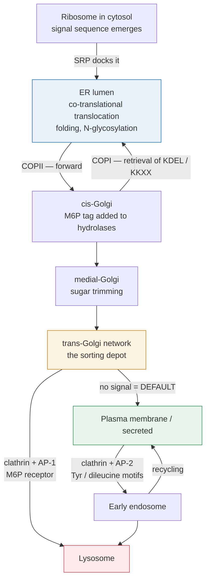

# Molecular & Cell Biology · Lesson 1.4: The endomembrane system & protein trafficking

> ⏱ ~15 min · Module 1: The Cell as a Built, Moving Machine · Builds on: [1.3](01-03-motors-cargo-logistics.md), [general-biology 1.4](../../general-biology/lessons/01-04-tour-of-the-organelles.md) · Unlocks: 2.1 (receptors)

## Why this matters

A third of your proteins never see the cytosol. Every receptor on a cell surface, every antibody, every digestive enzyme, and every lysosomal hydrolase is synthesized into a tube inside the cell and delivered to its destination by a courier system with addresses, sorting depots, and signed receipts.

The system's central design problem is that **all its compartments are made of the same stuff.** Membrane is membrane; a vesicle carries no label saying "Golgi." So identity has to be maintained actively — by which coat proteins assemble on it, which small GTPase it displays, and which fusion machinery it can engage. Get that idea and the whole pathway stops being a list of organelles and becomes a logic.

## The idea

**Follow one secreted protein.** Its ribosome starts translating in the cytosol like any other. Then something happens that nothing in [general-biology 3.4](../../general-biology/lessons/03-04-central-dogma.md) prepared you for: the first 20-odd amino acids to emerge are a **signal sequence**, a hydrophobic tag that is grabbed mid-translation by a **signal recognition particle**, which stalls the ribosome and docks it onto the endoplasmic reticulum. Translation resumes with the growing chain threading through a channel into the ER lumen. The protein is *born* on the other side of a membrane. This is **co-translational translocation**, and it is why "inside the ER" is topologically equivalent to "outside the cell."

**Then it moves by budding and fusing.** ER → Golgi → surface, in vesicles. At each step three things must happen and each has dedicated machinery:

1. **Bud** — a coat protein complex assembles on the donor membrane, selects cargo, and deforms the membrane into a bud. The coat *is* the sorting step.
2. **Travel** — motors on cytoskeletal tracks ([1.3](01-03-motors-cargo-logistics.md)) carry the vesicle.
3. **Fuse** — a tether catches the vesicle, and **SNARE** proteins on the vesicle and target membrane zipper together, forcing the two bilayers close enough to merge.

**Three coats, three routes.** COPII buds ER → Golgi (**forward**). COPI buds Golgi → ER and between Golgi stacks (**backward**, retrieving escaped ER residents). Clathrin buds from the Golgi and from the plasma membrane (**inward**, to endosomes and lysosomes). Learn the direction with the coat and you have the map.

**Retrieval is what makes forward transport safe.** Because bulk flow carries everything forward, ER-resident proteins constantly leak out. They carry a **KDEL** sequence; a receptor in the Golgi binds KDEL and packages them into COPI vesicles heading back. **The pathway is not a one-way pipe; it is a pipe plus a return line**, and the return line is what lets the forward line be sloppy and cheap.

## The formal version

**Sorting signals.** Each is a short sequence or modification read by a specific receptor:

| Signal | On the protein | Read by | Destination |
|---|---|---|---|
| N-terminal hydrophobic signal sequence | secretory/membrane proteins | signal recognition particle | ER lumen (co-translational) |
| **KDEL** (C-terminal) | ER-resident lumenal proteins | KDEL receptor in Golgi | retrieved to ER via COPI |
| **KKXX** (C-terminal, cytosolic) | ER-resident membrane proteins | COPI coat | retrieved to ER |
| **Mannose-6-phosphate** (a sugar, added in the *cis*-Golgi) | lysosomal hydrolases | M6P receptor in *trans*-Golgi | lysosome, via clathrin |
| Tyrosine- or dileucine-based motifs (cytosolic) | plasma-membrane proteins | clathrin adaptor (AP) complexes | endocytosis to endosome |
| Nuclear localization signal (basic residues) | nuclear proteins | importin | nucleus, through the pore |

*In words: an address is a short peptide, and a courier is a receptor that reads exactly one address.* Note that the lysosomal address is a **sugar**, not a peptide — the only one, and it is the reason a defect in the enzyme that adds M6P causes lysosomal enzymes to be secreted into the blood instead (I-cell disease).

**Compartment identity: Rab GTPases.** Each compartment displays a characteristic **Rab** protein in its GTP-bound (active) form. Rabs recruit the tethers and motors appropriate to that compartment. A vesicle's identity is therefore a *state*, maintained by the balance of a GEF (which loads GTP, activating) and a GAP (which triggers hydrolysis, inactivating) — the same switch logic you will meet for Ras in [2.3](02-03-kinase-cascades-switch.md):

$$\text{Rab-GDP} \;\xrightarrow[\ \text{GEF}\ ]{}\; \text{Rab-GTP} \;\xrightarrow[\ \text{GAP}\ ]{}\; \text{Rab-GDP}$$

*In words: a GTPase is a timer — it is "on" from the moment a GEF loads it until a GAP tells it to hydrolyse.*

**Fusion specificity: SNAREs.** A **v-SNARE** on the vesicle pairs with a matching set of **t-SNAREs** on the target. Four helices — one from the v-SNARE, three from the t-SNARE side — zipper into an extremely stable four-helix bundle, and the free energy released does mechanical work pulling the bilayers into contact. Fusion is not spontaneous: [biophysics 3.5](../../biophysics/lessons/03-05-membrane-mechanics.md) shows a bilayer resists the high curvature of a fusion stalk, and **the SNARE bundle is the device that pays that bending energy.**

**Glycosylation as a clock.** Sugars added in the ER are trimmed and extended in a fixed order across the Golgi stack. The sugar tree a protein carries therefore records how far along the pathway it has travelled — which is how cell biologists date a protein's position experimentally, and how quality-control lectins in the ER tell a newly-made chain from one that has been failing to fold for a while ([4.4](04-04-protein-quality-control-degradation.md)).

## Picture

**Read the diagram as three rules.** Forward flow is COPII then bulk; the *only* unlabelled arrow — trans-Golgi to the surface — is the **default**, taken by anything with no diversion signal. Every backward arrow exists to preserve a compartment's identity against that forward drain. And each diversion is one address read by one receptor: break the receptor and the cargo rejoins the default.

## Worked examples

**Example 1 (mechanical — read an address, predict a destination).** Four engineered proteins. Predict where each ends up.

| Construct | Reasoning | Destination |
|---|---|---|
| (a) Signal sequence + soluble domain, no other signal | enters ER, no retrieval or sorting signal, follows bulk flow | **secreted** — the default destination of the pathway |
| (b) Signal sequence + soluble domain + C-terminal KDEL | enters ER, escapes to Golgi, KDEL receptor returns it by COPI | **ER lumen**, at steady state |
| (c) Signal sequence + a hydrolase that receives M6P | enters ER, tagged in *cis*-Golgi, captured by M6P receptor in *trans*-Golgi | **lysosome** |
| (d) Signal sequence + KDEL, in a cell where the KDEL *receptor* is deleted | enters ER, escapes, nothing retrieves it | **secreted** |

**The point of (d):** an address is worthless without a reader. Half of trafficking pathology is a perfectly good signal with a broken receptor — and the phenotype is indistinguishable from having no signal at all.

**Example 2 (why you'd care — what a COPI block does, and why it is not obvious).** A drug blocks COPI budding. Predict the effect on (i) ER-resident proteins, (ii) secretion of a normal secreted protein, (iii) the Golgi itself.

(i) **ER residents leak away.** Bulk flow keeps carrying them forward; with the return line cut they accumulate in the Golgi and are eventually secreted. The ER is progressively stripped of its chaperones and enzymes.

(ii) **Secretion continues at first, then fails.** Forward transport is COPII's job, which is untouched — so for a while secretion looks normal. But the ER cannot fold new proteins without the chaperones it is losing, so secretion collapses on a delay. **The kinetics are the diagnostic**: a coat-specific block shows up as a *delayed, indirect* failure of the pathway it does not directly serve.

(iii) **The Golgi disassembles into the ER.** This is the striking one. Golgi membrane is continually consumed forward and replenished by COPI-mediated retrieval; with retrieval blocked and forward flow continuing, the Golgi's own membrane and enzymes drain into the ER and the stack visibly disappears. (The natural product brefeldin A does exactly this by inhibiting the COPI GEF, and the collapse is one of the classic images in cell biology.)

**The general lesson:** in a system built on balanced forward and backward flux, **blocking the return line destroys the compartment, not just the cargo.** Compartment identity is a steady state, not a structure.

## Watch out

- **You might think a protein "enters" the ER after it is made.** Most enter *during* synthesis, still attached to the ribosome. A protein that finished folding in the cytosol usually cannot be threaded through the channel at all — which is why the signal is at the N-terminus, where it emerges first.
- **You might expect secretion to need a signal.** Secretion is the **default**. Every other destination needs a signal to divert the protein *off* the default route. This inverts the intuition and explains why loss of a sorting signal so often produces inappropriate secretion.
- **You might read "the Golgi matures" and "vesicles shuttle between stable cisternae" as competing textbook stories.** The current picture is cisternal maturation *plus* COPI retrograde traffic: a cisterna moves *cis* to *trans* while its enzymes are constantly pulled backward. Both parts are needed; neither alone is right.
- **You might treat compartment identity as structural.** It is chemical and dynamic — a Rab, a lipid composition, a SNARE set. Change the Rab and the compartment behaves like a different one.

## One-liner

> Secretion is the default and every other destination is a diversion — read by a receptor, packaged by a coat that names the direction, and fused by SNAREs that pay the membrane's bending bill.

## Problems

**P1 (🟢)** For each, name the coat and the direction of travel: (a) ER → *cis*-Golgi; (b) *cis*-Golgi → ER; (c) *trans*-Golgi network → lysosome; (d) plasma membrane → early endosome.

**P2 (🟡)** A patient's fibroblasts secrete large amounts of lysosomal hydrolases into the culture medium, and their lysosomes are engorged with undigested material. The hydrolases themselves are catalytically normal. (a) Name the most likely defective step. (b) Explain why the enzymes end up outside the cell specifically — what route are they taking? (c) Would adding purified, correctly M6P-tagged enzyme to the medium rescue the cells? Explain the mechanism of your answer.

**P3 (🔴, bridges to Module 2 and to biophysics)** SNARE zippering releases roughly $35\,k_BT$ per complex, and estimates put the energy barrier for fusing two bilayers at $40$–$50\,k_BT$. (a) How many SNARE complexes must act together, at minimum, to clear a $45\,k_BT$ barrier? (b) Synaptic vesicle fusion occurs within 200 μs of a calcium signal, far faster than SNAREs can assemble from scratch. Propose what the vesicle must be doing before the signal arrives, and what role calcium then plays. (c) Explain why this architecture — pre-loaded machinery held by a clamp — is a recurring solution whenever a cell needs a fast response, and name the general trade-off it accepts.

Solutions

**P1** (a) **COPII**, anterograde (forward). (b) **COPI**, retrograde (backward). (c) **Clathrin** with AP-1 adaptors, forward off the secretory pathway. (d) **Clathrin** with AP-2 adaptors, endocytic (inward).

**P2 (a)** The defect is in **adding the mannose-6-phosphate tag** — specifically the GlcNAc-phosphotransferase that recognizes lysosomal hydrolases in the *cis*-Golgi. (This is I-cell disease, mucolipidosis II.)

**(b)** Without M6P the hydrolases carry no sorting signal, so they are never captured by the M6P receptor in the *trans*-Golgi network. They therefore **follow the default route — bulk flow to the plasma membrane and out**. This is the cleanest possible demonstration that secretion is the default: remove one address and the protein goes to the address nobody had to specify.

**(c)** **Yes, and this is the basis of enzyme-replacement therapy.** Cells display M6P receptors on their *surface* as well as in the Golgi; extracellular M6P-tagged enzyme binds those receptors, is endocytosed in clathrin-coated vesicles ([1.3](01-03-motors-cargo-logistics.md) supplies the transport), and is delivered to endosomes and thence lysosomes — arriving at the right compartment by the endocytic route rather than the biosynthetic one. The patient's own enzyme is fine; only the tag is missing, so supplying pre-tagged enzyme restores function.

**P3 (a)** $$N \ge \frac{45\,k_BT}{35\,k_BT} = 1.29 \;\Longrightarrow\; \mathbf{2\ \text{complexes}}$$ at minimum. Measurements on synaptic vesicles suggest around 3, comfortably consistent — and the fact that the answer is "a few, not one and not fifty" is itself the useful check on the energy numbers.

**(b)** The SNAREs must already be **partially zippered and held there** — assembled far enough to have done most of the work, but arrested short of fusion by a clamp (synaptotagmin together with complexin plays this role). Calcium's job is then not to build anything but to **release the clamp**: Ca²⁺ binds synaptotagmin, the clamp lets go, and the pre-loaded complexes complete zippering in microseconds.

**(c)** Because assembly is slow and release is fast. Any system that must respond in microseconds cannot afford to *build* its machinery on demand; it must build it in advance and gate it. The same architecture appears throughout the cell — a cocked, inhibited caspase awaiting a cleavage signal ([3.2](03-02-dna-damage-response.md)), a paused RNA polymerase awaiting a release factor ([4.2](04-02-eukaryotic-transcription-machine.md)), a stored calcium gradient awaiting a channel to open. **The trade-off is standing cost and risk**: the cell pays continuously to hold a loaded, dangerous machine in check, and a failure of the clamp is a spontaneous, unrequested firing.

## Flashback

**From Lesson 1.3 (motors and the diffusion crossover):** A yeast cell is 5 μm across; a plant root-hair cell is 1 mm long. A protein has $D = 15\ \mu\mathrm{m}^2/\mathrm{s}$ and the available motor runs at $v = 0.5\ \mu$m/s. (a) Compute the crossover distance $x^{*} = 2D/v$. (b) For each cell, state whether motor-driven transport or diffusion delivers a protein across it faster, and give both times. (c) State the general rule in one sentence.

Solution

**(a)** $$x^{*} = \frac{2(15)}{0.5} = \mathbf{60\ \mu\mathrm{m}}.$$

**(b)** Yeast, $x = 5\ \mu$m (well below $x^*$):

$$t_{\text{diff}} = \frac{5^2}{2(15)} = \frac{25}{30} = 0.83\ \mathrm{s}, \qquad t_{\text{motor}} = \frac{5}{0.5} = 10\ \mathrm{s}.$$

**Diffusion wins by 12×.** Root hair, $x = 1000\ \mu$m (far above $x^*$):

$$t_{\text{diff}} = \frac{10^6}{30} = 3.3\times10^4\ \mathrm{s} = 9.3\ \mathrm{h}, \qquad t_{\text{motor}} = \frac{1000}{0.5} = 2000\ \mathrm{s} = 33\ \mathrm{min}.$$

**The motor wins by 17×.**

**(c)** Diffusion time grows as the square of distance while transport time grows linearly, so below a crossover of a few tens of microns diffusion is free and faster, and above it directed transport is not an optimization but a requirement.

## Connections

- **Backward:** [1.3](01-03-motors-cargo-logistics.md) moved the vesicles; this lesson says where they came from, what is in them, and how they know where to dock.
- **Forward:** [2.1](02-01-receptors-reading-outside-world.md) needs this pathway to explain how a receptor reaches the surface — and how receptor *removal* by clathrin-mediated endocytosis terminates a signal. [4.4](04-04-protein-quality-control-degradation.md) returns to the ER as the site of the unfolded-protein response.
- **Sideways:** the GEF/GAP switch is the same on–off timer that runs Ras in [2.3](02-03-kinase-cascades-switch.md); once you have seen it here you have seen it everywhere in the cell.
