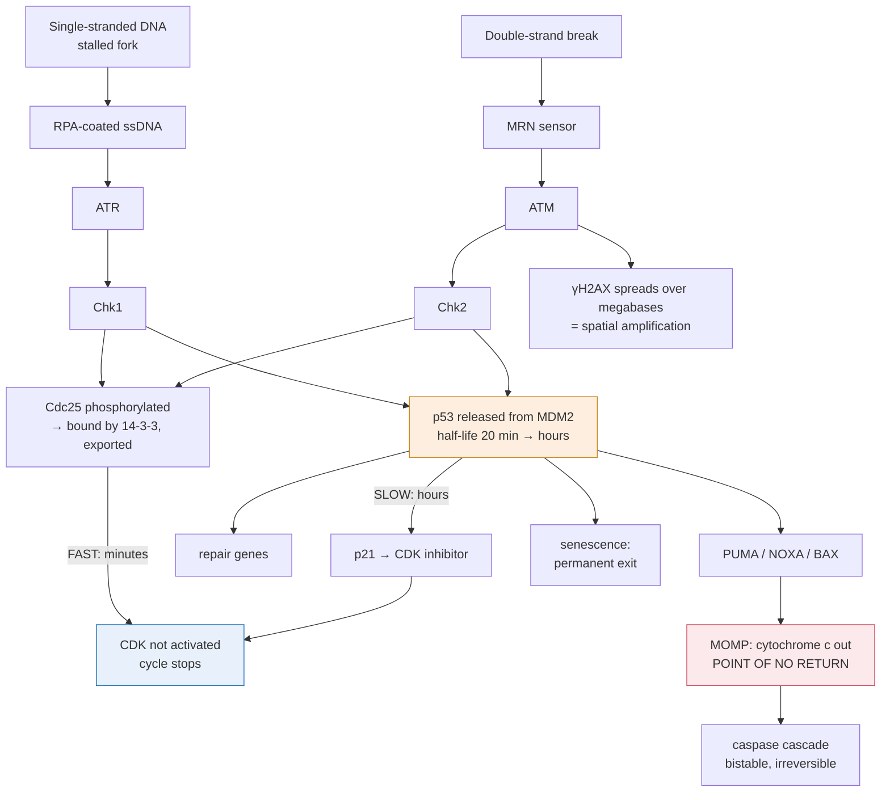

# Molecular & Cell Biology · Lesson 3.2: The DNA-damage response

> ⏱ ~15 min · Module 3: Division, Damage & Cancer · Builds on: [3.1](03-01-cell-cycle-engine-irreversibility.md), [2.3](02-03-kinase-cascades-switch.md) · Unlocks: 3.3 (double-strand breaks)

## Why this matters

Your DNA takes tens of thousands of hits a day per cell — oxidation, spontaneous depurination, replication errors, ultraviolet dimers. [genetics 3.3](../../genetics/lessons/03-03-dna-repair.md) covers the *chemistry* of fixing each lesion type. This lesson covers a different problem, and the one that is uniquely cell-biological:

**How does the cell know it is damaged, and what does it decide to do about it?**

Detection is genuinely hard. The damage is a handful of altered bases in three billion, it can be anywhere, and the cell has minutes to respond before a replication fork or a spindle turns a repairable lesion into a permanent one. The answer is a signalling cascade of exactly the kind you built in Module 2 — sensors, a kinase relay, amplification, and a bistable commitment step at the end — which is why this lesson sits where it does.

## The idea

**The pathway has four parts, in order: sense, transduce, decide, execute.**

**Sense.** Two apical kinases cover two kinds of damage. **ATM** responds to double-strand breaks, recruited to the break by a sensor complex (MRN). **ATR** responds to stretches of single-stranded DNA — which is what a stalled replication fork produces, and also what appears at most other lesions once repair enzymes start work. *In words: ATM watches for the DNA being cut in two, ATR for it being unzipped and stuck.*

**Transduce.** The apical kinase phosphorylates a checkpoint kinase (Chk2 for ATM, Chk1 for ATR) and hundreds of local substrates including the histone variant H2AX. Phosphorylated H2AX spreads over **megabases** around a single break, creating a huge platform that recruits more sensors and more kinase. **One break generates a signal visible by microscope**, and that is the amplification step — spatial rather than catalytic.

**Decide.** Signal converges on **p53**, a transcription factor held at low abundance by MDM2, a ubiquitin ligase that continuously marks it for destruction ([4.4](04-04-protein-quality-control-degradation.md)). Damage-activated kinases phosphorylate both p53 and MDM2, breaking their interaction. p53 stops being destroyed and therefore accumulates — **its half-life goes from ~20 minutes to hours, with no change in synthesis at all.**

**Execute.** Stabilized p53 turns on a transcriptional program, and which arm dominates decides the cell's fate:

| p53 target | Effect |
|---|---|
| **p21** | binds cyclin–CDK, arrests the cycle — the direct injection into [3.1](03-01-cell-cycle-engine-irreversibility.md)'s engine |
| repair genes | more repair capacity |
| **PUMA, NOXA, BAX** | permeabilize mitochondria → apoptosis |
| p16/ARF pathway targets | senescence, a permanent exit |

**Fast versus slow.** There are two arrest mechanisms and their timescales explain a lot. The **fast** one is post-translational: Chk1/Chk2 phosphorylate Cdc25, which is then bound by 14-3-3 proteins and exported from the nucleus, so it cannot activate CDK. Minutes. The **slow** one is transcriptional: p53 → p21 → CDK inhibition. Hours. *The cell slams the brake first and then decides whether to keep it on.*

## The formal version

**Stabilization by de-ubiquitination is a lever on half-life.** For a protein made at constant rate $k_s$ and degraded with first-order rate $k_d$:

$$[\mathrm{P}]_{ss} = \frac{k_s}{k_d}, \qquad t_{1/2} = \frac{\ln 2}{k_d}.$$

*In words: steady-state abundance is inversely proportional to the degradation rate, so blocking degradation raises abundance by exactly the factor by which the half-life rises.* This is why p53 is regulated by stability rather than by synthesis: **changing $k_d$ acts immediately on a protein already being made, while changing $k_s$ has to wait for transcription and translation.** A cell that must respond in minutes regulates degradation.

The time course after a step change in $k_d$ is

$$[\mathrm{P}](t) = [\mathrm{P}]_{new} + \big([\mathrm{P}]_{old} - [\mathrm{P}]_{new}\big)e^{-k_d^{new} t},$$

so the approach to the new level is governed by the *new*, slower degradation rate — the response is large but not instantaneous.

**The arrest–apoptosis decision is a threshold on dose and duration.** Low or brief damage → arrest and repair. High or persistent damage → apoptosis or senescence. Two features implement this:

- **p53 dynamics.** In many cells p53 does not rise smoothly but **pulses**, driven by the negative feedback loop p53 → MDM2 → destroys p53 (a delayed negative feedback, [2.4](02-04-circuits-feedback-adaptation.md)). The *number* of pulses, rather than their height, tracks damage duration — and sustained rather than pulsatile p53 pushes cells toward senescence. Once again, **duration is the message** ([2.4](02-04-circuits-feedback-adaptation.md), Example 2).
- **Apoptotic commitment is bistable.** Caspases activate other caspases, and caspase-cleaved substrates promote further mitochondrial permeabilization: positive feedback around an ultrasensitive step. There is a threshold, and past it the cell is dead within minutes regardless of what happens next. **A decision to die must be irreversible, so it is built exactly like the restriction point.**

**Mitochondrial outer membrane permeabilization (MOMP) is the point of no return.** BAX and BAK oligomerize in the outer mitochondrial membrane; cytochrome *c* escapes into the cytosol; it nucleates the apoptosome, which activates caspase-9, which activates caspase-3, which cleaves hundreds of substrates. The BCL-2 family sets the threshold: anti-apoptotic members (BCL-2, BCL-XL) sequester pro-apoptotic ones, and p53's targets (PUMA, NOXA) work by *displacing* the sequestered killers. *In words: the executioner is always present and always restrained; p53 does not build a weapon, it cuts a leash.*

## Picture

**Read the two paths out of p53 as a dose meter.** Brief damage gives a few p53 pulses, enough p21 to arrest, and repair. Persistent damage keeps p53 up, PUMA accumulates past the BCL-2 buffer, and the irreversible arm fires.

## Worked examples

**Example 1 (mechanical — what stabilization buys).** p53 is synthesized at a constant rate. Its half-life is 20 minutes normally and 4 hours after damage. (a) By what factor does steady-state p53 rise? (b) Starting from the undamaged steady state, how long after damage does p53 reach 90 percent of its new level? (c) Comment on the design.

(a) Steady state $\propto 1/k_d \propto t_{1/2}$:

$$\frac{[\mathrm{p53}]_{new}}{[\mathrm{p53}]_{old}} = \frac{240\ \mathrm{min}}{20\ \mathrm{min}} = \mathbf{12\text{-fold}},$$

with no change in transcription or translation whatsoever.

(b) The approach is governed by the new $k_d = \ln 2/240 = 2.89\times10^{-3}\ \mathrm{min^{-1}}$. Reaching 90 percent of the gap takes

$$t = \frac{\ln 10}{k_d} = \frac{2.303}{2.89\times10^{-3}} = \mathbf{797\ \mathrm{min} \approx 13\ \mathrm{h}},$$

or, more usefully, $\ln 10/\ln 2 = 3.32$ half-lives $= 3.32 \times 4\ \mathrm{h} = 13.3$ h.

(c) **This is the catch, and it is why the fast arm exists.** A twelve-fold rise is a strong signal but a slow one — half the response takes four hours, by which time an unchecked cell would have finished S phase. The Cdc25 export arm acts in **minutes** and buys exactly the time p53 needs. **A well-designed response has a fast reflex and a slow deliberation, and they are different mechanisms because no single mechanism is both fast and durable.**

**Example 2 (why you'd care — why p53 is mutated in half of all cancers, and why the mutations are the wrong kind).** (a) p53 acts as a tetramer. Explain why a single mutant allele can be worse than simply having half the p53. (b) Contrast this with Rb, which behaves as a classical two-hit tumour suppressor. (c) Explain why p53 status predicts response to radiotherapy and to many chemotherapies.

(a) p53 binds DNA as a **tetramer**, and mutant subunits assemble with wild-type ones. If a cell is heterozygous, the four subunits are drawn at random from a 50:50 pool, so the fraction of tetramers made entirely of wild-type subunits is

$$\left(\tfrac12\right)^{4} = \frac{1}{16} = \mathbf{6.25\ \text{percent}}.$$

Not 50 percent — **6 percent**. A single mutant allele poisons the complexes, which is **dominant negative**, and it is why most p53 cancer mutations are missense substitutions in the DNA-binding domain (which still fold and still tetramerize) rather than nonsense mutations (which would simply be absent and leave the wild-type allele free to work at 50 percent).

(b) Rb is a monomeric brake and there is nothing for a mutant copy to poison, so one working allele suffices and **both** must be lost — Knudson's two-hit model, and the reason retinoblastoma runs in families as a dominant *predisposition* caused by a recessive cellular lesion. **The inheritance pattern of a tumour suppressor is a readout of its quaternary structure**, which is a genuinely surprising connection between [biochemistry 1.3](../../biochemistry/lessons/01-03-four-levels-protein-structure.md) and clinical genetics.

(c) Because radiotherapy and most classical chemotherapies work by **causing DNA damage and letting the cell kill itself.** The drug is not the executioner; p53 is. A p53-null tumour sustains the damage, fails to arrest, fails to apoptose, and continues dividing — accumulating still more mutations. This is why p53 status is prognostic, why p53-null tumours are treated with agents that kill independently of it, and why the search for drugs that reactivate mutant p53 or block MDM2 has been pursued for thirty years.

## Watch out

- **You might think p53 is transcriptionally induced by damage.** It is not — its **synthesis barely changes**. Damage changes its *destruction*. Looking for p53 mRNA induction after irradiation finds nothing and misses the entire mechanism.
- **You might read arrest and apoptosis as separate pathways.** They are the same pathway with different thresholds and different durations of the same signal. The cell is running a dose meter, not a switchboard.
- **You might expect γH2AX spreading to be repair.** It is *signalling* — a platform built over megabases so that one break produces a signal large enough to act on. Repair happens at the break itself, in a space of nanometres.
- **You might think the apoptotic machinery is built on demand.** Caspases and BAX are constitutively present and constitutively restrained, exactly like the pre-loaded SNAREs of [1.4](01-04-endomembrane-trafficking.md). Killing a cell is a matter of removing an inhibitor, not of assembling a weapon.

## One-liner

> The cell detects damage with a kinase cascade, decides with a protein whose abundance is set by how fast it is destroyed, and commits with a bistable switch — brake first in minutes, verdict later in hours.

## Problems

**P1 (🟢)** A protein has a half-life of 15 minutes. A signal extends it to 3 hours. (a) By what factor does its steady-state level rise? (b) How long does it take to reach half of the new steady state?

**P2 (🟡)** A tumour-suppressor transcription factor works as a **dimer**, and a mutant subunit is dominant negative. (a) In a heterozygote, what fraction of dimers are fully wild-type? (b) Repeat for a tetramer and for a hexamer. (c) Plot the trend in words and state the general rule connecting oligomeric state to how many hits a tumour suppressor needs.

**P3 (🔴, bridges to 2.4 and to 3.4)** In single-cell imaging, p53 rises in a series of **fixed-amplitude, fixed-duration pulses** after irradiation, with the number of pulses proportional to dose. (a) What circuit motif produces pulses rather than a sustained rise, and what must be true of the delay for oscillation rather than smooth approach? (b) Why is encoding dose in *pulse number* rather than *pulse height* a robust design? (c) A drug is developed that converts the pulsatile response into a sustained one at the same average p53 level. Predict the effect on cell fate, and explain the mechanism in terms of which downstream genes have slow versus fast promoters.

Solutions

**P1 (a)** $$\frac{180\ \mathrm{min}}{15\ \mathrm{min}} = \mathbf{12\text{-fold}}.$$

**(b)** The approach is set by the **new** degradation rate, so half the gap is closed in one new half-life: **3 hours**.

(The recurring lesson: stabilizing a protein makes the response *large* and *slow* in the same stroke, because the same rate constant sets both the amplitude and the timescale.)

**P2 (a)** Dimer, heterozygous (half the subunit pool mutant):

$$\left(\tfrac12\right)^{2} = \frac{1}{4} = \mathbf{25\ \text{percent}}\ \text{fully wild-type}.$$

**(b)** Tetramer: $(1/2)^4 = 1/16 = \mathbf{6.25\ \text{percent}}$. Hexamer: $(1/2)^6 = 1/64 = \mathbf{1.6\ \text{percent}}$.

**(c)** The fully-functional fraction falls **exponentially in the number of subunits**: 50 percent for a monomer, 25 for a dimer, 6.25 for a tetramer, 1.6 for a hexamer. The rule: **the higher the oligomeric state, the more dominant-negative a single mutant allele is, and the fewer hits the tumour suppressor needs.** A monomeric suppressor (Rb) needs two hits and behaves recessively in the cell; a tetrameric one (p53) is functionally crippled by one, which is why p53 mutation is so overwhelmingly the commonest single lesion in human cancer — it is a two-hit gene that a single hit largely disables.

**P3 (a)** **Delayed negative feedback**: p53 induces MDM2, and MDM2 destroys p53. Oscillation rather than a smooth approach requires that the loop delay be **long compared with the response time of the components** — here the delay is real and structural, because MDM2 must be *transcribed and translated* before it can act, which takes tens of minutes. Delayed negative feedback with sufficient gain is the standard recipe for a biological oscillator ([2.4](02-04-circuits-feedback-adaptation.md)).

**(b)** Because amplitude is easy to corrupt and counting is not. Pulse height depends on p53 synthesis rate, MDM2 abundance, ribosome availability, and cell size — all of which vary several-fold between cells and over time. Pulse *number* is a digital quantity: a downstream gene that integrates pulses is reading a count, and a count is robust to every multiplicative source of noise that scrambles amplitude. **Frequency and count encoding beat amplitude encoding whenever the channel is noisy**, which is also why neurons use spike rates and not membrane-voltage levels.

**(c)** Predicted effect: the cells **shift from arrest-and-repair toward senescence or apoptosis**.

Mechanism: promoters differ in how they integrate an input. A gene with a fast, high-affinity promoter (like p21) responds to each pulse and returns between them, so pulsatile p53 gives repeated transient arrest with time to repair in between. A gene with a slow promoter, or one whose product must accumulate past a threshold before it does anything (PUMA titrating the BCL-2 buffer, or the senescence program), integrates over time and is essentially *blind* to short pulses — it fires only if p53 stays up. Converting pulses to a sustained signal at the same average level therefore leaves the fast-promoter genes roughly where they were and pushes the slow, threshold genes over their limit.

This is the duration-decoding principle of [2.4](02-04-circuits-feedback-adaptation.md) applied inside one pathway: the same molecule at the same average concentration means "pause" if it is pulsatile and "stop permanently" if it is not, and the readers that distinguish them are simply slow.

## Flashback

**From Lesson 3.1 (the cell-cycle engine):** A cell suffers DNA damage in G2 and the checkpoint fires. (a) Which mechanism arrests it within minutes, and which within hours — name the molecule in each case. (b) Explain why arresting in G2 requires acting on cyclin B–CDK1 specifically. (c) The damage is repaired and the checkpoint switches off. Explain why the cell can resume the cycle from where it stopped, and contrast this with what would happen if the arrest had instead been achieved by destroying cyclin B.

Solution

**(a)** Within minutes: **Cdc25** is phosphorylated by Chk1/Chk2, bound by 14-3-3, and exported from the nucleus, so it cannot remove the inhibitory phosphate from CDK1. Within hours: **p21**, transcribed under p53, binds cyclin–CDK complexes stoichiometrically and blocks them.

**(b)** Because in G2 the transition being prevented is entry into mitosis, and that transition is driven by cyclin B–CDK1 ([3.1](03-01-cell-cycle-engine-irreversibility.md)). Inhibiting a G1 or S cyclin–CDK at this point would do nothing — those complexes have already done their jobs. **A checkpoint must act on whichever cyclin–CDK pair drives the specific transition it is guarding**, which is why the G1/S and G2/M checkpoints use overlapping signalling but different targets.

**(c)** Because both arrest mechanisms are **reversible**: dephosphorylating Cdc25 lets it re-enter the nucleus, and degrading p21 frees the CDK. Cyclin B is still present and intact, so activity returns as soon as the inhibition is lifted, and the cell proceeds into mitosis.

Had the arrest been achieved by **destroying cyclin B**, there would be no way back to that point. Cyclin B would have to be re-synthesized from scratch, and — worse — the drop in CDK activity would relicense replication origins ([3.1](03-01-cell-cycle-engine-irreversibility.md), Example 2), so the cell would re-enter a G1-like state with replicated DNA and could re-replicate. **This is exactly why checkpoints inhibit rather than destroy**: destruction is the mechanism of irreversible *progression*, and using it for a temporary pause would break the alternation that keeps replication to once per cycle.

## Connections

- **Backward:** [3.1](03-01-cell-cycle-engine-irreversibility.md) supplied the engine this pathway brakes; [2.4](02-04-circuits-feedback-adaptation.md) supplied the delayed-negative-feedback oscillator and the bistable commitment.
- **Forward:** [3.3](03-03-double-strand-breaks-hr-nhej.md) takes one lesion type — the double-strand break — and asks how the cell chooses between two repair strategies; [3.4](03-04-cancer-failure-of-control.md) shows what a tumour looks like once this pathway is gone.
- **Sideways:** the *chemistry* of repairing each lesion class lives in [genetics 3.3](../../genetics/lessons/03-03-dna-repair.md); the ubiquitin-and-half-life machinery that sets p53 abundance is [4.4](04-04-protein-quality-control-degradation.md).
