# Molecular & Cell Biology · Lesson 3.4: Cancer as a failure of control

> ⏱ ~15 min · Module 3: Division, Damage & Cancer · Builds on: [3.3](03-03-double-strand-breaks-hr-nhej.md), [3.2](03-02-dna-damage-response.md), [3.1](03-01-cell-cycle-engine-irreversibility.md) · Unlocks: 4.1 (chromatin)

## Why this matters

Everything in Module 3 has been a control system: a bistable switch that commits to division, a sensor that stops it when the genome is damaged, a repair pathway gated by the cycle itself. Cancer is what those systems look like when they fail — not one failure, but a specific *combination* of failures, acquired in a lineage over years.

The reason to end the module here is that cancer is the argument for why all of that machinery exists. Every checkpoint, every irreversible destruction step, every backup repair pathway is there because a cell that skips it is a cell that can become a tumour, and evolution has spent a billion years discovering that this matters.

## The idea

**Cancer is a somatic evolutionary process.** Mutation supplies variation, cell division supplies heredity, and the tissue's limited space and resources supply selection. A tumour is a population of cells evolving inside you — which means it obeys everything in [evolution-ecology 1.1–1.2](../../evolution-ecology/lessons/01-01-fitness-quantitative.md), including the inconvenient part: **treatment is a selection pressure, and resistance is adaptation.**

**Two classes of gene, two logics.**

| | Oncogene | Tumour suppressor |
|---|---|---|
| Normal job | drives proliferation when signalled | restrains proliferation |
| Cancer mutation | **gain** of function | **loss** of function |
| Alleles needed | **one** (dominant at the cellular level) | usually **two** — Knudson's two hits |
| Analogy | a stuck accelerator | failed brakes |
| Examples | *RAS*, *MYC*, *BRAF*, *ERBB2* | *TP53*, *RB1*, *BRCA1/2*, *APC* |

**One more class, often forgotten:** **caretaker** genes, which do not control growth at all but maintain the genome — the repair and checkpoint genes of [3.2](03-02-dna-damage-response.md) and [3.3](03-03-double-strand-breaks-hr-nhej.md). Losing a caretaker does not make a cell divide; it makes a cell **mutate faster**, which accelerates everything else. This is why *BRCA* and mismatch-repair mutations are cancer genes despite having nothing to do with proliferation.

**Why several mutations are required.** Each single lesion is survivable and, on its own, usually harmless — a cell with an activated *RAS* and an intact p53 responds by entering **senescence**, because inappropriate proliferative signalling is itself a damage signal. The cell must acquire, in the same lineage, lesions in several independent categories: sustained proliferation, evasion of the brakes, evasion of apoptosis, replicative immortality (telomerase), angiogenesis, and eventually invasion. **The requirement is not a number of mutations but a set of categories**, and that combinatorial requirement is what makes cancer rare per cell and common per person.

**Drivers and passengers.** A tumour genome typically carries thousands of mutations. Only a handful — usually 2 to 8 — are **drivers** that were selected for; the rest are **passengers** carried along by whichever cell happened to succeed. Distinguishing them is the central problem of cancer genomics, and it is a statistical one: a driver gene is mutated more often than the local background rate predicts.

## The formal version

**Multistage carcinogenesis and the age–incidence curve.** If a cancer requires $k$ independent rate-limiting events, each occurring per unit time with small probability $u$, then the probability that a given cell lineage has accumulated all $k$ by age $t$ scales as $(ut)^k$, and the **incidence rate** — the derivative — scales as

$$\boxed{\;I(t) \;\propto\; t^{\,k-1}\;}$$

*In words: plot the log of incidence against the log of age, and the slope tells you how many rate-limiting steps the cancer needs.* This is the Armitage–Doll model, and it works remarkably well: most adult solid tumours give slopes of 4 to 6.

**Knudson's two-hit test, applied to inheritance.** For a tumour suppressor requiring two hits:

- **Sporadic case:** a single cell must acquire both hits. Two rare events in one lineage — so the disease is rare, appears late, and is usually unilateral (in a paired organ).
- **Inherited case:** every cell already carries one hit, so only one somatic event is needed. The disease is common in carriers, appears early, and is frequently bilateral or multifocal.

**The age-of-onset and laterality data are a direct readout of $k$**, which is how Knudson deduced the two-hit model from retinoblastoma statistics decades before *RB1* was cloned. And recall from [3.2](03-02-dna-damage-response.md) that the oligomeric state of the protein modifies this: a tetrameric suppressor like p53 is largely disabled by one dominant-negative hit, which is why *TP53* behaves as an effectively one-hit gene in many tumours.

**Why caretaker loss is multiplicative.** Let $\mu$ be the per-division mutation rate and $k$ the number of drivers needed. The probability a lineage acquires all $k$ scales as $\mu^{k}$. A mismatch-repair defect raises $\mu$ by roughly 100-fold, so:

$$\frac{P_{\text{MMR-null}}}{P_{\text{normal}}} \approx 100^{\,k}.$$

For $k = 5$ that is $10^{10}$. *In words: raising the mutation rate does not add to cancer risk, it raises it to a power* — which is exactly why Lynch syndrome carriers, who inherit one defective mismatch-repair allele, face lifetime colorectal cancer risks near 70 percent.

**Targeted therapy and the shape of resistance.** A driver-targeted drug works because the tumour is **oncogene-addicted** — dependent on the single lesion that made it. Resistance then arises by any route that restores flux through the pathway:

1. a second mutation in the target that blocks drug binding (gatekeeper mutations),
2. amplification of the target gene ([2.3](02-03-kinase-cascades-switch.md), problem P3),
3. activation of a bypass pathway feeding the same output,
4. reversion of a loss-of-function lesion ([3.3](03-03-double-strand-breaks-hr-nhej.md), problem P3).

**All four are pre-existing in the tumour before treatment**, at low frequency, in a population of $10^{9}$ cells with a mutation rate of $10^{-9}$ per base per division. The drug does not create them; it selects them. This is why combination therapy and why treating early both work — both reduce the probability that *some* cell already carries the escape.

## Picture

```mermaid
flowchart LR
    N["Normal epithelium"] -->|"APC loss<br/>(tumour suppressor)"| H["Hyperplasia"]
    H -->|"KRAS activation<br/>(oncogene)"| A["Adenoma"]
    A -->|"loss of 18q / SMAD4"| LA["Late adenoma"]
    LA -->|"TP53 loss<br/>(brakes + apoptosis gone)"| C["Carcinoma"]
    C -->|"further lesions"| M["Metastasis"]

    MMR["Mismatch-repair loss<br/>(CARETAKER)"] -.->|"raises &mu; ~100&times;<br/>&rarr; risk &prop; &mu;&#8309;"| H
    MMR -.-> A
    MMR -.-> LA

    style MMR fill:#fdeee0,stroke:#c9871f
    style C fill:#fbe9eb,stroke:#d1495b
```

**Read the dotted arrows as the whole point of caretakers.** They do not push the cell one step to the right; they make *every* rightward step more likely, and because the steps multiply, a 100-fold change in mutation rate is a $100^k$ change in the probability of completing the path.

## Worked examples

**Example 1 (mechanical — count the rate-limiting steps from an incidence curve).** Colorectal cancer incidence rises roughly 1000-fold between ages 30 and 80. Estimate the number of rate-limiting driver events.

Take the Armitage–Doll relation $I \propto t^{k-1}$:

$$\frac{I(80)}{I(30)} = \left(\frac{80}{30}\right)^{k-1} = 1000.$$

$$(k-1)\ln\!\left(\frac{80}{30}\right) = \ln 1000 \;\Longrightarrow\; (k-1)(0.9808) = 6.908 \;\Longrightarrow\; k - 1 = 7.04.$$

$$k \approx \mathbf{8}.$$

**Compare with the molecular data.** The classical Vogelstein adenoma-to-carcinoma sequence identifies 4 to 6 driver events, and modern sequencing of colorectal tumours finds a median of about 5 to 8 drivers. **An epidemiological curve and a genome sequence, from completely independent evidence, agree on the order of magnitude** — which is the main reason to take the model seriously despite its crudity.

(Caveats worth stating: the model assumes constant mutation rate and no clonal expansion between steps, and both assumptions fail. Clonal expansion in particular inflates the apparent $k$, because a mutation that expands a clone gives the next mutation many more cells to occur in. The estimate is an upper bound in that respect.)

**Example 2 (why you'd care — why resistance was already there).** A lung tumour contains $10^{9}$ cells. A single specific point mutation in the driver kinase confers resistance to the targeted drug; the per-base mutation rate is $10^{-9}$ per cell division. (a) Roughly how many cells in the untreated tumour already carry the resistance mutation? (b) The drug kills 99.99 percent of cells. What fraction of the survivors is resistant? (c) What does this imply about treatment strategy?

(a) At mutation–division steady state, with roughly one relevant division per cell in recent history and three possible base substitutions at the site, the expected number carrying it is on the order of

$$N \times \mu \approx 10^{9} \times 10^{-9} = \mathbf{\sim 1\ \text{cell}},$$

and given that the tumour grew through many more than $10^9$ cumulative divisions, the true expectation is **tens to thousands** of resistant cells. Either way the answer is not zero.

(b) The drug kills 99.99 percent of *sensitive* cells and essentially none of the resistant ones:

$$\text{survivors} \approx \underbrace{10^{9} \times 10^{-4}}_{\text{sensitive}} + \underbrace{10^{3}}_{\text{resistant}} = 10^{5} + 10^{3},$$

so resistant cells are about **1 percent** of survivors, up from $10^{-6}$ before treatment — a **10,000-fold enrichment** achieved in weeks. Those cells then regrow the tumour, and the relapse is uniformly resistant.

(c) Three implications, all of which are current clinical practice:

- **Combination therapy.** A cell resistant to two drugs with independent mechanisms needs two independent mutations, with probability $\mu^2 \approx 10^{-18}$ — vanishingly unlikely in $10^{9}$ cells. This is exactly the logic that made combination antiretroviral therapy work for HIV, and it is the same arithmetic.
- **Treat early, when $N$ is small.** The expected number of pre-existing resistant cells is proportional to $N$; a tumour of $10^{6}$ cells is a thousand times less likely to harbour one than a tumour of $10^{9}$.
- **Do not assume maximum dose is optimal.** If resistant cells are less fit than sensitive ones in the absence of drug, eradicating every sensitive cell removes the competition that was suppressing them. Adaptive-dosing strategies that deliberately maintain a sensitive population are an active area of trial — and they are pure [evolution-ecology 4.1](../../evolution-ecology/lessons/04-01-competition-and-the-niche.md), competitive suppression applied to a tumour.

## Watch out

- **You might think cancer is a disease of fast division.** Many tumours divide *more slowly* than normal gut or marrow. What defines a cancer is dividing **without permission** and not stopping — a control failure, not a speed record.
- **You might expect one mutation to cause cancer.** An activated oncogene in an otherwise normal cell usually triggers **senescence**, because unscheduled proliferative signalling is itself a stress signal that stabilizes p53. Oncogene-induced senescence is a real barrier and its loss is one of the required steps.
- **You might treat a mutation found in a tumour as a driver.** Most are passengers. The statistical test is whether the gene is mutated more often than the local background rate predicts, and the background rate varies enormously across the genome with replication timing and chromatin state ([4.1](04-01-chromatin-packaging-regulation.md)).
- **You might read resistance as something the drug caused.** The drug selected a variant that was already present. In a population of $10^{9}$ with $\mu \sim 10^{-9}$, essentially every single-base escape route is pre-represented before the first dose.

## One-liner

> Cancer needs a set of categories, not a number of mutations — accelerator stuck, brakes gone, apoptosis evaded — and a caretaker lesion is uniquely dangerous because it multiplies the probability of every other step at once.

## Problems

**P1 (🟢)** Classify each and state how many alleles must be hit: (a) *RAS* activated by a point mutation at codon 12; (b) *RB1*; (c) *MLH1*, a mismatch-repair gene; (d) *MYC* amplified 20-fold.

**P2 (🟡)** A cancer's incidence rises 300-fold between ages 40 and 75. (a) Estimate $k$, the number of rate-limiting steps. (b) A carrier of a germline mutation in one of the required genes develops the same cancer with incidence rising only 20-fold over the same span. Estimate $k$ for carriers and state what the difference means. (c) Explain in one sentence why carriers also present at younger ages.

**P3 (🔴, bridges to evolution-ecology and to therapy)** A tumour of $10^{10}$ cells is treated with a drug to which resistance requires any one of 5 different single-base mutations; the per-base per-division mutation rate is $3\times10^{-10}$. (a) Estimate the expected number of pre-existing resistant cells, stating your assumptions. (b) A second drug is added, with a non-overlapping resistance mechanism requiring any one of 4 mutations. Estimate the expected number of doubly-resistant cells. (c) The tumour is instead treated with the first drug for six months, then switched to the second. Explain why sequential therapy is far worse than simultaneous therapy, and quantify the argument.

Solutions

**P1**

| | Class | Alleles |
|---|---|---|
| (a) *RAS* codon-12 point mutation | **oncogene**, gain of function | **one** |
| (b) *RB1* | **tumour suppressor** (gatekeeper), loss of function | **two** |
| (c) *MLH1* | **tumour suppressor**, specifically a **caretaker** | **two** (and the second is often silenced epigenetically rather than mutated) |
| (d) *MYC* amplified | **oncogene**, gain of function by dosage | **one** (amplification of one allele suffices) |

**P2 (a)** $$\left(\frac{75}{40}\right)^{k-1} = 300 \;\Longrightarrow\; (k-1)(0.6286) = 5.704 \;\Longrightarrow\; k - 1 = 9.07,$$

so $k \approx \mathbf{10}$. (High, but this is a crude model; take the message as "many steps," not the exact integer.)

**(b)** $$(k-1)(0.6286) = \ln 20 = 2.996 \;\Longrightarrow\; k - 1 = 4.77, \qquad k \approx \mathbf{6}.$$

The difference, $10 - 6 = 4$, is larger than the single inherited hit would naively predict, which is itself informative — but the qualitative reading is solid and is Knudson's original argument: **carriers need fewer somatic steps, because they were born with one already taken.** A shallower log-log slope in a hereditary form of a cancer is direct evidence that the inherited allele is one of the rate-limiting events.

**(c)** Because with fewer remaining steps required, the waiting time to accumulate them is shorter — the same $(ut)^k$ reaches threshold sooner when $k$ is smaller.

**P3 (a)** Assumptions: the tumour grew to $10^{10}$ cells through roughly $10^{10}$ cumulative divisions (each cell in the final population traces a lineage, and in exponential growth the number of divisions is about equal to the final cell number); any of 5 mutations suffices; each occurs at $3\times10^{-10}$ per division.

$$\text{expected resistant cells} \approx 10^{10} \times 5 \times 3\times10^{-10} = \mathbf{15}.$$

**Resistance is certain**, not probable. (This estimate ignores that a resistant mutation arising early expands with the clone, which pushes the number higher still, and ignores any fitness cost of resistance, which pushes it lower.)

**(b)** A doubly-resistant cell needs one mutation from each set in the same lineage. Treating the two as independent:

$$10^{10} \times \big(5 \times 3\times10^{-10}\big) \times \big(4 \times 3\times10^{-10}\big) = 10^{10} \times 1.5\times10^{-9} \times 1.2\times10^{-9} = \mathbf{1.8\times10^{-8}}.$$

Effectively **zero** — a probability of about one in fifty million. Simultaneous combination therapy should be curative on this model.

**(c)** Sequential therapy destroys the argument, because it converts a requirement for two *simultaneous* mutations into two *sequential* ones, each of which only has to be present when its drug arrives.

Quantitatively: drug 1 selects the ~15 resistant cells, which regrow the tumour back to $10^{10}$ over six months. That new tumour is *entirely* drug-1-resistant and is a fresh population of $10^{10}$ cells that has undergone another $10^{10}$ divisions. When drug 2 is introduced, the expected number of cells resistant to *it* within that population is, by the same calculation as (a),

$$10^{10} \times 4 \times 3\times10^{-10} = \mathbf{12},$$

and every one of those 12 is already resistant to drug 1. So sequential therapy yields about a dozen doubly-resistant cells with near-certainty, against $1.8\times10^{-8}$ for simultaneous therapy — a difference of roughly **nine orders of magnitude**.

**The general principle:** combination therapy works only if the combination is given *before* the population has been allowed to expand under single-agent selection. This is precisely the lesson learned the hard way with HIV monotherapy in the late 1980s, and it is the same evolutionary arithmetic — [evolution-ecology 1.1](../../evolution-ecology/lessons/01-01-fitness-quantitative.md) applied to a cell population inside a patient rather than a species in a habitat.

## Flashback

**From Lesson 3.3 (HR, NHEJ and synthetic lethality):** A tumour has biallelic loss of *BRCA1*. (a) Which repair pathway is it forced to use for double-strand breaks, and in which cell-cycle phases? (b) Why does a PARP inhibitor kill it selectively, given that PARP is present in every cell in the body? (c) The tumour also carries a *TP53* missense mutation. Explain why the combination of HR deficiency and p53 loss is more dangerous than either alone, using the caretaker/gatekeeper distinction from this lesson.

Solution

**(a)** **NHEJ**, in **all phases** — including S and G2, where a normal cell would use HR. BRCA1's job is to displace 53BP1 and license resection; without it, resection never initiates even when a sister chromatid is present and CDK is high.

**(b)** PARP inhibition blocks single-strand-break repair; unrepaired single-strand breaks are converted into double-strand breaks when a replication fork runs into them. Normal cells fix those by HR and are unharmed. The tumour cannot, and accumulates lethal breaks. The patient's normal tissue is *BRCA1*-heterozygous and therefore HR-proficient, so the selectivity comes entirely from the tumour having already deleted its own backup — not from any property of the drug.

**(c)** *BRCA1* is a **caretaker**: losing it does not deregulate growth, it raises the rate at which the genome accumulates damage and rearrangements. *TP53* is a **gatekeeper** (and an apoptosis controller): losing it removes the response that would have arrested or killed a cell carrying that damage.

Alone, either is survivable and largely self-limiting — a caretaker-deficient cell with intact p53 generates damage and is then arrested or eliminated by it, and a p53-null cell with intact repair generates damage only slowly. **Together they are the worst possible pairing: one raises the mutation rate and the other removes the sensor that would have acted on it.** Formally, from this lesson's multiplicative argument, elevated $\mu$ raises the probability of completing the driver set as $\mu^{k}$, and removing the gatekeeper both lowers $k$ (one required step already taken) and removes the apoptotic filter that was culling the intermediates. This is why *BRCA*-mutant tumours are so overwhelmingly also p53-mutant: a *BRCA*-null cell with functional p53 mostly dies, so the tumours that survive to be diagnosed are the ones that lost p53 first.

## Connections

- **Backward:** every lesion in this lesson is a component from [3.1](03-01-cell-cycle-engine-irreversibility.md), [3.2](03-02-dna-damage-response.md) or [3.3](03-03-double-strand-breaks-hr-nhej.md); the module is best read as "here is the machine" followed by "here is what each broken part does."
- **Forward:** [4.1](04-01-chromatin-packaging-regulation.md) introduces the epigenetic layer, which is a second route to silencing a tumour suppressor without mutating it — and which is reversible, hence druggable.
- **Sideways:** the somatic evolution of a tumour is [evolution-ecology 1.1–1.2](../../evolution-ecology/lessons/01-01-fitness-quantitative.md) with cells as individuals; the inheritance patterns of tumour-suppressor syndromes are [genetics 1.4](../../genetics/lessons/01-04-pedigrees-human-inheritance.md); the mutation classes are [genetics 3.2](../../genetics/lessons/03-02-mutation.md).
