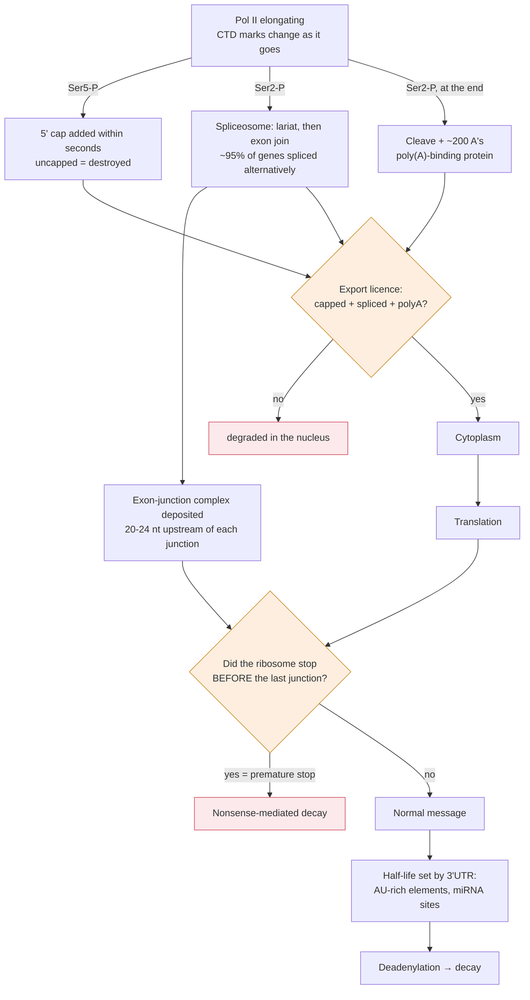

# Molecular & Cell Biology · Lesson 4.3: RNA processing & the mRNA life cycle

> ⏱ ~15 min · Module 4: Expression Control & Cell Identity · Builds on: [4.2](04-02-eukaryotic-transcription-machine.md), [biochemistry 4.5](../../biochemistry/lessons/04-05-flow-of-genetic-information.md) · Unlocks: 4.4 (protein quality control)

## Why this matters

[biochemistry 4.5](../../biochemistry/lessons/04-05-flow-of-genetic-information.md) and [general-biology 3.4](../../general-biology/lessons/03-04-central-dogma.md) gave you the central dogma as a clean pipeline: DNA to RNA to protein, codon by codon. That account is correct for bacteria and quietly false for you.

A human gene is mostly **not protein-coding sequence**. The dystrophin gene is 2.2 million bases long and encodes a 14 kb message; **more than 99 percent of what is transcribed is cut out and discarded**. That editing step is not waste — it is where a large part of human proteome diversity comes from, and where a large fraction of disease mutations act.

The other half of this lesson is the part nobody teaches: an mRNA's **abundance** depends as much on how long it survives as on how often it is made, and cells regulate degradation as aggressively as they regulate transcription.

## The idea

**Four processing events, all co-transcriptional.** They happen on the nascent RNA while Pol II is still elongating, recruited by the C-terminal domain from [4.2](04-02-eukaryotic-transcription-machine.md):

1. **Capping.** A modified guanosine is added backwards ($5'$-to-$5'$) to the $5'$ end, within seconds of it emerging. The cap protects against exonucleases and is the binding site for the translation initiation machinery. **An uncapped RNA is destroyed and never translated.**
2. **Splicing.** Introns are excised and exons joined by the **spliceosome**, a machine of five small nuclear RNAs plus a hundred proteins. The RNA components do the catalysis — the spliceosome is a ribozyme.
3. **Cleavage and polyadenylation.** The transcript is cut at a signal sequence and ~200 adenosines are added. The poly(A) tail, bound by poly(A)-binding protein, protects the $3'$ end and promotes translation.
4. **Export.** Only a correctly capped, spliced and polyadenylated RNA carries the protein marks that license passage through the nuclear pore. **The nucleus is a quality-control checkpoint.**

**Splicing chemistry, in one sentence.** Two sequential transesterifications: the $2'$-OH of a branch-point adenosine attacks the $5'$ splice site, forming a lariat; the freed $3'$-OH of the upstream exon then attacks the $3'$ splice site, joining the exons and releasing the lariat intron.

**Alternative splicing is the payoff.** By including or skipping exons, using alternative $5'$ or $3'$ splice sites, or retaining introns, one gene makes many proteins. Roughly **95 percent of human multi-exon genes are alternatively spliced**, and the choice is regulated by splicing factors that bind enhancer or silencer sequences in the pre-mRNA. The extreme case is *Dscam* in *Drosophila*, which can in principle generate 38,016 isoforms from one gene — more distinct proteins than the fly has genes.

**And then the message has a lifetime.** mRNA half-lives span from minutes to more than a day. Short-lived messages are the ones encoding things you must be able to turn off quickly — cytokines, transcription factors, cyclins. The instability is *encoded*, usually as AU-rich elements in the $3'$ untranslated region that recruit decay machinery.

**miRNAs tune it.** A ~22-nucleotide microRNA loaded into the Argonaute protein base-pairs with a partially complementary site in a $3'$UTR and represses the message — mostly by promoting deadenylation and decay. One miRNA targets hundreds of mRNAs; most human mRNAs are miRNA targets. **This is a regulatory layer with no counterpart in the central-dogma cartoon.**

**Nonsense-mediated decay is the proofreader.** Splicing deposits a protein complex ~20–24 nucleotides upstream of each exon–exon junction. Normally the first round of translation strips them all off. If a **premature stop codon** leaves a junction complex downstream of the terminating ribosome, the message is destroyed. *In words: the cell detects a premature stop by asking whether the ribosome finished before the last splice junction.*

## The formal version

**Steady-state abundance is production over decay.** For an mRNA transcribed at rate $k_{\text{tx}}$ and degraded with first-order rate $k_{\text{deg}}$:

$$\frac{dm}{dt} = k_{\text{tx}} - k_{\text{deg}}\,m \quad\Longrightarrow\quad \boxed{\;m_{ss} = \frac{k_{\text{tx}}}{k_{\text{deg}}}, \qquad t_{1/2} = \frac{\ln 2}{k_{\text{deg}}}\;}$$

*In words: doubling the half-life doubles the abundance just as surely as doubling transcription does.* Same structure as p53's stability control in [3.2](03-02-dna-damage-response.md), and the same lesson.

**The response-time theorem, which is the important part.** After a step change in $k_{\text{tx}}$, the approach to the new steady state is exponential with time constant $\tau = 1/k_{\text{deg}}$ — set by **decay alone**, not by transcription. Consequently:

$$\text{a stable mRNA is abundant and slow; an unstable mRNA is scarce and fast.}$$

**A cell cannot have a message that is both cheap to maintain at high level and quick to switch off.** This trade-off explains the observed correlation: signalling and regulatory transcripts have short half-lives (minutes) and housekeeping transcripts long ones (hours to days). The half-life *is* the response time, and evolution has set it by function.

**Splicing arithmetic.** For a gene with $n$ cassette exons each independently included or skipped, the number of possible isoforms is $2^{n}$. For mutually exclusive exon clusters of sizes $a, b, c, \dots$ the count is the product $a \times b \times c \times \dots$ — which is how *Dscam*'s $12 \times 48 \times 33 \times 2 = 38{,}016$ arises.

**Why a splice-site mutation is worse than it looks.** A point mutation at a splice site does not change one amino acid; it changes which exons are joined. Skipping an exon of length $L$ removes $L$ bases, and if $L$ is not a multiple of 3 the reading frame shifts and every downstream codon is destroyed — usually with a premature stop, which then triggers nonsense-mediated decay and eliminates the message entirely. **Roughly 10 percent of disease-causing point mutations act on splicing**, and their severity is largely decided by whether the skipped exon's length is divisible by three.

## Picture

**The two diamonds are the point.** Eukaryotic gene expression has two quality-control gates that the central-dogma cartoon contains no room for: one in the nucleus asking whether the message was processed correctly, and one in the cytoplasm asking whether it translates all the way to the last junction.

## Worked examples

**Example 1 (mechanical — abundance and response time are not independent).** Two mRNAs are transcribed at the same rate, $k_{\text{tx}} = 10$ molecules/min. Message A has $t_{1/2} = 10$ min; message B has $t_{1/2} = 10$ h. (a) Find each steady-state abundance. (b) A signal shuts transcription off completely. How long until each falls to 10 percent of its previous level? (c) State the design trade-off.

(a) $$k_{\text{deg}}^{A} = \frac{\ln 2}{10} = 0.0693\ \mathrm{min^{-1}}, \qquad m_{ss}^{A} = \frac{10}{0.0693} = \mathbf{144\ \text{molecules}}.$$

$$k_{\text{deg}}^{B} = \frac{\ln 2}{600} = 1.155\times10^{-3}\ \mathrm{min^{-1}}, \qquad m_{ss}^{B} = \frac{10}{1.155\times10^{-3}} = \mathbf{8660\ \text{molecules}}.$$

(b) Falling to 10 percent takes $\ln 10 / \ln 2 = 3.32$ half-lives:

$$\text{A: } 3.32 \times 10\ \mathrm{min} = \mathbf{33\ \text{min}}, \qquad \text{B: } 3.32 \times 10\ \mathrm{h} = \mathbf{33\ \text{h}}.$$

(c) **The stable message is 60 times more abundant and 60 times slower to switch off — and it is the same factor, because it is the same rate constant.** A cell cannot buy abundance without buying sluggishness, unless it is willing to pay for a higher transcription rate. Cytokines and cyclins therefore have half-lives of minutes and are transcribed hard when needed; ribosomal-protein and actin messages have half-lives of many hours and are transcribed gently. **The half-life is not a property of the molecule; it is a design choice encoded in the $3'$UTR.**

**Example 2 (why you'd care — exon skipping as a treatment, not just a disease).** Duchenne muscular dystrophy is usually caused by a deletion in *DMD* that shifts the reading frame; Becker muscular dystrophy is far milder and is caused by deletions in the same gene that **preserve** the frame. (a) Explain the difference mechanistically. (b) A patient has a deletion of exon 50, which shifts the frame. Explain how forcing the spliceosome to *additionally* skip exon 51 could help. (c) What does this predict about which patients such a drug can treat?

(a) A frame-preserving deletion (length divisible by 3) removes a chunk of the middle of the protein and joins the rest correctly. Dystrophin is a long rod-shaped protein whose central region is a repetitive spacer, so a shortened but in-frame rod still binds both ends and works, badly — **Becker**, mild.

A frame-shifting deletion destroys every codon downstream and introduces a premature stop ([biochemistry 4.5](../../biochemistry/lessons/04-05-flow-of-genetic-information.md)). That stop lies upstream of remaining exon junctions, so **nonsense-mediated decay destroys the message entirely** and no dystrophin at all is made — **Duchenne**, severe.

(b) The strategy is **exon skipping**: an antisense oligonucleotide is designed to base-pair with the splice signals of exon 51, blocking the spliceosome from including it. The mature message then runs exon 49 → exon 52.

The arithmetic is the whole idea. Exon 50 is 109 nt and exon 51 is 233 nt. Losing exon 50 alone:

$$109 \bmod 3 = 1 \quad\Longrightarrow\quad \text{frame shifted.}$$

Losing both 50 and 51:

$$109 + 233 = 342, \qquad 342 \bmod 3 = 0 \quad\Longrightarrow\quad \textbf{frame restored.}$$

The patient now makes a shortened, internally-deleted dystrophin — **converting a Duchenne genotype into a Becker-like one.** Drugs of exactly this design (eteplirsen, golodirsen) are approved, and their mechanism is nothing more than this modular arithmetic.

(c) **Only patients whose specific deletion can be frame-corrected by skipping one specific adjacent exon.** Each drug is exon-specific: an exon-51-skipping oligonucleotide helps roughly 13 percent of Duchenne patients — those whose deletions end such that removing exon 51 restores the frame. It does nothing for the rest, who need a different oligonucleotide entirely. **This is genuinely personalized medicine, and the personalization is a modular-arithmetic calculation on exon lengths.**

## Watch out

- **You might picture processing as sequential steps after transcription.** It is **co-transcriptional** — capping happens while the polymerase is 25 nucleotides in, and splicing happens on the nascent chain. The order is enforced by the changing marks on the Pol II tail ([4.2](04-02-eukaryotic-transcription-machine.md)), not by the RNA leaving the polymerase.
- **You might think introns are junk.** They carry enhancers, miRNA and snoRNA genes, and — crucially — they are what makes alternative splicing possible. An organism with no introns has one protein per gene.
- **You might expect a premature stop codon to give a shortened protein.** Usually it gives **no protein**, because nonsense-mediated decay eliminates the message first. This matters clinically: whether a nonsense mutation produces a truncated protein or nothing at all depends on where it sits relative to the last exon junction, and the two have completely different consequences (a truncated protein can be dominant-negative; no protein is simply a null).
- **You might treat mRNA level as a proxy for transcription rate.** It is production *over decay*. A two-fold rise in an mRNA is as likely to be stabilization as induction, and distinguishing them requires a transcription-shutoff time course.

## One-liner

> More than 99 percent of a human transcript can be discarded, the same gene can be spliced into thousands of proteins, and a message's abundance and its response time are the same number — because both are set by how fast it decays.

## Problems

**P1 (🟢)** An mRNA is transcribed at 20 molecules/min with a half-life of 30 min. (a) Find $k_{\text{deg}}$ and the steady-state abundance. (b) Transcription doubles. What is the new steady state, and how long until it is 90 percent of the way there?

**P2 (🟡)** A gene has 6 independently-included cassette exons of lengths 90, 120, 45, 111, 63, and 150 nucleotides. (a) How many isoforms are possible in principle? (b) How many of those preserve the reading frame? Justify your reasoning. (c) A point mutation destroys the $5'$ splice site of the 45 nt exon so it is always skipped. Is the resulting protein frame-shifted? What if the same happened to a 50 nt exon instead?

**P3 (🔴, bridges to 3.2 and to therapy)** A patient has a nonsense mutation in *TP53* creating a premature stop codon. (a) In one scenario the stop lies in exon 5 of 11; in another it lies in the final exon. Predict, for each, whether the message is degraded and what protein (if any) is made. (b) Recall from [3.2](03-02-dna-damage-response.md) that p53 acts as a tetramer and that missense mutations in it are dominant-negative. For each scenario in (a), predict whether the mutation is dominant-negative or a simple null, and explain the difference in terms of what protein exists. (c) A drug promotes readthrough of premature stop codons. Which scenario would it help, and what would you have to check about the resulting protein before expecting benefit?

Solutions

**P1 (a)** $$k_{\text{deg}} = \frac{\ln 2}{30} = 0.0231\ \mathrm{min^{-1}}, \qquad m_{ss} = \frac{20}{0.0231} = \mathbf{866\ \text{molecules}}.$$

**(b)** New steady state $= 40/0.0231 = \mathbf{1732}$ molecules — exactly double.

Time to 90 percent of the gap: $\ln 10/k_{\text{deg}} = 2.303/0.0231 = \mathbf{100\ \text{min}}$, or equivalently $3.32 \times 30\ \mathrm{min}$.

Note that the *time* did not change when transcription doubled — response time depends only on $k_{\text{deg}}$.

**P2 (a)** $$2^{6} = \mathbf{64\ \text{isoforms}}.$$

**(b)** Reduce each length mod 3:

| Exon | 90 | 120 | 45 | 111 | 63 | 150 |
|---|---|---|---|---|---|---|
| length mod 3 | 0 | 0 | 0 | 0 | 0 | 0 |

**Every exon is a multiple of 3**, so skipping any subset removes a multiple of 3 bases and the frame is always preserved: **all 64 isoforms are in frame.**

This is not a contrived setup — it is a real and striking genomic pattern. Cassette exons that are alternatively spliced are **significantly enriched for lengths divisible by three** compared with constitutive exons, because an exon whose skipping shifts the frame cannot be used as a regulated switch: skipping it would trigger nonsense-mediated decay and destroy the message rather than produce an alternative protein. **Selection has shaped exon lengths to make alternative splicing possible.**

**(c)** Skipping the 45 nt exon removes $45 = 3 \times 15$ bases: **the frame is preserved**, and the protein is simply 15 residues shorter. This may be harmful or harmless depending on what those residues did, but the rest of the protein is intact.

Skipping a **50 nt** exon removes $50 \bmod 3 = 2$, so the frame **shifts**. Every codon downstream is scrambled, a premature stop appears within tens of codons, that stop lies upstream of remaining exon junctions, and **nonsense-mediated decay destroys the message**. The result is a null allele, not a slightly altered protein — a far more severe outcome from a mutation of identical chemical type.

**P3 (a)**

*Stop in exon 5 of 11:* the terminating ribosome stops well upstream of six remaining exon–exon junctions, so exon-junction complexes remain downstream. **Nonsense-mediated decay destroys the message**, and essentially **no protein is made** — not even a truncated one.

*Stop in the final exon:* there are no exon junctions downstream of it, so no junction complex remains after the ribosome terminates. **NMD does not fire.** The message is stable and produces a **truncated p53 protein** lacking its C-terminal region.

**(b)**

*Exon 5 stop:* a **simple null**. No protein exists, so there is nothing to poison the wild-type subunits. A heterozygote makes wild-type p53 from its other allele and assembles normal tetramers from it — retaining roughly 50 percent of normal function, and the cell is substantially protected.

*Final-exon stop:* potentially **dominant-negative**, but only if the truncated protein still tetramerizes. The tetramerization domain of p53 sits near the C-terminus, so a stop in the final exon may or may not remove it — and that detail decides everything. If tetramerization survives, mutant subunits co-assemble and only $(1/2)^4 = 6.25$ percent of tetramers are fully wild-type ([3.2](03-02-dna-damage-response.md)); if it does not, the truncated protein is monomeric, cannot join complexes, and the allele behaves as a null.

**This is the general rule worth extracting: whether a nonsense mutation is a null or a dominant negative depends on whether NMD fires, and whether NMD fires depends on the position of the last exon junction.** Two nonsense mutations in the same gene can have opposite genetic behaviour for a reason that has nothing to do with the protein and everything to do with splicing.

**(c)** A readthrough drug helps only the **exon 5** scenario in principle — it is designed to make the ribosome insert an amino acid at a premature stop and continue, producing full-length protein.

But there is a catch you must check, and it follows from (a): in that scenario the message is **being destroyed by NMD**, so there may be very little of it left for the drug to act on. Readthrough drugs are therefore often paired with NMD inhibitors, and their efficacy correlates with residual message level.

Two further things to verify before expecting benefit: (i) **which amino acid gets inserted** at the readthrough site — if it is not tolerated at that position the full-length protein may be non-functional or, worse, misfolded and dominant-negative; and (ii) whether readthrough also occurs at **normal** stop codons genome-wide, extending thousands of other proteins with C-terminal junk. Selectivity for premature over normal stops is the central pharmacological problem for this drug class, and it is why so few have succeeded.

## Flashback

**From Lesson 4.2 (transcriptional bursting):** A gene has $k_{\text{on}} = 0.1\ \mathrm{min^{-1}}$, $k_{\text{off}} = 0.4\ \mathrm{min^{-1}}$, $k_{\text{tx}} = 12\ \mathrm{min^{-1}}$, and its mRNA has a half-life of 20 minutes. (a) Compute the mean transcription rate, the burst size, and the approximate Fano factor for the transcription process. (b) Compute the steady-state mRNA abundance. (c) A regulatory change doubles $k_{\text{on}}$ while leaving everything else alone. What happens to mean abundance, and what happens to the Fano factor? What if instead the change had doubled $k_{\text{tx}}$?

Solution

**(a)** Fraction of time ON: $0.1/(0.1+0.4) = 0.2$.

$$\text{mean transcription rate} = 0.2 \times 12 = \mathbf{2.4\ \text{transcripts/min}}.$$
$$\text{burst size} = \frac{k_{\text{tx}}}{k_{\text{off}}} = \frac{12}{0.4} = \mathbf{30}, \qquad \text{Fano} \approx 1 + 30 = \mathbf{31}.$$

**(b)** $$k_{\text{deg}} = \frac{\ln 2}{20} = 0.0347\ \mathrm{min^{-1}}, \qquad m_{ss} = \frac{2.4}{0.0347} = \mathbf{69\ \text{molecules}}.$$

**(c)** *Doubling $k_{\text{on}}$ to 0.2:* ON fraction becomes $0.2/0.6 = 0.333$, mean rate $= 4.0$/min, abundance $= 4.0/0.0347 = \mathbf{115}$ molecules — a rise of 1.67-fold (not 2-fold, because the ON fraction saturates). Burst size is unchanged at 30, so the **Fano factor stays at 31**. The gene gets louder without getting relatively noisier.

*Doubling $k_{\text{tx}}$ to 24 instead:* mean rate $= 0.2 \times 24 = 4.8$/min, abundance $= 4.8/0.0347 = \mathbf{138}$ molecules — a clean 2-fold rise. But burst size doubles to 60, so the **Fano factor rises to 61**: the gene is twice as noisy.

**The two routes to the same average are not equivalent.** For a gene whose product must be reliable, the enhancer/accessibility route (raising $k_{\text{on}}$) is strictly better than raising promoter output — which is exactly the division of labour observed, and the reason chromatin regulation is the dominant mode for dosage-sensitive genes.

## Connections

- **Backward:** [4.2](04-02-eukaryotic-transcription-machine.md)'s Pol II tail is what recruits every step here, in order; [biochemistry 4.5](../../biochemistry/lessons/04-05-flow-of-genetic-information.md) gave the genetic code that a frameshift destroys.
- **Forward:** [4.4](04-04-protein-quality-control-degradation.md) applies the identical production-over-decay argument one level down, to the protein; together the two lessons explain why mRNA and protein levels correlate so poorly.
- **Sideways:** mutation classes and the frameshift/nonsense distinction are [genetics 3.2](../../genetics/lessons/03-02-mutation.md); the reason splice-site variants are so hard to classify clinically is [genetics 4.5](../../genetics/lessons/04-05-human-genetics-genome-medicine.md).
