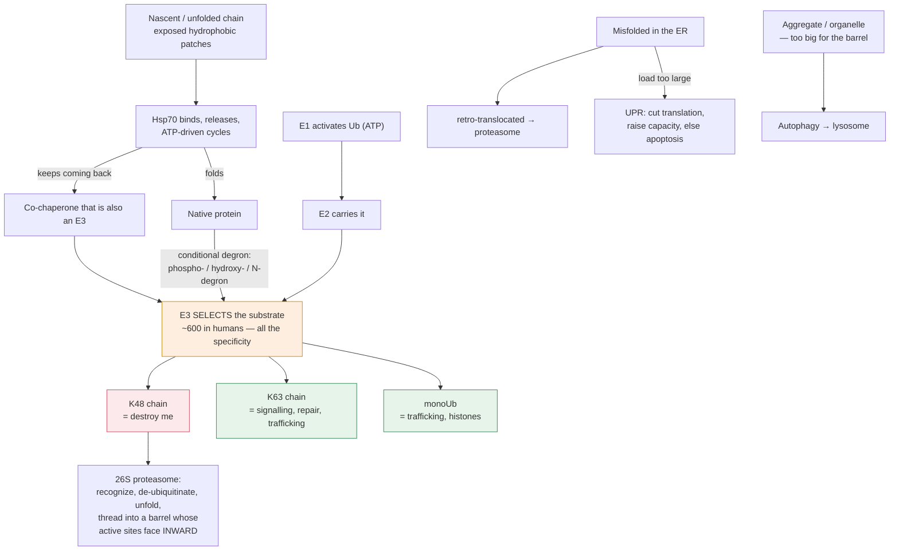

# Molecular & Cell Biology · Lesson 4.4: Protein quality control & degradation

> ⏱ ~15 min · Module 4: Expression Control & Cell Identity · Builds on: [4.3](04-03-rna-processing-mrna-life-cycle.md), [biochemistry 1.4](../../biochemistry/lessons/01-04-the-folding-problem.md) · Unlocks: 4.5 (stem cells)

## Why this matters

[biochemistry 1.4](../../biochemistry/lessons/01-04-the-folding-problem.md) established that a protein's sequence determines its fold, that folding is marginally stable, and that misfolding causes disease. It left an obvious question unanswered: **what does the cell do about the ones that fail?**

The answer turns out to be a whole apparatus, and it is not a janitorial afterthought. Regulated destruction is a control mechanism the cell uses as aggressively as transcription — you have already seen it run the cell cycle ([3.1](03-01-cell-cycle-engine-irreversibility.md)) and set p53's abundance ([3.2](03-02-dna-damage-response.md)). This lesson assembles the machinery and shows why **protein level is production over decay**, exactly as mRNA level was — which is most of why the two correlate so poorly.

## The idea

**Three problems, three systems.**

- **Misfolding in the cytosol** → chaperones try to refold; failure routes to the proteasome.
- **Misfolding in the ER** → ER-associated degradation retro-translocates the protein back to the cytosol for the proteasome; if the load is too large, the unfolded-protein response fires.
- **Anything too big for the proteasome** — aggregates, whole organelles, invading bacteria → **autophagy**, engulfment in a double membrane and delivery to the lysosome.

**Chaperone triage.** Hsp70 binds exposed hydrophobic patches — the signature of an unfolded chain — and releases in ATP-driven cycles, giving the protein another chance to fold. A chain that keeps coming back is eventually handed to a **co-chaperone that is also a ubiquitin ligase**, which routes it for destruction. *In words: the cell gives a protein a few tries and then gives up, and the counter is simply how often it re-binds the chaperone.*

**The ubiquitin code.** Ubiquitin is a 76-residue protein attached through its C-terminus to a lysine on the target, by a three-enzyme relay: **E1** activates ubiquitin using ATP, **E2** carries it, **E3** selects the substrate and transfers it. Humans have 2 E1s, ~40 E2s, and **over 600 E3s** — the specificity lives almost entirely in the E3, which is why E3 ligases are the interesting genes (and the druggable ones).

**The signal is which lysine of ubiquitin the next ubiquitin attaches to.** Ubiquitin has seven lysines and chains can be built on any of them:

| Chain linkage | Meaning |
|---|---|
| **K48-linked polyubiquitin** | destroy me — proteasome |
| K63-linked | signalling, DNA repair, trafficking — **not** degradation |
| Monoubiquitin | trafficking, histone regulation ([4.1](04-01-chromatin-packaging-regulation.md)) |

**Ubiquitin is not a death sentence; it is a word whose meaning depends on the linkage.**

**The proteasome is a self-compartmentalized shredder.** A barrel (20S core) with its proteolytic sites facing *inward*, capped by a regulatory particle (19S) that recognizes K48 chains, removes the ubiquitin for recycling, unfolds the substrate with ATP, and threads it into the barrel. **The active sites are on the inside precisely so nothing is degraded by accident** — the same design principle as a lysosome's membrane or a caspase's inhibitor.

## The formal version

**Protein abundance and response time, again.** For a protein synthesized at rate $k_s$ and degraded at $k_d$:

$$P_{ss} = \frac{k_s}{k_d}, \qquad \tau = \frac{1}{k_d}, \qquad t_{1/2} = \frac{\ln 2}{k_d}.$$

**Now stack it on the mRNA.** Protein synthesis rate is proportional to mRNA abundance, so for the full two-step cascade

$$\text{DNA} \xrightarrow{k_{\text{tx}}} \text{mRNA} \xrightarrow{k_{\text{tl}}} \text{protein},$$

$$\boxed{\;P_{ss} = \frac{k_{\text{tx}}}{k_{\text{deg,m}}} \times \frac{k_{\text{tl}}}{k_{\text{deg,p}}}\;}$$

*In words: protein level is a product of four rate constants, only one of which is transcription.* This is the quantitative answer to a fact that surprises people: **mRNA and protein levels across a genome correlate with $R^2$ of only about 0.4.** Three of the four knobs are invisible to RNA-seq.

**Dilution by growth.** In a dividing cell, a protein is also removed by being split between daughters. The effective removal rate is

$$k_{\text{eff}} = k_d + k_{\text{dil}}, \qquad k_{\text{dil}} = \frac{\ln 2}{T_{\text{doubling}}}.$$

For a stable protein in a cell dividing every 24 h, dilution dominates entirely — **most proteins in a proliferating cell are removed by division, not by degradation**, and a "stable" protein simply cannot be turned over faster than the cell divides. This is a real constraint on how quickly a dividing cell can change its proteome, and it is why terminally differentiated non-dividing cells (neurons, cardiomyocytes) are so much more vulnerable to accumulated protein damage.

**Degrons.** A degron is a sequence or modification that an E3 recognizes. Some are constitutive; the interesting ones are **conditional**:

- **Phosphodegrons** — an E3 binds only after a kinase phosphorylates the substrate. This couples degradation to signalling and is exactly how SCF destroys the CDK inhibitor at G1/S ([3.1](03-01-cell-cycle-engine-irreversibility.md)).
- **Oxygen-dependent degrons** — HIF-1α is hydroxylated on a proline by an oxygen-requiring enzyme, and the hydroxyproline is what its E3 recognizes. In hypoxia the hydroxylase cannot work, HIF-1α is not degraded, and it accumulates and drives the hypoxic response. **The oxygen sensor is a degradation switch**, which is a genuinely elegant piece of design and won the 2019 Nobel Prize.
- **N-degrons** — the identity of the N-terminal residue itself sets half-life, from minutes to days.

**The unfolded-protein response is a load-sensing feedback loop.** Unfolded protein accumulating in the ER titrates chaperones away from three sensors in the ER membrane, activating them. They respond by (i) *reducing* translation globally, (ii) *increasing* chaperone and ERAD capacity, and (iii) if the stress persists, triggering apoptosis. *In words: reduce the input, raise the capacity, and if that fails, kill the cell.* Structurally this is a negative-feedback controller with a failure mode — and the switch from adaptive to apoptotic output is again a duration-decoding problem ([2.4](02-04-circuits-feedback-adaptation.md)).

## Picture

**Two things to read off it.** The specificity of the whole system sits in one node — the E3 — which is why 600 of them exist and why they are the druggable step. And ubiquitin leaving that node means three different things depending on the chain linkage: only K48 says "destroy."

## Worked examples

**Example 1 (mechanical — why mRNA is a poor proxy for protein).** Two genes have identical mRNA levels of 100 molecules. Gene A's protein is translated at $k_{\text{tl}} = 2$ proteins per mRNA per min with a half-life of 20 min; gene B's at $k_{\text{tl}} = 0.5$ per mRNA per min with a half-life of 24 h. (a) Compute both protein levels. (b) The cell divides every 24 h — recompute B including dilution. (c) Comment.

(a) $$k_{\text{deg,p}}^{A} = \frac{\ln 2}{20} = 0.0347\ \mathrm{min^{-1}}, \qquad P^{A} = \frac{100 \times 2}{0.0347} = \mathbf{5.8\times10^{3}}.$$

$$k_{\text{deg,p}}^{B} = \frac{\ln 2}{1440} = 4.81\times10^{-4}\ \mathrm{min^{-1}}, \qquad P^{B} = \frac{100 \times 0.5}{4.81\times10^{-4}} = \mathbf{1.04\times10^{5}}.$$

(b) Dilution at a 24 h doubling time contributes $k_{\text{dil}} = \ln 2/1440 = 4.81\times10^{-4}\ \mathrm{min^{-1}}$ — exactly equal to B's own degradation rate. So

$$k_{\text{eff}}^{B} = 4.81\times10^{-4} + 4.81\times10^{-4} = 9.62\times10^{-4}, \qquad P^{B} = \frac{50}{9.62\times10^{-4}} = \mathbf{5.2\times10^{4}},$$

**halved by division alone.** (For A, $k_{\text{dil}}$ is 1.4 percent of $k_{\text{deg}}$ and is negligible.)

(c) **Identical mRNA, a 9-fold difference in protein.** And the difference came entirely from parameters an RNA-seq experiment cannot see. This is the quantitative content of the observed genome-wide mRNA–protein correlation of $R^2 \approx 0.4$: transcript abundance explains under half the variance in protein abundance, and the rest lives in translation rate and protein stability.

**Example 2 (why you'd care — turning a ligase against a target on purpose).** Thalidomide and its analogues (lenalidomide, pomalidomide) work by binding cereblon, the substrate receptor of an E3 ligase, and **changing which substrates it recognizes** — recruiting transcription factors that the ligase would never normally touch and destroying them. (a) Why is this a fundamentally different pharmacology from inhibition? (b) Explain the design of a PROTAC. (c) Give two reasons why degradation can succeed where inhibition fails.

(a) An inhibitor must **occupy** its target continuously, so efficacy requires sustained high occupancy, and any target without a deep binding pocket is "undruggable." A degrader is **catalytic**: one drug molecule can bring many copies of the target to the ligase, one after another, and once a target is destroyed the effect persists until the cell resynthesizes it. Occupancy is not the mechanism — **event-driven** destruction is.

(b) A **PROTAC** (proteolysis-targeting chimera) is a single molecule with three parts: a ligand that binds the target protein, a ligand that binds an E3 ligase, and a linker joining them. It has no inhibitory activity at all. It works purely by **forcing a ternary complex** — target, drug, ligase — so that the ligase ubiquitinates a protein it was never designed to see. The K48 chain then routes it to the proteasome.

Note that the target ligand need not bind an active site or block anything; **it only has to bind somewhere on the surface.** That is the crucial relaxation of requirements.

(c) Two of:

- **Undruggable targets become druggable.** Transcription factors, scaffolds, and proteins with flat surfaces have no pocket to inhibit but plenty of surface to bind. Since a degrader only needs a handhold, targets that resisted fifty years of inhibitor chemistry become accessible.
- **Non-catalytic (scaffolding) functions are eliminated too.** A kinase inhibitor stops the kinase reaction and leaves the protein sitting there holding its complexes together — and for many kinases the scaffolding role matters as much as the catalysis. Degradation removes the protein entirely.
- **Resistance is harder.** A gatekeeper mutation that blocks inhibitor binding at an active site often does not block a PROTAC that binds elsewhere, and gene amplification ([2.3](02-03-kinase-cascades-switch.md)) is a weaker defence against a catalytic degrader than against a stoichiometric inhibitor.
- **Sub-stoichiometric dosing.** Because one drug molecule destroys many targets, effective doses can be far below the target's abundance.

## Watch out

- **You might think ubiquitin means "destroy."** Only **K48-linked chains** route to the proteasome. K63 chains signal in DNA repair and trafficking, and monoubiquitin regulates histones. The linkage is the word; ubiquitin is only the alphabet.
- **You might expect mRNA level to predict protein level.** It predicts under half the variance. Translation rate and protein half-life together carry as much information, and neither appears in a transcriptome.
- **You might think degradation is how cells remove damaged proteins.** It is also how they *control* proteins — cyclins, p53, HIF-1α, and CDK inhibitors are all perfectly folded and destroyed on purpose. Regulated proteolysis is a signalling mechanism, and using it for irreversibility is the whole trick of [3.1](03-01-cell-cycle-engine-irreversibility.md).
- **You might ignore dilution.** In a proliferating cell, division removes stable proteins faster than proteolysis does. A protein cannot have an effective half-life longer than the cell cycle no matter how stable it is.

## One-liner

> Ubiquitin is an alphabet whose meaning is the chain linkage, protein level is production over decay just as mRNA level was — and a drug that recruits a ligase to a new target destroys proteins no inhibitor could ever have touched.

## Problems

**P1 (🟢)** A protein is synthesized at 500 molecules/min and has a half-life of 45 min in a non-dividing cell. (a) Find $k_d$ and the steady-state level. (b) A drug blocks its E3 ligase, extending the half-life to 8 h. Find the new steady state and the fold-change.

**P2 (🟡)** A cell divides every 20 h. Two proteins have intrinsic half-lives of 30 min and 40 h. (a) Compute $k_{\text{dil}}$. (b) For each protein, compute $k_{\text{eff}}$ and state what fraction of removal is due to dilution. (c) A drug completely blocks proteasomal degradation. By what factor does each protein's steady-state level rise? Explain why the answers differ so much.

**P3 (🔴, bridges to 3.2 and to drug design)** HIF-1α is hydroxylated on a proline by an oxygen-dependent enzyme; the hydroxyproline is recognized by the VHL E3 ligase, which destroys it. In normoxia its half-life is under 5 minutes; in hypoxia, hours. (a) Explain why regulating a transcription factor by *degradation* rather than by *transcription* is the right design for an oxygen sensor — use the response-time argument. (b) Clear-cell renal carcinoma is characterized by biallelic loss of *VHL*. Predict the tumour's phenotype and name one therapeutic vulnerability it creates. (c) A drug inhibits the prolyl hydroxylase. Predict its effect and name a clinical use — and identify the safety concern that follows directly from (b).

Solutions

**P1 (a)** $$k_d = \frac{\ln 2}{45} = 0.0154\ \mathrm{min^{-1}}, \qquad P_{ss} = \frac{500}{0.0154} = \mathbf{3.25\times10^{4}\ \text{molecules}}.$$

**(b)** $$k_d = \frac{\ln 2}{480} = 1.444\times10^{-3}, \qquad P_{ss} = \frac{500}{1.444\times10^{-3}} = \mathbf{3.46\times10^{5}},$$

a rise of $480/45 = \mathbf{10.7\text{-fold}}$ — exactly the ratio of the half-lives, as it must be.

**P2 (a)** $$k_{\text{dil}} = \frac{\ln 2}{1200\ \mathrm{min}} = 5.78\times10^{-4}\ \mathrm{min^{-1}}.$$

**(b)** Short-lived protein, $t_{1/2} = 30$ min: $k_d = 0.0231\ \mathrm{min^{-1}}$.

$$k_{\text{eff}} = 0.0231 + 0.000578 = 0.0237, \qquad \text{dilution share} = \frac{0.000578}{0.0237} = \mathbf{2.4\ \text{percent}}.$$

Long-lived protein, $t_{1/2} = 40$ h $= 2400$ min: $k_d = 2.89\times10^{-4}\ \mathrm{min^{-1}}$.

$$k_{\text{eff}} = 2.89\times10^{-4} + 5.78\times10^{-4} = 8.67\times10^{-4}, \qquad \text{dilution share} = \mathbf{67\ \text{percent}}.$$

**(c)** Blocking degradation sets $k_d = 0$, leaving only dilution.

$$\text{short-lived: } \frac{k_{\text{eff,old}}}{k_{\text{eff,new}}} = \frac{0.0237}{5.78\times10^{-4}} = \mathbf{41\times}\ \text{rise}.$$

$$\text{long-lived: } \frac{8.67\times10^{-4}}{5.78\times10^{-4}} = \mathbf{1.5\times}\ \text{rise}.$$

**Why so different:** a proteasome inhibitor can only remove the contribution that proteolysis was making. For the short-lived protein that was 97.6 percent of its removal, so blocking it is dramatic. For the long-lived protein, division was already doing two-thirds of the work and the drug cannot touch that.

**This is exactly why proteasome inhibitors (bortezomib) work in multiple myeloma.** Myeloma cells are plasma cells secreting enormous quantities of immunoglobulin; their proteostasis burden is dominated by rapidly-turned-over misfolded protein — precisely the short-half-life population, where blocking proteolysis produces a 40-fold accumulation and lethal ER stress. Ordinary cells, dominated by stable proteins and dilution, see something closer to a 1.5-fold change. **The selectivity comes from which half-life class the cell's proteome is dominated by**, not from any tumour-specific target.

**P3 (a)** Because the **response time is $1/k_d$**, and an oxygen sensor must respond in minutes.

Regulating by transcription means the response time is set by the mRNA's half-life plus the protein's, and building up a new protein pool from zero takes several half-lives — tens of minutes to hours ([4.3](04-03-rna-processing-mrna-life-cycle.md)). Regulating by degradation acts on a protein **already being synthesized**: the cell transcribes and translates HIF-1α continuously and destroys it just as fast, so the standing production is a pre-loaded, ready-to-deploy pool. Stop the destruction and the protein appears within minutes, at a rate set by synthesis rather than by transcriptional induction.

The cost is that the cell wastes energy synthesizing a protein it immediately destroys — the same standing cost as the futile cycling of [2.3](02-03-kinase-cascades-switch.md) and the pre-loaded SNAREs of [1.4](01-04-endomembrane-trafficking.md). **Speed is bought with waste, every time.**

**(b)** With no VHL, HIF-1α is never ubiquitinated and accumulates **regardless of oxygen**. The tumour runs a constitutive hypoxic program in normal oxygen — the classic *pseudohypoxia*. Its most prominent consequence is massive **VEGF** production driving angiogenesis, which is why clear-cell renal carcinoma is characteristically one of the most vascular tumours seen.

*Therapeutic vulnerability:* the tumour's dependence on that angiogenic output. Anti-VEGF antibodies (bevacizumab) and VEGF-receptor tyrosine-kinase inhibitors (sunitinib, pazopanib) are standard therapy in this disease specifically, and this is one of the clearest examples of a treatment chosen from a molecular mechanism. (A more recent and more direct approach — belzutifan, a small molecule that inhibits HIF-2α itself — targets the accumulated transcription factor rather than its output.)

**(c)** Inhibiting the prolyl hydroxylase prevents HIF-1α hydroxylation, so VHL cannot recognize it and it accumulates — **pharmacologically mimicking hypoxia in a normoxic patient.** The clinical use is **anaemia of chronic kidney disease**: stabilized HIF drives erythropoietin transcription, raising red-cell production, and drugs of this class (roxadustat, daprodustat) are approved for it. The appeal over injected erythropoietin is that it is oral and it also improves iron handling.

*The safety concern follows directly from (b).* If constitutive HIF stabilization by *VHL* loss produces a highly vascular tumour, then producing the same stabilization pharmacologically raises the concern that these drugs could promote angiogenesis in an occult tumour or worsen proliferative retinopathy — and cardiovascular and thrombotic signals have in fact been the central regulatory question for this class. **The mechanism that makes the drug work and the mechanism that makes the tumour dangerous are the same mechanism**, which is a recurring and uncomfortable pattern in pathway-targeted pharmacology.

## Flashback

**From Lesson 4.3 (mRNA abundance and response time):** A cytokine mRNA is transcribed at 30 molecules/min and has a half-life of 8 minutes. Its protein is translated at 4 proteins per mRNA per min and has a half-life of 25 minutes. The cell is not dividing. (a) Compute the steady-state mRNA and protein levels. (b) An inflammatory signal shuts transcription off entirely. How long until the *protein* falls to 10 percent of its level? (c) Which of the two half-lives dominates the shut-off time, and what general rule does this illustrate?

Solution

**(a)** $$k_{\text{deg,m}} = \frac{\ln 2}{8} = 0.0866\ \mathrm{min^{-1}}, \qquad m_{ss} = \frac{30}{0.0866} = \mathbf{346\ \text{molecules}}.$$

$$k_{\text{deg,p}} = \frac{\ln 2}{25} = 0.0277\ \mathrm{min^{-1}}, \qquad P_{ss} = \frac{346 \times 4}{0.0277} = \frac{1386}{0.0277} = \mathbf{5.0\times10^{4}\ \text{molecules}}.$$

**(b)** After transcription stops, mRNA decays with an 8-minute half-life and is essentially gone within ~30 minutes; the protein then decays with its own 25-minute half-life. Since the mRNA disappears roughly three times faster than the protein, the protein's fall is dominated by its own decay. Falling to 10 percent takes $\ln 10/\ln 2 = 3.32$ protein half-lives:

$$3.32 \times 25\ \mathrm{min} \approx \mathbf{83\ \mathrm{min}},$$

plus a short lag of roughly one mRNA half-life while the message clears — call it **90 minutes** in total.

**(c)** The **protein** half-life dominates, because it is the slower of the two. The general rule for a cascade of first-order steps: **the response time is set by the slowest step downstream of the change.** Making the mRNA even more unstable would barely speed the shut-off; making the protein less stable would speed it proportionally.

This is why cytokines and other proteins that must be switched off fast are unstable **at both levels** — a short-lived message alone is not enough, because a stable protein made from it would persist regardless. Cells that need fast off-switches pay for instability twice.

## Connections

- **Backward:** [4.3](04-03-rna-processing-mrna-life-cycle.md) established production-over-decay for mRNA; this lesson stacks the same argument on the protein, and the product of the two is why transcriptomes explain less than half of proteomes.
- **Forward:** [4.5](04-05-stem-cells-differentiation-reprogramming.md) needs regulated degradation to explain how a cell can dismantle one identity and build another; a stable state requires both the right proteins made and the wrong ones destroyed.
- **Sideways:** this is the machinery behind [3.1](03-01-cell-cycle-engine-irreversibility.md)'s SCF and APC/C and [3.2](03-02-dna-damage-response.md)'s MDM2 — three lessons that used regulated proteolysis before it was explained, now assembled; the folding problem it cleans up after is [biochemistry 1.4](../../biochemistry/lessons/01-04-the-folding-problem.md).
