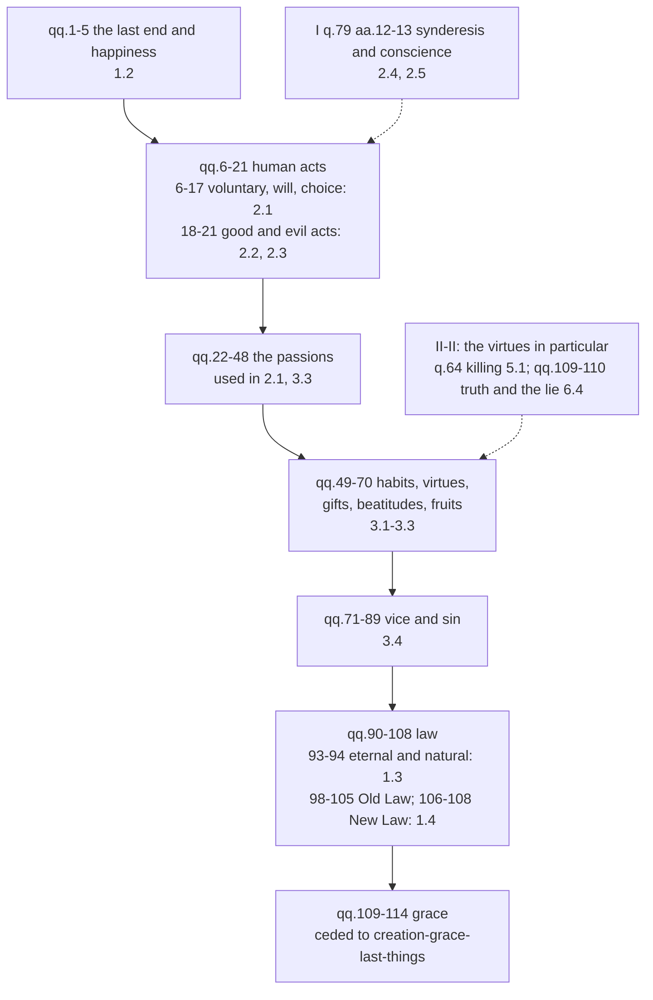

# Moral Theology · Lesson 1.1: What moral theology is

> ⏱ ~15 min · Module 1: Beatitude, law and grace · Builds on: [`thomistic-synthesis` 5.4](../../thomistic-synthesis/lessons/05-04-a-map-of-the-second-and-third-parts.md), [`fundamental-theology` 4.4](../../fundamental-theology/lessons/04-04-the-ladder-of-doctrinal-authority.md), [`ethics` 4.4](../../ethics/lessons/04-04-natural-law-aquinas.md) · Unlocks: [1.2 Beatitude, the last end](01-02-beatitude-the-last-end.md), [2.1 The voluntary](02-01-the-voluntary.md)

## Why this matters

Ask a Catholic of 1950 what moral theology was and you would likely have heard: the science a priest needs to hear confessions, meaning which sins are grave, which are light, and what excuses. Ask *Veritatis Splendor* (1993) and you get a young man asking Jesus what good he must do to have eternal life. Both answers are Catholic. This course runs on the second without throwing away the first. That is only possible if you can say what makes moral theology *theology*, and what exactly the Second Vatican Council asked to be renewed.

## The idea

Any account of right action has to begin somewhere. Begin with **the question "what am I allowed to do?"** and you get a morality of *obligation*: law marks the boundaries, freedom moves inside them, and the moralist's job is to map the boundary exactly. Begin with **the question "what is the good that fulfils me?"** and you get a morality of *happiness and virtue*: law and commandments still bind, but as the road to an end, and the moralist's job is to show how a person becomes able to reach it.

Moral theology is **theology** because the answer to the second question comes from revelation. [`ethics` 4.4](../../ethics/lessons/04-04-natural-law-aquinas.md) gave you natural law as philosophy: reason grasping human goods. Theology adds two things reason cannot supply. The first is an **end**: God himself, seen, which exceeds what nature can reach ([1.2](01-02-beatitude-the-last-end.md)). The second is **the power to reach it**: grace, which is what Aquinas means by the New Law ([1.4](01-04-the-new-law.md)). A moral theology is the study of human action ordered to *that* end by *that* power. See [what makes moral theology theology](../reference.md#what-makes-moral-theology-theology).

## Source

Matthew 19:16–22 (Douay–Rheims), the passage *Veritatis Splendor* uses for its whole first chapter (sections 6–27):

> And behold one came and said to him: Good master, what good shall I do that I may have life everlasting? Who said to him: Why askest thou me concerning good? One is good, God. But if thou wilt enter into life, keep the commandments. He said to him: Which? And Jesus said: Thou shalt do no murder, Thou shalt not commit adultery, Thou shalt not steal, Thou shalt not bear false witness. Honour thy father and thy mother: and, Thou shalt love thy neighbor as thyself. The young man saith to him: All these have I kept from my youth, what is yet wanting to me? Jesus saith to him: If thou wilt be perfect, go sell what thou hast, and give to the poor, and thou shalt have treasure in heaven: and come, follow me. And when the young man had heard this word, he went away sad: for he had great possessions.

Three moves carry the passage. **The question** links the good to *life everlasting*: morality is asked about as the way to an end. **The first answer** refers the good to God ("One is good, God") and then names commandments: the Decalogue is the entry to life, not an obstacle to it. **The second answer** goes past the commandments to "follow me". What is still lacking is not another rule but a person. *Veritatis Splendor* 7 draws the lesson, in paraphrase: the young man is asking less about rules than about the full meaning of life, and it was for this reason that the Council called for moral theology to be renewed.

## The argument

1. **Theology studies everything under the aspect of God.** In sacred science, "all things are treated of under the aspect of God: either because they are God Himself or because they refer to God as their beginning and end" (ST I q.1 a.7). *In words:* human acts belong to theology because they are the way back to God.
2. **An end must be known before acts can be directed to it, and our end exceeds reason.** Revelation was needed "because man is directed to God, as to an end that surpasses the grasp of his reason ... But the end must first be known by men who are to direct their thoughts and actions to the end" (ST I q.1 a.1).
3. **So a moral theology begins from the end.** Aquinas's *Prima Secundae* does exactly this. Its prologue takes up man as God's image, as the principle of his own acts ([`thomistic-synthesis` 5.4](../../thomistic-synthesis/lessons/05-04-a-map-of-the-second-and-third-parts.md) reads it). It then treats the last end (qq.1–5) before a single act is judged.
4. **The manuals began elsewhere, for a real reason.** Trent (Session XIV, 1551, ch. 5 and can. 7) taught that one must confess, by divine law, every mortal sin remembered after diligent examination, together with the circumstances that change a sin's species. It also taught that the priest judges as well as absolves. Confessors therefore needed a precise science of sins. The genre of *Institutiones morales*, the [manual tradition](../reference.md#the-manual-tradition), met that need. The Jesuit Juan Azor's, whose first volume appeared in 1600, is usually taken as the model. These books ran on the commandments and the sacraments, with a general part on human acts, conscience, law and sin. Virtue and growth in holiness moved to a separate "ascetical" theology. At their best the manuals were precise, pastorally humane, and often Thomist in their principles. [4.1](04-01-casuistry-and-the-probabilism-controversy.md) defends casuistry at full strength.
5. **Pinckaers's diagnosis.** In *The Sources of Christian Ethics* (French 1985; English 1995), Servais Pinckaers argued, in paraphrase, that the manuals inherited William of Ockham's [freedom of indifference](../reference.md#freedom-of-indifference-and-freedom-for-excellence): freedom as the bare power to choose between contraries, prior to reason and natural inclination. On that view law can only arrive from outside as a limit, and obligation becomes the centre of morality. His alternative is **freedom for excellence**. This freedom is rooted in our natural inclinations to truth and goodness, and it grows with virtue, much as a musician grows freer by practice. *In words:* one view makes freedom greatest before any choice; the other makes it greatest in the saint. (Ockham's voluntarism as a thesis about God's commands is [`ethics` 6.5](../../ethics/lessons/06-05-god-and-morality-the-euthyphro-dilemma.md)'s.)
6. **The Council asked for renewal, not demolition.** *Optatam Totius* 16 (1965), in paraphrase: special care should go to perfecting moral theology. Its scientific exposition should draw more on scripture and should show the loftiness of the faithful's calling in Christ and their duty to bear fruit in charity for the world. *Veritatis Splendor* 76 still defends casuistry for cases where the law is uncertain.

**Mark the levels.** Trent's requirement to confess every remembered mortal sin with its species-changing circumstances is **defined** (an anathematized canon). *Optatam Totius* 16 is a conciliar decree's **directive about how to teach**, binding on seminary formation but not proposing a doctrine. Like the disciplinary directions in [`fundamental-theology` 4.5](../../fundamental-theology/lessons/04-05-reading-a-documents-weight.md), it is not on the ladder. That freedom is truly freedom only in the service of the good is taught in the Catechism (CCC 1733, paraphrased: the more one does good, the freer one becomes). That is **at least authentic ordinary magisterium**, and CCC 1731 keeps the power of choice as part of the definition. Pinckaers's story about Ockham and the manuals is a historian-theologian's thesis with **no magisterial act behind it**, and it is disputed: critics answer that the manuals were more varied and more Thomist than his genealogy allows. Aquinas's order of I-II is an arrangement, not a proposition, so it has no level at all. See [the levels in moral theology](../reference.md#the-levels-in-moral-theology).

## The map of I-II

[`thomistic-synthesis` 5.4](../../thomistic-synthesis/lessons/05-04-a-map-of-the-second-and-third-parts.md) gives the four blocks. Here is the same part at the resolution this course uses, with the lesson that reads each stretch. See [the plan of ST I-II](../reference.md#the-plan-of-st-i-ii).

The shape is the argument. The end comes first. Sin sits among the *intrinsic principles*, with habits and virtue, as the disorder of a being made for virtue. Law and grace come last, as the principles that move us from outside: instruction and help. Conscience is not a separate treatise at all. Aquinas handles it as an act of practical reason in Part I, which is why [2.4](02-04-conscience-its-nature-and-its-errors.md) starts there.

## Worked examples

**Example 1: a manual question on the map.** *Is it a mortal sin to miss Sunday Mass through oversleeping after a late night?* A manual answers crisply: grave matter under a precept of the Church; oversleeping without deliberate neglect lacks full consent, so the sin is not mortal. The I-II map shows where each piece of that answer lives. "Without deliberate neglect" is the voluntary (qq.6–17; [2.1](02-01-the-voluntary.md)). "Grave matter" and "mortal" belong to sin (qq.71–89; [3.4](03-04-sin-mortal-and-venial.md)). "A precept of the Church" is human law (q.95ff; [1.3](01-03-natural-law-in-light-of-revelation.md) sets it up). The renewal does not overturn the verdict. It adds what the manual left to spiritual reading: Sunday worship is ordered to the last end, and the real question for this person is whether his life is being ordered to it too. **Same verdict, larger frame.**

**Example 2: where the frame strains.** A penitent asks a confessor: *is this particular act allowed or not?* "Freedom for excellence" gives no verdict by itself, and a moral theology that only talked about vocation and happiness would leave him without one. That was the real danger after the Council, and *Veritatis Splendor* names it. It rejects theories that justify deliberate choices against the commandments, and in section 76 it defends casuistry for doubtful cases. So the beatitude frame must still deliver precise verdicts, through the object of the act (Module 2) and the manual tools that survive (Module 4). The rich young man shows both halves. The commandments are non-negotiable ("keep the commandments"). And they are not the whole ("what is yet wanting to me?"). A moral theology that keeps only the first becomes minimalism: what is the least I must do? One that keeps only the second becomes sentiment without verdicts.

## Watch out

- **You might think moral theology is ethics plus Bible verses.** The difference is structural. The end (God seen) and the power (grace) come from revelation, and they change what counts as a complete answer. Natural law stays, as [1.3](01-03-natural-law-in-light-of-revelation.md) shows.
- **You might think Vatican II abolished the manuals' conclusions.** *Optatam Totius* 16 asks for a renewed *exposition*. *Veritatis Splendor* keeps the commandments binding and, in section 76, keeps casuistry for uncertain law.
- **Overstating a level:** "The Church teaches that Ockham corrupted moral theology." No act teaches that. It is Pinckaers's thesis, and it is contested.
- **Understating a level:** "Freedom as service of the good is just Pinckaers's opinion." CCC 1733 teaches it. It is at least authentic ordinary magisterium, whatever you make of his history.
- **Freedom for excellence does not deny choice.** CCC 1731 defines freedom as the power to act or not, to do this or that. The dispute is over what freedom is *for*. Whether choice is causally determined is a different question, [`metaphysics` 6.4](../../metaphysics/lessons/06-04-libertarianism-and-its-critics.md)'s.

## One-liner

> Moral theology asks the rich young man's question, what good leads to eternal life: the commandments are its entry, the vision of God its end, grace its power, and the confessor's verdicts one part of it, not the whole.

## Problems

**P1 (🟢)** *(Exegetical)* Place each question in its block of ST I-II (give the question range) and name this course's lesson that treats it. One line each.
(a) Does acting out of fear make an act less voluntary?
(b) Is happiness found in honour or in wealth?
(c) Can a charity poured in by God coexist with a habit of sin acquired over years?
(d) Does a civil law that commands something unjust bind in conscience?

**P2 (🟡)** *(Exegetical)* An **invented** parish handout, written for this problem:

> "What is moral theology? It is the study of sin. God gave us free will, the power to choose anything at all, and He gave us the Commandments to mark the limits of that freedom. Part One lists the mortal and venial sins under each commandment. Before Vatican II the Church was all rules; since the Council, moral theology is about love and conscience instead."

(a) Name the conception of freedom the handout assumes, in Pinckaers's terms, and say what it makes the centre of morality. (b) Name two further errors, one about what moral theology is and one about what the Council did, each with the text that corrects it. (c) Name one thing the handout gets right. 150 words or fewer.

**P3 (🔴)** *(Exegetical)* Assign each claim a rung on the ladder, or say it is off the ladder, and name the act (or the absence of one) that fixes it. One sentence each.
(a) By divine law, a penitent must confess every mortal sin remembered after diligent examination, with the circumstances that change its species.
(b) Moral theology should be renewed, drawing more on scripture and showing the loftiness of the Christian calling.
(c) Ockham's theory of freedom set moral theology on the road to a morality of obligation.
(d) There is no true freedom except in the service of what is good.

Solutions

**P1** *(Exegetical)*

**Must hit, strict:** (a) Human acts, the voluntary, qq.6–17 (fear is q.6): [2.1](02-01-the-voluntary.md). (b) The last end and happiness, qq.1–5 (q.2 rules out wealth, honour and the rest): [1.2](01-02-beatitude-the-last-end.md). (c) Habits and virtues, qq.49–70, where infused virtue and charity are treated (the theological virtues at q.62, the cause of virtue at q.63): [3.1](03-01-virtue-acquired-and-infused.md) with [3.2](03-02-faith-hope-and-charity.md). (d) Law, qq.90–108, human law at qq.95–97 (the binding force of human law is q.96): [1.3](01-03-natural-law-in-light-of-revelation.md) sets up the kinds of law; the question itself is the treatise on law's.

**Wrong turns:** putting (c) under grace (qq.109–114) because "poured in by God" sounds like grace. Infused *virtue* is a habit and sits in the treatise on habits, while grace as such is ceded. Putting (d) under conscience; the question asks whether a *law* binds.

**P2** *(Exegetical)*

**Must hit, strict (a):** **freedom of indifference**: the bare power to choose anything, with law as an external limit. It makes **obligation** (the boundary between permitted and forbidden) the centre of morality.

**Must hit, strict (b):** two of: (i) moral theology is not "the study of sin". It studies human action ordered to beatitude: I-II opens with the last end (qq.1–5), and sin is treated among the intrinsic principles, as a disorder of habit (ST I q.1 a.1 and a.7 for why the end comes first). (ii) The Council did not replace rules with love and conscience. *Optatam Totius* 16 asks for a renewed exposition that draws on scripture and shows the Christian calling, and *Veritatis Splendor* keeps the commandments binding and defends casuistry (VS 76). (iii) The rich young man's "keep the commandments" stands alongside "follow me", not in place of it.

**Must hit, strict (c):** free choice is real (CCC 1731), and the commandments do bind; or, grave and light sin is a genuine distinction the course keeps (3.4).

**Wrong turns:** calling the handout's freedom "libertarian" and stopping there: the error is about what freedom is *for*, not whether it is determined. Correcting "before Vatican II the Church was all rules" by saying the manuals were simply wrong; the renewal changed the frame, not the verdicts.

**Model answer:** (a) It assumes freedom of indifference, the power to choose anything with law as an outside limit, which puts obligation at the centre. (b) Moral theology studies action ordered to beatitude, not sin: I-II begins with the last end and treats sin as a disorder within the study of habits. And the Council did not swap rules for love: *Optatam Totius* 16 asks that the exposition be renewed from scripture, and *Veritatis Splendor* keeps the commandments and casuistry. (c) Free choice is real (CCC 1731), and the commandments really bind; the rich young man is told to keep them.

**P3** *(Exegetical, strict. Overstating or understating is an error.)*

**Must hit, strict:** (a) **Rung 1, defined**: Trent, Session XIV (1551), can. 7, an anathematized canon on divine law. (b) **Off the ladder**: *Optatam Totius* 16, a conciliar decree's directive for seminary teaching. It binds as a norm of formation but proposes no doctrine to be believed or held. (c) **No magisterial act**: Pinckaers's historical thesis, disputed among scholars; not a doctrine at any rung. (d) **At least rung 3**, authentic ordinary magisterium, taught in CCC 1733. The Catechism passes on the weight of its sources and neither raises nor lowers it.

**Wrong turns:** putting (b) at rung 1 or 2 because an ecumenical council wrote it; the rung tracks what the act proposes, and this act proposes a way of teaching. Putting (c) at rung 3 because *Veritatis Splendor* also criticizes a freedom cut loose from truth; the encyclical does not teach the Ockham genealogy. Calling (d) definitive without naming a definitive act.

## Connections

- **Backward:** [`thomistic-synthesis` 5.4](../../thomistic-synthesis/lessons/05-04-a-map-of-the-second-and-third-parts.md) placed I-II within the *Summa*; this lesson subdivides it. [`fundamental-theology` 4.4](../../fundamental-theology/lessons/04-04-the-ladder-of-doctrinal-authority.md) and [4.5](../../fundamental-theology/lessons/04-05-reading-a-documents-weight.md) supply the ladder used in every "Mark the levels". [`church-history` 9.2](../../church-history/lessons/09-02-the-second-vatican-council.md) tells the story of the Council that issued *Optatam Totius*.
- **Forward:** [1.2](01-02-beatitude-the-last-end.md) establishes the end this lesson assumed; [1.4](01-04-the-new-law.md) says what the power is; [4.1](04-01-casuistry-and-the-probabilism-controversy.md) gives the manuals and casuistry their full hearing; [4.4](04-04-veritatis-splendor.md) reads *Veritatis Splendor* as a whole.
- **Sideways:** Pinckaers's complaint about a morality of obligation parallels Anscombe's 1958 attack on the "law conception of ethics" in [`ethics` 4.3](../../ethics/lessons/04-03-modern-virtue-ethics.md). The two arrive from opposite directions: he wants the law's end restored, she wanted the law's vocabulary set aside. See the course [syllabus](../syllabus.md).
