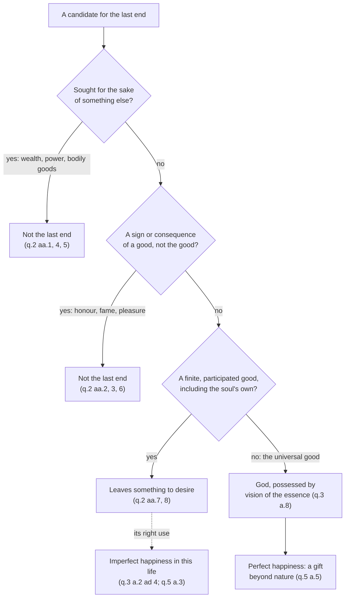

# Moral Theology · Lesson 1.2: Beatitude, the last end

> ⏱ ~15 min · Module 1: Beatitude, law and grace · Builds on: [1.1 What moral theology is](01-01-what-moral-theology-is.md), [`ethics` 4.1 Aristotle: the human good](../../ethics/lessons/04-01-aristotle-the-human-good.md) · Unlocks: [1.3 Natural law in light of revelation](01-03-natural-law-in-light-of-revelation.md), [2.1 The voluntary](02-01-the-voluntary.md), [3.2 Faith, hope and charity](03-02-faith-hope-and-charity.md)

## Why this matters

A manual of moral theology opened with law and obligation. Aquinas opens the moral part of the *Summa* with a different question: what are you *for*? The first five questions of I-II are about happiness, and everything after them (acts, virtues, law, grace) is about the road to it. That order is the claim [1.1](01-01-what-moral-theology-is.md) credited to the renewal. Here you learn the argument behind it, and a tool you will use all course: the test that shows why wealth, fame or pleasure cannot be the point of a human life, however good they are.

## The idea

Ask anyone why they do anything, and keep asking "and why that?" You get a chain: I study to pass, pass to graduate, graduate to earn, earn to live well. The chain has to stop somewhere, or no link would ever be wanted. Aquinas calls the stopping-point the **[last end](../reference.md#the-last-end)**, and its name is happiness, *beatitudo*.

Two moves follow. First, everyone already agrees on the *word*: all want their good completed. People disagree about the *thing* that completes it: money, applause, pleasure, wisdom. So the moral life is not about getting people to want happiness. They already do. It is about finding out where happiness actually is. Second, run the candidates through one test, *does this leave anything still to want?*, and every created good fails. Only an infinite good can quiet a desire whose object is good as such. That good is God, and the act that possesses him is to see him.

Augustine said the same thing at the opening of the *Confessions* (I.1, NPNF first series vol. 1, Pilkington's translation as revised at New Advent): "You have made us for Yourself, and our hearts are restless until they rest in You." Aquinas turns the prayer into an argument.

## Source

ST I-II q.2 a.8, "Whether any created good constitutes man's happiness?" (English Dominican Province):

> happiness is the perfect good, which lulls the appetite altogether; else it would not be the last end, if something yet remained to be desired. Now the object of the will ... is the universal good ... This is to be found, not in any creature, but in God alone; because every creature has goodness by participation.

Read the three load-bearing phrases. **"Lulls the appetite altogether"** is the definition of the last end: nothing left over. **"The universal good"** names what the will is built for. It is not this or that good, but good as such, the way the intellect is built for truth as such. **"By participation"** explains why no creature qualifies: a creature *has* goodness in a limited share, and a limited share cannot fill a capacity for good as such. The rest of the question is this argument applied to candidates one at a time.

## The argument

**One last end (q.1).**

1. There cannot be an infinite regress of ends. Without a first thing intended, nothing would move desire, and no action would begin (a.4). *In words:* "why?" has to bottom out.
2. One person cannot have two last ends. The last end is the perfect good, which leaves nothing further to desire, and two such goods would each leave the other still to want (a.5). Aquinas's scripture is Matthew 6:24: no man can serve two masters.
3. Everything a person wants, they want for the last end. They need not be thinking of it; the first intention carries through, the way a walker need not think of the destination at every step (a.6 ad 3).
4. All agree on the *aspect* of the last end, the fulfilment of their perfection. They disagree on the *thing* in which it is found (a.7). The sinner does not stop wanting happiness. He looks for it in the wrong place (a.7 ad 1).

**The elimination (q.2).**

5. Wealth: natural wealth serves the body and money serves natural wealth. Both are for something else (a.1).
6. Honour and fame follow excellence. They are signs of a good, not the good itself, and human opinion can be false or fleeting (aa.2–3).
7. Power is a starting-point and can be used for good or ill (a.4). Aquinas adds four general reasons that dispose of all these external goods together. Bad people have them; they leave other needs unmet; they can harm their owner; and they come from fortune, not from principles within us.
8. Bodily goods: man, like a ship entrusted to a captain, is ordered to something beyond his own preservation (a.5). Pleasure is a proper accident that follows the possession of a good, not the good possessed (a.6). The soul's own goods are potencies waiting to be fulfilled, so they cannot be the end (a.7).
9. **No created good suffices** (a.8, the Source). *In words:* goods 5–8 fail for different reasons, but a.8 explains why every one of them must fail.

**The positive answer (q.3).**

10. Happiness is an operation, the last act of the highest power, not a state or a possession (a.2). Its essence is an act of the intellect. Delight in the will follows as its proper accident (a.4).
11. The intellect rests only when it knows *what* the first cause is, not merely *that* it is. So "final and perfect happiness can consist in nothing else than the vision of the Divine Essence" (a.8). Aquinas's text is 1 John 3:2: we shall see him as he is.

**Perfect and imperfect.** Aristotle's contemplative happiness is real but belongs to this life. By Aristotle's own admission it makes us happy "only as men" (q.3 a.2 ad 4, quoting *Ethics* I.10). Aquinas keeps it and demotes it. **[Perfect and imperfect happiness](../reference.md#perfect-and-imperfect-happiness)** differ in species. Imperfect happiness, the life of virtue and contemplation here, can be reached by natural powers. Perfect happiness exceeds every created nature and comes only as God's gift (q.5 a.5). Earthly life has "a certain participation" of happiness, by hope and by a foretaste, but not the thing itself (q.5 a.3). This is what separates the lesson from [`ethics` 4.1](../../ethics/lessons/04-01-aristotle-the-human-good.md). Aristotle's completeness and self-sufficiency tests survive intact, but in Aquinas they are the marks of a goal that no life on earth can meet.

**The Beatitudes.** Matthew 5:3–12 puts the same end in the Gospel's words. The Catechism reads them as the answer to the natural desire for happiness, and as revealing "the ultimate end of human acts" (CCC 1718–1719). Its list of false happinesses (riches, well-being, fame, power, any human achievement, any creature) is q.2 compressed (CCC 1723). Look at the grammar. "Blessed are the clean of heart: for they shall see God" (Mt 5:8, Douay-Rheims) is future tense, but "theirs *is* the kingdom of heaven" (5:3, 5:10) is present. Aquinas reports that the Fathers split on whether the rewards belong to this life (Augustine), the next (Ambrose) or both (Chrysostom). His answer is that the rewards are perfect happiness hereafter and its first beginnings here: the first signs of fruit, not only the leaves (I-II q.69 a.2).

**Mark the levels.** That the souls of the blessed [see the divine essence face to face](../reference.md#the-beatific-vision), and by that vision and enjoyment are truly blessed, is **defined dogma**. Benedict XII's *Benedictus Deus* (1336) says it defines this "with apostolic authority". That this beatitude is supernatural, a free gift beyond nature's powers, is taught at least by the **authentic ordinary magisterium** (*Humani Generis* 26, 1950; CCC 1722, 1727). Aquinas's regress argument and his q.2 eliminations are theology's arguments. Their conclusion, that no created good is man's last end, is **common teaching** that the Catechism restates, but each proof weighs only what it proves. Two things are **freely disputed**. The first is whether the *essence* of beatitude lies in the intellect's vision (Thomists) or in the will's love (Scotus and the Franciscan school). The second is the **[natural desire to see God](../reference.md#natural-desire-to-see-god)**. Henri de Lubac's *Surnaturel* (1946) read Aquinas as teaching an innate desire for the vision itself, and attacked the "pure nature" hypothesis he traced to Cajetan. The Thomist commentators read q.3 a.8's desire as awakened by knowledge, with a natural end that God could in principle have left humanity with. Both readings must respect *Humani Generis* 26: God could create intellectual beings without ordering and calling them to the vision. Whether de Lubac's own position fell under that clause is itself argued. The debate belongs to [`creation-grace-last-things`](../../creation-grace-last-things/syllabus.md). See [the levels in moral theology](../reference.md#the-levels-in-moral-theology).

## The rule

## Worked examples

**Example 1: a clean case, the career.** Candidate: "a successful career in medicine." Q1: sought for something else? Partly: income, security, the patients' good, the doctor's own excellence. Whatever it is sought for sits above it, so it cannot be the stopping-point. Now apply the four general reasons (q.2 a.4). Bad people have careers too. A career leaves wisdom, friendship and health unsupplied. It can harm its owner through overwork and pride. It depends heavily on fortune. Verdict: not the last end. Aquinas would still honour what is good in it. Practising medicine well is a work of virtue, and virtue is where imperfect happiness lives (q.5 a.5). The elimination demotes the career; it does not despise it.

**Example 2: where the tool strains, the contemplative scholar.** Candidate: "understanding the world as fully as a mind can." This passes Q1 and Q2, since knowledge is sought for itself and is not a sign of something else, and Aristotle crowned it (NE X). The only test that catches it is Q3, and Aquinas needs q.3 a.8's extra premise to apply it. However complete, knowledge of effects tells you *that* the cause is but not *what* it is, and the wondering desire runs on. The strain is real. A critic can grant that we desire this and deny that the desire proves anything about fulfilment. Aquinas's reply rests on nature not making a desire in vain, and that thesis is exactly where the de Lubac dispute begins. Notice what the strain does *not* touch: the verdict that speculative science is imperfect happiness (q.3 a.6).

## Watch out

- **You might think "happiness" here means a feeling.** For Aquinas it is an *operation*, an act (q.3 a.2). Delight is its proper accident (q.2 a.6; q.3 a.4). A drugged contentment would have the accident without the essence.
- **You might think the elimination condemns wealth, pleasure and honour.** It only denies that any of them is the last end. Each is good when ordered to that end. The sinner's error is misplacing the last end, not wanting happiness (q.1 a.7 ad 1).
- **You might think imperfect happiness is fake happiness.** It is a real participation (q.5 a.3), won by natural powers in virtue (q.5 a.5). Deny it and Aristotle is simply wrong. Aquinas instead makes him incomplete.
- **Levels.** Do not upgrade the Thomist thesis that beatitude is *essentially* an act of intellect into Church teaching: the Scotist view is fully Catholic. Do not downgrade the vision of God to "a theological opinion" either. *Benedictus Deus* defines it.

## One-liner

> Everyone wants happiness; the only question is where it is, and every created answer leaves something still to want, until the mind sees God.

## Problems

**P1 (🟢)** *(Exegetical)* An **invented** case. Maya, 24, has built an audience of two million followers. She says: "Being known and liked by that many people is the whole point. It's what I'm working for." (a) Which article of ST I-II q.2 addresses her candidate most directly, and what is its core argument? (b) Which two of the four general reasons in q.2 a.4 apply most clearly, and how? (c) By q.1 a.7, has Maya stopped desiring the true last end? Two sentences per part.

**P2 (🟡)** *(Exegetical)* An **invented** case. A physicist writes: "When we have the final theory of everything, human beings will have reached the highest happiness a mind can have. Nothing will be left to know." (a) Where does Aquinas place the happiness of speculative science, and in what sense does he grant the physicist's claim? (b) Using q.3 a.8, say why a complete physics would still leave the intellect short of perfect happiness. (c) By q.5 a.5, why could no further discovery close that gap? 150 words or fewer in total.

**P3 (🔴)** *(Exegetical)* An **invented** youth-retreat handout:

> "(1) Everyone wants to be happy, and everyone's happiness is different: for you it might be music, for me family. God just wants you to find yours. (2) St Thomas proved, and the Church teaches, that heaven is essentially *knowing* God, not loving him; love is just the nice feeling that comes afterward. (3) So the Beatitudes are about the next life only. Down here we just endure."

Diagnose each numbered claim: name the distinction or text it gets wrong and correct it. For (2), say at what level the "essentially knowing" thesis stands. 150 words or fewer.

Solutions

**P1** *(Exegetical)*

**Must hit, strict:** (a) **q.2 a.3**, fame or glory. Fame is others' knowledge *of* a person's good, so it is caused by that good and cannot cause it; human fame can be false, and it is unstable (ad 2, ad 3). The glory that matters is being known by God. Credit a.2 (honour) as a secondary answer: honour is a sign of excellence, not the excellence. (b) Any two, applied: bad people can be famous (reason 1). Fame leaves wisdom, health and friendship unmet (2). It can harm its owner (3). Most clearly, it comes from outside, from others and from fortune, not from principles within her (4). (c) **No.** Under the *aspect* of the last end she wants what everyone wants, her fulfilment. She has placed it in the wrong *thing*, which is a.7 ad 1's sinner, who turns from where the end really is but keeps the intention of it.

**Wrong turns:** citing only q.2 a.8 in (a). It is the general argument, but the question asks for the direct one. Saying in (c) that she no longer desires happiness, or that she has chosen a different last end in the aspect sense.

**Model answer:** (a) q.2 a.3: fame is others' knowledge of a good in me, so it follows that good and cannot constitute it, and human fame can be false and passes easily. (b) A bad person can have two million followers, and the following comes from others and from fortune, not from anything within her. (c) No: she still wants what everyone wants under the aspect of the last end, the fulfilment of her good. She has placed that fulfilment in a thing that cannot give it (q.1 a.7 and ad 1).

**P2** *(Exegetical)*

**Must hit, strict:** (a) The consideration of speculative sciences is **imperfect happiness**, a real participation proper to this life (q.3 a.6; with q.3 a.5 on contemplation as happiness's chief form here). Aquinas grants that it is the best of natural happiness, but not perfect happiness. (b) Physics knows **effects**. Knowing an effect tells you *that* its cause is, not *what* it is, so the natural desire to know the first cause's essence remains, and a desire that remains means not yet perfectly happy. Credit also q.3 a.6's own argument: speculative science never reaches beyond what can be known from sensible things, so it cannot reach what is above the human intellect. (c) The vision of the divine essence **exceeds the nature of every creature**, so no natural power, and hence no further research, reaches it. It comes only as God's gift.

**Wrong turns:** saying Aquinas denies all value to scientific knowledge (he places it in imperfect happiness). Answering (b) with "physics may be incomplete". The argument works even if the theory is complete, because the gap is between effect and first cause, not between partial and complete science.

**Model answer:** (a) Aquinas counts speculative science as imperfect happiness, the highest natural share of it, open in this life (q.3 aa.5–6). So the physicist is right that it is a real and high good, and wrong that it is the highest a mind can have. (b) Even a final theory is knowledge of created effects. From effects we know that the first cause exists, not what it is, and the wondering desire to know that essence would remain (q.3 a.8). (c) Seeing God's essence exceeds every created nature's power, so no advance in natural knowledge closes the gap. It is a gift (q.5 a.5).

**P3** *(Exegetical)*

**Must hit, strict:** (1) confuses the **aspect** of the last end, on which all agree, with the **thing** in which it is found, which is one and the same for all (q.1 a.7; q.2 a.8). Aquinas's taste analogy says the best good is the one the well-disposed prefer, not whatever each prefers. (2) The intellect thesis is Aquinas's (q.3 a.4) but is **freely disputed**: Scotists place beatitude's essence in the will's love, and the Church has not decided. Even for Aquinas, delight is a *necessary* proper accident (q.2 a.6; q.4 a.1), not an afterthought. (3) Contradicted by the text and by q.69 a.2. "Theirs *is* the kingdom" (Mt 5:3, 5:10) is present tense, and Aquinas assigns the rewards to both lives: perfect happiness hereafter, its beginnings here. Imperfect happiness is a real participation now (q.5 a.3).

**Wrong turns:** calling (1) relativism "condemned as heresy". The strict point is the aspect/thing distinction, not a censure. Rating (2) as common teaching, or as heresy. Answering (3) only with "the kingdom has begun" with no text.

**Model answer:** (1) Everyone agrees that happiness is the fulfilment of their good, but they are wrong about where it is found. It is found in one thing for all, God (q.1 a.7; q.2 a.8), and music and family are goods ordered to him. (2) Thomas does hold that beatitude is essentially an act of intellect (q.3 a.4). But Scotus's school places it in love, the question is freely disputed, and delight is beatitude's necessary accompaniment, not a mere feeling. (3) Matthew puts two rewards in the present tense, and Aquinas says the rewards are begun here as well as perfected hereafter (q.69 a.2): a real, imperfect happiness now (q.5 a.3).

## Connections

- **Backward:** [`ethics` 4.1](../../ethics/lessons/04-01-aristotle-the-human-good.md) supplied Aristotle's completeness and self-sufficiency tests; this lesson keeps them and moves their fulfilment beyond this life. [1.1](01-01-what-moral-theology-is.md) placed q.1–5 at the head of I-II, and [`thomistic-synthesis` 1.1](../../thomistic-synthesis/lessons/01-01-the-plan-of-the-summa.md) is the map of the whole.
- **Forward:** [2.1](02-01-the-voluntary.md) begins from q.1 a.1: a human act is one done for an end. [1.3](01-03-natural-law-in-light-of-revelation.md) and [1.4](01-04-the-new-law.md) are the measures and helps on the road to this end. [3.2](03-02-faith-hope-and-charity.md) is where charity orders every act to God as last end, and [3.4](03-04-sin-mortal-and-venial.md) defines mortal sin as turning away from it.
- **Sideways:** the natural desire to see God, pure nature and the gratuity of grace belong to [`creation-grace-last-things`](../../creation-grace-last-things/syllabus.md). The Beatitudes as Matthew's composition are [`new-testament` 2.2](../../new-testament/lessons/02-02-matthew.md). Augustine's restless heart is the same thesis as a prayer, and CCC 1718 cites Augustine's *Confessions* X.20 for it.
