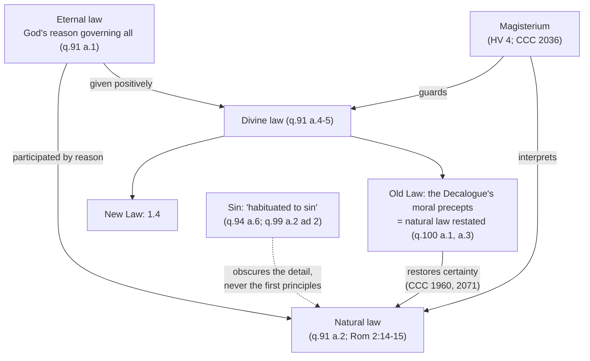

# Moral Theology · Lesson 1.3: Natural law in light of revelation

> ⏱ ~15 min · Module 1: Beatitude, law and grace · Builds on: [1.2 Beatitude, the last end](01-02-beatitude-the-last-end.md), [`ethics` 4.4](../../ethics/lessons/04-04-natural-law-aquinas.md), [`ethics` 4.5](../../ethics/lessons/04-05-the-new-natural-law-theory.md), [`fundamental-theology` 1.2](../../fundamental-theology/lessons/01-02-natural-knowledge-of-god.md) · Unlocks: [1.4 The New Law](01-04-the-new-law.md)

## Why this matters

Philosophy can say what reason knows about right and wrong. It cannot explain why God would bother to *reveal* "Thou shalt not steal", which every thief already knows. Nor can it say why a Church that claims no expertise in physics claims to interpret a law "of nature". Both oddities have one answer, and this lesson gives it. Every later argument about contraception, the death penalty or lying runs on it: natural law is the same law whether reason finds it or God speaks it, but fallen reason finds it unreliably.

## The idea

[`ethics` 4.4](../../ethics/lessons/04-04-natural-law-aquinas.md) built natural law from the inside: a first practical principle, the natural inclinations, precepts derived from them. [4.5](../../ethics/lessons/04-05-the-new-natural-law-theory.md) set the new natural law theory against the Thomistic naturalists. None of that is retaught here. Theology asks three further questions.

1. **Whose law is it?** A law needs a lawgiver. Natural law is God's reason governing us, received in the way a rational creature receives things: by understanding it.
2. **Why reveal what reason can know?** Because reason, after sin, knows it late, patchily and mixed with error. The Decalogue restates natural law with God's own authority, like a surveyor countersigning the map you drew yourself. The content does not change. The *certainty* does.
3. **Who interprets it?** If God's word restates the natural law, the Church that guards that word claims authority over the natural law too.

## Source

Aquinas, *Summa Theologiae* I-II q.99 a.2 ad 2 (English Dominican Province). The objection: the Old Law's moral precepts need not have been given, since they belong to natural law. The reply:

> It was fitting that the Divine law should come to man's assistance not only in those things for which reason is insufficient, but also in those things in which human reason may happen to be impeded. Now human reason could not go astray in the abstract, as to the universal principles of the natural law; but through being habituated to sin, it became obscured in the point of things to be done in detail. But with regard to the other moral precepts, which are like conclusions drawn from the universal principles of the natural law, the reason of many men went astray, to the extend of judging to be lawful, things that are evil in themselves.

Three phrases carry it. **"Insufficient"** and **"impeded"** name two different needs: things beyond reason, like the Trinity, and things within reason but blocked. **"In the abstract"** fences off the first principles: sin never erases *do good, avoid evil*. **"Habituated to sin"** names the cause. The obscuring is a history of bad practice, not a defect built into reason. The damage is worst in the "conclusions", the specific precepts, and there it runs as far as calling evil lawful.

## The argument

1. **Natural law is a participation in eternal law.** Eternal law is God's reason governing everything (q.91 a.1). Every creature shares in it through its inclinations. A rational creature shares "in the most excellent way", by being provident for itself and others. That rational share *is* natural law (q.91 a.2; CCC 1951–1952). *In words:* when you reason your way to "don't betray a friend", you are reading off, from the inside, part of God's plan for you. See [eternal law and natural law](../reference.md#eternal-law-and-natural-law).
2. **Scripture attests a law known without the written law.** Romans 2:14–15 (Douay–Rheims):

   > For when the Gentiles, who have not the law, do by nature those things that are of the law; these, having not the law, are a law to themselves. Who shew the work of the law written in their hearts, their conscience bearing witness to them...

   Aquinas uses the verse as the *sed contra* of q.91 a.2 and again of q.100 a.1. The reading has a history. Augustine took these Gentiles chiefly as *Christian* Gentiles, with the law written on their hearts by grace. As a second possibility he allowed pagans doing some good from the remains of God's image (*On the Spirit and the Letter* 43–48). The exegesis belongs to [`new-testament` 5.2](../../new-testament/lessons/05-02-romans-1-4-the-righteousness-of-god.md). The tradition built on the natural reading.
3. **The Decalogue's moral precepts are natural law.** Every moral precept of the Old Law belongs to natural law, "but not all in the same way" (q.100 a.1). There are three tiers:
   - precepts any reason grasps at once: honor your parents, do not kill, do not steal;
   - precepts the wise grasp and must teach others: honor the aged;
   - precepts reason grasps only with divine instruction: no graven images, no taking God's name in vain.

   The Decalogue gathers what man has "immediately from God" (q.100 a.3). The Catechism calls it a privileged expression of the natural law, and quotes Irenaeus: God planted the precepts in the heart, and then contented himself with reminding us of them (CCC 2070). See [the Decalogue as natural law](../reference.md#the-decalogue-as-natural-law). How the moral precepts differ from the ceremonial and judicial is [`old-testament` 2.6](../../old-testament/lessons/02-06-covenant-and-law.md).
4. **Sin darkens practical reason, unevenly.** Recall from [`ethics` 4.4](../../ethics/lessons/04-04-natural-law-aquinas.md) that the general principles are the same for everyone. Specific conclusions can fail "as to knowledge", as when theft was not thought wrong among the Germans (q.94 a.4). Article 6 locates the damage. The first principles cannot be blotted out "in the abstract". Passion can obscure them in a single choice. Secondary precepts can be erased more widely by "evil persuasions" or by "vicious customs and corrupt habits". Paul has the pagan mind in the same state: "their foolish heart was darkened" (Romans 1:21). *In words:* sin does not delete the moral sense. It miswires the detail, and whole cultures can share the miswiring. See [the darkening of reason](../reference.md#the-darkening-of-reason).
5. **So revelation is morally necessary for moral truth.** Aquinas's second reason for a divine law is the uncertainty of human judgment on particulars (q.91 a.4). God's law settles what we ought to do "without any doubt". The same pattern governs truths about God: reason alone would reach them only in a few, after a long time, and with errors (ST I q.1 a.1). Vatican I adopted this in *Dei Filius* ch. 2, reloaded from [`fundamental-theology` 1.2](../../fundamental-theology/lessons/01-02-natural-knowledge-of-god.md). There revelation lets such truths be known by all "with facility, with firm assurance, and with no admixture of error". The chapter's subject is "things divine". Pius XII's *Humani Generis* (1950) extended the point to religious *and moral* truths, and the Catechism follows (CCC 1960, citing both; CCC 2071). See [moral necessity of revelation](../reference.md#moral-necessity-of-revelation). *Moral* necessity is not absolute: without revelation the precepts stay knowable, but not reliably known.
6. **So the Church claims competence to interpret the natural law.** Paul VI states it in *Humanae Vitae* 4 (1968; paraphrased). No member of the faithful could deny the claim, and his predecessors had often made it. When Christ sent the apostles to teach his commandments, he made them guardians and interpreters of the *whole* moral law, the natural law included. For that law too declares God's will, and keeping it is necessary for salvation. CCC 2036 gives the same reason. See [magisterial competence over natural law](../reference.md#magisterial-competence-over-natural-law). *In words:* the premise is not "the Church knows ethics better". It is "the natural law is part of what God wills for salvation, and that is the Church's commission".

**Mark the levels.** ([the levels](../reference.md#the-levels-in-moral-theology))
- **Defined.** The Ten Commandments bind Christians: Trent, Session VI, canon 19, anathematizes anyone who says they "nowise appertain to Christians". The object of infallible teaching is "faith or morals" (Vatican I, *Pastor Aeternus* ch. 4).
- **Taught by an ecumenical council.** The moral necessity of revelation, as *Dei Filius* ch. 2 states it for truths about God. It is a chapter, not a canon.
- **At least authentic ordinary magisterium.** A natural moral law exists, is written on the heart and is knowable by reason: Romans 2 and constant teaching (HV 4, CCC 1954–1960), though no act solemnly defines it. The moral necessity of revelation extended to moral truths (*Humani Generis*, CCC 1960). The Magisterium's competence to interpret natural law (HV 4, CCC 2036), presented as long-standing.
- **Common teaching, not magisterial.** The Thomist details: participation as the account of how natural law relates to eternal law (the Catechism adopts the vocabulary, not the metaphysics), the three tiers of q.100 a.1, the Germans.
- **Freely disputed.** Can the Magisterium teach a specific natural-law norm that is not itself revealed *infallibly*, as part of infallibility's secondary object ([`fundamental-theology` 4.2](../../fundamental-theology/lessons/04-02-infallibility-and-its-conditions.md))? That question decides *Humanae Vitae*'s level, and [6.3](06-03-humanae-vitae-its-authority.md) owns it.

## Map of the laws

The dashed edge is the lesson's middle term. Take it away and revelation of the Decalogue looks redundant, and the Magisterium's claim over natural law looks like overreach.

## Worked examples

**Example 1: sorting three precepts.** Run q.100 a.1's tiers.
- *Do not bear false witness against your neighbor.* Tier 1 by the same test as "do not steal": it follows at once from a first principle like "do evil to no man", of which the Decalogue's precepts are the proximate conclusions (q.100 a.3).
- *Rise up before the hoary head* (Leviticus 19:32). Tier 2: reasonable, but grasped through the teaching of the wise. Aquinas's own example.
- *Keep holy the Sabbath.* Split case. It is moral insofar as it commands giving time to God. The fixing of the day is ceremonial (q.100 a.3 ad 2; [`old-testament` 2.6](../../old-testament/lessons/02-06-covenant-and-law.md)). The tiers sort ways of *knowing*. They do not rank importance.

**Example 2: where the tiers strain.** Q.100 a.1 puts "Thou shalt not steal" in tier 1, grasped by everyone's natural reason "of its own accord and at once". Yet q.94 a.4 says the Germans did not think theft wrong. Is Aquinas contradicting himself? No. The two articles describe different conditions. Q.100 a.1 describes reason working as it was made to work. Q.94 a.4–6 describe reason "perverted by passion, or evil habit", and a.6 names theft among the secondary precepts that vicious custom can blot out. So the neat line between the tiers wobbles under sin. A precept obvious to healthy reason can be lost to a whole people. This is exactly the gap q.99 a.2 ad 2 says the Decalogue fills. What survives everywhere is only the most general principles. The strain is real, though. Tier 1 is less secure in practice than its description suggests, and Aquinas's only guarantee is the abstract principle.

## Watch out

- **You might think a revealed precept stops being natural law**, so a non-believer is bound only by what he can prove. The Decalogue *restates* natural law: revelation adds certainty, not obligation (CCC 2071). The reverse error thinks that because the law is natural, the Church can claim nothing over it. HV 4 grounds the claim in the law's being God's will and necessary for salvation, not in philosophical expertise.
- **You might think "darkening" means reason is useless in morals.** Aquinas says the universal principles cannot be blotted out in the abstract (q.94 a.6). The necessity is *moral*, not absolute.
- **Levels, both ways.** "The Church can infallibly settle any natural-law question" overstates: that is the open question of 6.3. "The Magisterium's competence over natural law is one encyclical's opinion" understates it: HV 4 presents it as repeatedly taught, and the Catechism repeats it (CCC 2036).
- **The three tiers and the Germans are Aquinas, not dogma.** Cite them as his analysis, at the level of common teaching.

## One-liner

> Natural law is God's law read by reason. Because sin smudges the reading in the details, God restated it at Sinai and the Church claims to interpret it, which adds certainty and never a new obligation.

## Problems

**P1 (🟢)** *(Exegetical)* ST I-II q.94 a.4 (English Dominican Province):

> Consequently we must say that the natural law, as to general principles, is the same for all, both as to rectitude and as to knowledge. But as to certain matters of detail, which are conclusions, as it were, of those general principles, it is the same for all in the majority of cases, both as to rectitude and as to knowledge; and yet in some few cases it may fail, both as to rectitude, by reason of certain obstacles ... and as to knowledge, since in some the reason is perverted by passion, or evil habit, or an evil disposition of nature; thus formerly, theft, although it is expressly contrary to the natural law, was not considered wrong among the Germans, as Julius Caesar relates.

(a) In the Germans' case, did the natural law fail *as to rectitude* or *as to knowledge*? Name the words that decide it. (b) Using q.99 a.2 ad 2 (this lesson's Source), say what the passage implies about why the prohibition of theft was revealed at Sinai although reason can know it. **Two sentences per part.**

**P2 (🟡)** *(Exegetical)* A case written for the problem. Mara joins a sales firm where, for twenty years, everyone has billed clients for hours never worked. Managers call it "industry standard", and training presents it as how the business survives. She adopts it, sincerely convinced it is fair.

(a) Using q.94 a.6, say whether the precept Mara has lost is a first principle or a secondary precept, and which of the causes a.6 names fits her case. Does her firm's custom make the practice right for her firm? (b) What does the moral necessity of revelation (q.91 a.4; CCC 1960) add in her situation, and what does it *not* imply about her ability to know the precept without revelation? **150 words total.** (Whether her error *excuses* her is [2.4](02-04-conscience-its-nature-and-its-errors.md)'s question; leave it aside.)

**P3 (🔴)** *(Exegetical, find the crux)* Two positions, paraphrased for the problem:

- **A (a new natural law theorist, on the pattern of Finnis's approach).** The basic goods and the moral norms that protect them are known by practical reason from self-evident principles. No premise about God is needed. Revelation confirms these norms, adds motives and adds specifically Christian duties. But the case for "never intentionally kill the innocent" can and should be made without theological premises.
- **B (a classical Thomist).** Natural law is *law* only because it is a participation in eternal law, promulgated by God. A precept known without its lawgiver is known as reasonable advice, not as law, and since sin darkens reason, revelation and the Church's teaching are part of how the natural law is actually known.

Name the single premise on which they divide, and say what they agree on that might make the disagreement look smaller than it is. Then say what argument would move a defender of A, and what would move a defender of B. **150 words or fewer.**

Solutions

**P1** *(Exegetical (a) · Exegetical (b))*

**Must hit, strict (a):** **as to knowledge**. The deciding words are "theft, although it is expressly contrary to the natural law", which keeps the rectitude intact, together with "as to knowledge, since in some the reason is perverted by passion, or evil habit". Failure as to rectitude would mean that not stealing was not right *in that case* (the article's own example is returning a deposit to someone who will use it against his country). That is not the Germans' case.

**Must hit, strict (b):** theft falls under the precepts "like conclusions" that are knowable but can be obscured, where "the reason of many men went astray". So the divine law came to help reason where it is "impeded", not where it is "insufficient". The revelation adds certainty, not a new precept.

**Wrong turns:** saying the Germans' case shows natural law varies by culture: Aquinas says the precept still held ("expressly contrary"). Reading (b) as "reason cannot know theft is wrong", which confuses impeded with insufficient.

**Model answer:** (a) It failed as to knowledge: theft stayed "expressly contrary to the natural law", but the Germans' reason was "perverted" by passion or evil habit, so they did not see it. Rectitude would fail only if not stealing were not right in the circumstances, which Aquinas does not suggest. (b) Theft falls among the conclusions where reason is "impeded", not "insufficient", and whole peoples went wrong there, so God restated it with an authority that "cannot err". Sinai added certainty, not content.

**P2** *(Exegetical (a) · Exegetical (b))*

**Must hit, strict (a):** a **secondary precept** (do not take what is another's by fraud), a conclusion close to the first principles. The first principle is intact: she still wants to be fair. The cause is **vicious customs and corrupt habits**, with **evil persuasions** also credited (the training). Custom changes knowledge, not rectitude: the practice stays wrong, as theft among the Germans did (a.4).

**Must hit, strict (b):** revelation supplies **certainty and correction**: "Thou shalt not steal" as God's word, which her firm's custom cannot outvote, so the truth is known "with firm certainty and with no admixture of error". It does **not** imply that she could not know the precept by reason. The necessity is moral, not absolute, and the precept stays within reason's reach.

**Wrong turns:** calling her error an erasure of the first principle. Concluding that the custom makes billing fraud permissible "for them". Turning revelation into the *source* of the obligation.

**Model answer:** She has lost a secondary precept, not the first principle: she still aims at fairness but misapplies it. Of a.6's causes, "vicious customs and corrupt habits" fit, helped by "evil persuasions" in training. The custom obscures her knowledge but leaves the rectitude untouched, so the practice is still wrong. Revelation supplies what custom took away: the commandment against stealing, known on God's authority, clearly and without error, whatever her firm teaches. It does not mean she could not have reasoned her way back. Reason can reach the precept, so the necessity is moral: revelation makes it reliably known, not knowable for the first time.

**P3** *(Exegetical)*

**Must hit, strict:** the crux is **whether the natural law's character as law, its obligation, can be known without knowing its source in God**. A says the norms and their binding force are known from practical reason alone. B says that without the lawgiver they are known only as reasonable, not as law. **Agreement:** both hold that the natural law *is* in fact a participation in eternal law. The dispute is about the order of *knowing*, not the order of being, which is [`ethics` 4.5](../../ethics/lessons/04-05-the-new-natural-law-theory.md)'s crux moved from goods to obligation. **What would move them:** A would move if it could be shown that practical "ought" without a lawgiver collapses into mere reasonableness, with no binding force. B would move if a non-theist's grasp of "never kill the innocent" could be shown to carry full obligation, or if Aquinas's q.100 a.1 tier 1 ("at once", by "every man") were read as knowledge of the precept *as* binding.

**Wrong turns:** making the crux "whether God exists" or "whether natural law is grounded in God": both sides affirm the grounding. Treating A as denying that revelation helps: A affirms confirmation. Treating the darkening point as the crux: A can grant it.

**Model answer:** They divide on whether natural law can be known *as law*, as obligation and not just as reasonableness, without knowing its lawgiver. Both agree it is in fact a participation in eternal law, so the question is epistemic, not metaphysical. A would move if shown that "ought" without a lawgiver carries no binding force. B would move if shown that q.100 a.1's "every man ... at once" includes grasping the precept as binding, before any knowledge of God.

## Flashback

**From Lesson [1.1](01-01-what-moral-theology-is.md) (What moral theology is):** *(Exegetical.)* An **invented** seminary blog post, written for this problem and not the words of any real person:

> "The renewal after Vatican II means moral theology no longer deals in verdicts. A confessor who tells a penitent whether a particular act is permitted is practising the old casuistry, which *Veritatis Splendor* retired. What makes moral theology *theology* is simply that it adds scriptural motivation to the ethics any philosopher can work out. And freedom for excellence means that we grow freer as we grow in virtue; that is the whole of what freedom is."

(a) Name two errors, each with the text that corrects it. (b) Name what the last sentence gets right, with its text, and what "that is the whole of what freedom is" leaves out. **150 words or fewer in total.**

Solution

**Must hit, strict (a):** (1) **Verdicts and casuistry were not retired.** *Veritatis Splendor* 76 defends casuistry for cases where the law is uncertain, and the encyclical rejects theories that justify deliberate choices against the commandments. The renewal changed the frame, not the verdicts. Credit for adding that Trent's **defined** requirement to confess every remembered mortal sin with its species-changing circumstances (Session XIV, can. 7) still needs confessors who can judge acts precisely. (2) **What makes it theology is not added motivation.** Revelation supplies an **end** that surpasses reason (God seen) and the **power** to reach it (grace), and these change what counts as a complete answer (ST I q.1 a.1, a.7).

**Must hit, strict (b):** right: freedom grows as one does good, taught in **CCC 1733**. Left out: **free choice**, the power to act or not, which CCC 1731 keeps in the definition. Freedom for excellence does not deny choice; it says what choice is *for*.

**Wrong turns:** answering (a)(1) by saying the renewal simply restored the manuals: *Optatam Totius* 16 did ask for a renewed exposition. Treating (a)(2) as "moral theology rejects natural law": 1.3 shows the natural law stays. Calling CCC 1733 "Pinckaers's opinion".

**Model answer:** The post makes two errors. First, *Veritatis Splendor* did not retire verdicts. It rejects theories that justify choices against the commandments and defends casuistry where the law is uncertain (VS 76), and Trent's defined duty to confess mortal sins by species still needs precise judgments. Second, theology does not just add motives to philosophy. Revelation gives an end beyond reason, God seen, and grace as the power to reach it (ST I q.1 a.1). The last sentence is right that the more one does good, the freer one becomes (CCC 1733). But freedom still includes the power to choose this or that (CCC 1731).

## Connections

- **Backward:** [1.2](01-02-beatitude-the-last-end.md) gave the last end. Law is how reason directs acts to it, and q.91 a.4's first reason for a divine law is that the end is supernatural. [`ethics` 4.4–4.5](../../ethics/lessons/04-04-natural-law-aquinas.md) supply the philosophy assumed here. [`fundamental-theology` 1.2](../../fundamental-theology/lessons/01-02-natural-knowledge-of-god.md) supplies *Dei Filius* on moral necessity.
- **Forward:** [1.4](01-04-the-new-law.md) takes the divine law's second stage, the New Law as the grace of the Holy Spirit. Conscience, the judgment that applies natural law to a case, is [2.4](02-04-conscience-its-nature-and-its-errors.md). The Magisterium's competence claim decides [6.3](06-03-humanae-vitae-its-authority.md), and the Decalogue's negative precepts become *Veritatis Splendor*'s intrinsically evil acts in [4.4](04-04-veritatis-splendor.md).
- **Sideways:** Aquinas's treatise on law as political theory is [`history-of-political-thought` 2.3](../../history-of-political-thought/lessons/02-03-aquinas-on-law.md). What q.95 does with natural law in human law is [`philosophy-of-law`](../../philosophy-of-law/syllabus.md). The claim that sin obscures moral knowledge without destroying it is the moral-epistemology side of the Augustine–Pelagius dispute ([`patristics` 4.5](../../patristics/lessons/04-05-augustine-against-the-pelagians.md)).
