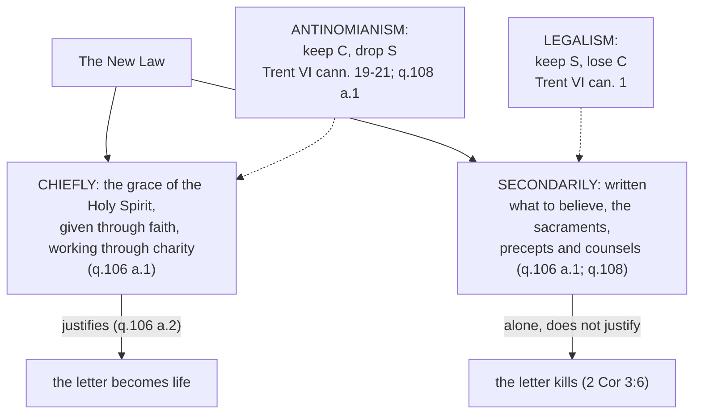

# Moral Theology · Lesson 1.4: The New Law

> ⏱ ~15 min · Module 1: Beatitude, law and grace · Builds on: [1.2 Beatitude, the last end](01-02-beatitude-the-last-end.md), [1.3 Natural law in light of revelation](01-03-natural-law-in-light-of-revelation.md) · Unlocks: [3.1 Virtue, acquired and infused](03-01-virtue-acquired-and-infused.md), [3.2 Faith, hope and charity](03-02-faith-hope-and-charity.md), [3.4 Sin: mortal and venial](03-04-sin-mortal-and-venial.md)

## Why this matters

[1.3](01-03-natural-law-in-light-of-revelation.md) left a problem open: the natural law tells you what to do, but even read rightly it cannot make you do it. A Gospel that only added a stricter code would make that worse. Aquinas's answer is the hinge of the moral part of the *Summa*: the law of the Gospel is not chiefly a code at all. Get this wrong one way and Christian morality becomes rule-keeping; the other way, and the rules drop away. The two errors are legalism and antinomianism, and the Church has condemned both.

## The idea

A beginner pianist follows rules: wrist up, don't rush the triplets. A master still keeps them but no longer plays *by* them; a second nature plays well from inside, and the rules now describe it and keep it on track. She is not lawless, and the rules did not make her a master.

[The New Law](../reference.md#the-new-law) works the same way, with one difference that changes everything: the second nature is *given*. For Aquinas the law of the Gospel is **chiefly the grace of the Holy Spirit**, given through faith in Christ and working through charity. It is **secondarily** a written law: the teachings and precepts that dispose us to that grace and direct its use. So the written part is real, and it binds. But it is not what saves, and taken alone it can even kill.

## Source

Aquinas, *Summa Theologiae* I-II q.106 a.2, "Whether the New Law justifies?" (English Dominican Province):

> There is the chief element, viz. the grace of the Holy Ghost bestowed inwardly. And as to this, the New Law justifies. ... The other element of the Evangelical Law is secondary: namely, the teachings of faith, and those commandments which direct human affections and human actions. And as to this, the New Law does not justify. Hence the Apostle says (2 Corinthians 3:6) "The letter killeth, but the spirit quickeneth": and Augustine explains this (De Spir. et Lit. xiv, xvii) by saying that the letter denotes any writing external to man, even that of the moral precepts such as are contained in the Gospel.

The "letter" that kills is *any* writing external to man, the Sermon on the Mount included; the article goes on to say that even the Gospel's letter would kill without the inward grace of faith. The Gospel's precepts belong to a law whose heart is not written on paper.

## The argument

1. **A thing is named from what preponderates in it** (q.106 a.1, citing Aristotle). What predominates in the New Law, "whereon all its efficacy is based", is the grace of the Holy Spirit; so it is "chiefly the grace itself of the Holy Ghost, which is given to those who believe in Christ." His authorities: Romans 3:27 ("the law of faith"), 8:2, and Augustine's *On the Spirit and the Letter*, calling the divine laws written on the heart "the very presence of the Holy Spirit" (NPNF1 vol. 5, ch. 36). *In words:* the new thing in the New Law is a gift, not a text.
2. **It is secondarily written** (a.1). Some things dispose us to grace or direct its use. These include what to believe, the sacraments, and what to do, and they must be taught "by word and writing". *In words:* the precepts are secondary in rank, not optional.
3. **This is not the natural law under a new name** (a.1 ad 2). The natural law is in us as part of our nature. The New Law is added to nature by grace. It works "not only by indicating to him what he should do, but also by helping him to accomplish it." *In words:* 1.3's law shows you the way. This one also carries you along it.
4. **The New Law fulfils the Old; it does not abolish it** (q.107 a.1–2). Both have one end and one God, so they do not differ in kind. They differ as the perfect from the imperfect. The Old Law was a pedagogue (Gal 3:24) and a "law of fear" that "restrains the hand, not the will". The New is the law of charity. It fulfils the ceremonies as reality fulfils shadow, and the moral precepts in three ways ([`old-testament` 2.6](../../old-testament/lessons/02-06-covenant-and-law.md) has the division): Christ gives their true sense (the interior acts of murder and adultery), the safest way to keep them (no oaths, so no perjury), and added counsels (Mt 19:21).
5. **So the Sermon on the Mount is its charter** (q.108 a.3). Following Augustine, Aquinas says the Sermon contains "the whole process of forming the life of a Christian." Augustine had called it "a perfect standard of the Christian life" (*On the Sermon on the Mount* I.1, NPNF1 vol. 6). It orders the interior movements: will, intention, and judgment of one's neighbour. The exegesis is [`new-testament` 2.2](../../new-testament/lessons/02-02-matthew.md)'s; here the Sermon is read as law.
6. **It commands few external acts, and those for a reason** (q.108 a.1). Some outward works necessarily fit or contradict "faith that worketh through love". Those are commanded or forbidden: confessing the faith is commanded, and denying it is forbidden. Works that neither fit nor contradict it are left to each person, or to lawful superiors. That is why the Gospel is a "law of liberty": grace works like an interior habit, and it makes the right act one's own (ad 2).
7. **Precepts and counsels** (q.108 a.4). A commandment "implies obligation", and a counsel is left to the option of the person it is given to. The commandments cover what is *necessary* for beatitude. A person can use the world's goods and still reach the end, provided he does not make them his end. The counsels make reaching it "more assured and expeditious". Poverty, chastity and obedience answer the three concupiscences of 1 John 2:16; they are kept absolutely in religious life, and in particular cases by anyone, as in an alms one was not bound to give. This is the line between [precepts and counsels](../reference.md#precepts-and-counsels).
8. **The precepts are keepable** (Trent, Session VI, 13 January 1547, ch. 11 and can. 18). The Council took over Augustine's formula (*On Nature and Grace* 43.50) and made it doctrine:

   > For God commands not impossibilities, but, by commanding, both admonishes thee to do what thou are able, and to pray for what thou art not able (to do), and aids thee that thou mayest be able

   (Waterworth). *In words:* a commandment is not a trap. It comes with the grace to keep it (premise 3).
9. **All are called to perfection** ([*Lumen Gentium* 40](../reference.md#universal-call-to-holiness), 1964). The faithful of every state are called to the fullness of Christian life and the perfection of charity; the counsels are one road to it, not the only one (LG 42; CCC 1973–1974). *In words:* perfection is for everyone; the counsels are a means.

**Mark the levels.** Trent Session VI can. 18 anathematizes anyone who says the commandments are impossible to keep even for one who is justified. That makes the possibility of keeping them **defined dogma**, rung 1. So are can. 1, against justification by works done without grace, and cann. 19–21. They condemn saying that only faith is commanded in the Gospel, that the Decalogue does not concern Christians, that the justified are bound "only to believe", and that Christ was given "as a redeemer in whom to trust, and not also as a legislator whom to obey". The universal call to holiness is conciliar teaching in a dogmatic constitution that defines nothing new: at least religious submission (rung 3), resting on Matthew 5:48. Aquinas's analysis is **common teaching** (rung 4): "chiefly grace, secondarily written", the three ways of fulfilment, the precept/counsel theory. CCC 1965–1974 adopts it almost verbatim, but a compendium's quoting does not raise a rung ([`fundamental-theology` 4.5](../../fundamental-theology/lessons/04-05-reading-a-documents-weight.md)). See [the levels in moral theology](../reference.md#the-levels-in-moral-theology).

## The rule

[Legalism and antinomianism](../reference.md#legalism-and-antinomianism) are mirror images, each keeping half of Aquinas's sentence. The legalist takes the secondary element for the whole; the Pelagian of [`patristics` 4.5](../../patristics/lessons/04-05-augustine-against-the-pelagians.md) is the classic case, and Pinckaers's charge against the manuals, that morality shrank to obligation and the New Law vanished from the textbooks, is a milder institutional form ([1.1](01-01-what-moral-theology-is.md)). The antinomian keeps the primary element and drops the secondary. The name comes from Luther's dispute with Johann Agricola in the late 1530s, so the Reformers fought this error too; Trent's canons condemn it in general form.

## Worked examples

**Example 1: the rich young man (Mt 19:16–22).** He has kept the commandments, and Jesus says: "If thou wilt be perfect, go sell what thou hast" (19:21, Douay). Run the tools.
- *Is selling everything a precept?* No. q.107 a.2 lists it as the third way the Law is fulfilled, "by adding some counsels of perfection". q.108 a.4 ad 1 points to the conditional "If thou wilt": Christ proposes the counsels with a view to a person's fitness for them.
- *Is he off the hook, then?* Not from the precept underneath. Clinging to wealth as one's *end* is the disorder the commandments forbid (a.4).
- *Second-class if he keeps his goods?* No. Perfection consists essentially in the precepts of charity (CCC 1974), and LG 40 calls everyone to it.

Verdict: the story is sad because of *what he loved* (19:22), not because he declined a vow.

**Example 2: where it strains.** A man baptized as an adult has been drinking to excess for twenty years. He hears premise 8 and objects: "I have tried a hundred times. Either Trent is wrong or I am not justified."

Run it carefully.
1. **What Trent defines.** Can. 18 condemns the claim that the commandments are *impossible* for the justified. It does not claim a smooth road. Chapter 11 itself grants that the just fall into "light and daily sins", and adds that they do not thereby stop being just.
2. **What the formula prescribes.** A *programme*, not a feat of will: do what you can (avoid the occasion, seek help), pray for what you cannot yet do, expect aid.
3. **What this lesson cannot settle.** How far his lapses were imputable, since habit and compulsion can diminish freedom ([2.1](02-01-the-voluntary.md), [3.4](03-04-sin-mortal-and-venial.md)). Nor can he read his state of grace off his record.

The strain is real. The dogma is about possibility *with grace*; a pastor who preaches it as "just try harder" has turned the New Law back into the Old. Aquinas saw this coming (q.107 a.4): outwardly the New Law is *lighter*, adding few precepts to the natural law; inwardly it is *heavier*, forbidding interior movements, which is very hard for someone without virtue. The resolution is not a smaller demand but the virtues that make it easy to one who loves ([3.1](03-01-virtue-acquired-and-infused.md)).

## Watch out

- **You might think "New Law" means a new code that replaces the Ten Commandments.** It adds very few precepts to the natural law (q.107 a.4); its novelty is the grace that fulfils the old ones from inside (and can. 19 keeps the Decalogue).
- **You might think "chiefly grace" means the precepts are advisory.** "Secondary" ranks them; it does not suspend them (cann. 19–21, rung 1).
- **You might think the counsels are for religious and the precepts for everyone else.** Everyone can keep particular counsels, and everyone is bound to the perfection of charity (LG 40). The counsels are means, not a higher tier of obligation.
- **Overstating a level.** "Chiefly the grace of the Holy Spirit" is Aquinas's synthesis, received as common teaching and adopted by the Catechism. It is not a definition. Treating it as dogma is the same mistake as understating can. 18 as "Thomist opinion".

## One-liner

> The New Law is the Holy Spirit's grace written on the heart, with a short written law in its service: precepts to keep, counsels to choose, and none of them impossible.

## Problems

**P1 (🟢)** *(Exegetical)* Classify each as **precept of the New Law**, **counsel** (say whether absolute or in a particular case), or **left to discretion** (q.108 a.1), and cite the article that decides it. One line each.
(a) Under interrogation, a believer is asked whether she is a Christian. She is tempted to deny it to keep her job, and she refuses.
(b) A woman makes a perpetual vow of poverty in a religious community.
(c) A landlord cancels a tenant's rent arrears that he could lawfully collect, and he is under no obligation to do so.
(d) On an ordinary weekday, a man chooses the fish over the chicken.
(e) A wealthy investor does not make his portfolio the point of his life.

**P2 (🟡)** *(Exegetical)* ST I-II q.108 a.4, *respondeo* (English Dominican Province):

> The difference between a counsel and a commandment is that a commandment implies obligation, whereas a counsel is left to the option of the one to whom it is given. ... We must therefore understand the commandments of the New Law to have been given about matters that are necessary to gain the end of eternal bliss, to which end the New Law brings us forthwith: but that the counsels are about matters that render the gaining of this end more assured and expeditious. ... Nevertheless, for man to gain the end aforesaid, he does not need to renounce the things of the world altogether: since he can, while using the things of this world, attain to eternal happiness, provided he does not place his end in them: but he will attain more speedily thereto by giving up the goods of this world entirely

(a) Which words make the counsels non-obligatory without making them indifferent? (b) A reader objects that this sets up two classes of Christian, which *Lumen Gentium* 40 (paraphrased in the lesson) forbids. Show from the passage and CCC 1973–1974 why there is no contradiction. **Two sentences per part.**

**P3 (🔴)** *(Exegetical)* Two **invented** parish handouts, written for this problem:

> *Handout A:* "The Sermon on the Mount is the stricter law Jesus gave to replace Moses. Keep it faithfully (no anger, no lust, no oaths), and God will reward your obedience with his grace."
>
> *Handout B:* "Christians are led by the Spirit, not by rules. Love is the only law. Anyone who tells you a specific act is forbidden is putting you back under the Old Law."

(a) Name each handout's error and the half of Aquinas's account it keeps. (b) For each, cite one text from the lesson that answers it and say what it answers. (c) Handout B's last sentence contradicts a definition. Name the canon and give its rung. **150 words total.**

Solutions

**P1** *(Exegetical)*

**Must hit, strict:** (a) **Precept.** Confessing the faith is commanded and denying it forbidden, because it is necessarily in keeping with faith working through love (q.108 a.1, citing Mt 10:32–33). (b) **Counsel, absolute.** Perpetual poverty is one of the three general counsels on which religious life is based (a.4). (c) **Counsel, particular case.** Forgiving what one could justly claim when not bound to is a counsel kept in a particular case, like the unbound alms and the forgiven injury (a.4). (d) **Left to discretion.** Such works neither fit nor contradict faith working through love. "To eat of this or that food" is Aquinas's own example (a.1 ad 1). (e) **Precept.** Placing one's end in the world's goods is the disorder "removed by the commandments". Using them without making them one's end is what the precept requires (a.4).

**Wrong turns:** calling (e) a counsel because it concerns wealth. The counsel is renunciation, and the precept is right order. Calling (c) a precept of justice. Justice allowed him to collect, and that is what makes the cancellation a counsel. Calling (d) a precept because the Church sets days of abstinence. Aquinas explicitly leaves such matters to individuals *or to superiors*, so a Church rule is a determination by lawful authority, not a precept of the New Law "by virtue of its primitive institution" (a.1).

**P2** *(Exegetical)*

**Must hit, strict (a):** "left to the option" removes obligation. "More assured and expeditious" and "attain more speedily" give the counsels a real value relative to the same end, so they are better means, not neutral options.

**Must hit, strict (b):** there is **one end for all**: "the end of eternal bliss", reached by anyone who does not place his end in the world. The counsels differ only in how surely and quickly they reach it. CCC 1973–1974 adds that perfection consists essentially in the precepts of love. The counsels remove hindrances to charity and are practised according to each person's vocation. So LG 40's single call to the perfection of charity is what both precepts and counsels serve.

**Wrong turns:** reading "more speedily" as "only the vowed reach beatitude". Treating the counsels as extra *obligations* for a spiritual elite; "left to the option" rules that out.

**Model answer:** (a) "Left to the option of the one to whom it is given" removes the obligation, while "more assured and expeditious" says the counsels really help toward the end. They are better roads, not indifferent ones. (b) The passage gives one end and says anyone reaches it who uses the world without making it his end, so the difference is speed and security, not a second destination. The Catechism locates perfection itself in the precepts of charity and makes the counsels means fitted to each vocation, which is exactly LG 40's single call.

**P3** *(Exegetical)*

**Must hit, strict (a):** A is **legalism**. It keeps the secondary, written element and makes grace a wage for keeping it. B is **antinomianism**. It keeps the Spirit and drops the precepts.

**Must hit, strict (b):** Against A: q.106 a.2, where the letter "even of the Gospel" kills without inward grace, or Trent VI can. 1, where no justification comes by works without grace. Either answers the order *obedience, then grace*. Also q.107 a.2, where the Sermon *fulfils* rather than replaces Moses. Against B: q.108 a.1, where acts necessarily contrary to faith working through love *are* forbidden, and where confession of faith is commanded.

**Must hit, strict (c):** Trent VI **can. 21** (Christ given as redeemer "and not also as a legislator whom to obey") or **can. 19** (nothing but faith commanded; the Decalogue not for Christians). Either one: **defined dogma**, rung 1.

**Wrong turns:** calling B's "love is the only law" simply false, when CCC 1970 says the whole Law of the Gospel is contained in the new commandment. The error is using that to cancel particular precepts. Citing can. 18 for (c); it answers despair of keeping the law, not denial that it binds.

## Flashback

**From Lesson [1.2](01-02-beatitude-the-last-end.md) (Beatitude, the last end):** *(Exegetical.)* An **invented** wellness-clinic brochure, written for this problem:

> "Health is the good everything else depends on. Add forty healthy years to your life, fill every one of them with pleasure, and you have what the philosophers called happiness. Nothing more is needed."

(a) Which article of ST I-II q.2 answers "health is the last end", and what are its two reasons? (b) Which article answers "pleasure is happiness", and what distinction decides it? (c) Does it follow that pursuing health and enjoying life are mistakes? **Two sentences per part.**

Solution

**Must hit, strict:** (a) **q.2 a.5**, goods of the body. First reason: a thing ordered to an end beyond itself cannot have its own preservation as its last end, as a captain does not intend the ship's preservation as his last end, since the ship is for sailing; man is not the supreme good, so he too is ordered to something beyond himself. Second reason: even if preservation were the end, the body is for the soul, as matter for form and as instruments for the one who uses them, so every bodily good is ordered to goods of the soul. (b) **q.2 a.6**, by the distinction between **essence and proper accident**. Delight follows the possession of a fitting good, the way the ability to laugh follows being rational, so even the delight that flows from the perfect good is happiness's proper accident, not its essence. Bodily pleasure, which follows a good grasped by sense, is not even that. (c) **No.** The elimination denies only that they are the *last end*. Health outranks external goods (a.5 ad 1), delight is the appetite's rest in a real good, and both, rightly ordered, belong to the life of virtue where imperfect happiness lies.

**Wrong turns:** answering only with q.2 a.8. It is the general argument, but the question asks for the articles that meet these two candidates directly. Answering (b) with "pleasure is fleeting", which is not a.6's argument; the point is that delight *follows* the good it rests in. Reading (c) as a condemnation of health or pleasure.

**Model answer:** (a) q.2 a.5: man, like a ship entrusted to a captain, is ordered to an end beyond himself, so his own preservation cannot be his last end. And the body exists for the soul, so bodily goods are ordered to the soul's goods. (b) q.2 a.6: delight is a proper accident that follows the possession of a good, not the good itself, so it cannot be happiness's essence. Bodily pleasure follows a good of sense, which falls short even of that. (c) No: the brochure's error is where it places the last end, not what it values. Health and delight are real goods, and used in a life ordered to God they are part of the imperfect happiness this life allows.

## Connections

- **Backward:** [1.3](01-03-natural-law-in-light-of-revelation.md) gave the law that *shows*. This lesson gives the law that also *helps* (q.106 a.1 ad 2). [1.2](01-02-beatitude-the-last-end.md) supplied the end that precepts and counsels are graded against. [`old-testament` 2.6](../../old-testament/lessons/02-06-covenant-and-law.md) owns the division of the Old Law that q.107 fulfils.
- **Forward:** grace "like an interior habit" (q.108 a.1 ad 2) is cashed out as [infused virtue](03-01-virtue-acquired-and-infused.md) in 3.1. Charity as the heart of the law becomes [charity as form of the virtues](03-02-faith-hope-and-charity.md) in 3.2. Trent's "light and daily sins" in a just person returns in [3.4](03-04-sin-mortal-and-venial.md). Grace and justification as doctrine are ceded to [`creation-grace-last-things`](../../creation-grace-last-things/syllabus.md).
- **Sideways:** James on faith without works ([`new-testament` 6.3](../../new-testament/lessons/06-03-james-faith-and-works.md)) and Paul's "law of faith" (Rom 3:27, [`new-testament` 5.2](../../new-testament/lessons/05-02-romans-1-4-the-righteousness-of-god.md)) are the two scriptural poles that q.106 holds together. The pianist's "second nature" is Aristotle's habituated virtue from [`ethics` 4.2](../../ethics/lessons/04-02-aristotle-virtue-and-practical-wisdom.md), with one difference: here the nature is given, not acquired. See the course [syllabus](../syllabus.md).
