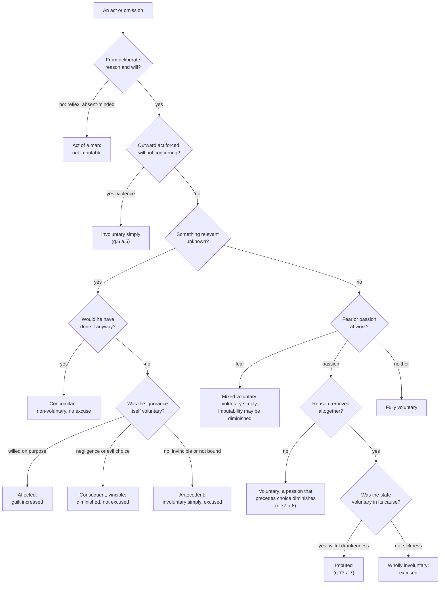

# Moral Theology · Lesson 2.1: The voluntary

> ⏱ ~15 min · Module 2: Human acts and conscience · Builds on: [1.2 Beatitude, the last end](01-02-beatitude-the-last-end.md), [1.3 Natural law in light of revelation](01-03-natural-law-in-light-of-revelation.md) · Unlocks: [2.2 The moral object](02-02-the-moral-object.md), [2.4 Conscience](02-04-conscience-its-nature-and-its-errors.md), [3.4 Sin: mortal and venial](03-04-sin-mortal-and-venial.md)

## Why this matters

Before you can ask whether an act is good or evil, you have to ask whose it is. A man who kills a passer-by with a stray arrow, a captain who throws the cargo overboard in a storm, a drunk who hits someone on the way home: all three caused harm, and the tradition gives three different answers about how far the harm is theirs. This lesson is the first question of any moral analysis: was it voluntary, and how far is it imputable? Get it wrong and every later tool (the three fonts, conscience, mortal and venial sin) is run on acts that were never the agent's to begin with.

## The idea

Moral theology judges *acts that a person is master of*. Aquinas opens the moral part of the *Summa* with the distinction ([ST I-II q.1 a.1](01-02-beatitude-the-last-end.md)): a **human act** proceeds from deliberate reason and will; an **act of a man** is anything else that happens in a human body, such as stroking your beard while thinking about something else (his own example, ad 3). Only the first kind is praised or blamed. See [human act and act of a man](../reference.md#human-act-and-act-of-a-man).

So the working question is always: *how much of this act came from within, with knowledge?* That is [the voluntary](../reference.md#the-voluntary). Question 6 of I-II then tests, article by article, four things that seem to reduce it. **Violence** can remove it. **Fear** leaves it standing but in a mixed form. **Concupiscence**, the pull of desire, does not remove it at all. **Ignorance** removes it or not depending on how the ignorance relates to the will. Most of the lesson is that last sorting, because it is the one you will use on almost every case.

## Source

ST I-II q.6 a.8, "Whether ignorance causes involuntariness?" (English Dominican Province). Aquinas sorts ignorance by its relation to the act of the will, not by when it occurs. Two sentences carry the sort:

> "Concomitantly," when there is ignorance of what is done; but, so that even if it were known, it would be done.

His example: a man who wanted his enemy dead shoots at what he takes for a stag, and kills the enemy. The ignorance changed nothing he willed, so it causes "non-voluntariness," not involuntariness.

> Ignorance is "antecedent" to the act of the will, when it is not voluntary, and yet is the cause of man's willing what he would not will otherwise.

His example: after "taking proper precaution," a man shoots an arrow and kills a passer-by he could not have known was there. This ignorance causes involuntariness *simply*.

Between them sits **consequent** ignorance, ignorance that is itself voluntary. Read the words that decide each case. "Would be done" anyway: concomitant. "Not voluntary" and "the cause": antecedent. And "proper precaution" is doing quiet work, because without it the archer's ignorance would be something he could and ought to have removed.

## The argument

1. **The voluntary is what proceeds from an intrinsic principle with knowledge of the end** (q.6 a.1). *In words:* it comes from inside me, and I know what I am doing it for. Animals have an imperfect voluntary; only reason has the perfect voluntary that deserves praise or blame (a.2).
2. **Omissions can be voluntary** (a.3). A ship sinks because the helmsman stopped steering. It is imputed to him, but only if he could and ought to have acted. *In words:* the voluntary covers not-acting and not-considering too. This is the hinge for ignorance later.
3. **Violence cannot touch the will's own act, only its commanded acts** (a.4), **and where it acts it causes involuntariness** (a.5). A man can be dragged; he cannot be made to *will* being dragged. Violence here means physical force from outside, with the will concurring "not at all" (a.6 ad 1).
4. **Fear produces the [mixed voluntary](../reference.md#the-mixed-voluntary)** (a.6). The captain does not want to lose the cargo; in the storm, here and now, he throws it overboard to save the ship. The act is voluntary *simply*, because it is the act he actually chooses. It is involuntary only "in a certain respect," compared with a calm sea that is not there. So Aquinas, with Aristotle, calls it "voluntary rather than involuntary." *In words:* a threat changes what you choose among, but you still choose.
5. **Concupiscence makes an act more voluntary, not less** (a.7). Fear drives the will toward what it still dislikes. Desire changes the will itself, so the man who gives in wants now what he refused before. Aquinas adds two qualifications elsewhere. A passion that *precedes* choice and pushes it does diminish sin (q.77 a.6). A passion that takes away reason entirely, as in madness, removes the voluntary, unless the passion was itself willed (q.77 a.7).
6. **Ignorance causes involuntariness only insofar as it removes knowledge the act needed** (a.8). Hence three relations.
   - *Concomitant* ignorance: he would have acted anyway. It is non-voluntary and excuses nothing (q.76 a.3 and a.4).
   - *Consequent* ignorance is itself voluntary. It is **affected** when willed on purpose, to have an excuse for sinning. It is voluntary by **evil choice** when passion or habit keeps him from considering what he knows. It is voluntary by **negligence** when he fails to learn what he ought to know. It is involuntary only "in a certain respect," so it diminishes and does not excuse. Affected ignorance increases guilt (q.76 a.4).
   - *Antecedent* ignorance is not voluntary and causes the act. It is involuntary simply and excuses.
7. **The tradition's shorthand is vincible and invincible.** Ignorance that is "entirely involuntary, either through being invincible, or through being of matters one is not bound to know" excuses altogether (q.76 a.3). *In words:* ask whether he could, and should, have known. See [kinds of ignorance](../reference.md#kinds-of-ignorance) and [invincible ignorance](../reference.md#invincible-ignorance).
8. **Voluntary in its cause.** A man "who wilfully gets drunk" is "considered to do voluntarily whatever he does through being drunk" (q.77 a.7). The will reached the effect by reaching its cause. The Catechism makes the same point with the drunk driver: a bad effect is imputable when it was foreseeable and avoidable (CCC 1737). See [voluntary in cause](../reference.md#voluntary-in-cause).

**Mark the levels.** That free will is real and was not destroyed by Adam's sin is **defined dogma** (Trent, Session VI, canon 5). That responsibility follows the voluntary, and that ignorance, inadvertence, duress, fear, habit and similar factors can diminish imputability or remove it entirely, is taught in the Catechism (CCC 1734–1735, 1860). It is **authentic ordinary magisterium**, and the principle beneath it, no sin without the will, is constant teaching. The machinery of concomitant, consequent and antecedent ignorance, the mixed voluntary and the voluntary in its cause is the schools' analysis. It came from Aristotle through Aquinas to the manuals, and it is **common teaching**, never defined. The Catechism uses parts of it (the "indirectly voluntary" of CCC 1736) without canonizing the whole. See [the levels in moral theology](../reference.md#the-levels-in-moral-theology).

## The decision tree

## Worked examples

**Example 1: three archers.** Each shoots into a thicket and kills a man hidden there.

- *Anna* checked the thicket and posted a lookout, and nothing could have told her a man was there. Her ignorance was not voluntary and caused the act: **antecedent**, involuntary simply, and the death is not imputed.
- *Ben* was told the thicket was a known short-cut and did not look, because checking was tedious. He could and ought to have known. His ignorance is **consequent** by negligence. It diminishes, since he did not will a death, but it does not excuse.
- *Cal* was hunting the man, did not know he was in the thicket, and fired at a noise he took for a deer. He would have fired had he known: **concomitant**. Nothing is excused. He did not will this killing here, but he stands ready to kill, and q.76 a.4 says such ignorance neither diminishes nor increases the sin.

The outward event is identical. The tree separates them at two nodes: "would he have done it anyway?" and "was the ignorance itself voluntary?"

**Example 2: where it strains.** Dan has drunk heavily for fifteen years and has been trying to stop for six months. One evening he relapses and, drunk, says something cruel that ends a friendship. Run q.77 a.7 strictly and the cruelty is voluntary in its cause, because the drinking was his. But the causal chain runs through a habit laid down years ago, and CCC 1735 lists "habit" among the things that diminish imputability.

The tradition's tools give a structure, not a number. The first drinks of years ago were his and are imputed as the acts they were. Tonight's first drink is voluntary but diminished, to the degree the habit now outruns his reason: the passion precedes choice (q.77 a.6). His effort to stop counts, because it shows the will resisting rather than consenting. The cruel words are imputed through the drinking, but as consequences of a diminished act, and q.76 a.4 ad 2 even allows that drunkenness can lessen the resulting sin by more than its own gravity adds. What the tools cannot do is say *how much* Dan is diminished. That judgment belongs to prudence and, in the confessional, to a confessor ([`sacraments-and-liturgy`](../../sacraments-and-liturgy/syllabus.md)). The strain is real: "voluntary in cause" was built for a single wilful binge, and habit stretches it across years.

## Watch out

- **You might think fear makes an act involuntary.** Aquinas says the opposite: what is done through fear is "voluntary rather than involuntary" (q.6 a.6). Grave fear can *diminish* imputability (CCC 1735). It does not turn a chosen act into something that happened to you. The apostate who denies Christ under torture has chosen, however much his guilt is lessened.
- **You might think "consequent" means ignorance that arises after the act.** It means ignorance that follows *from the will*, because it was willed or neglected. Aquinas's three terms name relations to the will, not moments in time.
- **You might think any ignorance excuses a little.** Concomitant ignorance excuses nothing. Affected ignorance aggravates: the Catechism says feigned ignorance increases the voluntary character of a sin (CCC 1859).
- **You might read CCC 1860, which says no one is presumed ignorant of the principles of the moral law, as ruling out invincible ignorance in morals.** It concerns *principles*. The same paragraph opens by saying unintentional ignorance can remove imputability. How far ignorance reaches into particular conclusions belongs to [2.4](02-04-conscience-its-nature-and-its-errors.md).
- **Levels, both ways.** Calling the antecedent/concomitant/consequent scheme "dogma" overstates it: it is common teaching. Calling free will "a Thomist opinion" understates it: Trent defined it.

## One-liner

> An act is yours as far as it comes from within with knowledge: violence removes that, fear mixes it, desire strengthens it, and ignorance excuses only when the ignorance itself was not yours.

## Problems

**P1 (🟢)** *(Exegetical)* Classify each invented case's ignorance as concomitant, consequent (say which kind) or antecedent, and say whether it excuses altogether, diminishes, or does neither. One line each.
(a) A pharmacist fills a prescription with the wrong drug. The bottle had been mislabelled at the factory, and her double-check procedure was followed exactly.
(b) A landlord avoids reading the new safety code "so no one can say I knew," and rents out a flat with illegal wiring.
(c) A driver runs a red light he did not see because he was reading a text message.
(d) A man steals a bicycle he believes belongs to a stranger; it is in fact his brother's, and he would have stolen it anyway.

**P2 (🟡)** *(Exegetical)* Two invented cases. (i) A bank clerk is told by a robber that her child will be shot unless she opens the vault; she opens it. (ii) A security guard is shoved by three men through a door, which knocks over and breaks a display case. For each, name the factor in q.6, say whether the act is voluntary simply, involuntary simply, or mixed, and give the reason Aquinas's text supplies. Then say, in one sentence, why (i) being voluntary does not by itself settle whether the clerk sinned. **Two sentences per case, one for the last part.**

**P3 (🔴)** *(Exegetical)* An invented parish bulletin column:

> "Last month a young man in our town, drunk after a party, crashed his car and injured a family. Some want to condemn him. But alcohol takes away reason, and without reason there is no free act. He was not himself that night. We must remember that sin requires full freedom, and he had none."

(a) Name the concept from this lesson the column ignores, with its source. (b) State one case in which the column's conclusion would be correct, and what makes the difference. (c) Say what the column gets right, with its source. **150 words total.**

Solutions

**P1** *(Exegetical)*

**Must hit, strict:** (a) **Antecedent**: not voluntary (proper precaution taken; she could not have known) and it caused the act, so it **excuses altogether** (q.6 a.8; q.76 a.3). (b) **Consequent, affected**: ignorance willed so as to have an excuse. It does not excuse and **increases** guilt (q.6 a.8; q.76 a.4; CCC 1859). (c) **Consequent, voluntary**: he did not consider what he could and ought to consider, because he chose to attend to the phone. Negligence is the best label; "evil choice" is acceptable if the answer ties the failure to consider to a disordered habit. It **diminishes but does not excuse** (compare CCC 1736 on ignorance of traffic laws). (d) **Concomitant**: he would have done it anyway, so it **neither excuses nor diminishes** (q.6 a.8; q.76 a.4).

**Wrong turns:** calling (d) antecedent because he "didn't know it was his brother's." The test is whether knowledge would have stopped him, and it would not. Calling (c) antecedent because he "didn't see the light." He could and ought to have seen it.

**Model answer:** (a) Antecedent, excuses altogether. (b) Consequent (affected), no excuse, aggravates. (c) Consequent (negligence), diminishes only. (d) Concomitant, neither.

**P2** *(Exegetical)*

**Must hit, strict:** (i) **Fear**, which makes the act **mixed and voluntary simply**. She chooses to open the vault here and now to avoid the greater evil, so her will concurs; the act is involuntary only in comparison with a situation without the threat (q.6 a.6, the cargo). (ii) **Violence**: **involuntary simply**. The principle is outside him and his will "concurs not at all" (q.6 a.5; a.6 ad 1); only the commanded act was forced, not his will (a.4). Last part: voluntariness makes an act *hers*. Whether it is *evil* depends on its object, end and circumstances ([2.2](02-02-the-moral-object.md)), and handing property to save a child is not the same kind of act as, say, denying the faith. Fear may also diminish imputability (CCC 1735).

**Wrong turns:** calling (i) involuntary because she "had no choice," which confuses fear with violence. Treating "voluntary" as "blameworthy."

**Model answer:** (i) Fear: the act is voluntary simply, because she chooses it here and now to avoid a feared evil, and involuntary only relative to a threat that is absent. (ii) Violence: the act is involuntary simply, because it comes from an outside principle and his will does not concur at all. Voluntariness settles whose the act is, not whether it is good, which depends on its object, end and circumstances.

**P3** *(Exegetical)*

**Must hit, strict (a):** **voluntary in its cause** (ST I-II q.77 a.7; CCC 1737 on the drunk driver). Getting drunk wilfully makes what follows voluntary through its cause, when it was foreseeable and avoidable.

**Must hit, strict (b):** a case where the loss of reason was **not voluntary in its cause**. For example, his drink was spiked without his knowledge, or a sickness took away reason. Then the act is wholly involuntary and excused (q.77 a.7). What makes the difference is whether the will reached the cause.

**Must hit, strict (c):** drunkenness **can diminish** imputability of the resulting act. Aquinas says drunkenness diminishes the resulting sin (q.76 a.4 ad 2 and ad 4), and CCC 1735 and 1860 list diminishing factors. But there are then two sins, the drunkenness and what came of it.

**Wrong turns:** answering (a) with "concupiscence doesn't excuse" (q.6 a.7). That is true, but it is not the concept the column misses, because the column's claim is loss of reason, not desire. Saying the young man is fully as culpable as a sober man would be. Aquinas explicitly denies it.

**Model answer:** (a) The column ignores the voluntary in its cause: one who wilfully gets drunk does voluntarily what he does through drunkenness (q.77 a.7), and a foreseeable, avoidable harm like a drunk-driving crash is imputable (CCC 1737). (b) If someone had drugged him without his knowledge, his loss of reason would not be voluntary in its cause, and the act would be excused. (c) It is right that drunkenness can lessen the guilt of what follows (q.76 a.4). It is wrong that it removes it, and the drinking is a sin of its own.

## Flashback

**From Lesson [1.3](01-03-natural-law-in-light-of-revelation.md) (Natural law in light of revelation):** *(Exegetical.)* Give each claim its level on the [ladder](../../fundamental-theology/lessons/04-04-the-ladder-of-doctrinal-authority.md), naming the act that fixes it, or saying that no magisterial act does. **One sentence each.**
(a) The Ten Commandments bind Christians.
(b) Revelation is morally necessary so that the moral truths reason can reach are known by all with firm certainty and without admixture of error.
(c) The Decalogue's moral precepts are known in three ways: some by any reason at once, some only through the teaching of the wise, some only by divine instruction.
(d) A natural moral law exists, written on the human heart and knowable by reason.

Solution

**Must hit, strict:** (a) **Defined**: Trent, Session VI, canon 19, anathematizes anyone who says the ten commandments "nowise appertain to Christians". (b) **At least authentic ordinary magisterium**: Pius XII's *Humani Generis* (1950) extended the moral necessity of revelation to moral truths, and CCC 1960 follows it. It is not defined: *Dei Filius* ch. 2 teaches the moral necessity for truths about God, and in a chapter, not a canon. (c) **Common teaching, no magisterial act**: this is Aquinas's analysis (ST I-II q.100 a.1). The Catechism calls the Decalogue a privileged expression of the natural law but does not teach the tiers. (d) **At least authentic ordinary magisterium**: Romans 2:14–15 and constant teaching, restated in *Humanae Vitae* 4 and CCC 1954–1960, with no solemn definition.

**Wrong turns:** putting (b) at the defined rung because Vatican I spoke of moral necessity. Its subject was "things divine", and the moral extension is *Humani Generis*'s. Lowering (a) to ordinary magisterium because it sounds like a commonplace, when there is an anathematized canon. Raising (c) because the Catechism links the Decalogue to natural law. Calling (d) "a Thomist theory", or calling it defined.

**Model answer:** (a) Defined, by Trent Session VI canon 19. (b) At least authentic ordinary magisterium, from *Humani Generis* and CCC 1960; *Dei Filius* ch. 2 covers only truths about God. (c) Common teaching: Aquinas's q.100 a.1, which no act adopts. (d) At least authentic ordinary magisterium: Romans 2, *Humanae Vitae* 4 and CCC 1954–1960, never solemnly defined.

## Connections

- **Backward:** [1.2](01-02-beatitude-the-last-end.md) put the human act inside the pursuit of the last end: q.1 a.1 defines the human act as the one done for an end, and this lesson asks when an act really is one. Augustine's "every sin is voluntary," which Aquinas quotes in q.6 a.8, comes from the anti-Pelagian setting of [`patristics` 4.5](../../patristics/lessons/04-05-augustine-against-the-pelagians.md).
- **Forward:** [2.2](02-02-the-moral-object.md) asks what the voluntary act *is*; [2.4](02-04-conscience-its-nature-and-its-errors.md) uses vincible and invincible ignorance to say when an erring conscience excuses; [3.4](03-04-sin-mortal-and-venial.md) turns "full knowledge and deliberate consent" into a condition of mortal sin.
- **Sideways:** the metaphysics of free will (determinism, compatibilism) is [`metaphysics` 6.2](../../metaphysics/lessons/06-02-compatibilism.md)'s question. Aquinas's voluntary assumes a will that can deliberate and asks how far a given act came from it. Aristotle's *Nicomachean Ethics* III.1, the source of the cargo and the "mixed" act, stands behind the whole of q.6. See the course [syllabus](../syllabus.md).
