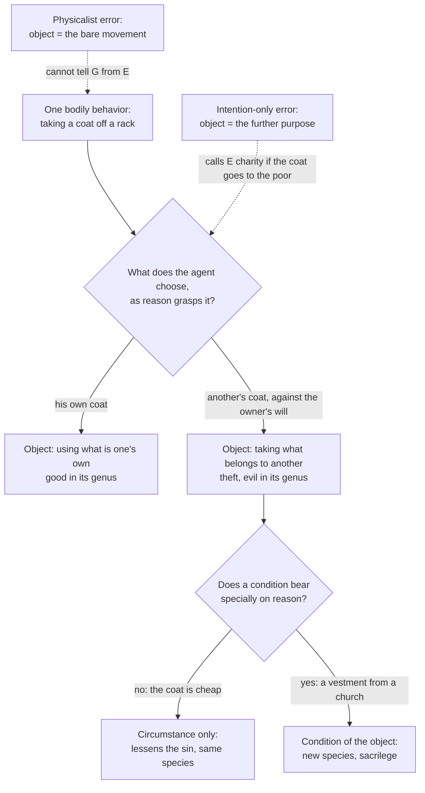

# Moral Theology · Lesson 2.2: The moral object

> ⏱ ~15 min · Module 2: Human acts and conscience · Builds on: [2.1 The voluntary](02-01-the-voluntary.md) · Unlocks: [2.3 Intention and circumstances](02-03-intention-and-circumstances.md), [4.5 Describing the object](04-05-describing-the-object.md)

## Why this matters

A judge signs a death warrant; an assassin fires a gun. A surgeon cuts off a leg; a torturer cuts off a leg. Is the morality of an act in what the body does, in what the agent is after, or somewhere between? Get this wrong in one direction and biology writes your ethics. Get it wrong in the other and any act can be redeemed by a good enough story about it. Catholic moral theology answers with one technical word, the **object**, and the post-conciliar fights over proportionalism, *Veritatis Splendor* and every hard case in Module 5 are fights about how to describe it.

## The idea

[2.1](02-01-the-voluntary.md) settled which acts are *human acts*: those that come from deliberate will, not merely acts a human happens to perform. This lesson asks what makes a human act good or evil.

The tradition names [three fonts](../reference.md#the-three-fonts), or sources, of morality: the **object** chosen, the **end** or intention, and the **circumstances** (CCC 1750). The object comes first. It is *what you are doing*, as distinct from *why* you are doing it (the end) and *how, when, where and how much* (the circumstances).

The object is not the physical movement. Take a coat off a restaurant rack. If it is your coat, you are using what is yours. If it is someone else's, you are stealing. Your arm does the same thing either way; the acts differ in kind. What separates them is a feature of the behavior that only reason registers: *whose* the coat is. So the object is the behavior as reason grasps it, in relation to the goods at stake.

The object is not the motive either. Steal the coat to give it to a freezing beggar and you have still stolen it: the further purpose is the end, and it does not change what you chose to do on the way. The object sits between bare motion and ulterior motive. It is **the proximate end of the choice**, what you set out to do here and now: [the moral object](../reference.md#the-moral-object).

## Source

Aquinas, ST I-II q.18 a.2, "Whether the good or evil of a man's action is derived from its object?" (English Dominican Province):

> And just as a natural thing has its species from its form, so an action has its species from its object, as movement from its term. And therefore just as the primary goodness of a natural thing is derived from its form, which gives it its species, so the primary goodness of a moral action is derived from its suitable object: hence some call such an action "good in its genus"; for instance, "to make use of what is one's own." ... so the primary evil in moral actions is that which is from the object, for instance, "to take what belongs to another."

Three things carry the passage. **Species from object**: an act is the kind of act it is because of what it bears on, as a journey is defined by its destination. **Primary**: the object gives the *first* goodness or malice, not the whole of it. The **examples** are already moral descriptions. "What is one's own" and "what belongs to another" are not visible properties of the coat.

## The argument

1. **An act is good to the extent that it has the fullness of being due to it** (q.18 a.1). *In words:* evil in an act is a lack, something missing that should be there.
2. **The first thing an act's fullness requires is its species, and it gets its species from its object** (a.2). *In words:* before asking why or how, ask what kind of act this is.
3. **The species that counts is moral, not natural.** The same natural act can fall under different moral species. Aquinas: the act "to kill a man," which is "but one act in respect of its natural species, can be ordained, as to an end, to the safeguarding of justice, and to the satisfying of anger" (q.1 a.3 ad 3), the judge's act and the angry man's act. Likewise the conjugal act and adultery are one species to the generative power and two to reason (q.18 a.5 ad 3). The rule: "the species of moral actions are constituted by forms as conceived by the reason" (a.10). *In words:* the [natural and moral species](../reference.md#natural-and-moral-species) of one bodily event can come apart, and morality tracks the moral one.
4. **A circumstance can become part of the object.** When a condition bears specially on reason, it stops being an add-on and fixes the species: stealing from a holy place is sacrilege, not theft plus a location (a.10). *In words:* what counts as "circumstance" is itself settled by reason.
5. **The object is the proximate end of the deliberate choice.** The exterior act takes its species from its object and the interior act of will from its end (a.6). *Veritatis Splendor* 78 (1993) draws the consequence: to grasp the object one must take "the perspective of the acting person." The object is a freely chosen kind of behavior, the proximate end of a deliberate decision, and not a physical process judged by the state of affairs it produces (paraphrased). *In words:* ask what the agent chose to do, not what a camera recorded.
6. **So the object gives the first moral quality, and a good act needs all three fonts good together** (a.4 ad 3; CCC 1755). A bad end spoils a good object (almsgiving for vainglory); a good end cannot rescue a bad object (CCC 1753). [2.3](02-03-intention-and-circumstances.md) works out the end and circumstances.
7. **Hence some objects are such that no intention or circumstance can make choosing them good.** These are [intrinsically evil acts](../reference.md#intrinsically-evil-acts): evil always and in themselves, by reason of their object, independently of further intention and circumstance (VS 80; CCC 1756 names blasphemy, perjury, murder and adultery). [4.4](04-04-veritatis-splendor.md) owns the doctrine; here it is simply what premises 2 and 6 imply.

**The charge of physicalism.** After 1968 revisionist moralists pressed a serious objection, and it deserves its full strength. Charles Curran did much to make the word current, and Josef Fuchs and others made the argument. The manuals, they said, often defined acts by their physical structure. Contraception was defined as frustrating a faculty, and any "direct" killing by what the hand did. Biology was thus allowed to settle morality. Their remedy was to treat the bodily act and its harms as *premoral* (ontic) evil, and to let the moral description emerge only once intention and the proportion of goods and harms were in view ([4.3](04-03-proportionalism-and-the-fundamental-option.md)).

*Veritatis Splendor* accepts the diagnosis and rejects the remedy. VS 78 agrees that the object is not "a process or an event of the merely physical order." VS 79 then rejects the thesis that no chosen kind of behavior can be judged evil by its object apart from the intention and the foreseeable consequences (paraphrased). Some of the encyclical's own defenders, Martin Rhonheimer most prominently, grant that some manual analyses did read the object too physically, sliding into [physicalism](../reference.md#physicalism). The Thomist position is therefore a middle, and it faces two errors. The **physicalist error** reads the object off the bare movement. The **intention-only error** lets any further purpose redescribe what was chosen.

**Mark the levels.** See [the levels in moral theology](../reference.md#the-levels-in-moral-theology).
- That the object is the primary source of an act's morality, that a good act needs a good object, end and circumstances together, and that a good intention cannot make an evil object good are **authentic ordinary magisterium**. They are taught in VS 78–80 and CCC 1750–1756 and presented as the constant teaching of the tradition. None is a solemn definition.
- The *existence* of intrinsically evil acts is at least authentic ordinary magisterium. Whether it is also **definitive** is argued among Catholic theologians ([4.4](04-04-veritatis-splendor.md)).
- The analysis of natural and moral species, and of circumstances passing into the object, is Aquinas's. It is **common teaching**, never defined.
- *How* to describe the object in hard cases, and how far "the perspective of the acting person" reaches, is **freely disputed** ([4.5](04-05-describing-the-object.md)).

## The rule

## Worked examples

**Example 1: the clean case.** A judge signs a lawful sentence of death after a just trial; a man shoots his rival in rage. Step 1, the natural species: the same for both, causing a man's death. Step 2, what each chooses as reason grasps it: the judge executes a sentence in the service of justice; the rival kills a man on his own authority out of hatred. That is q.1 a.3 ad 3 exactly. Step 3, verdict: different moral species. Whether the judge's act is *good* is a further question; [5.4](05-04-the-death-penalty-and-ccc-2267.md) asks what the 2018 revision of CCC 2267 does to it. The lesson here is only that "the same act" in the natural sense is two acts in the moral sense.

**Example 2: where it strains.** A woman attacked in an alley strikes her attacker, and he dies. Aquinas, II-II q.64 a.7: "moral acts take their species according to what is intended, and not according to what is beside the intention." Her object is defending her life; his death is foreseen but outside the intention. So the act is licit if the force is proportionate. A private person may not intend the killing itself. This is the root case of double effect, and [`ethics` 3.2](../../ethics/lessons/03-02-the-doctrine-of-double-effect.md) has the secular version.

Now tighten it. Suppose the only defense available is a blow she knows will kill. Is the death still beside her intention, or is it too *close* to the blow to peel off? The perspective of the acting person was meant to stop physicalism. Stretched far enough, it looks like the intention-only error, since any agent can say "I only meant to stop him." Here the principle stops determining a verdict by itself. Every Catholic account must say what fixes the boundary of the object: causal inseparability, what the act does to the victim's body, or the agent's plan. That is the closeness problem from [`ethics` 3.2](../../ethics/lessons/03-02-the-doctrine-of-double-effect.md), and it is the freely disputed question of [4.5](04-05-describing-the-object.md).

## Watch out

- **You might think "same physical act, same moral act."** That is physicalism. Aquinas says outright that one natural species can carry two moral species (q.1 a.3 ad 3).
- **You might think "the perspective of the acting person" means the object is whatever the agent says it is.** VS 78 ties the object to a *freely chosen kind of behavior* measured by the order of reason, and VS 79–80 immediately deny that further intentions can redeem it. The perspective is the agent's; the description has to be true.
- **Overstating a level.** The three-fonts scheme is not defined dogma, and the Thomist theory of species is not magisterial doctrine. Calling "the object is the proximate end of the will" *de fide* is an error.
- **Understating a level.** "A good intention cannot justify an evil object" is not one school's opinion. It is authentic ordinary magisterium (CCC 1753, VS 78–80), taught as the constant teaching of the Church. Only its definitive status is argued.

## One-liner

> The object is what you chose to do, as reason describes it: neither the bare motion nor the motive behind it, and it gives the act its first goodness or malice.

## Problems

**P1 (🟢)** *(Exegetical)* Two pairs of invented acts. Each pair is physically identical.
(a) Two men sign "R. Alvarez" on a check. Ruben Alvarez signs his own. His nephew signs his uncle's name, without authority, to cash it for himself.
(b) Two surgeons remove a healthy kidney from an anesthetized man. The first acts for a donor who has consented to give it to his brother. The second takes it without consent to sell.
For each act, name the object in a short phrase and name the feature, grasped by reason and not by sight, that separates the pair. Then say whether that feature is a mere circumstance or a condition of the object, and why. Two sentences per pair.

**P2 (🟡)** *(Exegetical)* An **invented** parish handout, written for this problem:

> "Morality is about what actually happens. If a body is cut, that is violence, so the surgeon who amputates a gangrenous leg and the torturer who severs one commit the same act; only the results differ. But God also looks at the heart. So the man who embezzles from his firm to pay for his mother's cancer treatment has, underneath, done an act of love."

(a) Name the error in each half, and cite the text from this lesson that answers each. (b) At what level does the Church teach the proposition the second half denies, and what is still argued about it? 150 words total.

**P3 (🔴)** *(Exegetical (a) · Evaluative (b))* (a) A soldier throws himself on a live grenade to shield his squad and dies. Using q.64 a.7's principle, state the object of his act, and say why it is not suicide. Two sentences. (b) A critic replies: "Then a surgeon who, in obstructed labor, crushes the skull of the unborn child to save the mother can say his object is only 'narrowing the skull'. Either your account admits that, or it falls back into physicalism." Give a criterion for what belongs to the object, apply it to both cases, and say what it costs you. Your criterion is what is graded, not a verdict; but any verdict must reckon with the Holy Office's replies of 1884 and 1889 (see [4.5](04-05-describing-the-object.md)), which say craniotomy cannot safely be taught as licit. 150 words.

Solutions

**P1** *(Exegetical)*

**Must hit, strict:** (a) Ruben: *signing one's own check*, using what is one's own. The nephew: *forgery*, taking what belongs to another by false signature. The separating feature is **authority over the account and the name**, whose name it is to sign. (b) First surgeon: *transplant retrieval*, carrying out the donor's gift. Second: *mutilation and theft* of an organ. The separating feature is **the donor's consent**, whether the kidney is being given or taken. In both pairs the feature is a **condition of the object, not a circumstance**. It bears specially on reason (q.18 a.10) and puts the act in a different species, exactly as "another's" does in a.2.

**Wrong turns:** calling the difference one of *intention*. Any of the four agents could have any further motive; the pairs differ in what is chosen. Calling authority or consent a "circumstance that aggravates": aggravating circumstances leave the species unchanged (a.11), and these change it.

**Model answer:** (a) Ruben's object is signing his own check and the nephew's is forgery; what separates them is authority over the name and account, which bears directly on justice, so it is a condition of the object, not a circumstance. (b) One surgeon retrieves a freely given organ and the other mutilates and robs; consent separates them, and since it turns taking into receiving a gift it specifies the act (a.10).

**P2** *(Exegetical)*

**Must hit, strict (a):** The first half is **physicalism**: it identifies the moral act with the bodily event. The answer is q.1 a.3 ad 3 (one natural species, several moral species) and VS 78: the object is not a merely physical process. Amputation to save life and severing a limb to cause pain are different objects. The second half is the **intention-only error**: the further end is made to redescribe the object. The answer is CCC 1753 (a good intention does not make an evil act good; the end does not justify the means) and VS 78 (paraphrasing Aquinas on robbing to feed the poor). Embezzling for a good end is still embezzling.

**Must hit, strict (b):** That a good intention cannot make an act evil by its object good is **authentic ordinary magisterium** (CCC 1753–1756, VS 78–80), taught as the constant teaching of the tradition. The **existence of intrinsically evil acts** is at least that; whether it is **definitive** is argued (4.4).

**Wrong turns:** labeling the second half proportionalism. It weighs no goods; it simply lets motive rename the act. Calling (b) "defined dogma", or "a Thomist opinion".

**Model answer:** The first half is physicalist. It reads morality off the bodily event, but Aquinas says one natural act can belong to different moral species (q.1 a.3 ad 3), and VS 78 denies that the object is a merely physical process. The surgeon's object is saving a life by removing a diseased limb; the torturer's is inflicting harm. The second half lets intention redescribe the object. CCC 1753 and VS 78 answer it: a good end does not make an evil means good, so this is embezzlement with a good motive. The rejected proposition is authentic ordinary magisterium, presented as constant teaching. What is argued is whether the existence of intrinsically evil acts is also definitively taught.

**P3** *(Exegetical (a) · Evaluative (b))*

**Must hit, strict (a):** The object is **shielding his comrades from the blast** by covering the grenade with his body. His death is **foreseen but beside the intention**, since he would succeed if he somehow lived. Acts take their species from what is intended (q.64 a.7), so the act is not the choice of his own death.

**Must hit, any verdict (b):** State a criterion precisely, for example: *the object includes whatever the chosen behavior does to a person's body as the means of achieving the aim*; or *whatever the plan requires*; or *whatever is causally and immediately inseparable from the behavior*. Apply the same criterion to both cases. Say honestly what it costs: which case it decides uncomfortably or cannot decide. Mark the question of the *criterion* as **freely disputed** (4.5), not settled by VS 78; the Holy Office's 1884 and 1889 replies still stand against teaching craniotomy as licit, and an answer that treats the verdict as wide open overstates the freedom.

**Wrong turns:** answering (b) by asserting the craniotomy verdict without a criterion. Using one criterion for the grenade and another for the skull. Claiming *Veritatis Splendor* decides the craniotomy.

**Model answer (b), one of several:** Criterion: the object includes what my behavior does to a human body as the means by which I achieve my aim. The grenade: the means is interposing my body between blast and squad. My being destroyed is not the means; if I survived, the squad would be just as safe. So death stays outside the object. The craniotomy: the means is crushing the child's skull, a lethal assault on his body, and the mother is saved precisely by that. So on this criterion the object is killing the child, and "narrowing the skull" is a redescription the criterion forbids. The cost: the criterion must say why damage to a body is always "part of the means" while death is not. Critics in the new-natural-law line deny this, since the surgeon's plan does not need the child dead; they must then explain how their verdict sits with the Holy Office's replies. That is the live 4.5 dispute.

## Flashback

**From Lesson [1.4](01-04-the-new-law.md) (The New Law):** *(Exegetical.)* Give each claim its level on the [ladder](../../fundamental-theology/lessons/04-04-the-ladder-of-doctrinal-authority.md), **naming the act that fixes it**, or saying that none does. **Two sentences each.**
(a) The Ten Commandments bind Christians, and it is false that nothing besides faith is commanded in the Gospel.
(b) Every baptized person, in whatever state of life, is called to the perfection of charity.
(c) The New Law is chiefly the grace of the Holy Spirit and only secondarily a written law, as the Catechism restates.

Solution

**Must hit, strict:** (a) **Defined dogma**, rung 1. Trent, Session VI (1547), **can. 19** anathematizes anyone who says that nothing besides faith is commanded in the Gospel, or that the ten commandments do not concern Christians; cann. 20–21 are companion credit. (b) **Authentic ordinary magisterium** at least, rung 3: *Lumen Gentium* 40 (1964), the universal call to holiness, resting on Matthew 5:48. It is in a dogmatic constitution, but the council defines nothing new there. (c) **Common teaching**, rung 4. It is Aquinas's synthesis (ST I-II q.106 a.1); no act defines it, and the Catechism's adopting it does not raise its rung.

**Wrong turns:** citing can. 18 for (a). Can. 18 is about whether the commandments can be *kept*, not whether they *bind*. Promoting (b) to dogma because Lumen Gentium is called a "dogmatic constitution". Promoting (c) because the Catechism restates it, or demoting it to a private Thomist opinion with no weight.

**Model answer:** (a) Defined dogma: Trent VI can. 19 condemns the claims that only faith is commanded in the Gospel and that the Decalogue does not concern Christians. (b) At least authentic ordinary magisterium: *Lumen Gentium* 40 teaches it, but the council did not define it. (c) Common teaching: this is Aquinas's analysis in q.106 a.1, received by the tradition. The Catechism's restating it gives it no higher rung.

## Connections

- **Backward:** [2.1](02-01-the-voluntary.md) fixed which acts are human acts; only those have an object in the moral sense. [`ethics` 4.4](../../ethics/lessons/04-04-natural-law-aquinas.md) supplied the order of reason the object is measured by. [`fundamental-theology` 4.4](../../fundamental-theology/lessons/04-04-the-ladder-of-doctrinal-authority.md) is the ladder used in "Mark the levels."
- **Forward:** [2.3](02-03-intention-and-circumstances.md) adds the end and circumstances, and the rule that the end does not justify the means (Rom 3:8). [4.3](04-03-proportionalism-and-the-fundamental-option.md) states proportionalism at strength, and [4.4](04-04-veritatis-splendor.md) owns what VS 79–80 reject and the level of the teaching on intrinsically evil acts. [4.5](04-05-describing-the-object.md) runs rival readings of "the perspective of the acting person" on the hard cases.
- **Sideways:** the closeness problem in [`ethics` 3.2](../../ethics/lessons/03-02-the-doctrine-of-double-effect.md) and [3.3](../../ethics/lessons/03-03-testing-the-principles-on-trolleys.md) is this lesson's boundary question in secular dress. [`philosophy-of-law`](../../philosophy-of-law/syllabus.md) meets the same split between act and motive in criminal intent. See the course [syllabus](../syllabus.md).
