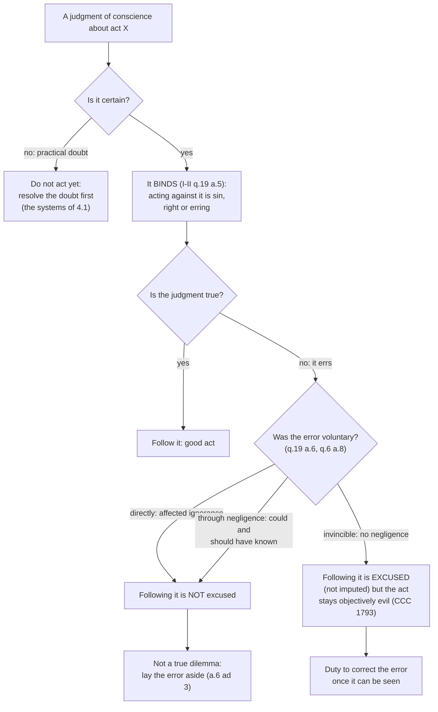

# Moral Theology · Lesson 2.4: Conscience: its nature and its errors

> ⏱ ~15 min · Module 2: Human acts and conscience · Builds on: [2.1 The voluntary](02-01-the-voluntary.md), [2.2 The moral object](02-02-the-moral-object.md), [2.3 Intention and circumstances](02-03-intention-and-circumstances.md), [`ethics` 4.4](../../ethics/lessons/04-04-natural-law-aquinas.md) · Unlocks: [2.5 The primacy of conscience rightly understood](02-05-the-primacy-of-conscience-rightly-understood.md), [3.4 Sin: mortal and venial](03-04-sin-mortal-and-venial.md), [4.1 Casuistry and the probabilism controversy](04-01-casuistry-and-the-probabilism-controversy.md)

## Why this matters

"Follow your conscience" is the one moral rule almost everyone accepts, and the Church accepts it too: a person must always obey the certain judgment of conscience (CCC 1790). The trouble starts when conscience is wrong. If a mistaken conscience binds me, am I obliged to do evil? If it does not, why follow it at all? Aquinas answered both questions in two adjacent articles, and the answer is exact enough to grade cases with. When an erring conscience **binds** and when it **excuses** are two different questions; running them together causes most of the confusion.

## The idea

Think of a pilot with a compass. The compass knows north without being taught; the pilot uses it to judge "turn left here." The compass almost never fails. The pilot can misread the map or never bother to check.

Aquinas makes the same split. [*Synderesis*](../reference.md#synderesis-and-conscientia) is the compass: a natural habit holding the first practical principles ("good is to be done, evil avoided"), about which, he says, no one errs. You met it in [`ethics` 4.4](../../ethics/lessons/04-04-natural-law-aquinas.md) as the starting point of natural law. [*Conscientia*](../reference.md#conscience), conscience proper, is the pilot's judgment: an **act** of practical reason applying what I know to *this* act of mine. Because it reasons its way down to particulars, it can go wrong.

Then two rules follow, and they pull in opposite directions:

- **It binds.** You may never act against what you judge to be God's will, even if the judgment is wrong. Acting against it means choosing what you believe to be evil.
- **It does not always excuse.** Doing what an erring conscience says is blameless only if the error was not your fault.

## Source

ST I-II q.19 a.6, "Whether the will is good when it abides by erring reason?" (English Dominican Province). Aquinas has just said the question depends on the account of ignorance in q.6 a.8, the account [2.1](02-01-the-voluntary.md) taught:

> If then reason or conscience err with an error that is voluntary, either directly, or through negligence, so that one errs about what one ought to know; then such an error of reason or conscience does not excuse the will, that abides by that erring reason or conscience, from being evil. But if the error arise from ignorance of some circumstance, and without any negligence, so that it cause the act to be involuntary, then that error of reason or conscience excuses the will, that abides by that erring reason, from being evil.

Everything hangs on **"voluntary."** An error is voluntary *directly* when I want not to know (2.1's affected ignorance), and *through negligence* when I fail to learn "what one ought to know." Either way the error does not excuse. What excuses is error that makes the act **involuntary**: ignorance that arises "without any negligence." Aquinas's two examples split along a second line. A man whose reason tells him to go to another man's wife is not excused, because the error concerns divine law, "which he is bound to know." A man who takes another woman for his wife, without negligence, is excused, because his error concerns a *circumstance*.

## The argument

The conscience teaching runs in five steps.

1. **Conscience is an act, not a power** (I q.79 a.13). The word implies knowledge *applied* to something, and applying is an act. Conscience does three jobs: it *witnesses* that I did or did not do something; it *binds or incites*, judging that something is to be done; and it *excuses, accuses or torments*, judging that something done was well or ill done. The name is sometimes stretched to *synderesis*, the habit these acts come from (a.12–13). *In words:* conscience is not a faculty you have. It is a judgment you make.

2. **The will's object is the good *as reason proposes it*** (I-II q.19 a.3, a.5). The will tends to nothing except as reason presents it. So an act reason presents as evil becomes, for this will, an evil object, "accidentally," through the apprehension. This is [2.2](02-02-the-moral-object.md)'s moral object seen from inside the agent.

3. **So an [erring conscience](../reference.md#erroneous-conscience) binds** (a.5). Aquinas rejects the view of "some" that an erring conscience binds only in indifferent matters. Even if reason wrongly calls refraining from fornication evil, or believing in Christ evil, the will that goes against that judgment wills what it takes to be evil. His conclusion: "absolutely speaking, every will at variance with reason, whether right or erring, is always evil." Reply 2 gives the reason. Erring reason presents its judgment *as God's*, so to scorn it is to scorn what one takes to be God's command. *In words:* you are never allowed to act against your own sincere verdict.

4. **But an erring conscience excuses only when the error is involuntary** (a.6, the Source). A vincible error, one the agent could and should have overcome, leaves the will evil when it follows the error. Only [invincible ignorance](../reference.md#invincible-ignorance) excuses. Reply 1 gives the logic: for a will to be good, its object must be good both in itself and as apprehended. One defect is enough to make it bad. *In words:* sincerity is necessary for a good act, but it is not sufficient.

5. **This is no trap** (a.6 ad 3). The objection says that if both following and resisting a vincibly erring conscience are sins, the person is caught in a dilemma. Aquinas answers that he "can lay aside his error, since his ignorance is vincible and voluntary." The later tradition calls this case the [perplexed conscience](../reference.md#the-perplexed-conscience). Aquinas uses the same distinction elsewhere: a priest in mortal sin whose office requires him to administer a sacrament is perplexed only on the supposition that he stays in sin, because he can repent first (ST III q.64 a.6 ad 3). *In words:* the way out of the dilemma is to fix the error, not to pick one of the two sins.

**Formation.** Step 5 is why the Catechism puts formation of conscience right after the judgment of conscience. A conscience must be informed. Its education is lifelong. It is formed by the Word of God, prayer, the gifts of the Spirit, the advice of others and the Church's authoritative teaching (CCC 1783–1785). The section on erroneous judgment then applies q.19 a.6. Ignorance is often imputable: when someone takes little trouble to find out what is true and good, or when habitual sin gradually blinds conscience, the person is culpable (CCC 1791, citing *Gaudium et Spes* 16). Where ignorance is invincible, the evil is not imputed, but it "remains no less an evil," and one must work to correct the error (CCC 1793). *Veritatis Splendor* 62–63 says the same. It adds that an act done in invincible error does not have the moral value of one done with a true conscience, and does not perfect the person who does it.

**Mark the levels.** Four claims, four different weights:

- **Authentic ordinary magisterium.** That one must always obey the *certain* judgment of conscience, and that invincible ignorance removes imputability while the act stays objectively disordered. This is taught in *Gaudium et Spes* 16, *Veritatis Splendor* 60–63 and CCC 1790–1793, and no Catholic school denies it. It has never been solemnly defined.
- **Common teaching.** The Thomist machinery: conscience as an act, the object "as apprehended," the vincible/invincible test. The Magisterium uses it, notably CCC 1780's "synderesis," but has not taught its technical details as doctrine.
- **Freely disputed, historically.** Where *synderesis* sits. For Aquinas it is a habit of the intellect. The Franciscan school, Bonaventure among them, placed it on the side of the will's affection. CCC 1780 uses the word without settling this.
- **Common teaching, in the manuals' form.** How far invincible ignorance can reach into the moral law itself. No one is presumed ignorant of the *principles* (CCC 1860). The manuals commonly held that remote conclusions could be invincibly unknown.

See [the levels in moral theology](../reference.md#the-levels-in-moral-theology).

## The rule

The top branch matters: only a *certain* conscience is a rule for action. Acting in real doubt about whether an act is wrong is itself condemned (*Veritatis Splendor* 60). How to get from doubt to a certain practical judgment is the question [4.1](04-01-casuistry-and-the-probabilism-controversy.md)'s systems answer.

## Worked examples

**Example 1: the clean case.** Rosa, a hospital pharmacist, checks a vial against the order, the label and the barcode, as protocol requires, and dispenses it. The manufacturer had mislabeled the lot. Her judgment "this is the right drug" was false. Run the tree. The judgment was certain and bound her. It erred. The error concerned a *circumstance*, what is in this vial, and there was no negligence, so it was invincible. She is **excused**, and the resulting harm is not imputed to her. Now her colleague Sam dispenses the same lot without scanning, because he is behind schedule. His error has the same content but a different history. It came "through negligence," about what he ought to have known, so it does **not** excuse. One outcome, two verdicts.

**Example 2: where it strains.** Aquinas's own example says error about *divine law* does not excuse, because such law is something one "is bound to know." Taken flatly, that would mean invincible ignorance can only ever concern facts. Two texts complicate it. In q.94 a.4 Aquinas himself reports, from Caesar, that theft was once not considered wrong among the Germans. In a.6 he says the secondary precepts of natural law can be "blotted out" by evil persuasions and corrupt customs. Is someone raised inside such a custom *negligent*? The manual tradition drew the line this way. The first principles cannot be invincibly unknown; CCC 1860 says no one is deemed ignorant of them. Conclusions far from those principles can be, for a time and in a given person. The CCC's language is general, "if the ignorance is invincible" (1793), not limited to facts. What the texts do not give you is a line between "near" and "remote" conclusions. Where a particular person's ignorance falls is judged case by case, and the rule stops giving a verdict on its own. It still names the question: could this person, with what was available, have come to know?

## Watch out

- **You might think "an erring conscience binds" means it makes the act right.** Binding is about the agent's will: going against the judgment is sin. It does not make the object good, and following the error can still be sin if the error was vincible. *Veritatis Splendor* 63 rules out treating an act done in invincible error as morally equal to one done with a true conscience.
- **You might think sincerity excuses.** It is necessary, not sufficient. Affected ignorance, and the conscience "almost blinded" by habitual sin (CCC 1791), are sincere and culpable.
- **You might think conscience is a feeling.** It is a judgment of reason (CCC 1778; I q.79 a.13). Feelings of guilt or ease can track that judgment or distort it.
- **Understating the level.** "The Church merely suggests following conscience" is wrong. The duty to obey a certain conscience is taught by the ordinary magisterium (CCC 1790; *Veritatis Splendor* 60). It is not a Thomist quirk.
- **Overstating it.** Calling Aquinas's placement of *synderesis* in the intellect "Church teaching" is also wrong. The Franciscans disagreed, and no act settled it.

## One-liner

> A certain conscience always binds, because acting against it is choosing what you take to be evil; an erring one excuses only when the error was not your fault.

## Problems

**P1 (🟢)** *(Exegetical)* Three cases written for this problem. For each, say (i) whether the agent's conscience binds, (ii) whether acting on it is excused, and (iii) which kind of ignorance from [2.1](02-01-the-voluntary.md) is at work, if any. Two sentences per case.
(a) Ines is convinced, wrongly, that it is a sin to whistle on a Friday. Bored at work one Friday, she whistles anyway, thinking it sinful.
(b) Marcus, a landlord, keeps a tenant's whole deposit for "normal wear and tear," sure it is his right. He has twice skipped reading the local tenancy rules because, as he tells a friend, "I'd rather not find out."
(c) Ade, a volunteer driver, takes a route that the city's official detour map marks as open, having checked it that morning. A bridge on it had been closed an hour earlier without notice, and a passenger misses a medical appointment.

**P2 (🟡)** *(Exegetical)* ST I q.79 a.13, from the *respondeo* (English Dominican Province):

> For conscience is said to witness, to bind, or incite, and also to accuse, torment, or rebuke. And all these follow the application of knowledge or science to what we do: which application is made in three ways. One way in so far as we recognize that we have done or not done something ... and according to this, conscience is said to witness. In another way, so far as through the conscience we judge that something should be done or not done; and in this sense, conscience is said to incite or to bind. In the third way, so far as by conscience we judge that something done is well done or ill done, and in this sense conscience is said to excuse, accuse, or torment.

(a) Which of the three applications looks forward to an act, and which look back? (b) From this passage alone, why must conscience be an *act* and not a habit? (c) The passage lists "excuse" under the third application. Is that the same "excuse" as in the question of I-II q.19 a.6, "whether an erring conscience excuses"? Two sentences per part.

**P3 (🔴)** *(Exegetical)* An **invented** parish youth handout, written for this problem:

> *Conscience 101.* Following your conscience means doing what feels right to you. Conscience is your inner feeling about things, and what feels right for you is right for you. The Church teaches that you must always follow your conscience, so if you sincerely follow it, you can't do anything wrong.

(a) Name the three errors the handout makes, and cite the text that corrects each. (b) Name the one thing it gets right, give its level, and name the acts that fix that level. 150 words total.

Solutions

**P1** *(Exegetical)*

**Must hit, strict:** (a) Her conscience **binds**. Whistling is indifferent, but her certain judgment calls it sinful, and going against a certain conscience, even an erring one, is a sin (q.19 a.5: the rule holds for indifferent matters, like its example of picking up a straw, and for all others). She sins by acting against it. The sin is not the whistling itself but willing what she takes to be evil. There is no ignorance excusing her: she acts *against* her judgment, not from it. (b) His conscience "permits," and it errs. Acting on it is **not excused**: "I'd rather not find out" is **affected ignorance**, which is directly voluntary (q.6 a.8; q.19 a.6). He is not in a real dilemma, because he can lay the error aside by reading the rules (a.6 ad 3). (c) Ade judged the route open, and that judgment was false. The error concerns a **circumstance**, the state of the bridge, and he took due care, so it is **antecedent, invincible** ignorance. He is **excused**, and the missed appointment is not imputed to him.

**Wrong turns:** calling (a) harmless because whistling is indifferent. That is exactly the view Aquinas rejects in a.5. Calling Marcus's error invincible because he is "sure." Certainty is about how he holds the judgment; invincibility is about where the error came from. Treating (c) as excused because the harm was minor. The verdict rests on the absence of negligence, not on how serious the outcome was.

**P2** *(Exegetical)*

**Must hit, strict (a):** the **second** application (judging that something should or should not be done: incite, bind) looks **forward**. The **first** (witness to what was done) and the **third** (judging a deed well or ill done: excuse, accuse, torment) look **back**.

**Must hit, strict (b):** every function listed "follow[s] the application of knowledge" to what we do, and applying is something one *does*. So the thing named is the act of applying. A habit is only the source of that act, which is why the name can be carried over to *synderesis* (a.13, later in the *respondeo*; ad 3).

**Must hit, strict (c):** **No.** Here "excuse" is conscience's own *retrospective verdict*, the agent judging the deed well done. In q.19 a.6 the question is whether the will that follows an erring conscience *is in fact* free of evil. That is answered by whether the error was voluntary, not by the agent's own verdict.

**Wrong turns:** putting "bind" under the retrospective group. Answering (c) "yes, same word." An agent whose conscience excuses him in the first sense can still be unexcused in the second, for example when the error was affected.

**Model answer:** (a) Binding and inciting look forward to an act; witnessing and excusing or accusing look back on one already done. (b) All three functions follow the *application* of knowledge to deeds, and applying is an act, so conscience properly names an act and names *synderesis* only as that act's source. (c) No. In q.79 a.13 "excuse" means conscience's own acquittal of a past deed. In q.19 a.6 it means the will really is not evil, which depends on whether the error was voluntary, not on how the agent judges himself.

**P3** *(Exegetical)*

**Must hit, strict (a):** (1) **Conscience is not a feeling but a judgment of reason** (CCC 1778; I q.79 a.13). (2) **Conscience does not make things right.** It applies a law it does not set up (*Veritatis Splendor* 60), and an erring judgment leaves the act "no less an evil" (CCC 1793). (3) **Sincerity does not guarantee innocence.** An error is excused only if invincible; ignorance can be culpable (CCC 1791; I-II q.19 a.6).

**Must hit, strict (b):** it rightly says one **must always follow a certain conscience** (CCC 1790). Level: **authentic ordinary magisterium**, taught in *Gaudium et Spes* 16, *Veritatis Splendor* 60 and CCC 1790, and never solemnly defined.

**Wrong turns:** "correcting" the handout by saying conscience must yield to feeling-free obedience in every case. That drops the true half, CCC 1790. Calling the duty to follow conscience "defined dogma," or "merely Aquinas's opinion." Both misstate the level.

**Model answer:** The handout makes three errors. It turns conscience into a feeling, when it is a judgment of reason applying knowledge to an act (CCC 1778; ST I q.79 a.13). It lets conscience make the right, when conscience applies a law it does not create (*Veritatis Splendor* 60), and a mistaken judgment leaves the act objectively evil (CCC 1793). And it lets sincerity excuse everything, when only invincible error excuses; negligent or affected error, or a conscience blinded by habitual sin, is culpable (CCC 1791; ST I-II q.19 a.6). What it gets right is that one must always obey the certain judgment of conscience (CCC 1790). That is authentic ordinary magisterium, taught in *Gaudium et Spes* 16, *Veritatis Splendor* 60 and the Catechism, and not solemnly defined.

## Flashback

**From Lesson [2.2](02-02-the-moral-object.md) (The moral object):** *(Exegetical, find the crux.)* Two positions, paraphrased for this problem:

- **A (a revisionist moralist, on the pattern of Fuchs's approach).** The manuals let biology settle morality. Behavior described apart from intention and results, such as taking what another owns or saying what is false, contains only premoral evil: a harm, not yet a wrong. Whether the act is morally wrong appears only when the agent's intention and the proportion of goods and harms in the whole situation are in view.
- **B (*Veritatis Splendor* 78–80, paraphrased).** The object is the freely chosen kind of behavior, grasped from the perspective of the acting person, not a physical event. Some such objects are evil in themselves, whatever the further intention and the foreseeable consequences.

(a) What do A and B agree on that makes the dispute look smaller than it is? (b) Name the single premise on which they divide. (c) At what level does the Church reject A's conclusion, and what about that teaching is still argued? **150 words or fewer.**

Solution

**Must hit, strict (a):** both **reject physicalism**: the object is not a merely physical process (VS 78 accepts the diagnosis, and defenders such as Rhonheimer grant that some manual analyses read the object too physically). Both also hold that intention matters morally.

**Must hit, strict (b):** whether a chosen kind of behavior can be **morally specified, and judged evil, by its object apart from the further intention and the weighing of foreseeable consequences**. A says the moral description waits for the proportion. B says the object as reason grasps it already gives the act its first malice (q.18 a.2).

**Must hit, strict (c):** VS 79 rejects the thesis that no chosen behavior can be judged evil by its object apart from intention and consequences. That is **authentic ordinary magisterium** (VS 78–80; CCC 1750–1756). Still argued: whether the existence of intrinsically evil acts is also **definitive** ([4.4](04-04-veritatis-splendor.md)), and how to describe the object in hard cases, which is **freely disputed** ([4.5](04-05-describing-the-object.md)).

**Wrong turns:** making the crux "is the object physical?" or "does intention matter?", since both sides answer the same way. Calling VS 79 defined or infallible. Calling the A–B dispute itself freely disputed, which confuses it with the hard-case descriptions of 4.5.

**Model answer:** They agree that the object is not a physical event, since VS 78 grants the charge against physicalism, and that intention counts. They divide on whether a chosen kind of behavior can be evil by its object before intention and consequences are weighed: A says no, B says yes. The Church's rejection of A's conclusion (VS 79) is authentic ordinary magisterium. What is argued is whether the teaching on intrinsically evil acts is also definitive, and, as a freely disputed matter, how to describe the object in hard cases.

## Connections

- **Backward:** [2.1](02-01-the-voluntary.md)'s kinds of ignorance are the whole test for "excuses," as a.6 itself says. [2.2](02-02-the-moral-object.md)'s object reappears as the object "as proposed by reason," which is why an erring conscience binds. [`ethics` 4.4](../../ethics/lessons/04-04-natural-law-aquinas.md) supplied *synderesis* as the habit of first principles, and q.94 a.4–6 on natural law being "blotted out" is the background to Example 2.
- **Forward:** [2.5](02-05-the-primacy-of-conscience-rightly-understood.md) asks in what sense conscience is supreme, reading *Gaudium et Spes* 16's "sanctuary," Newman, and *Veritatis Splendor*'s critique of a "creative" conscience. [3.4](03-04-sin-mortal-and-venial.md) needs this lesson's culpable and inculpable ignorance for "full knowledge." [4.1](04-01-casuistry-and-the-probabilism-controversy.md) picks up the doubtful conscience at the top of the tree.
- **Sideways:** the "compass versus pilot" split is Aquinas's version of the difference between knowing a principle and applying it, which [`ethics` 4.2](../../ethics/lessons/04-02-aristotle-virtue-and-practical-wisdom.md) treats as *phronesis*. *Veritatis Splendor* 64's "connaturality" says a well-formed conscience depends on the virtues, the subject of Module 3. See the course [syllabus](../syllabus.md).
