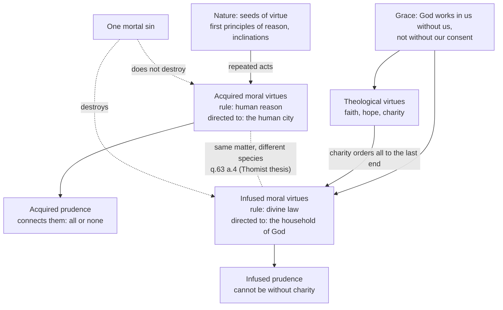

# Moral Theology · Lesson 3.1: Virtue, acquired and infused

> ⏱ ~15 min · Module 3: Virtue, gifts and sin · Builds on: [1.2 Beatitude, the last end](01-02-beatitude-the-last-end.md), [2.1 The voluntary](02-01-the-voluntary.md), [`ethics` 4.2](../../ethics/lessons/04-02-aristotle-virtue-and-practical-wisdom.md) · Unlocks: [3.2 Faith, hope and charity](03-02-faith-hope-and-charity.md), [3.3 The cardinal virtues and the gifts](03-03-the-cardinal-virtues-and-the-gifts.md), [3.4 Sin: mortal and venial](03-04-sin-mortal-and-venial.md)

## Why this matters

Module 2 analysed single acts. But the person who tells the truth easily and the person who tells it through clenched teeth are not in the same state. Aquinas gives virtue sixteen questions of I-II (qq.55–70), and at their centre is a claim Aristotle could not make: God gives virtues that no amount of practice produces, and these are not a boost to the old ones but new *kinds* of virtue. That claim decides what baptism gives, what mortal sin takes away, and why a saint and an honest pagan can do the same deed with different virtues.

## The idea

A **habit** is a second nature: a settled quality that makes a power act readily, one way rather than another. A **virtue** is a habit that disposes you to act well. [`ethics` 4.2](../../ethics/lessons/04-02-aristotle-virtue-and-practical-wisdom.md) gave Aristotle's version: moral virtue is a state that hits the mean, is formed by repeated acts, and is steered by *phronesis* (practical wisdom). Aquinas keeps all of it.

What virtue shapes is chiefly the **passions** (qq.22–48): movements of the sense appetite toward good and away from evil. Aquinas counts eleven (q.23 a.4). Six belong to the **concupiscible** appetite, which regards good or evil simply: love and hatred, desire and aversion, joy and sadness. Five belong to the **irascible** appetite, which regards good or evil as hard to get or hard to avoid: hope and despair, fear and daring, and anger, which has no contrary. The [passions](../reference.md#the-passions) are not vices but the raw material virtue orders: temperance the first family, fortitude the second.

Now the theological turn. Our end is the vision of God ([1.2](01-02-beatitude-the-last-end.md)), and nothing in human nature is proportioned to it. So practice cannot produce the habits that aim there; God has to give them. Aquinas's surprise is that he gives not only faith, hope and charity but a whole second set of moral virtues. There is an infused temperance alongside the acquired one, about the same pleasures, measured by a different rule.

## Source

ST I-II q.55 a.4, "Whether virtue is suitably defined?" (English Dominican Province). Objection 1 gives the definition "usually given," which Aquinas says is gathered from Augustine; the body explains its last clause, and the reply to Objection 6 glosses it:

> "Virtue is a good quality of the mind, by which we live righteously, of which no one can make bad use, which God works in us, without us." ... Lastly, God is the efficient cause of infused virtue, to which this definition applies; and this is expressed in the words "which God works in us without us." If we omit this phrase, the remainder of the definition will apply to all virtues in general, whether acquired or infused. ... Infused virtue is caused in us by God without any action on our part, but not without our consent.

Three things to see. First, Aquinas reads the definition through the **four causes**: "good quality" is the formal cause, and he would rather say "habit," the proximate genus. "Of the mind" is the material cause, the subject. "By which we live righteously" is the final cause. "Which God works in us" is the efficient cause. Second, **the last clause is removable**: delete it and you have a definition of virtue in general, acquired or infused, so the classical definition is really a definition of *infused* virtue. Third, **"without us" is not "without our consent."** Objection 6 had quoted Augustine, "He who created thee without thee, will not justify thee without thee." The reply keeps both halves: God causes the habit without our acting, but not over our refusal. That is the line of [`patristics` 4.5](../../patristics/lessons/04-05-augustine-against-the-pelagians.md) in miniature.

## The argument

1. **A habit is a quality by which a thing is well or ill disposed, and it is hard to lose** (q.49 a.1–2). A being needs habits only where a power is open to many acts, and several factors have to be adjusted to get it right (q.49 a.4). *In words:* God needs no habits and a stone can have none. Rational animals need them.
2. **Virtue is a good operative habit** (q.55 a.1–3), defined as in the Source. This is [the definition of virtue](../reference.md#the-definition-of-virtue).
3. **Acts caused by reason can cause virtue measured by reason** (q.63 a.2). Nature supplies the "seeds": the first principles of reason and natural inclinations (a.2 ad 3). Repeated acts grow them into acquired virtues. One mortal sin does not destroy an acquired habit, since only a contrary habit does that (a.2 ad 2).
4. **But effects must be proportionate to their causes** (q.63 a.3). Our last end exceeds nature, so God gives the theological virtues in place of the natural seeds, and then moral virtues proportioned to them, as the acquired virtues are proportioned to the seeds. *In words:* a new end needs a new starting point and new means. q.51 a.4 makes the same argument for habits generally.
5. **Habits differ in species by the formal aspect of their object, and by what they are directed to** (q.63 a.4). The mean in the same matter can be fixed by human reason or by divine rule, and these are different measures. And infused virtues equip us as "fellow-citizens with the saints" (Eph 2:19), as a citizen's virtues are fitted to his city. *Therefore* acquired and [infused virtue](../reference.md#infused-virtue) differ in species, not just in degree. *In words:* infused temperance is not acquired temperance made stronger. It is temperance with a different rule and a different city.
6. **Perfect moral virtues are connected** (q.65 a.1). An "imperfect" virtue is only an inclination, and inclinations come singly: a man can be generous and unchaste. A perfect virtue needs prudence to choose well, and prudence needs every moral virtue to supply its ends. So one has all or none. This is [the connection of the virtues](../reference.md#the-connection-of-the-virtues).
7. **Charity binds the infused virtues** (q.65 a.2–3). Acquired virtues can exist without charity, "even as they were in many of the Gentiles." Only infused virtues are virtue "truly and perfectly" relative to the last end, and they cannot exist without charity, because infused prudence needs a will rightly ordered to the last end. All the moral virtues are infused together with charity (a.3). 3.2 builds [charity as the form of the virtues](../reference.md#charity-as-form-of-the-virtues) on this.
8. **Two corollaries.** Infused virtue can coexist with difficulty, because "dispositions remaining from previous acts" can linger. Acquired virtue does not have this problem, since the repeated acts that build it remove the contrary dispositions (q.65 a.3 ad 2). And acts done from an infused habit do not generate a new habit; they strengthen the one given (q.51 a.4 ad 3). *In words:* grace gives the habit whole, and practice clears the road for it.

**Mark the levels.** That the grace and charity of justification are poured forth by the Holy Spirit and inhere in the justified is **defined dogma** (Trent VI, canon 11). That faith, hope and charity are "infused at once" in justification is taught by an ecumenical council in a doctrinal chapter (Trent VI, ch. 7). That the moral virtues are infused too is **common teaching**, not defined. The Council of Vienne (1311–12) ruled only that the opinion that the virtues are conferred in baptism, on infants and adults, is the *more probable* one (paraphrased). The Catechism lists growth "through the moral virtues" among baptism's effects (CCC 1266), which reports the teaching without raising its level. That infused and acquired moral virtues **differ in species** is a Thomist thesis, **freely disputed**: Scotus and his school are usually reported as denying that separate infused moral virtues are needed (hedged; this lesson has not checked the texts). The four-cause reading of the definition and the connection of the virtues through prudence are **common teaching** of the schools, shared with Aristotle. No magisterial act has made them doctrine. See [the levels in moral theology](../reference.md#the-levels-in-moral-theology).

## Map of the virtues

## Worked examples

**Example 1: the tool on a clean case.** Thea, unbaptized, has been an impartial magistrate for thirty years. She gives each litigant a hearing, is not moved by bribes, and would find a crooked verdict painful. She has **acquired justice**, formed by repeated acts and measured by human reason's account of what is owed. It is a real virtue, the kind found "in many of the Gentiles" (q.65 a.2), imperfect only relative to the last end. Is it connected? Only as far as her prudence is sound across the other matters. If she is consistently temperate and brave as well, her acquired virtues form one connected set. If she is reckless with money, then by q.65 a.1 her justice is still an inclination that has not reached perfect virtue. What she lacks is **infused** virtue, which no number of just verdicts could produce (q.63 a.2).

**Example 2: where it strains.** Paul, baptized and in grace, has practised honesty for years. One night he commits a grave fraud with full knowledge and consent. What does he lose?

- **Charity and the infused moral virtues.** Mortal sin is incompatible with them (q.63 a.2 ad 2). They go together because they came together (q.65 a.3). Whether faith and hope survive, unformed, is 3.2's question (q.65 a.4).
- **Not his acquired honesty.** One act does not destroy a habit (q.63 a.2 ad 2). Tomorrow Paul will still find truthful speech easier than most people do.

The strain: the visible thing, his ease in honest dealing, survives, while what ordered his honesty to God is gone. This is why the tradition refuses to read the state of grace off behaviour. Acquired virtue can mimic infused virtue, and infused virtue can look like struggle (premise 8). When grace returns with repentance, all the infused virtues return at once (q.65 a.3), though the ease may not. What makes a sin mortal is [3.4](03-04-sin-mortal-and-venial.md)'s question.

## Watch out

- **You might think infused virtue is acquired virtue with a supernatural boost.** q.63 a.4 says the two differ *in species*: different formal object and different community. A boost would be a difference of degree. But hold this thesis at its level. It is Thomist and freely disputed, not doctrine.
- **Levels, both ways.** Overstating: "Vienne defined that the moral virtues are infused at baptism." Vienne chose it as the *more probable* opinion, which is the opposite of a definition. Understating: "whether charity is infused in justification is a matter of theological opinion." Trent VI canon 11 anathematizes excluding the charity poured forth and inherent.
- **You might think "without us" means passively, without consent.** The reply to Objection 6 draws exactly that line. God infuses the habit without our *action*, but not without our *consent*.
- **You might think a pagan's virtue is fake.** Aquinas calls it true virtue, imperfect relative to the last end (q.65 a.2). The "imperfect" of q.65 a.1 is a different sense: an inclination not yet ruled by prudence.
- **Don't confuse continence with infused virtue.** A person in grace who finds an act hard may have the virtue with lingering contrary dispositions (q.65 a.3 ad 2). Aristotle's continent person ([`ethics` 4.2](../../ethics/lessons/04-02-aristotle-virtue-and-practical-wisdom.md)) lacks the virtue. Same struggle, different diagnosis.

## One-liner

> Practice builds the virtues that fit the human city, and grace gives, whole and together with charity, different virtues that fit the household of God.

## Problems

**P1 (🟢)** *(Exegetical)* ST I-II q.65 a.1, from the body (English Dominican Province):

> An imperfect moral virtue, temperance for instance, or fortitude, is nothing but an inclination in us to do some kind of good deed, whether such inclination be in us by nature or by habituation. If we take the moral virtues in this way, they are not connected: since we find men who, by natural temperament or by being accustomed, are prompt in doing deeds of liberality, but are not prompt in doing deeds of chastity. But the perfect moral virtue is a habit that inclines us to do a good deed well ... no moral virtue can be without prudence ... In like manner one cannot have prudence unless one has the moral virtues

(a) Which words mark the difference between imperfect and perfect virtue? (b) State the two-way dependence that makes perfect virtues connected. (c) Ruth gives generously and gladly, but is habitually unchaste. Does she have the virtue of liberality on this passage's terms? Two sentences per part.

**P2 (🟡)** *(Exegetical)* Four cases written for this problem. For each, say which moral virtues the person has (acquired, infused, both, or neither as perfect virtue), cite the article that decides it, and give one sentence of reasons.
(a) A week-old infant, just baptized.
(b) An unbaptized nurse, gentle and brave for twenty years across every part of her life.
(c) A baptized man in grace who has fasted for years, and who today commits a grave sin of perjury with full knowledge and consent. Take his temperance only.
(d) The same man a month later, after repentance and restoration to grace, before he has done any new act of fasting.

**P3 (🔴)** *(Exegetical)* An **invented** parish handout, written for this problem:

> "At baptism God infuses every virtue, so practising virtue adds nothing: effort is Pelagianism. Pagans never had real virtue, only habits. The Council of Vienne defined that the moral virtues are infused in baptism, and Aquinas proved these virtues are the acquired ones perfected by grace."

Identify four errors. For each, name the text or act that corrects it and, where a level is involved, give the correct level. 150 words or fewer.

Solutions

**P1** *(Exegetical)*

**Must hit, strict (a):** imperfect virtue is "nothing but an inclination ... to do some kind of good deed". Perfect virtue "inclines us to do a good deed **well**". The word *well* carries the difference, meaning chosen rightly, which is prudence's work.

**Must hit, strict (b):** moral virtue needs prudence to choose the means ("no moral virtue can be without prudence"), and prudence needs the moral virtues to fix the ends it reasons from ("one cannot have prudence unless one has the moral virtues"). So lacking one moral virtue means lacking prudence, which means lacking every perfect moral virtue.

**Must hit, strict (c):** she has liberality only as an **imperfect** virtue, an inclination like the passage's "prompt in doing deeds of liberality". Her unchastity means her prudence is defective in that matter, so by (b) her liberality is not perfect virtue.

**Wrong turns:** reading "imperfect" as "not a virtue at all in any sense". The passage calls it an imperfect *moral virtue*. Answering (c) with "yes, the virtues are separable". That holds only for inclinations, which is the passage's first sentence.

**Model answer:** (a) "Nothing but an inclination" against "inclines us to do a good deed well". The *well* is right choice, which only prudence gives. (b) Moral virtue cannot be without prudence, and prudence cannot be without the moral virtues that fix its ends, so the perfect virtues stand or fall together. (c) Only as an imperfect virtue, a readiness for generous deeds. Unchastity leaves her prudence deficient, and without prudence her generosity is not the perfect virtue.

**P2** *(Exegetical)*

**Must hit, strict:** (a) **Infused only**: all the infused virtues come with grace and charity (q.65 a.3), held as habits without yet the use, as Vienne's preferred opinion put it (the level is common teaching). There is no acquired virtue, since there have been no acts (q.63 a.2). (b) **Acquired** virtues, and since they cover every part of her life, plausibly connected through acquired prudence (q.65 a.1). They are true but imperfect relative to the last end, "as in many of the Gentiles" (q.65 a.2). She has **no infused** virtue. (c) He loses **infused** temperance, because mortal sin is incompatible with infused virtue (q.63 a.2 ad 2) and the infused virtues stand together with charity (q.65 a.2–3). He keeps **acquired** temperance, because one act does not destroy a habit (q.63 a.2 ad 2). (d) **Both**: infused temperance returns whole with charity (q.65 a.3), and acquired temperance was never lost.

**Wrong turns:** in (c), saying all his temperance is gone. In (d), saying infused temperance must be rebuilt by new fasts. Acts from an infused habit strengthen it but do not cause it (q.51 a.4 ad 3). In (a), crediting the infant with acquired virtue "because infused virtue includes it". The two differ in species (q.63 a.4).

**P3** *(Exegetical)*

**Must hit, strict:** (1) "Practising adds nothing." Acts from an infused habit strengthen it (q.51 a.4 ad 3), and repeated acts remove the contrary dispositions that make virtuous acts hard (q.65 a.3 ad 2). The line on Pelagianism is also misplaced: q.55 a.4 ad 6 says God infuses virtue without our action but *not without our consent*. (2) "Pagans never had real virtue." Acquired virtues existed "in many of the Gentiles" and are true virtue, imperfect relative to the last end (q.65 a.2). (3) "Vienne defined." Vienne chose the opinion as **more probable**, which is not a definition. The infusion of the moral virtues is **common teaching**. (4) "The acquired ones perfected by grace." q.63 a.4 teaches that the infused virtues differ **in species** from the acquired, and even that thesis is **freely disputed**, a Thomist position rather than doctrine.

**Wrong turns:** "correcting" (4) by saying the Church defined the difference in species. Treating the charge of Pelagianism as the error to be corrected, rather than the claim that practice adds nothing.

## Flashback

**From Lesson [2.4](02-04-conscience-its-nature-and-its-errors.md) (Conscience: its nature and its errors):** *(Exegetical.)* Two cases written for this problem.
(a) Elena finds several cans of paint in her building's shared basement. She is genuinely unsure whether they were left for anyone to use or belong to a neighbour. Without asking anyone, she uses them.
(b) Dario has heard a rumour that his neighbour poisoned his dog. He has not asked the vet who examined the dog, because "I already know." He is now certain that justice requires him to name the neighbour in the street's group chat, and he says: "If I stay silent, I betray my conscience. If I post and I'm wrong, I've wronged him. Either way I sin."
For (a), say whether she acted wrongly and what she should have done. For (b), say whether his conscience binds, whether posting would be excused, and whether he is really trapped, citing the texts. **Two sentences for (a), three for (b).**

Solution

**Must hit, strict (a):** she acted wrongly **even if the paint turned out to be free**. Only a **certain** conscience is a rule for action, and acting in real doubt about whether an act is wrong is itself condemned (*Veritatis Splendor* 60). She should have **resolved the doubt first**, here simply by asking the neighbours or the building manager. How to act on a doubt that inquiry cannot settle is [4.1](04-01-casuistry-and-the-probabilism-controversy.md)'s question.

**Must hit, strict (b):** his certain conscience **binds**: to stay silent against it would be to act against a certain judgment of conscience (CCC 1790). Posting would **not be excused**, because his error is **vincible**. It comes through negligence about what he could and ought to find out, since the vet can tell him (ST I-II q.19 a.6). He is **not trapped**: he can lay the error aside by asking, and the dilemma exists only on the supposition that he stays in it (a.6 ad 3).

**Wrong turns:** excusing Elena because "it was probably fine": the fault is acting while doubting, not the outcome. Calling Dario's error invincible because he is certain; certainty is about how he holds the judgment, invincibility about where the error came from. Resolving his dilemma by telling him to pick the lesser sin.

**Model answer:** (a) Elena acted wrongly, because she acted while genuinely doubting whether the act was wrong, and only a certain conscience may guide action (VS 60). She should first have removed the doubt by asking. (b) Dario's certain judgment binds him, so staying silent against it would be sin (CCC 1790). But following it is not excused, since his error is negligent and he could correct it by asking the vet (q.19 a.6). He is perplexed only while he stays in the error, which he can lay aside (a.6 ad 3).

## Connections

- **Backward:** [1.2](01-02-beatitude-the-last-end.md) supplied the supernatural end that makes infused virtue necessary, and [2.1](02-01-the-voluntary.md) the voluntary acts that build acquired virtue. [`ethics` 4.2](../../ethics/lessons/04-02-aristotle-virtue-and-practical-wisdom.md) owns Aristotle's virtue, the mean, *phronesis* and continence. [`thomistic-synthesis` 5.4](../../thomistic-synthesis/lessons/05-04-a-map-of-the-second-and-third-parts.md) places qq.49–70 in the plan of I-II. The Source's "not without our consent" is Augustine against Pelagius ([`patristics` 4.5](../../patristics/lessons/04-05-augustine-against-the-pelagians.md)). Grace itself is [`creation-grace-last-things`](../../creation-grace-last-things/syllabus.md)'s.
- **Forward:** [3.2](03-02-faith-hope-and-charity.md) takes premise 7 to charity as the form of the virtues and asks what unformed faith is. [3.3](03-03-the-cardinal-virtues-and-the-gifts.md) runs the cardinal virtues on cases and adds the gifts (q.68). [3.4](03-04-sin-mortal-and-venial.md) supplies the conditions under which Example 2's single act is mortal.
- **Sideways:** [`ethics` 4.3](../../ethics/lessons/04-03-modern-virtue-ethics.md)'s situationist challenge says robust virtue is rare. q.65 a.3 ad 2 lets infused virtue be real in someone whose behaviour still wavers; whether that answers the psychologists or dodges them is a fair question. See the course [syllabus](../syllabus.md).
