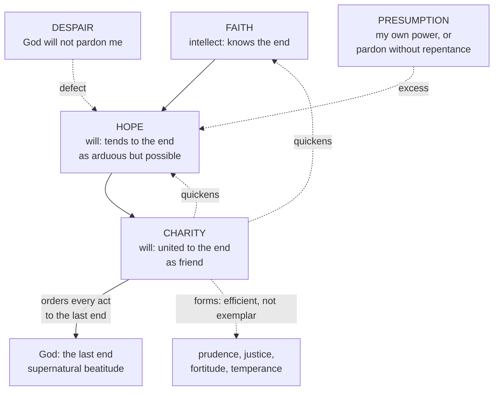

# Moral Theology · Lesson 3.2: Faith, hope and charity

> ⏱ ~15 min · Module 3: Virtue, gifts and sin · Builds on: [3.1 Virtue, acquired and infused](03-01-virtue-acquired-and-infused.md), [1.2 Beatitude, the last end](01-02-beatitude-the-last-end.md), [`fundamental-theology` 2.1 The act of faith](../../fundamental-theology/lessons/02-01-the-act-of-faith.md) · Unlocks: [3.3 The cardinal virtues and the gifts](03-03-the-cardinal-virtues-and-the-gifts.md), [3.4 Sin: mortal and venial](03-04-sin-mortal-and-venial.md)

## Why this matters

Aristotle's virtues fit you for a happiness proportionate to human nature. [1.2](01-02-beatitude-the-last-end.md) put the Christian's last end beyond nature's reach, in the vision of God. Aquinas closes the gap with three virtues whose object is God himself. One of them, charity, gives every other virtue its final shape. That thesis explains why one mortal sin can drain the merit from a whole life of good habits ([3.4](03-04-sin-mortal-and-venial.md)), and why Catholic morality is at bottom a friendship, not a code.

## The idea

Think of an invitation to a king's table. Good manners make you a decent guest anywhere, but they do not get you in the door or make the king your friend. For that you must **know** the invitation is real, **count on** the king to bring you there, since you cannot arrive under your own power, and actually **be his friend**, wanting his good for his own sake.

Those are faith, hope and charity: the mind's grip on what God has revealed, the will reaching for the end as arduous but possible, and the will already united to it as a friend. Where the analogy breaks is the doctrine: no creature can befriend God on its own initiative. All three virtues are **infused**, as [3.1](03-01-virtue-acquired-and-infused.md) explained for [infused virtue](../reference.md#infused-virtue) in general.

The second half of the idea is charity's reach. A soldier's courage is real courage, but what it is courage *for* depends on the cause he serves. Charity directs every Christian virtue's acts to God as last end, and so stamps each with its final character.

## Source

Aquinas, ST II-II q.23 a.8, "Whether charity is the form of the virtues?", *respondeo* and reply to the first objection (English Dominican Province):

> I answer that, In morals the form of an act is taken chiefly from the end. The reason of this is that the principal of moral acts is the will, whose object and form, so to speak, are the end. ... it is charity which directs the acts of all other virtues to the last end, and which, consequently, also gives the form to all other acts of virtue ...
>
> Reply to Objection 1. Charity is called the form of the other virtues not as being their exemplar or their essential form, but rather by way of efficient cause, in so far as it sets the form on all ...

Three moves. **The premise** is [2.3](02-03-intention-and-circumstances.md)'s: in moral matters [the end is the form of the act](../reference.md#the-end-as-form-of-the-act). **The minor** comes from a.7: only charity orders acts to the *last* end. **The rider** in the reply blocks two misreadings. Charity is not the pattern the other virtues copy (that would make them one species with it), nor their essence (that would erase their differences). It acts on them as a commander on the soldiers he deploys. Justice stays justice; charity makes a just act an act done for God.

## The argument

1. **Two happinesses, two sets of principles** (I-II q.62 a.1). One happiness is reachable by natural principles; the other, a sharing in the divine nature (2 Peter 1:4), exceeds them. So man needs principles added by God. *In words:* a supernatural end needs supernatural equipment.
2. **The three marks of a theological virtue** (a.1). Its object is God. God alone infuses it. It is known only through revelation. So they differ in species from every moral and intellectual virtue (a.2).
3. **Why three** (a.3). The intellect needs supernatural principles to know the end, and that is faith. The will needs to tend toward the end as attainable, which is hope. It also needs to be united to the end, as if transformed into it, which is charity. Faith as an act is [`fundamental-theology` 2.1](../../fundamental-theology/lessons/02-01-the-act-of-faith.md)'s.
4. **Two orders** (a.4). The habits are infused together. As to their acts, faith comes first in the order of generation, since you cannot hope for or love what you do not know, and hope comes before charity. In the order of perfection charity comes first, because it quickens the other two.
5. **Hope** (II-II q.17 a.1–2; q.18 a.4). Its object is eternal happiness, an arduous good possible only by God's help, on which hope leans. Its certainty is borrowed from faith and rests on God's omnipotence and mercy, not on grace one already holds (q.18 a.4 ad 2).
6. **Hope's two opposites** ([despair and presumption](../reference.md#despair-and-presumption)). *Despair* conforms the will to a false estimate: that God refuses pardon to the repentant (q.20 a.1). It can coexist with right faith in general when one's estimate of one's own case is corrupted (a.2). *Presumption* takes two forms (q.21 a.1). One relies on one's own power for what exceeds it. The other relies on God's power for what God does not give, such as pardon without repentance or glory without merits. In their own species, unbelief and hatred of God are graver than despair, but despair is more dangerous to us, since it cuts the nerve of effort (q.20 a.3). Presumption is less grave than despair, since mercy suits God more than punishment (q.21 a.2).
7. **Charity is friendship** (q.23 a.1). Friendship requires benevolence, mutual love, and a *communication*, a shared life, to rest on. God communicates his own happiness to us, and on that sharing a friendship between man and God is founded. The text is Christ's: "I will not now call you servants ... But I have called you friends" (John 15:15, Douay-Rheims). It reaches enemies and sinners as love of a friend reaches all who belong to him (a.1 ad 2–3). See [charity as friendship](../reference.md#charity-as-friendship).
8. **Charity is a created habit** (a.2). Peter Lombard held that charity in us is the Holy Spirit himself, with no intermediate habit. Aquinas replies that such love would not be voluntary or connatural; charity is a created participation in the divine charity.
9. **Charity is the [form of the virtues](../reference.md#charity-as-form-of-the-virtues)** (a.7–8, the Source). Hence, without charity, a virtue ordered to a true particular good, such as the welfare of the city, is true virtue but imperfect (a.7). A virtue ordered to a merely apparent good is counterfeit. Faith without charity is the same case: it is still true faith, *lifeless* but not a virtue simply (q.4 a.5). See [living and lifeless faith](../reference.md#living-and-lifeless-faith).
10. **Charity has an order** ([the order of charity](../reference.md#the-order-of-charity), q.26). God first, as source of the shared happiness (a.2); then oneself spiritually, since one may not sin even to free a neighbor from sin (a.4); a neighbor's soul before one's own body (a.5); among neighbors, the nearer loved more intensely, each in the sphere of their tie (a.7–8). Beneficence follows the same order, other things being equal. Where one person is closer and another is needier, Aquinas says no general rule decides, and a prudent judgment must (q.31 a.3 ad 1). A stranger in extreme necessity can come before a father not in such urgent need.

**Mark the levels.** That faith, hope and charity are infused together with justification is taught in Trent's decree on justification (Session VI ch. 7). Canon 11 anathematizes anyone who excludes from justification the charity poured forth by the Holy Ghost that inheres in the justified, which puts inherent charity at **rung 1**. That faith can survive the loss of grace and remain true faith even when not living is also **rung 1** (canon 28; ch. 15). No one can have absolute and infallible certainty of final perseverance without special revelation (canon 16), and yet all "ought to place and repose a most firm hope in God's help" (ch. 13). That despair and presumption are sins against hope (CCC 2091–2092) is at least **rung 3**, since the Catechism carries the weight of what it summarizes ([`fundamental-theology` 4.5](../../fundamental-theology/lessons/04-05-reading-a-documents-weight.md)). CCC 1827 calls charity the form of the virtues; the Thomist analysis of that phrase (efficient causality, the created habit against Lombard, the fine grain of q.26) is **common teaching (rung 4)**. Whether charity is really distinct from sanctifying grace, as Thomists hold, or identical with it, as Scotists hold, is a school question at **rung 5**. See [the levels in moral theology](../reference.md#the-levels-in-moral-theology).

## Picture

Solid arrows: the order of generation (a.4). Dashed: what charity does to the other virtues, and what the two vices do to hope.

## Worked examples

**Example 1: the form on a clean case.** Three people each give 500 dollars to a food bank.
- *Ana* gives to see her name on the donor wall. Her end is an apparent good, so by a.7 this is counterfeit virtue, like the miser Aquinas borrows from Augustine (*Contra Julianum* IV.3), whose thrift and restraint serve avarice.
- *Ben* has no faith and gives because his town's hungry deserve help. His end is a true particular good, so his act is true virtue but imperfect: good in kind, lacking its order to the last end (a.7 and ad 1).
- *Clara* gives for Ben's reason and out of love of God. Her liberality is **informed** by charity: the same kind of act, commanded toward God, and meritorious.

Ben is the precise point: Aquinas does not call his act a sin. He keeps a middle category that Augustine's harsher *City of God* XIX.25 does not.

**Example 2: where the order of charity strains.** In an epidemic, Dr. Okafor is the hospital's staff physician; Dr. Lindqvist, retired, volunteers. Article 4 says one ought to love oneself more than one's neighbor. Should both stay away?

No. "Self" in a.4 means one's *spiritual* good, one's share in beatitude, and bearing bodily harm for a friend is exactly how one loves oneself more in that sense (a.4 ad 2). The order still distinguishes them. Charity does not require a man to imperil his body for a neighbor's welfare unless he is under an obligation to do so. If he offers himself of his own accord, that "belongs to the perfection of charity" (a.5 ad 3). So Okafor, bound by office, is *obliged* to stay. Lindqvist's going is beyond duty, and no one may demand it of her. The limit is in a.4: one may not sin even to free a neighbor from sin, so a fortiori neither doctor may, say, falsify triage records to save a neighbor's body. The order ranks bodily goods; it never trades away one's own innocence.

## Watch out

- **You might think "Augustine called pagan virtues splendid vices."** The tag is not in the text. *City of God* XIX.25 says virtues without reference to God are to be reckoned vices rather than virtues, and Aquinas's own position (true but imperfect, q.23 a.7) is milder still. The thesis that every act of the unredeemed is a vice was Baius's, among the propositions Pius V's bull *Ex omnibus afflictionibus* (1567) condemned. They were censured together, not each with its own note, so do not assign each a precise rung.
- **Overstating the level.** The Thomist *explanation* of CCC 1827's phrase is common teaching, not dogma. Equally, **do not understate** Trent: canons 11, 16 and 28 are defined.
- **You might think firm hope means certainty of salvation.** Trent asks for "most firm hope" and denies absolute certainty of perseverance in the same breath (ch. 13, canon 16). Hope's certainty rests on God's power and mercy, not on one's own state (q.18 a.4 ad 2).
- **You might file presumption as simply "too much hope."** Its second form aims at what God does not give, pardon without conversion. Aquinas calls it, properly, the sin against the Holy Ghost (q.21 a.1).
- **Despair is not the same as depression.** Despair as sin is a voluntary movement against God's mercy; an unconsented mood or thought falls under [2.1](02-01-the-voluntary.md)'s rules on imputability.

## One-liner

> Faith knows the Friend, hope leans on him to be brought home, and charity already loves him, and in loving him sets every other virtue marching toward him.

## Problems

**P1 (🟢)** *(Exegetical)* ST II-II q.23 a.1, "Whether charity is friendship?", *respondeo* (English Dominican Province):

> I answer that, According to the Philosopher (Ethic. viii, 2,3) not every love has the character of friendship, but that love which is together with benevolence, when, to wit, we love someone so as to wish good to him. If, however, we do not wish good to what we love, but wish its good for ourselves, (thus we are said to love wine, or a horse, or the like), it is love not of friendship, but of a kind of concupiscence. ... Yet neither does well-wishing suffice for friendship, for a certain mutual love is requisite, since friendship is between friend and friend: and this well-wishing is founded on some kind of communication.
>
> Accordingly, since there is a communication between man and God, inasmuch as He communicates His happiness to us, some kind of friendship must needs be based on this same communication ...

(a) List the conditions the passage sets for friendship, with the words that carry each. (b) Aristotle doubted that friendship between a man and a god is possible, because the distance is too great. Which condition does the passage satisfy in a way Aristotle's account could not supply, and what does that imply about where charity comes from? Two sentences per part.

**P2 (🟡)** *(Exegetical)* Four invented people:
(i) Marek has confessed the same sin many times and says: "I believe the Church can forgive sins. But not mine, not again. God is finished with me."
(ii) Sofia skips Mass, lives with no thought of changing, and says: "God is love. He'll take me in at the end whatever I do."
(iii) Tom: "Grace is a crutch. Enough discipline and honesty will get anyone to heaven."
(iv) Irene, after a conversion, says: "I trust God completely to bring me to glory, and I fear falling, because I know my weakness."
(a) Classify each as despair, presumption (say which kind), or neither, citing the article that decides it. One line each. (b) Irene's sister says Irene should be *certain* she will persevere. Give the level of the teaching that answers her, and name the act that fixes it.

**P3 (🔴)** *(Exegetical)* An invented case. Nadia has 3,000 dollars of savings. Her father wants help repaying a loan he took out for a new car, and his need is real but not urgent. A family she barely knows at her parish faces eviction next week that would leave young children without shelter, and 3,000 dollars would prevent it. Using q.26 and q.31 a.3: (a) state which rule gives her father priority and why; (b) say whether that rule settles the case, and what does; (c) name one thing the order of charity would forbid her to do to raise the money for either party. 150 words total.

Solutions

**P1** *(Exegetical)*

**Must hit, strict (a):** three conditions. (1) **Benevolence**: "we love someone so as to wish good to him," contrasted with loving wine or a horse for *our* good, which is "a kind of concupiscence." (2) **Mutual love**: "a certain mutual love is requisite, since friendship is between friend and friend." (3) A **communication** or sharing on which the well-wishing is founded: "founded on some kind of communication."

**Must hit, strict (b):** the **communication** condition. God "communicates His happiness to us," so the shared life that Aristotle found missing between unequals is supplied *from God's side*. It follows that charity is a gift that depends on God's self-communication, not a friendship man could initiate. That is why it is infused (q.62 a.1) and not acquired.

**Wrong turns:** listing "virtue in the friend" as a condition; that is Aristotle's best *kind* of friendship, not a condition in this passage. Treating benevolence alone as sufficient, when the passage says "neither does well-wishing suffice." In (b), saying man closes the distance by his own love.

**Model answer:** (a) Friendship requires benevolence, wishing good to the other for his sake and not, as with wine, for ours. It also requires mutual love "between friend and friend," and a communication on which the well-wishing is founded. (b) The communication is supplied by God, who shares his own happiness with us, so the gap Aristotle thought fatal is bridged from above. Charity is therefore received, not achieved: a friendship God begins.

**P2** *(Exegetical)*

**Must hit, strict (a):** (i) **Despair.** He keeps right faith "in the universal" but his estimate of his own case is corrupted, which is q.20 a.2's case exactly. (ii) **Presumption of the second kind**, relying on God's mercy for pardon without repentance (q.21 a.1; CCC 2092). (iii) **Presumption of the first kind**, relying on one's own power for a good that exceeds it (q.21 a.1). (iv) **Neither.** This is hope proper: firm trust resting on God's help together with fear of falling, which is Trent's "most firm hope" with "fear and trembling" (Session VI ch. 13; q.18 a.4 ad 2).

**Must hit, strict (b):** that no one can have absolute and infallible certainty of final perseverance without special revelation is **rung 1, defined**, by **Trent Session VI canon 16**, with ch. 13 as the doctrinal chapter.

**Wrong turns:** calling (i) unbelief because he "doesn't believe"; he affirms the Church's power, and that is the point of q.20 a.2. Calling (iv) presumption because she trusts "completely"; hope's firmness is required, and presumption is trust aimed at what God does not give. Citing the Catechism alone for (b), which gives the weight of what it summarizes but is not the defining act.

**P3** *(Exegetical)*

**Must hit, strict (a):** the rule that we love **more intensely those more closely united to us**, and owe them benefits first in the matter of that tie (q.26 a.7–8; q.31 a.3). A father is closest by natural origin.

**Must hit, strict (b):** it holds only **"other things being equal."** Where one party is closer and the other needier, Aquinas says **no general rule decides**, and it needs **the judgment of a prudent man** (q.31 a.3 ad 1). He adds that a stranger in **extreme necessity** can be preferred to a father who is not in such urgent need, and children about to lose shelter are close to that. The text leans toward the family, and prudence settles it.

**Must hit, strict (c):** she may not **sin** to raise the money, for example by lying on a loan application, because one may not sin even to free a neighbor from sin (q.26 a.4), and a fortiori not for a neighbor's temporal good.

**Wrong turns:** treating the order of charity as a strict ranking that always puts kin first. Treating it as no order at all, "love everyone equally," which is the view a.6 rejects. Answering (c) with "she may not give it all away." Charity does not forbid generosity. It forbids sin.

**Model answer:** Kin come first by the order of charity, because love is more intense toward those more closely united to us (q.26 a.8), and benefits follow the tie (q.31 a.3). But that holds other things being equal. When closeness and need pull apart, Aquinas says no general rule decides and prudence must judge, and he allows a stranger in extreme necessity to come before a father whose need is not urgent. Imminent homelessness for children is near that line, so the text leans toward the family. What she may not do is sin to raise the money, for example by lying to a lender, because charity never trades one's own spiritual good for another's temporal good (a.4).

## Flashback

**From Lesson [2.5](02-05-the-primacy-of-conscience-rightly-understood.md) (The primacy of conscience rightly understood):** *(Exegetical.)* Three **invented** appeals to conscience. For each, say which claim is in play: the **primacy of obligation** (never act against a certain conscience), a **doctrinal question** that is not conscience's field, or a **primacy of authorship** (conscience deciding the norm). Then say whether the appeal holds, citing the text that decides it. **Two sentences each.**
(a) An army lieutenant ordered to fire on unarmed demonstrators refuses: "My conscience will not let me kill these people."
(b) A catechist tells her pastor: "In conscience I cannot accept that Mary was assumed body and soul into heaven, so I will teach it as optional."
(c) An interrogator writes: "The norm against torture is a general orientation. Weighing everything in this case, my conscience has decided that torturing the prisoner is right."

Solution

**Must hit, strict:** (a) **Primacy of obligation, and the appeal holds.** A certain conscience binds (GS 16; VS 60; CCC 1790). Here conscience acts as *herald*: it applies the law against killing the innocent to a command, which is Newman's case of a legitimate collision between conscience and an order. (b) **A doctrinal question, so the appeal fails.** Whether a doctrine is true is not a practical judgment about an act, and conscience cannot license dissent from a doctrinal pronouncement (*Donum Veritatis* 38; Newman: conscience judges conduct, not doctrine). Conscience returns only at the level of action, and teaching a defined dogma as "optional" misrepresents what the Church teaches. (c) **Authorship: the "creative" conscience that VS 54–56 rejects.** It treats the norm as a general orientation and conscience as issuing a "decision" that grants an exception to a negative precept. Torture is among the acts VS 80 lists (quoting GS 27) as intrinsically evil, and conscience applies the law; it does not grant exceptions (VS 56, 60).

**Wrong turns:** answering (c) with "his conscience is certain, so he must follow it." Even a binding erroneous conscience does not make the act good (VS 63), and his claim is not that he has *judged* the act good under the law but that his decision *sets* the law aside. Treating (a) as conscience against authority where authority keeps the presumption: Newman's presumption for obedience does not survive an order to do what is certainly evil. Answering (b) with Newman's toast, which concerns commands, not doctrines.

**Model answer:** (a) Obligation: his certain conscience binds him, and it is right, because it applies the law against killing the innocent to an unjust order. (b) Doctrine: whether the Assumption is true is not a matter for conscience, which judges acts (DV 38), so the appeal cannot ground teaching it as optional. (c) Authorship: this is the creative conscience of VS 54–56, claiming to grant an exception to the norm against an intrinsically evil act, and conscience has no such power.

## Connections

- **Backward:** [1.2](01-02-beatitude-the-last-end.md) set the supernatural end that q.62 a.1 answers. [3.1](03-01-virtue-acquired-and-infused.md) supplied infused virtue in general, and this lesson names the three that have God as object. [`fundamental-theology` 2.1](../../fundamental-theology/lessons/02-01-the-act-of-faith.md) owns faith as an act and already met lifeless faith. [2.3](02-03-intention-and-circumstances.md)'s principle, that the end is the form, is the premise of q.23 a.8.
- **Forward:** [3.3](03-03-the-cardinal-virtues-and-the-gifts.md) takes up the moral virtues charity forms and the gifts that perfect them. [3.4](03-04-sin-mortal-and-venial.md) defines mortal sin as turning from the last end, which is exactly the loss of charity; that is why faith can survive it (Trent canon 28) while merit does not. [1.4](01-04-the-new-law.md)'s New Law, which is chiefly the grace of the Holy Spirit, is charity's law.
- **Sideways:** Aristotle's friendship books and his doubt about friendship with gods lie behind q.23 a.1 (see [`ethics` 4.2](../../ethics/lessons/04-02-aristotle-virtue-and-practical-wisdom.md) for the virtue theory Aquinas adapts). Trent's teaching on inherent charity is the Catholic side of the justification debate. [`new-testament` 6.3](../../new-testament/lessons/06-03-james-faith-and-works.md) reads James's "faith without works is dead," which Trent ch. 7 cites, and the doctrine itself is ceded to [`creation-grace-last-things`](../../creation-grace-last-things/syllabus.md). See the course [syllabus](../syllabus.md).
