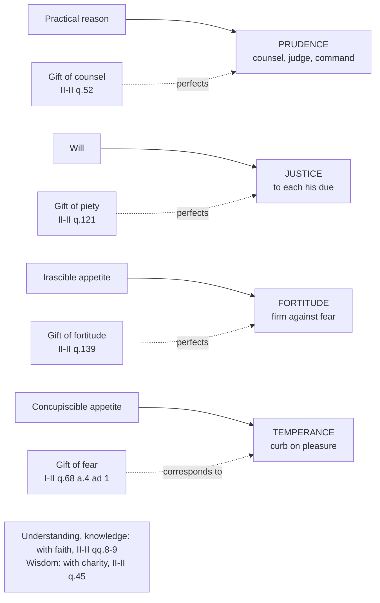

# Moral Theology · Lesson 3.3: The cardinal virtues and the gifts

> ⏱ ~15 min · Module 3: Virtue, gifts and sin · Builds on: [3.1 Virtue, acquired and infused](03-01-virtue-acquired-and-infused.md), [3.2 Faith, hope and charity](03-02-faith-hope-and-charity.md) · Unlocks: [3.4 Sin: mortal and venial](03-04-sin-mortal-and-venial.md), [4.1 Casuistry and the probabilism controversy](04-01-casuistry-and-the-probabilism-controversy.md)

## Why this matters

Charity orders a life to God ([3.2](03-02-faith-hope-and-charity.md)); it does not tell you what to say to a colleague lying to a client. That work belongs to four virtues the tradition calls *cardinal*, from *cardo*, a hinge, because the rest of the moral life turns on them. Aquinas then adds something Aristotle never imagined: even perfect virtue is not enough to reach a supernatural end, so the Spirit gives seven further dispositions, the **gifts**, which let a person be *moved* as well as move himself. This lesson gives you both, and the rule for telling them apart.

## The idea

Start from a thought already in [`ethics` 4.2](../../ethics/lessons/04-02-aristotle-virtue-and-practical-wisdom.md): a virtue puts reason's order into some part of us. Ask where that order has to go, and four answers fall out.

- Into **reason's own act** of deciding what to do here and now: **prudence**.
- Into **what we do to others**: **justice**.
- Into passions that **push** us past what reason allows, chiefly pleasure: **temperance**.
- Into passions that **pull us back** from what reason requires, chiefly fear: **fortitude**.

That is the whole map of the [cardinal virtues](../reference.md#the-cardinal-virtues). In the Christian, each exists twice, acquired and infused, and the infused one is measured by a divine rule rather than a merely human one ([infused virtue](../reference.md#infused-virtue), from [3.1](03-01-virtue-acquired-and-infused.md)).

Now the gifts. A picture that helps: virtues are like oars and the gifts like sails. With oars, the rower is the source of the motion, and skill makes the rowing good. A sail generates nothing; it makes the boat catchable by a wind it does not control. The gifts make the whole person readily movable by the Holy Spirit. They do not add new *kinds* of act. They add a new *mover*.

## Source

ST I-II q.61 a.2, "Whether there are four cardinal virtues?" (English Dominican Province):

> For the formal principle of the virtue of which we speak now is good as defined by reason; which good is considered in two ways. First, as existing in the very act of reason: and thus we have one principal virtue, called "Prudence." Secondly, according as the reason puts its order into something else; either into operations, and then we have "Justice"; or into passions, and then we need two virtues ... and this occurs in two ways. First, by the passions inciting to something against reason, and then the passions need a curb, which we call "Temperance." Secondly, by the passions withdrawing us from following the dictate of reason, e.g. through fear of danger or toil: and then man needs to be strengthened for that which reason dictates, lest he turn back; and to this end there is "Fortitude."

Read the structure. The number four is *derived*: one division (reason's good in itself or in something else), then a second (operations or passions), then a third (passions that incite or passions that withdraw). The article's next paragraph gets the same four a second way, from the four powers that are their subjects: reason, will, the concupiscible appetite and the irascible appetite. That double derivation is why Aquinas treats the list as fixed rather than conventional. Scripture already names the four together at Wisdom 8:7, which the Catechism cites (CCC 1805).

## The argument

1. **Why "cardinal".** The principal virtues are the ones that make the appetite right, not merely able: the moral virtues, plus prudence, the one intellectual virtue that is also moral (q.61 a.1). *In words:* a hinge virtue makes you good, not just skilled.
2. **[Prudence](../reference.md#prudence)** is "right reason applied to action" (II-II q.47 a.2, from Aristotle). Its acts are three: to take counsel, to judge, and to **command**. Command is the chief act, because it is nearest the deed (q.47 a.8). Its eight integral parts are listed at q.48 a.1 and treated one by one in q.49: memory, understanding, docility, shrewdness, reasoning, foresight, circumspection, caution. Each act has its failure: **precipitation** fails in counsel, **thoughtlessness** in judgment, **inconstancy** in command (q.53 a.5). The Catechism adds that prudence immediately guides the judgment of [conscience](../reference.md#conscience) (CCC 1806; see [2.4](02-04-conscience-its-nature-and-its-errors.md)). *In words:* the prudent person does not just see what to do. He sees it and does it.
3. **Justice** is the habit of rendering each his due with a constant and perpetual will (q.58 a.1). Its species are **commutative** justice (between individuals, on equality) and **distributive** justice (the community to its members, in proportion; q.61 a.1). Distributing by who someone *is* rather than by what makes the thing due to them is the vice of **respect of persons** (q.63 a.1). The [parts of justice](../reference.md#the-parts-of-justice) also include virtues that fall short of equality or of strict due (q.80): religion, piety toward parents and country, observance, truth, gratitude, vindication, liberality and friendliness. Their economic use belongs to [`catholic-social-teaching`](../../catholic-social-teaching/syllabus.md).
4. **Fortitude** is firmness against fear, above all fear of death (q.123 a.4). Its chief act is **endurance**, not attack, because standing under a present danger is harder than charging at a future one (q.123 a.6). Martyrdom is an act of fortitude (q.124 a.2).
5. **Temperance** moderates the strongest pleasures, those of food, drink and sex, which Aquinas calls pleasures of touch (q.141 a.4).
6. **The gifts are named from Isaiah.** Isaiah 11:2–3 (Douay–Rheims):

   > And the spirit of the Lord shall rest upon him: the spirit of wisdom, and of understanding, the spirit of counsel, and of fortitude, the spirit of knowledge, and of godliness. And he shall be filled with the spirit of the fear of the Lord.

   The Hebrew of 11:2 names six, ending with the fear of the Lord, and 11:3 repeats "fear". The Septuagint renders the first "fear" as *eusebeia*, piety. The Vulgate follows it, and so the Latin tradition counts seven. "Godliness" is the Douay's word for *pietas*.
7. **What a gift is** (I-II q.68 a.1, a.3). Every mover needs a subject proportioned to it. The moral virtues dispose the appetite to obey reason. The gifts dispose a person, in the same way, to obey the Holy Spirit readily. That makes them habits of docility (a.3). They are not higher kinds of work: they surpass the virtues "as regards the manner of working", in being moved by a higher principle (a.2 ad 1).
8. **Why they are necessary** (a.2). Reason possesses its natural light fully. It possesses the theological virtues only imperfectly, because we know and love God imperfectly, and what holds a power imperfectly must be moved by another, as a student by the physician. So in matters ordered to the supernatural end, the gifts are needed for salvation (a.2, citing Romans 8:14).
9. **Their order** (a.4, a.8). Four gifts perfect reason (understanding and wisdom the speculative, counsel and knowledge the practical). Three perfect the appetite: piety toward others, fortitude against fear, fear of God against disordered pleasure. The [gifts of the Holy Spirit](../reference.md#the-gifts-of-the-holy-spirit) rank below the theological virtues, which regulate them, and above the intellectual and moral virtues (a.8).
10. **Beatitudes and fruits are acts, not habits.** The Beatitudes differ from virtues and gifts "as act from habit" (q.69 a.1). The fruits are acts done under the Spirit's movement that end in delight (q.70 a.1). Galatians 5:22–23 lists nine in the Greek and twelve in the Vulgate, which the Douay follows. Aquinas himself cites Augustine that the Apostle was not teaching a count (q.70 a.3 ad 4). See [Beatitudes and fruits](../reference.md#beatitudes-and-fruits).

**Mark the levels.** That the moral life is built on the four cardinal virtues (CCC 1805–1809), that the justified receive the gifts of the Holy Spirit as permanent dispositions of docility, and that they are seven (CCC 1830–1831): these are **authentic ordinary magisterium**, taught in the Catechism on Scripture and constant tradition, and **none is defined**. Aquinas's account of *how* gifts differ from virtues (by mover and mode), of their necessity for salvation (a.2) and of their ranking (a.8) is **common teaching** in the Thomist tradition, not a magisterial act. The distinction itself was argued among the schools. Article 1 opens by reporting theologians who held the gifts indistinguishable from the virtues, and Scotus is commonly read as their later heir. The count of **twelve fruits** is a tradition following the Vulgate, which CCC 1832 reports as a tradition. No doctrine hangs on the number. See [the levels in moral theology](../reference.md#the-levels-in-moral-theology).

## Map of the virtues and the gifts

Solid arrows: reason moving the powers. Dashed arrows: the Spirit moving the same powers. Counsel perfects prudence, which is chiefly helped by being ruled by the divine reason (q.52 a.2). Piety renders worship to God *as Father* (q.121 a.1). The gift of fortitude infuses confidence of reaching eternal life, which no human firmness can guarantee (q.139 a.1). Fear withdraws from evil pleasures through fear of God, as temperance does for reason's good (q.68 a.4 ad 1).

## Worked examples

**Example 1: the tool on a clean case.** A teacher must mark the failing exam of the principal's daughter. She fears the principal's displeasure. Run the four. **Justice:** a grade is a distribution by merit, so marking the paper up because of whose child it is is **respect of persons** (q.63 a.1). **Fortitude:** fear is what pulls her away from the due grade, so the virtue at stake is firmness. **Temperance:** no pleasure is in play, and that is fine, since not every case engages every virtue. **Prudence:** suppose she investigates, judges that the fail stands, and then enters a pass anyway. Her counsel and judgment were sound. She failed in **command**, the chief act, and Aquinas calls that failure inconstancy (q.53 a.5). He also says it is *more* imprudent to sin knowingly than in ignorance (q.47 a.8). So the knowing coward lacks prudence, not only fortitude. That is the connection of the virtues from [3.1](03-01-virtue-acquired-and-infused.md) at work.

**Example 2: where the tool strains.** A hospice chaplain, with no time to deliberate, says one sentence to a frightened patient that proves exactly right. Was that the **gift of counsel**, or acquired **shrewdness**, which Aquinas defines as "a quick conjecture of the middle term" (q.48 a.1)? The theory cannot tell you from outside: gifts differ from virtues by *mover* and *manner*, not by the kind of work (q.68 a.2 ad 1). Two things still follow. First, the gifts are in everyone in grace (a.3 ad 1, with Gregory), so they are not rare charisms to be spotted by their effects. Second, "the Spirit prompted me" is never a license against reason: what is opposed to the gifts is opposed to reason too, because reason's light flows from God (a.1 ad 2). A prompting that bypasses counsel on a serious matter looks like precipitation, not docility.

## Watch out

- **You might think "cardinal" means "highest".** The theological virtues outrank the cardinal virtues, and so do the gifts (q.68 a.8). "Cardinal" names the hinges of the *moral* life.
- **You might think prudence is caution.** Caution is one of its eight parts. The Catechism explicitly warns against confusing prudence with timidity or duplicity (CCC 1806). A prudent command can be bold.
- **You might think the gifts are the charisms of 1 Corinthians 12.** Those are given to some for others; the seven gifts are in all the justified, for their own salvation (q.68 a.2–3).
- **Overstating the level:** "the Church has defined seven gifts and twelve fruits." Neither is defined. The seven gifts are taught at the authentic level. The twelve is a Vulgate-based tradition.
- **Understating it:** "the gifts are medieval decoration." The Catechism teaches them as permanent dispositions that complete the virtues (CCC 1830–1831). What is only common teaching is Aquinas's *theory* of how they work.

## One-liner

> The virtues make a person move well under reason; the gifts make him movable by the Spirit, and prudence is not finished until it commands.

## Problems

**P1 (🟢)** *(Exegetical)* A case written for the problem. A parish youth program learns that a volunteer driver has twice driven teenagers after drinking. Three staff members respond.
(a) **Dana** removes him the same hour by public announcement, without asking him or anyone else what happened.
(b) **Eli** investigates carefully and concludes the volunteer must stop driving. Then he does nothing, because the volunteer is the pastor's nephew.
(c) **Fran** removes him quietly and correctly. Then she tells every parent at the next meeting about his drinking, though no one needed to know more than that he was no longer driving.
For each, name the act of prudence that fails (counsel, judgment or command), or say that none does, and name any other cardinal virtue at fault. One or two sentences each.

**P2 (🟡)** *(Exegetical)* Four cases written for the problem. For each, name the gift of the Holy Spirit the case illustrates *on Aquinas's account* and the virtue that gift perfects or corresponds to. Then add one sentence on why the behaviour alone cannot prove it is a gift rather than a virtue.
(a) A man with a violent temper faces a painful death with a settled confidence that he will reach God, a confidence far beyond his temperament.
(b) A woman turns away from an affair she has long wanted. Her reason is not prudence about consequences but a reverent dread of offending God.
(c) A convert who used to pray out of duty finds herself worshipping God with the ease of a daughter speaking to her father.
(d) A pastor facing a decision no rule settles judges rightly by allowing himself to be guided rather than forcing a conclusion.

**P3 (🔴)** *(Exegetical)* ST I-II q.68 a.1, from the *respondeo* (English Dominican Province):

> Now it is evident that whatever is moved must be proportionate to its mover: and the perfection of the mobile as such, consists in a disposition whereby it is disposed to be well moved by its mover. Hence the more exalted the mover, the more perfect must be the disposition ... Now it is manifest that human virtues perfect man according as it is natural for him to be moved by his reason in his interior and exterior actions. Consequently man needs yet higher perfections, whereby to be disposed to be moved by God. These perfections are called gifts, not only because they are infused by God, but also because by them man is disposed to become amenable to the Divine inspiration ... This then is what some say, viz. that the gifts perfect man for acts which are higher than acts of virtue.

(a) State the general principle the argument runs on, and quote the words that carry it. (b) The passage says *two* things make the gifts "gifts". Name both and say which one distinguishes them from infused virtue. (c) Does the last sentence commit Aquinas to the view that gifts produce a higher *kind* of act? Use q.68 a.2 ad 1 as stated in the lesson. Two sentences per part.

Solutions

**P1** *(Exegetical)*

**Must hit, strict:** (a) Dana: **counsel** fails. She is rushed into action without memory, docility or reasoning, which is **precipitation** (q.53 a.3, a.5). Her verdict may well be right. The fault is how she reached it, and a public announcement also risks injustice to his name. (b) Eli: counsel and judgment are sound, and **command** fails. That is **inconstancy** (q.53 a.5), and Aquinas counts it as *more* imprudent than an honest mistake (q.47 a.8). **Fortitude** fails too, since fear of the fallout pulls him back. Credit also for **respect of persons**, because the nephew's standing, not the case, decides. (c) Fran: the removal passes counsel, judgment and command. The later disclosure fails in **justice** toward his good name, and in **circumspection**, attention to circumstances (q.48 a.1). Either framing earns credit if justice is named.

**Wrong turns:** calling Eli's fault a failure of judgment, when he judged rightly and did not act. Calling Dana prudent "because she protected the kids": prudence is about the *way* of reaching the act as well as its outcome.

**Model answer:** (a) Counsel fails by precipitation: she skipped the steps of inquiry, even if her conclusion was right. (b) Command fails by inconstancy, which is the chief failure of prudence, and fortitude fails because fear decided; favouring the pastor's nephew is also respect of persons. (c) Prudence was sound in the removal. The disclosure was an injustice to his reputation and a lapse in circumspection.

**P2** *(Exegetical)*

**Must hit, strict:** (a) the **gift of fortitude**, perfecting fortitude. Its mark is infused confidence of reaching eternal life (q.139 a.1). (b) the **gift of fear**, corresponding to **temperance**: it withdraws from evil pleasure through fear of God (q.68 a.4 ad 1). (c) the **gift of piety**, perfecting **justice** through its part, religion: worship rendered to God *as Father* (q.121 a.1). (d) the **gift of counsel**, perfecting **prudence** (q.52 a.2). **Final sentence:** gifts differ from virtues by *mover and manner*, not by the kind of work (q.68 a.2 ad 1), so the same outward act could come from either.

**Wrong turns:** (b) assigned to temperance simply. The case specifies fear of God, not reason's measure, as the motive. (c) assigned to charity: piety's mark is filial *worship*, which belongs to justice's family. Treating (a)'s change of temperament as a proof of the gift.

**Model answer:** (a) fortitude, perfecting fortitude; (b) fear, corresponding to temperance; (c) piety, perfecting justice (religion); (d) counsel, perfecting prudence. Because gifts differ from virtues by who moves and how, not by what is done, no outward act settles which one is at work.

**P3** *(Exegetical)*

**Must hit, strict (a):** the **proportion of mobile to mover**: "whatever is moved must be proportionate to its mover", sharpened by "the more exalted the mover, the more perfect must be the disposition". Virtues proportion us to reason as mover. A higher mover, God, requires a higher disposition.

**Must hit, strict (b):** they are gifts (i) because they are **infused by God** and (ii) because they dispose us to be **amenable to the Divine inspiration**. Only (ii) distinguishes them from **infused virtue**, which is also infused ([3.1](03-01-virtue-acquired-and-infused.md)). What marks a gift is the mover it is ready for.

**Must hit, strict (c):** **no.** Aquinas reports the view ("what some say") as a gloss on his own conclusion. Article 2 ad 1 says the gifts surpass the virtues in **manner of working**, being moved by a higher principle, not in kind of work. So "higher acts" means acts done in a higher way.

**Wrong turns:** answering (b) with "infused" alone, which erases the difference from infused virtue. Reading "what some say" as Aquinas distancing himself: it is his own conclusion restated, then qualified in a.2.

**Model answer:** (a) The principle is that the moved must be proportioned to its mover, and the higher the mover, the more perfect the disposition it needs. Virtues fit us to be moved by reason, so being moved by God needs something more. (b) They are gifts because God infuses them and because they make us amenable to his inspiration. The second marks them off from infused virtues, which are also infused. (c) No. Read with a.2 ad 1, the "higher acts" are higher in the manner of acting under a higher mover, not a different kind of deed.

## Flashback

**From Lesson [3.1](03-01-virtue-acquired-and-infused.md) (Virtue, acquired and infused):** *(Exegetical, reconstruct.)* ST I-II q.63 a.3, "Whether any moral virtues are in us by infusion?" (English Dominican Province). Objection 2 had argued that the theological virtues suffice to direct us to supernatural good, so God, whose works contain no superfluity, causes no other supernatural virtues in us.

> I answer that, Effects must needs be proportionate to their causes and principles. Now all virtues, intellectual and moral, that are acquired by our actions, arise from certain natural principles pre-existing in us ... instead of which natural principles, God bestows on us the theological virtues, whereby we are directed to a supernatural end ... Wherefore we need to receive from God other habits corresponding, in due proportion, to the theological virtues, which habits are to the theological virtues, what the moral and intellectual virtues are to the natural principles of virtue.
>
> *Reply to Objection 2.* The theological virtues direct us sufficiently to our supernatural end, inchoatively: i.e. to God Himself immediately. But the soul needs further to be perfected by infused virtues in regard to other things, yet in relation to God.

(a) Reconstruct the *respondeo* in numbered premises (P1, P2, … ∴ C), and write the proportion it turns on as "A is to B as C is to D". (b) Which word in Reply 2 concedes something to the objection, and what does the reply still deny? **Two sentences for (b).**

Solution

**Must hit, strict (a):** P1: effects must be proportionate to their causes and principles. P2: acquired virtues arise from natural principles already in us (the "seeds" of 3.1) and are proportioned to them. P3: in place of those natural principles, God gives the theological virtues, which direct us to a supernatural end. ∴ C: we need from God further habits, proportioned to the theological virtues. The proportion: **infused moral and intellectual virtues are to the theological virtues as acquired virtues are to the natural principles.**
**Must hit, strict (b):** **"inchoatively"**. The reply grants that the theological virtues direct us sufficiently to the end itself, to God immediately, as a beginning. It denies that they are enough for the rest of life. The soul must still be perfected "in regard to other things", ordered "in relation to God", and that is the work of the infused moral virtues.
**Wrong turns:** concluding that the infused virtues differ in species from the acquired. That is the next article, q.63 a.4, and a freely disputed Thomist thesis; this article only argues that infused moral virtues exist. Setting the proportion up as infused virtue to acquired virtue, which leaves out the two principles the argument actually compares. Reading (b) as a full concession that the objection is right.
**Model answer:** (a) P1: effects are proportioned to their principles. P2: acquired virtues grow from natural principles and are proportioned to them. P3: God gives the theological virtues in place of those principles, for a supernatural end. ∴ C: God must also give habits proportioned to the theological virtues. Infused moral virtues are to the theological virtues as acquired virtues are to the natural principles. (b) "Inchoatively" concedes that the theological virtues reach the end itself, God, at least as a beginning. The reply denies that this orders everything else in life to that end, which needs further infused virtues.

## Connections

- **Backward:** [3.1](03-01-virtue-acquired-and-infused.md) supplied acquired and infused virtue and their connection; this lesson fills in the four hinges and the gifts that complete them. [3.2](03-02-faith-hope-and-charity.md) is why the gifts rank below the theological virtues. Aristotle's *phronesis* is [`ethics` 4.2](../../ethics/lessons/04-02-aristotle-virtue-and-practical-wisdom.md), and the modern revival of virtue ethics is [`ethics` 4.3](../../ethics/lessons/04-03-modern-virtue-ethics.md).
- **Forward:** [3.4](03-04-sin-mortal-and-venial.md) treats sin as the contrary of these virtues. [4.1](04-01-casuistry-and-the-probabilism-controversy.md) asks what happened to prudence when the manuals made moral theology a science of cases. Truth as a part of justice (q.80) returns in [6.4](06-04-truthfulness-and-the-lie.md).
- **Sideways:** the Beatitudes as acts of the gifts connect with the Sermon on the Mount read as text in [`new-testament` 2.2](../../new-testament/lessons/02-02-matthew.md). Distributive and commutative justice are the doorway to [`catholic-social-teaching`](../../catholic-social-teaching/syllabus.md). See the course [syllabus](../syllabus.md).
