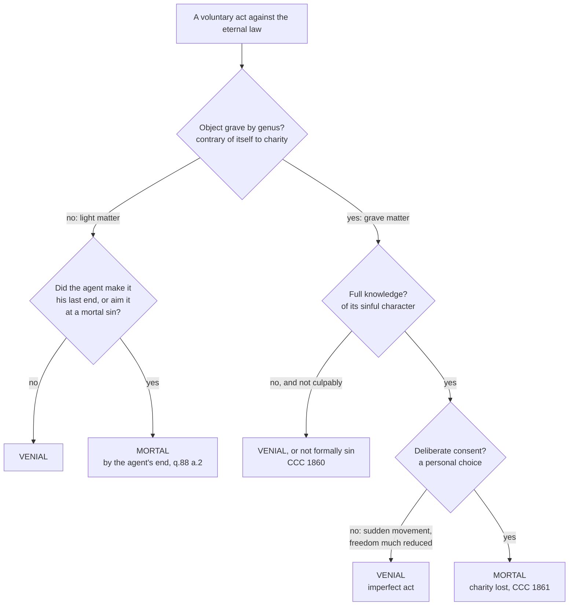

# Moral Theology · Lesson 3.4: Sin: mortal and venial

> ⏱ ~15 min · Module 3: Virtue, gifts and sin · Builds on: [3.2 Faith, hope and charity](03-02-faith-hope-and-charity.md), [2.1 The voluntary](02-01-the-voluntary.md), [2.4 Conscience](02-04-conscience-its-nature-and-its-errors.md) · Unlocks: [3.5 Social sin and cooperation](03-05-social-sin-and-cooperation-in-the-sins-of-others.md), [4.3 Proportionalism and the fundamental option](04-03-proportionalism-and-the-fundamental-option.md)

## Why this matters

Every Catholic has heard "mortal sin," and most have heard it used badly: as a synonym for "very bad act," or as a verdict on someone else's soul. The distinction is precise, and it answers one question: **does this act kill charity, or only wound it?** Get the answer wrong in one direction and you have scrupulosity; in the other, a Christianity where nothing you do can cost you anything. This lesson gives you the definition, the division, the three conditions, and one defined dogma, each marked at its own level.

## The idea

Think of a body. Some disorders are sickness: a fever, a sprain. The body is still alive, so its own life can repair them. One disorder is death, which leaves nothing inside to do the repairing. Aquinas uses exactly this picture.

The moral life has a vital principle too: the ordering of the whole person to God as last end, which in the Christian is carried by **charity**, the friendship with God that [3.2](03-02-faith-hope-and-charity.md) made the form of the virtues. A **venial** sin is a disorder *inside* that ordering: you still love God above all, but you love some lesser thing too much. A **mortal** sin is a disorder that *replaces* it: you prefer a creature to God in something that cannot coexist with loving him. The first is sickness, the second death.

Two consequences follow at once. "Mortal" is named for what the sin does *to the sinner*, not for what the act does to its victim, so blasphemy can be mortal and a killing need not be. And whether an act kills charity depends not only on *what* is done but on *how freely and knowingly* it is done, which is why "grave matter" and "mortal sin" are not synonyms.

## Source

First, what sin is. Augustine, *Against Faustus* XXII.27 (NPNF first series, vol. 4): sin is "any transgression in deed, or word, or desire, of the eternal law." Aquinas accepts the definition at ST I-II q.71 a.6, reading it as matter (the act: word, deed, desire) and form (the contrariety to God's own reason, the [eternal law](../reference.md#the-definition-of-sin)). He adds that the theologian considers sin "chiefly as an offense against God," the philosopher as something against reason (ad 5).

Now the division. ST I-II q.72 a.5 (English Dominican Province):

> Now the principle of the entire moral order is the last end ... Therefore when the soul is so disordered by sin as to turn away from its last end, viz. God, to Whom it is united by charity, there is mortal sin; but when it is disordered without turning away from God, there is venial sin. For even as in the body, the disorder of death which results from the destruction of the principle of life, is irreparable according to nature, while the disorder of sickness can be repaired by reason of the vital principle being preserved, so it is in matters concerning the soul.

Three moves. **The criterion** is relation to the last end, not size of harm. **The medium** is charity: that is what unites the soul to God, and so what a mortal sin breaks. **"Irreparable according to nature"** does not mean unforgivable. It means the sinner has no principle left *in himself* to repair it; repair must come from outside, from God. Earlier in the same article Aquinas says the mortal/venial difference is *consequent to* the species of sins rather than constituting it, so one species can contain both: in adultery, "the first movement is a venial sin" (ad 1).

## The argument

1. **Sin is a voluntary human act at odds with the eternal law** (Augustine; q.71 a.6). *In words:* no voluntariness, no sin; the measure is God's reason, reached through our own.
2. **The last end is the first principle of the moral order, and charity is what orders us to it** (q.72 a.5; [1.2](01-02-beatitude-the-last-end.md), [3.2](03-02-faith-hope-and-charity.md)).
3. **So sins divide by whether they destroy that ordering or disturb it within** (q.72 a.5). Mortal sin is aversion from God; venial sin is disorder about the means with the end intact.
4. **An object can settle the division "by genus."** When the will is set on something of itself contrary to charity, the sin is mortal by its object: against God (blasphemy, perjury) or neighbour (murder, adultery). When the object is disordered but compatible with charity (Aquinas's idle word, excessive laughter), the sin is venial by genus (q.88 a.2; quoted in CCC 1856).
5. **But the agent can change the verdict both ways** (q.88 a.2). A generically venial act becomes mortal if the agent makes it his last end or directs it to a mortal sin (the idle word spoken to seduce). A generically mortal act is venial "by reason of the act being imperfect," not deliberated by reason, as with a sudden movement. And the asymmetry: adding a venial deformity never makes a mortal sin venial (q.88 a.6).
6. **Hence the three conditions** (CCC 1857, quoting *Reconciliatio et Paenitentia* 17, 1984): a sin is mortal when its object is **grave matter** and it is committed with **full knowledge** and **deliberate consent**. *In words:* premise 4 is the first condition; premise 5's "imperfect act" is what the other two exclude. All three must be met *together*.
7. **Mortal sin loses sanctifying grace; venial sin does not** (CCC 1861, 1863). Trent, Session VI ch. 15 (Waterworth), against those who held that only unbelief forfeits justification: grace is lost "not only by infidelity ... but also by any other mortal sin whatever, though faith be not lost." Canon 27 anathematizes the contrary. How grace is regained, and what justification is, belong to [`creation-grace-last-things`](../../creation-grace-last-things/syllabus.md) and [`sacraments-and-liturgy`](../../sacraments-and-liturgy/syllabus.md); sin stops where the sacrament begins.

*Reconciliatio et Paenitentia* 17 adds two guards, paraphrased. The distinction is binary: some synod fathers proposed a third category, "grave but not mortal," and the pope allowed it could mark degrees among grave sins while insisting that between killing charity and not killing it there is no middle. And mortal sin is not to be reduced to an explicit, formal "fundamental option" against God: knowingly and freely choosing something gravely disordered is already the turn away ([fundamental option](../reference.md#fundamental-option); the theory at full strength is [4.3](04-03-proportionalism-and-the-fundamental-option.md)).

**Mark the levels.** That **grace is lost by any mortal sin, not only by unbelief**, and that faith can survive its loss, is **defined dogma** (Trent VI ch. 15, canons 27 and 28). So is canon 23: no one can avoid all sins, even venial ones, through a whole life without a special privilege. Trent thereby presupposes both kinds of sin. It does **not** define *what makes* a sin mortal. The **three conditions** are **authentic ordinary magisterium** (RP 17, taken into CCC 1857), restating what the manuals held as common teaching; no act proposes them as definitive, so default to rung 3. The **aversion-from-the-end analysis** and the grave/light sorting "by genus" are **common teaching**, adopted by RP 17 and CCC 1855–1856. A manual's **list of grave matters** is theologians' work, rung 4 at most, except where the Magisterium itself teaches an item's gravity. See [the levels in moral theology](../reference.md#the-levels-in-moral-theology) and [Trent on losing grace](../reference.md#trent-on-losing-grace).

## The rule

The tree judges acts, not persons: CCC 1861 says we may judge an act a grave offence but must entrust the judgment of persons to God.

## Worked examples

**Example 1 — the clean case: the idle word.** A man trades small talk with a colleague: gossip about office furniture. Light matter, no bad end: venial at most, the disorder of time half-wasted. Now the same small talk, spoken as the opening move of a planned seduction of a married woman. The words have not changed; the agent's end has. By q.88 a.2 the act now takes its character from the mortal sin it serves. Reverse it: a man commits adultery *in order to* have a pleasant chat afterwards. The added triviality does not lighten the adultery (q.88 a.6). Venial can be promoted; mortal cannot be demoted by addition.

**Example 2 — where the tool strains: the habit.** Consider an invented case. A dock foreman has for twenty years used the Lord's name in blasphemous curses whenever something goes wrong. For the last year he has been trying to break the habit: he prays each morning, apologises, and catches himself more often than not. Today a crate drops and the curse is out before he notices.

The matter is grave by genus: blasphemy is Aquinas's own example (q.88 a.2). Knowledge, in the sense of knowing blasphemy is wrong, he has. Consent is where it strains. This curse was not chosen; it was the habit firing. The usual manual answer: an act done without advertence is, in itself, not a mortal sin, but the habit is *voluntary in its cause* ([2.1](02-01-the-voluntary.md)) so long as he consents to it. Having retracted and fought it, he is not answerable for each lapse as if he chose it; had he shrugged the habit off as "just how I talk," the lapses would be imputed through that consent. CCC 1860 names passions, external pressures and pathological disorders among what diminishes the voluntary. The strain is that "deliberate consent" has become a question about the *history* of a will, not a single moment. The three conditions still decide the case, but only once you ask where the consent went.

## Watch out

- **You might think "grave matter" means "mortal sin."** Grave matter is one condition of three. The act can be gravely wrong in itself while the person, lacking knowledge or freedom, does not sin mortally. RP 17 notes that grave sin is *in practice* identified with mortal sin in the Church's language; the identification presupposes the other two conditions.
- **You might think the "seven deadly sins" are the seven mortal sins.** They are **capital** sins: sources that give rise to others (q.84 a.4, following Gregory's *Moralia*). Anger, gluttony and sloth are venial in countless instances. Aquinas's list has **vainglory**, with pride set above all seven as their "queen"; CCC 1866 lists **pride** with avarice, envy, wrath, lust, gluttony and sloth. Same tradition, two bookkeeping choices.
- **You might think 1 John 5:16–17 is the mortal/venial distinction in so many words.** CCC 1854 cites it with "cf." as showing the distinction is "already evident in Scripture"; RP 17 reads John's "sin unto death" chiefly as apostasy and idolatry. The Challoner note in the Douay–Rheims itself says the difference "can not be the same" as venial and mortal.
- **Understating the level.** "Losing grace by a mortal sin is just a medieval opinion" is false: Trent defined it (canon 27). **Overstating it** is the mirror error: calling the three conditions or a manual's grave-matter list "defined by Trent." Trent defined *that* mortal sin loses grace, not *which* acts are mortal.

## One-liner

> Venial sin sickens charity, mortal sin kills it; the three conditions test for death, and Trent defines only that death is real.

## Problems

**P1 (🟢)** *(Exegetical)* Assign each claim its level on the [ladder](../../fundamental-theology/lessons/04-04-the-ladder-of-doctrinal-authority.md) and **name the act that fixes it**, or say that none does. **Two sentences per claim.**
(a) The grace of justification is lost not only by unbelief but by any mortal sin.
(b) For a sin to be mortal, its object must be grave matter and it must be committed with full knowledge and deliberate consent.
(c) *An invented manual passage:* "Theft is grave matter when the sum taken equals roughly a day's wage of the person robbed; below that it is light matter."

**P2 (🟡)** *(Exegetical)* An **invented** homily, written for this problem:

> "Let's be grown-ups about 'mortal sin.' Mortal means deadly: murder, violence, the things that destroy a life. Lying under oath or cursing God doesn't kill anybody, so those are venial. And don't lose sleep over any single act. As long as your basic orientation is toward God, one choice can't cost you grace."

(a) Name the misunderstanding of "mortal" in the first half, and correct it from q.72 a.5 and q.88 a.2. (b) Which magisterial act directly rejects the claim in the last sentence, at what level, and what does it say instead? **150 words total.**

**P3 (🔴)** *(Exegetical)* 1 John 5:16–17 (Douay–Rheims):

> He that knoweth his brother to sin a sin which is not to death, let him ask: and life shall be given to him who sinneth not to death. There is a sin unto death. For that I say not that any man ask. All iniquity is sin. And there is a sin unto death.

(a) Which words in verse 16 make it hard to equate "a sin which is not to death" with venial sin in the sense of q.72 a.5? (b) The Greek of verse 17 reads *ou pros thanaton*, "not unto death"; the Douay–Rheims follows the Clementine Vulgate, which lacks the negative. What does verse 17 say on the Greek reading, and does the variant change what the passage teaches about kinds of sin? (c) Given (a), in what sense can CCC 1854 still cite the passage? **Two sentences per part.**

Solutions

**P1** *(Exegetical)*

**Must hit, strict:** (a) **Defined dogma.** Trent, Session VI ch. 15 and **canon 27** (1547), an ecumenical council's anathema against the view that there is no mortal sin but unbelief, or that grace is lost by no other sin. (b) **Authentic ordinary magisterium, rung 3.** The act is John Paul II's *Reconciliatio et Paenitentia* 17 (1984), an apostolic exhortation, quoted in CCC 1857; no act proposes the formula as definitive, so default down, and Trent did not define it. (c) **No magisterial act: rung 4 at most.** It is a theologians' specification of how much is "grave" in theft; that theft can be grave matter is taught (CCC 1858), but the threshold is the manualists' own.

**Wrong turns:** assigning (b) to Trent because Trent speaks of mortal sin; Trent presupposes mortal sin and defines its effect, not its conditions. Calling (b) "just a catechism statement" with no binding force; rung 3 requires religious submission. Promoting (c) because manuals once taught it everywhere.

**P2** *(Exegetical)*

**Must hit, strict (a):** the homily takes "mortal" as **deadly to the victim**. In q.72 a.5 it names what the sin does **to the sinner**: it destroys charity, the soul's ordering to its last end. Hence q.88 a.2 counts **sins against God, blasphemy and perjury,** as mortal by genus alongside murder and adultery; the homily's two "venial" examples are its grave matter.

**Must hit, strict (b):** ***Reconciliatio et Paenitentia* 17** (1984), **rung 3**. It rejects reducing mortal sin to an explicit "fundamental option" against God: knowingly and freely choosing something gravely disordered is itself turning from God, and the fundamental orientation can be radically changed by individual acts. Credit for adding Trent can. 27 (defined) as background: grace is lost by *any* mortal sin, and Trent names particular acts.

**Wrong turns:** claiming Trent condemned the fundamental option by name; it targeted the view that only unbelief loses grace. Answering (a) only with "lying under oath is serious" without the reason: charity toward God is what these acts destroy.

**Model answer:** (a) The homily reads "mortal" as lethal to others, but Aquinas means lethal to the sinner: a sin is mortal when it turns the soul from God, its end, and destroys charity. So q.88 a.2 counts blasphemy and perjury, sins against the love of God, as mortal by their object, just like murder. (b) *Reconciliatio et Paenitentia* 17, authentic ordinary magisterium, rejects reducing mortal sin to a formal fundamental option. A free, knowing choice of something gravely disordered already turns a person from God, and single acts can change the fundamental orientation.

**P3** *(Exegetical)*

**Must hit, strict (a):** **"life shall be given to him who sinneth not to death."** If life must be *given*, the sinner had lost it, which is what a mortal sin does, and venial sin does not take the life of grace away. That is the Challoner note's own reason for saying the two pairs "can not be the same."

**Must hit, strict (b):** on the Greek, verse 17 reads "all iniquity is sin, and there is sin **not** unto death": every wrong is truly sin, *and* not every sin is the deadly kind. The variant repeats the "unto death" half instead but changes no doctrine: verse 16 already names both kinds, and both readings teach two kinds of sin.

**Must hit, strict (c):** as evidence that **Scripture distinguishes sins by their relation to death**, with some sin leading to death and some not. The technical categories come later, from Augustine and Aquinas; CCC's "cf." signals support, not identity, and RP 17 reads "unto death" chiefly as apostasy and idolatry.

**Wrong turns:** reading "For that I say not that any man ask" as saying the sin unto death cannot be forgiven; John declines to *command* prayer for it. Treating the Latin variant as a doctrinal conflict.

## Flashback

**From Lesson [3.2](03-02-faith-hope-and-charity.md) (Faith, hope and charity):** *(Exegetical.)* A case written for the problem. On Friday Lukas, a practising Catholic, commits a sin of grave matter with full knowledge and deliberate consent; stipulate that it is mortal and that he has not yet repented. On Saturday he (i) recites the Creed at Mass, believing every article, and (ii) spends the afternoon at a soup kitchen because the hungry deserve to be fed. His roommate tells him: "You're in mortal sin, so your faith is gone too, and everything you do until you repent is just another sin." (a) What is the state of Lukas's faith, and what act fixes the level of that answer? (b) What is the moral status of his soup-kitchen work under q.23 a.7, and what does it lack? (c) Correct the roommate's second claim in one sentence. **Two sentences per part.**

Solution

**Must hit, strict:** (a) His faith **remains true faith**, but **lifeless** (unformed), no longer a virtue simply, because charity no longer quickens it (q.4 a.5). That grace can be lost without faith being lost, and that the faith which remains is true faith, is **defined, rung 1**, by **Trent Session VI canon 28**. (b) Feeding the hungry for their own sake is ordered to a **true particular good**, so by q.23 a.7 it is **true virtue, but imperfect**. It lacks the **order to the last end** that only charity gives, so it is not meritorious. (c) Acts done without charity are not all sins: an act ordered to a true good is genuinely good, though imperfect (a.7). Only an act ordered to a merely apparent good is counterfeit virtue.

**Wrong turns:** saying his faith is "dead, so not really faith", which is exactly what canon 28 anathematizes. Citing only the Catechism for (a), when Trent is the defining act. Calling the soup-kitchen work meritorious because it is charitable in the everyday sense; charity here is the theological virtue, and he has lost it. Classing the work as counterfeit virtue, which is the case of an apparent good, like Ana's donor-wall gift in 3.2. Agreeing with the roommate on the ground that Augustine called pagan virtues "splendid vices", a tag 3.2 shows is not in the text.

**Model answer:** (a) Lukas still believes with true faith, though it is now lifeless, unformed by charity and not a virtue simply (q.4 a.5). Trent Session VI canon 28 defines that faith is not always lost with grace and that the faith that remains is true faith, which puts it at rung 1. (b) His work serves a true particular good, so it is true but imperfect virtue (q.23 a.7). It lacks charity's ordering to God as last end, and so it merits nothing. (c) Without charity an act aimed at a true good is still good, only imperfect; the roommate has turned Aquinas's middle category into sin.

## Connections

- **Backward:** [3.2](03-02-faith-hope-and-charity.md) made charity the form of the virtues; this lesson is its negative, the sin that removes that form. [2.1](02-01-the-voluntary.md) supplied the voluntary and "voluntary in cause"; [2.4](02-04-conscience-its-nature-and-its-errors.md) supplied [invincible ignorance](../reference.md#invincible-ignorance), which is what defeats "full knowledge." [`patristics` 4.5](../../patristics/lessons/04-05-augustine-against-the-pelagians.md) is the background to Trent canon 23: no one lives without daily sins.
- **Forward:** [3.5](03-05-social-sin-and-cooperation-in-the-sins-of-others.md) asks in what analogical sense sin is "social," starting from RP 16's insistence that sin is always personal. [4.3](04-03-proportionalism-and-the-fundamental-option.md) states the fundamental-option theory at its best, and [4.4](04-04-veritatis-splendor.md) weighs it. Penance, confession and the recovery of grace belong to [`sacraments-and-liturgy`](../../sacraments-and-liturgy/syllabus.md).
- **Sideways:** the capital sins are a map of disordered ends, set against the virtues of [3.3](03-03-the-cardinal-virtues-and-the-gifts.md); [`thomistic-synthesis` 5.4](../../thomistic-synthesis/lessons/05-04-a-map-of-the-second-and-third-parts.md) shows where II-II treats each vice beside its virtue. The [mortal and venial sin](../reference.md#mortal-and-venial-sin) card entry holds the three conditions and the rule. See the course [syllabus](../syllabus.md).
