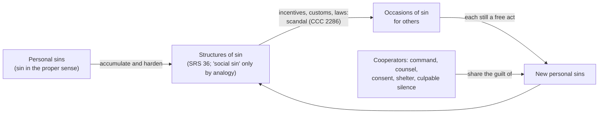

# Moral Theology · Lesson 3.5: Social sin and cooperation in the sins of others

> ⏱ ~15 min · Module 3: Virtue, gifts and sin · Builds on: [3.4 Sin: mortal and venial](03-04-sin-mortal-and-venial.md), [2.1 The voluntary](02-01-the-voluntary.md) · Unlocks: [4.2 Double effect and cooperation as Catholic method](04-02-double-effect-and-cooperation-as-catholic-method.md)

## Why this matters

[3.4](03-04-sin-mortal-and-venial.md) treated sin as one person's act against the last end. Yet most evil is done in company. Someone gives the order and someone carries it out. Someone praises it, someone looks away, and a system makes it routine. Two opposite errors wait here. The first says, "I only helped, so the sin is his." The second says, "The system did it, so nobody sinned." The tradition blocks both with one claim: **sin is always personal, and persons can share in one another's sins**. This lesson gives the three senses of "social sin", the ways of sharing another's sin, and scandal.

## The idea

Think of a bank robbery. Only one man cracks the safe. But someone planned it, someone drove the car, and someone hid the gang afterwards. A guard was paid to watch and chose not to. Nobody thinks the safecracker alone is guilty. Nobody thinks "the robbery" is guilty either. A robbery is not an agent; the people in it are.

That is the whole structure. **Guilt attaches only to free acts of persons** ([2.1](02-01-the-voluntary.md)). But one person's free act can be a *cause* of another's sin: by moving him to it, helping him, or failing to stop him when bound to. And many such acts can harden into customs, incentives and institutions, which then make the next person's sin easier. The Church calls these hardened results **structures of sin** and, by analogy only, **social sin**.

## Source

Aquinas asks whether people who did not take the stolen goods are bound to restore them. His answer is the tradition's first systematic list of ways to share another's sin (ST II-II q.62 a.7, English Dominican Province):

> Directly, when a man induces another to take, and this in three ways. First, on the part of the taking, by moving a man to take, either by express command, counsel, or consent, or by praising a man for his courage in thieving. Secondly, on the part of the taker, by giving him shelter or any other kind of assistance. Thirdly, on the part of the thing taken, by taking part in the theft or robbery, as a fellow evil-doer. Indirectly, when a man does not prevent another from evil-doing (provided he be able and bound to prevent him) …

He then compresses it into a memory verse: **command, counsel, consent, flattery, receiving, participation, silence, not preventing, not denouncing.**

Read it closely. **"Directly"** and **"indirectly"** divide causing a sin by acting from causing it by omission. **"Provided he be able and bound"** is the hinge of the indirect ways. Silence is a share in theft only for someone with a duty to speak. Most bystanders are neither guards nor judges. The article is about *restitution*, but the reply to the first objection generalizes it: anyone who causes the sin in any way shares in it. His scriptural warrant is Romans 1:32, which counts those who consent to evildoers along with the doers.

## The argument

**A. Sin is personal.**

1. Sin in the proper sense is a free act of a person ([3.4](03-04-sin-mortal-and-venial.md); CCC 1868 opens by calling sin a personal act).
2. Groups, situations and institutions do not have wills of their own. *Reconciliatio et Paenitentia* 16 (John Paul II, 1984, a post-synodal apostolic exhortation) says so directly. A situation, institution or structure is not the subject of moral acts, so it is not in itself good or bad (paraphrased).
3. So responsibility cannot be shifted onto structures, systems or other people. Doing so would deny the freedom and dignity of the person, which RP 16 calls a truth of faith. External and internal pressures can *reduce* freedom and so guilt. They cannot remove the person as the subject of the act. *In words:* circumstances can reduce your guilt, but they cannot take it over.
4. Ezekiel 18:20 (Douay–Rheims) states it: "the son shall not bear the iniquity of the father." Guilt is not inherited or pooled.

**B. The three senses of "social sin" (RP 16, paraphrased).**

5. **First sense: every sin is social.** Human solidarity is real. Just as holiness raises the whole communion of saints, sin drags down the Church and the world. No sin, however secret, concerns only the sinner.
6. **Second sense: sins against the neighbour.** Some sins directly attack another person. Examples are sins against justice, life, freedom, reputation and the common good, and leaders' failures to work for society's good. These are *social* by their **matter**. They are fully personal sins, and "social" names their object.
7. **Third sense: relations between communities.** Class struggle and obstinate confrontation between blocs or nations become vast, anonymous phenomena whose causes are hard to pin on anyone. Here "social sin" is used, RP 16 says, **analogically**. It calls every conscience to take up its share of responsibility.
8. **Rejected sense.** A usage common in some quarters sets social sin *against* personal sin. It blames a vague collectivity (the situation, the system, society) and so all but abolishes personal sin. RP 16 calls this not legitimate. What the Church condemns as social sin is always the accumulation of many personal sins: of those who cause or exploit evil, and of those who could limit it but hold back from fear, laziness or complicit silence.

**C. Structures of sin.**

9. *Sollicitudo Rei Socialis* 36 (John Paul II, encyclical, 1987) introduces **"structures of sin"**. They are rooted in personal sin and linked to the concrete acts of those who build and reinforce them. They then grow and become sources of further sins. CCC 1869 condenses this. Structures of sin express and result from personal sins. They lead their victims to do evil in turn, and they are "social sin" only in an analogous sense. [Structures of sin](../reference.md#structures-of-sin) is a category of sin. SRS applies it to development, blocs and the economy, and that application is ceded to [`catholic-social-teaching`](../../catholic-social-teaching/syllabus.md).

**D. How one shares another's sin.**

10. CCC 1868 gives four ways of [cooperating in another's sin](../reference.md#cooperation-in-the-sins-of-others), summarized in the table below. Each tracks Aquinas's verse.
11. **Scandal** is its own sin. Aquinas defines it as "something less rightly done or said, that occasions another's spiritual downfall" (q.43 a.1). CCC 2284–2287 adds that scandal is grave if it deliberately leads another into grave sin. Office aggravates it, and so does the weakness of the one led astray. It can also be given by laws, institutions, fashion and opinion (CCC 2286). This is where structures of sin and [scandal](../reference.md#scandal) meet.

**Mark the levels.** That sin in the proper sense is a personal act is **authentic ordinary magisterium** (RP 16; CCC 1868) restating constant teaching. The freedom it rests on is **defined**: Trent, Session VI, canon 5 anathematizes the claim that free will was lost after Adam. RP 16's three senses, its rejection of the collectivist usage, and SRS 36's "structures of sin" are **authentic ordinary magisterium**. RP 16 is an exhortation and SRS 36 an encyclical. Both are rung 3 on the [ladder](../reference.md#the-levels-in-moral-theology), and neither is a definition. That one who commands, counsels or shelters shares the guilt is **common teaching** grounded in Scripture (Rom 1:32). The *wording* of CCC 1868's list is a catechetical summary; like any Catechism paragraph, it carries only the weight of what it summarizes. Aquinas's nine-item verse is a teaching device with no magisterial weight at all.

## The map

| CCC 1868 | Aquinas's verse (q.62 a.7) | Duty needed? |
|---|---|---|
| participating directly and voluntarily | participation | no |
| ordering, advising, praising, approving | command, counsel, flattery, consent | no |
| not disclosing or not hindering, when obliged | silence, not preventing, not denouncing | **yes** |
| protecting evil-doers | receiving (shelter, assistance) | no |

The loop runs *through* persons at every turn. No arrow goes from a structure straight to guilt.

## Worked examples

**Example 1: a clean case.** A regional manager tells a clerk to backdate invoices so a quarter looks better. A colleague congratulates the clerk on "working the system". The internal auditor, paid to catch exactly this, notices and says nothing. A friend of the clerk hears about it over dinner and also says nothing.

- **Manager:** *ordering* (command). He is the chief mover. Aquinas makes the commander first in line for restitution (ad 2).
- **Clerk:** the principal agent. Pressure from a superior may reduce his freedom somewhat ([2.1](02-01-the-voluntary.md)). It does not make the act someone else's.
- **Colleague:** *praising* (flattery). He shares the guilt to the extent that the praise actually moves the clerk. Aquinas binds counsellors and flatterers to restitution only when their influence probably caused the wrong.
- **Auditor:** *not disclosing when obliged*. His office creates the duty.
- **Friend:** no office, so this is not culpable silence in 1868's sense. Charity may still call for a private word, but that is a different question from sharing the guilt.

**Example 2: where it strains.** A new hire joins a firm where kickbacks are routine. A generation of managers built the practice. Sales targets assume it, and refusing costs a career. Run the theory. The structure is real, and its builders are guilty of scandal: they used their power to lead others to wrong (CCC 2287). The pressure is real too, and RP 16 allows that it may reduce the new hire's guilt. But when he pays the kickback, the act is his (RP 16: nothing is so personal and untransferable as responsibility for sin).

The strain comes with the staff who never pay a bribe themselves. The accountant books the payments. IT maintains the ledger. Is each of them "participating directly and voluntarily"? 1868's categories name the kinds of contribution. They do not say how *close* a contribution must be to count, or when fear of losing one's job excuses it. Those questions need the distinctions between formal and material, and proximate and remote, [cooperation](../reference.md#formal-and-material-cooperation). That is [4.2](04-02-double-effect-and-cooperation-as-catholic-method.md)'s job.

## Watch out

- **"Social sin is not really a Catholic idea."** This understates. It is in a papal exhortation, an encyclical and the Catechism, at rung 3. What RP 16 rejects is one *usage*: the one that dissolves personal sin into the system.
- **"The Church has defined that social sin is only analogical."** This overstates. No definition exists. The teaching is authentic ordinary magisterium. Only the freedom underneath it is defined (Trent VI, can. 5).
- **All three senses are not analogical.** In the second sense, a sin against the neighbour is a *real* personal sin, called social for its matter. "Analogical" belongs to the third sense and to structures of sin.
- **Original sin is not a counterexample.** CCC 404 calls it sin only analogically: "contracted" and not "committed", a state and not an act. Its transmission is defined (Trent, Session V), and the doctrine is ceded to [`creation-grace-last-things`](../../creation-grace-last-things/syllabus.md). It is not a model for collective guilt.
- **Not every silence is complicity.** The omission ways need a *duty* and an *ability* to act. Without them there is no share in the guilt.
- **Scandal is not the same as causing offence.** Aquinas separates active scandal (my disordered act occasions your fall) from passive scandal (you fall). Where I act rightly and you fall through malice, the scandal is yours alone (q.43 a.1 ad 4).

## One-liner

> Only persons sin, but persons can share one another's sins, and structures are just many shared sins frozen in place: real enough to name, never real enough to blame instead of us.

## Problems

**P1 (🟢)** *(Exegetical)* Classify each person by CCC 1868's four ways and by the item in Aquinas's verse, or say that they do not share the sin and why. **One line each.**

(a) A town councillor votes for a contract he knows was won by bribery, because the briber is his cousin.
(b) A landlord lets a room to a man he knows is hiding from arrest for assault, and keeps quiet when police ask the neighbourhood.
(c) A student who knows a classmate cheated on an exam tells no one.
(d) A professor who proctored the exam saw the cheating and filed no report.
(e) A podcaster tells listeners that skimming from one's employer is "just taking back your wages", and a listener does it.

**P2 (🟡)** *(Exegetical (a) · Exegetical (b))* 1 Corinthians 8:9–13 (Douay–Rheims):

> 9 But take heed lest perhaps this your liberty become a stumblingblock to the weak. 10 For if a man see him that hath knowledge sit at meat in the idol's temple, shall not his conscience, being weak, be emboldened to eat those things which are sacrificed to idols? 11 And through thy knowledge shall the weak brother perish, for whom Christ hath died? 12 Now when you sin thus against the brethren and wound their weak conscience, you sin against Christ. 13 Wherefore, if meat scandalize my brother, I will never eat flesh, lest I should scandalize my brother.

(a) The act in verse 10 is not sinful in itself. What makes it scandal, and which words carry that? Give Aquinas's reading (q.43 a.1 ad 2). **Two sentences.**
(b) An invented case: Tom has a legitimate dispensation from Friday abstinence during Lent, for a medical reason. He eats a burger at the parish fish fry in front of the confirmation class he teaches. Afterwards, (i) two students, who know nothing of the dispensation, decide the rule must not matter, and (ii) a parishioner who knows about the dispensation denounces Tom anyway, to discredit him. Classify each kind of scandal using q.43 a.7–8, and say what Tom should have done. **80 words or fewer.**

**P3 (🔴)** *(Exegetical)* An **invented** parish study-guide paragraph, not the words of any real person:

> "The Church has infallibly defined that there is no such thing as social sin; sin is only ever individual. 'Structures of sin' was a passing phrase in one encyclical and binds no one. And since every sin is social, anyone who buys a product made anywhere along an unjust supply chain commits a mortal sin of cooperation."

Name **three** errors. For each, give the correct claim with its level and the text that fixes it. **150 words or fewer.**

Solutions

**P1** *(Exegetical)*

**Must hit, strict:**
- (a) **Approving** (consent). His vote is also direct **participation** in the unjust award. He shares the sin.
- (b) **Protecting evil-doers** (receiving). He shares the sin. He has no official duty to denounce, so "not denouncing" is not the ground. Shelter is.
- (c) **Does not share the sin** in 1868's sense. A fellow student has no office-based duty to disclose. At most, charity may ask for a word with the classmate.
- (d) **Not disclosing when obliged** (silence / not denouncing). The proctor's office creates the duty.
- (e) **Advising** (counsel). The podcaster shares the sin if the counsel actually moved the listener (Aquinas: counsellors are bound when the wrong probably resulted from the counsel). The public reach also makes it **scandal** (CCC 2286, opinion).

**Wrong turns:** convicting (c) of culpable silence, which misses "when we have an obligation". Letting (d) off because "he didn't cheat". Treating (e) as free speech with no share in the act.

**Model answer:** as above, one line each.

**P2** *(Exegetical (a) · Exegetical (b))*

**Must hit, strict (a):** it is scandal because of its **appearance of evil** and its effect on the **weak conscience**. The words that carry it are "stumblingblock to the weak", "being weak, be emboldened" and "wound their weak conscience". Aquinas: sitting at meat in the idol's temple is not sinful in itself if done without evil intention. But it has an appearance of idol worship, so it is "less rightly done" and can occasion another's fall (ad 2, citing 1 Thes 5:22).

**Must hit, strict (b):** (i) **scandal of the little ones**, from weakness and ignorance. The eating looks like a breach, so it can be active scandal even though it breaks no law. (ii) **Pharisaical scandal**, from malice, which is to be disregarded (a.7, Mt 15:14; a.8: no temporal good is to be given up for it). For the little ones, Tom should either have **forgone** the burger there, or **abated the scandal by explanation** (a.8, "some kind of admonition"). If a scandal persisted after explanation, it would count as malice (a.7).

**Wrong turns:** saying Tom sinned by breaking abstinence (he was dispensed). Saying he must renounce the dispensation for all of Lent: a.8 asks him to forgo it where it scandalizes, or to explain. Treating (ii) as a reason to change what he does.

**Model answer (b):** (i) is scandal of the little ones: the act looks like a breach to students who don't know better. (ii) is Pharisaical scandal, taken from malice, and Tom may ignore it. He should have eaten elsewhere, or explained the dispensation first. After an explanation, any continuing scandal comes from malice.

**P3** *(Exegetical)*

**Must hit, strict (three):**
- **"Infallibly defined … no such thing as social sin."** Wrong in content and in level. RP 16 and CCC 1869 *affirm* social sin in three senses, one of them analogical. They reject only the usage that dissolves personal sin. This is authentic ordinary magisterium, and no definition exists either way.
- **"A passing phrase … binds no one."** This understates. "Structures of sin" is SRS 36 (encyclical, 1987), building on RP 16 and taken up in CCC 1869. It is rung 3 and requires religious submission.
- **"Mortal sin of cooperation" for any purchase.** It jumps from the first sense (every sin affects others) to a personal share in guilt. It skips 1868's ways, and it skips the three conditions for mortal sin in [3.4](03-04-sin-mortal-and-venial.md). How far remote material cooperation goes is [4.2](04-02-double-effect-and-cooperation-as-catholic-method.md)'s question.

**Wrong turns:** only fixing the first sentence's content and leaving its level alone. Answering the supply-chain question as economics, which is ceded to `catholic-social-teaching`.

**Model answer:** The Church affirms social sin (RP 16, CCC 1869), with its third sense and structures of sin as analogical. It rejects only the usage that makes personal sin vanish. All of this is authentic ordinary magisterium, not a definition. "Structures of sin" is not a stray phrase. It comes from an encyclical (SRS 36) and the Catechism, rung 3, owed religious submission. And "every sin is social" in RP's first sense does not make every buyer a cooperator. Sharing guilt requires one of 1868's ways, and a mortal sin needs grave matter, full knowledge and consent.

## Flashback

**From Lesson [3.3](03-03-the-cardinal-virtues-and-the-gifts.md) (The cardinal virtues and the gifts):** *(Exegetical, close reading.)* ST II-II q.123 a.6, "Whether endurance is the chief act of fortitude?", Reply to Objection 1 (English Dominican Province). The objection had argued that attacking is harder than enduring.

> Endurance is more difficult than aggression, for three reasons. First, because endurance seemingly implies that one is being attacked by a stronger person, whereas aggression denotes that one is attacking as though one were the stronger party; and it is more difficult to contend with a stronger than with a weaker. Secondly, because he that endures already feels the presence of danger, whereas the aggressor looks upon danger as something to come; and it is more difficult to be unmoved by the present than by the future. Thirdly, because endurance implies length of time, whereas aggression is consistent with sudden movements; and it is more difficult to remain unmoved for a long time, than to be moved suddenly to something arduous. Hence the Philosopher says (Ethic. iii, 8) that "some hurry to meet danger, yet fly when the danger is present; this is not the behavior of a brave man."

A case written for the problem. In a cholera outbreak, Ines volunteers for the isolation ward on the first night, loudly and eagerly, and asks to be moved after four days, once patients start dying around her. Jonah signs up slowly and reluctantly, then stays on the ward for three months. (a) Name the three reasons in a phrase each. (b) Whose conduct shows the chief act of fortitude? Which of the three reasons best explain Ines's failure, and which words of the passage describe her? (c) Does the passage imply that attacking a danger is never an act of fortitude? **Two sentences per part.**

Solution

**Must hit, strict (a):** (1) the one who endures faces a **stronger** opponent; (2) he feels the danger as **present**, while the aggressor sees it as future; (3) endurance takes **length of time**, while aggression can be a sudden movement.
**Must hit, strict (b):** **Jonah**: endurance, standing unmoved under a present danger for a long time, is the chief act (q.123 a.6). Ines fails on the **second** and **third** reasons: she was brave while the danger was still to come and briefly, and gave way when it was present and prolonged. The words are Aristotle's: "some hurry to meet danger, yet fly when the danger is present; this is not the behavior of a brave man."
**Must hit, strict (c):** **No.** The passage ranks the acts, claiming only that endurance is *more difficult* and so the chief act. Aggression still belongs to fortitude; the article's body assigns it to fortitude as the virtue that moderates daring.
**Wrong turns:** crediting Ines because she volunteered first, which confuses eagerness with firmness. Crediting Jonah's reluctance as the virtue. His reluctance counts for nothing; what counts is that he stayed. Reading "chief act" as "only act".
**Model answer:** (a) The one who endures faces a stronger foe, feels the danger as present rather than coming, and must hold for a long time rather than move once. (b) Jonah shows endurance, the chief act. Ines fits the second and third reasons: she met the danger while it was future and brief, and fled once it was present, like those who "hurry to meet danger, yet fly when the danger is present." (c) No. Endurance is ranked first because it is harder, but attack remains an act of fortitude.

## Connections

- **Backward:** [2.1](02-01-the-voluntary.md) supplies the voluntary and the factors that reduce imputability, which RP 16 invokes. [3.4](03-04-sin-mortal-and-venial.md) supplies the three conditions any shared sin must still meet to be mortal. [`fundamental-theology` 4.5](../../fundamental-theology/lessons/04-05-reading-a-documents-weight.md) explains why an exhortation and a Catechism paragraph carry the weight they carry.
- **Forward:** [4.2](04-02-double-effect-and-cooperation-as-catholic-method.md) turns 1868's ways into the formal/material and proximate/remote apparatus. [`catholic-social-teaching`](../../catholic-social-teaching/syllabus.md) applies structures of sin to the economy, development and the state. [`sacraments-and-liturgy`](../../sacraments-and-liturgy/syllabus.md) takes the sacrament of penance, where shared sins are confessed.
- **Sideways:** CCC 1868's list resembles the secular law of complicity (accessories before and after the fact), though the moral list also counts praise and culpable silence, which criminal law usually does not reach. The usage RP 16 rejects, blame placed on "the system", echoes structural social theories such as historical materialism ([`social-theory`](../../social-theory/syllabus.md) 2.1). RP 16 names the crux, whether structures are subjects of moral acts, and answers no. The card: [mortal and venial sin](../reference.md#mortal-and-venial-sin), [social sin](../reference.md#social-sin).
