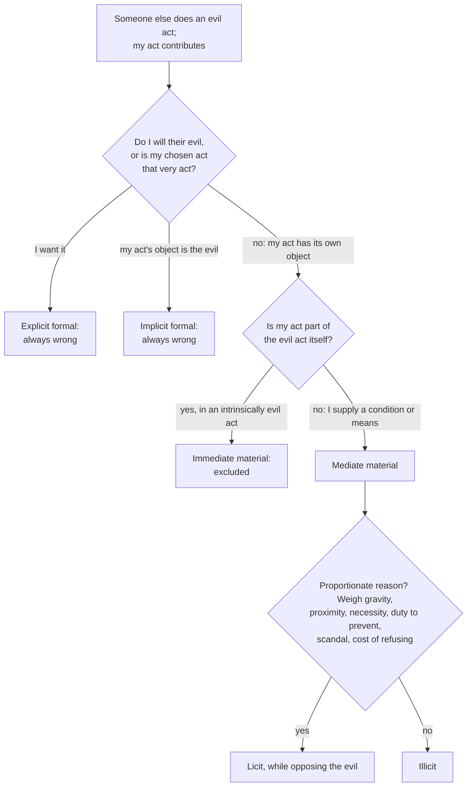

# Moral Theology · Lesson 4.2: Double effect and cooperation as Catholic method

> ⏱ ~15 min · Module 4: Method: from casuistry to *Veritatis Splendor* · Builds on: [3.5 Social sin and cooperation in the sins of others](03-05-social-sin-and-cooperation-in-the-sins-of-others.md), [4.1 Casuistry and the probabilism controversy](04-01-casuistry-and-the-probabilism-controversy.md), [`ethics` 3.2 The doctrine of double effect](../../ethics/lessons/03-02-the-doctrine-of-double-effect.md) · Unlocks: [4.3 Proportionalism and the fundamental option](04-03-proportionalism-and-the-fundamental-option.md), [4.5 Describing the object](04-05-describing-the-object.md)

## Why this matters

A surgeon removes a cancerous uterus that holds a living, pre-viable child. A cleaner sterilizes an operating theatre where abortions are done. A Catholic receives a vaccine developed with cell lines from abortions in the last century. The manual tradition had two tools for cases like these, and it used them more than any others: **double effect**, for evil that follows from *my own* act, and the principles of **cooperation**, for evil that *someone else* does with my help. [`ethics` 3.2](../../ethics/lessons/03-02-the-doctrine-of-double-effect.md) taught the first as a secular principle and tested it against its critics. This lesson teaches both as Catholic method: where they sit among the fonts of morality, what "direct" means in magisterial texts, and how the Congregation for the Doctrine of the Faith (CDF) used them in 2020.

## The idea

Two questions, one distinction.

**Am I doing the evil?** Some acts have an evil effect I foresee but do not choose, either as my goal or as my way to it. That is double effect.

**Am I helping someone else do evil?** Here the evil act belongs to another agent, and I supply something. That is cooperation.

Both run on the distinction [2.2](02-02-the-moral-object.md) built: what I *choose*, which is the object of my act, against what I *accept* as a side effect. The Catholic twist on the secular principle lies in that first word. Double effect never asks "what outcome do I want?" before it asks "what am I doing?" And some things one may not do for any outcome.

## Source

The root text is ST II-II q.64 a.7. `ethics` 3.2 read the opening of the *respondeo*. Read two other sentences here (English Dominican Province).

The close of the *respondeo*:

> "it is not lawful for a man to intend killing a man in self-defense, except for such as have public authority, who while intending to kill a man in self-defense, refer this to the public good"

And the reply to the fourth objection, which had argued that since no one may commit adultery to save his life, no one may kill to save it either:

> "The act of fornication or adultery is not necessarily directed to the preservation of one's own life, as is the act whence sometimes results the taking of a man's life."

The first sentence puts the private person's limit on **intending** the death, not on causing it. The killing may result, but it may not be what he is after. The second sentence carries a quieter principle. Aquinas does not answer that saving one's life is a weighty enough end to excuse anything. He answers from the *kind of act*. Defense is an act by nature "directed to" preserving life; adultery is not, whatever it might gain. Some acts are shut out before any weighing begins. That is the seed of the first manual condition.

## The argument

1. **An act is specified first by its object** ([the moral object](../reference.md#the-moral-object), [2.2](02-02-the-moral-object.md)). Some objects are evil in kind, and no end or circumstance makes choosing them good ([intrinsically evil acts](../reference.md#intrinsically-evil-acts), [4.4](04-04-veritatis-splendor.md)).
2. **An act can have effects outside its object.** They are foreseen, even certain, but "beside the intention" (q.64 a.7).
3. **The manual conditions.** The formula that became standard is usually traced to Jean-Pierre Gury's *Compendium theologiae moralis* (1850). His four conditions, paraphrased: (i) the agent's end is good; (ii) the act that causes the effects is good or indifferent in itself; (iii) the evil effect is not the means to the good effect; (iv) there is a proportionately grave reason. *In words:* a good aim, an act you may do, a harm that is no step in your plan, and a reason big enough to accept the harm. (The order and wording vary across manuals; `ethics` 3.2 uses a later four-part form, after Mangan's 1949 history, with the same content.)
4. **"Direct" and "indirect."** In magisterial usage, an evil is **direct** when it is willed as an end *or as a means*. CCC 2271 defines direct abortion in just those terms. It is **indirect** when it is the foreseen side effect of an act whose object is something else ([direct and indirect](../reference.md#direct-and-indirect)). *In words:* "direct" is a claim about the will's structure, not about physical immediacy or how soon the death follows.
5. **Cooperation.** Someone else, the principal agent, does an evil act, and my act contributes. The tradition's first cut is **formal against material** ([formal and material cooperation](../reference.md#formal-and-material-cooperation)):
   - **Formal**: I share the principal's evil will. It is **explicit** if I want the evil itself, and **implicit** if I say I disapprove but the very thing I choose to do is the evil act, or is ordered to it and nothing else.
   - **Material**: my act has its own object, and it contributes to the evil *beside my intention*.
6. **Material cooperation divides twice.** It is **immediate** if my act is part of the evil act itself, and **mediate** if I supply a condition or a means before or after it. It is **proximate** or **remote** by causal and moral distance.
7. **The verdicts.** Formal cooperation is always wrong. Immediate material cooperation in an intrinsically evil act cannot be told apart from choosing that act, so it is excluded as well. Mediate material cooperation is double effect's logic applied to someone else's sin: it is licit **for a proportionate reason**. That reason must grow with the gravity of the evil, the nearness of my contribution, whether the evil would happen without it, whether I have a duty to prevent it, and the risk of scandal ([3.5](03-05-social-sin-and-cooperation-in-the-sins-of-others.md)).
8. **Duress.** Fear lessens imputability ([2.1](02-01-the-voluntary.md)), and it can supply the proportionate reason for remote cooperation. It does not turn close help with grave evil into light matter. Among the laxist propositions Innocent XI condemned in March 1679 is the claim that a servant who, for fear of notable harm, helps his master climb through a window to rape a girl does not sin mortally (paraphrased; see [4.1](04-01-casuistry-and-the-probabilism-controversy.md)).

**Mark the levels.** That the direct killing of the innocent, and direct abortion, are always gravely wrong is taught in *Evangelium Vitae* 57 and 62. As a [standing test case](../reference.md#the-levels-in-moral-theology), these are commonly read as confirming the teaching of the ordinary universal magisterium, not as *ex cathedra* definitions. That formal cooperation in abortion is a grave offense is **authentic magisterium**, stated in CCC 2272 at the weight of the teaching it summarizes. The **four conditions as a formula**, and the whole **formal/material taxonomy**, are **common teaching**. No council or pope has defined them, though magisterial documents use them (*Dignitas Personae* 35; the 2020 note). **Particular verdicts** reached with them are common teaching where the manuals agreed (the hysterectomy below) and **freely disputed** where they did not (ectopic pregnancy, [4.5](04-05-describing-the-object.md)).

## The rule

## Worked examples

**Example 1: the cancerous gravid uterus.** A pregnant woman has invasive cancer of the uterus. The child is not yet viable, and the tumor will kill the mother before viability unless the uterus comes out now. Removing it will kill the child. Run Gury's conditions. (i) The end is to save the mother from the cancer. (ii) The act is the excision of a diseased organ, and its object is removing the cancer. (iii) The mother is saved by the cancer's removal, not by the child's death: if the child could somehow survive outside the womb, the operation would have fully succeeded. (iv) A mother's life is at stake, no alternative can wait, and the child cannot be saved either way. **Verdict: an indirect abortion, licit.** The manuals agreed on this, so it is **common teaching**. No magisterial act defines the verdict.

Now the minimal pair. A pregnant woman's heart disease makes the pregnancy itself a mortal threat, and the proposal is to empty the uterus. Here the relief comes *through* ending the pregnancy. The child's removal is the means, so the abortion is **direct** in the sense of CCC 2271, and it fails condition (iii). The stakes are as grave as in the first case. What differs is the structure of the will. Cases where that structure is hard to read (craniotomy, ectopic pregnancy) are [4.5](04-05-describing-the-object.md)'s business.

**Example 2: the 2020 note on vaccines, where the tool strains.** On 21 December 2020 the CDF published a note (Pope Francis had approved it at an audience on 17 December) on Covid-19 vaccines whose research or production used cell lines drawn from two abortions in the last century. Paraphrased, it held:

- where ethically unproblematic vaccines are not available, receiving these is **morally acceptable**;
- the recipient's cooperation is **passive material** and **remote**;
- the duty to avoid such cooperation does not bind when there is grave danger, such as the otherwise uncontainable spread of a serious pathogen;
- using the vaccines is **not formal cooperation**, does not legitimize abortion, and presupposes opposition to it;
- vaccination is not, as a rule, a moral obligation. It must be voluntary, and those who refuse in conscience must avoid spreading infection.

Run the tool. The principal evil is two completed abortions. The recipient does not will them, so the cooperation is not formal. His act, taking a vaccine, has its own object, so it is material. Nothing he does contributes to those abortions, so it is maximally remote. A pandemic supplies the grave reason. The note also takes over a distinction from *Dignitas Personae* 35: those who *decide* to use such cell lines bear more responsibility than those who have no say.

The strain is in the word "cooperation." One cannot contribute causally to an act finished decades ago. "Passive" marks exactly this: the recipient benefits from the evil but does not help it happen. Some moralists therefore prefer to call such cases *appropriation* of, or benefit from, evil. On that reading the real risks are scandal and demand for future use, which is why the note presses companies to make vaccines with no such ethical problem. **Level:** the note is authentic magisterium of a dicastery, approved for publication, applying common teaching to a case. Its verdict is **conditional**: it depends on unproblematic vaccines being unavailable.

## Watch out

- **"Double effect is a dogma" overstates.** The formula is common teaching from the manuals. The norm it serves, against direct killing of the innocent, carries *Evangelium Vitae*'s weight. Keep the two apart.
- **"Direct abortion is only a manual category" understates.** CCC 2271 uses it, and *Evangelium Vitae* 62 teaches that direct abortion is always gravely wrong.
- **"Material cooperation is always fine."** Only mediate material cooperation, and only with a proportionate reason. The 1679 servant was a material cooperator.
- **"I disapprove, so it's material."** If what you choose to do *is* the evil act (the surgeon "under protest"), you are the principal agent. If your act is ordered to it and nothing else, the cooperation is implicit formal.
- **Condition (iv) is not proportionalism.** Proportion enters only *after* condition (ii) has cleared the object. [4.3](04-03-proportionalism-and-the-fundamental-option.md) makes proportion decide the object itself, and that is where *Veritatis Splendor* objects.
- **The 2020 note does not make vaccination obligatory** and does not condemn objectors. It permits, under conditions.

## One-liner

> Ask first what you are doing, then whose evil it is. You may never choose evil as end or means, nor share another's evil will; foreseen evil and remote material help need a proportionate reason, and "direct" names the will's structure, not the scalpel's distance.

## Problems

**P1 (🟢)** *(Exegetical)* Four invented agents, each connected to the same elective abortion at a hospital. Classify each as **principal agent**, **explicit formal**, **implicit formal**, or **material** cooperation (for material, say immediate or mediate, proximate or remote). Then say whether the act is licit, illicit, or licit only given a proportionate reason. **Two sentences each.**

(a) The surgeon performs the abortion because the hospital rota assigns it to him, telling colleagues he disapproves.
(b) The patient's boyfriend urged the abortion and paid for it, because he does not want a child.
(c) The hospital administrator personally disapproves of abortion, but to win a government contract he writes and signs the policy under which the hospital schedules elective abortions.
(d) A cleaner sterilizes the operating theatres each night, including the one used for abortions among many other surgeries, because it is her job.

**P2 (🟡)** *(Exegetical)* An invented case. A storm has loaded a slope above a village with snow. The rescue chief can set off a controlled avalanche now, into an empty valley, or let a larger slide come down naturally within the hour onto the occupied village road. A lone skier who ignored the closure is in the valley and cannot be warned. The controlled slide will almost certainly kill him.

(a) Run Gury's four conditions and give the verdict. (b) Change the chief's reason so that the same slide, at the same time, fails the conditions. Name the condition it fails and say whether the killing becomes direct. (c) What level does your verdict in (a) carry? **120 words or fewer in total for (b) and (c).**

**P3 (🔴)** *(Exegetical)* An **invented** parish-bulletin paragraph, not the words of any real person:

> "The Vatican has now infallibly settled the vaccine question. Receiving these vaccines is formal cooperation in abortion, but it is excused because the pandemic makes it necessary. And since the abortions happened so long ago, there is no cooperation left to worry about, so every Catholic is obliged to take them."

Name **four** distinct errors and correct each from the 2020 note or this lesson. **150 words or fewer.**

Solutions

**P1** *(Exegetical)*

**Must hit, strict:**
- (a) **Principal agent**, not a cooperator. He does the abortion himself, so it is **direct** abortion, and his disapproval does not change the object. **Illicit.** Duress from the rota does not make it licit, though fear might lessen imputability (2.1).
- (b) **Explicit formal** cooperation: he wants the abortion and moves it along by urging and paying (CCC 1868: "ordering, advising"). **Illicit.**
- (c) **Implicit formal** cooperation. What he chooses, a policy for scheduling elective abortions, is ordered to abortions being done and to nothing else, whatever he feels about them. **Illicit.** The contract is a motive, and a motive cannot clean the object.
- (d) **Material, mediate and remote.** Cleaning is ordered to hygiene for every surgery, and the abortion does not depend on her. **Licit given a proportionate reason:** keeping her livelihood suffices here, provided there is no scandal and she does not approve.

**Wrong turns:** calling (a) "immediate material under duress"; he is not helping another's act, he is doing it. Calling (c) material because he disapproves, which is the "I disapprove, so it's material" error. Calling (d) illicit because *any* link to abortion taints, which erases the formal/material distinction.

**Model answer:** as above, two sentences each.

**P2** *(Exegetical)*

**Must hit, strict (a):** (i) the end, protecting the village road, is good. (ii) Releasing a snow load is in itself indifferent. (iii) The village is protected by moving the snow, not by the skier's death; had he left the valley, the plan would have fully succeeded. (iv) The lives on the road are grave, the natural slide is imminent, and no less harmful route exists. **Verdict: the death is indirect, and the act is licit.**

**Must hit, strict (b):** a reason that makes the death an end or a means. For example, the chief sets off the slide *to kill the skier* so that his death will deter future closure-breakers, or because the skier is his enemy. Killing him as a means to deterrence fails **(iii)**; killing him out of enmity makes the death the end itself and fails **(i)**. The killing becomes **direct**: willed as an end or as a means, the same sense as in CCC 2271.

**Must hit, strict (c):** **common teaching**, an application of the manual formula. No magisterial act rules on the case. The norm against *directly* killing the innocent is the magisterial part (*Evangelium Vitae* 57), and the verdict itself is not taught.

**Wrong turns:** failing (iv) because "one life is still a life". Proportion compares the stakes and the alternatives, and the village road outweighs it here. Calling (a) "taught by the Church". Saying the skier's fault makes his death permissible to intend. His fault may bear on (iv) but never on (iii).

**Model answer (b)–(c):** If the chief releases the slide at the same moment in order to make an example of the skier, the death becomes a means (to deterrence) and fails condition (iii). It is then direct killing. The (a) verdict is common teaching, not magisterial.

**P3** *(Exegetical)*

**Must hit, strict (four of):**
1. **"Infallibly settled"** overstates. The note is authentic magisterium of a dicastery, approved for publication, and applies common teaching to a case. Its verdict is conditional.
2. **"Formal cooperation, but excused"** is doubly wrong. The note says expressly that use is *not* formal cooperation, and formal cooperation is never excused by necessity.
3. **"No cooperation left"** misreads remoteness. The note still calls it *passive material* cooperation, and makes it licit only under conditions (grave danger, ethical vaccines unavailable), together with continued opposition to abortion.
4. **"Every Catholic is obliged"** contradicts the note: vaccination is not, as a rule, a moral obligation and must be voluntary. Objectors must avoid transmitting infection.
5. (Credit) The bulletin drops the note's call to companies and governments to provide ethically unproblematic vaccines.

**Wrong turns:** "correcting" the bulletin by saying use is illicit, which overshoots in the other direction. Treating remoteness as proportionate reason by itself; the grave danger supplies the reason.

**Model answer:** The note is not infallible. It is a CDF note approved for publication, applying common teaching, and its permission holds only where ethical vaccines are unavailable. It says use is *not* formal cooperation, and formal cooperation could never be excused by necessity anyway. Remoteness does not abolish cooperation: the note calls it passive material cooperation, licit given grave danger and continued opposition to abortion. And it says vaccination is not, as a rule, obligatory. It must be voluntary, though refusers must avoid spreading infection.

## Flashback

**From Lesson [3.5](03-05-social-sin-and-cooperation-in-the-sins-of-others.md) (Social sin and cooperation in the sins of others):** *(Exegetical.)* After his memory verse (command, counsel, consent, flattery, receiving, participation, silence, not preventing, not denouncing), Aquinas asks who must *restore* stolen goods (ST II-II q.62 a.7, English Dominican Province):

> in five of these cases the cooperator is always bound to restitution. First, in the case of command: because he that commands is the chief mover ... Secondly, in the case of consent; namely of one without whose consent the robbery cannot take place. Thirdly, in the case of receiving ... Fourthly, in the case of participation ... Fifthly, he who does not prevent the theft, whereas he is bound to do so ... the counsellor or flatterer is bound to restitution, only when it may be judged with probability that the unjust taking resulted from such causes.

His reply to the second objection adds: the commander is bound first, then the one who carried it out, then the others; and once one of them has restored the goods, the others are not bound to restore them again to the same person.

An invented case. Electronics worth 40,000 dollars vanish from a warehouse. **Dana**, the shift supervisor, ordered it. **Luis** loaded and drove the van, and kept a share. **Priya** had joked a week earlier, "you'd be fools not to", but the two had already planned it. **Sam**, the night security guard, watched the van leave and did nothing. **Ken**, Dana's brother-in-law, stored the goods in his garage.

(a) Who is always bound to restitution, who is not, and why? (b) Dana repays the full 40,000 dollars. Does Sam still owe the owner anything? **Two sentences per part.**

Solution

**Must hit, strict (a):** **Always bound:** Dana (**command**, the chief mover), Luis (**participation**, in the theft and the booty), Sam (**not preventing when bound**, since his office as guard creates the duty) and Ken (**receiving**, assisting the thieves). **Priya is not bound to restitution:** counsel and flattery bind only when the taking probably resulted from them, and the plan was already made. Her remark may still be a sin, but it did not cause this theft.

**Must hit, strict (b):** **No.** Once one party has restored the goods in full, the others are not bound to restore them again to the same owner. Restitution repairs the owner's loss; it is not a fine multiplied by the number of cooperators. Dana, as commander, was first in line anyway.

**Wrong turns:** binding Priya because counsel is on the list. The article makes counsel binding only when it is the probable cause. Letting Sam off as a bystander: the omission ways need a duty and an ability to act, and his post supplies both (3.5's "able and bound"). Letting the owner collect from each cooperator, which the article's second objection rules out.

**Model answer:** (a) Dana commanded, Luis took part and shared the booty, Sam failed to stop a theft his job bound him to stop, and Ken received and helped the thieves, so all four are always bound. Priya's joke was not the probable cause of a theft already planned, so she owes no restitution. (b) No: when one cooperator has restored the whole, the owner is made whole and the others owe him nothing further.

## Connections

- **Backward:** [3.5](03-05-social-sin-and-cooperation-in-the-sins-of-others.md) gave CCC 1868's ways of sharing in another's sin and the idea of scandal; this lesson turns them into a taxonomy with verdicts. [2.2](02-02-the-moral-object.md) supplies condition (ii), and [2.1](02-01-the-voluntary.md) supplies fear and imputability for duress. [4.1](04-01-casuistry-and-the-probabilism-controversy.md) is the casuistical setting of both the formula and the 1679 condemnations.
- **Forward:** [4.3](04-03-proportionalism-and-the-fundamental-option.md) asks what happens if condition (iv) swallows condition (ii). [4.5](04-05-describing-the-object.md) and Boss 4 take the cases where "direct" is hard to read. [5.3](05-03-euthanasia-and-the-end-of-life.md) uses double effect for pain relief. [`catholic-social-teaching`](../../catholic-social-teaching/syllabus.md) carries both tools into war, the economy and the state.
- **Sideways:** this is one principle in two settings. [`ethics` 3.2–3.3](../../ethics/lessons/03-03-testing-the-principles-on-trolleys.md) tests it as a secular rule against the closeness problem; here it answers to the moral object and to magisterial norms. The card: [double effect](../reference.md#double-effect).
